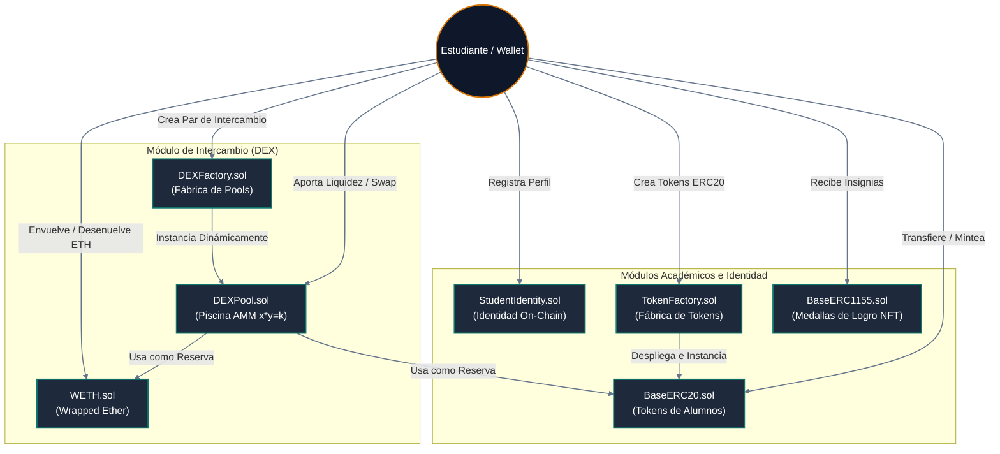
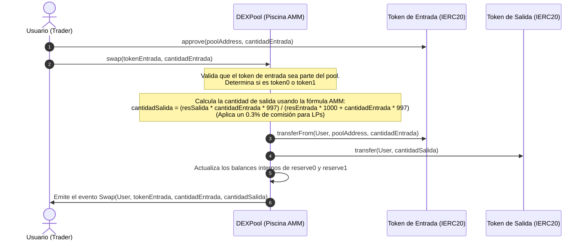
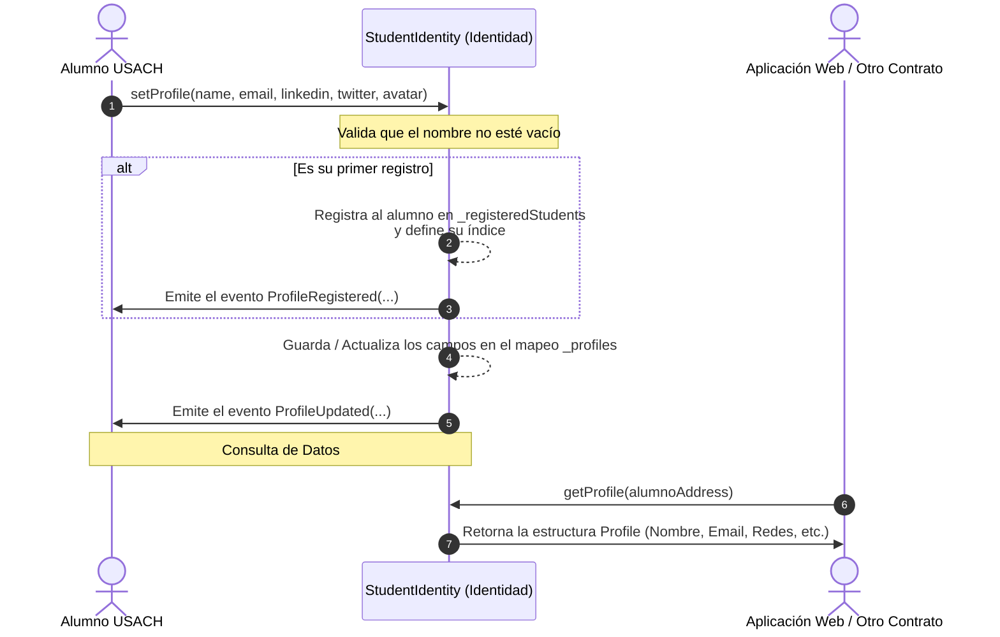

# Arquitectura y Relación de Contratos Inteligentes
## Diplomado en Blockchain y dApps — Universidad de Santiago de Chile (USACH)

Este documento proporciona una visión detallada, tanto a nivel conceptual como técnico, de la arquitectura de los contratos inteligentes contenidos en este repositorio. Los diagramas se han elaborado utilizando **Mermaid** para facilitar la comprensión de las relaciones, herencias, flujos de interacción y dependencias dentro del ecosistema de entrenamiento.

---

## 📌 1. Mapa General del Ecosistema

El siguiente diagrama muestra cómo interactúa un **Estudiante / Wallet** con los diferentes módulos disponibles en el sistema: la gestión de identidad, la creación de tokens personalizados y el entorno del **DEX (Decentralized Exchange)**.



---

## 🏛️ 2. Diagrama de Clases UML (Relación de Herencia y Composición)

Este diagrama detalla la estructura interna de los contratos desarrollados en el proyecto, destacando sus funciones, variables de estado clave, y la herencia de los contratos estándar de **OpenZeppelin**.

```mermaid
classDiagram
    direction TB

    %% Contratos Propios
    class StudentIdentity {
        -Profile[] _profiles
        -address[] _registeredStudents
        -mapping _studentIndex
        +setProfile(string name, string email, string linkedin, string twitter, string avatar) void
        +getProfile(address studentAddress) Profile
        +getAllRegisteredStudents() address[]
        +getStudentsCount() uint256
    }

    class BaseERC20 {
        +constructor(string name, string symbol, address initialOwner)
        +pause() void
        +unpause() void
        +mint(address to, uint256 amount) void
        #_update(address from, address to, uint256 value) void
    }

    class BaseERC1155 {
        +bytes32 URI_SETTER_ROLE
        +bytes32 MINTER_ROLE
        +constructor(address defaultAdmin, address minter)
        +setURI(string newuri) void
        +uri(uint256 id) string
        +mint(address account, uint256 id, uint256 amount, bytes data) void
        +mintBatch(address to, uint256[] ids, uint256[] amounts, bytes data) void
        #_update(address from, address to, uint256[] ids, uint256[] values) void
        +supportsInterface(bytes4 interfaceId) bool
    }

    class TokenFactory {
        -address[] _allTokens
        -mapping _tokensByOwner
        -mapping _isTokenCreatedByFactory
        +createToken(string name, string symbol, address initialOwner) address
        +getAllTokens() address[]
        +getTokensByOwner(address owner) address[]
        +isTokenCreated(address tokenAddress) bool
        +getTokensCount() uint256
    }

    class WETH {
        +string name
        +string symbol
        +uint8 decimals
        +mapping balanceOf
        +mapping allowance
        +receive() payable
        +deposit() payable
        +withdraw(uint256 wad) void
        +totalSupply() uint256
        +approve(address guy, uint256 wad) bool
        +transfer(address dst, uint256 wad) bool
        +transferFrom(address src, address dst, uint256 wad) bool
    }

    class DEXFactory {
        +mapping obtenerPool
        +address[] todosLosPools
        +crearPool(address tokenA, address tokenB) address
        +cantidadPools() uint256
    }

    class DEXPool {
        +address token0
        +address token1
        +uint256 reserve0
        +uint256 reserve1
        +constructor(address _token0, address _token1)
        +obtenerReservas() (uint256, uint256)
        #sqrt(uint256 y) uint256
        +agregarLiquidez(uint256 cantidad0Deseada, uint256 cantidad1Deseada) uint256
        +removerLiquidez(uint256 cantidadLP) (uint256, uint256)
        +swap(address tokenEntrada, uint256 cantidadEntrada) uint256
    }

    %% Relaciones de Creación y Uso
    TokenFactory ..> BaseERC20 : "Instancia (new)"
    DEXFactory ..> DEXPool : "Instancia (new)"
    DEXPool ..> IERC20 : "Interactúa usando la interfaz"
    
    %% Herencia de OpenZeppelin
    class ERC20 { <<OpenZeppelin>> }
    class ERC20Burnable { <<OpenZeppelin>> }
    class ERC20Pausable { <<OpenZeppelin>> }
    class ERC20Permit { <<OpenZeppelin>> }
    class Ownable { <<OpenZeppelin>> }
    class AccessControl { <<OpenZeppelin>> }
    class ERC1155 { <<OpenZeppelin>> }
    class ERC1155Burnable { <<OpenZeppelin>> }
    class ERC1155Supply { <<OpenZeppelin>> }
    class ReentrancyGuard { <<OpenZeppelin>> }

    BaseERC20 --|> ERC20
    BaseERC20 --|> ERC20Burnable
    BaseERC20 --|> ERC20Pausable
    BaseERC20 --|> ERC20Permit
    BaseERC20 --|> Ownable

    BaseERC1155 --|> ERC1155
    BaseERC1155 --|> AccessControl
    BaseERC1155 --|> ERC1155Burnable
    BaseERC1155 --|> ERC1155Supply

    DEXPool --|> ERC20
    DEXPool --|> ReentrancyGuard
```



---

## 🔄 3. Diagramas de Flujo y Secuencia

A continuación se detallan las interacciones clave que ocurren en la dApp de entrenamiento.

### A. Creación de Tokens ERC20 Académicos
Este flujo ilustra cómo un estudiante utiliza la fábrica global de tokens para desplegar su propio token ERC20 personalizado.

```mermaid
sequenceDiagram
    autonumber
    actor Estudiante as Estudiante / Usuario
    participant TF as TokenFactory (Fábrica)
    participant B20 as BaseERC20 (Instancia)

    Estudiante->>TF: createToken("Mi Token", "MTK", EstudianteAddress)
    Note over TF: Valida que la dirección del<br/>propietario no sea cero (0x0)
    create participant B20
    TF->>B20: new BaseERC20("Mi Token", "MTK", EstudianteAddress)
    Note over B20: Inicializa ERC20, ERC20Permit<br/>y asigna la propiedad (Ownable) al estudiante
    TF-->>TF: Registra la dirección del token en _allTokens,<br/>_tokensByOwner y _isTokenCreatedByFactory
    TF->>Estudiante: Emite el evento TokenCreated(tokenAddress, EstudianteAddress, "Mi Token", "MTK")
```

---

### B. Ciclo de Creación y Provisión del DEX
El flujo para registrar un nuevo par de intercambio en la fábrica e inyectar liquidez para que los tokens del pool queden operativos.

```mermaid
sequenceDiagram
    autonumber
    actor LP as Proveedor de Liquidez / Estudiante
    participant DF as DEXFactory (Fábrica)
    participant DP as DEXPool (Piscina AMM)
    participant T0 as Token 0 (IERC20)
    participant T1 as Token 1 (IERC20)

    Note over LP, DF: Fase 1: Creación del Pool
    LP->>DF: crearPool(TokenA, TokenB)
    Note over DF: Ordena tokens para mantener consistencia:<br/>token0 = min(TokenA, TokenB)<br/>token1 = max(TokenA, TokenB)
    Note over DF: Comprueba que no exista un pool para este par
    create participant DP
    DF->>DP: new DEXPool(token0, token1)
    DF-->>DF: Guarda la dirección en obtenerPool[token0][token1]<br/>y la añade al listado todosLosPools
    DF->>LP: Emite el evento PoolCreado(token0, token1, poolAddress, cantidadPools)

    Note over LP, DP: Fase 2: Inyección de Liquidez
    LP->>T0: approve(poolAddress, cantidad0)
    LP->>T1: approve(poolAddress, cantidad1)
    LP->>DP: agregarLiquidez(cantidad0Deseada, cantidad1Deseada)
    
    alt Es la primera vez que se agrega liquidez (Pool vacío)
        Note over DP: Calcula liquidez inicial = sqrt(cantidad0 * cantidad1)
    else Ya existe liquidez en la piscina
        Note over DP: Calcula la proporción óptima para mantener el precio:<br/>cantidad1Optima = (cantidad0 * reserve1) / reserve0<br/>Ajusta cantidades a depositar y calcula tokens LP proporcionales
    end

    DP->>T0: transferFrom(LP, poolAddress, cantidad0Efectiva)
    DP->>T1: transferFrom(LP, poolAddress, cantidad1Efectiva)
    DP->>DP: Acuña tokens LP (LP-USACH) para el proveedor
    DP->>LP: _mint(LP, liquidezEmitida)
    DP->>DP: Actualiza reservas (reserve0, reserve1) con los saldos reales
    DP->>LP: Emite el evento LiquidezAgregada(LP, cantidad0Efectiva, cantidad1Efectiva, liquidezEmitida)
```

---

### C. Proceso de Intercambio (Swap) en el DEX
Este diagrama describe cómo un usuario realiza el intercambio de un token por otro en una piscina AMM activa, aplicando la fórmula de producto constante y la comisión estándar.



---

### D. Registro y Consulta de la Identidad Académica
El flujo simplificado de cómo se asocian las direcciones Ethereum a los perfiles de los estudiantes on-chain.



---

## 🛠️ 4. Directrices de Diseño y Reglas Técnicas Clave

A continuación se resumen decisiones críticas de arquitectura implementadas en estos contratos para garantizar su seguridad y consistencia:

> [!NOTE]
> **Compatibilidad de Versión**: Todos los contratos se encuentran bajo el pragma `0.8.35` (o compatible en su rango), cumpliendo estrictamente con la configuración establecida en `hardhat.config.js`.

> [!IMPORTANT]
> **Manejo de Reentrancia en el DEX**: `DEXPool.sol` implementa la herencia de `ReentrancyGuard` de OpenZeppelin y utiliza el modificador `nonReentrant` en las funciones que modifican balances o transfieren tokens (`agregarLiquidez`, `removerLiquidez`, `swap`). Adicionalmente, sigue el patrón **Checks-Effects-Interactions** para actualizar los estados y reservas internas antes de realizar llamadas de transferencia externas.

> [!TIP]
> **Garantía de Unicidad de los Pools**: En `DEXFactory.sol`, la función `crearPool` realiza una ordenación alfanumérica de las direcciones de los tokens a emparejar (`token0 < token1`). Esto evita que se creen piscinas duplicadas para el mismo par de tokens en direcciones cruzadas (por ejemplo, tener un pool de TokenA/TokenB y otro independiente de TokenB/TokenA).
