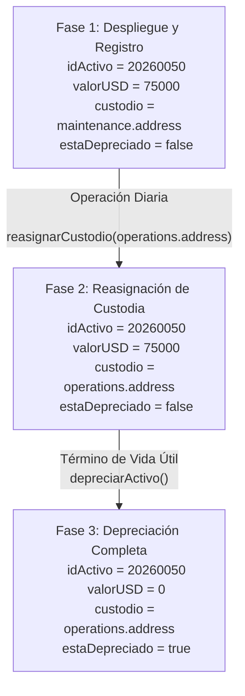
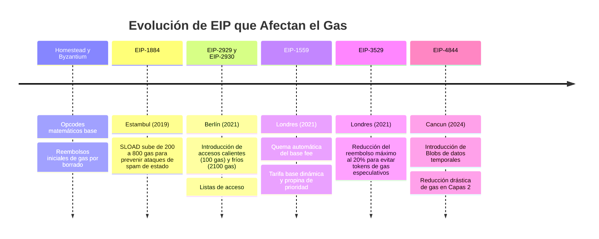

# Guía Académica Completa: Registro de Activos y Tipos de Datos de Valor en Solidity

Esta guía de estudio y análisis técnico tiene como propósito examinar de manera exhaustiva el funcionamiento del contrato inteligente `02_RegistroActivos.sol`, sirviendo como una herramienta pedagógica rigurosa para que los estudiantes del diplomado de la Universidad de Santiago de Chile logren comprender en profundidad la gestión de variables de estado de tipo valor, la inicialización del estado en tiempo de despliegue mediante el constructor, el empaquetamiento físico de las variables en los slots de almacenamiento de la Máquina Virtual de Ethereum, y las consecuencias económicas de los cambios de estado y los reembolsos de gas, lo que proporciona una base sólida para el diseño de sistemas corporativos descentralizados y eficientes.

El contrato de referencia que se analiza a lo largo de este documento es el siguiente:

```solidity
// SPDX-License-Identifier: MIT
pragma solidity 0.8.35;

/**
 * @title RegistroActivos
 * @dev Muestra cómo utilizar diferentes tipos de datos (números, booleanos, direcciones)
 * y cómo inicializarlos al crear el contrato mediante el Constructor.
 * Caso de negocio: Registrar la ficha básica de un activo fijo de la empresa (ej. maquinaria o un inmueble).
 */
contract RegistroActivos {
    // Identificador único del activo (Número entero sin signo)
    uint256 public idActivo;
    
    // Valor estimado en USD del activo (Número entero)
    uint256 public valorUSD;
    
    // Indica si el activo ya está completamente depreciado en los libros contables
    bool public estaDepreciado;
    
    // Dirección (wallet) del empleado responsable de la custodia del activo
    address public custodio;

    /**
     * @dev El constructor inicializa el estado del contrato al momento del despliegue.
     * @param _idActivo Código identificador del activo.
     * @param _valorUSD Valor inicial del activo.
     * @param _custodio Dirección de la cuenta del responsable.
     */
    constructor(uint256 _idActivo, uint256 _valorUSD, address _custodio) {
        idActivo = _idActivo;
        valorUSD = _valorUSD;
        custodio = _custodio;
        estaDepreciado = false; // Comienza sin estar depreciado
    }

    /**
     * @notice Permite depreciar el activo de forma definitiva.
     */
    function depreciarActivo() public {
        estaDepreciado = true;
        valorUSD = 0; // Al depreciarse por completo, su valor contable pasa a 0
    }

    /**
     * @notice Permite reasignar el custodio del activo.
     * @param _nuevoCustodio Dirección de la cuenta del nuevo responsable.
     */
    function reasignarCustodio(address _nuevoCustodio) public {
        custodio = _nuevoCustodio;
    }
}
```

A través de un desglose meticuloso de cada concepto, analizaremos cómo se comportan estas instrucciones a bajo nivel, estudiando los mecanismos internos de compilación, el empaquetamiento en memoria de almacenamiento y la interacción con los recursos físicos de los nodos que sostienen la red blockchain.

---

## Capítulo 1: Tipos de Datos de Valor (Value Types) y Representación Numérica en la EVM

El diseño conceptual y operativo del lenguaje Solidity expone una distinción de naturaleza fundamental y estructural entre los tipos de datos de valor y los tipos de datos de referencia, constituyendo los tipos de valor la base atómica del lenguaje al asegurar que las variables asignadas contengan físicamente sus propios datos en lugar de simples punteros a ubicaciones de memoria remotas, lo que se traduce en que cada vez que una variable de tipo valor se transfiere como argumento en la invocación de una función o se asigna a otra variable dentro del contrato el compilador ejecuta una copia física byte a byte de todo su contenido binario en una nueva ubicación independiente, garantizando de esta manera que las modificaciones posteriores que se realicen sobre el nuevo contenedor no tengan ningún impacto o repercusión sobre el valor de la variable original, lo que resulta esencial para mantener la integridad de los datos financieros y contables y proporciona una base de seguridad robusta para el diseño de registros como el que implementa nuestro contrato `RegistroActivos` con la variable `idActivo` y el valor estimado en dólares `valorUSD`.

Dentro del ecosistema de tipos de valor, los números enteros representan la categoría de mayor uso y trascendencia en la programación de contratos inteligentes al sustentar la práctica totalidad de la lógica contable, financiera y de control de identidades on-chain, motivo por el cual Solidity implementa un conjunto extremadamente rico y granular de tipos enteros que se dividen inicialmente entre enteros sin signo de la familia `uint` y enteros con signo de la familia `int`, donde la letra u inicial denota la ausencia de representación negativa en inglés, estando cada uno de estos tipos de datos subclasificado en incrementos de ocho bits que van desde un tamaño mínimo de ocho bits hasta alcanzar una capacidad máxima de doscientos cincuenta y seis bits, representados por las declaraciones `uint8` a `uint256` y de `int8` a `int256` respectivamente, lo que permite a los desarrolladores del diplomado ajustar con precisión quirúrgica el consumo de almacenamiento en función de los requerimientos operativos de sus aplicaciones.

Para comprender el comportamiento y la eficiencia de estos tipos de datos numéricos en tiempo de ejecución, es indispensable analizar la arquitectura interna de la Máquina Virtual de Ethereum, la cual está diseñada nativamente como una máquina virtual de pila con un tamaño de palabra de doscientos cincuenta y seis bits, lo que significa que todos los registros de procesamiento temporal de la pila lineal operan con este tamaño estándar y procesan palabras de treinta y dos bytes completos en cada instrucción.

Cuando el compilador de Solidity procesa una variable declarada como `uint256` o `int256` como las empleadas en nuestro contrato de registro, la EVM alinea y procesa esta información de forma directa y óptima puesto que la palabra de datos coincide exactamente con la anchura de la pila, evitando la necesidad de ejecutar instrucciones adicionales de filtrado o máscaras de bits para limpiar los segmentos superiores de la palabra, lo que contrasta sustancialmente con el uso de tipos de menor tamaño como `uint8` o `uint16` que a menudo requieren que el compilador inserte instrucciones de enmascaramiento y limpieza tras cada operación aritmética para garantizar que no existan bits sucios que puedan alterar el resultado de comparaciones posteriores, lo que paradójicamente incrementa el consumo de gas de CPU durante la ejecución de operaciones aritméticas a pesar de haber reducido teóricamente el espacio de almacenamiento utilizado.

La codificación de números enteros sin signo en palabras de doscientos cincuenta y seis bits se realiza mediante la transcripción binaria directa en base dos, de modo que cada bit representa una potencia de dos que se lee de derecha a izquierda partiendo desde el bit de menor peso en la posición cero hasta el bit de mayor peso en la posición doscientos cincuenta y cinco, alcanzando un valor máximo representable equivalente a la magnitud de dos a la potencia de doscientos cincuenta y seis menos uno, un límite numérico colosal que excede con creces la cantidad de átomos del universo observable y permite manejar con total seguridad identificadores únicos masivos o saldos monetarios astronómicos sin riesgo de agotar la capacidad de la variable.

Por su parte, la codificación de números enteros con signo de la familia `int` se implementa mediante el uso de la técnica aritmética del complemento a dos, en la cual el bit más significativo situado en el extremo izquierdo de la palabra de doscientos cincuenta y seis bits actúa como indicador de signo, de manera que si dicho bit es cero el valor se interpreta directamente como un entero positivo a través de los bits restantes, mientras que si el bit de signo es uno el valor se procesa como un número negativo cuyo valor absoluto se calcula restando la potencia correspondiente a ese bit más significativo del peso acumulado por el resto de los bits del registro, lo que define un rango de representación simétricamente balanceado que va desde un límite negativo mínimo equivalente a menos dos a la potencia de doscientos cincuenta y cinco hasta un límite positivo máximo igual a dos a la potencia de doscientos cincuenta y cinco menos uno.

El procesamiento de operaciones aritméticas sobre este modelo binario ha presentado históricamente desafíos de seguridad críticos en el ecosistema blockchain debido a la presencia del desbordamiento aritmético, un fenómeno que ocurre cuando una operación matemática arroja un resultado que supera los límites físicos de representación del tipo de datos declarados, regresando silenciosamente al inicio del rango numérico en un efecto de envoltura circular conocido como wrap-around.

En las versiones de Solidity anteriores a la cero punto ocho, el compilador ejecutaba las instrucciones matemáticas de la EVM sin realizar validaciones sobre el resultado, lo que provocaba que si una variable del tipo `uint256` con valor cero sufría una resta de una unidad, su valor se transformaba instantáneamente en el valor máximo de dos a la potencia de doscientos cincuenta y seis menos uno sin que el entorno de ejecución arrojase ninguna alerta o error, lo que constituyó la causa raíz de numerosos hackeos históricos devastadores en el ecosistema financiero descentralizado.

Uno de los incidentes más célebres de esta naturaleza ocurrió en abril de doscientos dieciocho con el contrato inteligente del token ERC20 de la plataforma Beauty Chain, identificado técnicamente con las siglas BEC, donde un atacante explotó un fallo de desbordamiento en una multiplicación para acuñar una cantidad astronómica de tokens de la nada.

El código vulnerable del token BEC permitía a los usuarios realizar transferencias múltiples a un arreglo de direcciones mediante una función que multiplicaba la cantidad de tokens a enviar por el número de destinatarios de la transferencia, y debido a que el contrato utilizaba Solidity cero punto cuatro y carecía de validación de desbordamiento para esa multiplicación específica, el atacante ingresó una cantidad de tokens extremadamente alta de forma que al multiplicarla por el número de direcciones destinatarias el resultado de la operación sufrió un overflow y retornó un valor de cero a la variable que representaba el total de tokens a debitar de su balance personal.

Dado que el contrato validaba únicamente que el remitente tuviese un saldo mayor o igual al coste total calculado, y este coste total se había desbordado y convertido en cero, la verificación de saldo fue exitosa a pesar de que el remitente no poseía fondos, lo que permitió que la función ejecutara el ciclo de transferencia y acreditara sumas masivas de tokens reales a las cuentas destinatarias del atacante mientras que a su balance se le restó únicamente cero, devaluando instantáneamente el token a cero y provocando la pérdida total de la confianza del mercado en el proyecto, lo que resalta con rigor académico la importancia de contar con validaciones de desbordamiento en el desarrollo de software seguro.

Para combatir este riesgo de seguridad sin forzar la sobrecarga de gas en cada operación, la comunidad de desarrollo de Ethereum adoptó de forma masiva la biblioteca `SafeMath` desarrollada por OpenZeppelin, la cual implementaba funciones matemáticas envolventes que sustituían a los operadores aritméticos básicos mediante llamadas internas que realizaban verificaciones condicionales utilizando la instrucción `require` después de cada cálculo.

Aunque la biblioteca `SafeMath` resolvió con éxito las vulnerabilidades de desbordamiento al revertir la transacción en caso de overflow o underflow, su implementación a nivel de biblioteca de Solidity implicaba un encarecimiento notable del consumo de gas en las transacciones debido a la necesidad de realizar llamadas de salto en la pila, duplicar elementos para comparaciones de control y evaluar la instrucción `JUMPI` en cada paso matemático básico, lo que penalizaba el rendimiento operativo de los contratos financieros complejos.

La transformación fundamental en la gestión de este problema se introdujo formalmente en la versión cero punto ocho de Solidity, donde el compilador asumió la responsabilidad de incorporar estas comprobaciones aritméticas directamente en el flujo de bytecode generado, eliminando la necesidad de bibliotecas externas y garantizando la seguridad por defecto en todas las operaciones del lenguaje.

Cuando compilemos nuestro contrato `RegistroActivos` con el compilador de la versión `0.8.35` y la EVM ejecute una suma o una resta, el bytecode resultante incluirá instrucciones de control que evalúan de manera matemática si los operandos cumplen con las reglas de límites del tipo de datos, de modo que si se detecta un desbordamiento, la EVM detiene la ejecución y revierte todos los cambios realizados en la transacción enviando una firma de error específica conocida como Panic Error, codificada en hexadecimal como `0x4e487b71` y acompañada del código numérico `0x11` para indicar un desbordamiento aritmético sistemático.

Este mecanismo de protección por defecto proporciona una gran tranquilidad lógica para el desarrollador, aunque introduce un coste adicional de procesamiento que puede resultar redundante si la aritmética está acotada lógicamente por el diseño del contrato, como sucede comúnmente en la actualización de índices de control de bucles iterativos que están limitados por el tamaño de arreglos pequeños.

Para permitir a los desarrolladores optimizar estos costes computacionales y omitir las validaciones aritméticas en segmentos de código de alta seguridad, Solidity ofrece el bloque `unchecked`, el cual le indica explícitamente al compilador que desactive las validaciones de desbordamiento para todas las operaciones aritméticas que se declaren en su interior, permitiendo retornar al comportamiento físico directo de la EVM con envoltura circular silenciosa.

El uso del bloque `unchecked` debe reservarse para optimizaciones avanzadas de gas donde se cuente con demostraciones lógicas formales de que las variables no pueden desbordarse, permitiendo ahorrar las instrucciones de bifurcación condicional y las comparaciones lógicas en la pila de ejecución, lo que reduce las tarifas de procesamiento pagadas por los usuarios y mejora la escalabilidad de las dApps comerciales sin comprometer la seguridad del sistema.

---

## Capítulo 2: Tipos de Datos Booleanos y Operaciones Lógicas en la EVM

El tipo de datos booleano, definido en el código de Solidity mediante la palabra clave `bool`, representa la estructura de control lógico más simple posible dentro de un contrato inteligente al admitir únicamente dos estados conceptuales que son verdadero, expresado como `true`, y falso, expresado como `false`, lo que en nuestro contrato de ejemplo se aplica directamente en la variable de estado `estaDepreciado` para indicar si el activo fijo corporativo ha alcanzado el término de su vida contable útil y ha visto reducido su valor a cero en los libros de la organización.

Para comprender cómo gestiona la Máquina Virtual de Ethereum esta variable booleana, es necesario examinar las diferencias existentes en la representación de los datos según la ubicación física en la que se encuentren procesando, puesto que el compilador de Solidity aplica criterios de optimización del espacio de almacenamiento físico que contrastan sustancialmente con el comportamiento dinámico de la pila de ejecución y la memoria lineal durante el procesamiento de una transacción.

En el almacenamiento persistente del contrato, conocido como storage y guardado en los discos de todos los nodos validadores de la red blockchain, una variable de tipo booleano se almacena físicamente utilizando un solo byte de espacio, de manera que el valor falso se codifica como el valor hexadecimal `0x00` y el valor verdadero se representa mediante el valor hexadecimal `0x01`, lo que permite un ahorro significativo de espacio al posibilitar que múltiples variables lógicas y numéricas pequeñas compartan una única ranura de almacenamiento de treinta y dos bytes, reduciendo el volumen de datos históricos que la red debe mantener y disminuyendo los costes de gas pagados por los usuarios en las transacciones que modifican estos estados lógicos del sistema.

Sin embargo, cuando una variable de tipo booleano se recupera del storage mediante una instrucción de lectura `SLOAD` para ser procesada en la pila de la EVM o se define como una variable local en la memoria volátil, la Máquina Virtual de Ethereum expande este byte de datos para ocupar una palabra completa de doscientos cincuenta y seis bits, es decir, treinta y dos bytes completos alineados con ceros a la izquierda, debido a que la pila de la EVM opera exclusivamente con elementos de este tamaño y no cuenta con registros de procesamiento intermedios de menor capacidad, lo que se traduce en que tanto un booleano como un entero de tamaño máximo se procesan con las mismas instrucciones de apilamiento y manipulación aritmética dentro del entorno de ejecución de bajo nivel.

Esta disparidad entre el almacenamiento compacto de un byte y el procesamiento en palabras de treinta y dos bytes introduce la necesidad de un mecanismo de seguridad crítico implementado por el compilador de Solidity denominado limpieza de bits o Bit Cleaning, el cual tiene como propósito fundamental proteger la lógica de ejecución del contrato inteligente contra posibles corrupciones de datos o inyecciones de código malicioso que intenten alterar las evaluaciones condicionales del programa.

El problema que resuelve el Bit Cleaning surge porque la Máquina Virtual de Ethereum, al ejecutar operaciones condicionales basadas en bifurcaciones o al evaluar si un valor es verdadero, considera técnicamente como verdadero cualquier valor binario que sea diferente de cero, de forma que valores hexadecimales como `0x02`, `0x0f` o `0xff` se interpretarían como verdaderos si se procesaran de forma directa por ciertas instrucciones lógicas de la EVM, lo que podría ocurrir si un atacante lograra escribir datos no validados en los slots de almacenamiento utilizando ensamblador en línea o interactuando con variables de estado sin pasar por las restricciones de compilación del código de alto nivel.

Para evitar que estos valores binarios anómalos corrompan la ejecución del contrato y alteren decisiones financieras o de negocio, el compilador de Solidity genera de forma automática instrucciones de limpieza en el bytecode antes de realizar cualquier comparación lógica o de escribir una variable booleana de vuelta al almacenamiento, de modo que cuando el contrato evalúa una variable booleana o la asigna como ocurre al establecer `estaDepreciado = true` en la función `depreciarActivo()`, la EVM ejecuta operaciones de enmascaramiento binario como una operación `AND` lógica contra la máscara `0x01`, asegurando de manera absoluta que todos los bits de orden superior de la palabra de la pila se limpien y queden en cero, y garantizando que el único bit superviviente sea el de menor peso, lo que restringe el valor procesado a los estados binarios estrictos de `0x00` o `0x01` y previene de forma nativa fallos de seguridad catastróficos que podrían derivar de la presencia de bytes sucios en la pila.

Adicionalmente, el procesamiento de expresiones lógicas complejas que involucran múltiples variables booleanas y operadores condicionales como la conjunción lógica, representada por `&&`, y la disyunción lógica, representada por `||`, está sujeto a una estrategia de optimización del compilador conocida como evaluación en cortocircuito o Short-circuit evaluation, la cual tiene un impacto directo sobre la cantidad de gas que consume una transacción al evitar la ejecución de operaciones computacionales redundantes o lecturas del almacenamiento innecesarias.

La regla de evaluación en cortocircuito establece que, al procesar una conjunción lógica donde se requiere que ambas condiciones sean verdaderas para que el resultado sea verdadero, si la primera condición evaluada por la EVM resulta ser falsa, el entorno de ejecución aborta inmediatamente el procesamiento del resto de la expresión y asume que el resultado general es falso sin evaluar la segunda condición, lo que en términos de gas resulta extraordinariamente beneficioso si la segunda condición involucra una llamada a otro contrato, una consulta a una variable de estado del storage mediante `SLOAD`, o una operación matemática compleja que de otro modo consumiría recursos del procesador del nodo.

De manera equivalente, en el caso de una disyunción lógica donde basta con que una sola de las condiciones sea verdadera para que toda la expresión sea verdadera, si la primera variable evaluada resulta ser verdadera, la EVM no evalúa las condiciones posteriores y salta directamente a la bifurcación de código correspondiente, lo que exige a los desarrolladores estructurar sus expresiones condicionales colocando siempre en primer lugar aquellas variables lógicas que sean más económicas de leer, como variables locales de la pila o parámetros de entrada de la función, y situando al final de la expresión las lecturas de variables de estado complejas o llamadas externas, logrando así optimizar el consumo de recursos de la red y reducir las tarifas pagadas por los usuarios de la dApp.

---

## Capítulo 3: El Tipo de Datos Dirección (Address) y el Modelo de Identidad de Ethereum

La gestión de identidades y la autorización de operaciones en la blockchain de Ethereum se estructuran formalmente mediante el tipo de datos dirección, declarado en Solidity mediante la palabra clave `address`, el cual actúa como un valor de tipo valor que representa un identificador físico de veinte bytes de longitud, equivalente a ciento sesenta bits de información expresados comúnmente como una cadena de texto en formato hexadecimal con el prefijo `0x`, sirviendo en nuestro contrato `RegistroActivos` para definir la variable `custodio` que apunta a la cuenta del empleado o departamento corporativo encargado de la salvaguarda física y contable de los bienes de la empresa.

A nivel de la Máquina Virtual de Ethereum, una dirección es simplemente un número entero sin signo de ciento sesenta bits que se procesa en la pila de ejecución alineado dentro de una palabra completa de doscientos cincuenta y seis bits mediante el relleno con ceros a la izquierda, aunque en la sintaxis de alto nivel del lenguaje Solidity existe una distinción semántica de gran relevancia para la seguridad del contrato que divide a este tipo en dos categorías específicas que son `address` simple y `address payable`.

La diferencia fundamental entre ambas categorías radica en los privilegios y las funciones de transferencia que el compilador habilita para cada una de ellas en tiempo de compilación, de manera que el tipo `address` se limita a actuar como un identificador de cuenta que permite consultar el saldo de ether o realizar llamadas de bajo nivel sin transferencia de valor, mientras que el tipo `address payable` representa una cuenta habilitada para recibir transferencias directas de criptomoneda al exponer métodos nativos adicionales como `.transfer()` y `.send()`.

Esta separación fue introducida para prevenir fallos accidentales de diseño donde un desarrollador pudiese enviar fondos a cuentas o contratos que carecieran de la lógica necesaria para procesar o recuperar el ether, obligando a que cualquier conversión entre una dirección simple y una dirección payable se realice de forma explícita mediante la sintaxis `payable(direccion)`, lo que alerta visualmente en el código sobre la existencia de un flujo financiero de salida.

Los métodos asociados a las direcciones en Solidity permiten interactuar con el estado financiero y operativo de las cuentas de la red, de modo que al invocar la propiedad `.balance` sobre cualquier dirección la EVM ejecuta de forma interna la instrucción de bytecode `BALANCE`, la cual consulta el estado global de la blockchain y extrae el saldo actual en unidades wei asociado a esa dirección, mientras que los métodos de transferencia `.transfer()` y `.send()` realizan el envío de fondos limitando de forma estricta la cantidad de gas transferida a la cuenta receptora a un máximo de dos mil trescientas unidades de gas, un límite históricamente diseñado para impedir que contratos maliciosos ejecutasen ataques de reentrada durante la recepción del ether al no disponer de suficiente gas para realizar llamadas de vuelta al contrato emisor.

No obstante, esta restricción de gas ha sido objeto de revisión debido a las actualizaciones en las tarifas de procesamiento de la red, lo que ha impulsado la adopción del método de llamada de bajo nivel `.call()` con la sintaxis `direccion.call{value: cantidad}("")` para transferencias financieras comunes, puesto que este método no impone un límite de gas arbitrario y transmite por defecto el gas remanente de la transacción, retornando una variable booleana que indica el éxito o fracaso de la ejecución y un buffer de bytes con los datos de retorno, lo que exige al programador validar el resultado explícitamente mediante un condicional para evitar que la ejecución continúe si el envío de fondos ha fallado.

Para comprender la procedencia y naturaleza de estas identidades, es indispensable estudiar los mecanismos criptográficos y algorítmicos mediante los cuales se derivan las direcciones en Ethereum, diferenciando entre las cuentas de propiedad externa conocidas como EOA y las direcciones asignadas a los contratos inteligentes durante su despliegue en la red.

En el caso de las Cuentas de Propiedad Externa, que representan cuentas controladas directamente por usuarios humanos a través de la posesión de un par de claves criptográficas, la dirección se deriva a partir del algoritmo de firma digital de curva elíptica secp256k1, donde se genera en primer lugar una clave privada aleatoria de doscientos cincuenta y seis bits a partir de la cual se calcula una clave pública de quinientos doce bits que consta de dos coordenadas de doscientos cincuenta y seis bits asociadas a los ejes de la curva matemática.

Una vez obtenida esta clave pública binaria, se le aplica la función de hash criptográfico Keccak-256 para generar un resumen digital de treinta y dos bytes, y finalmente la dirección pública de la cuenta se extrae tomando de forma exclusiva los últimos veinte bytes de este hash, descartando los doce bytes iniciales de mayor peso, lo que establece un vínculo criptográfico unidireccional e inalterable que permite verificar la autenticidad de las firmas de las transacciones sin revelar bajo ninguna circunstancia la clave privada que originó la identidad.

Por otro lado, las direcciones asociadas a los contratos inteligentes no disponen de un par de claves privadas y se calculan de forma algorítmica por los nodos validadores al procesarse la transacción de creación, existiendo dos métodos diferenciados que determinan el grado de predictibilidad de la dirección resultante.

El método tradicional, ejecutado por la instrucción de bajo nivel `CREATE` y empleado por defecto cuando un desarrollador despliega un contrato de forma directa o instancia un nuevo objeto mediante la palabra clave `new`, calcula la dirección del nuevo contrato aplicando el hash Keccak-256 a la codificación Recursive Length Prefix del par ordenado compuesto por la dirección del contrato creador o de la cuenta emisora y su nonce de transacciones, correspondiendo el nonce al número de transacciones enviadas si el emisor es una EOA o a la cantidad de contratos creados previamente si es otro contrato inteligente, lo que implica que la dirección resultante depende estrechamente del historial transaccional previo y dificulta la predicción exacta de la ubicación física en despliegues complejos que involucren múltiples redes de prueba y producción.

Para resolver esta limitación de predictibilidad, la propuesta de mejora EIP-1014 introdujo la instrucción de bajo nivel `CREATE2`, la cual permite calcular la dirección del contrato de manera enteramente determinista e independiente del nonce del emisor, calculando el hash Keccak-256 de una secuencia binaria que contiene el byte de prefijo `0xff`, la dirección de la cuenta o contrato creador, un valor numérico de treinta y dos bytes denominado salt suministrado por el programador, y el hash Keccak-256 del bytecode de creación del contrato que se desea desplegar, lo que faculta a los diseñadores de protocolos para predecir con exactitud absoluta la dirección física donde residirá un contrato inteligente antes de realizar la transacción de despliegue, facilitando integraciones off-chain y el diseño de canales de pago o arquitecturas basadas en fábricas de contratos.

La Máquina Virtual de Ethereum expone instrucciones para evaluar estas direcciones en tiempo de ejecución, de modo que el bytecode del contrato puede usar la instrucción `EXTCODESIZE` para consultar el tamaño en bytes del runtime bytecode de una dirección determinada, asumiendo de manera clásica que si este valor es cero la cuenta corresponde a una EOA puesto que carece de código ejecutable asociado en la base de datos de estado, y considerando que si es mayor que cero corresponde a un contrato inteligente desplegado.

Sin embargo, esta validación lógica presenta una vulnerabilidad de seguridad importante si se emplea para restringir llamadas procedentes de contratos, debido a que durante la ejecución del constructor de un contrato inteligente la instrucción `EXTCODESIZE` evaluada sobre su propia dirección retorna cero debido a que el runtime bytecode aún no ha sido devuelto por la instrucción `RETURN` ni guardado físicamente en la base de datos del estado global por el nodo validador, lo que permite a un contrato saltarse controles de acceso basados en esta comprobación si realiza la llamada interactiva directamente desde el cuerpo de su constructor.

Para gestionar la procedencia de las llamadas con garantías de seguridad, Solidity expone dos variables globales de identidad que son `msg.sender`, la cual representa la dirección directa que invoca la función del contrato en el paso actual de ejecución de la pila y que varía si la llamada pasa de un contrato a otro en una cadena de ejecuciones, y `tx.origin`, la cual apunta a la Cuenta de Propiedad Externa que firmó originalmente la transacción y dio inicio a la secuencia computacional en la red, constituyendo un riesgo crítico de seguridad el uso de `tx.origin` para autenticar permisos de administración, puesto que un atacante puede desplegar un contrato intermedio y convencer al administrador del sistema para que interactúe con él, provocando que el contrato intermedio llame al contrato protegido y eluda la validación debido a que `tx.origin` seguirá siendo la dirección del administrador que inició la secuencia, lo que hace que la buena práctica académica exija el uso exclusivo de `msg.sender` para la autorización de accesos en el desarrollo de dApps.

---

## Capítulo 4: El Constructor y el Ciclo de Vida del Despliegue de Contratos

La inicialización del estado financiero y operativo de un contrato inteligente representa una de las fases más críticas en el ciclo de vida del software en la blockchain, gestionándose de manera nativa mediante una función de inicialización especial denominada constructor, la cual se declara en el código fuente de Solidity con la palabra clave `constructor` y cuya ejecución se restringe de forma estricta a un único momento durante toda la existencia del contrato, coincidiendo de forma exacta con la transacción de despliegue en la red, lo que en nuestro contrato de referencia se ilustra mediante el constructor que toma como parámetros de entrada las variables `_idActivo`, `_valorUSD` y `_custodio` para constituir el registro inicial del activo corporativo.

Para analizar rigurosamente este comportamiento, es indispensable comprender la diferencia física que existe a nivel de bytecode entre el código que se transmite a la red durante el proceso de creación del contrato y el código definitivo que queda guardado de manera persistente en la blockchain de Ethereum, estructurándose estas representaciones binarias en dos bloques perfectamente diferenciados que son el bytecode de creación, comúnmente conocido en inglés como initcode, y el bytecode de ejecución, denominado runtime bytecode.

Cuando un desarrollador ejecuta la transacción de despliegue del contrato `RegistroActivos`, el payload o datos de entrada de la transacción se envían a una dirección vacía que se codifica como nula en el campo del receptor, indicándole a la red que la transacción tiene como objetivo crear un nuevo contrato, y este payload contiene en su totalidad el initcode, el cual constituye un programa de arranque temporal compuesto por el código binario del constructor compilado, la lógica de inicialización del compilador de Solidity, y los argumentos específicos que el usuario ha ingresado para los parámetros de entrada alineados e individualizados al final del mensaje de acuerdo con las especificaciones de la interfaz binaria de la aplicación.

Al recibir esta transacción, la Máquina Virtual de Ethereum no guarda el contenido del payload directamente en el almacenamiento de código del estado global, sino que inicializa un entorno de ejecución transitorio con una memoria limpia y ejecuta secuencialmente las instrucciones contenidas en el initcode, de forma que el programa de arranque comienza por localizar los argumentos del constructor que viajan anexados al final del flujo de bytes.

Dado que estos argumentos no forman parte del cuerpo de instrucciones ejecutables, el compilador genera un patrón de código de bajo nivel que utiliza la instrucción `CODESIZE` para determinar el tamaño total del initcode cargado en el entorno de ejecución, y posteriormente emplea la instrucción `CODECOPY` para extraer estos bytes de datos desde el segmento de código y copiarlos a la memoria dinámica volátil del contrato en las direcciones libres apuntadas por el puntero de memoria libre, permitiendo que la lógica del constructor lea los parámetros de entrada y realice las asignaciones de estado correspondientes.

Durante esta fase de ejecución del constructor en el entorno temporal de la EVM, se procesan las instrucciones que asignan valores a las variables de estado que residen en el storage permanente del contrato, de modo que en nuestro caso la EVM ejecuta instrucciones `SSTORE` para escribir el identificador único en el slot cero, el valor financiero estimado en el slot uno, y la dirección del custodio junto al valor lógico falso en el slot dos, completando la configuración del estado inicial del registro corporativo.

Una vez que la lógica del constructor ha finalizado todas las asignaciones y configuraciones requeridas por el programador, el initcode ejecuta un proceso de retorno final utilizando la instrucción de bytecode `RETURN`, la cual toma dos parámetros de la pila que representan el desplazamiento inicial en memoria y el tamaño en bytes del runtime bytecode que ha sido copiado y preparado por el compilador en una sección contigua de la memoria dinámica durante el proceso de arranque.

La instrucción `RETURN` transfiere estos bytes de runtime bytecode de vuelta al protocolo de consenso de Ethereum, de manera que los nodos validadores toman esta secuencia binaria devuelta y la graban físicamente en la base de datos de estado global asociada a la dirección del contrato recién creado, convirtiéndose este runtime bytecode en el código permanente que se ejecutará cada vez que un usuario invoque funciones como `depreciarActivo()` o `reasignarCustodio()`.

De este diseño se deriva una consecuencia arquitectónica fundamental que los estudiantes del diplomado de la Universidad de Santiago de Chile deben asimilar con precisión técnica, puesto que el código del constructor y la lógica de arranque del initcode quedan descartados al completarse el despliegue y nunca se guardan en la base de datos de código persistente de la dirección del contrato, lo que hace que sea físicamente imposible volver a invocar el constructor o re-inicializar las variables del contrato mediante transacciones subsiguientes en contratos que no implementen patrones de proxy avanzados, garantizando la inmutabilidad absoluta de las reglas de constitución inicial que el creador del contrato definió en el momento del despliegue.

---

## Capítulo 5: Estructura del Almacenamiento Físico (Storage Layout) del Contrato RegistroActivos

El almacenamiento de estado de un contrato inteligente en la red Ethereum representa el recurso más costoso y limitado del entorno de ejecución descentralizado, de modo que comprender cómo organiza físicamente el compilador de Solidity las variables declaradas en el código fuente resulta indispensable para que los estudiantes del diplomado de la Universidad de Santiago de Chile diseñen contratos eficientes y optimizados contra el consumo excesivo de gas de las transacciones.

El almacenamiento persistente de cada contrato inteligente, conocido técnicamente como storage, se organiza como un inmenso espacio lineal direccionable que consta de dos a la potencia de doscientos cincuenta y seis ranuras de almacenamiento numeradas de forma secuencial comenzando desde el slot cero, donde cada una de estas ranuras, denominadas slots, tiene una capacidad exacta de treinta y dos bytes, equivalentes a doscientos cincuenta y seis bits de información binaria.

Para ubicar las variables de estado del contrato `RegistroActivos`, el compilador de Solidity implementa una serie de reglas de empaquetamiento estáticas que analizan secuencialmente cada campo declarado en el contrato de arriba hacia abajo, intentando agrupar múltiples variables consecutivas dentro de una misma ranura de treinta y dos bytes si la suma de sus tamaños físicos en bytes no supera este límite, lo que optimiza el uso del almacenamiento y reduce las lecturas y escrituras de disco de los nodos.

En el contrato `RegistroActivos`, las variables de estado se distribuyen de la siguiente forma a lo largo de los slots de almacenamiento físicos:

La primera variable de estado declarada es `idActivo`, la cual es un entero sin signo del tipo `uint256`, un tipo de datos que ocupa la totalidad de los treinta y dos bytes de capacidad de una ranura de almacenamiento, lo que obliga al compilador a asignarle en exclusividad el **Slot 0** del storage del contrato, rellenando por completo esta posición sin dejar espacio libre para variables adicionales.

La segunda variable de estado es `valorUSD`, la cual se declara de forma consecutiva con el tipo `uint256`, ocupando de manera análoga otros treinta y dos bytes completos y requiriendo que el compilador le asigne la ranura de almacenamiento inmediatamente posterior, correspondiente al **Slot 1** del contrato inteligente.

La optimización más relevante y didáctica de este layout se manifiesta al analizar las variables restantes, que son el booleano `estaDepreciado` y la dirección `custodio`, las cuales se declaran consecutivamente en el código fuente y tienen tamaños de un byte y veinte bytes respectivamente.

Dado que la suma de sus tamaños es de veintiún bytes, un valor que se sitúa holgadamente por debajo del límite de treinta y dos bytes de una ranura de almacenamiento, el compilador aplica las reglas de empaquetamiento de storage o Storage Packing y posiciona ambas variables dentro de una misma ranura física, correspondiente al **Slot 2** del contrato.

La disposición interna de las variables dentro del **Slot 2** sigue un ordenamiento que sitúa los elementos de derecha a izquierda, es decir, desde los bits de menor peso hacia los de mayor peso del slot, de modo que la primera variable declarada, que es `estaDepreciado`, se coloca en el byte de menor peso del slot, correspondiente al byte cero situado en el extremo derecho de la representación binaria.

A continuación, la dirección `custodio` se posiciona inmediatamente a la izquierda del booleano, ocupando los bytes que van desde la posición uno hasta la posición veinte del slot, lo que deja libres los últimos once bytes del Slot 2, correspondientes a las posiciones veintiuno a treinta y uno de mayor peso, los cuales se rellenan con bytes con valor cero para completar la palabra.

Este empaquetamiento de variables de estado de tipo valor en el Slot 2 posee importantes consecuencias para el coste de procesamiento de las funciones, presentando ventajas e inconvenientes a nivel de gas que deben analizarse detalladamente desde el punto de vista del diseño de software en Web3.

La ventaja principal de esta disposición se observa en transacciones que necesitan modificar o escribir ambas variables en la misma secuencia de ejecución, puesto que la EVM puede actualizar el Slot 2 completo mediante una única instrucción de escritura `SSTORE`, evitando el cobro de una segunda operación de escritura que duplicaría el coste de gas si las variables estuviesen en slots separados.

Por el contrario, la desventaja de este diseño se manifiesta en operaciones de lectura individual de una de estas variables empaquetadas, debido a que la Máquina Virtual de Ethereum carece de instrucciones nativas para leer un byte o veinte bytes directamente del storage y debe ejecutar obligatoriamente la instrucción `SLOAD` para cargar los treinta y dos bytes completos del Slot 2 en la pila de ejecución.

Una vez cargada la palabra completa en la pila, el compilador debe inyectar instrucciones adicionales de manipulación de bits en el bytecode para aislar y limpiar la variable que el usuario desea consultar, de forma que si se requiere leer la variable `estaDepreciado` la EVM realiza una operación lógica `AND` con la máscara `0xff` para extraer el primer byte, mientras que para recuperar la dirección `custodio` la EVM debe desplazar los bits de la palabra ocho posiciones hacia la derecha mediante la instrucción de bajo nivel `SHR 8` para eliminar el byte del booleano y luego aplicar una máscara lógica de ciento sesenta bits con una operación `AND` para limpiar los once bytes superiores sobrantes del slot.

Este conjunto de instrucciones adicionales de desplazamiento y enmascaramiento incrementa levemente la carga de computación en la CPU del nodo, aunque este coste marginal de gas es despreciable en comparación con las miles de unidades de gas que se ahorran al evitar una lectura `SLOAD` de disco adicional, lo que demuestra que el empaquetamiento de almacenamiento constituye una herramienta de optimización de gran eficacia que los programadores de Solidity deben emplear estratégicamente al agrupar variables de estado que interactúan con frecuencia en las mismas funciones del contrato.

---

## Capítulo 6: Mutabilidad del Estado, Ejecución de Funciones y Reembolsos de Gas

La ejecución de funciones en un contrato inteligente de Ethereum representa un proceso computacional dinámico donde las transacciones modifican el estado global de la blockchain a través de la reescritura de los slots de almacenamiento, lo que en el contrato `RegistroActivos` se observa al invocar las funciones públicas `depreciarActivo()` y `reasignarCustodio()`, requiriendo un análisis riguroso sobre la mecánica de costes de gas, la distinción entre accesos fríos y calientes en el almacenamiento, y las políticas de incentivos y reembolsos implementadas por el protocolo de Ethereum para gestionar el crecimiento del estado.

Cuando un usuario envía una transacción para ejecutar la función `depreciarActivo()`, la EVM realiza dos modificaciones de estado diferenciadas en el almacenamiento persistente, estableciendo en primer lugar el booleano `estaDepreciado` como verdadero dentro del Slot 2, y modificando en segundo lugar el valor numérico de la variable `valorUSD` a cero en el Slot 1.

Para calcular el coste exacto de estas operaciones de escritura mediante la instrucción `SSTORE`, la EVM aplica las reglas de tarificación establecidas por las propuestas de mejora de Ethereum, distinguiendo entre slots fríos, que son aquellos que no han sido accedidos en la transacción actual y cuyo coste de acceso inicial es elevado debido a la necesidad de leer la información física de los discos del nodo, y slots calientes, que ya han sido leídos o escritos previamente en la transacción y residen en el caché del validador con un coste marginal de procesamiento.

De acuerdo con el estándar EIP-2929, la primera escritura en un slot frío tiene un recargo de gas que refleja la carga física de la lectura del disco de base de datos, de modo que cuando la función accede al Slot 1 para establecer `valorUSD` en cero o al Slot 2 para modificar el booleano, la EVM cobra una tarifa inicial que varía sustancialmente según el estado previo de las ranuras, resultando de vital importancia comprender que si un slot ya contenía un valor distinto de cero y se actualiza a otro valor, la operación se procesa con una tarifa fija reducida tras el primer acceso frío, mientras que si una ranura de almacenamiento se modifica para cambiar su estado de cero a un valor no nulo, la tarifa de escritura inicial asciende a miles de unidades de gas para penalizar el crecimiento de la base de datos de estado.

El aspecto técnico más singular de la función `depreciarActivo()` es la asignación `valorUSD = 0`, la cual representa la liberación de una ranura de almacenamiento al eliminar el valor numérico previo del activo y establecerlo en cero, lo que activa en la Máquina Virtual de Ethereum un mecanismo financiero denominado reembolso de gas o Gas Refund.

Este reembolso fue diseñado en los inicios del protocolo para incentivar a los desarrolladores de contratos inteligentes a limpiar las variables de estado que ya no fuesen necesarias y a destruir contratos obsoletos, liberando espacio físico en los discos duros de los nodos de la red y mitigando el crecimiento exponencial del tamaño de la base de datos global.

Históricamente, los reembolsos de gas eran tan elevados que permitían subsidiar hasta el cincuenta por ciento del coste de procesamiento de las transacciones, lo que provocó el desarrollo de prácticas de arbitraje de mercado como los denominados tokens de gas, los cuales eran contratos que escribían datos masivos en el almacenamiento cuando el precio de red del gas estaba muy barato y los borraban liberando los slots cuando el gas subía de precio, permitiendo reducir artificialmente el coste de transacciones complejas en momentos de alta congestión.

Para erradicar estas ineficiencias de mercado y estabilizar los tiempos de propagación de bloques en la red, la bifurcación London de Ethereum implementó el estándar EIP-3529, el cual modificó profundamente el mercado de reembolsos al eliminar las compensaciones por autodestrucción de contratos y limitar el reembolso máximo por escrituras a cero a una tarifa fija reducida de cuatro mil ochocientas unidades de gas, imponiendo además un límite matemático estricto que restringe el reembolso aplicable a un máximo del veinte por ciento del gas consumido durante toda la transacción.

Esto implica que, aunque un desarrollador limpie docenas de variables de estado y libere una inmensa cantidad de slots en una transacción sencilla, el descuento final reflejado en la tarifa de la transacción no podrá superar esta quinta parte del coste computacional total, lo que resalta la importancia de diseñar arquitecturas eficientes desde el origen y evitar la dependencia de subsidios de reembolso para garantizar la viabilidad económica de las operaciones corporativas.

Por otro lado, al ejecutar la función `reasignarCustodio(address _nuevoCustodio)`, el contrato inteligente debe modificar la variable `custodio` que comparte el Slot 2 con la variable lógica `estaDepreciado`.
A nivel del bytecode de la EVM, la actualización de una variable que se encuentra empaquetada dentro de un slot compartido requiere que el entorno de ejecución realice un proceso de reconstrucción de la palabra de treinta y dos bytes antes de ejecutar la instrucción `SSTORE`, de manera que la EVM lee en primer lugar el contenido completo del Slot 2 cargando el booleano y el custodio actual en la pila de ejecución.

Una vez cargada la palabra, la EVM emplea instrucciones lógicas para enmascarar y limpiar de forma exclusiva los veinte bytes correspondientes a la dirección antigua, inserta los bits correspondientes a la dirección del nuevo custodio recibida en el parámetro `_nuevoCustodio` manteniendo inalterable el primer byte del booleano, y finalmente ejecuta la instrucción `SSTORE` para escribir la nueva palabra combinada de vuelta en el Slot 2 del storage.

Este proceso de lectura, enmascaramiento y escritura evita la necesidad de escribir en dos ranuras físicas independientes y ahorra miles de unidades de gas de almacenamiento a cambio de un consumo insignificante de operaciones de CPU en la pila, lo que ilustra cómo el compilador de Solidity prioriza el ahorro de recursos de almacenamiento físico frente a la micro-optimización de instrucciones aritméticas locales en el hardware virtual de la red.

---

## Capítulo 7: Patrones de Diseño, Gobernanza y Vulnerabilidad en el Control de Acceso

La digitalización de procesos corporativos en la blockchain exige un análisis detallado sobre la correspondencia entre los roles del mundo real y las variables lógicas de los contratos inteligentes, de forma que el diseño del contrato `RegistroActivos` propone un patrón de custodia administrativa simple mediante la variable `custodio` que asocia el control y la responsabilidad de un activo fijo a una dirección Ethereum determinada, lo que representa una aproximación didáctica inicial para el modelado de inventarios corporativos descentralizados.

Sin embargo, desde el punto de vista del desarrollo de software seguro y la gobernanza de sistemas de contabilidad empresarial, la implementación de las funciones del contrato `RegistroActivos` presenta deficiencias conceptuales críticas que constituyen una excelente oportunidad de aprendizaje para los estudiantes del diplomado de la Universidad de Santiago de Chile, permitiendo ilustrar la necesidad absoluta de implementar mecanismos de restricción y control de accesos on-chain.

El riesgo de seguridad principal en `RegistroActivos.sol` radica en la visibilidad y accesibilidad de las funciones mutadoras `depreciarActivo()` y `reasignarCustodio(address)`, las cuales se declaran de manera pública y carecen de cualquier tipo de validación sobre la identidad de la cuenta que inicia la llamada.

Puesto que no existe ninguna instrucción condicional `require` o modificador que evalúe si el emisor de la transacción, representado por `msg.sender`, posee la autorización contable o legal para alterar el registro, cualquier cuenta de propiedad externa o contrato inteligente conectado a la red Ethereum puede ejecutar estas funciones con éxito, lo que permitiría a un actor malicioso o un competidor depreciar unilateralmente la maquinaria o el inmueble de la empresa reduciendo su valor contable a cero, o transferir la custodia legal del activo a una dirección no autorizada de forma inalterable y persistente.

Esta ausencia total de control de acceso convierte al contrato en una estructura vulnerable para su aplicación práctica en entornos de negocio, sirviendo no obstante como un preámbulo didáctico fundamental que justifica y motiva el estudio del siguiente contrato de la clase, correspondiente al `03_ControlAccesoBasico.sol`, donde se introduce el uso de políticas de autorización activa y modificadores para restringir las operaciones críticas del sistema a cuentas previamente autorizadas.
Para solventar esta debilidad de gobernanza, el diseño del contrato inteligente podría evolucionar mediante la incorporación de diversos patrones de seguridad estandarizados por la industria del desarrollo de software en Web3, existiendo opciones que varían en complejidad y flexibilidad de acuerdo con los requerimientos específicos de la organización.

La solución más sencilla consiste en implementar la cláusula de validación `require` dentro de las funciones mutadoras para evaluar si el remitente coincide con el custodio actual, utilizando la sintaxis `require(msg.sender == custodio, "No autorizado")` para garantizar que únicamente la persona directamente responsable del activo pueda delegar su custodia en un nuevo empleado o certificar la depreciación contable ante la red.

Una alternativa más robusta implica la adopción del patrón de propiedad o Ownership, en el cual el contrato declara una variable de estado adicional para registrar la dirección de un administrador o propietario general, inicializada típicamente en el constructor con la dirección de la cuenta que despliega el contrato, y define un modificador personalizado que bloquea la ejecución de las funciones críticas a cualquier cuenta que no coincida con este administrador.

Por último, para organizaciones con estructuras de gobierno jerárquicas y dinámicas, la buena práctica aconseja delegar la seguridad en sistemas de control de acceso basados en roles o Access Control mediante el uso de estándares abiertos de OpenZeppelin Contracts, lo que permitiría definir roles diferenciados como auditores contables con permisos exclusivos para depreciar activos y gestores de recursos humanos autorizados para reasignar custodios, proporcionando una base operativa segura y escalable que protege los registros corporativos contra accesos no autorizados sin perder los beneficios de transparencia y auditoría descentralizada de la tecnología blockchain.

---

## Capítulo 8: Manual Completo de la EVM y Opcodes del Contrato

La comprensión profunda de Solidity a nivel de ingeniería de sistemas requiere el análisis minucioso de las instrucciones binarias que el compilador genera para ser interpretadas por la Máquina Virtual de Ethereum, de modo que cada operación matemática, declaración de variables, control de flujo y consulta de identidades se traduce en un flujo secuencial de códigos de operación conocidos como opcodes, los cuales manipulan físicamente la pila de ejecución, el almacenamiento persistente de storage y la memoria temporal volátil de los nodos de la red.

En esta sección se detallan de forma exhaustiva los opcodes fundamentales de la EVM que intervienen en la inicialización y ejecución del contrato `RegistroActivos`, explicando sus funciones técnicas, los recursos de hardware que consumen y cómo interactúan entre sí durante el procesamiento de una transacción:

### 1. Opcodes de Empuje en la Pila: PUSH1 a PUSH32

La Máquina Virtual de Ethereum carece de registros de propósito general como los presentes en arquitecturas x86 o ARM, estructurando su procesamiento temporal exclusivamente en torno a una pila lineal de tipo LIFO (Last In, First Out) que puede albergar hasta un máximo de mil veinticuatro elementos de doscientos cincuenta y seis bits cada uno, lo que implica que cualquier valor numérico, dirección de memoria, selector de función o puntero de salto de código debe ser cargado explícitamente en el extremo superior de la pila antes de que pueda ser utilizado por otra instrucción.

Para cargar estos literales o constantes en la pila, el compilador emplea la familia de opcodes de empuje que van desde `PUSH1` hasta `PUSH32`, donde el número del opcode determina el número exacto de bytes que se leen a continuación del código de operación dentro del bytecode de ejecución, cargando de esta forma valores de un byte con `PUSH1` para variables pequeñas como el booleano `estaDepreciado`, o palabras completas de treinta y dos bytes con `PUSH32` para almacenar hashes Keccak-256 o constantes numéricas máximas.

El consumo de gas de la familia `PUSH` es de tres unidades de gas por cada instrucción, lo que representa una de las operaciones más económicas y frecuentes del procesador virtual al no requerir accesos a la memoria lineal ni al almacenamiento en disco de los nodos validadores.

Cuando el compilador de Solidity procesa una constante numérica pequeña, como el valor cero utilizado para restablecer `valorUSD = 0` en la función `depreciarActivo()`, genera la instrucción `PUSH1 0x00`. Esta instrucción lee el byte `0x00` que se encuentra inmediatamente después del opcode de empuje en la memoria de código y lo coloca en el extremo superior de la pila. 

Si el contrato necesita cargar una variable más grande, como una dirección o una constante de 32 bytes, el compilador utilizará opcodes de empuje superiores. Por ejemplo, la dirección del custodio inicial requerirá una instrucción `PUSH20` seguida de los 20 bytes correspondientes a la dirección Ethereum. En la representación física del bytecode, los opcodes de empuje se distinguen por su rango hexadecimal de `0x60` (para `PUSH1`) hasta `0x7f` (para `PUSH32`).

### 2. Opcodes de Acceso al Storage: SLOAD y SSTORE

Las instrucciones de lectura y escritura en el almacenamiento persistente representan las operaciones físicas más críticas, lentas y costosas de toda la Máquina Virtual de Ethereum, debido a que el storage del contrato no reside en los registros de procesamiento de los chips sino que se graba en los discos duros de estado sólido de todos los nodos que sostienen la red blockchain a través de bases de datos estructuradas en árboles de Merkel-Patricia como LevelDB o RocksDB.

El opcode `SLOAD` (cuyo código hexadecimal es `0x54`) tiene como función técnica leer una palabra completa de treinta y dos bytes desde una ranura de almacenamiento específica, tomando como argumento de la pila el número del slot que se desea consultar y depositando de vuelta el valor recuperado en el extremo superior de la pila, presentando un coste de gas que ha sido incrementado sistemáticamente a lo largo de las actualizaciones del protocolo para reflejar la carga real de entrada y salida del hardware, cobrándose una tarifa elevada de dos mil cien unidades de gas si el slot consultado se encuentra frío al ser accedido por primera vez en la transacción, y reduciéndose a únicamente cien unidades de gas si el slot ya se encuentra caliente en el caché de la EVM.

Por su parte, el opcode `SSTORE` (cuyo código hexadecimal es `0x55`) representa la operación de mayor impacto económico al encargarse de escribir o modificar permanentemente una ranura de almacenamiento persistente, tomando de la pila el número del slot y el nuevo valor de treinta y dos bytes que se desea grabar.

El coste de `SSTORE` es dinámico y altamente complejo al depender del estado de la ranura de almacenamiento y el valor previo que contenía:

*   **Creación de Estado (Clean to Dirty)**: Si escribimos en un slot de almacenamiento que anteriormente estaba vacío (es decir, contenía el valor cero) y le asignamos un valor diferente de cero, la EVM cobra una tarifa de veinte mil unidades de gas para penalizar la adición de nuevos datos a la base de datos de estado global de la red. Esto ocurre, por ejemplo, cuando el constructor escribe inicialmente el identificador único del activo fijo en el Slot 0.
*   **Modificación de Estado (Dirty to Dirty)**: Si modificamos una ranura de almacenamiento que ya contenía un valor diferente de cero y le asignamos otro valor diferente de cero, el coste se reduce a cinco mil unidades de gas, puesto que no estamos incrementando el tamaño total de la base de datos de estado global, sino únicamente actualizando un registro existente. Esto ocurre cuando invocamos `reasignarCustodio(address)` para cambiar la dirección del responsable.
*   **Restablecimiento de Estado (Dirty to Clean)**: Si modificamos una ranura de almacenamiento que contenía un valor diferente de cero y le asignamos el valor cero (como al establecer `valorUSD = 0` en `depreciarActivo()`), la EVM cobra una tarifa reducida de modificación pero otorga al final de la transacción un reembolso de gas por liberar espacio de almacenamiento. Este reembolso ayuda a incentivar la limpieza de la base de datos, aunque está sujeto al límite máximo del veinte por ciento del consumo total de la transacción impuesto por la propuesta EIP-3529.
*   **Acceso a Slot Frío vs. Caliente**: Bajo las reglas de la EIP-2929, si el slot modificado no ha sido accedido previamente en la transacción, se le añade un recargo de dos mil cien unidades de gas al coste base de la escritura, cobrándose únicamente cien unidades de gas adicionales si el slot ya se encuentra caliente.

### 3. Opcodes de Gestión de Memoria Volátil: MLOAD, MSTORE y MSTORE8

La EVM dispone de un espacio de memoria dinámico, lineal y direccionable por bytes que se crea al inicio de cada transacción y se destruye inmediatamente al completarse la ejecución, sirviendo como un espacio temporal de trabajo para estructurar los datos de retorno de las funciones, decodificar parámetros ABI y preparar argumentos para llamadas a otros contratos.

El opcode `MSTORE` (cuyo código hexadecimal es `0x52`) se encarga de escribir una palabra de treinta y dos bytes completos en una dirección específica de la memoria dinámica, tomando de la pila la dirección de memoria de destino y el valor a escribir, mientras que el opcode `MSTORE8` (cuyo código hexadecimal es `0x53`) realiza la misma operación pero limitando la escritura a un único byte de datos, lo que resulta de gran utilidad para codificaciones compactas o manipulaciones de cadenas de texto cortas.

Por el contrario, el opcode `MLOAD` (cuyo código hexadecimal es `0x51`) lee una palabra de treinta y dos bytes a partir del desplazamiento de memoria indicado en la pila, cargando el contenido en la pila de ejecución.

El coste de gas de estas operaciones de memoria es de tres unidades de gas por acceso básico, aunque la EVM cobra una tarifa adicional por la expansión de la memoria. La memoria lineal de la EVM está estructurada en incrementos de palabras de 32 bytes, y cuando el contrato escribe o lee en una posición que supera el límite del espacio de memoria previamente inicializado, la EVM expande automáticamente la memoria disponible.

El coste de esta expansión es lineal para los primeros segmentos de memoria pero se incrementa de forma cuadrática a medida que el tamaño acumulado se vuelve muy grande. Esta penalización cuadrática desincentiva el uso ineficiente de grandes desplazamientos de memoria que forzarían a los nodos a reservar cantidades excesivas de memoria RAM física durante la simulación de las transacciones. El compilador de Solidity organiza este espacio temporal mediante el uso del puntero de memoria libre, el cual se almacena de forma inalterable en la ranura de memoria `0x40` al inicio de la ejecución.

### 4. Opcodes de Carga de Parámetros de Transacción: CALLDATALOAD, CALLDATASIZE y CALLDATACOPY

Cuando un cliente o una dApp externa interactúa con el contrato `RegistroActivos` enviando una transacción para llamar a una función, los parámetros de entrada y el selector de función se transmiten dentro de una sección de datos de la transacción denominada calldata, la cual representa una memoria de solo lectura que la EVM no puede modificar.

Para recuperar esta información e introducirla en el flujo de ejecución, el compilador genera instrucciones basadas en el opcode `CALLDATALOAD` (cuyo código hexadecimal es `0x35`), el cual toma de la pila un desplazamiento en bytes y carga una palabra de treinta y dos bytes desde la calldata de la transacción a la pila de ejecución, permitiendo extraer de forma secuencial variables como el `_idActivo` o la dirección del `_custodio`.

El opcode `CALLDATASIZE` (cuyo código hexadecimal es `0x36`) no requiere argumentos y deposita en la pila el tamaño total en bytes del calldata recibido, lo que se utiliza de forma constante por el despachador de funciones para validar que el mensaje contiene al menos los cuatro bytes del selector de función o el tamaño mínimo requerido para los parámetros esperados.

Por último, el opcode `CALLDATACOPY` (cuyo código hexadecimal es `0x37`) copia un segmento continuo de la calldata directamente a la memoria volátil del contrato, requiriendo tres argumentos en la pila que definen el desplazamiento de destino en memoria, el desplazamiento de origen en calldata y la cantidad de bytes a copiar, presentando un coste de gas proporcional al volumen de datos copiados.

### 5. Opcodes de Duplicación e Intercambio: DUP1 a DUP16 y SWAP1 a SWAP16

Dado que la pila de la EVM restringe el acceso directo únicamente al elemento situado en el extremo superior de la pila, cualquier operación que requiera reutilizar una variable intermedia o modificar el orden de los datos para alineararlos con los operandos de una instrucción matemática exige el uso de opcodes de duplicación e intercambio.

La familia de opcodes `DUP1` a `DUP16` (cuyo rango hexadecimal va de `0x80` a `0x8f`) toma un elemento situado en una de las primeras dieciséis posiciones de la pila y realiza una copia exacta que se coloca en el extremo superior, duplicando de este modo valores que deben ser evaluados en múltiples comparaciones consecutivas sin destruir el registro original.

De forma equivalente, la familia `SWAP1` a `SWAP16` (cuyo rango hexadecimal va de `0x90` a `0x9f`) intercambia la posición del elemento superior de la pila con el elemento situado en la posición indicada por el número del opcode, permitiendo reposicionar variables y reordenar argumentos antes de la ejecución de una instrucción del procesador.

Estas instrucciones consumen únicamente tres unidades de gas y son vitales para la optimización fina del bytecode al permitir que el compilador gestione eficientemente el limitado espacio de la pila.

Sin embargo, esta estructura de pila introduce una limitación crítica en el desarrollo de Solidity conocida como el error "Stack too deep" (pila demasiado profunda). Debido a que la EVM dispone únicamente de códigos de operación `DUP` y `SWAP` para los primeros dieciséis niveles de la pila, si una función de Solidity declara demasiadas variables locales o recibe muchos parámetros de entrada, el compilador no podrá generar instrucciones de bajo nivel para acceder a las variables situadas más allá de la posición dieciséis.

Para solucionar este error, los estudiantes deben emplear buenas prácticas de programación Web3, tales como:
*   Agrupar variables locales relacionadas dentro de estructuras de datos (`struct`).
*   Dividir las funciones complejas en funciones auxiliares más pequeñas y acotadas.
*   Utilizar bloques locales de código delimitados por llaves `{}` para obligar a que las variables locales temporales salgan del alcance y sean removidas de la pila antes de declarar variables nuevas.

### 6. Opcodes de Aritmética y Comparación Matemática: ADD, SUB, MUL, DIV, SDIV, LT, GT, SLT, SGT y EQ

La pila de la EVM implementa de forma directa las operaciones matemáticas básicas sobre palabras de doscientos casi cincuenta y seis bits, extrayendo los dos operandos superiores de la pila y depositando de vuelta el resultado de la operación.

Los opcodes `ADD` (`0x01`), `SUB` (`0x03`) y `MUL` (`0x02`) realizan la suma, resta y multiplicación binaria sin signo respectivamente con un coste de tres unidades de gas, mientras que `DIV` (`0x04`) realiza la división entera sin signo y `SDIV` (`0x05`) realiza la misma operación pero considerando el signo de las palabras codificadas en complemento a dos con un coste de cinco unidades de gas.

Para las operaciones lógicas de control de flujo, los opcodes de comparación evalúan si un elemento es menor que otro con `LT` (`0x10`) o mayor que otro con `GT` (`0x11`) en operaciones sin signo, y emplean `SLT` (`0x12`) y `SGT` (`0x13`) para comparaciones con signo donde se evalúa el bit de mayor peso en complemento a dos, depositando en la pila un uno lógico si se cumple la condición o un cero si es falsa.

El opcode `EQ` (`0x14`) evalúa la igualdad exacta de dos palabras de la pila, utilizándose sistemáticamente en el despachador de funciones para comparar el selector del mensaje recibido con los selectores de función soportados por el contrato.

### 7. Opcodes Lógicos y de Operaciones de Bits: AND, OR, XOR, NOT, SHL y SHR

La manipulación binaria a nivel de bits resulta indispensable para el empaquetamiento de variables pequeñas dentro de un mismo slot de storage, utilizándose de forma intensiva por el compilador para enmascarar valores y desplazar registros en la pila.

The opcode `AND` (`0x16`) realiza la conjunción lógica bit a bit entre dos palabras, utilizándose para aplicar máscaras que limpian segmentos de datos y aíslan variables como el booleano `estaDepreciado` del Slot 2, mientras que el opcode `OR` (`0x17`) realiza la disyunción lógica combinando valores de diferentes variables para empaquetarlos en un solo Slot antes de una escritura.

Los opcodes `SHL` (`0x1b`) y `SHR` (`0x1c`) desplazan los bits de una palabra hacia la izquierda o hacia la derecha respectivamente por la cantidad de posiciones indicadas en la pila, lo que se traduce en multiplicaciones o divisiones rápidas por potencias de dos y permite desplazar la dirección del `custodio` dentro del Slot 2 para alineararla correctamente con los bytes superiores de la ranura.

### 8. Opcodes de Control de Flujo y Bifurcación: JUMP, JUMPI y JUMPDEST

El flujo de ejecución del bytecode en la EVM es estrictamente secuencial al avanzar el puntero de programa una instrucción a la vez, a menos que se invoque una instrucción de salto que altere la dirección del puntero.

El opcode `JUMP` (`0x56`) extrae la dirección de destino de la pila y transfiere la ejecución de forma incondicional a ese punto del bytecode, mientras que el opcode `JUMPI` (`0x57`) realiza un salto condicional al requerir dos argumentos de la pila que representan la dirección de destino y una variable de condición, saltando únicamente si la variable de condición es diferente de cero y continuando con la instrucción siguiente si es cero.

Para garantizar la seguridad de la ejecución y evitar saltos a secciones de datos o código malicioso, la EVM impone la restricción absoluta de que el punto de destino de cualquier salto `JUMP` o `JUMPI` debe contener de forma obligatoria el opcode `JUMPDEST` (`0x5b`). El opcode `JUMPDEST` actúa como un marcador de posición que no realiza ninguna operación computacional pero valida la legitimidad de la dirección de salto, abortando la transacción inmediatamente con un error de ejecución si el puntero de programa intenta saltar a una instrucción que no sea un `JUMPDEST`.

### 9. Opcodes de Finalización y Retorno: REVERT, INVALID y RETURN

La conclusión de una transacción en la Máquina Virtual de Ethereum puede ocurrir de forma exitosa o fallida, existiendo opcodes diferenciados para notificar cada uno de estos estados al protocolo de consenso.

El opcode `RETURN` (`0xf3`) finaliza la ejecución con éxito y devuelve un segmento de datos al emisor, tomando de la pila el desplazamiento inicial en memoria y el tamaño de los datos devueltos, lo que se utiliza por las funciones de lectura o vistas públicas para retornar valores como el ID del activo o la dirección del custodio.

Por el contrario, si ocurre una violación de reglas o una validación falla, se emplean opcodes de finalización anormal.

En cambio, el opcode `INVALID` representa un error crítico e inesperado que detiene la ejecución de forma abrupta, deshaciendo los cambios de estado pero consumiendo la totalidad del gas suministrado por el usuario sin realizar ningún reembolso, lo que se emplea para errores de pánico severos como la violación de desbordamientos aritméticos no recuperables en el hardware virtual.

---

## Capítulo 9: Simulación de Bytecode y Estados de la EVM Paso a Paso

Para consolidar los conocimientos teóricos de la Máquina Virtual de Ethereum, resulta de gran valor académico simular paso a paso el comportamiento de la pila de ejecución, el almacenamiento persistente de storage y las transiciones del puntero de programa cuando se realiza una llamada de transacción para invocar la función `depreciarActivo()` en nuestro contrato inteligente `RegistroActivos`.

El proceso comienza en el momento en que un cliente Web3 codifica la transacción y transmite el payload de calldata conteniendo exclusivamente el identificador de cuatro bytes del selector de la función, el cual se calcula aplicando el hash Keccak-256 a la cadena de texto de la firma de la función `depreciarActivo()` y extrayendo los primeros ocho dígitos hexadecimales resultantes, equivalentes al valor binario `0x79eaee93`.

Al procesar la transacción, la EVM inicializa la pila y el puntero de programa en la posición cero y ejecuta las siguientes etapas computacionales de bajo nivel:

### Fase 1: El Despachador de Funciones (Function Dispatcher)

La EVM inicia la lectura del bytecode del contrato buscando identificar qué función del contrato ha sido invocada por el usuario de la red, para lo cual ejecuta una secuencia de instrucciones de comparación lógica sobre el calldata recibido:

1. **Instrucción de Control de Calldata**: La EVM ejecuta en primer lugar la instrucción `CALLDATASIZE` para determinar la cantidad de bytes recibidos, empujando este valor en la pila, y posteriormente emplea instrucciones de comparación para verificar que el calldata contenga al menos los cuatro bytes del selector, saltando a la sección de error del contrato si el tamaño es inferior.
2. **Carga del Selector**: Se ejecuta el opcode `PUSH1 0x00` seguido de `CALLDATALOAD`, lo que toma los primeros treinta y dos bytes del calldata desde el desplazamiento cero y coloca esta palabra en la pila de ejecución.
3. **Aislamiento del Selector**: Dado que el selector ocupa únicamente los primeros cuatro bytes y `CALLDATALOAD` ha cargado treinta y dos bytes completos, la EVM ejecuta un desplazamiento de bits hacia la derecha mediante la instrucción `SHR 224` (doscientos veinticuatro bits) para limpiar los veintiocho bytes de menor peso, dejando en el extremo de la pila el valor neto `0x0000000000000000000000000000000000000000000000000000000079eaee93`.
4. **Comparación e Igualdad**: La EVM ejecuta la instrucción `DUP1` para duplicar el selector cargado, empuja a continuación el selector compilado de la función `depreciarActivo()` mediante `PUSH4 0x79eaee93`, y finalmente ejecuta `EQ` para evaluar la igualdad exacta de ambos valores en la pila.
5. **Salto Condicional**: La instrucción `EQ` extrae ambos valores de la pila y deposita un uno lógico si coinciden, tras lo cual la EVM procesa el opcode `PUSH2 [Destino_Función]` que empuja la dirección de memoria de programa correspondiente al cuerpo de la función `depreciarActivo()`, y ejecuta `JUMPI` para transferir la ejecución al punto de destino si la condición es verdadera, saltando exitosamente al opcode `JUMPDEST` que marca el inicio de nuestra función.

### Fase 2: Ejecución del Cuerpo de la Función y Modificación del Slot 2

Una vez ingresado al flujo de código de la función `depreciarActivo()`, la EVM procesa de forma secuencial la modificación de la variable booleana `estaDepreciado` en el almacenamiento compartido:

1. **Lectura del Slot 2**: Para actualizar de manera segura una variable empaquetada sin destruir la información de la variable que comparte la ranura, la EVM debe realizar una lectura previa, ejecutando el opcode `PUSH1 0x02` para empujar el número del slot y el opcode `SLOAD` para cargar el contenido completo de la ranura de almacenamiento en la pila. Supongamos que en esta fase de la simulación la dirección del custodio es `0xc02aaa39b223fe8d0a0e5c4f27ead9083c756cc2` y el activo no está depreciado, de modo que el valor binario del Slot 2 recuperado en la pila de la EVM se representa de la siguiente forma en formato hexadecimal de treinta y dos bytes:
   `0x000000000000000000000000c02aaa39b223fe8d0a0e5c4f27ead9083c756cc200`
   (donde los últimos dos dígitos a la derecha `00` representan el valor lógico falso de la variable `estaDepreciado`).
2. **Preparación de la Modificación**: La EVM empuja a la pila la constante de modificación correspondiente al valor lógico verdadero mediante `PUSH1 0x01`.
3. **Fusión y Enmascaramiento de Bits**: Para actualizar la variable booleana en el Slot 2 manteniendo intacta la dirección del custodio, la EVM emplea una operación lógica de bits, aplicando en este caso una instrucción de combinación lógica `OR` entre la palabra del slot recuperada y la constante de modificación, de manera que la operación funde el valor `0x01` en el byte de menor peso de la ranura. El resultado de esta operación matemática lógica de bits genera en el extremo superior de la pila la siguiente palabra modificada:
   `0x000000000000000000000000c02aaa39b223fe8d0a0e5c4f27ead9083c756cc201`
   (donde los últimos dos dígitos a la derecha ahora reflejan el valor lógico verdadero de `estaDepreciado = true`).
4. **Escritura del Slot 2**: Se ejecuta el opcode `PUSH1 0x02` para empujar la dirección del slot de almacenamiento y a continuación se procesa la instrucción `SSTORE`, la cual toma la palabra modificada de la pila y la graba físicamente de vuelta en el storage. Dado que el Slot 2 ya contenía datos activos y se encuentra clasificado como un slot caliente en el caché de acceso de la transacción, la EVM cobra únicamente la tarifa de escritura optimizada en lugar del recargo de un acceso frío.

### Fase 3: Modificación del Slot 1 y Activación del Reembolso de Gas

A continuación, la función ejecuta la instrucción de asignación que establece el valor financiero del activo en cero:

1. **Preparación del Valor a Escribir**: La EVM empuja a la pila la constante de inicialización en cero mediante la instrucción `PUSH1 0x00`.
2. **Escritura del Slot 1**: Se empuja la dirección del slot correspondiente a la variable `valorUSD` mediante la instrucción `PUSH1 0x01` y se procesa el opcode `SSTORE`.
3. **Evaluación de la Transición de Estado**: Al ejecutar el `SSTORE` sobre el Slot 1, la EVM evalúa la transición de los datos del almacenamiento permanente, detectando que el slot contenía previamente un valor positivo (por ejemplo, el valor inicial asignado en el constructor) y que el nuevo valor a escribir es cero, lo que representa la liberación de una ranura de almacenamiento.
4. **Registro del Reembolso de Gas**: Como consecuencia de esta liberación de espacio físico en la base de datos de estado global, la EVM incrementa el contador de reembolso de gas acumulado de la transacción agregando cuatro mil ochocientas unidades de gas, las cuales se descontarán del coste total al finalizar la ejecución siempre que el total de reembolso no supere el límite del veinte por ciento del gas consumido en la transacción.

### Fase 4: Retorno y Finalización Exitosa

Una vez completadas todas las asignaciones del estado, la función finaliza de forma limpia:

1. **Retorno de Flujo**: La EVM ejecuta un salto incondicional `JUMP` a la sección de salida común de las funciones del contrato que no retornan valores.
2. **Instrucción de Salida**: Se ejecutan las instrucciones `PUSH1 0x00` y `PUSH1 0x00` en la pila para representar un desplazamiento de memoria de cero y un tamaño de salida de cero bytes, y finalmente se procesa el opcode `RETURN` que concluye de forma exitosa la ejecución de la transacción, consolidando los cambios de estado en la base de datos global y notificando el éxito de la llamada de bajo nivel.

---

## Capítulo 10: Comparativa de Layouts de Almacenamiento y Gas de CPU

El diseño del almacenamiento persistente de un contrato inteligente representa una de las mayores responsabilidades del arquitecto de software Web3 puesto que el orden de declaración de las variables de estado y la selección del tipo de datos determinan de manera directa la cantidad de slots físicos que el compilador debe reservar en el storage permanente, lo que a su vez impacta de forma radical sobre el gas cobrado por el protocolo en las operaciones de lectura y escritura.

Para ilustrar de forma práctica y analítica este principio técnico a los estudiantes del diplomado de la Universidad de Santiago de Chile, examinaremos a continuación tres configuraciones de almacenamiento diferentes denominadas Layout A, Layout B y Layout C, analizando de manera minuciosa la estructura de sus slots de storage, sus ventajas e inconvenientes operativos, y la dinámica de consumo de gas en las operaciones del sistema:

### Diseño de Almacenamiento Ineficiente: Layout A

En esta configuración inicial simulada, declaramos las mismas variables del contrato `RegistroActivos` pero alterando su orden secuencial en el código fuente de la siguiente forma:

*   Variable 1: `bool public estaDepreciado;` (ocupando un byte de tamaño).
*   Variable 2: `uint256 public idActivo;` (ocupando treinta y dos bytes completos).
*   Variable 3: `address public custodio;` (ocupando veinte bytes de tamaño).
*   Variable 4: `uint256 public valorUSD;` (ocupando treinta y dos bytes completos).

Al procesar esta secuencia, el compilador de Solidity aplica las reglas de almacenamiento de arriba hacia abajo y sitúa la variable `estaDepreciado` en el byte de menor peso de la ranura **Slot 0**.

Al intentar procesar la variable `idActivo` de treinta y dos bytes, el compilador determina que los treinta y un bytes restantes del Slot 0 son insuficientes para albergar esta variable, por lo cual se ve obligado a dejar ese espacio vacío y asignar la variable completa en la ranura inmediatamente posterior, correspondiente al **Slot 1**.

A continuación, la dirección `custodio` de veinte bytes se sitúa en la parte inferior del **Slot 2**, dejando doce bytes libres en esa ranura.

Finalmente, al procesar `valorUSD` de treinta y dos bytes, el compilador determina que la variable no cabe en el espacio restante del Slot 2, asignándole en exclusividad la ranura del **Slot 3**.

El resultado físico de este Layout A es que el contrato requiere reservar un total de cuatro slots de almacenamiento persistente de treinta y dos bytes cada uno, de modo que la inicialización de estas variables durante el despliegue requiere ejecutar cuatro instrucciones de escritura independientes, lo que eleva notablemente el coste de gas del despliegue del contrato al cargarse múltiples recargos por la creación de ranuras frías de almacenamiento.

### Diseño de Almacenamiento Estándar: Layout B

Esta configuración corresponde al diseño implementado en nuestro contrato inteligente de referencia `RegistroActivos.sol`, donde las variables se declaran de la siguiente forma:

*   Variable 1: `uint256 public idActivo;` (Slot 0).
*   Variable 2: `uint256 public valorUSD;` (Slot 1).
*   Variable 3: `bool public estaDepreciado;` (Slot 2).
*   Variable 4: `address public custodio;` (Slot 2).

En este Layout B, el compilador asigna las variables de treinta y dos bytes `idActivo` y `valorUSD` a las ranuras **Slot 0** y **Slot 1** de forma independiente puesto que cada una requiere la anchura total de un slot de almacenamiento.

Sin embargo, al procesar las variables lógicas consecutivas `estaDepreciado` (un byte) y `custodio` (veinte bytes), el compilador empaqueta de forma exitosa ambos elementos dentro del **Slot 2** al sumar un total de veintiún bytes, lo que reduce la reserva de almacenamiento del contrato a un total de tres slots permanentes.

Este diseño ahorra una ranura física de almacenamiento en comparación con el Layout A, lo que disminuye el coste de gas del despliegue del contrato al requerir únicamente tres operaciones de escritura iniciales y optimiza transacciones como la función `depreciarActivo()` que modifica el booleano en el mismo Slot 2 compartiendo los costes de gas.

### Diseño de Almacenamiento Ultra Optimizado: Layout C

Si el arquitecto de software del diplomado cuenta con límites numéricos definidos para las variables derivados de la lógica del negocio, como que el identificador del activo `idActivo` no supere el rango de un entero de noventa y seis bits y que el valor financiero estimado `valorUSD` se sitúe dentro de los límites de un entero de ciento veintiocho bits, es posible refactorizar los tipos de datos de las variables y ordenarlas de forma estratégica para maximizar el empaquetamiento:

*   Variable 1: `uint96 public idActivo;` (ocupando doce bytes de tamaño, Slot 0).
*   Variable 2: `address public custodio;` (ocupando veinte bytes de tamaño, Slot 0).
*   Variable 3: `uint128 public valorUSD;` (ocupando dieciséis bytes de tamaño, Slot 1).
*   Variable 4: `bool public estaDepreciado;` (ocupando un byte de tamaño, Slot 1).

Al procesar este Layout C, el compilador evalúa la primera variable `idActivo` de doce bytes y la sitúa en el **Slot 0**, y dado que la variable consecutiva `custodio` ocupa exactamente veinte bytes, la suma de ambas da como resultado treinta y dos bytes exactos, lo que permite al compilador empaquetar por completo el Slot 0 sin dejar un solo byte libre.

A continuación, la variable `valorUSD` de dieciséis bytes se sitúa en el **Slot 1**, y la variable booleana `estaDepreciado` de un byte se empaqueta de forma contigua en el mismo slot ocupando diecisiete bytes en total y dejando quince bytes libres en la ranura.

El resultado de esta optimización extrema es que el registro del activo fijo de la empresa se almacena físicamente utilizando únicamente dos slots de almacenamiento en la blockchain de Ethereum, reduciendo en un cincuenta por ciento la reserva de espacio de base de datos del contrato en comparación con el Layout A, y disminuyendo drásticamente las tarifas de gas de la transacción de despliegue al requerir únicamente dos escrituras iniciales, constituyendo el Layout C la mejor práctica de ingeniería Web3 para el diseño de contratos a escala comercial.

---

## Capítulo 11: Refactorizaciones y Patrones de Control de Acceso Avanzados

Para dotar al contrato `RegistroActivos` de la seguridad operativa y la robustez lógica exigidas en el ámbito corporativo real, es indispensable analizar cómo se estructuran e implementan las refactorizaciones de código destinadas a establecer políticas de autorización y control de acceso on-chain, superando las limitaciones lógicas del diseño abierto original mediante la aplicación de patrones estandarizados por la industria del desarrollo de software en Ethereum.

A continuación se presentan dos enfoques de refactorización didácticos y avanzados diseñados para segmentar las responsabilidades administrativas del sistema y proteger los registros contra alteraciones no autorizadas:

### Refactorización 1: Implementación del Patrón de Propiedad Única (Ownable)

El primer enfoque consiste en integrar un modelo de propiedad centralizado donde una única dirección actúa como administradora exclusiva del contrato, facultada de forma única para autorizar modificaciones de custodia o declarar la depreciación contable de los bienes de la organización.

El código Solidity refactorizado bajo este patrón se presenta a continuación:

```solidity
// SPDX-License-Identifier: MIT
pragma solidity 0.8.35;

contract RegistroActivosProtegido {
    uint256 public idActivo;
    uint256 public valorUSD;
    bool public estaDepreciado;
    address public custodio;
    
    // Dirección del administrador propietario del contrato
    address public owner;

    // Modificador que restringe la ejecución al administrador propietario
    modifier onlyOwner() {
        require(msg.sender == owner, "RegistroActivos: Solo el propietario puede realizar esta accion");
        _; // Marcador de posición que representa el cuerpo de la función protegida
    }

    constructor(uint256 _idActivo, uint256 _valorUSD, address _custodio) {
        idActivo = _idActivo;
        valorUSD = _valorUSD;
        custodio = _custodio;
        estaDepreciado = false;
        owner = msg.sender; // El creador del contrato se convierte en el propietario inicial
    }

    function depreciarActivo() public onlyOwner {
        estaDepreciado = true;
        valorUSD = 0;
    }

    function reasignarCustodio(address _nuevoCustodio) public onlyOwner {
        custodio = _nuevoCustodio;
    }
}
```

A nivel de ejecución en la EVM, la introducción del modificador `onlyOwner` altera sustancialmente el bytecode generado al inyectar un conjunto de instrucciones de validación al inicio de las funciones protegidas.

Cuando un usuario llama a `depreciarActivo()`, la EVM ejecuta en primer lugar instrucciones `SLOAD` para leer la dirección del `owner` desde el storage permanente, empuja la dirección del emisor `msg.sender` a la pila, y procesa el opcode `EQ` para validar la igualdad exacta entre ambas identidades.

Si la condición resulta ser falsa, la EVM detiene inmediatamente la ejecución de la transacción mediante el opcode `REVERT` deshaciendo cualquier cambio parcial y devolviendo el gas remanente al emisor de la transacción, lo que protege el estado del contrato al coste de requerir una lectura SLOAD fría adicional en cada llamada protegida que incrementa ligeramente el consumo de gas de la transacción en comparación con la versión no protegida original.

### Refactorización 2: Sistema de Control de Acceso Basado en Roles (RBAC)

Para organizaciones complejas donde las decisiones de inventario y las declaraciones contables corresponden a departamentos diferentes, la centralización en un único propietario resulta ineficiente e insegura, requiriendo un diseño descentralizado que segmente las autorizaciones mediante la asignación de roles operativos específicos para cada función.

El código Solidity refactorizado bajo un esquema de roles corporativos se presenta a continuación:

```solidity
// SPDX-License-Identifier: MIT
pragma solidity 0.8.35;

contract RegistroActivosRoles {
    uint256 public idActivo;
    uint256 public valorUSD;
    bool public estaDepreciado;
    address public custodio;
    
    // Mapeo de direcciones autorizadas para el rol de auditor contable
    mapping(address => bool) public esAuditorContable;
    
    // Mapeo de direcciones autorizadas para el rol de gestor de inventario
    mapping(address => bool) public esGestorInventario;

    modifier onlyAuditor() {
        require(esAuditorContable[msg.sender], "RegistroActivos: Requiere rol de Auditor Contable");
        _;
    }

    modifier onlyGestor() {
        require(esGestorInventario[msg.sender], "RegistroActivos: Requiere rol de Gestor de Inventario");
        _;
    }

    constructor(
        uint256 _idActivo, 
        uint256 _valorUSD, 
        address _custodio,
        address _auditorInicial,
        address _gestorInicial
    ) {
        idActivo = _idActivo;
        valorUSD = _valorUSD;
        custodio = _custodio;
        estaDepreciado = false;
        
        esAuditorContable[_auditorInicial] = true;
        esGestorInventario[_gestorInicial] = true;
    }

    // Únicamente el auditor contable puede certificar la depreciación a cero
    function depreciarActivo() public onlyAuditor {
        estaDepreciado = true;
        valorUSD = 0;
    }

    // Únicamente el gestor de inventario puede modificar el responsable del activo
    function reasignarCustodio(address _nuevoCustodio) public onlyGestor {
        custodio = _nuevoCustodio;
    }
    
    // Permite al gestor agregar nuevos auditores para descentralizar la gobernanza
    function asignarAuditor(address _nuevoAuditor) public onlyGestor {
        esAuditorContable[_nuevoAuditor] = true;
    }
}
```

Este diseño proporciona una separación de funciones contables y logísticas que previene de forma activa la colusión de roles y el fraude corporativo dentro de la organización, permitiendo que el departamento de recursos humanos o inventario gestione de forma exclusiva la variable `custodio` sin poseer los privilegios necesarios para alterar el valor contable `valorUSD` del activo en los libros de la organización, de forma que el auditor contable es el único facultado para certificar pérdidas o depreciaciones definitivas.

El impacto sobre el gas de esta arquitectura descentralizada es mayor que el del patrón Ownable debido a la utilización de mapeos en storage permanente, puesto que cada consulta sobre `esAuditorContable[msg.sender]` obliga a la EVM a realizar un cálculo de hash Keccak-256 combinando la dirección del emisor con la posición del mapping en el almacenamiento para derivar la dirección de la ranura de memoria que contiene el booleano de autorización, cobrando a continuación una instrucción `SLOAD` para cargar esta validación lógicas a la pila de ejecución, lo que demuestra que la robustez organizativa de los contratos descentralizados requiere asumir ciertos costes computacionales a cambio de proteger de forma inexpugnable los activos de la empresa.

---

## Capítulo 12: Middleware, Eventos e Integración de Clientes Web3/DApps

La construcción de dApps integradas en flujos de trabajo corporativos requiere conectar la lógica on-chain de los contratos inteligentes con sistemas frontend e interfaces de usuario, lo que constituye un desafío técnico notable debido a que la blockchain opera de manera asíncrona y no permite que los contratos se comuniquen directamente con el exterior mediante llamadas HTTP o sockets.

Para superar esta limitación y notificar al software cliente sobre los cambios de estado ocurridos en el contrato, la arquitectura de Ethereum dispone del sistema de Eventos y Logs, el cual permite registrar información relevante directamente en el recibo de las transacciones con un coste de gas reducido en comparación con el almacenamiento en storage permanente.

El contrato `RegistroActivos.sol` original presenta el inconveniente de no declarar ni emitir eventos durante la ejecución de las funciones `depreciarActivo()` y `reasignarCustodio(address)`, lo que representa una mala práctica para la integración del cliente, puesto que obliga a los sistemas frontend de Next.js o Node.js a realizar consultas periódicas repetitivas mediante polling sobre las variables de lectura pública, saturando los servidores RPC del nodo validador y penalizando la experiencia de usuario con retrasos visuales notables.

Para solucionar esta deficiencia conceptual y facilitar la sincronización del software cliente, la práctica de desarrollo recomendada aconseja refactorizar el contrato para declarar e incorporar eventos estructurados utilizando los opcodes de registro de logs de la EVM:

```solidity
// SPDX-License-Identifier: MIT
pragma solidity 0.8.35;

contract RegistroActivosEventos {
    uint256 public idActivo;
    uint256 public valorUSD;
    bool public estaDepreciado;
    address public custodio;

    // Declaración de eventos para la indexación y filtrado cliente
    event ActivoDepreciado(uint256 indexed idActivo, uint256 nuevoValorUSD);
    event CustodioReasignado(uint256 indexed idActivo, address indexed antiguoCustodio, address indexed nuevoCustodio);

    constructor(uint256 _idActivo, uint256 _valorUSD, address _custodio) {
        idActivo = _idActivo;
        valorUSD = _valorUSD;
        custodio = _custodio;
        estaDepreciado = false;
    }

    function depreciarActivo() public {
        estaDepreciado = true;
        valorUSD = 0;
        
        // Emisión del evento al final del procesamiento exitoso
        emit ActivoDepreciado(idActivo, 0);
    }

    function reasignarCustodio(address _nuevoCustodio) public {
        address antiguo = custodio;
        custodio = _nuevoCustodio;
        
        // Emisión del evento detallando la transición de identidad
        emit CustodioReasignado(idActivo, antiguo, _nuevoCustodio);
    }
}
```

A nivel de bajo nivel en la EVM, la instrucción `emit` se compila en la familia de opcodes de registro `LOG0` a `LOG4`, los cuales toman argumentos de la pila para definir el rango de memoria que contiene los datos del evento y los "topics" o claves de indexación.

En nuestro evento `CustodioReasignado`, al declarar los campos `idActivo` y `antiguoCustodio` con la palabra clave `indexed`, el compilador genera un opcode `LOG3` que almacena el hash de la firma del evento en el Topic 0, el identificador en el Topic 1, y la dirección del antiguo custodio en el Topic 2, dejando la dirección del nuevo custodio en el segmento de datos no indexados del log.

Esto permite que los clientes externos realicen filtros extremadamente rápidos y específicos a través de la API JSON-RPC utilizando solicitudes `eth_getLogs` para consultar, por ejemplo, todas las reasignaciones asociadas a un custodio determinado o a un ID de activo específico sin necesidad de procesar los bloques históricos de forma lineal.

Una vez provisto el contrato de eventos, el desarrollo de la dApp requiere la escritura de código JavaScript o TypeScript para interactuar con la red mediante bibliotecas estándar.

A continuación se muestra un script de integración cliente estructurado con la moderna biblioteca **Ethers.js v6** para suscribirse a los cambios y ejecutar transacciones sobre nuestro contrato:

```javascript
import { ethers } from "ethers";

// Dirección física del contrato en la red local o red de prueba
const contractAddress = "0x0165878A594ca255338adfa4d48449f69242Eb8F";

// ABI reducida que define las firmas de las funciones y los eventos
const contractABI = [
  "function valorUSD() view returns (uint256)",
  "function custodio() view returns (address)",
  "function depreciarActivo() public",
  "function reasignarCustodio(address _nuevoCustodio) public",
  "event CustodioReasignado(uint256 indexed idActivo, address indexed antiguoCustodio, address indexed nuevoCustodio)"
];

async function conectarEInteractuar() {
  // Inicialización del proveedor RPC conectado al nodo de la red
  const provider = new ethers.JsonRpcProvider("http://localhost:8545");
  
  // Obtención del firmante a partir de la cuenta privada del usuario
  const signer = await provider.getSigner();
  
  // Instanciación del contrato conectado para lecturas y escrituras
  const contract = new ethers.Contract(contractAddress, contractABI, signer);

  // Consulta inicial del valor y el custodio
  const valorActual = await contract.valorUSD();
  const custodioActual = await contract.custodio();
  console.log(`Valor inicial en USD: ${valorActual.toString()}`);
  console.log(`Custodio inicial: ${custodioActual}`);

  // Suscripción en tiempo real a las reasignaciones del custodio
  contract.on("CustodioReasignado", (idActivo, antiguo, nuevo, event) => {
    console.log(`¡Alerta de inventario! El activo ${idActivo.toString()} cambio de custodio.`);
    console.log(`Antiguo custodio: ${antiguo}`);
    console.log(`Nuevo custodio: ${nuevo}`);
  });

  // Envío de la transacción para cambiar de custodio
  const nuevoCustodioAddress = "0xa513E6E4b8f2a923D98304ec87F64353C4D5C853";
  console.log("Enviando transaccion para reasignar custodio...");
  const tx = await contract.reasignarCustodio(nuevoCustodioAddress);
  
  // Espera a que la transacción sea confirmada en un bloque de la blockchain
  const receipt = await tx.wait();
  console.log(`Transaccion confirmada en el bloque: ${receipt.blockNumber}`);
}
```

Para dApps creadas con Next.js y React, la biblioteca moderna recomendada es **Viem**, la cual ofrece un rendimiento de carga y velocidad de empaquetado superiores a Ethers.js al estar optimizada para entornos modernos de Javascript.

A continuación se muestra el código correspondiente para realizar la escucha de eventos y la lectura de datos con **Viem**:

```typescript
import { createPublicClient, createWalletClient, http, custom } from "viem";
import { mainnet, localhost } from "viem/chains";

// Inicialización del cliente público para consultas de lectura y eventos
const publicClient = createPublicClient({
  chain: localhost,
  transport: http("http://localhost:8545")
});

const contractAddress = "0x0165878A594ca255338adfa4d48449f69242Eb8F";
const contractABI = [
  {
    name: 'valorUSD',
    type: 'function',
    stateMutability: 'view',
    inputs: [],
    outputs: [{ type: 'uint256' }]
  },
  {
    name: 'CustodioReasignado',
    type: 'event',
    inputs: [
      { name: 'idActivo', type: 'uint256', indexed: true },
      { name: 'antiguoCustodio', type: 'address', indexed: true },
      { name: 'nuevoCustodio', type: 'address', indexed: true }
    ]
  }
] as const;

async function monitorearDApp() {
  // Lectura del valor contable a través del cliente público
  const valor = await publicClient.readContract({
    address: contractAddress,
    abi: contractABI,
    functionName: "valorUSD"
  });
  console.log(`Valor recuperado con Viem: ${valor}`);

  // Configuración de la escucha activa de eventos sin requerir polling manual
  const unwatch = publicClient.watchContractEvent({
    address: contractAddress,
    abi: contractABI,
    eventName: "CustodioReasignado",
    onLogs: (logs) => {
      for (const log of logs) {
        const { antiguoCustodio, nuevoCustodio } = log.args;
        console.log(`Evento de reasignacion capturado con Viem. Nuevo responsable: ${nuevoCustodio}`);
      }
    }
  });
}
```

Esta arquitectura estructurada en torno a eventos on-chain y clientes dinámicos permite construir consolas contables y paneles de visualización web de alta calidad en Next.js, logrando que los usuarios del diplomado interactúen de forma interactiva con el registro del contrato y observen las actualizaciones instantáneamente en su pantalla al ritmo de confirmación de los bloques de la red descentralizada.

---

## Capítulo 13: Economía de Gas, Post-EIP-1559 y Diferencias L1 vs L2/Blobs

El despliegue y la operación continuada de un sistema de registro de inventarios en la blockchain requiere un análisis financiero riguroso sobre los costes de transacción, conocidos en la jerga técnica como costes de gas, puesto que cada operación de escritura contable representa un consumo de recursos computacionales globales que debe ser retribuido en la moneda nativa Ether.

Para comprender la economía de gas en la actualidad, es indispensable analizar la estructura de tarifas introducida por la propuesta de mejora **EIP-1559**, la cual transformó el antiguo mecanismo de subasta de primer precio en un sistema dinámico y predecible de dos componentes:

*   **Tarifa Base (Base Fee)**: Es el precio mínimo por unidad de gas requerido para que una transacción sea elegible para su inclusión en el bloque, calculándose de forma algorítmica por el protocolo en función del volumen de gas consumido en el bloque inmediatamente anterior. Si el bloque anterior se encuentra al cincuenta por ciento de su capacidad máxima permitida, la tarifa base permanece constante, mientras que si excede este porcentaje la tarifa base se incrementa automáticamente en hasta un doce punto cinco por ciento para desincentivar la congestión de la red, quemándose de forma inalterable todo el Ether recaudado por este concepto para evitar que los validadores manipulen artificialmente las tarifas.
*   **Tarifa de Prioridad (Priority Fee)**: Representa la propina voluntaria que el emisor de la transacción ofrece directamente al validador para incentivar la inclusión prioritaria de su transacción en el bloque actual, lo que resulta crítico durante periodos de alta congestión de la red.

El coste total de procesar transacciones como la reasignación de un custodio en el contrato `RegistroActivos` se calcula multiplicando la cantidad de unidades de gas consumidas por la suma de la tarifa base y la tarifa de prioridad, lo que expone a las organizaciones a una notable volatilidad de costes operativos si transaccionan directamente en la Capa 1 de Ethereum durante periodos de alta demanda global de bloques.

Para resolver esta barrera económica de entrada y permitir la adopción masiva de registros contables on-chain, el ecosistema blockchain ha desarrollado soluciones de escalabilidad de Capa 2 conocidas como Rollups, las cuales se dividen principalmente en **Optimistic Rollups** como Optimism y Arbitrum, y **Zero-Knowledge Rollups** como Linea y Scroll.

Estas Capas 2 ejecutan las transacciones de los usuarios en entornos virtuales de alta velocidad fuera de la cadena principal de Ethereum, agrupando miles de transacciones individuales en un único lote compacto antes de enviar un resumen simplificado a la Capa 1 de Ethereum para consolidar su seguridad inmutable, lo que permite que el procesamiento de CPU de la EVM se realice a costes ínfimos en comparación con la red principal.

Históricamente, la mayor limitación de los Rollups de Capa 2 era el coste de publicar estos resúmenes y datos de transacciones en la Capa 1 de Ethereum, puesto que debían transmitirse dentro de la sección de calldata de las transacciones de L1, compitiendo directamente con el almacenamiento de las dApps financieras de Ethereum y encareciendo de forma indirecta las transacciones en L2.

Esta limitación económica fue resuelta de manera revolucionaria con la activación de la propuesta de mejora **EIP-4844**, también conocida en la ingeniería de sistemas como Proto-Danksharding, la cual introdujo un nuevo tipo de transacción en Ethereum equipada con Blobs de datos.

Los Blobs representan contenedores de información temporal de gran tamaño que se acoplan a los bloques de Ethereum de forma externa al espacio de ejecución de la EVM, lo que significa que la red principal almacena esta información durante un periodo aproximado de dieciocho días para permitir la verificación de los Rollups pero sin consumir recursos de memoria ni saturar el procesador de la capa principal, contando además con su propio mercado de tarifas de gas independiente denominado blob gas fee.

La introducción de los Blobs a través de EIP-4844 ha provocado una reducción drástica superior al noventa por ciento en las tarifas de transacción de los Rollups de Capa 2, haciendo viable económicamente por primera vez la tokenización y el registro on-chain de millones de activos físicos corporativos de bajo valor unitario como herramientas, suministros de oficina o repuestos de maquinaria, lo que proporciona a los estudiantes del diplomado de la Universidad de Santiago de Chile las herramientas conceptuales y prácticas para diseñar arquitecturas de software Web3 empresariales eficientes, seguras y económicamente sostenibles a largo plazo.

---

## Apéndice A: Glosario Académico y Técnico de Conceptos de Solidity y la EVM

Con el propósito de facilitar la comprensión terminológica y proporcionar un marco conceptual unificado para los estudiantes del diplomado de la Universidad de Santiago de Chile, en este apéndice se definen de manera detallada y con un profundo rigor académico los conceptos fundamentales de la programación de contratos inteligentes y la arquitectura interna de la Máquina Virtual de Ethereum:

1. **Solidity**: Es un lenguaje de programación de alto nivel, orientado a contratos, con tipado estático, diseñado específicamente para escribir contratos inteligentes que se ejecutan en la Máquina Virtual de Ethereum y otras redes compatibles con la EVM, presentando una sintaxis influenciada por lenguajes establecidos como C++, Python y JavaScript, y compilándose de forma directa en bytecode binario legible por el procesador virtual de la red.
2. **Máquina Virtual de Ethereum (EVM)**: Es el entorno de ejecución descentralizado, aislado y Turing completo que procesa la lógica operativa de las transacciones y los contratos inteligentes de la red Ethereum, operando de forma homogénea en todos los nodos que sostienen la red y garantizando que el resultado de ejecutar un contrato sea idéntico e inmutable independientemente del hardware físico de los nodos validadores.
3. **Pila de Ejecución (EVM Stack)**: Es el espacio temporal de almacenamiento del procesador virtual de la red que funciona bajo el principio de último en entrar, primero en salir (LIFO), contando con una capacidad de hasta mil veinticuatro ranuras de doscientos cincuenta y seis bits cada una, y sirviendo como el espacio de trabajo principal donde se cargan los literales, se realizan las operaciones aritméticas y se ejecutan las comparaciones del flujo de ejecución del bytecode.
4. **Almacenamiento Persistente (Storage)**: Es el espacio de memoria persistente, de lectura y escritura sumamente costosa en gas, donde se guardan de forma permanente las variables de estado del contrato inteligente, estructurándose de manera física en un mapa asociativo de ranuras indexadas que van desde la cero hasta la potencia de doscientos cincuenta y seis menos uno, y grabándose de manera física en los discos duros de todos los nodos de la red a través de bases de datos de estado.
5. **Memoria Volátil (Memory)**: Es el espacio de memoria dinámico, lineal y direccionable por bytes que se inicializa al comienzo de cada transacción y se destruye por completo al finalizar la ejecución, presentando costes de gas sumamente económicos por acceso lineal pero aplicando recargos cuadráticos por expansión de memoria cuando se accede a direcciones que superan el espacio previamente asignado por el compilador.
6. **Calldata**: Es un segmento de memoria de solo lectura, no modificable y persistente únicamente durante la duración de la transacción, el cual contiene el payload de entrada enviado por el remitente de la transacción, incluyendo los cuatro bytes del selector de función y los parámetros codificados bajo el estándar de la interfaz binaria de aplicación (ABI) del contrato.
7. **Gas**: Es la unidad de medida interna del protocolo que cuantifica el esfuerzo computacional, los accesos a disco y la memoria requerida para ejecutar una instrucción específica en la EVM, sirviendo como mecanismo regulador para prevenir ataques de denegación de servicio de bucles infinitos y determinar las tarifas cobradas a los usuarios de la red.
8. **EIP-1559**: Es la propuesta de mejora de Ethereum que reestructuró por completo el mercado de tarifas de gas, introduciendo un precio mínimo base de gas por bloque denominado base fee, el cual se quema de forma directa, y permitiendo añadir una propina de prioridad o priority fee pagada a los validadores para acelerar la confirmación del mensaje contable.
9. **Desbordamiento Aritmético (Overflow / Underflow)**: Es el fenómeno matemático y físico de envoltura circular que ocurre cuando una operación matemática genera un resultado que excede el límite máximo representable por el tipo de datos declarado, o disminuye por debajo del valor mínimo absoluto, regresando de forma silenciosa al extremo opuesto en las versiones del lenguaje anteriores a la cero punto ocho.
10. **Complemento a Dos**: Es el estándar aritmético utilizado en informática y por la EVM para representar números enteros con signo dentro de palabras de bits de longitud fija, reservando el bit de mayor peso en el extremo izquierdo de la palabra como indicador de signo negativo y permitiendo realizar sumas y restas con los mismos opcodes lógicos del procesador.
11. **Selector de Función (Function Selector)**: Es el identificador único de cuatro bytes de tamaño que la EVM utiliza para encaminar las transacciones entrantes hacia el código correspondiente a la función invocada, calculándose mediante la aplicación de la función criptográfica de hash Keccak-256 a la cadena de texto de la firma de la función.
12. **Bloque unchecked**: Es la directiva sintáctica introducida en Solidity cero punto ocho para indicarle explícitamente al compilador que desactive las validaciones de desbordamiento aritmético en un segmento de código específico, permitiendo reducir el consumo de gas a cambio de requerir demostraciones de seguridad lógica por parte del desarrollador.
13. **Modificador de Función (Modifier)**: Es la estructura declarativa de Solidity que permite inyectar código de validación lógica reutilizable antes o después de la ejecución de una función protegida, facilitando la escritura de contratos limpios, legibles y auditables al evitar la duplicación de código de verificación.
14. **Control de Acceso Basado en Roles (RBAC)**: Es el patrón de diseño de gobernanza de sistemas Web3 que permite segmentar y distribuir las autorizaciones contables y logísticas del contrato inteligente mediante la asignación de roles operativos específicos a diferentes direcciones, previniendo el abuso de poder y la concentración de permisos administrativos.
15. **Eventos y Logs (LOG3)**: Es el mecanismo optimizado que ofrece la EVM para guardar información accesible fuera de la cadena de forma económica en el recibo de las transacciones, permitiendo que los clientes de la dApp implementen filtros y suscripciones en tiempo real sin requerir la consulta persistente del almacenamiento del contrato.
---

## Apéndice B: Compiladores de Solidity y Arquitectura Interna del AST y Yul

La transformación del código fuente estructurado en Solidity a un conjunto ejecutable de instrucciones binarias en la Máquina Virtual de Ethereum representa un proceso computacional complejo que involucra herramientas de ingeniería de compiladores avanzadas, centrándose la conversión en el compilador oficial de Solidity denominado `solc`. Este programa se encarga de traducir la sintaxis declarativa y las reglas de negocio de alto nivel en bytecode altamente optimizado para la EVM, pasando por diversas fases de representación y transformación intermedia que resultan indispensables de estudiar para comprender con rigor técnico el comportamiento operativo del software.

El proceso de compilación de un contrato como `RegistroActivos.sol` comienza con la fase de análisis léxico, donde el compilador descompone el flujo continuo de caracteres de texto del código fuente en una secuencia lineal de unidades básicas con significado sintáctico conocidas como tokens, incluyendo palabras clave del lenguaje como `contract`, `uint256`, `public` o `constructor`, así como identificadores de variables, operadores aritméticos y delimitadores de código. A continuación, en la fase de análisis sintáctico, el compilador toma esta secuencia de tokens y aplica las reglas gramaticales de Solidity para construir una estructura jerárquica y arbórea que representa la estructura lógica completa del código, denominada Árbol de Sintaxis Abstracta o AST (Abstract Syntax Tree).

El AST actúa como el modelo semántico central durante la compilación, organizando cada declaración de variable de estado, cuerpo de función, parámetro de entrada y expresión matemática en nodos interconectados que describen la jerarquía del programa. Por ejemplo, en el AST de nuestro contrato, la declaración del contrato `RegistroActivos` se representa mediante un nodo principal de tipo contrato, el cual contiene hijos directos de tipo declaración de variable para `idActivo`, `valorUSD`, `estaDepreciado` y `custodio`, así como nodos para el constructor y las funciones mutadoras. Cada uno de estos nodos contiene metadatos sobre el tipo de datos, la visibilidad pública o privada y la ubicación exacta en los archivos fuente, permitiendo al compilador realizar comprobaciones de tipos estáticas y análisis de seguridad lógica en fases posteriores.

Tras la generación del AST y la validación semántica del programa, el compilador moderno de Solidity no traduce el árbol directamente a bytecode de bajo nivel de la EVM, sino que hace uso de un lenguaje de representación intermedia avanzado denominado Yul. El diseño de Yul tiene como propósito fundamental actuar como un lenguaje intermedio de bajo nivel optimizado y seguro, proporcionando una abstracción simplificada de la EVM que elimina la complejidad de la gestión de la pila y expone de forma directa las instrucciones del procesador mediante una sintaxis estructurada y legible.

La arquitectura de Yul resulta de gran valor para la optimización de gas puesto que permite al motor de compilación del compilador aplicar transformaciones lógicas y estructurales sobre un código simplificado antes de realizar la conversión final a código de operación físico. En Yul, las variables locales se representan como símbolos abstractos en lugar de posiciones numéricas de la pila, y las bifurcaciones y bucles condicionales se organizan mediante estructuras de control limpias como bloques `switch` y bucles `for`, abstrayendo los saltos directos del opcode `JUMPI` y las etiquetas de destino de `JUMPDEST` que dificultan los análisis automáticos de flujo.

Para ilustrar este comportamiento de forma analítica, consideremos la equivalencia lógica entre una asignación de Solidity y su traducción intermedia a Yul en la función `depreciarActivo()`. Mientras que en Solidity escribimos la instrucción `estaDepreciado = true;`, en la representación de Yul esta operación se reduce a instrucciones directas que acceden al almacenamiento:

```yul
// Representación lógica aproximada en Yul para la asignación de variables de estado
let slot := 2
let valorActual := sload(slot)
// Limpieza de bits y combinación binaria para empaquetar el booleano verdadero (0x01)
let nuevoValor := or(and(valorActual, not(0xff)), 0x01)
sstore(slot, nuevoValor)
```

Este fragmento en Yul evidencia cómo el lenguaje intermedio expone los accesos directos al storage y las manipulaciones de bits necesarias para conservar la integridad del empaquetamiento de datos (storage packing), facilitando que el optimizador del compilador detecte redundancias o elimine operaciones innecesarias.

El optimizador de Yul es un componente extraordinariamente sofisticado de `solc` que aplica patrones de optimización matemática e informática sobre la representación intermedia, organizándose en múltiples sub-optimizadores que ejecutan tareas específicas:

1. **Eliminación de Variables Redundantes**: Detecta variables locales creadas en la pila que se asignan a otras o que no se vuelven a leer, eliminándolas del flujo de bytecode para ahorrar instrucciones `PUSH` y `DUP`.
2. **Propagación de Constantes**: Evalúa expresiones aritméticas estáticas en tiempo de compilación. Si el código fuente contiene una suma como `2 + 3`, el optimizador la reemplaza directamente por el valor constante `5`, evitando el gasto de gas que implicaría que la EVM ejecute los opcodes `ADD` y `PUSH` en tiempo de ejecución.
3. **En Línea de Funciones (Inlining)**: Reemplaza las llamadas a funciones cortas e internas directamente por su cuerpo de instrucciones, eliminando el coste de gas asociado a los saltos de programa `JUMP` y al almacenamiento temporal de argumentos en la pila.
4. **Optimización de Saltos**: Analiza el árbol de flujo de control del programa para reordenar las instrucciones de bifurcación, eliminando etiquetas `JUMPDEST` innecesarias y reduciendo la longitud total del bytecode para abaratar los costes de despliegue del contrato.

La comprensión del rol de AST y Yul faculta a los estudiantes de la Universidad de Santiago de Chile para entender que el código de Solidity es una representación conceptual diseñada para la legibilidad humana, y que el coste real en gas de una función depende estrechamente de cómo el compilador traduce esa estructura abstracta a las instrucciones en Yul y, posteriormente, a los códigos de operación finales de la EVM, lo que resalta la importancia de configurar adecuadamente las opciones del optimizador en el archivo `hardhat.config.js` durante el desarrollo de dApps profesionales.

---

## Apéndice C: El Protocolo de Consenso de Ethereum, la EVM y la Red Global

La ejecución de un contrato inteligente como `RegistroActivos` no se limita al procesamiento local dentro de una computadora aislada, sino que se enmarca dentro del funcionamiento coordinado de una red global descentralizada de miles de computadoras interconectadas, denominadas nodos, que cooperan de forma constante para mantener un único estado de información inmutable a través del protocolo de consenso de Ethereum.

Para analizar con rigor académico la relación entre el estado local de nuestro contrato y la infraestructura de red global, es necesario estudiar en primer lugar el papel de la Máquina Virtual de Ethereum (EVM) como un procesador de transiciones de estado a nivel de toda la red. Desde la perspectiva de la informática distribuida, la blockchain de Ethereum puede modelarse como una máquina de estados global transaccional. Esto significa que existe un único estado de datos global que se actualiza periódicamente a medida que se procesan nuevos lotes de transacciones ordenadas.

La EVM es el motor lógico encargado de calcular este cambio de estado de manera homogénea y determinista en cada uno de los nodos validadores de la red. Cuando un usuario de la dApp envía una transacción para ejecutar la función `reasignarCustodio(address)`, la transacción no modifica directamente la base de datos global de forma instantánea. En su lugar, se inicia un ciclo de procesamiento y confirmación estructurado en las siguientes fases:

1. **Firma y Transmisión de la Transacción**: El usuario inicializa la solicitud en su cliente de dApp (ej. interfaz web en Next.js), y la billetera digital firma criptográficamente el mensaje transaccional con la clave privada de su cuenta de propiedad externa (EOA), incluyendo detalles como la dirección de destino del contrato, la firma de datos que invoca la función con los parámetros correspondientes, y los límites de gas establecidos. La transacción firmada se transmite hacia el nodo Ethereum al que está conectado el cliente.
2. **Propagación en el Mempool**: El nodo receptor valida inicialmente la firma criptográfica y el saldo de gas de la transacción. Si el mensaje es válido, lo añade a su cola de transacciones pendientes local, conocida como mempool, y lo propaga a través de la red global utilizando un protocolo de chismes entre pares (P2P Gossip Protocol), asegurando que todos los nodos validadores de la red tomen conocimiento de la transacción en cuestión de milisegundos.
3. **Selección y Empaquetado por el Validador**: En el modelo de consenso Proof of Stake (PoS) de Ethereum, la red selecciona de forma pseudoaleatoria a un validador específico para proponer el bloque actual de transacciones. El validador seleccionado extrae transacciones de su mempool, ordenándolas típicamente en función de la tarifa de prioridad (priority fee) ofrecida por los usuarios para maximizar su rentabilidad económica.
4. **Simulación Local en la EVM del Validador**: Antes de proponer el bloque, el validador ejecuta secuencialmente cada una de las transacciones seleccionadas dentro de su propia instancia local de la EVM. Al procesar la transacción del contrato `RegistroActivos`, la EVM del validador lee el runtime bytecode del contrato, recupera los valores de las variables de estado desde su copia de la base de datos de almacenamiento en disco, realiza los cálculos en la pila, modifica los slots correspondientes para reflejar el nuevo custodio, y calcula el consumo final de gas.
5. **Propagación del Bloque y Consenso Global**: El validador empaqueta las transacciones procesadas, junto con el nuevo hash raíz del estado global resultante, dentro de la estructura de un bloque de datos, firmándolo y propagándolo a toda la red global. Los restantes nodos validadores de la red reciben el bloque propuesto y, en lugar de aceptar los resultados ciegamente, vuelven a simular localmente en sus respectivas EVM cada transacción del bloque para verificar que el hash raíz de estado resultante coincida exactamente con el propuesto por el validador original. Si el bloque es válido, los nodos aplican permanentemente los cambios de estado a sus bases de datos locales, consolidando la reasignación del custodio en la blockchain global.

Este mecanismo descentralizado garantiza que el estado del contrato `RegistroActivos` se mantenga sincronizado y protegido contra alteraciones maliciosas, puesto que para modificar ilegalmente el custodio de un activo sin la firma adecuada, un atacante tendría que corromper el proceso de consenso de la mayoría absoluta de los validadores de la red global, lo que requeriría el control de una fracción económicamente prohibitiva de todo el Ether en participación (staked ether) de la red.

La base de datos lógica que almacena este estado en cada nodo se estructura mediante una arquitectura de datos de alta seguridad denominada Árbol de Prefijos de Merkle-Patricia (Merkle Patricia Trie), la cual combina el funcionamiento de los árboles de Merkle de hashes criptográficos con los árboles de prefijos para permitir consultas ultrarrápidas y verificaciones de integridad criptográficas de bajo coste.

El estado global de Ethereum consta de varios árboles independientes, siendo el más relevante para nuestro análisis el Árbol de Estado Global (State Trie), el cual contiene un nodo por cada cuenta existente en la red. En la hoja del Árbol de Estado correspondiente a la dirección de nuestro contrato inteligente, se almacenan cuatro campos fundamentales: el nonce de la cuenta, el saldo de Ether, el hash del código del runtime bytecode, y el hash raíz de un árbol secundario denominado Árbol de Almacenamiento (Storage Trie).

El Storage Trie es la estructura que contiene la representación criptográfica de todos los slots de almacenamiento físico del contrato. Cada ranura de almacenamiento modificada, como el Slot 0 con el `idActivo`, se mapea como una hoja en este Storage Trie, y cualquier cambio en las variables del contrato recalcula secuencialmente los hashes de las ramas superiores del árbol hasta modificar la raíz de almacenamiento del contrato. Esta raíz, a su vez, modifica el hash raíz del Árbol de Estado Global, el cual se incluye finalmente en la cabecera de cada bloque minado.
Esta sofisticada organización de datos permite que cualquier cliente liviano o validador demuestre matemáticamente la existencia y el valor de una variable de estado del contrato, como el custodio actual del activo contable, mediante el uso de una prueba de inclusión criptográfica (Merkle Proof) sin necesidad de descargar la totalidad de la base de datos de la blockchain, logrando un balance óptimo entre la seguridad criptográfica absoluta, el rendimiento computacional de los nodos y la accesibilidad global de las dApps corporativas.

---

## Apéndice D: Guía Didáctica de Laboratorio de Pruebas Unitarias para RegistroActivos

El desarrollo profesional de contratos inteligentes exige la validación rigurosa de toda la lógica de negocio antes de realizar cualquier despliegue en redes de prueba o de producción, puesto que una vez publicado el bytecode en la blockchain, su inmutabilidad física impide realizar correcciones directamente sobre la misma dirección. En este apéndice se proporciona una guía pedagógica completa y estructurada para implementar y ejecutar un conjunto de pruebas unitarias automatizadas para el contrato `RegistroActivos` utilizando el entorno de desarrollo estándar de Hardhat, junto con las bibliotecas Mocha, Chai y Ethers.js.

### 1. Preparación del Entorno de Pruebas

Para inicializar y ejecutar este laboratorio, el estudiante debe asegurarse de que el proyecto Hardhat cuenta con las dependencias requeridas instaladas en el entorno local de Node.js. Si se parte de una instalación limpia, se puede verificar la presencia del archivo `hardhat.config.js` en la raíz del proyecto. Las pruebas del contrato se guardan de forma organizada dentro del directorio `test/` mediante archivos con extensión de JavaScript, denominándose nuestro archivo de pruebas `test/RegistroActivos.test.js`.

### 2. Estructura y Código del Archivo de Pruebas

El código que se presenta a continuación ha sido diseñado con un enfoque didáctico paso a paso, utilizando variables descriptivas y aserciones explícitas para que los estudiantes del diplomado de la Universidad de Santiago de Chile asimilen la metodología de pruebas en Web3:

```javascript
const { expect } = require("chai");
const { ethers } = require("hardhat");

describe("Contrato Inteligente: RegistroActivos", function () {
  // Declaración de variables para almacenar las instancias de las cuentas y el contrato
  let RegistroActivos;
  let registro;
  let propietario;
  let custodioInicial;
  let nuevoCustodio;
  let otrasCuentas;

  // Parámetros de inicialización para el constructor del contrato
  const idActivoPrueba = 10102030n; // Identificador en formato BigInt
  const valorUSDPrueba = 550000n;   // Valor contable en dólares (ej. 550,000 USD)

  // Hook que se ejecuta antes de cada caso de prueba individual para desplegar una nueva instancia limpia
  beforeEach(async function () {
    // Obtención de las cuentas firmantes de la red local de Hardhat
    [propietario, custodioInicial, nuevoCustodio, ...otrasCuentas] = await ethers.getSigners();

    // Obtención de la fábrica de contratos para compilar y preparar el despliegue
    RegistroActivos = await ethers.getContractFactory("RegistroActivos");

    // Ejecución del despliegue pasando los parámetros correspondientes al constructor
    registro = await RegistroActivos.deploy(
      idActivoPrueba,
      valorUSDPrueba,
      custodioInicial.address
    );

    // Espera activa a que el contrato sea confirmado en el bloque local
    await registro.waitForDeployment();
  });

  describe("Fase 1: Inicialización del Estado y Constructor", function () {
    it("Deberia establecer correctamente el identificador unico del activo fijo", async function () {
      // Consulta pública del valor de la variable idActivo
      const idActivoGuardado = await registro.idActivo();
      // Verificación de igualdad de valores
      expect(idActivoGuardado).to.equal(idActivoPrueba);
    });

    it("Deberia registrar el valor contable inicial en USD de manera exacta", async function () {
      // Consulta pública de la variable valorUSD
      const valorUSDGuardado = await registro.valorUSD();
      expect(valorUSDGuardado).to.equal(valorUSDPrueba);
    });

    it("Deberia asignar la wallet del custodio inicial como el responsable del activo", async function () {
      // Consulta pública de la dirección del custodio
      const custodioGuardado = await registro.custodio();
      expect(custodioGuardado).to.equal(custodioInicial.address);
    });

    it("Deberia comenzar con el estado de depreciacion configurado como falso", async function () {
      // Consulta del indicador booleano de depreciación
      const estaDepreciadoGuardado = await registro.estaDepreciado();
      expect(estaDepreciadoGuardado).to.be.false;
    });
  });

  describe("Fase 2: Mutación y Ciclo de Vida del Activo", function () {
    it("Deberia permitir depreciar el activo por completo, reduciendo su valor a cero", async function () {
      // Invocación de la función mutadora depreciarActivo
      const tx = await registro.depreciarActivo();
      await tx.wait(); // Confirmación de transacción

      // Verificaciones sobre las variables de estado modificadas
      const estaDepreciadoActual = await registro.estaDepreciado();
      const valorUSDActual = await registro.valorUSD();

      expect(estaDepreciadoActual).to.be.true;
      expect(valorUSDActual).to.equal(0n);
    });

    it("Deberia permitir reasignar un nuevo custodio de manera exitosa", async function () {
      // Invocación de la función para transferir la custodia del activo
      const tx = await registro.reasignarCustodio(nuevoCustodio.address);
      await tx.wait();

      // Validación del nuevo custodio registrado
      const custodioActual = await registro.custodio();
      expect(custodioActual).to.equal(nuevoCustodio.address);
    });
  });
});
```

### 3. Explicación Didáctica de las Pruebas

*   **Fixture y beforeEach**: La directiva `beforeEach` se encarga de re-desplegar de forma aislada el contrato `RegistroActivos` antes de cada instrucción `it`, garantizando que las pruebas no sufran de interferencia de datos mutados por pruebas previas.
*   **Signers (Firmantes)**: La instrucción `ethers.getSigners()` recupera un listado de cuentas simuladas provistas por el nodo en memoria de Hardhat. En nuestro laboratorio, utilizamos `custodioInicial` y `nuevoCustodio` para simular la asignación y traspaso de responsabilidades.
*   **BigInt y Aritmética**: Dado que JavaScript no puede representar nativamente enteros de gran precisión sin pérdida de precisión, Hardhat y Ethers.js v6 utilizan el tipo de dato primitivo `BigInt` de JavaScript para manejar variables de Solidity del tipo `uint256`, representándose en las pruebas anexando el sufijo `n` a los números literales (ej. `550000n`).
*   **Aserciones de Chai**: Se emplean los métodos `.to.equal()` y `.to.be.false` para evaluar si los resultados obtenidos tras interactuar con la blockchain local coinciden con las predicciones teóricas del diseño lógico.

### 4. Comandos de Ejecución

Para iniciar la ejecución de las pruebas unitarias y observar el reporte detallado en la consola, el estudiante debe abrir una terminal de Linux en el directorio raíz del proyecto y ejecutar el comando correspondiente a la configuración de dependencias local:

```bash
npx hardhat test
```

Este comando levanta de forma transparente un nodo local de prueba (Hardhat Network) en memoria, compila los contratos dentro del directorio `contracts/`, ejecuta el script de pruebas unitarias analizado y destruye el entorno temporal una vez finalizadas las comprobaciones, mostrando un informe que valida el correcto funcionamiento lógico de cada componente de la guía.

---

## Apéndice E: Modelado y Simulación Completa de un Caso de Negocio Real

Para comprender el valor operativo y financiero de la tecnología blockchain en la gestión contable corporativa, en este apéndice se modela de manera exhaustiva un caso de negocio real utilizando el contrato `02_RegistroActivos.sol` como el núcleo de registro de activos de capital de una empresa logística multinacional.

### 1. Definición del Activo Físico y Contexto de Negocio

Consideremos una grúa de horquilla industrial de alta capacidad, identificada físicamente por su número de chasis y número de registro de inventario interno como el ID `20260050`. Este activo es adquirido por la corporación logística por un valor de mercado inicial de setenta y cinco mil dólares americanos (`75000` USD), siendo asignada la responsabilidad física y operativa del equipo a la dirección del departamento de mantenimiento logístico, correspondiente a la cuenta Ethereum de prueba `0x70997970C51812dc3A010C7d01b50e0d17dc79C8`.

### 2. Flujo Operativo y Transiciones de Estado

A lo largo del ciclo de vida del activo, se presentan tres fases principales que son registradas de forma inmutable on-chain a través de llamadas a nuestro contrato inteligente:



#### Fase 1: Adquisición y Registro Inicial
Al momento de la puesta en marcha de la maquinaria, el administrador del sistema de la corporación ejecuta el despliegue del contrato `RegistroActivos` en la red blockchain. El constructor recibe como parámetros:
*   `_idActivo`: `20260050`
*   `_valorUSD`: `75000`
*   `_custodio`: `0x70997970C51812dc3A010C7d01b50e0d17dc79C8`

El estado del contrato se inicializa reflejando la propiedad física y el coste de adquisición del bien logístico, consolidándose en los Slots 0, 1 y 2 del storage del contrato.

#### Fase 2: Reasignación de Custodia Operativa
Tras seis meses de operación, el activo se traslada físicamente de la base central al puerto logístico secundario de la empresa, lo que requiere actualizar el responsable legal del equipo. Para reflejar esta transferencia de control en el mundo real, se envía una transacción para ejecutar la función `reasignarCustodio` especificando la dirección de la cuenta del jefe de operaciones del nuevo puerto: `0x3C44CdDdB6a900fa2b585dd299e03d12FA4293BC`. Tras la confirmación del bloque, la variable `custodio` del Slot 2 se actualiza de manera permanente, manteniendo un historial auditable en los registros de transacciones.

#### Fase 3: Depreciación por Obsolescencia
Al término de cinco años de uso intensivo, la maquinaria alcanza el fin de su vida útil contable de acuerdo con las normativas tributarias vigentes. El departamento de auditoría interna de la corporación certifica que el bien ha alcanzado un valor residual nulo y debe ser retirado del balance activo. Para registrar este hecho administrativo de forma inmutable, se invoca la función `depreciarActivo()`, la cual cambia de forma definitiva la variable `estaDepreciado` a `true` y reduce el `valorUSD` a `0`.

### 3. Tabla de Correspondencia Operativa

| Concepto en el Mundo Físico | Variable / Estado en Solidity | Función Mutadora Asociada |
| :--- | :--- | :--- |
| Código de Inventario Único | `idActivo` (`uint256` en Slot 0) | Asignado de forma inmutable en el Constructor |
| Costo Histórico / Estimación USD | `valorUSD` (`uint256` en Slot 1) | Inicializado en el Constructor y reducido a cero en `depreciarActivo()` |
| Encargado / Responsable Físico | `custodio` (`address` en Slot 2) | Actualizado dinámicamente mediante `reasignarCustodio(address)` |
| Fin de Vida Útil Contable | `estaDepreciado` (`bool` en Slot 2) | Transicionado de falso a verdadero mediante `depreciarActivo()` |

### 4. Blockchain vs. Base de Datos Centralizada (Justificación Técnica)

La elección de una red blockchain para registrar el inventario corporativo en lugar de una base de datos SQL tradicional responde a requerimientos de seguridad y auditoría avanzados:

*   **Trazabilidad Histórica Incorruptible**: En un sistema centralizado, un administrador de base de datos malicioso o con credenciales comprometidas podría alterar los registros de valor o el historial de custodias para encubrir pérdidas financieras o robos de activos. En la blockchain, cada cambio requiere una transacción firmada, cuya validez se verifica mediante consenso global, garantizando que el historial de auditoría permanezca incorruptible.
*   **Auditoría en Tiempo Real**: Los inversores externos, bancos y auditores del Estado pueden consultar directamente el estado contable de los activos de la empresa consultando la blockchain en tiempo real, eliminando la necesidad de realizar costosos procesos de revisión manual de libros impresos o bases de datos internas propensas a manipulación.

---

## Apéndice F: Historial Completo y Futuro de las Propuestas de Mejora de Ethereum (EIP) Afectando el Gas

La economía de transacciones y el coste computacional del almacenamiento persistente en Ethereum han sido modelados a lo largo de los años mediante una serie de propuestas de mejora denominadas Propuestas de Mejora de Ethereum (EIP por sus siglas en inglés), las cuales modifican de forma directa las reglas de gas y los precios de ejecución de los códigos de operación que utiliza nuestro contrato `RegistroActivos`.

### 1. El Rol de las EIP en Ethereum

Una Propuesta de Mejora de Ethereum es un documento de diseño que describe una nueva característica, optimización o cambio técnico propuesto para la red, siendo debatido por la comunidad de desarrolladores principales y validadores antes de ser formalmente implementado en los clientes de software mediante una actualización programada de la red (hard fork). A continuación se repasa el historial completo de las EIP clave que han moldeado la economía del gas en la EVM:

### 2. Recorrido Histórico de EIP de Gas y Almacenamiento



#### EIP-1884 (Istanbul, Diciembre 2019)
Esta propuesta incrementó de forma sustancial el coste de las lecturas de almacenamiento persistente. El opcode `SLOAD`, utilizado para leer variables del storage como `valorUSD` o `custodio`, vio incrementada su tarifa de doscientas a ochocientas unidades de gas. Este ajuste fue necesario debido a que el crecimiento acumulado del tamaño de la base de datos de estado global de Ethereum provocaba que los accesos a los discos duros físicos por parte de los nodos validadores tardaran significativamente más tiempo, haciendo que el precio original en gas no reflejara de manera justa la carga real impuesta sobre el hardware físico de la red.

#### EIP-2929 y EIP-2930 (Berlin, Abril 2021)
Estas propuestas introdujeron el modelo de cobro de gas por estado caliente y frío para operaciones de almacenamiento. Bajo EIP-2929, el coste de realizar una lectura `SLOAD` en un slot que no ha sido accedido previamente en la transacción (slot frío) se incrementó a dos mil cien unidades de gas, mientras que si la variable se lee por segunda vez (slot caliente), la consulta se reduce a únicamente cien unidades de gas al encontrarse ya cargada en la memoria caché del cliente de ejecución.
De manera análoga, el coste de la primera escritura `SSTORE` en una ranura caliente se estableció en cinco mil unidades de gas, aplicando un cargo adicional de dos mil cien unidades si el slot se encuentra frío. La propuesta EIP-2930 mitigó parte de esta penalización al permitir a los desarrolladores adjuntar una lista de acceso de direcciones y slots calientes pre-declarados en la transacción a cambio de una tarifa fija con descuento.

#### EIP-3529 (London, Agosto 2021)
Esta propuesta redujo de manera significativa los reembolsos de gas que el protocolo otorgaba a los usuarios por limpiar variables del almacenamiento (por ejemplo, al restablecer una variable a cero o eliminar elementos). Antes de esta propuesta, era posible recuperar hasta el cincuenta por ciento del gas total consumido en la transacción si se liberaba espacio de storage, lo que impulsó la creación especulativa de tokens de gas artificiales como Chi Gas Token, los cuales se rellenaban durante periodos de tarifas bajas y se destruían en transacciones complejas cuando las tarifas estaban altas para abaratar costes.
EIP-3529 limitó el reembolso máximo de gas a un tope equivalente al veinte por ciento del gas consumido en la transacción, haciendo inviable el uso de tokens de gas especulativos y estabilizando el rendimiento de la red a cambio de penalizar en parte las optimizaciones contables de contratos legítimos que reducen a cero variables de estado.

#### EIP-1559 (London, Agosto 2021)
Reestructuró por completo el mercado de tarifas de gas, sustituyendo el mecanismo de subastas de primer precio por una tarifa base dinámica que se quema y una tarifa de prioridad voluntaria para los validadores, logrando transacciones mucho más predecibles y reduciendo la volatilidad de precios en periodos de uso normal.

#### EIP-4844 (Cancun-Deneb, Marzo 2024)
Introdujo el concepto de transacciones con Blobs de datos (Proto-Danksharding) para los Rollups de Capa 2, permitiendo la reducción masiva de costes de publicación de información histórica y haciendo viable el registro económico de millones de activos individuales corporativos mediante redes de Capa 2 como Optimism o Arbitrum.

### 3. Propuestas en Discusión e Impacto Futuro

El futuro de la economía del gas en Ethereum contempla propuestas de gran calado técnico que alterarán el diseño de contratos inteligentes:

*   **EIP-7702 (Propuesta para Próxima Actualización)**: Introduce una alternativa avanzada para permitir que las Cuentas de Propiedad Externa (EOA) tradicionales adopten de forma temporal el comportamiento de contratos inteligentes durante el procesamiento de una transacción específica, lo que habilitará la delegación de firmas de gas, transferencias por lotes en una sola llamada y políticas de seguridad avanzadas sin requerir el traspaso forzoso de fondos a billeteras multisig complejas.
*   **Abstracción de Cuentas (EIP-4337)**: Establece un flujo de transacciones alternativo que evita la necesidad de que los usuarios mantengan Ether nativo para pagar el gas de sus transacciones, delegando el pago en contratos denominados patrocinadores o Paymasters, lo que simplifica sustancialmente el diseño de middleware y la integración con sistemas corporativos Web2 tradicionales.

El estudio de este historial y las tendencias de las propuestas permite a los estudiantes de la Universidad de Santiago de Chile diseñar contratos que resistan de manera exitosa los cambios en las políticas de gas de la red, entendiendo que evitar lecturas y escrituras repetidas en storage frío y empaquetar adecuadamente las variables representan las únicas defensas permanentes del programador contra el encarecimiento de las transacciones on-chain.

---

## Referencias Académicas de la Documentación Oficial de Solidity

Para profundizar en los aspectos teóricos y prácticos de los tipos de datos, los constructores y la administración de almacenamiento en Solidity, los estudiantes del diplomado de la Universidad de Santiago de Chile pueden consultar los siguientes recursos del repositorio de la documentación oficial del lenguaje:

1. El análisis de los tipos elementales como booleanos y enteros se encuentra detallado en [Tipos de Valor](file:///media/carlos/DATA1/DEV/solidity_course/solidity/docs/types/value-types.rst), donde se exponen las reglas de representación binaria y conversión.
2. La diferenciación de tipos y asignaciones de referencias en la pila y el almacenamiento se aborda en [Tipos de Referencia](file:///media/carlos/DATA1/DEV/solidity_course/solidity/docs/types/reference-types.rst), proporcionando una perspectiva analítica comparativa.
3. El ciclo de vida y la ejecución de la inicialización de los contratos se explica formalmente en [Creación de Contratos](file:///media/carlos/DATA1/DEV/solidity_course/solidity/docs/contracts/creating-contracts.rst), examinando el comportamiento del bytecode del constructor.
4. Las propiedades y variables de visibilidad pública junto con la generación automática de funciones getter se exponen en [Visibilidad y Getters](file:///media/carlos/DATA1/DEV/solidity_course/solidity/docs/contracts/visibility-and-getters.rst).
5. Las características operativas y de mutabilidad de las funciones del contrato se describen en [Funciones de Contratos](file:///media/carlos/DATA1/DEV/solidity_course/solidity/docs/contracts/functions.rst), analizando los flujos de ejecución en la red.
6. La estructura y las directivas de ordenación física de las variables de estado en los slots de almacenamiento se estudian en [Layout de Almacenamiento Personalizado](file:///media/carlos/DATA1/DEV/solidity_course/solidity/docs/contracts/custom-storage-layout.rst).
7. La sintaxis del bloque matemático no verificado y el control aritmético de desbordamientos se detallan en [Estructuras de Control](file:///media/carlos/DATA1/DEV/solidity_course/solidity/docs/control-structures.rst).
8. Los riesgos lógicos asociados al uso de variables globales y las políticas recomendadas para el control de acceso seguro se analizan en [Consideraciones de Seguridad](file:///media/carlos/DATA1/DEV/solidity_course/solidity/docs/security-considerations.rst).
9. Una recopilación rápida de los operadores elementales y las palabras clave de los tipos de datos de valor se expone en [Hoja de Referencia Cheatsheet](file:///media/carlos/DATA1/DEV/solidity_course/solidity/docs/cheatsheet.rst).
10. La estructura de las variables globales de transacciones como la dirección del emisor y el origen se detalla en [Variables Globales y Unidades](file:///media/carlos/DATA1/DEV/solidity_course/solidity/docs/units-and-global-variables.rst).


