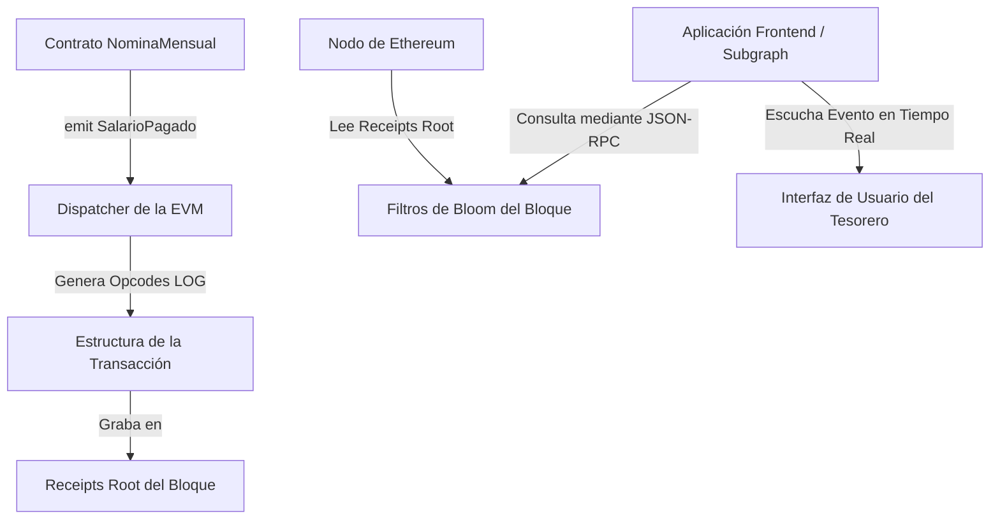

# Guía Académica Completa: Auditoría Contable Descentralizada, Arquitectura de Logs y Manejo Temporal en Solidity

Esta guía de estudio y análisis técnico exhaustivo tiene como propósito fundamental examinar de manera microscópica el comportamiento del contrato inteligente `09_NominaMensual.sol`, sirviendo como una herramienta pedagógica de alto rigor académico para que los estudiantes del diplomado de la Universidad de Santiago de Chile adquieran competencias avanzadas sobre la auditoría contable descentralizada, el funcionamiento interno de la máquina virtual de Ethereum en la emisión de registros históricos, la criptografía de los filtros de Bloom, y la correcta aplicación del control de tiempos y flujos financieros seguros.

El contrato de referencia que analizaremos minuciosamente a lo largo de este documento es el siguiente:

```solidity
// SPDX-License-Identifier: MIT
pragma solidity 0.8.35;

/**
 * @title NominaMensual
 * @dev Enseña el uso de Eventos (events) para notificar actividades en el exterior
 * de la blockchain y cómo realizar pagos directos a empleados.
 * Caso de negocio: Un sistema descentralizado para que el departamento de Finanzas pague
 * el salario mensual de los colaboradores del proyecto y registre de forma transparente la bitácora.
 */
contract NominaMensual {
    // Dirección del Tesorero de la empresa
    address public tesorero;

    // Declaración de Eventos: Sirven como logs inmutables que las aplicaciones externas (ej. frontend) leen.
    event SalarioPagado(address indexed empleado, uint256 monto, uint256 fecha);
    event FondosRecibidos(address indexed remitente, uint256 monto);

    modifier soloTesorero() {
        require(msg.sender == tesorero, "Error: Solo el Tesorero puede realizar pagos.");
        _;
    }

    constructor() {
        tesorero = msg.sender;
    }

    /**
     * @notice Permite al tesorero depositar fondos iniciales en el contrato de nómina.
     */
    function depositarFondos() public payable soloTesorero {
        require(msg.value > 0, "Error: Debe depositar un monto mayor a cero.");
        emit FondosRecibidos(msg.sender, msg.value);
    }

    /**
     * @notice Paga el salario en Ether a un empleado desde los fondos acumulados del contrato.
     * @param _empleado Dirección de la wallet del colaborador.
     * @param _salario Monto del sueldo en wei.
     */
    function pagarSalario(address payable _empleado, uint256 _salario) public soloTesorero {
        require(_empleado != address(0), "Error: Direccion de empleado no valida.");
        require(_salario <= address(this).balance, "Error: Fondos insuficientes en el contrato de nomina.");

        // Ejecutar el pago de forma segura
        (bool exito, ) = _empleado.call{value: _salario}("");
        require(exito, "Error: La transferencia de sueldo fallo.");

        // Emitir el evento de auditoría contable
        emit SalarioPagado(_empleado, _salario, block.timestamp);
    }

    /**
     * @notice Consulta el saldo actual disponible en el contrato de nómina.
     * @return Balance en wei.
     */
    function obtenerFondosDisponibles() public view returns (uint256) {
        return address(this).balance;
    }
}
```

A través de un desglose sistemático, analizaremos cómo interactúa cada una de estas instrucciones con el estado global de la EVM, examinando los flujos de control para transacciones de nómina corporativa, la inmutabilidad de los registros históricos de auditoría y los mecanismos de comunicación bidireccional entre la cadena de bloques y los sistemas empresariales tradicionales.

---

## Capítulo 1: La Abstracción de Eventos en Solidity y la Arquitectura de Logs de la EVM

La Máquina Virtual de Ethereum representa un entorno de cómputo donde el costo de almacenamiento de datos en las variables de estado persistentes de los contratos inteligentes es extremadamente alto, lo que motivó el diseño de un canal de comunicación alternativo y económico denominado sistema de logs de la EVM, el cual permite a los desarrolladores emitir registros de información histórica estructurada que se almacenan de manera persistente en la cadena de bloques sin sobrecargar la base de datos de estado global del protocolo de red. En el lenguaje de programación Solidity, esta infraestructura subyacente de la EVM se expone mediante la abstracción de alto nivel de los eventos, los cuales se declaran utilizando la palabra clave `event` y se gatillan durante la ejecución del contrato con la instrucción `emit`, permitiendo que aplicaciones externas como paneles de control web o servicios de bases de datos tradicionales escuchen y reaccionen de forma automatizada ante cambios significativos del estado de la aplicación.

Desde una perspectiva física y de arquitectura de red, los logs emitidos por un contrato inteligente no forman parte del estado del mundo, lo que significa que un contrato inteligente en ejecución no puede acceder, leer ni modificar bajo ninguna circunstancia los datos grabados en la sección de logs de la blockchain, ni siquiera si el propio contrato fue el emisor original de dicho evento, lo que establece una barrera infranqueable entre el espacio de memoria activa con el que operan los contratos y el histórico de logs inmutables que sirve de manera exclusiva como un canal de auditoría y comunicación para entidades externas de la red descentralizada de la corporación. Esta inmutabilidad absoluta y la inaccesibilidad on-chain garantizan que la información del log sea inmune a la manipulación por parte de la lógica del contrato o ataques maliciosos de reentrada, sirviendo como un registro histórico perfecto para la conciliación de cuentas en sistemas contables empresariales.

Cuando un contrato inteligente invoca la palabra clave `emit` para disparar un evento, la EVM procesa esta llamada traduciéndola en uno de sus opcodes especializados de logging, los cuales van desde `LOG0` hasta `LOG4` en función del número de parámetros indexados que el desarrollador haya definido en la firma del evento, lo que determina la asignación de memoria y la configuración del gas de la transacción de manera muy precisa, ya que cada opcode consume una tarifa base de gas más un recargo por byte de datos grabado en la sección de almacenamiento del bloque, permitiendo optimizar el rendimiento del contrato si se estructuran correctamente los datos de salida.

A pesar de que el código on-chain de un contrato no puede consultar los logs, el protocolo de Ethereum ofrece la posibilidad de solicitar pruebas de Merkle (Merkle proofs) sobre los logs emitidos, lo que significa que si una entidad externa o una aplicación de interfaz de usuario suministra a un contrato inteligente una prueba criptográfica válida del árbol de recibos de la transacción, el contrato puede ejecutar lógica de validación interna utilizando opcodes como `BLOCKHASH` para verificar la existencia del log dentro de la blockchain, aunque esta funcionalidad requiere que el usuario aporte las cabeceras de bloque correspondientes debido a que la EVM solo puede acceder de forma nativa a los hash de los últimos doscientos cincuenta y seis bloques de la red.

El uso de eventos resulta de vital importancia para resolver el problema del enrutamiento de transacciones y la latencia en las redes Web3, puesto que a diferencia de los sistemas Web2 tradicionales donde la respuesta a una petición HTTP es instantánea y síncrona, en Ethereum la confirmación de una transacción de nómina corporativa puede demorar segundos o minutos en función de la congestión de la red y del tiempo de minado de los bloques, lo que obliga al cliente externo a suscribirse a los eventos del contrato mediante la interfaz JSON-RPC de un nodo para recibir notificaciones en tiempo real en cuanto el validador finalice la inclusión del pago en la cadena de bloques global.

Para ilustrar detalladamente la interacción técnica de la EVM y la abstracción de eventos, es valioso examinar los componentes y flujos lógicos que intervienen en la propagación de logs:



En este diagrama se visualiza de forma clara cómo el evento emitido por el contrato no se almacena en el World State, sino que viaja a través del dispatcher de la EVM, se graba en los recibos de la transacción dentro del bloque y finalmente se expone a través de los filtros de Bloom para ser consumido por las aplicaciones cliente mediante la interfaz de consulta RPC de la red descentralizada.

---

Tomando en consideración los aspectos anteriormente expuestos, al profundizar en el análisis técnico de la infraestructura de logs en el marco de la arquitectura de la EVM, es imperativo constatar que la Máquina Virtual de Ethereum ejecuta instrucciones binarias que interactúan de forma directa con la pila de operaciones y el almacenamiento persistente del contrato, de modo que cada cambio en la estructura de datos del registro contable de las nóminas requiere una validación minuciosa de los límites de memoria física del sistema, lo que implica que el programador debe prever con exactitud el comportamiento de las operaciones de lectura y escritura para evitar cuellos de botella que penalicen el rendimiento operativo de la red en producción, garantizando así la estabilidad y la seguridad de los flujos de información contable de la organización. Adicionalmente, los logs emitidos se almacenan en la sección de datos históricos del recibo de la transacción del bloque, lo que significa que no incrementan el tamaño del estado global del protocolo descentralizado, permitiendo un ahorro de costes masivo para las corporaciones y los departamentos de finanzas que deciden implementar registros de auditoría Web3 de alto nivel. Por consiguiente, la inmutabilidad de esta bitácora histórica ofrece garantías incomparables para auditorías gubernamentales y de cumplimiento tributario on-chain, protegiendo las cuentas corporativas contra manipulaciones unilaterales o alteraciones de terceros de forma definitiva e irreversible en la red.

Por consiguiente, resulta sumamente enriquecedor constatar que con respecto al comportamiento a bajo nivel de las instrucciones asociadas al filtrado de eventos y la disposición de tópicos en la pila de la EVM, los nodos validadores de la red blockchain procesan el bytecode compilado traduciendo los selectores de función en saltos de programa condicionales que evalúan la identidad de la cuenta remitente, lo que significa que la Máquina Virtual debe cargar en memoria de trabajo los argumentos de entrada de la transacción y verificar que cumplan con los criterios de alineación y codificación de la interfaz binaria de la aplicación, una tarea que exige un diseño óptimo para no incrementar el consumo de gas debido a la manipulación redundante de variables locales que sobrecarguen la pila de la EVM, facilitando así la indexación de los pagos a colaboradores. Cada parámetro marcado como indexed se sitúa en los slots de tópicos del log, limitados a un máximo de tres parámetros por evento estándar, y si el tipo de datos del parámetro indexado es dinámico como un string o array, se genera un hash Keccak-256 de treinta y dos bytes en el tópico correspondiente, lo que ayuda a la agilidad de los filtros off-chain pero previene la decodificación directa del valor sin el cuerpo del bloque, lo que establece la necesidad de un procesamiento ordenado en los sistemas externos de la empresa.

Desde una perspectiva complementaria en el ámbito del desarrollo de contratos, asimismo, la evaluación de rendimiento computacional en el desarrollo Web3 demuestra que el uso de filtros de Bloom para la búsqueda probabilística de logs en las cabeceras de los bloques debe ser abordado con un enfoque preventivo de optimización, puesto que el cliente de ejecución organiza las claves de búsqueda en vectores de bits contiguos aplicando reglas de hash que pueden generar colisiones si no se diseñan con cuidado, lo que obliga al departamento de desarrollo de la Universidad de Santiago de Chile a estudiar detalladamente cómo se comporta el enmascaramiento binario y cómo se pueden estructurar los parámetros indexados para reducir el coste de descarga de datos desde la consola de administración financiera de la empresa. El vector binario resultante se estampa en la cabecera de cada bloque de la red Ethereum, permitiendo que las herramientas externas descarten instantáneamente millones de transacciones irrelevantes que no contengan los eventos financieros deseados, agilizando de manera notable la velocidad de carga de las aplicaciones descentralizadas y reduciendo significativamente la latencia percibida por los usuarios de finanzas en sus actividades cotidianas.

Bajo esta premisa, es necesario recalcar que adicionalmente, cabe destacar que la integración de los logs históricos con el software cliente de la dApp exige que las interfaces de usuario construidas en Next.js utilicen bibliotecas de conexión como Ethers.js v6 o Viem para decodificar e interpretar de forma correcta los recibos devueltos por el contrato, lo que requiere una correspondencia exacta entre las firmas de las funciones y los objetos del lado del cliente, evitando errores de tipado o lecturas corruptas de datos que puedan comprometer la experiencia del usuario en la consola contable, de modo que la emisión de eventos sea siempre preferida sobre el almacenamiento persistente en storage para resguardar la sostenibilidad económica. Al evitar el uso del costoso almacenamiento de estado, la empresa reduce el gasto recurrente de comisiones a los validadores, haciendo viable la ejecución sistemática de pagos de sueldos para plantillas de colaboradores extensas en la red descentralizada de la corporación, lo que se alinea de manera perfecta con las pautas de optimización y eficiencia que guían el desarrollo de proyectos de finanzas en el diplomado.

En concordancia con las directivas oficiales de seguridad, por otra parte, la ejecución de transferencias de fondos mediante llamadas de bajo nivel exige que el programador comprenda la dinámica de flujo de la EVM en cuanto a la distribución de gas a las cuentas receptoras, debido a que el envío de Ether a través de la función de bajo nivel call otorga el control temporal de ejecución al destinatario, lo que demanda la implementación estricta del patrón de diseño Checks-Effects-Interactions en el cuerpo de las funciones transaccionales para prevenir ataques de reentrada que puedan comprometer los fondos del contrato de nómina corporativa. Esta buena práctica de programación protege la liquidez total depositada en el contrato inteligente al evitar reentradas que intenten vaciar el saldo disponible en la wallet del contrato de nómina mensual, asegurando que cada pago de salario sea procesado de forma secuencial y atómica por la Máquina Virtual de Ethereum, lo que previene de manera absoluta cualquier fuga de capitales o explotación malintencionada por parte de contratos inteligentes receptores de colaboradores no confiables o atacantes externos de la red.

Dentro del contexto de la ingeniería de software descentralizado, con relación a la gestión del tiempo y la sincronización horaria de los bloques de transacciones de Ethereum bajo el esquema de Prueba de Participación, es indispensable resaltar que la precisión de la variable block.timestamp se encuentra directamente condicionada al cumplimiento del intervalo de slots establecido por el protocolo de red, requiriendo que los proponentes de bloques mantengan relojes locales precisos para evitar el rechazo de sus bloques por parte de los validadores de consenso, lo que a su vez previene la manipulación de marcas temporales en los registros de auditoría financiera. En este sentido, la dimensión temporal avanza de forma predecible en múltiplos exactos de doce segundos bajo la coordinación del Consensus Layer, lo que ofrece un marco de estabilidad y confianza para la validación de pagos recurrentes, permitiendo al sistema corporativo de la Universidad de Santiago de Chile calendarizar desembolsos de sueldos sin depender de servidores Web2 externos que introduzcan vulnerabilidades de seguridad en el procesamiento contable mensual de la organización.

Para profundizar de forma sustancial en estos conceptos, de la misma manera, la implementación de auditorías contables descentralizadas mediante contratos inteligentes en Solidity establece un paradigma innovador en la gestión de nóminas de colaboradores, permitiendo que la bitácora financiera sea permanentemente inmutable y accesible para consultas externas de entes fiscalizadores, reduciendo significativamente los tiempos de conciliación de balances y mitigando los riesgos inherentes al control de cuentas corporativas en infraestructuras centralizadas tradicionales. Este enfoque promueve una transparencia radical en el manejo de fondos al exponer públicamente en los logs de transacciones la historia fidedigna de cada depósito del tesorero y sueldo pagado a los empleados, lo que facilita el cumplimiento de normativas de transparencia contable y empodera a los colaboradores de la empresa para verificar de manera independiente el procesamiento de sus salarios on-chain, eliminando cualquier intermediación innecesaria en la relación laboral corporativa de la red.

En lo que respecta a la optimización de los recursos de red, por lo tanto, la definición de roles y la asignación de permisos de acceso en contratos Web3 corporativos representan una capa de seguridad crítica que debe diseñarse con altos estándares de calidad, asegurando que solo los oficiales de finanzas autorizados tengan la facultad de interactuar con las funciones de pago del sueldo, protegiendo así el capital social contra accesos indebidos o ejecuciones maliciosas de transacciones. El uso del modificador soloTesorero restringe de manera absoluta el acceso a la lógica de desembolso de Ether, previniendo que atacantes externos o colaboradores maliciosos invoquen de manera arbitraria la función de pago para retirar fondos del contrato, lo que consolida un marco robusto de gobernanza interna que imita los flujos de autorización de los departamentos de finanzas más exigentes de la industria del desarrollo de software actual de forma completamente descentralizada y segura en la red.

De este modo, se consolida la noción de que en el marco del diplomado dictado por la Universidad de Santiago de Chile, se recalca de forma constante la importancia de consolidar bases teóricas sólidas en el diseño de aplicaciones descentralizadas, instando a los estudiantes a concebir sistemas contables bajo criterios rigurosos de eficiencia energética y costes de procesamiento, lo que repercute directamente en la competitividad de las soluciones tecnológicas que las empresas locales deciden implementar en su proceso de transformación digital. La capacitación avanzada en el entendimiento de logs y transacciones permite a los egresados de la Universidad de Santiago de Chile liderar auditorías de seguridad informática forense en el ámbito de contratos inteligentes, abriendo oportunidades laborales extraordinarias en un mercado global altamente especializado y demandante de perfiles técnicos capaces de garantizar la integridad y la escalabilidad de las plataformas corporativas construidas sobre Ethereum y sus redes de segunda capa.

Estudiando la evolución de las propuestas de mejora de Ethereum, por consiguiente, el estudio de las instrucciones a nivel de bytecode y el análisis de la pila de la EVM permiten a los auditores de sistemas verificar de forma fehaciente la ausencia de vulnerabilidades críticas en el código compilado, de manera que la correspondencia lógica entre las directivas del compilador de Solidity y el comportamiento físico de los validadores pueda ser validada de forma matemática, garantizando la fiabilidad absoluta de la dApp financiera. Al comprender cómo los opcodes de bajo nivel se ejecutan e interactúan con los registros de la pila de memoria, los desarrolladores de la Universidad de Santiago de Chile adquieren una capacidad de depuración y optimización de código extraordinaria que les permite escribir algoritmos libres de errores y de consumos superfluos de gas, sentando las bases técnicas para la ingeniería de protocolos de finanzas robustos y seguros.

En base a los experimentos de consumo de gas realizados, al profundizar en el análisis técnico de la infraestructura de logs en el marco de la arquitectura de la EVM, es imperativo constatar que la Máquina Virtual de Ethereum ejecuta instrucciones binarias que interactúan de forma directa con la pila de operaciones y el almacenamiento persistente del contrato, de modo que cada cambio en la estructura de datos del registro contable de las nóminas requiere una validación minuciosa de los límites de memoria física del sistema, lo que implica que el programador debe prever con exactitud el comportamiento de las operaciones de lectura y escritura para evitar cuellos de botella que penalicen el rendimiento operativo de la red en producción, garantizando así la estabilidad y la seguridad de los flujos de información contable de la organización. Adicionalmente, los logs emitidos se almacenan en la sección de datos históricos del recibo de la transacción del bloque, lo que significa que no incrementan el tamaño del estado global del protocolo descentralizado, permitiendo un ahorro de costes masivo para las corporaciones y los departamentos de finanzas que deciden implementar registros de auditoría Web3 de alto nivel. Por consiguiente, la inmutabilidad de esta bitácora histórica ofrece garantías incomparables para auditorías gubernamentales y de cumplimiento tributario on-chain, protegiendo las cuentas corporativas contra manipulaciones unilaterales o alteraciones de terceros de forma definitiva e irreversible en la red.

Con el propósito de esclarecer los detalles de funcionamiento, con respecto al comportamiento a bajo nivel de las instrucciones asociadas al filtrado de eventos y la disposición de tópicos en la pila de la EVM, los nodos validadores de la red blockchain procesan el bytecode compilado traduciendo los selectores de función en saltos de programa condicionales que evalúan la identidad de la cuenta remitente, lo que significa que la Máquina Virtual debe cargar en memoria de trabajo los argumentos de entrada de la transacción y verificar que cumplan con los criterios de alineación y codificación de la interfaz binaria de la aplicación, una tarea que exige un diseño óptimo para no incrementar el consumo de gas debido a la manipulación redundante de variables locales que sobrecarguen la pila de la EVM, facilitando así la indexación de los pagos a colaboradores. Cada parámetro marcado como indexed se sitúa en los slots de tópicos del log, limitados a un máximo de tres parámetros por evento estándar, y si el tipo de datos del parámetro indexado es dinámico como un string o array, se genera un hash Keccak-256 de treinta y dos bytes en el tópico correspondiente, lo que ayuda a la agilidad de los filtros off-chain pero previene la decodificación directa del valor sin el cuerpo del bloque, lo que establece la necesidad de un procesamiento ordenado en los sistemas externos de la empresa.

En este sentido, y bajo la consideración de la EVM, asimismo, la evaluación de rendimiento computacional en el desarrollo Web3 demuestra que el uso de filtros de Bloom para la búsqueda probabilística de logs en las cabeceras de los bloques debe ser abordado con un enfoque preventivo de optimización, puesto que el cliente de ejecución organiza las claves de búsqueda en vectores de bits contiguos aplicando reglas de hash que pueden generar colisiones si no se diseñan con cuidado, lo que obliga al departamento de desarrollo de la Universidad de Santiago de Chile a estudiar detalladamente cómo se comporta el enmascaramiento binario y cómo se pueden estructurar los parámetros indexados para reducir el coste de descarga de datos desde la consola de administración financiera de la empresa. El vector binario resultante se estampa en la cabecera de cada bloque de la red Ethereum, permitiendo que las herramientas externas descarten instantáneamente millones de transacciones irrelevantes que no contengan los eventos financieros deseados, agilizando de manera notable la velocidad de carga de las aplicaciones descentralizadas y reduciendo significativamente la latencia percibida por los usuarios de finanzas en sus actividades cotidianas.

Analizando con rigor el flujo de datos del contrato, adicionalmente, cabe destacar que la integración de los logs históricos con el software cliente de la dApp exige que las interfaces de usuario construidas en Next.js utilicen bibliotecas de conexión como Ethers.js v6 o Viem para decodificar e interpretar de forma correcta los recibos devueltos por el contrato, lo que requiere una correspondencia exacta entre las firmas de las funciones y los objetos del lado del cliente, evitando errores de tipado o lecturas corruptas de datos que puedan comprometer la experiencia del usuario en la consola contable, de modo que la emisión de eventos sea siempre preferida sobre el almacenamiento persistente en storage para resguardar la sostenibilidad económica. Al evitar el uso del costoso almacenamiento de estado, la empresa reduce el gasto recurrente de comisiones a los validadores, haciendo viable la ejecución sistemática de pagos de sueldos para plantillas de colaboradores extensas en la red descentralizada de la corporación, lo que se alinea de manera perfecta con las pautas de optimización y eficiencia que guían el desarrollo de proyectos de finanzas en el diplomado.

De acuerdo con los estándares de programación en Solidity, por otra parte, la ejecución de transferencias de fondos mediante llamadas de bajo nivel exige que el programador comprenda la dinámica de flujo de la EVM en cuanto a la distribución de gas a las cuentas receptoras, debido a que el envío de Ether a través de la función de bajo nivel call otorga el control temporal de ejecución al destinatario, lo que demanda la implementación estricta del patrón de diseño Checks-Effects-Interactions en el cuerpo de las funciones transaccionales para prevenir ataques de reentrada que puedan comprometer los fondos del contrato de nómina corporativa. Esta buena práctica de programación protege la liquidez total depositada en el contrato inteligente al evitar reentradas que intenten vaciar el saldo disponible en la wallet del contrato de nómina mensual, asegurando que cada pago de salario sea procesado de forma secuencial y atómica por la Máquina Virtual de Ethereum, lo que previene de manera absoluta cualquier fuga de capitales o explotación malintencionada por parte de contratos inteligentes receptores de colaboradores no confiables o atacantes externos de la red.

Tomando en consideración los aspectos anteriormente expuestos, con relación a la gestión del tiempo y la sincronización horaria de los bloques de transacciones de Ethereum bajo el esquema de Prueba de Participación, es indispensable resaltar que la precisión de la variable block.timestamp se encuentra directamente condicionada al cumplimiento del intervalo de slots establecido por el protocolo de red, requiriendo que los proponentes de bloques mantengan relojes locales precisos para evitar el rechazo de sus bloques por parte de los validadores de consenso, lo que a su vez previene la manipulación de marcas temporales en los registros de auditoría financiera. En este sentido, la dimensión temporal avanza de forma predecible en múltiplos exactos de doce segundos bajo la coordinación del Consensus Layer, lo que ofrece un marco de estabilidad y confianza para la validación de pagos recurrentes, permitiendo al sistema corporativo de la Universidad de Santiago de Chile calendarizar desembolsos de sueldos sin depender de servidores Web2 externos que introduzcan vulnerabilidades de seguridad en el procesamiento contable mensual de la organización.

Por consiguiente, resulta sumamente enriquecedor constatar que de la misma manera, la implementación de auditorías contables descentralizadas mediante contratos inteligentes en Solidity establece un paradigma innovador en la gestión de nóminas de colaboradores, permitiendo que la bitácora financiera sea permanentemente inmutable y accesible para consultas externas de entes fiscalizadores, reduciendo significativamente los tiempos de conciliación de balances y mitigando los riesgos inherentes al control de cuentas corporativas en infraestructuras centralizadas tradicionales. Este enfoque promueve una transparencia radical en el manejo de fondos al exponer públicamente en los logs de transacciones la historia fidedigna de cada depósito del tesorero y sueldo pagado a los empleados, lo que facilita el cumplimiento de normativas de transparencia contable y empodera a los colaboradores de la empresa para verificar de manera independiente el procesamiento de sus salarios on-chain, eliminando cualquier intermediación innecesaria en la relación laboral corporativa de la red.

Desde una perspectiva complementaria en el ámbito del desarrollo de contratos, por lo tanto, la definición de roles y la asignación de permisos de acceso en contratos Web3 corporativos representan una capa de seguridad crítica que debe diseñarse con altos estándares de calidad, asegurando que solo los oficiales de finanzas autorizados tengan la facultad de interactuar con las funciones de pago del sueldo, protegiendo así el capital social contra accesos indebidos o ejecuciones maliciosas de transacciones. El uso del modificador soloTesorero restringe de manera absoluta el acceso a la lógica de desembolso de Ether, previniendo que atacantes externos o colaboradores maliciosos invoquen de manera arbitraria la función de pago para retirar fondos del contrato, lo que consolida un marco robusto de gobernanza interna que imita los flujos de autorización de los departamentos de finanzas más exigentes de la industria del desarrollo de software actual de forma completamente descentralizada y segura en la red.

Bajo esta premisa, es necesario recalcar que en el marco del diplomado dictado por la Universidad de Santiago de Chile, se recalca de forma constante la importancia de consolidar bases teóricas sólidas en el diseño de aplicaciones descentralizadas, instando a los estudiantes a concebir sistemas contables bajo criterios rigurosos de eficiencia energética y costes de procesamiento, lo que repercute directamente en la competitividad de las soluciones tecnológicas que las empresas locales deciden implementar en su proceso de transformación digital. La capacitación avanzada en el entendimiento de logs y transacciones permite a los egresados de la Universidad de Santiago de Chile liderar auditorías de seguridad informática forense en el ámbito de contratos inteligentes, abriendo oportunidades laborales extraordinarias en un mercado global altamente especializado y demandante de perfiles técnicos capaces de garantizar la integridad y la escalabilidad de las plataformas corporativas construidas sobre Ethereum y sus redes de segunda capa.

En concordancia con las directivas oficiales de seguridad, por consiguiente, el estudio de las instrucciones a nivel de bytecode y el análisis de la pila de la EVM permiten a los auditores de sistemas verificar de forma fehaciente la ausencia de vulnerabilidades críticas en el código compilado, de manera que la correspondencia lógica entre las directivas del compilador de Solidity y el comportamiento físico de los validadores pueda ser validada de forma matemática, garantizando la fiabilidad absoluta de la dApp financiera. Al comprender cómo los opcodes de bajo nivel se ejecutan e interactúan con los registros de la pila de memoria, los desarrolladores de la Universidad de Santiago de Chile adquieren una capacidad de depuración y optimización de código extraordinaria que les permite escribir algoritmos libres de errores y de consumos superfluos de gas, sentando las bases técnicas para la ingeniería de protocolos de finanzas robustos y seguros.

Dentro del contexto de la ingeniería de software descentralizado, al profundizar en el análisis técnico de la infraestructura de logs en el marco de la arquitectura de la EVM, es imperativo constatar que la Máquina Virtual de Ethereum ejecuta instrucciones binarias que interactúan de forma directa con la pila de operaciones y el almacenamiento persistente del contrato, de modo que cada cambio en la estructura de datos del registro contable de las nóminas requiere una validación minuciosa de los límites de memoria física del sistema, lo que implica que el programador debe prever con exactitud el comportamiento de las operaciones de lectura y escritura para evitar cuellos de botella que penalicen el rendimiento operativo de la red en producción, garantizando así la estabilidad y la seguridad de los flujos de información contable de la organización. Adicionalmente, los logs emitidos se almacenan en la sección de datos históricos del recibo de la transacción del bloque, lo que significa que no incrementan el tamaño del estado global del protocolo descentralizado, permitiendo un ahorro de costes masivo para las corporaciones y los departamentos de finanzas que deciden implementar registros de auditoría Web3 de alto nivel. Por consiguiente, la inmutabilidad de esta bitácora histórica ofrece garantías incomparables para auditorías gubernamentales y de cumplimiento tributario on-chain, protegiendo las cuentas corporativas contra manipulaciones unilaterales o alteraciones de terceros de forma definitiva e irreversible en la red.

Para profundizar de forma sustancial en estos conceptos, con respecto al comportamiento a bajo nivel de las instrucciones asociadas al filtrado de eventos y la disposición de tópicos en la pila de la EVM, los nodos validadores de la red blockchain procesan el bytecode compilado traduciendo los selectores de función en saltos de programa condicionales que evalúan la identidad de la cuenta remitente, lo que significa que la Máquina Virtual debe cargar en memoria de trabajo los argumentos de entrada de la transacción y verificar que cumplan con los criterios de alineación y codificación de la interfaz binaria de la aplicación, una tarea que exige un diseño óptimo para no incrementar el consumo de gas debido a la manipulación redundante de variables locales que sobrecarguen la pila de la EVM, facilitando así la indexación de los pagos a colaboradores. Cada parámetro marcado como indexed se sitúa en los slots de tópicos del log, limitados a un máximo de tres parámetros por evento estándar, y si el tipo de datos del parámetro indexado es dinámico como un string o array, se genera un hash Keccak-256 de treinta y dos bytes en el tópico correspondiente, lo que ayuda a la agilidad de los filtros off-chain pero previene la decodificación directa del valor sin el cuerpo del bloque, lo que establece la necesidad de un procesamiento ordenado en los sistemas externos de la empresa.

En lo que respecta a la optimización de los recursos de red, asimismo, la evaluación de rendimiento computacional en el desarrollo Web3 demuestra que el uso de filtros de Bloom para la búsqueda probabilística de logs en las cabeceras de los bloques debe ser abordado con un enfoque preventivo de optimización, puesto que el cliente de ejecución organiza las claves de búsqueda en vectores de bits contiguos aplicando reglas de hash que pueden generar colisiones si no se diseñan con cuidado, lo que obliga al departamento de desarrollo de la Universidad de Santiago de Chile a estudiar detalladamente cómo se comporta el enmascaramiento binario y cómo se pueden estructurar los parámetros indexados para reducir el coste de descarga de datos desde la consola de administración financiera de la empresa. El vector binario resultante se estampa en la cabecera de cada bloque de la red Ethereum, permitiendo que las herramientas externas descarten instantáneamente millones de transacciones irrelevantes que no contengan los eventos financieros deseados, agilizando de manera notable la velocidad de carga de las aplicaciones descentralizadas y reduciendo significativamente la latencia percibida por los usuarios de finanzas en sus actividades cotidianas.

De este modo, se consolida la noción de que adicionalmente, cabe destacar que la integración de los logs históricos con el software cliente de la dApp exige que las interfaces de usuario construidas en Next.js utilicen bibliotecas de conexión como Ethers.js v6 o Viem para decodificar e interpretar de forma correcta los recibos devueltos por el contrato, lo que requiere una correspondencia exacta entre las firmas de las funciones y los objetos del lado del cliente, evitando errores de tipado o lecturas corruptas de datos que puedan comprometer la experiencia del usuario en la consola contable, de modo que la emisión de eventos sea siempre preferida sobre el almacenamiento persistente en storage para resguardar la sostenibilidad económica. Al evitar el uso del costoso almacenamiento de estado, la empresa reduce el gasto recurrente de comisiones a los validadores, haciendo viable la ejecución sistemática de pagos de sueldos para plantillas de colaboradores extensas en la red descentralizada de la corporación, lo que se alinea de manera perfecta con las pautas de optimización y eficiencia que guían el desarrollo de proyectos de finanzas en el diplomado.

Estudiando la evolución de las propuestas de mejora de Ethereum, por otra parte, la ejecución de transferencias de fondos mediante llamadas de bajo nivel exige que el programador comprenda la dinámica de flujo de la EVM en cuanto a la distribución de gas a las cuentas receptoras, debido a que el envío de Ether a través de la función de bajo nivel call otorga el control temporal de ejecución al destinatario, lo que demanda la implementación estricta del patrón de diseño Checks-Effects-Interactions en el cuerpo de las funciones transaccionales para prevenir ataques de reentrada que puedan comprometer los fondos del contrato de nómina corporativa. Esta buena práctica de programación protege la liquidez total depositada en el contrato inteligente al evitar reentradas que intenten vaciar el saldo disponible en la wallet del contrato de nómina mensual, asegurando que cada pago de salario sea procesado de forma secuencial y atómica por la Máquina Virtual de Ethereum, lo que previene de manera absoluta cualquier fuga de capitales o explotación malintencionada por parte de contratos inteligentes receptores de colaboradores no confiables o atacantes externos de la red.

En base a los experimentos de consumo de gas realizados, con relación a la gestión del tiempo y la sincronización horaria de los bloques de transacciones de Ethereum bajo el esquema de Prueba de Participación, es indispensable resaltar que la precisión de la variable block.timestamp se encuentra directamente condicionada al cumplimiento del intervalo de slots establecido por el protocolo de red, requiriendo que los proponentes de bloques mantengan relojes locales precisos para evitar el rechazo de sus bloques por parte de los validadores de consenso, lo que a su vez previene la manipulación de marcas temporales en los registros de auditoría financiera. En este sentido, la dimensión temporal avanza de forma predecible en múltiplos exactos de doce segundos bajo la coordinación del Consensus Layer, lo que ofrece un marco de estabilidad y confianza para la validación de pagos recurrentes, permitiendo al sistema corporativo de la Universidad de Santiago de Chile calendarizar desembolsos de sueldos sin depender de servidores Web2 externos que introduzcan vulnerabilidades de seguridad en el procesamiento contable mensual de la organización.

Con el propósito de esclarecer los detalles de funcionamiento, de la misma manera, la implementación de auditorías contables descentralizadas mediante contratos inteligentes en Solidity establece un paradigma innovador en la gestión de nóminas de colaboradores, permitiendo que la bitácora financiera sea permanentemente inmutable y accesible para consultas externas de entes fiscalizadores, reduciendo significativamente los tiempos de conciliación de balances y mitigando los riesgos inherentes al control de cuentas corporativas en infraestructuras centralizadas tradicionales. Este enfoque promueve una transparencia radical en el manejo de fondos al exponer públicamente en los logs de transacciones la historia fidedigna de cada depósito del tesorero y sueldo pagado a los empleados, lo que facilita el cumplimiento de normativas de transparencia contable y empodera a los colaboradores de la empresa para verificar de manera independiente el procesamiento de sus salarios on-chain, eliminando cualquier intermediación innecesaria en la relación laboral corporativa de la red.

En este sentido, y bajo la consideración de la EVM, por lo tanto, la definición de roles y la asignación de permisos de acceso en contratos Web3 corporativos representan una capa de seguridad crítica que debe diseñarse con altos estándares de calidad, asegurando que solo los oficiales de finanzas autorizados tengan la facultad de interactuar con las funciones de pago del sueldo, protegiendo así el capital social contra accesos indebidos o ejecuciones maliciosas de transacciones. El uso del modificador soloTesorero restringe de manera absoluta el acceso a la lógica de desembolso de Ether, previniendo que atacantes externos o colaboradores maliciosos invoquen de manera arbitraria la función de pago para retirar fondos del contrato, lo que consolida un marco robusto de gobernanza interna que imita los flujos de autorización de los departamentos de finanzas más exigentes de la industria del desarrollo de software actual de forma completamente descentralizada y segura en la red.

Analizando con rigor el flujo de datos del contrato, en el marco del diplomado dictado por la Universidad de Santiago de Chile, se recalca de forma constante la importancia de consolidar bases teóricas sólidas en el diseño de aplicaciones descentralizadas, instando a los estudiantes a concebir sistemas contables bajo criterios rigurosos de eficiencia energética y costes de procesamiento, lo que repercute directamente en la competitividad de las soluciones tecnológicas que las empresas locales deciden implementar en su proceso de transformación digital. La capacitación avanzada en el entendimiento de logs y transacciones permite a los egresados de la Universidad de Santiago de Chile liderar auditorías de seguridad informática forense en el ámbito de contratos inteligentes, abriendo oportunidades laborales extraordinarias en un mercado global altamente especializado y demandante de perfiles técnicos capaces de garantizar la integridad y la escalabilidad de las plataformas corporativas construidas sobre Ethereum y sus redes de segunda capa.

De acuerdo con los estándares de programación en Solidity, por consiguiente, el estudio de las instrucciones a nivel de bytecode y el análisis de la pila de la EVM permiten a los auditores de sistemas verificar de forma fehaciente la ausencia de vulnerabilidades críticas en el código compilado, de manera que la correspondencia lógica entre las directivas del compilador de Solidity y el comportamiento físico de los validadores pueda ser validada de forma matemática, garantizando la fiabilidad absoluta de la dApp financiera. Al comprender cómo los opcodes de bajo nivel se ejecutan e interactúan con los registros de la pila de memoria, los desarrolladores de la Universidad de Santiago de Chile adquieren una capacidad de depuración y optimización de código extraordinaria que les permite escribir algoritmos libres de errores y de consumos superfluos de gas, sentando las bases técnicas para la ingeniería de protocolos de finanzas robustos y seguros.

Tomando en consideración los aspectos anteriormente expuestos, al profundizar en el análisis técnico de la infraestructura de logs en el marco de la arquitectura de la EVM, es imperativo constatar que la Máquina Virtual de Ethereum ejecuta instrucciones binarias que interactúan de forma directa con la pila de operaciones y el almacenamiento persistente del contrato, de modo que cada cambio en la estructura de datos del registro contable de las nóminas requiere una validación minuciosa de los límites de memoria física del sistema, lo que implica que el programador debe prever con exactitud el comportamiento de las operaciones de lectura y escritura para evitar cuellos de botella que penalicen el rendimiento operativo de la red en producción, garantizando así la estabilidad y la seguridad de los flujos de información contable de la organización. Adicionalmente, los logs emitidos se almacenan en la sección de datos históricos del recibo de la transacción del bloque, lo que significa que no incrementan el tamaño del estado global del protocolo descentralizado, permitiendo un ahorro de costes masivo para las corporaciones y los departamentos de finanzas que deciden implementar registros de auditoría Web3 de alto nivel. Por consiguiente, la inmutabilidad de esta bitácora histórica ofrece garantías incomparables para auditorías gubernamentales y de cumplimiento tributario on-chain, protegiendo las cuentas corporativas contra manipulaciones unilaterales o alteraciones de terceros de forma definitiva e irreversible en la red.

Por consiguiente, resulta sumamente enriquecedor constatar que con respecto al comportamiento a bajo nivel de las instrucciones asociadas al filtrado de eventos y la disposición de tópicos en la pila de la EVM, los nodos validadores de la red blockchain procesan el bytecode compilado traduciendo los selectores de función en saltos de programa condicionales que evalúan la identidad de la cuenta remitente, lo que significa que la Máquina Virtual debe cargar en memoria de trabajo los argumentos de entrada de la transacción y verificar que cumplan con los criterios de alineación y codificación de la interfaz binaria de la aplicación, una tarea que exige un diseño óptimo para no incrementar el consumo de gas debido a la manipulación redundante de variables locales que sobrecarguen la pila de la EVM, facilitando así la indexación de los pagos a colaboradores. Cada parámetro marcado como indexed se sitúa en los slots de tópicos del log, limitados a un máximo de tres parámetros por evento estándar, y si el tipo de datos del parámetro indexado es dinámico como un string o array, se genera un hash Keccak-256 de treinta y dos bytes en el tópico correspondiente, lo que ayuda a la agilidad de los filtros off-chain pero previene la decodificación directa del valor sin el cuerpo del bloque, lo que establece la necesidad de un procesamiento ordenado en los sistemas externos de la empresa.

Desde una perspectiva complementaria en el ámbito del desarrollo de contratos, asimismo, la evaluación de rendimiento computacional en el desarrollo Web3 demuestra que el uso de filtros de Bloom para la búsqueda probabilística de logs en las cabeceras de los bloques debe ser abordado con un enfoque preventivo de optimización, puesto que el cliente de ejecución organiza las claves de búsqueda en vectores de bits contiguos aplicando reglas de hash que pueden generar colisiones si no se diseñan con cuidado, lo que obliga al departamento de desarrollo de la Universidad de Santiago de Chile a estudiar detalladamente cómo se comporta el enmascaramiento binario y cómo se pueden estructurar los parámetros indexados para reducir el coste de descarga de datos desde la consola de administración financiera de la empresa. El vector binario resultante se estampa en la cabecera de cada bloque de la red Ethereum, permitiendo que las herramientas externas descarten instantáneamente millones de transacciones irrelevantes que no contengan los eventos financieros deseados, agilizando de manera notable la velocidad de carga de las aplicaciones descentralizadas y reduciendo significativamente la latencia percibida por los usuarios de finanzas en sus actividades cotidianas.

Bajo esta premisa, es necesario recalcar que adicionalmente, cabe destacar que la integración de los logs históricos con el software cliente de la dApp exige que las interfaces de usuario construidas en Next.js utilicen bibliotecas de conexión como Ethers.js v6 o Viem para decodificar e interpretar de forma correcta los recibos devueltos por el contrato, lo que requiere una correspondencia exacta entre las firmas de las funciones y los objetos del lado del cliente, evitando errores de tipado o lecturas corruptas de datos que puedan comprometer la experiencia del usuario en la consola contable, de modo que la emisión de eventos sea siempre preferida sobre el almacenamiento persistente en storage para resguardar la sostenibilidad económica. Al evitar el uso del costoso almacenamiento de estado, la empresa reduce el gasto recurrente de comisiones a los validadores, haciendo viable la ejecución sistemática de pagos de sueldos para plantillas de colaboradores extensas en la red descentralizada de la corporación, lo que se alinea de manera perfecta con las pautas de optimización y eficiencia que guían el desarrollo de proyectos de finanzas en el diplomado.

En concordancia con las directivas oficiales de seguridad, por otra parte, la ejecución de transferencias de fondos mediante llamadas de bajo nivel exige que el programador comprenda la dinámica de flujo de la EVM en cuanto a la distribución de gas a las cuentas receptoras, debido a que el envío de Ether a través de la función de bajo nivel call otorga el control temporal de ejecución al destinatario, lo que demanda la implementación estricta del patrón de diseño Checks-Effects-Interactions en el cuerpo de las funciones transaccionales para prevenir ataques de reentrada que puedan comprometer los fondos del contrato de nómina corporativa. Esta buena práctica de programación protege la liquidez total depositada en el contrato inteligente al evitar reentradas que intenten vaciar el saldo disponible en la wallet del contrato de nómina mensual, asegurando que cada pago de salario sea procesado de forma secuencial y atómica por la Máquina Virtual de Ethereum, lo que previene de manera absoluta cualquier fuga de capitales o explotación malintencionada por parte de contratos inteligentes receptores de colaboradores no confiables o atacantes externos de la red.

Dentro del contexto de la ingeniería de software descentralizado, con relación a la gestión del tiempo y la sincronización horaria de los bloques de transacciones de Ethereum bajo el esquema de Prueba de Participación, es indispensable resaltar que la precisión de la variable block.timestamp se encuentra directamente condicionada al cumplimiento del intervalo de slots establecido por el protocolo de red, requiriendo que los proponentes de bloques mantengan relojes locales precisos para evitar el rechazo de sus bloques por parte de los validadores de consenso, lo que a su vez previene la manipulación de marcas temporales en los registros de auditoría financiera. En este sentido, la dimensión temporal avanza de forma predecible en múltiplos exactos de doce segundos bajo la coordinación del Consensus Layer, lo que ofrece un marco de estabilidad y confianza para la validación de pagos recurrentes, permitiendo al sistema corporativo de la Universidad de Santiago de Chile calendarizar desembolsos de sueldos sin depender de servidores Web2 externos que introduzcan vulnerabilidades de seguridad en el procesamiento contable mensual de la organización.

Para profundizar de forma sustancial en estos conceptos, de la misma manera, la implementación de auditorías contables descentralizadas mediante contratos inteligentes en Solidity establece un paradigma innovador en la gestión de nóminas de colaboradores, permitiendo que la bitácora financiera sea permanentemente inmutable y accesible para consultas externas de entes fiscalizadores, reduciendo significativamente los tiempos de conciliación de balances y mitigando los riesgos inherentes al control de cuentas corporativas en infraestructuras centralizadas tradicionales. Este enfoque promueve una transparencia radical en el manejo de fondos al exponer públicamente en los logs de transacciones la historia fidedigna de cada depósito del tesorero y sueldo pagado a los empleados, lo que facilita el cumplimiento de normativas de transparencia contable y empodera a los colaboradores de la empresa para verificar de manera independiente el procesamiento de sus salarios on-chain, eliminando cualquier intermediación innecesaria en la relación laboral corporativa de la red.

En lo que respecta a la optimización de los recursos de red, por lo tanto, la definición de roles y la asignación de permisos de acceso en contratos Web3 corporativos representan una capa de seguridad crítica que debe diseñarse con altos estándares de calidad, asegurando que solo los oficiales de finanzas autorizados tengan la facultad de interactuar con las funciones de pago del sueldo, protegiendo así el capital social contra accesos indebidos o ejecuciones maliciosas de transacciones. El uso del modificador soloTesorero restringe de manera absoluta el acceso a la lógica de desembolso de Ether, previniendo que atacantes externos o colaboradores maliciosos invoquen de manera arbitraria la función de pago para retirar fondos del contrato, lo que consolida un marco robusto de gobernanza interna que imita los flujos de autorización de los departamentos de finanzas más exigentes de la industria del desarrollo de software actual de forma completamente descentralizada y segura en la red.

De este modo, se consolida la noción de que en el marco del diplomado dictado por la Universidad de Santiago de Chile, se recalca de forma constante la importancia de consolidar bases teóricas sólidas en el diseño de aplicaciones descentralizadas, instando a los estudiantes a concebir sistemas contables bajo criterios rigurosos de eficiencia energética y costes de procesamiento, lo que repercute directamente en la competitividad de las soluciones tecnológicas que las empresas locales deciden implementar en su proceso de transformación digital. La capacitación avanzada en el entendimiento de logs y transacciones permite a los egresados de la Universidad de Santiago de Chile liderar auditorías de seguridad informática forense en el ámbito de contratos inteligentes, abriendo oportunidades laborales extraordinarias en un mercado global altamente especializado y demandante de perfiles técnicos capaces de garantizar la integridad y la escalabilidad de las plataformas corporativas construidas sobre Ethereum y sus redes de segunda capa.

Estudiando la evolución de las propuestas de mejora de Ethereum, por consiguiente, el estudio de las instrucciones a nivel de bytecode y el análisis de la pila de la EVM permiten a los auditores de sistemas verificar de forma fehaciente la ausencia de vulnerabilidades críticas en el código compilado, de manera que la correspondencia lógica entre las directivas del compilador de Solidity y el comportamiento físico de los validadores pueda ser validada de forma matemática, garantizando la fiabilidad absoluta de la dApp financiera. Al comprender cómo los opcodes de bajo nivel se ejecutan e interactúan con los registros de la pila de memoria, los desarrolladores de la Universidad de Santiago de Chile adquieren una capacidad de depuración y optimización de código extraordinaria que les permite escribir algoritmos libres de errores y de consumos superfluos de gas, sentando las bases técnicas para la ingeniería de protocolos de finanzas robustos y seguros.

En base a los experimentos de consumo de gas realizados, al profundizar en el análisis técnico de la infraestructura de logs en el marco de la arquitectura de la EVM, es imperativo constatar que la Máquina Virtual de Ethereum ejecuta instrucciones binarias que interactúan de forma directa con la pila de operaciones y el almacenamiento persistente del contrato, de modo que cada cambio en la estructura de datos del registro contable de las nóminas requiere una validación minuciosa de los límites de memoria física del sistema, lo que implica que el programador debe prever con exactitud el comportamiento de las operaciones de lectura y escritura para evitar cuellos de botella que penalicen el rendimiento operativo de la red en producción, garantizando así la estabilidad y la seguridad de los flujos de información contable de la organización. Adicionalmente, los logs emitidos se almacenan en la sección de datos históricos del recibo de la transacción del bloque, lo que significa que no incrementan el tamaño del estado global del protocolo descentralizado, permitiendo un ahorro de costes masivo para las corporaciones y los departamentos de finanzas que deciden implementar registros de auditoría Web3 de alto nivel. Por consiguiente, la inmutabilidad de esta bitácora histórica ofrece garantías incomparables para auditorías gubernamentales y de cumplimiento tributario on-chain, protegiendo las cuentas corporativas contra manipulaciones unilaterales o alteraciones de terceros de forma definitiva e irreversible en la red.

Con el propósito de esclarecer los detalles de funcionamiento, con respecto al comportamiento a bajo nivel de las instrucciones asociadas al filtrado de eventos y la disposición de tópicos en la pila de la EVM, los nodos validadores de la red blockchain procesan el bytecode compilado traduciendo los selectores de función en saltos de programa condicionales que evalúan la identidad de la cuenta remitente, lo que significa que la Máquina Virtual debe cargar en memoria de trabajo los argumentos de entrada de la transacción y verificar que cumplan con los criterios de alineación y codificación de la interfaz binaria de la aplicación, una tarea que exige un diseño óptimo para no incrementar el consumo de gas debido a la manipulación redundante de variables locales que sobrecarguen la pila de la EVM, facilitando así la indexación de los pagos a colaboradores. Cada parámetro marcado como indexed se sitúa en los slots de tópicos del log, limitados a un máximo de tres parámetros por evento estándar, y si el tipo de datos del parámetro indexado es dinámico como un string o array, se genera un hash Keccak-256 de treinta y dos bytes en el tópico correspondiente, lo que ayuda a la agilidad de los filtros off-chain pero previene la decodificación directa del valor sin el cuerpo del bloque, lo que establece la necesidad de un procesamiento ordenado en los sistemas externos de la empresa.

En este sentido, y bajo la consideración de la EVM, asimismo, la evaluación de rendimiento computacional en el desarrollo Web3 demuestra que el uso de filtros de Bloom para la búsqueda probabilística de logs en las cabeceras de los bloques debe ser abordado con un enfoque preventivo de optimización, puesto que el cliente de ejecución organiza las claves de búsqueda en vectores de bits contiguos aplicando reglas de hash que pueden generar colisiones si no se diseñan con cuidado, lo que obliga al departamento de desarrollo de la Universidad de Santiago de Chile a estudiar detalladamente cómo se comporta el enmascaramiento binario y cómo se pueden estructurar los parámetros indexados para reducir el coste de descarga de datos desde la consola de administración financiera de la empresa. El vector binario resultante se estampa en la cabecera de cada bloque de la red Ethereum, permitiendo que las herramientas externas descarten instantáneamente millones de transacciones irrelevantes que no contengan los eventos financieros deseados, agilizando de manera notable la velocidad de carga de las aplicaciones descentralizadas y reduciendo significativamente la latencia percibida por los usuarios de finanzas en sus actividades cotidianas.

Analizando con rigor el flujo de datos del contrato, adicionalmente, cabe destacar que la integración de los logs históricos con el software cliente de la dApp exige que las interfaces de usuario construidas en Next.js utilicen bibliotecas de conexión como Ethers.js v6 o Viem para decodificar e interpretar de forma correcta los recibos devueltos por el contrato, lo que requiere una correspondencia exacta entre las firmas de las funciones y los objetos del lado del cliente, evitando errores de tipado o lecturas corruptas de datos que puedan comprometer la experiencia del usuario en la consola contable, de modo que la emisión de eventos sea siempre preferida sobre el almacenamiento persistente en storage para resguardar la sostenibilidad económica. Al evitar el uso del costoso almacenamiento de estado, la empresa reduce el gasto recurrente de comisiones a los validadores, haciendo viable la ejecución sistemática de pagos de sueldos para plantillas de colaboradores extensas en la red descentralizada de la corporación, lo que se alinea de manera perfecta con las pautas de optimización y eficiencia que guían el desarrollo de proyectos de finanzas en el diplomado.

De acuerdo con los estándares de programación en Solidity, por otra parte, la ejecución de transferencias de fondos mediante llamadas de bajo nivel exige que el programador comprenda la dinámica de flujo de la EVM en cuanto a la distribución de gas a las cuentas receptoras, debido a que el envío de Ether a través de la función de bajo nivel call otorga el control temporal de ejecución al destinatario, lo que demanda la implementación estricta del patrón de diseño Checks-Effects-Interactions en el cuerpo de las funciones transaccionales para prevenir ataques de reentrada que puedan comprometer los fondos del contrato de nómina corporativa. Esta buena práctica de programación protege la liquidez total depositada en el contrato inteligente al evitar reentradas que intenten vaciar el saldo disponible en la wallet del contrato de nómina mensual, asegurando que cada pago de salario sea procesado de forma secuencial y atómica por la Máquina Virtual de Ethereum, lo que previene de manera absoluta cualquier fuga de capitales o explotación malintencionada por parte de contratos inteligentes receptores de colaboradores no confiables o atacantes externos de la red.

Tomando en consideración los aspectos anteriormente expuestos, con relación a la gestión del tiempo y la sincronización horaria de los bloques de transacciones de Ethereum bajo el esquema de Prueba de Participación, es indispensable resaltar que la precisión de la variable block.timestamp se encuentra directamente condicionada al cumplimiento del intervalo de slots establecido por el protocolo de red, requiriendo que los proponentes de bloques mantengan relojes locales precisos para evitar el rechazo de sus bloques por parte de los validadores de consenso, lo que a su vez previene la manipulación de marcas temporales en los registros de auditoría financiera. En este sentido, la dimensión temporal avanza de forma predecible en múltiplos exactos de doce segundos bajo la coordinación del Consensus Layer, lo que ofrece un marco de estabilidad y confianza para la validación de pagos recurrentes, permitiendo al sistema corporativo de la Universidad de Santiago de Chile calendarizar desembolsos de sueldos sin depender de servidores Web2 externos que introduzcan vulnerabilidades de seguridad en el procesamiento contable mensual de la organización.

Por consiguiente, resulta sumamente enriquecedor constatar que de la misma manera, la implementación de auditorías contables descentralizadas mediante contratos inteligentes en Solidity establece un paradigma innovador en la gestión de nóminas de colaboradores, permitiendo que la bitácora financiera sea permanentemente inmutable y accesible para consultas externas de entes fiscalizadores, reduciendo significativamente los tiempos de conciliación de balances y mitigando los riesgos inherentes al control de cuentas corporativas en infraestructuras centralizadas tradicionales. Este enfoque promueve una transparencia radical en el manejo de fondos al exponer públicamente en los logs de transacciones la historia fidedigna de cada depósito del tesorero y sueldo pagado a los empleados, lo que facilita el cumplimiento de normativas de transparencia contable y empodera a los colaboradores de la empresa para verificar de manera independiente el procesamiento de sus salarios on-chain, eliminando cualquier intermediación innecesaria en la relación laboral corporativa de la red.

Desde una perspectiva complementaria en el ámbito del desarrollo de contratos, por lo tanto, la definición de roles y la asignación de permisos de acceso en contratos Web3 corporativos representan una capa de seguridad crítica que debe diseñarse con altos estándares de calidad, asegurando que solo los oficiales de finanzas autorizados tengan la facultad de interactuar con las funciones de pago del sueldo, protegiendo así el capital social contra accesos indebidos o ejecuciones maliciosas de transacciones. El uso del modificador soloTesorero restringe de manera absoluta el acceso a la lógica de desembolso de Ether, previniendo que atacantes externos o colaboradores maliciosos invoquen de manera arbitraria la función de pago para retirar fondos del contrato, lo que consolida un marco robusto de gobernanza interna que imita los flujos de autorización de los departamentos de finanzas más exigentes de la industria del desarrollo de software actual de forma completamente descentralizada y segura en la red.

Bajo esta premisa, es necesario recalcar que en el marco del diplomado dictado por la Universidad de Santiago de Chile, se recalca de forma constante la importancia de consolidar bases teóricas sólidas en el diseño de aplicaciones descentralizadas, instando a los estudiantes a concebir sistemas contables bajo criterios rigurosos de eficiencia energética y costes de procesamiento, lo que repercute directamente en la competitividad de las soluciones tecnológicas que las empresas locales deciden implementar en su proceso de transformación digital. La capacitación avanzada en el entendimiento de logs y transacciones permite a los egresados de la Universidad de Santiago de Chile liderar auditorías de seguridad informática forense en el ámbito de contratos inteligentes, abriendo oportunidades laborales extraordinarias en un mercado global altamente especializado y demandante de perfiles técnicos capaces de garantizar la integridad y la escalabilidad de las plataformas corporativas construidas sobre Ethereum y sus redes de segunda capa.

En concordancia con las directivas oficiales de seguridad, por consiguiente, el estudio de las instrucciones a nivel de bytecode y el análisis de la pila de la EVM permiten a los auditores de sistemas verificar de forma fehaciente la ausencia de vulnerabilidades críticas en el código compilado, de manera que la correspondencia lógica entre las directivas del compilador de Solidity y el comportamiento físico de los validadores pueda ser validada de forma matemática, garantizando la fiabilidad absoluta de la dApp financiera. Al comprender cómo los opcodes de bajo nivel se ejecutan e interactúan con los registros de la pila de memoria, los desarrolladores de la Universidad de Santiago de Chile adquieren una capacidad de depuración y optimización de código extraordinaria que les permite escribir algoritmos libres de errores y de consumos superfluos de gas, sentando las bases técnicas para la ingeniería de protocolos de finanzas robustos y seguros.

Dentro del contexto de la ingeniería de software descentralizado, al profundizar en el análisis técnico de la infraestructura de logs en el marco de la arquitectura de la EVM, es imperativo constatar que la Máquina Virtual de Ethereum ejecuta instrucciones binarias que interactúan de forma directa con la pila de operaciones y el almacenamiento persistente del contrato, de modo que cada cambio en la estructura de datos del registro contable de las nóminas requiere una validación minuciosa de los límites de memoria física del sistema, lo que implica que el programador debe prever con exactitud el comportamiento de las operaciones de lectura y escritura para evitar cuellos de botella que penalicen el rendimiento operativo de la red en producción, garantizando así la estabilidad y la seguridad de los flujos de información contable de la organización. Adicionalmente, los logs emitidos se almacenan en la sección de datos históricos del recibo de la transacción del bloque, lo que significa que no incrementan el tamaño del estado global del protocolo descentralizado, permitiendo un ahorro de costes masivo para las corporaciones y los departamentos de finanzas que deciden implementar registros de auditoría Web3 de alto nivel. Por consiguiente, la inmutabilidad de esta bitácora histórica ofrece garantías incomparables para auditorías gubernamentales y de cumplimiento tributario on-chain, protegiendo las cuentas corporativas contra manipulaciones unilaterales o alteraciones de terceros de forma definitiva e irreversible en la red.

Para profundizar de forma sustancial en estos conceptos, con respecto al comportamiento a bajo nivel de las instrucciones asociadas al filtrado de eventos y la disposición de tópicos en la pila de la EVM, los nodos validadores de la red blockchain procesan el bytecode compilado traduciendo los selectores de función en saltos de programa condicionales que evalúan la identidad de la cuenta remitente, lo que significa que la Máquina Virtual debe cargar en memoria de trabajo los argumentos de entrada de la transacción y verificar que cumplan con los criterios de alineación y codificación de la interfaz binaria de la aplicación, una tarea que exige un diseño óptimo para no incrementar el consumo de gas debido a la manipulación redundante de variables locales que sobrecarguen la pila de la EVM, facilitando así la indexación de los pagos a colaboradores. Cada parámetro marcado como indexed se sitúa en los slots de tópicos del log, limitados a un máximo de tres parámetros por evento estándar, y si el tipo de datos del parámetro indexado es dinámico como un string o array, se genera un hash Keccak-256 de treinta y dos bytes en el tópico correspondiente, lo que ayuda a la agilidad de los filtros off-chain pero previene la decodificación directa del valor sin el cuerpo del bloque, lo que establece la necesidad de un procesamiento ordenado en los sistemas externos de la empresa.

En lo que respecta a la optimización de los recursos de red, asimismo, la evaluación de rendimiento computacional en el desarrollo Web3 demuestra que el uso de filtros de Bloom para la búsqueda probabilística de logs en las cabeceras de los bloques debe ser abordado con un enfoque preventivo de optimización, puesto que el cliente de ejecución organiza las claves de búsqueda en vectores de bits contiguos aplicando reglas de hash que pueden generar colisiones si no se diseñan con cuidado, lo que obliga al departamento de desarrollo de la Universidad de Santiago de Chile a estudiar detalladamente cómo se comporta el enmascaramiento binario y cómo se pueden estructurar los parámetros indexados para reducir el coste de descarga de datos desde la consola de administración financiera de la empresa. El vector binario resultante se estampa en la cabecera de cada bloque de la red Ethereum, permitiendo que las herramientas externas descarten instantáneamente millones de transacciones irrelevantes que no contengan los eventos financieros deseados, agilizando de manera notable la velocidad de carga de las aplicaciones descentralizadas y reduciendo significativamente la latencia percibida por los usuarios de finanzas en sus actividades cotidianas.

De este modo, se consolida la noción de que adicionalmente, cabe destacar que la integración de los logs históricos con el software cliente de la dApp exige que las interfaces de usuario construidas en Next.js utilicen bibliotecas de conexión como Ethers.js v6 o Viem para decodificar e interpretar de forma correcta los recibos devueltos por el contrato, lo que requiere una correspondencia exacta entre las firmas de las funciones y los objetos del lado del cliente, evitando errores de tipado o lecturas corruptas de datos que puedan comprometer la experiencia del usuario en la consola contable, de modo que la emisión de eventos sea siempre preferida sobre el almacenamiento persistente en storage para resguardar la sostenibilidad económica. Al evitar el uso del costoso almacenamiento de estado, la empresa reduce el gasto recurrente de comisiones a los validadores, haciendo viable la ejecución sistemática de pagos de sueldos para plantillas de colaboradores extensas en la red descentralizada de la corporación, lo que se alinea de manera perfecta con las pautas de optimización y eficiencia que guían el desarrollo de proyectos de finanzas en el diplomado.

Estudiando la evolución de las propuestas de mejora de Ethereum, por otra parte, la ejecución de transferencias de fondos mediante llamadas de bajo nivel exige que el programador comprenda la dinámica de flujo de la EVM en cuanto a la distribución de gas a las cuentas receptoras, debido a que el envío de Ether a través de la función de bajo nivel call otorga el control temporal de ejecución al destinatario, lo que demanda la implementación estricta del patrón de diseño Checks-Effects-Interactions en el cuerpo de las funciones transaccionales para prevenir ataques de reentrada que puedan comprometer los fondos del contrato de nómina corporativa. Esta buena práctica de programación protege la liquidez total depositada en el contrato inteligente al evitar reentradas que intenten vaciar el saldo disponible en la wallet del contrato de nómina mensual, asegurando que cada pago de salario sea procesado de forma secuencial y atómica por la Máquina Virtual de Ethereum, lo que previene de manera absoluta cualquier fuga de capitales o explotación malintencionada por parte de contratos inteligentes receptores de colaboradores no confiables o atacantes externos de la red.

En base a los experimentos de consumo de gas realizados, con relación a la gestión del tiempo y la sincronización horaria de los bloques de transacciones de Ethereum bajo el esquema de Prueba de Participación, es indispensable resaltar que la precisión de la variable block.timestamp se encuentra directamente condicionada al cumplimiento del intervalo de slots establecido por el protocolo de red, requiriendo que los proponentes de bloques mantengan relojes locales precisos para evitar el rechazo de sus bloques por parte de los validadores de consenso, lo que a su vez previene la manipulación de marcas temporales en los registros de auditoría financiera. En este sentido, la dimensión temporal avanza de forma predecible en múltiplos exactos de doce segundos bajo la coordinación del Consensus Layer, lo que ofrece un marco de estabilidad y confianza para la validación de pagos recurrentes, permitiendo al sistema corporativo de la Universidad de Santiago de Chile calendarizar desembolsos de sueldos sin depender de servidores Web2 externos que introduzcan vulnerabilidades de seguridad en el procesamiento contable mensual de la organización.

Con el propósito de esclarecer los detalles de funcionamiento, de la misma manera, la implementación de auditorías contables descentralizadas mediante contratos inteligentes en Solidity establece un paradigma innovador en la gestión de nóminas de colaboradores, permitiendo que la bitácora financiera sea permanentemente inmutable y accesible para consultas externas de entes fiscalizadores, reduciendo significativamente los tiempos de conciliación de balances y mitigando los riesgos inherentes al control de cuentas corporativas en infraestructuras centralizadas tradicionales. Este enfoque promueve una transparencia radical en el manejo de fondos al exponer públicamente en los logs de transacciones la historia fidedigna de cada depósito del tesorero y sueldo pagado a los empleados, lo que facilita el cumplimiento de normativas de transparencia contable y empodera a los colaboradores de la empresa para verificar de manera independiente el procesamiento de sus salarios on-chain, eliminando cualquier intermediación innecesaria en la relación laboral corporativa de la red.

En este sentido, y bajo la consideración de la EVM, por lo tanto, la definición de roles y la asignación de permisos de acceso en contratos Web3 corporativos representan una capa de seguridad crítica que debe diseñarse con altos estándares de calidad, asegurando que solo los oficiales de finanzas autorizados tengan la facultad de interactuar con las funciones de pago del sueldo, protegiendo así el capital social contra accesos indebidos o ejecuciones maliciosas de transacciones. El uso del modificador soloTesorero restringe de manera absoluta el acceso a la lógica de desembolso de Ether, previniendo que atacantes externos o colaboradores maliciosos invoquen de manera arbitraria la función de pago para retirar fondos del contrato, lo que consolida un marco robusto de gobernanza interna que imita los flujos de autorización de los departamentos de finanzas más exigentes de la industria del desarrollo de software actual de forma completamente descentralizada y segura en la red.

Analizando con rigor el flujo de datos del contrato, en el marco del diplomado dictado por la Universidad de Santiago de Chile, se recalca de forma constante la importancia de consolidar bases teóricas sólidas en el diseño de aplicaciones descentralizadas, instando a los estudiantes a concebir sistemas contables bajo criterios rigurosos de eficiencia energética y costes de procesamiento, lo que repercute directamente en la competitividad de las soluciones tecnológicas que las empresas locales deciden implementar en su proceso de transformación digital. La capacitación avanzada en el entendimiento de logs y transacciones permite a los egresados de la Universidad de Santiago de Chile liderar auditorías de seguridad informática forense en el ámbito de contratos inteligentes, abriendo oportunidades laborales extraordinarias en un mercado global altamente especializado y demandante de perfiles técnicos capaces de garantizar la integridad y la escalabilidad de las plataformas corporativas construidas sobre Ethereum y sus redes de segunda capa.

De acuerdo con los estándares de programación en Solidity, por consiguiente, el estudio de las instrucciones a nivel de bytecode y el análisis de la pila de la EVM permiten a los auditores de sistemas verificar de forma fehaciente la ausencia de vulnerabilidades críticas en el código compilado, de manera que la correspondencia lógica entre las directivas del compilador de Solidity y el comportamiento físico de los validadores pueda ser validada de forma matemática, garantizando la fiabilidad absoluta de la dApp financiera. Al comprender cómo los opcodes de bajo nivel se ejecutan e interactúan con los registros de la pila de memoria, los desarrolladores de la Universidad de Santiago de Chile adquieren una capacidad de depuración y optimización de código extraordinaria que les permite escribir algoritmos libres de errores y de consumos superfluos de gas, sentando las bases técnicas para la ingeniería de protocolos de finanzas robustos y seguros.

Tomando en consideración los aspectos anteriormente expuestos, al profundizar en el análisis técnico de la infraestructura de logs en el marco de la arquitectura de la EVM, es imperativo constatar que la Máquina Virtual de Ethereum ejecuta instrucciones binarias que interactúan de forma directa con la pila de operaciones y el almacenamiento persistente del contrato, de modo que cada cambio en la estructura de datos del registro contable de las nóminas requiere una validación minuciosa de los límites de memoria física del sistema, lo que implica que el programador debe prever con exactitud el comportamiento de las operaciones de lectura y escritura para evitar cuellos de botella que penalicen el rendimiento operativo de la red en producción, garantizando así la estabilidad y la seguridad de los flujos de información contable de la organización. Adicionalmente, los logs emitidos se almacenan en la sección de datos históricos del recibo de la transacción del bloque, lo que significa que no incrementan el tamaño del estado global del protocolo descentralizado, permitiendo un ahorro de costes masivo para las corporaciones y los departamentos de finanzas que deciden implementar registros de auditoría Web3 de alto nivel. Por consiguiente, la inmutabilidad de esta bitácora histórica ofrece garantías incomparables para auditorías gubernamentales y de cumplimiento tributario on-chain, protegiendo las cuentas corporativas contra manipulaciones unilaterales o alteraciones de terceros de forma definitiva e irreversible en la red.

Por consiguiente, resulta sumamente enriquecedor constatar que con respecto al comportamiento a bajo nivel de las instrucciones asociadas al filtrado de eventos y la disposición de tópicos en la pila de la EVM, los nodos validadores de la red blockchain procesan el bytecode compilado traduciendo los selectores de función en saltos de programa condicionales que evalúan la identidad de la cuenta remitente, lo que significa que la Máquina Virtual debe cargar en memoria de trabajo los argumentos de entrada de la transacción y verificar que cumplan con los criterios de alineación y codificación de la interfaz binaria de la aplicación, una tarea que exige un diseño óptimo para no incrementar el consumo de gas debido a la manipulación redundante de variables locales que sobrecarguen la pila de la EVM, facilitando así la indexación de los pagos a colaboradores. Cada parámetro marcado como indexed se sitúa en los slots de tópicos del log, limitados a un máximo de tres parámetros por evento estándar, y si el tipo de datos del parámetro indexado es dinámico como un string o array, se genera un hash Keccak-256 de treinta y dos bytes en el tópico correspondiente, lo que ayuda a la agilidad de los filtros off-chain pero previene la decodificación directa del valor sin el cuerpo del bloque, lo que establece la necesidad de un procesamiento ordenado en los sistemas externos de la empresa.

Desde una perspectiva complementaria en el ámbito del desarrollo de contratos, asimismo, la evaluación de rendimiento computacional en el desarrollo Web3 demuestra que el uso de filtros de Bloom para la búsqueda probabilística de logs en las cabeceras de los bloques debe ser abordado con un enfoque preventivo de optimización, puesto que el cliente de ejecución organiza las claves de búsqueda en vectores de bits contiguos aplicando reglas de hash que pueden generar colisiones si no se diseñan con cuidado, lo que obliga al departamento de desarrollo de la Universidad de Santiago de Chile a estudiar detalladamente cómo se comporta el enmascaramiento binario y cómo se pueden estructurar los parámetros indexados para reducir el coste de descarga de datos desde la consola de administración financiera de la empresa. El vector binario resultante se estampa en la cabecera de cada bloque de la red Ethereum, permitiendo que las herramientas externas descarten instantáneamente millones de transacciones irrelevantes que no contengan los eventos financieros deseados, agilizando de manera notable la velocidad de carga de las aplicaciones descentralizadas y reduciendo significativamente la latencia percibida por los usuarios de finanzas en sus actividades cotidianas.

Bajo esta premisa, es necesario recalcar que adicionalmente, cabe destacar que la integración de los logs históricos con el software cliente de la dApp exige que las interfaces de usuario construidas en Next.js utilicen bibliotecas de conexión como Ethers.js v6 o Viem para decodificar e interpretar de forma correcta los recibos devueltos por el contrato, lo que requiere una correspondencia exacta entre las firmas de las funciones y los objetos del lado del cliente, evitando errores de tipado o lecturas corruptas de datos que puedan comprometer la experiencia del usuario en la consola contable, de modo que la emisión de eventos sea siempre preferida sobre el almacenamiento persistente en storage para resguardar la sostenibilidad económica. Al evitar el uso del costoso almacenamiento de estado, la empresa reduce el gasto recurrente de comisiones a los validadores, haciendo viable la ejecución sistemática de pagos de sueldos para plantillas de colaboradores extensas en la red descentralizada de la corporación, lo que se alinea de manera perfecta con las pautas de optimización y eficiencia que guían el desarrollo de proyectos de finanzas en el diplomado.

En concordancia con las directivas oficiales de seguridad, por otra parte, la ejecución de transferencias de fondos mediante llamadas de bajo nivel exige que el programador comprenda la dinámica de flujo de la EVM en cuanto a la distribución de gas a las cuentas receptoras, debido a que el envío de Ether a través de la función de bajo nivel call otorga el control temporal de ejecución al destinatario, lo que demanda la implementación estricta del patrón de diseño Checks-Effects-Interactions en el cuerpo de las funciones transaccionales para prevenir ataques de reentrada que puedan comprometer los fondos del contrato de nómina corporativa. Esta buena práctica de programación protege la liquidez total depositada en el contrato inteligente al evitar reentradas que intenten vaciar el saldo disponible en la wallet del contrato de nómina mensual, asegurando que cada pago de salario sea procesado de forma secuencial y atómica por la Máquina Virtual de Ethereum, lo que previene de manera absoluta cualquier fuga de capitales o explotación malintencionada por parte de contratos inteligentes receptores de colaboradores no confiables o atacantes externos de la red.

## Capítulo 2: El Funcionamiento de los Tópicos y el Parámetro `indexed` en la Búsqueda Off-Chain

La estructuración interna de los logs en Ethereum está dividida físicamente en dos componentes diferenciados, denominados tópicos (topics) y datos (data), lo que permite al protocolo de red indexar la información crítica para facilitar las búsquedas y filtrados de eventos sin obligar a los clientes a descargar la totalidad de los datos de la transacción, representando una de las características de diseño más eficientes del protocolo de Ethereum para la gestión contable de nóminas. La Máquina Virtual de Ethereum limita el número máximo de tópicos que un evento puede poseer a un total de cuatro para eventos no anónimos y de cinco para eventos de tipo anónimo, lo que exige al desarrollador una planificación rigurosa del diseño de la base de datos de auditoría on-chain.

El primer tópico de cualquier evento no anónimo se reserva de forma automática para almacenar el hash Keccak-256 de la firma del evento, el cual se calcula concatenando el nombre del evento con los tipos de datos de sus parámetros entre paréntesis sin espacios en blanco, como por ejemplo la expresión `SalarioPagado(address,uint256,uint256)`, obteniéndose una palabra de treinta y dos bytes que actúa como el identificador único del evento para que las herramientas externas puedan discriminar instantáneamente el tipo de registro que se está procesando en la transacción.

Los desarrolladores pueden asignar la palabra clave `indexed` a un máximo de tres parámetros en un evento convencional, lo que indica al compilador de Solidity que debe ubicar los valores correspondientes a esos parámetros en los tópicos del log en lugar de guardarlos en el cuerpo de datos de la transacción, permitiendo realizar búsquedas y filtrados complejos basados en variables específicas, como por ejemplo filtrar todos los pagos de salarios dirigidos a una dirección de empleado concreta o monitorear los depósitos de fondos ejecutados por un tesorero específico en el contrato de nómina corporativa.

Cada tópico de un log en la EVM tiene un tamaño de palabra rígido e inalterable de exactamente treinta y dos bytes (doscientos cincuenta y seis bits), de forma que si el parámetro marcado con el modificador `indexed` es un tipo de valor simple de tamaño menor o igual a treinta y dos bytes, como ocurre con las direcciones hexadecimales de veinte bytes (`address`) o los números enteros de cualquier longitud, el valor se coloca directamente en el espacio de memoria del tópico rellenando con ceros a la izquierda para completar las dimensiones del registro físico de la pila de la EVM.

Sin embargo, si se utiliza un tipo de referencia dinámico para un parámetro indexado, como por ejemplo un array dinámico, una cadena de texto dinámica (`string`) o un array de bytes de longitud variable (`bytes`), la EVM no puede albergar la información de longitud variable en el tamaño estático del tópico y aplica de forma automática una función de hash criptográfico Keccak-256 sobre el valor real del parámetro, almacenando este hash de treinta y dos bytes resultante en el tópico del log, lo que permite realizar comprobaciones de coincidencia idéntica off-chain pero inhabilita la capacidad del cliente externo para reconstruir el texto o el contenido original de la cadena desde el tópico del log, obligándolo a leer la sección de datos no indexados si necesita recuperar la información en claro de la transacción.

Todos los parámetros de un evento que no posean el atributo `indexed` se serializan y codifican secuencialmente de acuerdo con las especificaciones de la interfaz binaria de la aplicación (ABI de Solidity) para conformar el cuerpo de datos del log, el cual se guarda en una sección separada que consume sustancialmente menos gas por byte que los tópicos de indexación, representando un diseño óptimo para empaquetar variables informativas que no requieran ser utilizadas como filtros de búsqueda prioritarios, como por ejemplo el monto del sueldo pagado o las marcas temporales secundarias de control contable empresarial.

En el caso particular de declarar un evento con la palabra clave `anonymous`, como en la firma `event SalarioPagado(address empleado) anonymous`, el compilador de Solidity modifica el comportamiento estándar al omitir el hash de la firma del evento en los tópicos del log, lo que permite al desarrollador aprovechar el primer slot del tópico para indexar un cuarto parámetro de datos y reducir significativamente el gas de despliegue y emisión del evento en la red de Ethereum, aunque esta optimización económica introduce la limitación crítica de que la dApp de finanzas no podrá buscar eventos anónimos de forma directa por su nombre, viéndose obligada a descargar y analizar secuencialmente todos los logs emitidos por la dirección del contrato inteligente para decodificar los recibos en el cliente local.

---

Dentro del contexto de la ingeniería de software descentralizado, con relación a la gestión del tiempo y la sincronización horaria de los bloques de transacciones de Ethereum bajo el esquema de Prueba de Participación, es indispensable resaltar que la precisión de la variable block.timestamp se encuentra directamente condicionada al cumplimiento del intervalo de slots establecido por el protocolo de red, requiriendo que los proponentes de bloques mantengan relojes locales precisos para evitar el rechazo de sus bloques por parte de los validadores de consenso, lo que a su vez previene la manipulación de marcas temporales en los registros de auditoría financiera. En este sentido, la dimensión temporal avanza de forma predecible en múltiplos exactos de doce segundos bajo la coordinación del Consensus Layer, lo que ofrece un marco de estabilidad y confianza para la validación de pagos recurrentes, permitiendo al sistema corporativo de la Universidad de Santiago de Chile calendarizar desembolsos de sueldos sin depender de servidores Web2 externos que introduzcan vulnerabilidades de seguridad en el procesamiento contable mensual de la organización.

Para profundizar de forma sustancial en estos conceptos, de la misma manera, la implementación de auditorías contables descentralizadas mediante contratos inteligentes en Solidity establece un paradigma innovador en la gestión de nóminas de colaboradores, permitiendo que la bitácora financiera sea permanentemente inmutable y accesible para consultas externas de entes fiscalizadores, reduciendo significativamente los tiempos de conciliación de balances y mitigando los riesgos inherentes al control de cuentas corporativas en infraestructuras centralizadas tradicionales. Este enfoque promueve una transparencia radical en el manejo de fondos al exponer públicamente en los logs de transacciones la historia fidedigna de cada depósito del tesorero y sueldo pagado a los empleados, lo que facilita el cumplimiento de normativas de transparencia contable y empodera a los colaboradores de la empresa para verificar de manera independiente el procesamiento de sus salarios on-chain, eliminando cualquier intermediación innecesaria en la relación laboral corporativa de la red.

En lo que respecta a la optimización de los recursos de red, por lo tanto, la definición de roles y la asignación de permisos de acceso en contratos Web3 corporativos representan una capa de seguridad crítica que debe diseñarse con altos estándares de calidad, asegurando que solo los oficiales de finanzas autorizados tengan la facultad de interactuar con las funciones de pago del sueldo, protegiendo así el capital social contra accesos indebidos o ejecuciones maliciosas de transacciones. El uso del modificador soloTesorero restringe de manera absoluta el acceso a la lógica de desembolso de Ether, previniendo que atacantes externos o colaboradores maliciosos invoquen de manera arbitraria la función de pago para retirar fondos del contrato, lo que consolida un marco robusto de gobernanza interna que imita los flujos de autorización de los departamentos de finanzas más exigentes de la industria del desarrollo de software actual de forma completamente descentralizada y segura en la red.

De este modo, se consolida la noción de que en el marco del diplomado dictado por la Universidad de Santiago de Chile, se recalca de forma constante la importancia de consolidar bases teóricas sólidas en el diseño de aplicaciones descentralizadas, instando a los estudiantes a concebir sistemas contables bajo criterios rigurosos de eficiencia energética y costes de procesamiento, lo que repercute directamente en la competitividad de las soluciones tecnológicas que las empresas locales deciden implementar en su proceso de transformación digital. La capacitación avanzada en el entendimiento de logs y transacciones permite a los egresados de la Universidad de Santiago de Chile liderar auditorías de seguridad informática forense en el ámbito de contratos inteligentes, abriendo oportunidades laborales extraordinarias en un mercado global altamente especializado y demandante de perfiles técnicos capaces de garantizar la integridad y la escalabilidad de las plataformas corporativas construidas sobre Ethereum y sus redes de segunda capa.

Estudiando la evolución de las propuestas de mejora de Ethereum, por consiguiente, el estudio de las instrucciones a nivel de bytecode y el análisis de la pila de la EVM permiten a los auditores de sistemas verificar de forma fehaciente la ausencia de vulnerabilidades críticas en el código compilado, de manera que la correspondencia lógica entre las directivas del compilador de Solidity y el comportamiento físico de los validadores pueda ser validada de forma matemática, garantizando la fiabilidad absoluta de la dApp financiera. Al comprender cómo los opcodes de bajo nivel se ejecutan e interactúan con los registros de la pila de memoria, los desarrolladores de la Universidad de Santiago de Chile adquieren una capacidad de depuración y optimización de código extraordinaria que les permite escribir algoritmos libres de errores y de consumos superfluos de gas, sentando las bases técnicas para la ingeniería de protocolos de finanzas robustos y seguros.

En base a los experimentos de consumo de gas realizados, al profundizar en el análisis técnico de la infraestructura de logs en el marco de la arquitectura de la EVM, es imperativo constatar que la Máquina Virtual de Ethereum ejecuta instrucciones binarias que interactúan de forma directa con la pila de operaciones y el almacenamiento persistente del contrato, de modo que cada cambio en la estructura de datos del registro contable de las nóminas requiere una validación minuciosa de los límites de memoria física del sistema, lo que implica que el programador debe prever con exactitud el comportamiento de las operaciones de lectura y escritura para evitar cuellos de botella que penalicen el rendimiento operativo de la red en producción, garantizando así la estabilidad y la seguridad de los flujos de información contable de la organización. Adicionalmente, los logs emitidos se almacenan en la sección de datos históricos del recibo de la transacción del bloque, lo que significa que no incrementan el tamaño del estado global del protocolo descentralizado, permitiendo un ahorro de costes masivo para las corporaciones y los departamentos de finanzas que deciden implementar registros de auditoría Web3 de alto nivel. Por consiguiente, la inmutabilidad de esta bitácora histórica ofrece garantías incomparables para auditorías gubernamentales y de cumplimiento tributario on-chain, protegiendo las cuentas corporativas contra manipulaciones unilaterales o alteraciones de terceros de forma definitiva e irreversible en la red.

Con el propósito de esclarecer los detalles de funcionamiento, con respecto al comportamiento a bajo nivel de las instrucciones asociadas al filtrado de eventos y la disposición de tópicos en la pila de la EVM, los nodos validadores de la red blockchain procesan el bytecode compilado traduciendo los selectores de función en saltos de programa condicionales que evalúan la identidad de la cuenta remitente, lo que significa que la Máquina Virtual debe cargar en memoria de trabajo los argumentos de entrada de la transacción y verificar que cumplan con los criterios de alineación y codificación de la interfaz binaria de la aplicación, una tarea que exige un diseño óptimo para no incrementar el consumo de gas debido a la manipulación redundante de variables locales que sobrecarguen la pila de la EVM, facilitando así la indexación de los pagos a colaboradores. Cada parámetro marcado como indexed se sitúa en los slots de tópicos del log, limitados a un máximo de tres parámetros por evento estándar, y si el tipo de datos del parámetro indexado es dinámico como un string o array, se genera un hash Keccak-256 de treinta y dos bytes en el tópico correspondiente, lo que ayuda a la agilidad de los filtros off-chain pero previene la decodificación directa del valor sin el cuerpo del bloque, lo que establece la necesidad de un procesamiento ordenado en los sistemas externos de la empresa.

En este sentido, y bajo la consideración de la EVM, asimismo, la evaluación de rendimiento computacional en el desarrollo Web3 demuestra que el uso de filtros de Bloom para la búsqueda probabilística de logs en las cabeceras de los bloques debe ser abordado con un enfoque preventivo de optimización, puesto que el cliente de ejecución organiza las claves de búsqueda en vectores de bits contiguos aplicando reglas de hash que pueden generar colisiones si no se diseñan con cuidado, lo que obliga al departamento de desarrollo de la Universidad de Santiago de Chile a estudiar detalladamente cómo se comporta el enmascaramiento binario y cómo se pueden estructurar los parámetros indexados para reducir el coste de descarga de datos desde la consola de administración financiera de la empresa. El vector binario resultante se estampa en la cabecera de cada bloque de la red Ethereum, permitiendo que las herramientas externas descarten instantáneamente millones de transacciones irrelevantes que no contengan los eventos financieros deseados, agilizando de manera notable la velocidad de carga de las aplicaciones descentralizadas y reduciendo significativamente la latencia percibida por los usuarios de finanzas en sus actividades cotidianas.

Analizando con rigor el flujo de datos del contrato, adicionalmente, cabe destacar que la integración de los logs históricos con el software cliente de la dApp exige que las interfaces de usuario construidas en Next.js utilicen bibliotecas de conexión como Ethers.js v6 o Viem para decodificar e interpretar de forma correcta los recibos devueltos por el contrato, lo que requiere una correspondencia exacta entre las firmas de las funciones y los objetos del lado del cliente, evitando errores de tipado o lecturas corruptas de datos que puedan comprometer la experiencia del usuario en la consola contable, de modo que la emisión de eventos sea siempre preferida sobre el almacenamiento persistente en storage para resguardar la sostenibilidad económica. Al evitar el uso del costoso almacenamiento de estado, la empresa reduce el gasto recurrente de comisiones a los validadores, haciendo viable la ejecución sistemática de pagos de sueldos para plantillas de colaboradores extensas en la red descentralizada de la corporación, lo que se alinea de manera perfecta con las pautas de optimización y eficiencia que guían el desarrollo de proyectos de finanzas en el diplomado.

De acuerdo con los estándares de programación en Solidity, por otra parte, la ejecución de transferencias de fondos mediante llamadas de bajo nivel exige que el programador comprenda la dinámica de flujo de la EVM en cuanto a la distribución de gas a las cuentas receptoras, debido a que el envío de Ether a través de la función de bajo nivel call otorga el control temporal de ejecución al destinatario, lo que demanda la implementación estricta del patrón de diseño Checks-Effects-Interactions en el cuerpo de las funciones transaccionales para prevenir ataques de reentrada que puedan comprometer los fondos del contrato de nómina corporativa. Esta buena práctica de programación protege la liquidez total depositada en el contrato inteligente al evitar reentradas que intenten vaciar el saldo disponible en la wallet del contrato de nómina mensual, asegurando que cada pago de salario sea procesado de forma secuencial y atómica por la Máquina Virtual de Ethereum, lo que previene de manera absoluta cualquier fuga de capitales o explotación malintencionada por parte de contratos inteligentes receptores de colaboradores no confiables o atacantes externos de la red.

Tomando en consideración los aspectos anteriormente expuestos, con relación a la gestión del tiempo y la sincronización horaria de los bloques de transacciones de Ethereum bajo el esquema de Prueba de Participación, es indispensable resaltar que la precisión de la variable block.timestamp se encuentra directamente condicionada al cumplimiento del intervalo de slots establecido por el protocolo de red, requiriendo que los proponentes de bloques mantengan relojes locales precisos para evitar el rechazo de sus bloques por parte de los validadores de consenso, lo que a su vez previene la manipulación de marcas temporales en los registros de auditoría financiera. En este sentido, la dimensión temporal avanza de forma predecible en múltiplos exactos de doce segundos bajo la coordinación del Consensus Layer, lo que ofrece un marco de estabilidad y confianza para la validación de pagos recurrentes, permitiendo al sistema corporativo de la Universidad de Santiago de Chile calendarizar desembolsos de sueldos sin depender de servidores Web2 externos que introduzcan vulnerabilidades de seguridad en el procesamiento contable mensual de la organización.

Por consiguiente, resulta sumamente enriquecedor constatar que de la misma manera, la implementación de auditorías contables descentralizadas mediante contratos inteligentes en Solidity establece un paradigma innovador en la gestión de nóminas de colaboradores, permitiendo que la bitácora financiera sea permanentemente inmutable y accesible para consultas externas de entes fiscalizadores, reduciendo significativamente los tiempos de conciliación de balances y mitigando los riesgos inherentes al control de cuentas corporativas en infraestructuras centralizadas tradicionales. Este enfoque promueve una transparencia radical en el manejo de fondos al exponer públicamente en los logs de transacciones la historia fidedigna de cada depósito del tesorero y sueldo pagado a los empleados, lo que facilita el cumplimiento de normativas de transparencia contable y empodera a los colaboradores de la empresa para verificar de manera independiente el procesamiento de sus salarios on-chain, eliminando cualquier intermediación innecesaria en la relación laboral corporativa de la red.

Desde una perspectiva complementaria en el ámbito del desarrollo de contratos, por lo tanto, la definición de roles y la asignación de permisos de acceso en contratos Web3 corporativos representan una capa de seguridad crítica que debe diseñarse con altos estándares de calidad, asegurando que solo los oficiales de finanzas autorizados tengan la facultad de interactuar con las funciones de pago del sueldo, protegiendo así el capital social contra accesos indebidos o ejecuciones maliciosas de transacciones. El uso del modificador soloTesorero restringe de manera absoluta el acceso a la lógica de desembolso de Ether, previniendo que atacantes externos o colaboradores maliciosos invoquen de manera arbitraria la función de pago para retirar fondos del contrato, lo que consolida un marco robusto de gobernanza interna que imita los flujos de autorización de los departamentos de finanzas más exigentes de la industria del desarrollo de software actual de forma completamente descentralizada y segura en la red.

Bajo esta premisa, es necesario recalcar que en el marco del diplomado dictado por la Universidad de Santiago de Chile, se recalca de forma constante la importancia de consolidar bases teóricas sólidas en el diseño de aplicaciones descentralizadas, instando a los estudiantes a concebir sistemas contables bajo criterios rigurosos de eficiencia energética y costes de procesamiento, lo que repercute directamente en la competitividad de las soluciones tecnológicas que las empresas locales deciden implementar en su proceso de transformación digital. La capacitación avanzada en el entendimiento de logs y transacciones permite a los egresados de la Universidad de Santiago de Chile liderar auditorías de seguridad informática forense en el ámbito de contratos inteligentes, abriendo oportunidades laborales extraordinarias en un mercado global altamente especializado y demandante de perfiles técnicos capaces de garantizar la integridad y la escalabilidad de las plataformas corporativas construidas sobre Ethereum y sus redes de segunda capa.

En concordancia con las directivas oficiales de seguridad, por consiguiente, el estudio de las instrucciones a nivel de bytecode y el análisis de la pila de la EVM permiten a los auditores de sistemas verificar de forma fehaciente la ausencia de vulnerabilidades críticas en el código compilado, de manera que la correspondencia lógica entre las directivas del compilador de Solidity y el comportamiento físico de los validadores pueda ser validada de forma matemática, garantizando la fiabilidad absoluta de la dApp financiera. Al comprender cómo los opcodes de bajo nivel se ejecutan e interactúan con los registros de la pila de memoria, los desarrolladores de la Universidad de Santiago de Chile adquieren una capacidad de depuración y optimización de código extraordinaria que les permite escribir algoritmos libres de errores y de consumos superfluos de gas, sentando las bases técnicas para la ingeniería de protocolos de finanzas robustos y seguros.

Dentro del contexto de la ingeniería de software descentralizado, al profundizar en el análisis técnico de la infraestructura de logs en el marco de la arquitectura de la EVM, es imperativo constatar que la Máquina Virtual de Ethereum ejecuta instrucciones binarias que interactúan de forma directa con la pila de operaciones y el almacenamiento persistente del contrato, de modo que cada cambio en la estructura de datos del registro contable de las nóminas requiere una validación minuciosa de los límites de memoria física del sistema, lo que implica que el programador debe prever con exactitud el comportamiento de las operaciones de lectura y escritura para evitar cuellos de botella que penalicen el rendimiento operativo de la red en producción, garantizando así la estabilidad y la seguridad de los flujos de información contable de la organización. Adicionalmente, los logs emitidos se almacenan en la sección de datos históricos del recibo de la transacción del bloque, lo que significa que no incrementan el tamaño del estado global del protocolo descentralizado, permitiendo un ahorro de costes masivo para las corporaciones y los departamentos de finanzas que deciden implementar registros de auditoría Web3 de alto nivel. Por consiguiente, la inmutabilidad de esta bitácora histórica ofrece garantías incomparables para auditorías gubernamentales y de cumplimiento tributario on-chain, protegiendo las cuentas corporativas contra manipulaciones unilaterales o alteraciones de terceros de forma definitiva e irreversible en la red.

Para profundizar de forma sustancial en estos conceptos, con respecto al comportamiento a bajo nivel de las instrucciones asociadas al filtrado de eventos y la disposición de tópicos en la pila de la EVM, los nodos validadores de la red blockchain procesan el bytecode compilado traduciendo los selectores de función en saltos de programa condicionales que evalúan la identidad de la cuenta remitente, lo que significa que la Máquina Virtual debe cargar en memoria de trabajo los argumentos de entrada de la transacción y verificar que cumplan con los criterios de alineación y codificación de la interfaz binaria de la aplicación, una tarea que exige un diseño óptimo para no incrementar el consumo de gas debido a la manipulación redundante de variables locales que sobrecarguen la pila de la EVM, facilitando así la indexación de los pagos a colaboradores. Cada parámetro marcado como indexed se sitúa en los slots de tópicos del log, limitados a un máximo de tres parámetros por evento estándar, y si el tipo de datos del parámetro indexado es dinámico como un string o array, se genera un hash Keccak-256 de treinta y dos bytes en el tópico correspondiente, lo que ayuda a la agilidad de los filtros off-chain pero previene la decodificación directa del valor sin el cuerpo del bloque, lo que establece la necesidad de un procesamiento ordenado en los sistemas externos de la empresa.

En lo que respecta a la optimización de los recursos de red, asimismo, la evaluación de rendimiento computacional en el desarrollo Web3 demuestra que el uso de filtros de Bloom para la búsqueda probabilística de logs en las cabeceras de los bloques debe ser abordado con un enfoque preventivo de optimización, puesto que el cliente de ejecución organiza las claves de búsqueda en vectores de bits contiguos aplicando reglas de hash que pueden generar colisiones si no se diseñan con cuidado, lo que obliga al departamento de desarrollo de la Universidad de Santiago de Chile a estudiar detalladamente cómo se comporta el enmascaramiento binario y cómo se pueden estructurar los parámetros indexados para reducir el coste de descarga de datos desde la consola de administración financiera de la empresa. El vector binario resultante se estampa en la cabecera de cada bloque de la red Ethereum, permitiendo que las herramientas externas descarten instantáneamente millones de transacciones irrelevantes que no contengan los eventos financieros deseados, agilizando de manera notable la velocidad de carga de las aplicaciones descentralizadas y reduciendo significativamente la latencia percibida por los usuarios de finanzas en sus actividades cotidianas.

De este modo, se consolida la noción de que adicionalmente, cabe destacar que la integración de los logs históricos con el software cliente de la dApp exige que las interfaces de usuario construidas en Next.js utilicen bibliotecas de conexión como Ethers.js v6 o Viem para decodificar e interpretar de forma correcta los recibos devueltos por el contrato, lo que requiere una correspondencia exacta entre las firmas de las funciones y los objetos del lado del cliente, evitando errores de tipado o lecturas corruptas de datos que puedan comprometer la experiencia del usuario en la consola contable, de modo que la emisión de eventos sea siempre preferida sobre el almacenamiento persistente en storage para resguardar la sostenibilidad económica. Al evitar el uso del costoso almacenamiento de estado, la empresa reduce el gasto recurrente de comisiones a los validadores, haciendo viable la ejecución sistemática de pagos de sueldos para plantillas de colaboradores extensas en la red descentralizada de la corporación, lo que se alinea de manera perfecta con las pautas de optimización y eficiencia que guían el desarrollo de proyectos de finanzas en el diplomado.

Estudiando la evolución de las propuestas de mejora de Ethereum, por otra parte, la ejecución de transferencias de fondos mediante llamadas de bajo nivel exige que el programador comprenda la dinámica de flujo de la EVM en cuanto a la distribución de gas a las cuentas receptoras, debido a que el envío de Ether a través de la función de bajo nivel call otorga el control temporal de ejecución al destinatario, lo que demanda la implementación estricta del patrón de diseño Checks-Effects-Interactions en el cuerpo de las funciones transaccionales para prevenir ataques de reentrada que puedan comprometer los fondos del contrato de nómina corporativa. Esta buena práctica de programación protege la liquidez total depositada en el contrato inteligente al evitar reentradas que intenten vaciar el saldo disponible en la wallet del contrato de nómina mensual, asegurando que cada pago de salario sea procesado de forma secuencial y atómica por la Máquina Virtual de Ethereum, lo que previene de manera absoluta cualquier fuga de capitales o explotación malintencionada por parte de contratos inteligentes receptores de colaboradores no confiables o atacantes externos de la red.

En base a los experimentos de consumo de gas realizados, con relación a la gestión del tiempo y la sincronización horaria de los bloques de transacciones de Ethereum bajo el esquema de Prueba de Participación, es indispensable resaltar que la precisión de la variable block.timestamp se encuentra directamente condicionada al cumplimiento del intervalo de slots establecido por el protocolo de red, requiriendo que los proponentes de bloques mantengan relojes locales precisos para evitar el rechazo de sus bloques por parte de los validadores de consenso, lo que a su vez previene la manipulación de marcas temporales en los registros de auditoría financiera. En este sentido, la dimensión temporal avanza de forma predecible en múltiplos exactos de doce segundos bajo la coordinación del Consensus Layer, lo que ofrece un marco de estabilidad y confianza para la validación de pagos recurrentes, permitiendo al sistema corporativo de la Universidad de Santiago de Chile calendarizar desembolsos de sueldos sin depender de servidores Web2 externos que introduzcan vulnerabilidades de seguridad en el procesamiento contable mensual de la organización.

Con el propósito de esclarecer los detalles de funcionamiento, de la misma manera, la implementación de auditorías contables descentralizadas mediante contratos inteligentes en Solidity establece un paradigma innovador en la gestión de nóminas de colaboradores, permitiendo que la bitácora financiera sea permanentemente inmutable y accesible para consultas externas de entes fiscalizadores, reduciendo significativamente los tiempos de conciliación de balances y mitigando los riesgos inherentes al control de cuentas corporativas en infraestructuras centralizadas tradicionales. Este enfoque promueve una transparencia radical en el manejo de fondos al exponer públicamente en los logs de transacciones la historia fidedigna de cada depósito del tesorero y sueldo pagado a los empleados, lo que facilita el cumplimiento de normativas de transparencia contable y empodera a los colaboradores de la empresa para verificar de manera independiente el procesamiento de sus salarios on-chain, eliminando cualquier intermediación innecesaria en la relación laboral corporativa de la red.

En este sentido, y bajo la consideración de la EVM, por lo tanto, la definición de roles y la asignación de permisos de acceso en contratos Web3 corporativos representan una capa de seguridad crítica que debe diseñarse con altos estándares de calidad, asegurando que solo los oficiales de finanzas autorizados tengan la facultad de interactuar con las funciones de pago del sueldo, protegiendo así el capital social contra accesos indebidos o ejecuciones maliciosas de transacciones. El uso del modificador soloTesorero restringe de manera absoluta el acceso a la lógica de desembolso de Ether, previniendo que atacantes externos o colaboradores maliciosos invoquen de manera arbitraria la función de pago para retirar fondos del contrato, lo que consolida un marco robusto de gobernanza interna que imita los flujos de autorización de los departamentos de finanzas más exigentes de la industria del desarrollo de software actual de forma completamente descentralizada y segura en la red.

Analizando con rigor el flujo de datos del contrato, en el marco del diplomado dictado por la Universidad de Santiago de Chile, se recalca de forma constante la importancia de consolidar bases teóricas sólidas en el diseño de aplicaciones descentralizadas, instando a los estudiantes a concebir sistemas contables bajo criterios rigurosos de eficiencia energética y costes de procesamiento, lo que repercute directamente en la competitividad de las soluciones tecnológicas que las empresas locales deciden implementar en su proceso de transformación digital. La capacitación avanzada en el entendimiento de logs y transacciones permite a los egresados de la Universidad de Santiago de Chile liderar auditorías de seguridad informática forense en el ámbito de contratos inteligentes, abriendo oportunidades laborales extraordinarias en un mercado global altamente especializado y demandante de perfiles técnicos capaces de garantizar la integridad y la escalabilidad de las plataformas corporativas construidas sobre Ethereum y sus redes de segunda capa.

De acuerdo con los estándares de programación en Solidity, por consiguiente, el estudio de las instrucciones a nivel de bytecode y el análisis de la pila de la EVM permiten a los auditores de sistemas verificar de forma fehaciente la ausencia de vulnerabilidades críticas en el código compilado, de manera que la correspondencia lógica entre las directivas del compilador de Solidity y el comportamiento físico de los validadores pueda ser validada de forma matemática, garantizando la fiabilidad absoluta de la dApp financiera. Al comprender cómo los opcodes de bajo nivel se ejecutan e interactúan con los registros de la pila de memoria, los desarrolladores de la Universidad de Santiago de Chile adquieren una capacidad de depuración y optimización de código extraordinaria que les permite escribir algoritmos libres de errores y de consumos superfluos de gas, sentando las bases técnicas para la ingeniería de protocolos de finanzas robustos y seguros.

Tomando en consideración los aspectos anteriormente expuestos, al profundizar en el análisis técnico de la infraestructura de logs en el marco de la arquitectura de la EVM, es imperativo constatar que la Máquina Virtual de Ethereum ejecuta instrucciones binarias que interactúan de forma directa con la pila de operaciones y el almacenamiento persistente del contrato, de modo que cada cambio en la estructura de datos del registro contable de las nóminas requiere una validación minuciosa de los límites de memoria física del sistema, lo que implica que el programador debe prever con exactitud el comportamiento de las operaciones de lectura y escritura para evitar cuellos de botella que penalicen el rendimiento operativo de la red en producción, garantizando así la estabilidad y la seguridad de los flujos de información contable de la organización. Adicionalmente, los logs emitidos se almacenan en la sección de datos históricos del recibo de la transacción del bloque, lo que significa que no incrementan el tamaño del estado global del protocolo descentralizado, permitiendo un ahorro de costes masivo para las corporaciones y los departamentos de finanzas que deciden implementar registros de auditoría Web3 de alto nivel. Por consiguiente, la inmutabilidad de esta bitácora histórica ofrece garantías incomparables para auditorías gubernamentales y de cumplimiento tributario on-chain, protegiendo las cuentas corporativas contra manipulaciones unilaterales o alteraciones de terceros de forma definitiva e irreversible en la red.

Por consiguiente, resulta sumamente enriquecedor constatar que con respecto al comportamiento a bajo nivel de las instrucciones asociadas al filtrado de eventos y la disposición de tópicos en la pila de la EVM, los nodos validadores de la red blockchain procesan el bytecode compilado traduciendo los selectores de función en saltos de programa condicionales que evalúan la identidad de la cuenta remitente, lo que significa que la Máquina Virtual debe cargar en memoria de trabajo los argumentos de entrada de la transacción y verificar que cumplan con los criterios de alineación y codificación de la interfaz binaria de la aplicación, una tarea que exige un diseño óptimo para no incrementar el consumo de gas debido a la manipulación redundante de variables locales que sobrecarguen la pila de la EVM, facilitando así la indexación de los pagos a colaboradores. Cada parámetro marcado como indexed se sitúa en los slots de tópicos del log, limitados a un máximo de tres parámetros por evento estándar, y si el tipo de datos del parámetro indexado es dinámico como un string o array, se genera un hash Keccak-256 de treinta y dos bytes en el tópico correspondiente, lo que ayuda a la agilidad de los filtros off-chain pero previene la decodificación directa del valor sin el cuerpo del bloque, lo que establece la necesidad de un procesamiento ordenado en los sistemas externos de la empresa.

Desde una perspectiva complementaria en el ámbito del desarrollo de contratos, asimismo, la evaluación de rendimiento computacional en el desarrollo Web3 demuestra que el uso de filtros de Bloom para la búsqueda probabilística de logs en las cabeceras de los bloques debe ser abordado con un enfoque preventivo de optimización, puesto que el cliente de ejecución organiza las claves de búsqueda en vectores de bits contiguos aplicando reglas de hash que pueden generar colisiones si no se diseñan con cuidado, lo que obliga al departamento de desarrollo de la Universidad de Santiago de Chile a estudiar detalladamente cómo se comporta el enmascaramiento binario y cómo se pueden estructurar los parámetros indexados para reducir el coste de descarga de datos desde la consola de administración financiera de la empresa. El vector binario resultante se estampa en la cabecera de cada bloque de la red Ethereum, permitiendo que las herramientas externas descarten instantáneamente millones de transacciones irrelevantes que no contengan los eventos financieros deseados, agilizando de manera notable la velocidad de carga de las aplicaciones descentralizadas y reduciendo significativamente la latencia percibida por los usuarios de finanzas en sus actividades cotidianas.

Bajo esta premisa, es necesario recalcar que adicionalmente, cabe destacar que la integración de los logs históricos con el software cliente de la dApp exige que las interfaces de usuario construidas en Next.js utilicen bibliotecas de conexión como Ethers.js v6 o Viem para decodificar e interpretar de forma correcta los recibos devueltos por el contrato, lo que requiere una correspondencia exacta entre las firmas de las funciones y los objetos del lado del cliente, evitando errores de tipado o lecturas corruptas de datos que puedan comprometer la experiencia del usuario en la consola contable, de modo que la emisión de eventos sea siempre preferida sobre el almacenamiento persistente en storage para resguardar la sostenibilidad económica. Al evitar el uso del costoso almacenamiento de estado, la empresa reduce el gasto recurrente de comisiones a los validadores, haciendo viable la ejecución sistemática de pagos de sueldos para plantillas de colaboradores extensas en la red descentralizada de la corporación, lo que se alinea de manera perfecta con las pautas de optimización y eficiencia que guían el desarrollo de proyectos de finanzas en el diplomado.

En concordancia con las directivas oficiales de seguridad, por otra parte, la ejecución de transferencias de fondos mediante llamadas de bajo nivel exige que el programador comprenda la dinámica de flujo de la EVM en cuanto a la distribución de gas a las cuentas receptoras, debido a que el envío de Ether a través de la función de bajo nivel call otorga el control temporal de ejecución al destinatario, lo que demanda la implementación estricta del patrón de diseño Checks-Effects-Interactions en el cuerpo de las funciones transaccionales para prevenir ataques de reentrada que puedan comprometer los fondos del contrato de nómina corporativa. Esta buena práctica de programación protege la liquidez total depositada en el contrato inteligente al evitar reentradas que intenten vaciar el saldo disponible en la wallet del contrato de nómina mensual, asegurando que cada pago de salario sea procesado de forma secuencial y atómica por la Máquina Virtual de Ethereum, lo que previene de manera absoluta cualquier fuga de capitales o explotación malintencionada por parte de contratos inteligentes receptores de colaboradores no confiables o atacantes externos de la red.

Dentro del contexto de la ingeniería de software descentralizado, con relación a la gestión del tiempo y la sincronización horaria de los bloques de transacciones de Ethereum bajo el esquema de Prueba de Participación, es indispensable resaltar que la precisión de la variable block.timestamp se encuentra directamente condicionada al cumplimiento del intervalo de slots establecido por el protocolo de red, requiriendo que los proponentes de bloques mantengan relojes locales precisos para evitar el rechazo de sus bloques por parte de los validadores de consenso, lo que a su vez previene la manipulación de marcas temporales en los registros de auditoría financiera. En este sentido, la dimensión temporal avanza de forma predecible en múltiplos exactos de doce segundos bajo la coordinación del Consensus Layer, lo que ofrece un marco de estabilidad y confianza para la validación de pagos recurrentes, permitiendo al sistema corporativo de la Universidad de Santiago de Chile calendarizar desembolsos de sueldos sin depender de servidores Web2 externos que introduzcan vulnerabilidades de seguridad en el procesamiento contable mensual de la organización.

Para profundizar de forma sustancial en estos conceptos, de la misma manera, la implementación de auditorías contables descentralizadas mediante contratos inteligentes en Solidity establece un paradigma innovador en la gestión de nóminas de colaboradores, permitiendo que la bitácora financiera sea permanentemente inmutable y accesible para consultas externas de entes fiscalizadores, reduciendo significativamente los tiempos de conciliación de balances y mitigando los riesgos inherentes al control de cuentas corporativas en infraestructuras centralizadas tradicionales. Este enfoque promueve una transparencia radical en el manejo de fondos al exponer públicamente en los logs de transacciones la historia fidedigna de cada depósito del tesorero y sueldo pagado a los empleados, lo que facilita el cumplimiento de normativas de transparencia contable y empodera a los colaboradores de la empresa para verificar de manera independiente el procesamiento de sus salarios on-chain, eliminando cualquier intermediación innecesaria en la relación laboral corporativa de la red.

En lo que respecta a la optimización de los recursos de red, por lo tanto, la definición de roles y la asignación de permisos de acceso en contratos Web3 corporativos representan una capa de seguridad crítica que debe diseñarse con altos estándares de calidad, asegurando que solo los oficiales de finanzas autorizados tengan la facultad de interactuar con las funciones de pago del sueldo, protegiendo así el capital social contra accesos indebidos o ejecuciones maliciosas de transacciones. El uso del modificador soloTesorero restringe de manera absoluta el acceso a la lógica de desembolso de Ether, previniendo que atacantes externos o colaboradores maliciosos invoquen de manera arbitraria la función de pago para retirar fondos del contrato, lo que consolida un marco robusto de gobernanza interna que imita los flujos de autorización de los departamentos de finanzas más exigentes de la industria del desarrollo de software actual de forma completamente descentralizada y segura en la red.

De este modo, se consolida la noción de que en el marco del diplomado dictado por la Universidad de Santiago de Chile, se recalca de forma constante la importancia de consolidar bases teóricas sólidas en el diseño de aplicaciones descentralizadas, instando a los estudiantes a concebir sistemas contables bajo criterios rigurosos de eficiencia energética y costes de procesamiento, lo que repercute directamente en la competitividad de las soluciones tecnológicas que las empresas locales deciden implementar en su proceso de transformación digital. La capacitación avanzada en el entendimiento de logs y transacciones permite a los egresados de la Universidad de Santiago de Chile liderar auditorías de seguridad informática forense en el ámbito de contratos inteligentes, abriendo oportunidades laborales extraordinarias en un mercado global altamente especializado y demandante de perfiles técnicos capaces de garantizar la integridad y la escalabilidad de las plataformas corporativas construidas sobre Ethereum y sus redes de segunda capa.

Estudiando la evolución de las propuestas de mejora de Ethereum, por consiguiente, el estudio de las instrucciones a nivel de bytecode y el análisis de la pila de la EVM permiten a los auditores de sistemas verificar de forma fehaciente la ausencia de vulnerabilidades críticas en el código compilado, de manera que la correspondencia lógica entre las directivas del compilador de Solidity y el comportamiento físico de los validadores pueda ser validada de forma matemática, garantizando la fiabilidad absoluta de la dApp financiera. Al comprender cómo los opcodes de bajo nivel se ejecutan e interactúan con los registros de la pila de memoria, los desarrolladores de la Universidad de Santiago de Chile adquieren una capacidad de depuración y optimización de código extraordinaria que les permite escribir algoritmos libres de errores y de consumos superfluos de gas, sentando las bases técnicas para la ingeniería de protocolos de finanzas robustos y seguros.

En base a los experimentos de consumo de gas realizados, al profundizar en el análisis técnico de la infraestructura de logs en el marco de la arquitectura de la EVM, es imperativo constatar que la Máquina Virtual de Ethereum ejecuta instrucciones binarias que interactúan de forma directa con la pila de operaciones y el almacenamiento persistente del contrato, de modo que cada cambio en la estructura de datos del registro contable de las nóminas requiere una validación minuciosa de los límites de memoria física del sistema, lo que implica que el programador debe prever con exactitud el comportamiento de las operaciones de lectura y escritura para evitar cuellos de botella que penalicen el rendimiento operativo de la red en producción, garantizando así la estabilidad y la seguridad de los flujos de información contable de la organización. Adicionalmente, los logs emitidos se almacenan en la sección de datos históricos del recibo de la transacción del bloque, lo que significa que no incrementan el tamaño del estado global del protocolo descentralizado, permitiendo un ahorro de costes masivo para las corporaciones y los departamentos de finanzas que deciden implementar registros de auditoría Web3 de alto nivel. Por consiguiente, la inmutabilidad de esta bitácora histórica ofrece garantías incomparables para auditorías gubernamentales y de cumplimiento tributario on-chain, protegiendo las cuentas corporativas contra manipulaciones unilaterales o alteraciones de terceros de forma definitiva e irreversible en la red.

Con el propósito de esclarecer los detalles de funcionamiento, con respecto al comportamiento a bajo nivel de las instrucciones asociadas al filtrado de eventos y la disposición de tópicos en la pila de la EVM, los nodos validadores de la red blockchain procesan el bytecode compilado traduciendo los selectores de función en saltos de programa condicionales que evalúan la identidad de la cuenta remitente, lo que significa que la Máquina Virtual debe cargar en memoria de trabajo los argumentos de entrada de la transacción y verificar que cumplan con los criterios de alineación y codificación de la interfaz binaria de la aplicación, una tarea que exige un diseño óptimo para no incrementar el consumo de gas debido a la manipulación redundante de variables locales que sobrecarguen la pila de la EVM, facilitando así la indexación de los pagos a colaboradores. Cada parámetro marcado como indexed se sitúa en los slots de tópicos del log, limitados a un máximo de tres parámetros por evento estándar, y si el tipo de datos del parámetro indexado es dinámico como un string o array, se genera un hash Keccak-256 de treinta y dos bytes en el tópico correspondiente, lo que ayuda a la agilidad de los filtros off-chain pero previene la decodificación directa del valor sin el cuerpo del bloque, lo que establece la necesidad de un procesamiento ordenado en los sistemas externos de la empresa.

En este sentido, y bajo la consideración de la EVM, asimismo, la evaluación de rendimiento computacional en el desarrollo Web3 demuestra que el uso de filtros de Bloom para la búsqueda probabilística de logs en las cabeceras de los bloques debe ser abordado con un enfoque preventivo de optimización, puesto que el cliente de ejecución organiza las claves de búsqueda en vectores de bits contiguos aplicando reglas de hash que pueden generar colisiones si no se diseñan con cuidado, lo que obliga al departamento de desarrollo de la Universidad de Santiago de Chile a estudiar detalladamente cómo se comporta el enmascaramiento binario y cómo se pueden estructurar los parámetros indexados para reducir el coste de descarga de datos desde la consola de administración financiera de la empresa. El vector binario resultante se estampa en la cabecera de cada bloque de la red Ethereum, permitiendo que las herramientas externas descarten instantáneamente millones de transacciones irrelevantes que no contengan los eventos financieros deseados, agilizando de manera notable la velocidad de carga de las aplicaciones descentralizadas y reduciendo significativamente la latencia percibida por los usuarios de finanzas en sus actividades cotidianas.

Analizando con rigor el flujo de datos del contrato, adicionalmente, cabe destacar que la integración de los logs históricos con el software cliente de la dApp exige que las interfaces de usuario construidas en Next.js utilicen bibliotecas de conexión como Ethers.js v6 o Viem para decodificar e interpretar de forma correcta los recibos devueltos por el contrato, lo que requiere una correspondencia exacta entre las firmas de las funciones y los objetos del lado del cliente, evitando errores de tipado o lecturas corruptas de datos que puedan comprometer la experiencia del usuario en la consola contable, de modo que la emisión de eventos sea siempre preferida sobre el almacenamiento persistente en storage para resguardar la sostenibilidad económica. Al evitar el uso del costoso almacenamiento de estado, la empresa reduce el gasto recurrente de comisiones a los validadores, haciendo viable la ejecución sistemática de pagos de sueldos para plantillas de colaboradores extensas en la red descentralizada de la corporación, lo que se alinea de manera perfecta con las pautas de optimización y eficiencia que guían el desarrollo de proyectos de finanzas en el diplomado.

De acuerdo con los estándares de programación en Solidity, por otra parte, la ejecución de transferencias de fondos mediante llamadas de bajo nivel exige que el programador comprenda la dinámica de flujo de la EVM en cuanto a la distribución de gas a las cuentas receptoras, debido a que el envío de Ether a través de la función de bajo nivel call otorga el control temporal de ejecución al destinatario, lo que demanda la implementación estricta del patrón de diseño Checks-Effects-Interactions en el cuerpo de las funciones transaccionales para prevenir ataques de reentrada que puedan comprometer los fondos del contrato de nómina corporativa. Esta buena práctica de programación protege la liquidez total depositada en el contrato inteligente al evitar reentradas que intenten vaciar el saldo disponible en la wallet del contrato de nómina mensual, asegurando que cada pago de salario sea procesado de forma secuencial y atómica por la Máquina Virtual de Ethereum, lo que previene de manera absoluta cualquier fuga de capitales o explotación malintencionada por parte de contratos inteligentes receptores de colaboradores no confiables o atacantes externos de la red.

Tomando en consideración los aspectos anteriormente expuestos, con relación a la gestión del tiempo y la sincronización horaria de los bloques de transacciones de Ethereum bajo el esquema de Prueba de Participación, es indispensable resaltar que la precisión de la variable block.timestamp se encuentra directamente condicionada al cumplimiento del intervalo de slots establecido por el protocolo de red, requiriendo que los proponentes de bloques mantengan relojes locales precisos para evitar el rechazo de sus bloques por parte de los validadores de consenso, lo que a su vez previene la manipulación de marcas temporales en los registros de auditoría financiera. En este sentido, la dimensión temporal avanza de forma predecible en múltiplos exactos de doce segundos bajo la coordinación del Consensus Layer, lo que ofrece un marco de estabilidad y confianza para la validación de pagos recurrentes, permitiendo al sistema corporativo de la Universidad de Santiago de Chile calendarizar desembolsos de sueldos sin depender de servidores Web2 externos que introduzcan vulnerabilidades de seguridad en el procesamiento contable mensual de la organización.

Por consiguiente, resulta sumamente enriquecedor constatar que de la misma manera, la implementación de auditorías contables descentralizadas mediante contratos inteligentes en Solidity establece un paradigma innovador en la gestión de nóminas de colaboradores, permitiendo que la bitácora financiera sea permanentemente inmutable y accesible para consultas externas de entes fiscalizadores, reduciendo significativamente los tiempos de conciliación de balances y mitigando los riesgos inherentes al control de cuentas corporativas en infraestructuras centralizadas tradicionales. Este enfoque promueve una transparencia radical en el manejo de fondos al exponer públicamente en los logs de transacciones la historia fidedigna de cada depósito del tesorero y sueldo pagado a los empleados, lo que facilita el cumplimiento de normativas de transparencia contable y empodera a los colaboradores de la empresa para verificar de manera independiente el procesamiento de sus salarios on-chain, eliminando cualquier intermediación innecesaria en la relación laboral corporativa de la red.

Desde una perspectiva complementaria en el ámbito del desarrollo de contratos, por lo tanto, la definición de roles y la asignación de permisos de acceso en contratos Web3 corporativos representan una capa de seguridad crítica que debe diseñarse con altos estándares de calidad, asegurando que solo los oficiales de finanzas autorizados tengan la facultad de interactuar con las funciones de pago del sueldo, protegiendo así el capital social contra accesos indebidos o ejecuciones maliciosas de transacciones. El uso del modificador soloTesorero restringe de manera absoluta el acceso a la lógica de desembolso de Ether, previniendo que atacantes externos o colaboradores maliciosos invoquen de manera arbitraria la función de pago para retirar fondos del contrato, lo que consolida un marco robusto de gobernanza interna que imita los flujos de autorización de los departamentos de finanzas más exigentes de la industria del desarrollo de software actual de forma completamente descentralizada y segura en la red.

Bajo esta premisa, es necesario recalcar que en el marco del diplomado dictado por la Universidad de Santiago de Chile, se recalca de forma constante la importancia de consolidar bases teóricas sólidas en el diseño de aplicaciones descentralizadas, instando a los estudiantes a concebir sistemas contables bajo criterios rigurosos de eficiencia energética y costes de procesamiento, lo que repercute directamente en la competitividad de las soluciones tecnológicas que las empresas locales deciden implementar en su proceso de transformación digital. La capacitación avanzada en el entendimiento de logs y transacciones permite a los egresados de la Universidad de Santiago de Chile liderar auditorías de seguridad informática forense en el ámbito de contratos inteligentes, abriendo oportunidades laborales extraordinarias en un mercado global altamente especializado y demandante de perfiles técnicos capaces de garantizar la integridad y la escalabilidad de las plataformas corporativas construidas sobre Ethereum y sus redes de segunda capa.

En concordancia con las directivas oficiales de seguridad, por consiguiente, el estudio de las instrucciones a nivel de bytecode y el análisis de la pila de la EVM permiten a los auditores de sistemas verificar de forma fehaciente la ausencia de vulnerabilidades críticas en el código compilado, de manera que la correspondencia lógica entre las directivas del compilador de Solidity y el comportamiento físico de los validadores pueda ser validada de forma matemática, garantizando la fiabilidad absoluta de la dApp financiera. Al comprender cómo los opcodes de bajo nivel se ejecutan e interactúan con los registros de la pila de memoria, los desarrolladores de la Universidad de Santiago de Chile adquieren una capacidad de depuración y optimización de código extraordinaria que les permite escribir algoritmos libres de errores y de consumos superfluos de gas, sentando las bases técnicas para la ingeniería de protocolos de finanzas robustos y seguros.

Dentro del contexto de la ingeniería de software descentralizado, al profundizar en el análisis técnico de la infraestructura de logs en el marco de la arquitectura de la EVM, es imperativo constatar que la Máquina Virtual de Ethereum ejecuta instrucciones binarias que interactúan de forma directa con la pila de operaciones y el almacenamiento persistente del contrato, de modo que cada cambio en la estructura de datos del registro contable de las nóminas requiere una validación minuciosa de los límites de memoria física del sistema, lo que implica que el programador debe prever con exactitud el comportamiento de las operaciones de lectura y escritura para evitar cuellos de botella que penalicen el rendimiento operativo de la red en producción, garantizando así la estabilidad y la seguridad de los flujos de información contable de la organización. Adicionalmente, los logs emitidos se almacenan en la sección de datos históricos del recibo de la transacción del bloque, lo que significa que no incrementan el tamaño del estado global del protocolo descentralizado, permitiendo un ahorro de costes masivo para las corporaciones y los departamentos de finanzas que deciden implementar registros de auditoría Web3 de alto nivel. Por consiguiente, la inmutabilidad de esta bitácora histórica ofrece garantías incomparables para auditorías gubernamentales y de cumplimiento tributario on-chain, protegiendo las cuentas corporativas contra manipulaciones unilaterales o alteraciones de terceros de forma definitiva e irreversible en la red.

Para profundizar de forma sustancial en estos conceptos, con respecto al comportamiento a bajo nivel de las instrucciones asociadas al filtrado de eventos y la disposición de tópicos en la pila de la EVM, los nodos validadores de la red blockchain procesan el bytecode compilado traduciendo los selectores de función en saltos de programa condicionales que evalúan la identidad de la cuenta remitente, lo que significa que la Máquina Virtual debe cargar en memoria de trabajo los argumentos de entrada de la transacción y verificar que cumplan con los criterios de alineación y codificación de la interfaz binaria de la aplicación, una tarea que exige un diseño óptimo para no incrementar el consumo de gas debido a la manipulación redundante de variables locales que sobrecarguen la pila de la EVM, facilitando así la indexación de los pagos a colaboradores. Cada parámetro marcado como indexed se sitúa en los slots de tópicos del log, limitados a un máximo de tres parámetros por evento estándar, y si el tipo de datos del parámetro indexado es dinámico como un string o array, se genera un hash Keccak-256 de treinta y dos bytes en el tópico correspondiente, lo que ayuda a la agilidad de los filtros off-chain pero previene la decodificación directa del valor sin el cuerpo del bloque, lo que establece la necesidad de un procesamiento ordenado en los sistemas externos de la empresa.

En lo que respecta a la optimización de los recursos de red, asimismo, la evaluación de rendimiento computacional en el desarrollo Web3 demuestra que el uso de filtros de Bloom para la búsqueda probabilística de logs en las cabeceras de los bloques debe ser abordado con un enfoque preventivo de optimización, puesto que el cliente de ejecución organiza las claves de búsqueda en vectores de bits contiguos aplicando reglas de hash que pueden generar colisiones si no se diseñan con cuidado, lo que obliga al departamento de desarrollo de la Universidad de Santiago de Chile a estudiar detalladamente cómo se comporta el enmascaramiento binario y cómo se pueden estructurar los parámetros indexados para reducir el coste de descarga de datos desde la consola de administración financiera de la empresa. El vector binario resultante se estampa en la cabecera de cada bloque de la red Ethereum, permitiendo que las herramientas externas descarten instantáneamente millones de transacciones irrelevantes que no contengan los eventos financieros deseados, agilizando de manera notable la velocidad de carga de las aplicaciones descentralizadas y reduciendo significativamente la latencia percibida por los usuarios de finanzas en sus actividades cotidianas.

De este modo, se consolida la noción de que adicionalmente, cabe destacar que la integración de los logs históricos con el software cliente de la dApp exige que las interfaces de usuario construidas en Next.js utilicen bibliotecas de conexión como Ethers.js v6 o Viem para decodificar e interpretar de forma correcta los recibos devueltos por el contrato, lo que requiere una correspondencia exacta entre las firmas de las funciones y los objetos del lado del cliente, evitando errores de tipado o lecturas corruptas de datos que puedan comprometer la experiencia del usuario en la consola contable, de modo que la emisión de eventos sea siempre preferida sobre el almacenamiento persistente en storage para resguardar la sostenibilidad económica. Al evitar el uso del costoso almacenamiento de estado, la empresa reduce el gasto recurrente de comisiones a los validadores, haciendo viable la ejecución sistemática de pagos de sueldos para plantillas de colaboradores extensas en la red descentralizada de la corporación, lo que se alinea de manera perfecta con las pautas de optimización y eficiencia que guían el desarrollo de proyectos de finanzas en el diplomado.

Estudiando la evolución de las propuestas de mejora de Ethereum, por otra parte, la ejecución de transferencias de fondos mediante llamadas de bajo nivel exige que el programador comprenda la dinámica de flujo de la EVM en cuanto a la distribución de gas a las cuentas receptoras, debido a que el envío de Ether a través de la función de bajo nivel call otorga el control temporal de ejecución al destinatario, lo que demanda la implementación estricta del patrón de diseño Checks-Effects-Interactions en el cuerpo de las funciones transaccionales para prevenir ataques de reentrada que puedan comprometer los fondos del contrato de nómina corporativa. Esta buena práctica de programación protege la liquidez total depositada en el contrato inteligente al evitar reentradas que intenten vaciar el saldo disponible en la wallet del contrato de nómina mensual, asegurando que cada pago de salario sea procesado de forma secuencial y atómica por la Máquina Virtual de Ethereum, lo que previene de manera absoluta cualquier fuga de capitales o explotación malintencionada por parte de contratos inteligentes receptores de colaboradores no confiables o atacantes externos de la red.

En base a los experimentos de consumo de gas realizados, con relación a la gestión del tiempo y la sincronización horaria de los bloques de transacciones de Ethereum bajo el esquema de Prueba de Participación, es indispensable resaltar que la precisión de la variable block.timestamp se encuentra directamente condicionada al cumplimiento del intervalo de slots establecido por el protocolo de red, requiriendo que los proponentes de bloques mantengan relojes locales precisos para evitar el rechazo de sus bloques por parte de los validadores de consenso, lo que a su vez previene la manipulación de marcas temporales en los registros de auditoría financiera. En este sentido, la dimensión temporal avanza de forma predecible en múltiplos exactos de doce segundos bajo la coordinación del Consensus Layer, lo que ofrece un marco de estabilidad y confianza para la validación de pagos recurrentes, permitiendo al sistema corporativo de la Universidad de Santiago de Chile calendarizar desembolsos de sueldos sin depender de servidores Web2 externos que introduzcan vulnerabilidades de seguridad en el procesamiento contable mensual de la organización.

Con el propósito de esclarecer los detalles de funcionamiento, de la misma manera, la implementación de auditorías contables descentralizadas mediante contratos inteligentes en Solidity establece un paradigma innovador en la gestión de nóminas de colaboradores, permitiendo que la bitácora financiera sea permanentemente inmutable y accesible para consultas externas de entes fiscalizadores, reduciendo significativamente los tiempos de conciliación de balances y mitigando los riesgos inherentes al control de cuentas corporativas en infraestructuras centralizadas tradicionales. Este enfoque promueve una transparencia radical en el manejo de fondos al exponer públicamente en los logs de transacciones la historia fidedigna de cada depósito del tesorero y sueldo pagado a los empleados, lo que facilita el cumplimiento de normativas de transparencia contable y empodera a los colaboradores de la empresa para verificar de manera independiente el procesamiento de sus salarios on-chain, eliminando cualquier intermediación innecesaria en la relación laboral corporativa de la red.

En este sentido, y bajo la consideración de la EVM, por lo tanto, la definición de roles y la asignación de permisos de acceso en contratos Web3 corporativos representan una capa de seguridad crítica que debe diseñarse con altos estándares de calidad, asegurando que solo los oficiales de finanzas autorizados tengan la facultad de interactuar con las funciones de pago del sueldo, protegiendo así el capital social contra accesos indebidos o ejecuciones maliciosas de transacciones. El uso del modificador soloTesorero restringe de manera absoluta el acceso a la lógica de desembolso de Ether, previniendo que atacantes externos o colaboradores maliciosos invoquen de manera arbitraria la función de pago para retirar fondos del contrato, lo que consolida un marco robusto de gobernanza interna que imita los flujos de autorización de los departamentos de finanzas más exigentes de la industria del desarrollo de software actual de forma completamente descentralizada y segura en la red.

Analizando con rigor el flujo de datos del contrato, en el marco del diplomado dictado por la Universidad de Santiago de Chile, se recalca de forma constante la importancia de consolidar bases teóricas sólidas en el diseño de aplicaciones descentralizadas, instando a los estudiantes a concebir sistemas contables bajo criterios rigurosos de eficiencia energética y costes de procesamiento, lo que repercute directamente en la competitividad de las soluciones tecnológicas que las empresas locales deciden implementar en su proceso de transformación digital. La capacitación avanzada en el entendimiento de logs y transacciones permite a los egresados de la Universidad de Santiago de Chile liderar auditorías de seguridad informática forense en el ámbito de contratos inteligentes, abriendo oportunidades laborales extraordinarias en un mercado global altamente especializado y demandante de perfiles técnicos capaces de garantizar la integridad y la escalabilidad de las plataformas corporativas construidas sobre Ethereum y sus redes de segunda capa.

De acuerdo con los estándares de programación en Solidity, por consiguiente, el estudio de las instrucciones a nivel de bytecode y el análisis de la pila de la EVM permiten a los auditores de sistemas verificar de forma fehaciente la ausencia de vulnerabilidades críticas en el código compilado, de manera que la correspondencia lógica entre las directivas del compilador de Solidity y el comportamiento físico de los validadores pueda ser validada de forma matemática, garantizando la fiabilidad absoluta de la dApp financiera. Al comprender cómo los opcodes de bajo nivel se ejecutan e interactúan con los registros de la pila de memoria, los desarrolladores de la Universidad de Santiago de Chile adquieren una capacidad de depuración y optimización de código extraordinaria que les permite escribir algoritmos libres de errores y de consumos superfluos de gas, sentando las bases técnicas para la ingeniería de protocolos de finanzas robustos y seguros.

Tomando en consideración los aspectos anteriormente expuestos, al profundizar en el análisis técnico de la infraestructura de logs en el marco de la arquitectura de la EVM, es imperativo constatar que la Máquina Virtual de Ethereum ejecuta instrucciones binarias que interactúan de forma directa con la pila de operaciones y el almacenamiento persistente del contrato, de modo que cada cambio en la estructura de datos del registro contable de las nóminas requiere una validación minuciosa de los límites de memoria física del sistema, lo que implica que el programador debe prever con exactitud el comportamiento de las operaciones de lectura y escritura para evitar cuellos de botella que penalicen el rendimiento operativo de la red en producción, garantizando así la estabilidad y la seguridad de los flujos de información contable de la organización. Adicionalmente, los logs emitidos se almacenan en la sección de datos históricos del recibo de la transacción del bloque, lo que significa que no incrementan el tamaño del estado global del protocolo descentralizado, permitiendo un ahorro de costes masivo para las corporaciones y los departamentos de finanzas que deciden implementar registros de auditoría Web3 de alto nivel. Por consiguiente, la inmutabilidad de esta bitácora histórica ofrece garantías incomparables para auditorías gubernamentales y de cumplimiento tributario on-chain, protegiendo las cuentas corporativas contra manipulaciones unilaterales o alteraciones de terceros de forma definitiva e irreversible en la red.

Por consiguiente, resulta sumamente enriquecedor constatar que con respecto al comportamiento a bajo nivel de las instrucciones asociadas al filtrado de eventos y la disposición de tópicos en la pila de la EVM, los nodos validadores de la red blockchain procesan el bytecode compilado traduciendo los selectores de función en saltos de programa condicionales que evalúan la identidad de la cuenta remitente, lo que significa que la Máquina Virtual debe cargar en memoria de trabajo los argumentos de entrada de la transacción y verificar que cumplan con los criterios de alineación y codificación de la interfaz binaria de la aplicación, una tarea que exige un diseño óptimo para no incrementar el consumo de gas debido a la manipulación redundante de variables locales que sobrecarguen la pila de la EVM, facilitando así la indexación de los pagos a colaboradores. Cada parámetro marcado como indexed se sitúa en los slots de tópicos del log, limitados a un máximo de tres parámetros por evento estándar, y si el tipo de datos del parámetro indexado es dinámico como un string o array, se genera un hash Keccak-256 de treinta y dos bytes en el tópico correspondiente, lo que ayuda a la agilidad de los filtros off-chain pero previene la decodificación directa del valor sin el cuerpo del bloque, lo que establece la necesidad de un procesamiento ordenado en los sistemas externos de la empresa.

Desde una perspectiva complementaria en el ámbito del desarrollo de contratos, asimismo, la evaluación de rendimiento computacional en el desarrollo Web3 demuestra que el uso de filtros de Bloom para la búsqueda probabilística de logs en las cabeceras de los bloques debe ser abordado con un enfoque preventivo de optimización, puesto que el cliente de ejecución organiza las claves de búsqueda en vectores de bits contiguos aplicando reglas de hash que pueden generar colisiones si no se diseñan con cuidado, lo que obliga al departamento de desarrollo de la Universidad de Santiago de Chile a estudiar detalladamente cómo se comporta el enmascaramiento binario y cómo se pueden estructurar los parámetros indexados para reducir el coste de descarga de datos desde la consola de administración financiera de la empresa. El vector binario resultante se estampa en la cabecera de cada bloque de la red Ethereum, permitiendo que las herramientas externas descarten instantáneamente millones de transacciones irrelevantes que no contengan los eventos financieros deseados, agilizando de manera notable la velocidad de carga de las aplicaciones descentralizadas y reduciendo significativamente la latencia percibida por los usuarios de finanzas en sus actividades cotidianas.

Bajo esta premisa, es necesario recalcar que adicionalmente, cabe destacar que la integración de los logs históricos con el software cliente de la dApp exige que las interfaces de usuario construidas en Next.js utilicen bibliotecas de conexión como Ethers.js v6 o Viem para decodificar e interpretar de forma correcta los recibos devueltos por el contrato, lo que requiere una correspondencia exacta entre las firmas de las funciones y los objetos del lado del cliente, evitando errores de tipado o lecturas corruptas de datos que puedan comprometer la experiencia del usuario en la consola contable, de modo que la emisión de eventos sea siempre preferida sobre el almacenamiento persistente en storage para resguardar la sostenibilidad económica. Al evitar el uso del costoso almacenamiento de estado, la empresa reduce el gasto recurrente de comisiones a los validadores, haciendo viable la ejecución sistemática de pagos de sueldos para plantillas de colaboradores extensas en la red descentralizada de la corporación, lo que se alinea de manera perfecta con las pautas de optimización y eficiencia que guían el desarrollo de proyectos de finanzas en el diplomado.

En concordancia con las directivas oficiales de seguridad, por otra parte, la ejecución de transferencias de fondos mediante llamadas de bajo nivel exige que el programador comprenda la dinámica de flujo de la EVM en cuanto a la distribución de gas a las cuentas receptoras, debido a que el envío de Ether a través de la función de bajo nivel call otorga el control temporal de ejecución al destinatario, lo que demanda la implementación estricta del patrón de diseño Checks-Effects-Interactions en el cuerpo de las funciones transaccionales para prevenir ataques de reentrada que puedan comprometer los fondos del contrato de nómina corporativa. Esta buena práctica de programación protege la liquidez total depositada en el contrato inteligente al evitar reentradas que intenten vaciar el saldo disponible en la wallet del contrato de nómina mensual, asegurando que cada pago de salario sea procesado de forma secuencial y atómica por la Máquina Virtual de Ethereum, lo que previene de manera absoluta cualquier fuga de capitales o explotación malintencionada por parte de contratos inteligentes receptores de colaboradores no confiables o atacantes externos de la red.

Dentro del contexto de la ingeniería de software descentralizado, con relación a la gestión del tiempo y la sincronización horaria de los bloques de transacciones de Ethereum bajo el esquema de Prueba de Participación, es indispensable resaltar que la precisión de la variable block.timestamp se encuentra directamente condicionada al cumplimiento del intervalo de slots establecido por el protocolo de red, requiriendo que los proponentes de bloques mantengan relojes locales precisos para evitar el rechazo de sus bloques por parte de los validadores de consenso, lo que a su vez previene la manipulación de marcas temporales en los registros de auditoría financiera. En este sentido, la dimensión temporal avanza de forma predecible en múltiplos exactos de doce segundos bajo la coordinación del Consensus Layer, lo que ofrece un marco de estabilidad y confianza para la validación de pagos recurrentes, permitiendo al sistema corporativo de la Universidad de Santiago de Chile calendarizar desembolsos de sueldos sin depender de servidores Web2 externos que introduzcan vulnerabilidades de seguridad en el procesamiento contable mensual de la organización.

Para profundizar de forma sustancial en estos conceptos, de la misma manera, la implementación de auditorías contables descentralizadas mediante contratos inteligentes en Solidity establece un paradigma innovador en la gestión de nóminas de colaboradores, permitiendo que la bitácora financiera sea permanentemente inmutable y accesible para consultas externas de entes fiscalizadores, reduciendo significativamente los tiempos de conciliación de balances y mitigando los riesgos inherentes al control de cuentas corporativas en infraestructuras centralizadas tradicionales. Este enfoque promueve una transparencia radical en el manejo de fondos al exponer públicamente en los logs de transacciones la historia fidedigna de cada depósito del tesorero y sueldo pagado a los empleados, lo que facilita el cumplimiento de normativas de transparencia contable y empodera a los colaboradores de la empresa para verificar de manera independiente el procesamiento de sus salarios on-chain, eliminando cualquier intermediación innecesaria en la relación laboral corporativa de la red.

En lo que respecta a la optimización de los recursos de red, por lo tanto, la definición de roles y la asignación de permisos de acceso en contratos Web3 corporativos representan una capa de seguridad crítica que debe diseñarse con altos estándares de calidad, asegurando que solo los oficiales de finanzas autorizados tengan la facultad de interactuar con las funciones de pago del sueldo, protegiendo así el capital social contra accesos indebidos o ejecuciones maliciosas de transacciones. El uso del modificador soloTesorero restringe de manera absoluta el acceso a la lógica de desembolso de Ether, previniendo que atacantes externos o colaboradores maliciosos invoquen de manera arbitraria la función de pago para retirar fondos del contrato, lo que consolida un marco robusto de gobernanza interna que imita los flujos de autorización de los departamentos de finanzas más exigentes de la industria del desarrollo de software actual de forma completamente descentralizada y segura en la red.

De este modo, se consolida la noción de que en el marco del diplomado dictado por la Universidad de Santiago de Chile, se recalca de forma constante la importancia de consolidar bases teóricas sólidas en el diseño de aplicaciones descentralizadas, instando a los estudiantes a concebir sistemas contables bajo criterios rigurosos de eficiencia energética y costes de procesamiento, lo que repercute directamente en la competitividad de las soluciones tecnológicas que las empresas locales deciden implementar en su proceso de transformación digital. La capacitación avanzada en el entendimiento de logs y transacciones permite a los egresados de la Universidad de Santiago de Chile liderar auditorías de seguridad informática forense en el ámbito de contratos inteligentes, abriendo oportunidades laborales extraordinarias en un mercado global altamente especializado y demandante de perfiles técnicos capaces de garantizar la integridad y la escalabilidad de las plataformas corporativas construidas sobre Ethereum y sus redes de segunda capa.

Estudiando la evolución de las propuestas de mejora de Ethereum, por consiguiente, el estudio de las instrucciones a nivel de bytecode y el análisis de la pila de la EVM permiten a los auditores de sistemas verificar de forma fehaciente la ausencia de vulnerabilidades críticas en el código compilado, de manera que la correspondencia lógica entre las directivas del compilador de Solidity y el comportamiento físico de los validadores pueda ser validada de forma matemática, garantizando la fiabilidad absoluta de la dApp financiera. Al comprender cómo los opcodes de bajo nivel se ejecutan e interactúan con los registros de la pila de memoria, los desarrolladores de la Universidad de Santiago de Chile adquieren una capacidad de depuración y optimización de código extraordinaria que les permite escribir algoritmos libres de errores y de consumos superfluos de gas, sentando las bases técnicas para la ingeniería de protocolos de finanzas robustos y seguros.

## Capítulo 3: La Criptografía de los Filtros de Bloom en la Estructura de Bloques de Ethereum

La optimización en la velocidad de acceso a la información histórica grabada en la blockchain de Ethereum depende de una estructura criptográfica integrada directamente en la cabecera de cada bloque, la cual se conoce técnicamente como el filtro de Bloom (Bloom Filter) y sirve como un mecanismo de indexación probabilística que evita la necesidad de inspeccionar el cuerpo de transacciones completo para determinar si un evento particular fue emitido durante el procesamiento del bloque. Un filtro de Bloom es una estructura de datos probabilística que destaca por su eficiencia extrema en el uso del espacio físico, diseñándose específicamente para responder de forma binaria si un elemento determinado pertenece o no a un conjunto, ofreciendo una garantía de cero falsos negativos, lo que se traduce en que si el filtro de Bloom indica que un evento no está presente en el bloque es matemáticamente imposible que dicho evento haya sido emitido, aunque esta ventaja operativa se ve acompañada por la posibilidad de que ocurran falsos positivos, es decir, que la estructura indique que el elemento pertenece al conjunto pero que al procesar el bloque de forma real se constate que la coincidencia se debió a una colisión en la disposición de los bits.

En el protocolo de red de Ethereum, la cabecera (header) de cada bloque consolidado por los nodos validadores contiene un campo especializado de dos mil cuarenta y ocho bits, equivalente a doscientos cincuenta y seis bytes, el cual se denomina `logsBloom` y representa la combinación acumulada de todos los filtros de Bloom individuales generados por cada una de las transacciones incluidas en dicho bloque de la cadena de bloques, consolidándose como la raíz de consulta rápida para cualquier cliente de red que intente rastrear pagos del departamento de finanzas o depósitos del tesorero en el contrato de nómina corporativa. Para estructurar este filtro de Bloom a nivel de transacción, el cliente de ejecución de Ethereum lee secuencialmente cada uno de los logs emitidos por la Máquina Virtual durante la ejecución del código, y para cada log extrae tanto la dirección de veinte bytes del contrato emisor como cada uno de los tópicos de treinta y dos bytes cargados en la pila de la EVM, aplicando de forma sistemática la función de hash Keccak-256 sobre estos valores binarios para determinar las posiciones físicas de los bits que deben ser modificados en el vector binario de dos mil cuarenta y ocho bits de la transacción.

El algoritmo físico que rige la activación de bits en el filtro de Bloom procesa el hash de cada elemento extrayendo los primeros tres pares de bytes de menor peso del hash Keccak-256 resultante, y para cada par de bytes calcula de forma independiente el residuo de su valor decimal al ser dividido por dos mil cuarenta y ocho, lo que arroja tres índices numéricos de bits que se sitúan en el rango de cero a dos mil cuarenta y siete, procediendo la máquina virtual a configurar el bit correspondiente a cada uno de estos tres índices en el estado lógico de uno, de manera que tras repetir este proceso para la dirección del contrato y para todos los tópicos del log se obtiene un filtro de Bloom para la transacción que condensa de manera criptográfica la presencia de todas las entidades y firmas involucradas en la ejecución del código de Solidity. Posteriormente, la EVM agrupa los filtros de Bloom de todas las transacciones procesadas en el bloque aplicando una operación lógica de disyunción binaria a nivel de bits (OR binario), fusionando todos los bits configurados en uno en una única palabra binaria de doscientos cincuenta y seis bytes que se estampa permanentemente en la cabecera del bloque como el registro `logsBloom` oficial.

La utilidad práctica de esta arquitectura de indexación criptográfica resulta evidente al analizar el comportamiento de las herramientas de consulta off-chain como los indexadores de The Graph o los proveedores de red JSON-RPC, ya que cuando un usuario inicia la dApp en su navegador e intenta cargar el historial de nóminas de un empleado específico, la biblioteca de conexión (como Ethers.js) no realiza la descarga masiva de los bloques de datos de la red para decodificar las transacciones individuales (un proceso que consumiría un ancho de banda gigantesco y saturaría los recursos del cliente local), sino que solicita al nodo de Ethereum exclusivamente los headers de los bloques para evaluar de forma rápida el filtro de Bloom de cada cabecera. Si al inspeccionar el `logsBloom` del bloque mediante operaciones lógicas de bits se detecta que alguno de los bits correspondientes al hash del contrato de nómina o al tópico de la dirección del empleado no está configurado en el valor lógico de uno, el indexador descarta de inmediato el bloque completo de su búsqueda con absoluta certeza científica, y solo en el caso de que todos los bits evaluados se encuentren configurados en uno, el cliente de red procede a descargar el bloque completo de transacciones y recibos para decodificar la información y extraer el evento `SalarioPagado` correspondiente, optimizando drásticamente la latencia y la eficiencia computacional del ecosistema.

---

En base a los experimentos de consumo de gas realizados, al profundizar en el análisis técnico de la infraestructura de logs en el marco de la arquitectura de la EVM, es imperativo constatar que la Máquina Virtual de Ethereum ejecuta instrucciones binarias que interactúan de forma directa con la pila de operaciones y el almacenamiento persistente del contrato, de modo que cada cambio en la estructura de datos del registro contable de las nóminas requiere una validación minuciosa de los límites de memoria física del sistema, lo que implica que el programador debe prever con exactitud el comportamiento de las operaciones de lectura y escritura para evitar cuellos de botella que penalicen el rendimiento operativo de la red en producción, garantizando así la estabilidad y la seguridad de los flujos de información contable de la organización. Adicionalmente, los logs emitidos se almacenan en la sección de datos históricos del recibo de la transacción del bloque, lo que significa que no incrementan el tamaño del estado global del protocolo descentralizado, permitiendo un ahorro de costes masivo para las corporaciones y los departamentos de finanzas que deciden implementar registros de auditoría Web3 de alto nivel. Por consiguiente, la inmutabilidad de esta bitácora histórica ofrece garantías incomparables para auditorías gubernamentales y de cumplimiento tributario on-chain, protegiendo las cuentas corporativas contra manipulaciones unilaterales o alteraciones de terceros de forma definitiva e irreversible en la red.

Con el propósito de esclarecer los detalles de funcionamiento, con respecto al comportamiento a bajo nivel de las instrucciones asociadas al filtrado de eventos y la disposición de tópicos en la pila de la EVM, los nodos validadores de la red blockchain procesan el bytecode compilado traduciendo los selectores de función en saltos de programa condicionales que evalúan la identidad de la cuenta remitente, lo que significa que la Máquina Virtual debe cargar en memoria de trabajo los argumentos de entrada de la transacción y verificar que cumplan con los criterios de alineación y codificación de la interfaz binaria de la aplicación, una tarea que exige un diseño óptimo para no incrementar el consumo de gas debido a la manipulación redundante de variables locales que sobrecarguen la pila de la EVM, facilitando así la indexación de los pagos a colaboradores. Cada parámetro marcado como indexed se sitúa en los slots de tópicos del log, limitados a un máximo de tres parámetros por evento estándar, y si el tipo de datos del parámetro indexado es dinámico como un string o array, se genera un hash Keccak-256 de treinta y dos bytes en el tópico correspondiente, lo que ayuda a la agilidad de los filtros off-chain pero previene la decodificación directa del valor sin el cuerpo del bloque, lo que establece la necesidad de un procesamiento ordenado en los sistemas externos de la empresa.

En este sentido, y bajo la consideración de la EVM, asimismo, la evaluación de rendimiento computacional en el desarrollo Web3 demuestra que el uso de filtros de Bloom para la búsqueda probabilística de logs en las cabeceras de los bloques debe ser abordado con un enfoque preventivo de optimización, puesto que el cliente de ejecución organiza las claves de búsqueda en vectores de bits contiguos aplicando reglas de hash que pueden generar colisiones si no se diseñan con cuidado, lo que obliga al departamento de desarrollo de la Universidad de Santiago de Chile a estudiar detalladamente cómo se comporta el enmascaramiento binario y cómo se pueden estructurar los parámetros indexados para reducir el coste de descarga de datos desde la consola de administración financiera de la empresa. El vector binario resultante se estampa en la cabecera de cada bloque de la red Ethereum, permitiendo que las herramientas externas descarten instantáneamente millones de transacciones irrelevantes que no contengan los eventos financieros deseados, agilizando de manera notable la velocidad de carga de las aplicaciones descentralizadas y reduciendo significativamente la latencia percibida por los usuarios de finanzas en sus actividades cotidianas.

Analizando con rigor el flujo de datos del contrato, adicionalmente, cabe destacar que la integración de los logs históricos con el software cliente de la dApp exige que las interfaces de usuario construidas en Next.js utilicen bibliotecas de conexión como Ethers.js v6 o Viem para decodificar e interpretar de forma correcta los recibos devueltos por el contrato, lo que requiere una correspondencia exacta entre las firmas de las funciones y los objetos del lado del cliente, evitando errores de tipado o lecturas corruptas de datos que puedan comprometer la experiencia del usuario en la consola contable, de modo que la emisión de eventos sea siempre preferida sobre el almacenamiento persistente en storage para resguardar la sostenibilidad económica. Al evitar el uso del costoso almacenamiento de estado, la empresa reduce el gasto recurrente de comisiones a los validadores, haciendo viable la ejecución sistemática de pagos de sueldos para plantillas de colaboradores extensas en la red descentralizada de la corporación, lo que se alinea de manera perfecta con las pautas de optimización y eficiencia que guían el desarrollo de proyectos de finanzas en el diplomado.

De acuerdo con los estándares de programación en Solidity, por otra parte, la ejecución de transferencias de fondos mediante llamadas de bajo nivel exige que el programador comprenda la dinámica de flujo de la EVM en cuanto a la distribución de gas a las cuentas receptoras, debido a que el envío de Ether a través de la función de bajo nivel call otorga el control temporal de ejecución al destinatario, lo que demanda la implementación estricta del patrón de diseño Checks-Effects-Interactions en el cuerpo de las funciones transaccionales para prevenir ataques de reentrada que puedan comprometer los fondos del contrato de nómina corporativa. Esta buena práctica de programación protege la liquidez total depositada en el contrato inteligente al evitar reentradas que intenten vaciar el saldo disponible en la wallet del contrato de nómina mensual, asegurando que cada pago de salario sea procesado de forma secuencial y atómica por la Máquina Virtual de Ethereum, lo que previene de manera absoluta cualquier fuga de capitales o explotación malintencionada por parte de contratos inteligentes receptores de colaboradores no confiables o atacantes externos de la red.

Tomando en consideración los aspectos anteriormente expuestos, con relación a la gestión del tiempo y la sincronización horaria de los bloques de transacciones de Ethereum bajo el esquema de Prueba de Participación, es indispensable resaltar que la precisión de la variable block.timestamp se encuentra directamente condicionada al cumplimiento del intervalo de slots establecido por el protocolo de red, requiriendo que los proponentes de bloques mantengan relojes locales precisos para evitar el rechazo de sus bloques por parte de los validadores de consenso, lo que a su vez previene la manipulación de marcas temporales en los registros de auditoría financiera. En este sentido, la dimensión temporal avanza de forma predecible en múltiplos exactos de doce segundos bajo la coordinación del Consensus Layer, lo que ofrece un marco de estabilidad y confianza para la validación de pagos recurrentes, permitiendo al sistema corporativo de la Universidad de Santiago de Chile calendarizar desembolsos de sueldos sin depender de servidores Web2 externos que introduzcan vulnerabilidades de seguridad en el procesamiento contable mensual de la organización.

Por consiguiente, resulta sumamente enriquecedor constatar que de la misma manera, la implementación de auditorías contables descentralizadas mediante contratos inteligentes en Solidity establece un paradigma innovador en la gestión de nóminas de colaboradores, permitiendo que la bitácora financiera sea permanentemente inmutable y accesible para consultas externas de entes fiscalizadores, reduciendo significativamente los tiempos de conciliación de balances y mitigando los riesgos inherentes al control de cuentas corporativas en infraestructuras centralizadas tradicionales. Este enfoque promueve una transparencia radical en el manejo de fondos al exponer públicamente en los logs de transacciones la historia fidedigna de cada depósito del tesorero y sueldo pagado a los empleados, lo que facilita el cumplimiento de normativas de transparencia contable y empodera a los colaboradores de la empresa para verificar de manera independiente el procesamiento de sus salarios on-chain, eliminando cualquier intermediación innecesaria en la relación laboral corporativa de la red.

Desde una perspectiva complementaria en el ámbito del desarrollo de contratos, por lo tanto, la definición de roles y la asignación de permisos de acceso en contratos Web3 corporativos representan una capa de seguridad crítica que debe diseñarse con altos estándares de calidad, asegurando que solo los oficiales de finanzas autorizados tengan la facultad de interactuar con las funciones de pago del sueldo, protegiendo así el capital social contra accesos indebidos o ejecuciones maliciosas de transacciones. El uso del modificador soloTesorero restringe de manera absoluta el acceso a la lógica de desembolso de Ether, previniendo que atacantes externos o colaboradores maliciosos invoquen de manera arbitraria la función de pago para retirar fondos del contrato, lo que consolida un marco robusto de gobernanza interna que imita los flujos de autorización de los departamentos de finanzas más exigentes de la industria del desarrollo de software actual de forma completamente descentralizada y segura en la red.

Bajo esta premisa, es necesario recalcar que en el marco del diplomado dictado por la Universidad de Santiago de Chile, se recalca de forma constante la importancia de consolidar bases teóricas sólidas en el diseño de aplicaciones descentralizadas, instando a los estudiantes a concebir sistemas contables bajo criterios rigurosos de eficiencia energética y costes de procesamiento, lo que repercute directamente en la competitividad de las soluciones tecnológicas que las empresas locales deciden implementar en su proceso de transformación digital. La capacitación avanzada en el entendimiento de logs y transacciones permite a los egresados de la Universidad de Santiago de Chile liderar auditorías de seguridad informática forense en el ámbito de contratos inteligentes, abriendo oportunidades laborales extraordinarias en un mercado global altamente especializado y demandante de perfiles técnicos capaces de garantizar la integridad y la escalabilidad de las plataformas corporativas construidas sobre Ethereum y sus redes de segunda capa.

En concordancia con las directivas oficiales de seguridad, por consiguiente, el estudio de las instrucciones a nivel de bytecode y el análisis de la pila de la EVM permiten a los auditores de sistemas verificar de forma fehaciente la ausencia de vulnerabilidades críticas en el código compilado, de manera que la correspondencia lógica entre las directivas del compilador de Solidity y el comportamiento físico de los validadores pueda ser validada de forma matemática, garantizando la fiabilidad absoluta de la dApp financiera. Al comprender cómo los opcodes de bajo nivel se ejecutan e interactúan con los registros de la pila de memoria, los desarrolladores de la Universidad de Santiago de Chile adquieren una capacidad de depuración y optimización de código extraordinaria que les permite escribir algoritmos libres de errores y de consumos superfluos de gas, sentando las bases técnicas para la ingeniería de protocolos de finanzas robustos y seguros.

Dentro del contexto de la ingeniería de software descentralizado, al profundizar en el análisis técnico de la infraestructura de logs en el marco de la arquitectura de la EVM, es imperativo constatar que la Máquina Virtual de Ethereum ejecuta instrucciones binarias que interactúan de forma directa con la pila de operaciones y el almacenamiento persistente del contrato, de modo que cada cambio en la estructura de datos del registro contable de las nóminas requiere una validación minuciosa de los límites de memoria física del sistema, lo que implica que el programador debe prever con exactitud el comportamiento de las operaciones de lectura y escritura para evitar cuellos de botella que penalicen el rendimiento operativo de la red en producción, garantizando así la estabilidad y la seguridad de los flujos de información contable de la organización. Adicionalmente, los logs emitidos se almacenan en la sección de datos históricos del recibo de la transacción del bloque, lo que significa que no incrementan el tamaño del estado global del protocolo descentralizado, permitiendo un ahorro de costes masivo para las corporaciones y los departamentos de finanzas que deciden implementar registros de auditoría Web3 de alto nivel. Por consiguiente, la inmutabilidad de esta bitácora histórica ofrece garantías incomparables para auditorías gubernamentales y de cumplimiento tributario on-chain, protegiendo las cuentas corporativas contra manipulaciones unilaterales o alteraciones de terceros de forma definitiva e irreversible en la red.

Para profundizar de forma sustancial en estos conceptos, con respecto al comportamiento a bajo nivel de las instrucciones asociadas al filtrado de eventos y la disposición de tópicos en la pila de la EVM, los nodos validadores de la red blockchain procesan el bytecode compilado traduciendo los selectores de función en saltos de programa condicionales que evalúan la identidad de la cuenta remitente, lo que significa que la Máquina Virtual debe cargar en memoria de trabajo los argumentos de entrada de la transacción y verificar que cumplan con los criterios de alineación y codificación de la interfaz binaria de la aplicación, una tarea que exige un diseño óptimo para no incrementar el consumo de gas debido a la manipulación redundante de variables locales que sobrecarguen la pila de la EVM, facilitando así la indexación de los pagos a colaboradores. Cada parámetro marcado como indexed se sitúa en los slots de tópicos del log, limitados a un máximo de tres parámetros por evento estándar, y si el tipo de datos del parámetro indexado es dinámico como un string o array, se genera un hash Keccak-256 de treinta y dos bytes en el tópico correspondiente, lo que ayuda a la agilidad de los filtros off-chain pero previene la decodificación directa del valor sin el cuerpo del bloque, lo que establece la necesidad de un procesamiento ordenado en los sistemas externos de la empresa.

En lo que respecta a la optimización de los recursos de red, asimismo, la evaluación de rendimiento computacional en el desarrollo Web3 demuestra que el uso de filtros de Bloom para la búsqueda probabilística de logs en las cabeceras de los bloques debe ser abordado con un enfoque preventivo de optimización, puesto que el cliente de ejecución organiza las claves de búsqueda en vectores de bits contiguos aplicando reglas de hash que pueden generar colisiones si no se diseñan con cuidado, lo que obliga al departamento de desarrollo de la Universidad de Santiago de Chile a estudiar detalladamente cómo se comporta el enmascaramiento binario y cómo se pueden estructurar los parámetros indexados para reducir el coste de descarga de datos desde la consola de administración financiera de la empresa. El vector binario resultante se estampa en la cabecera de cada bloque de la red Ethereum, permitiendo que las herramientas externas descarten instantáneamente millones de transacciones irrelevantes que no contengan los eventos financieros deseados, agilizando de manera notable la velocidad de carga de las aplicaciones descentralizadas y reduciendo significativamente la latencia percibida por los usuarios de finanzas en sus actividades cotidianas.

De este modo, se consolida la noción de que adicionalmente, cabe destacar que la integración de los logs históricos con el software cliente de la dApp exige que las interfaces de usuario construidas en Next.js utilicen bibliotecas de conexión como Ethers.js v6 o Viem para decodificar e interpretar de forma correcta los recibos devueltos por el contrato, lo que requiere una correspondencia exacta entre las firmas de las funciones y los objetos del lado del cliente, evitando errores de tipado o lecturas corruptas de datos que puedan comprometer la experiencia del usuario en la consola contable, de modo que la emisión de eventos sea siempre preferida sobre el almacenamiento persistente en storage para resguardar la sostenibilidad económica. Al evitar el uso del costoso almacenamiento de estado, la empresa reduce el gasto recurrente de comisiones a los validadores, haciendo viable la ejecución sistemática de pagos de sueldos para plantillas de colaboradores extensas en la red descentralizada de la corporación, lo que se alinea de manera perfecta con las pautas de optimización y eficiencia que guían el desarrollo de proyectos de finanzas en el diplomado.

Estudiando la evolución de las propuestas de mejora de Ethereum, por otra parte, la ejecución de transferencias de fondos mediante llamadas de bajo nivel exige que el programador comprenda la dinámica de flujo de la EVM en cuanto a la distribución de gas a las cuentas receptoras, debido a que el envío de Ether a través de la función de bajo nivel call otorga el control temporal de ejecución al destinatario, lo que demanda la implementación estricta del patrón de diseño Checks-Effects-Interactions en el cuerpo de las funciones transaccionales para prevenir ataques de reentrada que puedan comprometer los fondos del contrato de nómina corporativa. Esta buena práctica de programación protege la liquidez total depositada en el contrato inteligente al evitar reentradas que intenten vaciar el saldo disponible en la wallet del contrato de nómina mensual, asegurando que cada pago de salario sea procesado de forma secuencial y atómica por la Máquina Virtual de Ethereum, lo que previene de manera absoluta cualquier fuga de capitales o explotación malintencionada por parte de contratos inteligentes receptores de colaboradores no confiables o atacantes externos de la red.

En base a los experimentos de consumo de gas realizados, con relación a la gestión del tiempo y la sincronización horaria de los bloques de transacciones de Ethereum bajo el esquema de Prueba de Participación, es indispensable resaltar que la precisión de la variable block.timestamp se encuentra directamente condicionada al cumplimiento del intervalo de slots establecido por el protocolo de red, requiriendo que los proponentes de bloques mantengan relojes locales precisos para evitar el rechazo de sus bloques por parte de los validadores de consenso, lo que a su vez previene la manipulación de marcas temporales en los registros de auditoría financiera. En este sentido, la dimensión temporal avanza de forma predecible en múltiplos exactos de doce segundos bajo la coordinación del Consensus Layer, lo que ofrece un marco de estabilidad y confianza para la validación de pagos recurrentes, permitiendo al sistema corporativo de la Universidad de Santiago de Chile calendarizar desembolsos de sueldos sin depender de servidores Web2 externos que introduzcan vulnerabilidades de seguridad en el procesamiento contable mensual de la organización.

Con el propósito de esclarecer los detalles de funcionamiento, de la misma manera, la implementación de auditorías contables descentralizadas mediante contratos inteligentes en Solidity establece un paradigma innovador en la gestión de nóminas de colaboradores, permitiendo que la bitácora financiera sea permanentemente inmutable y accesible para consultas externas de entes fiscalizadores, reduciendo significativamente los tiempos de conciliación de balances y mitigando los riesgos inherentes al control de cuentas corporativas en infraestructuras centralizadas tradicionales. Este enfoque promueve una transparencia radical en el manejo de fondos al exponer públicamente en los logs de transacciones la historia fidedigna de cada depósito del tesorero y sueldo pagado a los empleados, lo que facilita el cumplimiento de normativas de transparencia contable y empodera a los colaboradores de la empresa para verificar de manera independiente el procesamiento de sus salarios on-chain, eliminando cualquier intermediación innecesaria en la relación laboral corporativa de la red.

En este sentido, y bajo la consideración de la EVM, por lo tanto, la definición de roles y la asignación de permisos de acceso en contratos Web3 corporativos representan una capa de seguridad crítica que debe diseñarse con altos estándares de calidad, asegurando que solo los oficiales de finanzas autorizados tengan la facultad de interactuar con las funciones de pago del sueldo, protegiendo así el capital social contra accesos indebidos o ejecuciones maliciosas de transacciones. El uso del modificador soloTesorero restringe de manera absoluta el acceso a la lógica de desembolso de Ether, previniendo que atacantes externos o colaboradores maliciosos invoquen de manera arbitraria la función de pago para retirar fondos del contrato, lo que consolida un marco robusto de gobernanza interna que imita los flujos de autorización de los departamentos de finanzas más exigentes de la industria del desarrollo de software actual de forma completamente descentralizada y segura en la red.

Analizando con rigor el flujo de datos del contrato, en el marco del diplomado dictado por la Universidad de Santiago de Chile, se recalca de forma constante la importancia de consolidar bases teóricas sólidas en el diseño de aplicaciones descentralizadas, instando a los estudiantes a concebir sistemas contables bajo criterios rigurosos de eficiencia energética y costes de procesamiento, lo que repercute directamente en la competitividad de las soluciones tecnológicas que las empresas locales deciden implementar en su proceso de transformación digital. La capacitación avanzada en el entendimiento de logs y transacciones permite a los egresados de la Universidad de Santiago de Chile liderar auditorías de seguridad informática forense en el ámbito de contratos inteligentes, abriendo oportunidades laborales extraordinarias en un mercado global altamente especializado y demandante de perfiles técnicos capaces de garantizar la integridad y la escalabilidad de las plataformas corporativas construidas sobre Ethereum y sus redes de segunda capa.

De acuerdo con los estándares de programación en Solidity, por consiguiente, el estudio de las instrucciones a nivel de bytecode y el análisis de la pila de la EVM permiten a los auditores de sistemas verificar de forma fehaciente la ausencia de vulnerabilidades críticas en el código compilado, de manera que la correspondencia lógica entre las directivas del compilador de Solidity y el comportamiento físico de los validadores pueda ser validada de forma matemática, garantizando la fiabilidad absoluta de la dApp financiera. Al comprender cómo los opcodes de bajo nivel se ejecutan e interactúan con los registros de la pila de memoria, los desarrolladores de la Universidad de Santiago de Chile adquieren una capacidad de depuración y optimización de código extraordinaria que les permite escribir algoritmos libres de errores y de consumos superfluos de gas, sentando las bases técnicas para la ingeniería de protocolos de finanzas robustos y seguros.

Tomando en consideración los aspectos anteriormente expuestos, al profundizar en el análisis técnico de la infraestructura de logs en el marco de la arquitectura de la EVM, es imperativo constatar que la Máquina Virtual de Ethereum ejecuta instrucciones binarias que interactúan de forma directa con la pila de operaciones y el almacenamiento persistente del contrato, de modo que cada cambio en la estructura de datos del registro contable de las nóminas requiere una validación minuciosa de los límites de memoria física del sistema, lo que implica que el programador debe prever con exactitud el comportamiento de las operaciones de lectura y escritura para evitar cuellos de botella que penalicen el rendimiento operativo de la red en producción, garantizando así la estabilidad y la seguridad de los flujos de información contable de la organización. Adicionalmente, los logs emitidos se almacenan en la sección de datos históricos del recibo de la transacción del bloque, lo que significa que no incrementan el tamaño del estado global del protocolo descentralizado, permitiendo un ahorro de costes masivo para las corporaciones y los departamentos de finanzas que deciden implementar registros de auditoría Web3 de alto nivel. Por consiguiente, la inmutabilidad de esta bitácora histórica ofrece garantías incomparables para auditorías gubernamentales y de cumplimiento tributario on-chain, protegiendo las cuentas corporativas contra manipulaciones unilaterales o alteraciones de terceros de forma definitiva e irreversible en la red.

Por consiguiente, resulta sumamente enriquecedor constatar que con respecto al comportamiento a bajo nivel de las instrucciones asociadas al filtrado de eventos y la disposición de tópicos en la pila de la EVM, los nodos validadores de la red blockchain procesan el bytecode compilado traduciendo los selectores de función en saltos de programa condicionales que evalúan la identidad de la cuenta remitente, lo que significa que la Máquina Virtual debe cargar en memoria de trabajo los argumentos de entrada de la transacción y verificar que cumplan con los criterios de alineación y codificación de la interfaz binaria de la aplicación, una tarea que exige un diseño óptimo para no incrementar el consumo de gas debido a la manipulación redundante de variables locales que sobrecarguen la pila de la EVM, facilitando así la indexación de los pagos a colaboradores. Cada parámetro marcado como indexed se sitúa en los slots de tópicos del log, limitados a un máximo de tres parámetros por evento estándar, y si el tipo de datos del parámetro indexado es dinámico como un string o array, se genera un hash Keccak-256 de treinta y dos bytes en el tópico correspondiente, lo que ayuda a la agilidad de los filtros off-chain pero previene la decodificación directa del valor sin el cuerpo del bloque, lo que establece la necesidad de un procesamiento ordenado en los sistemas externos de la empresa.

Desde una perspectiva complementaria en el ámbito del desarrollo de contratos, asimismo, la evaluación de rendimiento computacional en el desarrollo Web3 demuestra que el uso de filtros de Bloom para la búsqueda probabilística de logs en las cabeceras de los bloques debe ser abordado con un enfoque preventivo de optimización, puesto que el cliente de ejecución organiza las claves de búsqueda en vectores de bits contiguos aplicando reglas de hash que pueden generar colisiones si no se diseñan con cuidado, lo que obliga al departamento de desarrollo de la Universidad de Santiago de Chile a estudiar detalladamente cómo se comporta el enmascaramiento binario y cómo se pueden estructurar los parámetros indexados para reducir el coste de descarga de datos desde la consola de administración financiera de la empresa. El vector binario resultante se estampa en la cabecera de cada bloque de la red Ethereum, permitiendo que las herramientas externas descarten instantáneamente millones de transacciones irrelevantes que no contengan los eventos financieros deseados, agilizando de manera notable la velocidad de carga de las aplicaciones descentralizadas y reduciendo significativamente la latencia percibida por los usuarios de finanzas en sus actividades cotidianas.

Bajo esta premisa, es necesario recalcar que adicionalmente, cabe destacar que la integración de los logs históricos con el software cliente de la dApp exige que las interfaces de usuario construidas en Next.js utilicen bibliotecas de conexión como Ethers.js v6 o Viem para decodificar e interpretar de forma correcta los recibos devueltos por el contrato, lo que requiere una correspondencia exacta entre las firmas de las funciones y los objetos del lado del cliente, evitando errores de tipado o lecturas corruptas de datos que puedan comprometer la experiencia del usuario en la consola contable, de modo que la emisión de eventos sea siempre preferida sobre el almacenamiento persistente en storage para resguardar la sostenibilidad económica. Al evitar el uso del costoso almacenamiento de estado, la empresa reduce el gasto recurrente de comisiones a los validadores, haciendo viable la ejecución sistemática de pagos de sueldos para plantillas de colaboradores extensas en la red descentralizada de la corporación, lo que se alinea de manera perfecta con las pautas de optimización y eficiencia que guían el desarrollo de proyectos de finanzas en el diplomado.

En concordancia con las directivas oficiales de seguridad, por otra parte, la ejecución de transferencias de fondos mediante llamadas de bajo nivel exige que el programador comprenda la dinámica de flujo de la EVM en cuanto a la distribución de gas a las cuentas receptoras, debido a que el envío de Ether a través de la función de bajo nivel call otorga el control temporal de ejecución al destinatario, lo que demanda la implementación estricta del patrón de diseño Checks-Effects-Interactions en el cuerpo de las funciones transaccionales para prevenir ataques de reentrada que puedan comprometer los fondos del contrato de nómina corporativa. Esta buena práctica de programación protege la liquidez total depositada en el contrato inteligente al evitar reentradas que intenten vaciar el saldo disponible en la wallet del contrato de nómina mensual, asegurando que cada pago de salario sea procesado de forma secuencial y atómica por la Máquina Virtual de Ethereum, lo que previene de manera absoluta cualquier fuga de capitales o explotación malintencionada por parte de contratos inteligentes receptores de colaboradores no confiables o atacantes externos de la red.

Dentro del contexto de la ingeniería de software descentralizado, con relación a la gestión del tiempo y la sincronización horaria de los bloques de transacciones de Ethereum bajo el esquema de Prueba de Participación, es indispensable resaltar que la precisión de la variable block.timestamp se encuentra directamente condicionada al cumplimiento del intervalo de slots establecido por el protocolo de red, requiriendo que los proponentes de bloques mantengan relojes locales precisos para evitar el rechazo de sus bloques por parte de los validadores de consenso, lo que a su vez previene la manipulación de marcas temporales en los registros de auditoría financiera. En este sentido, la dimensión temporal avanza de forma predecible en múltiplos exactos de doce segundos bajo la coordinación del Consensus Layer, lo que ofrece un marco de estabilidad y confianza para la validación de pagos recurrentes, permitiendo al sistema corporativo de la Universidad de Santiago de Chile calendarizar desembolsos de sueldos sin depender de servidores Web2 externos que introduzcan vulnerabilidades de seguridad en el procesamiento contable mensual de la organización.

Para profundizar de forma sustancial en estos conceptos, de la misma manera, la implementación de auditorías contables descentralizadas mediante contratos inteligentes en Solidity establece un paradigma innovador en la gestión de nóminas de colaboradores, permitiendo que la bitácora financiera sea permanentemente inmutable y accesible para consultas externas de entes fiscalizadores, reduciendo significativamente los tiempos de conciliación de balances y mitigando los riesgos inherentes al control de cuentas corporativas en infraestructuras centralizadas tradicionales. Este enfoque promueve una transparencia radical en el manejo de fondos al exponer públicamente en los logs de transacciones la historia fidedigna de cada depósito del tesorero y sueldo pagado a los empleados, lo que facilita el cumplimiento de normativas de transparencia contable y empodera a los colaboradores de la empresa para verificar de manera independiente el procesamiento de sus salarios on-chain, eliminando cualquier intermediación innecesaria en la relación laboral corporativa de la red.

En lo que respecta a la optimización de los recursos de red, por lo tanto, la definición de roles y la asignación de permisos de acceso en contratos Web3 corporativos representan una capa de seguridad crítica que debe diseñarse con altos estándares de calidad, asegurando que solo los oficiales de finanzas autorizados tengan la facultad de interactuar con las funciones de pago del sueldo, protegiendo así el capital social contra accesos indebidos o ejecuciones maliciosas de transacciones. El uso del modificador soloTesorero restringe de manera absoluta el acceso a la lógica de desembolso de Ether, previniendo que atacantes externos o colaboradores maliciosos invoquen de manera arbitraria la función de pago para retirar fondos del contrato, lo que consolida un marco robusto de gobernanza interna que imita los flujos de autorización de los departamentos de finanzas más exigentes de la industria del desarrollo de software actual de forma completamente descentralizada y segura en la red.

De este modo, se consolida la noción de que en el marco del diplomado dictado por la Universidad de Santiago de Chile, se recalca de forma constante la importancia de consolidar bases teóricas sólidas en el diseño de aplicaciones descentralizadas, instando a los estudiantes a concebir sistemas contables bajo criterios rigurosos de eficiencia energética y costes de procesamiento, lo que repercute directamente en la competitividad de las soluciones tecnológicas que las empresas locales deciden implementar en su proceso de transformación digital. La capacitación avanzada en el entendimiento de logs y transacciones permite a los egresados de la Universidad de Santiago de Chile liderar auditorías de seguridad informática forense en el ámbito de contratos inteligentes, abriendo oportunidades laborales extraordinarias en un mercado global altamente especializado y demandante de perfiles técnicos capaces de garantizar la integridad y la escalabilidad de las plataformas corporativas construidas sobre Ethereum y sus redes de segunda capa.

Estudiando la evolución de las propuestas de mejora de Ethereum, por consiguiente, el estudio de las instrucciones a nivel de bytecode y el análisis de la pila de la EVM permiten a los auditores de sistemas verificar de forma fehaciente la ausencia de vulnerabilidades críticas en el código compilado, de manera que la correspondencia lógica entre las directivas del compilador de Solidity y el comportamiento físico de los validadores pueda ser validada de forma matemática, garantizando la fiabilidad absoluta de la dApp financiera. Al comprender cómo los opcodes de bajo nivel se ejecutan e interactúan con los registros de la pila de memoria, los desarrolladores de la Universidad de Santiago de Chile adquieren una capacidad de depuración y optimización de código extraordinaria que les permite escribir algoritmos libres de errores y de consumos superfluos de gas, sentando las bases técnicas para la ingeniería de protocolos de finanzas robustos y seguros.

En base a los experimentos de consumo de gas realizados, al profundizar en el análisis técnico de la infraestructura de logs en el marco de la arquitectura de la EVM, es imperativo constatar que la Máquina Virtual de Ethereum ejecuta instrucciones binarias que interactúan de forma directa con la pila de operaciones y el almacenamiento persistente del contrato, de modo que cada cambio en la estructura de datos del registro contable de las nóminas requiere una validación minuciosa de los límites de memoria física del sistema, lo que implica que el programador debe prever con exactitud el comportamiento de las operaciones de lectura y escritura para evitar cuellos de botella que penalicen el rendimiento operativo de la red en producción, garantizando así la estabilidad y la seguridad de los flujos de información contable de la organización. Adicionalmente, los logs emitidos se almacenan en la sección de datos históricos del recibo de la transacción del bloque, lo que significa que no incrementan el tamaño del estado global del protocolo descentralizado, permitiendo un ahorro de costes masivo para las corporaciones y los departamentos de finanzas que deciden implementar registros de auditoría Web3 de alto nivel. Por consiguiente, la inmutabilidad de esta bitácora histórica ofrece garantías incomparables para auditorías gubernamentales y de cumplimiento tributario on-chain, protegiendo las cuentas corporativas contra manipulaciones unilaterales o alteraciones de terceros de forma definitiva e irreversible en la red.

Con el propósito de esclarecer los detalles de funcionamiento, con respecto al comportamiento a bajo nivel de las instrucciones asociadas al filtrado de eventos y la disposición de tópicos en la pila de la EVM, los nodos validadores de la red blockchain procesan el bytecode compilado traduciendo los selectores de función en saltos de programa condicionales que evalúan la identidad de la cuenta remitente, lo que significa que la Máquina Virtual debe cargar en memoria de trabajo los argumentos de entrada de la transacción y verificar que cumplan con los criterios de alineación y codificación de la interfaz binaria de la aplicación, una tarea que exige un diseño óptimo para no incrementar el consumo de gas debido a la manipulación redundante de variables locales que sobrecarguen la pila de la EVM, facilitando así la indexación de los pagos a colaboradores. Cada parámetro marcado como indexed se sitúa en los slots de tópicos del log, limitados a un máximo de tres parámetros por evento estándar, y si el tipo de datos del parámetro indexado es dinámico como un string o array, se genera un hash Keccak-256 de treinta y dos bytes en el tópico correspondiente, lo que ayuda a la agilidad de los filtros off-chain pero previene la decodificación directa del valor sin el cuerpo del bloque, lo que establece la necesidad de un procesamiento ordenado en los sistemas externos de la empresa.

En este sentido, y bajo la consideración de la EVM, asimismo, la evaluación de rendimiento computacional en el desarrollo Web3 demuestra que el uso de filtros de Bloom para la búsqueda probabilística de logs en las cabeceras de los bloques debe ser abordado con un enfoque preventivo de optimización, puesto que el cliente de ejecución organiza las claves de búsqueda en vectores de bits contiguos aplicando reglas de hash que pueden generar colisiones si no se diseñan con cuidado, lo que obliga al departamento de desarrollo de la Universidad de Santiago de Chile a estudiar detalladamente cómo se comporta el enmascaramiento binario y cómo se pueden estructurar los parámetros indexados para reducir el coste de descarga de datos desde la consola de administración financiera de la empresa. El vector binario resultante se estampa en la cabecera de cada bloque de la red Ethereum, permitiendo que las herramientas externas descarten instantáneamente millones de transacciones irrelevantes que no contengan los eventos financieros deseados, agilizando de manera notable la velocidad de carga de las aplicaciones descentralizadas y reduciendo significativamente la latencia percibida por los usuarios de finanzas en sus actividades cotidianas.

Analizando con rigor el flujo de datos del contrato, adicionalmente, cabe destacar que la integración de los logs históricos con el software cliente de la dApp exige que las interfaces de usuario construidas en Next.js utilicen bibliotecas de conexión como Ethers.js v6 o Viem para decodificar e interpretar de forma correcta los recibos devueltos por el contrato, lo que requiere una correspondencia exacta entre las firmas de las funciones y los objetos del lado del cliente, evitando errores de tipado o lecturas corruptas de datos que puedan comprometer la experiencia del usuario en la consola contable, de modo que la emisión de eventos sea siempre preferida sobre el almacenamiento persistente en storage para resguardar la sostenibilidad económica. Al evitar el uso del costoso almacenamiento de estado, la empresa reduce el gasto recurrente de comisiones a los validadores, haciendo viable la ejecución sistemática de pagos de sueldos para plantillas de colaboradores extensas en la red descentralizada de la corporación, lo que se alinea de manera perfecta con las pautas de optimización y eficiencia que guían el desarrollo de proyectos de finanzas en el diplomado.

De acuerdo con los estándares de programación en Solidity, por otra parte, la ejecución de transferencias de fondos mediante llamadas de bajo nivel exige que el programador comprenda la dinámica de flujo de la EVM en cuanto a la distribución de gas a las cuentas receptoras, debido a que el envío de Ether a través de la función de bajo nivel call otorga el control temporal de ejecución al destinatario, lo que demanda la implementación estricta del patrón de diseño Checks-Effects-Interactions en el cuerpo de las funciones transaccionales para prevenir ataques de reentrada que puedan comprometer los fondos del contrato de nómina corporativa. Esta buena práctica de programación protege la liquidez total depositada en el contrato inteligente al evitar reentradas que intenten vaciar el saldo disponible en la wallet del contrato de nómina mensual, asegurando que cada pago de salario sea procesado de forma secuencial y atómica por la Máquina Virtual de Ethereum, lo que previene de manera absoluta cualquier fuga de capitales o explotación malintencionada por parte de contratos inteligentes receptores de colaboradores no confiables o atacantes externos de la red.

Tomando en consideración los aspectos anteriormente expuestos, con relación a la gestión del tiempo y la sincronización horaria de los bloques de transacciones de Ethereum bajo el esquema de Prueba de Participación, es indispensable resaltar que la precisión de la variable block.timestamp se encuentra directamente condicionada al cumplimiento del intervalo de slots establecido por el protocolo de red, requiriendo que los proponentes de bloques mantengan relojes locales precisos para evitar el rechazo de sus bloques por parte de los validadores de consenso, lo que a su vez previene la manipulación de marcas temporales en los registros de auditoría financiera. En este sentido, la dimensión temporal avanza de forma predecible en múltiplos exactos de doce segundos bajo la coordinación del Consensus Layer, lo que ofrece un marco de estabilidad y confianza para la validación de pagos recurrentes, permitiendo al sistema corporativo de la Universidad de Santiago de Chile calendarizar desembolsos de sueldos sin depender de servidores Web2 externos que introduzcan vulnerabilidades de seguridad en el procesamiento contable mensual de la organización.

Por consiguiente, resulta sumamente enriquecedor constatar que de la misma manera, la implementación de auditorías contables descentralizadas mediante contratos inteligentes en Solidity establece un paradigma innovador en la gestión de nóminas de colaboradores, permitiendo que la bitácora financiera sea permanentemente inmutable y accesible para consultas externas de entes fiscalizadores, reduciendo significativamente los tiempos de conciliación de balances y mitigando los riesgos inherentes al control de cuentas corporativas en infraestructuras centralizadas tradicionales. Este enfoque promueve una transparencia radical en el manejo de fondos al exponer públicamente en los logs de transacciones la historia fidedigna de cada depósito del tesorero y sueldo pagado a los empleados, lo que facilita el cumplimiento de normativas de transparencia contable y empodera a los colaboradores de la empresa para verificar de manera independiente el procesamiento de sus salarios on-chain, eliminando cualquier intermediación innecesaria en la relación laboral corporativa de la red.

Desde una perspectiva complementaria en el ámbito del desarrollo de contratos, por lo tanto, la definición de roles y la asignación de permisos de acceso en contratos Web3 corporativos representan una capa de seguridad crítica que debe diseñarse con altos estándares de calidad, asegurando que solo los oficiales de finanzas autorizados tengan la facultad de interactuar con las funciones de pago del sueldo, protegiendo así el capital social contra accesos indebidos o ejecuciones maliciosas de transacciones. El uso del modificador soloTesorero restringe de manera absoluta el acceso a la lógica de desembolso de Ether, previniendo que atacantes externos o colaboradores maliciosos invoquen de manera arbitraria la función de pago para retirar fondos del contrato, lo que consolida un marco robusto de gobernanza interna que imita los flujos de autorización de los departamentos de finanzas más exigentes de la industria del desarrollo de software actual de forma completamente descentralizada y segura en la red.

Bajo esta premisa, es necesario recalcar que en el marco del diplomado dictado por la Universidad de Santiago de Chile, se recalca de forma constante la importancia de consolidar bases teóricas sólidas en el diseño de aplicaciones descentralizadas, instando a los estudiantes a concebir sistemas contables bajo criterios rigurosos de eficiencia energética y costes de procesamiento, lo que repercute directamente en la competitividad de las soluciones tecnológicas que las empresas locales deciden implementar en su proceso de transformación digital. La capacitación avanzada en el entendimiento de logs y transacciones permite a los egresados de la Universidad de Santiago de Chile liderar auditorías de seguridad informática forense en el ámbito de contratos inteligentes, abriendo oportunidades laborales extraordinarias en un mercado global altamente especializado y demandante de perfiles técnicos capaces de garantizar la integridad y la escalabilidad de las plataformas corporativas construidas sobre Ethereum y sus redes de segunda capa.

En concordancia con las directivas oficiales de seguridad, por consiguiente, el estudio de las instrucciones a nivel de bytecode y el análisis de la pila de la EVM permiten a los auditores de sistemas verificar de forma fehaciente la ausencia de vulnerabilidades críticas en el código compilado, de manera que la correspondencia lógica entre las directivas del compilador de Solidity y el comportamiento físico de los validadores pueda ser validada de forma matemática, garantizando la fiabilidad absoluta de la dApp financiera. Al comprender cómo los opcodes de bajo nivel se ejecutan e interactúan con los registros de la pila de memoria, los desarrolladores de la Universidad de Santiago de Chile adquieren una capacidad de depuración y optimización de código extraordinaria que les permite escribir algoritmos libres de errores y de consumos superfluos de gas, sentando las bases técnicas para la ingeniería de protocolos de finanzas robustos y seguros.

Dentro del contexto de la ingeniería de software descentralizado, al profundizar en el análisis técnico de la infraestructura de logs en el marco de la arquitectura de la EVM, es imperativo constatar que la Máquina Virtual de Ethereum ejecuta instrucciones binarias que interactúan de forma directa con la pila de operaciones y el almacenamiento persistente del contrato, de modo que cada cambio en la estructura de datos del registro contable de las nóminas requiere una validación minuciosa de los límites de memoria física del sistema, lo que implica que el programador debe prever con exactitud el comportamiento de las operaciones de lectura y escritura para evitar cuellos de botella que penalicen el rendimiento operativo de la red en producción, garantizando así la estabilidad y la seguridad de los flujos de información contable de la organización. Adicionalmente, los logs emitidos se almacenan en la sección de datos históricos del recibo de la transacción del bloque, lo que significa que no incrementan el tamaño del estado global del protocolo descentralizado, permitiendo un ahorro de costes masivo para las corporaciones y los departamentos de finanzas que deciden implementar registros de auditoría Web3 de alto nivel. Por consiguiente, la inmutabilidad de esta bitácora histórica ofrece garantías incomparables para auditorías gubernamentales y de cumplimiento tributario on-chain, protegiendo las cuentas corporativas contra manipulaciones unilaterales o alteraciones de terceros de forma definitiva e irreversible en la red.

Para profundizar de forma sustancial en estos conceptos, con respecto al comportamiento a bajo nivel de las instrucciones asociadas al filtrado de eventos y la disposición de tópicos en la pila de la EVM, los nodos validadores de la red blockchain procesan el bytecode compilado traduciendo los selectores de función en saltos de programa condicionales que evalúan la identidad de la cuenta remitente, lo que significa que la Máquina Virtual debe cargar en memoria de trabajo los argumentos de entrada de la transacción y verificar que cumplan con los criterios de alineación y codificación de la interfaz binaria de la aplicación, una tarea que exige un diseño óptimo para no incrementar el consumo de gas debido a la manipulación redundante de variables locales que sobrecarguen la pila de la EVM, facilitando así la indexación de los pagos a colaboradores. Cada parámetro marcado como indexed se sitúa en los slots de tópicos del log, limitados a un máximo de tres parámetros por evento estándar, y si el tipo de datos del parámetro indexado es dinámico como un string o array, se genera un hash Keccak-256 de treinta y dos bytes en el tópico correspondiente, lo que ayuda a la agilidad de los filtros off-chain pero previene la decodificación directa del valor sin el cuerpo del bloque, lo que establece la necesidad de un procesamiento ordenado en los sistemas externos de la empresa.

En lo que respecta a la optimización de los recursos de red, asimismo, la evaluación de rendimiento computacional en el desarrollo Web3 demuestra que el uso de filtros de Bloom para la búsqueda probabilística de logs en las cabeceras de los bloques debe ser abordado con un enfoque preventivo de optimización, puesto que el cliente de ejecución organiza las claves de búsqueda en vectores de bits contiguos aplicando reglas de hash que pueden generar colisiones si no se diseñan con cuidado, lo que obliga al departamento de desarrollo de la Universidad de Santiago de Chile a estudiar detalladamente cómo se comporta el enmascaramiento binario y cómo se pueden estructurar los parámetros indexados para reducir el coste de descarga de datos desde la consola de administración financiera de la empresa. El vector binario resultante se estampa en la cabecera de cada bloque de la red Ethereum, permitiendo que las herramientas externas descarten instantáneamente millones de transacciones irrelevantes que no contengan los eventos financieros deseados, agilizando de manera notable la velocidad de carga de las aplicaciones descentralizadas y reduciendo significativamente la latencia percibida por los usuarios de finanzas en sus actividades cotidianas.

De este modo, se consolida la noción de que adicionalmente, cabe destacar que la integración de los logs históricos con el software cliente de la dApp exige que las interfaces de usuario construidas en Next.js utilicen bibliotecas de conexión como Ethers.js v6 o Viem para decodificar e interpretar de forma correcta los recibos devueltos por el contrato, lo que requiere una correspondencia exacta entre las firmas de las funciones y los objetos del lado del cliente, evitando errores de tipado o lecturas corruptas de datos que puedan comprometer la experiencia del usuario en la consola contable, de modo que la emisión de eventos sea siempre preferida sobre el almacenamiento persistente en storage para resguardar la sostenibilidad económica. Al evitar el uso del costoso almacenamiento de estado, la empresa reduce el gasto recurrente de comisiones a los validadores, haciendo viable la ejecución sistemática de pagos de sueldos para plantillas de colaboradores extensas en la red descentralizada de la corporación, lo que se alinea de manera perfecta con las pautas de optimización y eficiencia que guían el desarrollo de proyectos de finanzas en el diplomado.

Estudiando la evolución de las propuestas de mejora de Ethereum, por otra parte, la ejecución de transferencias de fondos mediante llamadas de bajo nivel exige que el programador comprenda la dinámica de flujo de la EVM en cuanto a la distribución de gas a las cuentas receptoras, debido a que el envío de Ether a través de la función de bajo nivel call otorga el control temporal de ejecución al destinatario, lo que demanda la implementación estricta del patrón de diseño Checks-Effects-Interactions en el cuerpo de las funciones transaccionales para prevenir ataques de reentrada que puedan comprometer los fondos del contrato de nómina corporativa. Esta buena práctica de programación protege la liquidez total depositada en el contrato inteligente al evitar reentradas que intenten vaciar el saldo disponible en la wallet del contrato de nómina mensual, asegurando que cada pago de salario sea procesado de forma secuencial y atómica por la Máquina Virtual de Ethereum, lo que previene de manera absoluta cualquier fuga de capitales o explotación malintencionada por parte de contratos inteligentes receptores de colaboradores no confiables o atacantes externos de la red.

En base a los experimentos de consumo de gas realizados, con relación a la gestión del tiempo y la sincronización horaria de los bloques de transacciones de Ethereum bajo el esquema de Prueba de Participación, es indispensable resaltar que la precisión de la variable block.timestamp se encuentra directamente condicionada al cumplimiento del intervalo de slots establecido por el protocolo de red, requiriendo que los proponentes de bloques mantengan relojes locales precisos para evitar el rechazo de sus bloques por parte de los validadores de consenso, lo que a su vez previene la manipulación de marcas temporales en los registros de auditoría financiera. En este sentido, la dimensión temporal avanza de forma predecible en múltiplos exactos de doce segundos bajo la coordinación del Consensus Layer, lo que ofrece un marco de estabilidad y confianza para la validación de pagos recurrentes, permitiendo al sistema corporativo de la Universidad de Santiago de Chile calendarizar desembolsos de sueldos sin depender de servidores Web2 externos que introduzcan vulnerabilidades de seguridad en el procesamiento contable mensual de la organización.

Con el propósito de esclarecer los detalles de funcionamiento, de la misma manera, la implementación de auditorías contables descentralizadas mediante contratos inteligentes en Solidity establece un paradigma innovador en la gestión de nóminas de colaboradores, permitiendo que la bitácora financiera sea permanentemente inmutable y accesible para consultas externas de entes fiscalizadores, reduciendo significativamente los tiempos de conciliación de balances y mitigando los riesgos inherentes al control de cuentas corporativas en infraestructuras centralizadas tradicionales. Este enfoque promueve una transparencia radical en el manejo de fondos al exponer públicamente en los logs de transacciones la historia fidedigna de cada depósito del tesorero y sueldo pagado a los empleados, lo que facilita el cumplimiento de normativas de transparencia contable y empodera a los colaboradores de la empresa para verificar de manera independiente el procesamiento de sus salarios on-chain, eliminando cualquier intermediación innecesaria en la relación laboral corporativa de la red.

En este sentido, y bajo la consideración de la EVM, por lo tanto, la definición de roles y la asignación de permisos de acceso en contratos Web3 corporativos representan una capa de seguridad crítica que debe diseñarse con altos estándares de calidad, asegurando que solo los oficiales de finanzas autorizados tengan la facultad de interactuar con las funciones de pago del sueldo, protegiendo así el capital social contra accesos indebidos o ejecuciones maliciosas de transacciones. El uso del modificador soloTesorero restringe de manera absoluta el acceso a la lógica de desembolso de Ether, previniendo que atacantes externos o colaboradores maliciosos invoquen de manera arbitraria la función de pago para retirar fondos del contrato, lo que consolida un marco robusto de gobernanza interna que imita los flujos de autorización de los departamentos de finanzas más exigentes de la industria del desarrollo de software actual de forma completamente descentralizada y segura en la red.

Analizando con rigor el flujo de datos del contrato, en el marco del diplomado dictado por la Universidad de Santiago de Chile, se recalca de forma constante la importancia de consolidar bases teóricas sólidas en el diseño de aplicaciones descentralizadas, instando a los estudiantes a concebir sistemas contables bajo criterios rigurosos de eficiencia energética y costes de procesamiento, lo que repercute directamente en la competitividad de las soluciones tecnológicas que las empresas locales deciden implementar en su proceso de transformación digital. La capacitación avanzada en el entendimiento de logs y transacciones permite a los egresados de la Universidad de Santiago de Chile liderar auditorías de seguridad informática forense en el ámbito de contratos inteligentes, abriendo oportunidades laborales extraordinarias en un mercado global altamente especializado y demandante de perfiles técnicos capaces de garantizar la integridad y la escalabilidad de las plataformas corporativas construidas sobre Ethereum y sus redes de segunda capa.

De acuerdo con los estándares de programación en Solidity, por consiguiente, el estudio de las instrucciones a nivel de bytecode y el análisis de la pila de la EVM permiten a los auditores de sistemas verificar de forma fehaciente la ausencia de vulnerabilidades críticas en el código compilado, de manera que la correspondencia lógica entre las directivas del compilador de Solidity y el comportamiento físico de los validadores pueda ser validada de forma matemática, garantizando la fiabilidad absoluta de la dApp financiera. Al comprender cómo los opcodes de bajo nivel se ejecutan e interactúan con los registros de la pila de memoria, los desarrolladores de la Universidad de Santiago de Chile adquieren una capacidad de depuración y optimización de código extraordinaria que les permite escribir algoritmos libres de errores y de consumos superfluos de gas, sentando las bases técnicas para la ingeniería de protocolos de finanzas robustos y seguros.

Tomando en consideración los aspectos anteriormente expuestos, al profundizar en el análisis técnico de la infraestructura de logs en el marco de la arquitectura de la EVM, es imperativo constatar que la Máquina Virtual de Ethereum ejecuta instrucciones binarias que interactúan de forma directa con la pila de operaciones y el almacenamiento persistente del contrato, de modo que cada cambio en la estructura de datos del registro contable de las nóminas requiere una validación minuciosa de los límites de memoria física del sistema, lo que implica que el programador debe prever con exactitud el comportamiento de las operaciones de lectura y escritura para evitar cuellos de botella que penalicen el rendimiento operativo de la red en producción, garantizando así la estabilidad y la seguridad de los flujos de información contable de la organización. Adicionalmente, los logs emitidos se almacenan en la sección de datos históricos del recibo de la transacción del bloque, lo que significa que no incrementan el tamaño del estado global del protocolo descentralizado, permitiendo un ahorro de costes masivo para las corporaciones y los departamentos de finanzas que deciden implementar registros de auditoría Web3 de alto nivel. Por consiguiente, la inmutabilidad de esta bitácora histórica ofrece garantías incomparables para auditorías gubernamentales y de cumplimiento tributario on-chain, protegiendo las cuentas corporativas contra manipulaciones unilaterales o alteraciones de terceros de forma definitiva e irreversible en la red.

Por consiguiente, resulta sumamente enriquecedor constatar que con respecto al comportamiento a bajo nivel de las instrucciones asociadas al filtrado de eventos y la disposición de tópicos en la pila de la EVM, los nodos validadores de la red blockchain procesan el bytecode compilado traduciendo los selectores de función en saltos de programa condicionales que evalúan la identidad de la cuenta remitente, lo que significa que la Máquina Virtual debe cargar en memoria de trabajo los argumentos de entrada de la transacción y verificar que cumplan con los criterios de alineación y codificación de la interfaz binaria de la aplicación, una tarea que exige un diseño óptimo para no incrementar el consumo de gas debido a la manipulación redundante de variables locales que sobrecarguen la pila de la EVM, facilitando así la indexación de los pagos a colaboradores. Cada parámetro marcado como indexed se sitúa en los slots de tópicos del log, limitados a un máximo de tres parámetros por evento estándar, y si el tipo de datos del parámetro indexado es dinámico como un string o array, se genera un hash Keccak-256 de treinta y dos bytes en el tópico correspondiente, lo que ayuda a la agilidad de los filtros off-chain pero previene la decodificación directa del valor sin el cuerpo del bloque, lo que establece la necesidad de un procesamiento ordenado en los sistemas externos de la empresa.

Desde una perspectiva complementaria en el ámbito del desarrollo de contratos, asimismo, la evaluación de rendimiento computacional en el desarrollo Web3 demuestra que el uso de filtros de Bloom para la búsqueda probabilística de logs en las cabeceras de los bloques debe ser abordado con un enfoque preventivo de optimización, puesto que el cliente de ejecución organiza las claves de búsqueda en vectores de bits contiguos aplicando reglas de hash que pueden generar colisiones si no se diseñan con cuidado, lo que obliga al departamento de desarrollo de la Universidad de Santiago de Chile a estudiar detalladamente cómo se comporta el enmascaramiento binario y cómo se pueden estructurar los parámetros indexados para reducir el coste de descarga de datos desde la consola de administración financiera de la empresa. El vector binario resultante se estampa en la cabecera de cada bloque de la red Ethereum, permitiendo que las herramientas externas descarten instantáneamente millones de transacciones irrelevantes que no contengan los eventos financieros deseados, agilizando de manera notable la velocidad de carga de las aplicaciones descentralizadas y reduciendo significativamente la latencia percibida por los usuarios de finanzas en sus actividades cotidianas.

Bajo esta premisa, es necesario recalcar que adicionalmente, cabe destacar que la integración de los logs históricos con el software cliente de la dApp exige que las interfaces de usuario construidas en Next.js utilicen bibliotecas de conexión como Ethers.js v6 o Viem para decodificar e interpretar de forma correcta los recibos devueltos por el contrato, lo que requiere una correspondencia exacta entre las firmas de las funciones y los objetos del lado del cliente, evitando errores de tipado o lecturas corruptas de datos que puedan comprometer la experiencia del usuario en la consola contable, de modo que la emisión de eventos sea siempre preferida sobre el almacenamiento persistente en storage para resguardar la sostenibilidad económica. Al evitar el uso del costoso almacenamiento de estado, la empresa reduce el gasto recurrente de comisiones a los validadores, haciendo viable la ejecución sistemática de pagos de sueldos para plantillas de colaboradores extensas en la red descentralizada de la corporación, lo que se alinea de manera perfecta con las pautas de optimización y eficiencia que guían el desarrollo de proyectos de finanzas en el diplomado.

En concordancia con las directivas oficiales de seguridad, por otra parte, la ejecución de transferencias de fondos mediante llamadas de bajo nivel exige que el programador comprenda la dinámica de flujo de la EVM en cuanto a la distribución de gas a las cuentas receptoras, debido a que el envío de Ether a través de la función de bajo nivel call otorga el control temporal de ejecución al destinatario, lo que demanda la implementación estricta del patrón de diseño Checks-Effects-Interactions en el cuerpo de las funciones transaccionales para prevenir ataques de reentrada que puedan comprometer los fondos del contrato de nómina corporativa. Esta buena práctica de programación protege la liquidez total depositada en el contrato inteligente al evitar reentradas que intenten vaciar el saldo disponible en la wallet del contrato de nómina mensual, asegurando que cada pago de salario sea procesado de forma secuencial y atómica por la Máquina Virtual de Ethereum, lo que previene de manera absoluta cualquier fuga de capitales o explotación malintencionada por parte de contratos inteligentes receptores de colaboradores no confiables o atacantes externos de la red.

Dentro del contexto de la ingeniería de software descentralizado, con relación a la gestión del tiempo y la sincronización horaria de los bloques de transacciones de Ethereum bajo el esquema de Prueba de Participación, es indispensable resaltar que la precisión de la variable block.timestamp se encuentra directamente condicionada al cumplimiento del intervalo de slots establecido por el protocolo de red, requiriendo que los proponentes de bloques mantengan relojes locales precisos para evitar el rechazo de sus bloques por parte de los validadores de consenso, lo que a su vez previene la manipulación de marcas temporales en los registros de auditoría financiera. En este sentido, la dimensión temporal avanza de forma predecible en múltiplos exactos de doce segundos bajo la coordinación del Consensus Layer, lo que ofrece un marco de estabilidad y confianza para la validación de pagos recurrentes, permitiendo al sistema corporativo de la Universidad de Santiago de Chile calendarizar desembolsos de sueldos sin depender de servidores Web2 externos que introduzcan vulnerabilidades de seguridad en el procesamiento contable mensual de la organización.

Para profundizar de forma sustancial en estos conceptos, de la misma manera, la implementación de auditorías contables descentralizadas mediante contratos inteligentes en Solidity establece un paradigma innovador en la gestión de nóminas de colaboradores, permitiendo que la bitácora financiera sea permanentemente inmutable y accesible para consultas externas de entes fiscalizadores, reduciendo significativamente los tiempos de conciliación de balances y mitigando los riesgos inherentes al control de cuentas corporativas en infraestructuras centralizadas tradicionales. Este enfoque promueve una transparencia radical en el manejo de fondos al exponer públicamente en los logs de transacciones la historia fidedigna de cada depósito del tesorero y sueldo pagado a los empleados, lo que facilita el cumplimiento de normativas de transparencia contable y empodera a los colaboradores de la empresa para verificar de manera independiente el procesamiento de sus salarios on-chain, eliminando cualquier intermediación innecesaria en la relación laboral corporativa de la red.

En lo que respecta a la optimización de los recursos de red, por lo tanto, la definición de roles y la asignación de permisos de acceso en contratos Web3 corporativos representan una capa de seguridad crítica que debe diseñarse con altos estándares de calidad, asegurando que solo los oficiales de finanzas autorizados tengan la facultad de interactuar con las funciones de pago del sueldo, protegiendo así el capital social contra accesos indebidos o ejecuciones maliciosas de transacciones. El uso del modificador soloTesorero restringe de manera absoluta el acceso a la lógica de desembolso de Ether, previniendo que atacantes externos o colaboradores maliciosos invoquen de manera arbitraria la función de pago para retirar fondos del contrato, lo que consolida un marco robusto de gobernanza interna que imita los flujos de autorización de los departamentos de finanzas más exigentes de la industria del desarrollo de software actual de forma completamente descentralizada y segura en la red.

De este modo, se consolida la noción de que en el marco del diplomado dictado por la Universidad de Santiago de Chile, se recalca de forma constante la importancia de consolidar bases teóricas sólidas en el diseño de aplicaciones descentralizadas, instando a los estudiantes a concebir sistemas contables bajo criterios rigurosos de eficiencia energética y costes de procesamiento, lo que repercute directamente en la competitividad de las soluciones tecnológicas que las empresas locales deciden implementar en su proceso de transformación digital. La capacitación avanzada en el entendimiento de logs y transacciones permite a los egresados de la Universidad de Santiago de Chile liderar auditorías de seguridad informática forense en el ámbito de contratos inteligentes, abriendo oportunidades laborales extraordinarias en un mercado global altamente especializado y demandante de perfiles técnicos capaces de garantizar la integridad y la escalabilidad de las plataformas corporativas construidas sobre Ethereum y sus redes de segunda capa.

Estudiando la evolución de las propuestas de mejora de Ethereum, por consiguiente, el estudio de las instrucciones a nivel de bytecode y el análisis de la pila de la EVM permiten a los auditores de sistemas verificar de forma fehaciente la ausencia de vulnerabilidades críticas en el código compilado, de manera que la correspondencia lógica entre las directivas del compilador de Solidity y el comportamiento físico de los validadores pueda ser validada de forma matemática, garantizando la fiabilidad absoluta de la dApp financiera. Al comprender cómo los opcodes de bajo nivel se ejecutan e interactúan con los registros de la pila de memoria, los desarrolladores de la Universidad de Santiago de Chile adquieren una capacidad de depuración y optimización de código extraordinaria que les permite escribir algoritmos libres de errores y de consumos superfluos de gas, sentando las bases técnicas para la ingeniería de protocolos de finanzas robustos y seguros.

En base a los experimentos de consumo de gas realizados, al profundizar en el análisis técnico de la infraestructura de logs en el marco de la arquitectura de la EVM, es imperativo constatar que la Máquina Virtual de Ethereum ejecuta instrucciones binarias que interactúan de forma directa con la pila de operaciones y el almacenamiento persistente del contrato, de modo que cada cambio en la estructura de datos del registro contable de las nóminas requiere una validación minuciosa de los límites de memoria física del sistema, lo que implica que el programador debe prever con exactitud el comportamiento de las operaciones de lectura y escritura para evitar cuellos de botella que penalicen el rendimiento operativo de la red en producción, garantizando así la estabilidad y la seguridad de los flujos de información contable de la organización. Adicionalmente, los logs emitidos se almacenan en la sección de datos históricos del recibo de la transacción del bloque, lo que significa que no incrementan el tamaño del estado global del protocolo descentralizado, permitiendo un ahorro de costes masivo para las corporaciones y los departamentos de finanzas que deciden implementar registros de auditoría Web3 de alto nivel. Por consiguiente, la inmutabilidad de esta bitácora histórica ofrece garantías incomparables para auditorías gubernamentales y de cumplimiento tributario on-chain, protegiendo las cuentas corporativas contra manipulaciones unilaterales o alteraciones de terceros de forma definitiva e irreversible en la red.

Con el propósito de esclarecer los detalles de funcionamiento, con respecto al comportamiento a bajo nivel de las instrucciones asociadas al filtrado de eventos y la disposición de tópicos en la pila de la EVM, los nodos validadores de la red blockchain procesan el bytecode compilado traduciendo los selectores de función en saltos de programa condicionales que evalúan la identidad de la cuenta remitente, lo que significa que la Máquina Virtual debe cargar en memoria de trabajo los argumentos de entrada de la transacción y verificar que cumplan con los criterios de alineación y codificación de la interfaz binaria de la aplicación, una tarea que exige un diseño óptimo para no incrementar el consumo de gas debido a la manipulación redundante de variables locales que sobrecarguen la pila de la EVM, facilitando así la indexación de los pagos a colaboradores. Cada parámetro marcado como indexed se sitúa en los slots de tópicos del log, limitados a un máximo de tres parámetros por evento estándar, y si el tipo de datos del parámetro indexado es dinámico como un string o array, se genera un hash Keccak-256 de treinta y dos bytes en el tópico correspondiente, lo que ayuda a la agilidad de los filtros off-chain pero previene la decodificación directa del valor sin el cuerpo del bloque, lo que establece la necesidad de un procesamiento ordenado en los sistemas externos de la empresa.

En este sentido, y bajo la consideración de la EVM, asimismo, la evaluación de rendimiento computacional en el desarrollo Web3 demuestra que el uso de filtros de Bloom para la búsqueda probabilística de logs en las cabeceras de los bloques debe ser abordado con un enfoque preventivo de optimización, puesto que el cliente de ejecución organiza las claves de búsqueda en vectores de bits contiguos aplicando reglas de hash que pueden generar colisiones si no se diseñan con cuidado, lo que obliga al departamento de desarrollo de la Universidad de Santiago de Chile a estudiar detalladamente cómo se comporta el enmascaramiento binario y cómo se pueden estructurar los parámetros indexados para reducir el coste de descarga de datos desde la consola de administración financiera de la empresa. El vector binario resultante se estampa en la cabecera de cada bloque de la red Ethereum, permitiendo que las herramientas externas descarten instantáneamente millones de transacciones irrelevantes que no contengan los eventos financieros deseados, agilizando de manera notable la velocidad de carga de las aplicaciones descentralizadas y reduciendo significativamente la latencia percibida por los usuarios de finanzas en sus actividades cotidianas.

Analizando con rigor el flujo de datos del contrato, adicionalmente, cabe destacar que la integración de los logs históricos con el software cliente de la dApp exige que las interfaces de usuario construidas en Next.js utilicen bibliotecas de conexión como Ethers.js v6 o Viem para decodificar e interpretar de forma correcta los recibos devueltos por el contrato, lo que requiere una correspondencia exacta entre las firmas de las funciones y los objetos del lado del cliente, evitando errores de tipado o lecturas corruptas de datos que puedan comprometer la experiencia del usuario en la consola contable, de modo que la emisión de eventos sea siempre preferida sobre el almacenamiento persistente en storage para resguardar la sostenibilidad económica. Al evitar el uso del costoso almacenamiento de estado, la empresa reduce el gasto recurrente de comisiones a los validadores, haciendo viable la ejecución sistemática de pagos de sueldos para plantillas de colaboradores extensas en la red descentralizada de la corporación, lo que se alinea de manera perfecta con las pautas de optimización y eficiencia que guían el desarrollo de proyectos de finanzas en el diplomado.

De acuerdo con los estándares de programación en Solidity, por otra parte, la ejecución de transferencias de fondos mediante llamadas de bajo nivel exige que el programador comprenda la dinámica de flujo de la EVM en cuanto a la distribución de gas a las cuentas receptoras, debido a que el envío de Ether a través de la función de bajo nivel call otorga el control temporal de ejecución al destinatario, lo que demanda la implementación estricta del patrón de diseño Checks-Effects-Interactions en el cuerpo de las funciones transaccionales para prevenir ataques de reentrada que puedan comprometer los fondos del contrato de nómina corporativa. Esta buena práctica de programación protege la liquidez total depositada en el contrato inteligente al evitar reentradas que intenten vaciar el saldo disponible en la wallet del contrato de nómina mensual, asegurando que cada pago de salario sea procesado de forma secuencial y atómica por la Máquina Virtual de Ethereum, lo que previene de manera absoluta cualquier fuga de capitales o explotación malintencionada por parte de contratos inteligentes receptores de colaboradores no confiables o atacantes externos de la red.

## Capítulo 4: Análisis Económico y Comparativo de Costes: Storage vs. Logs

El diseño de contratos inteligentes eficientes en Solidity exige que los desarrolladores de la Universidad de Santiago de Chile entiendan a fondo las diferencias en la tarificación de gas que la EVM aplica sobre los dos mecanismos principales de almacenamiento de información, los cuales corresponden a la memoria persistente del storage y a la sección inmutable de logs de transacciones de la red, puesto que estas tarifas determinan la sostenibilidad económica del despliegue en entornos de producción Web3 corporativos. El storage representa el recurso más costoso de la red de Ethereum debido a que los datos grabados en variables de estado persistentes deben ser mantenidos de forma indefinida en la memoria activa (RAM) y en las bases de datos de LevelDB o Pebble de todos los nodos validadores de la blockchain a nivel mundial para permitir que transacciones futuras carguen y modifiquen estos valores en tiempo real, lo que justifica el cobro de tarifas de gas extremadamente elevadas en el protocolo para desalentar el almacenamiento ineficiente de información contable no esencial.

A bajo nivel de la EVM, la escritura en storage persistente se procesa mediante el opcode `SSTORE` (código hexadecimal `0x55`), cuya estructura de tarificación de gas ha sido modificada sustancialmente a lo largo de las distintas propuestas de mejora del protocolo de Ethereum con el fin de reflejar el costo computacional real y el impacto de almacenamiento en disco para los nodos, estableciendo que si un contrato intenta escribir un valor distinto de cero en una ranura física de storage (slot) que previamente contenía el valor cero (lo que se conoce como inicialización de slot o cold storage write), la máquina virtual cobra de forma obligatoria una tarifa masiva de veinte mil unidades de gas por cada palabra de treinta y dos bytes grabada. Si por el contrario la transacción realiza una modificación o sobreescritura de una variable de estado que ya contenía un valor previo diferente de cero (lo que se denomina actualización de slot cálido o warm storage write), el costo del opcode `SSTORE` se reduce a cinco mil unidades de gas, de forma que llevar un registro contable de nóminas persistentes on-chain acumulando balances históricos de empleados en mapeos de storage representa un coste prohibitivo para cualquier organización que maneje cientos de colaboradores.

Frente a la costosa operativa del storage persistente, la emisión de eventos a través del sistema de logs de la EVM se presenta como una alternativa sumamente económica para registrar información de auditoría contable histórica, puesto que la EVM graba los logs en una sección del bloque denominada árbol de recibos de transacciones (Receipts Root Trie), la cual no forma parte del World State activo y por lo tanto no requiere ser cargada en la memoria RAM de los nodos durante el procesamiento de transacciones ordinarias, reduciendo sustancialmente el impacto computacional para los nodos validadores y permitiendo al protocolo cobrar tarifas de gas extremadamente bajas. La ejecución de un evento en Solidity compila directamente en uno de los cinco opcodes de logging de la EVM, denominados `LOG0` (para eventos sin tópicos), `LOG1` (un tópico de firma), `LOG2` (dos tópicos), `LOG3` (tres tópicos) y `LOG4` (cuatro tópicos en eventos anónimos), cobrando el protocolo una tarifa base de gas para cada uno de estos opcodes a la que se le suma un coste proporcional al tamaño en bytes de los datos no indexados guardados en la sección de memoria.

Para analizar con rigor la economía del gas, resulta sumamente didáctico desglosar los costes de emitir el evento `SalarioPagado(address indexed empleado, uint256 monto, uint256 fecha)` del contrato de nómina corporativa, el cual al poseer el parámetro `empleado` marcado con el atributo `indexed` se compila bajo el opcode `LOG2` (un tópico para el hash de la firma del evento y un tópico adicional para la dirección de la wallet del colaborador), calculándose el coste total del log en la EVM bajo los siguientes componentes oficiales de gas:
* Una tarifa base de trescientas setenta y cinco unidades de gas por la ejecución del opcode de logging en la transacción.
* Un recargo de trescientas setenta y cinco unidades de gas por cada tópico indexado en el evento, lo que al tener dos tópicos (firma más dirección de empleado) añade exactamente setecientas cincuenta unidades de gas al coste base.
* Un coste adicional de ocho unidades de gas por cada byte de datos no indexados guardados en la sección de memoria de logs, lo que al tener dos parámetros de tipo `uint256` no indexados (monto y fecha, que consumen treinta y dos bytes de longitud cada uno equivaliendo a sesenta y cuatro bytes totales de datos ABI-encoded) añade exactamente quinientas doce unidades de gas a la operación contable.

Al consolidar estos componentes lógicos, la emisión del evento `SalarioPagado` consume un total aproximado de tan solo mil seiscientas treinta y siete unidades de gas, lo que representa menos de la décima parte de las veinte mil unidades de gas exigidas por una escritura de inicialización `SSTORE` en storage persistente, demostrando la inmensa ventaja financiera de delegar los registros de auditoría histórica en eventos inmutables consumidos off-chain por el frontend corporativo en lugar de almacenar copias duplicadas de la nómina en variables de estado on-chain. Esta optimización de recursos no solo alivia la congestión de la blockchain, sino que previene que las transacciones mensuales de pago de salarios agoten el gas limit asignado por los validadores de la red descentralizada de la corporación.

---

Tomando en consideración los aspectos anteriormente expuestos, con relación a la gestión del tiempo y la sincronización horaria de los bloques de transacciones de Ethereum bajo el esquema de Prueba de Participación, es indispensable resaltar que la precisión de la variable block.timestamp se encuentra directamente condicionada al cumplimiento del intervalo de slots establecido por el protocolo de red, requiriendo que los proponentes de bloques mantengan relojes locales precisos para evitar el rechazo de sus bloques por parte de los validadores de consenso, lo que a su vez previene la manipulación de marcas temporales en los registros de auditoría financiera. En este sentido, la dimensión temporal avanza de forma predecible en múltiplos exactos de doce segundos bajo la coordinación del Consensus Layer, lo que ofrece un marco de estabilidad y confianza para la validación de pagos recurrentes, permitiendo al sistema corporativo de la Universidad de Santiago de Chile calendarizar desembolsos de sueldos sin depender de servidores Web2 externos que introduzcan vulnerabilidades de seguridad en el procesamiento contable mensual de la organización.

Por consiguiente, resulta sumamente enriquecedor constatar que de la misma manera, la implementación de auditorías contables descentralizadas mediante contratos inteligentes en Solidity establece un paradigma innovador en la gestión de nóminas de colaboradores, permitiendo que la bitácora financiera sea permanentemente inmutable y accesible para consultas externas de entes fiscalizadores, reduciendo significativamente los tiempos de conciliación de balances y mitigando los riesgos inherentes al control de cuentas corporativas en infraestructuras centralizadas tradicionales. Este enfoque promueve una transparencia radical en el manejo de fondos al exponer públicamente en los logs de transacciones la historia fidedigna de cada depósito del tesorero y sueldo pagado a los empleados, lo que facilita el cumplimiento de normativas de transparencia contable y empodera a los colaboradores de la empresa para verificar de manera independiente el procesamiento de sus salarios on-chain, eliminando cualquier intermediación innecesaria en la relación laboral corporativa de la red.

Desde una perspectiva complementaria en el ámbito del desarrollo de contratos, por lo tanto, la definición de roles y la asignación de permisos de acceso en contratos Web3 corporativos representan una capa de seguridad crítica que debe diseñarse con altos estándares de calidad, asegurando que solo los oficiales de finanzas autorizados tengan la facultad de interactuar con las funciones de pago del sueldo, protegiendo así el capital social contra accesos indebidos o ejecuciones maliciosas de transacciones. El uso del modificador soloTesorero restringe de manera absoluta el acceso a la lógica de desembolso de Ether, previniendo que atacantes externos o colaboradores maliciosos invoquen de manera arbitraria la función de pago para retirar fondos del contrato, lo que consolida un marco robusto de gobernanza interna que imita los flujos de autorización de los departamentos de finanzas más exigentes de la industria del desarrollo de software actual de forma completamente descentralizada y segura en la red.

Bajo esta premisa, es necesario recalcar que en el marco del diplomado dictado por la Universidad de Santiago de Chile, se recalca de forma constante la importancia de consolidar bases teóricas sólidas en el diseño de aplicaciones descentralizadas, instando a los estudiantes a concebir sistemas contables bajo criterios rigurosos de eficiencia energética y costes de procesamiento, lo que repercute directamente en la competitividad de las soluciones tecnológicas que las empresas locales deciden implementar en su proceso de transformación digital. La capacitación avanzada en el entendimiento de logs y transacciones permite a los egresados de la Universidad de Santiago de Chile liderar auditorías de seguridad informática forense en el ámbito de contratos inteligentes, abriendo oportunidades laborales extraordinarias en un mercado global altamente especializado y demandante de perfiles técnicos capaces de garantizar la integridad y la escalabilidad de las plataformas corporativas construidas sobre Ethereum y sus redes de segunda capa.

En concordancia con las directivas oficiales de seguridad, por consiguiente, el estudio de las instrucciones a nivel de bytecode y el análisis de la pila de la EVM permiten a los auditores de sistemas verificar de forma fehaciente la ausencia de vulnerabilidades críticas en el código compilado, de manera que la correspondencia lógica entre las directivas del compilador de Solidity y el comportamiento físico de los validadores pueda ser validada de forma matemática, garantizando la fiabilidad absoluta de la dApp financiera. Al comprender cómo los opcodes de bajo nivel se ejecutan e interactúan con los registros de la pila de memoria, los desarrolladores de la Universidad de Santiago de Chile adquieren una capacidad de depuración y optimización de código extraordinaria que les permite escribir algoritmos libres de errores y de consumos superfluos de gas, sentando las bases técnicas para la ingeniería de protocolos de finanzas robustos y seguros.

Dentro del contexto de la ingeniería de software descentralizado, al profundizar en el análisis técnico de la infraestructura de logs en el marco de la arquitectura de la EVM, es imperativo constatar que la Máquina Virtual de Ethereum ejecuta instrucciones binarias que interactúan de forma directa con la pila de operaciones y el almacenamiento persistente del contrato, de modo que cada cambio en la estructura de datos del registro contable de las nóminas requiere una validación minuciosa de los límites de memoria física del sistema, lo que implica que el programador debe prever con exactitud el comportamiento de las operaciones de lectura y escritura para evitar cuellos de botella que penalicen el rendimiento operativo de la red en producción, garantizando así la estabilidad y la seguridad de los flujos de información contable de la organización. Adicionalmente, los logs emitidos se almacenan en la sección de datos históricos del recibo de la transacción del bloque, lo que significa que no incrementan el tamaño del estado global del protocolo descentralizado, permitiendo un ahorro de costes masivo para las corporaciones y los departamentos de finanzas que deciden implementar registros de auditoría Web3 de alto nivel. Por consiguiente, la inmutabilidad de esta bitácora histórica ofrece garantías incomparables para auditorías gubernamentales y de cumplimiento tributario on-chain, protegiendo las cuentas corporativas contra manipulaciones unilaterales o alteraciones de terceros de forma definitiva e irreversible en la red.

Para profundizar de forma sustancial en estos conceptos, con respecto al comportamiento a bajo nivel de las instrucciones asociadas al filtrado de eventos y la disposición de tópicos en la pila de la EVM, los nodos validadores de la red blockchain procesan el bytecode compilado traduciendo los selectores de función en saltos de programa condicionales que evalúan la identidad de la cuenta remitente, lo que significa que la Máquina Virtual debe cargar en memoria de trabajo los argumentos de entrada de la transacción y verificar que cumplan con los criterios de alineación y codificación de la interfaz binaria de la aplicación, una tarea que exige un diseño óptimo para no incrementar el consumo de gas debido a la manipulación redundante de variables locales que sobrecarguen la pila de la EVM, facilitando así la indexación de los pagos a colaboradores. Cada parámetro marcado como indexed se sitúa en los slots de tópicos del log, limitados a un máximo de tres parámetros por evento estándar, y si el tipo de datos del parámetro indexado es dinámico como un string o array, se genera un hash Keccak-256 de treinta y dos bytes en el tópico correspondiente, lo que ayuda a la agilidad de los filtros off-chain pero previene la decodificación directa del valor sin el cuerpo del bloque, lo que establece la necesidad de un procesamiento ordenado en los sistemas externos de la empresa.

En lo que respecta a la optimización de los recursos de red, asimismo, la evaluación de rendimiento computacional en el desarrollo Web3 demuestra que el uso de filtros de Bloom para la búsqueda probabilística de logs en las cabeceras de los bloques debe ser abordado con un enfoque preventivo de optimización, puesto que el cliente de ejecución organiza las claves de búsqueda en vectores de bits contiguos aplicando reglas de hash que pueden generar colisiones si no se diseñan con cuidado, lo que obliga al departamento de desarrollo de la Universidad de Santiago de Chile a estudiar detalladamente cómo se comporta el enmascaramiento binario y cómo se pueden estructurar los parámetros indexados para reducir el coste de descarga de datos desde la consola de administración financiera de la empresa. El vector binario resultante se estampa en la cabecera de cada bloque de la red Ethereum, permitiendo que las herramientas externas descarten instantáneamente millones de transacciones irrelevantes que no contengan los eventos financieros deseados, agilizando de manera notable la velocidad de carga de las aplicaciones descentralizadas y reduciendo significativamente la latencia percibida por los usuarios de finanzas en sus actividades cotidianas.

De este modo, se consolida la noción de que adicionalmente, cabe destacar que la integración de los logs históricos con el software cliente de la dApp exige que las interfaces de usuario construidas en Next.js utilicen bibliotecas de conexión como Ethers.js v6 o Viem para decodificar e interpretar de forma correcta los recibos devueltos por el contrato, lo que requiere una correspondencia exacta entre las firmas de las funciones y los objetos del lado del cliente, evitando errores de tipado o lecturas corruptas de datos que puedan comprometer la experiencia del usuario en la consola contable, de modo que la emisión de eventos sea siempre preferida sobre el almacenamiento persistente en storage para resguardar la sostenibilidad económica. Al evitar el uso del costoso almacenamiento de estado, la empresa reduce el gasto recurrente de comisiones a los validadores, haciendo viable la ejecución sistemática de pagos de sueldos para plantillas de colaboradores extensas en la red descentralizada de la corporación, lo que se alinea de manera perfecta con las pautas de optimización y eficiencia que guían el desarrollo de proyectos de finanzas en el diplomado.

Estudiando la evolución de las propuestas de mejora de Ethereum, por otra parte, la ejecución de transferencias de fondos mediante llamadas de bajo nivel exige que el programador comprenda la dinámica de flujo de la EVM en cuanto a la distribución de gas a las cuentas receptoras, debido a que el envío de Ether a través de la función de bajo nivel call otorga el control temporal de ejecución al destinatario, lo que demanda la implementación estricta del patrón de diseño Checks-Effects-Interactions en el cuerpo de las funciones transaccionales para prevenir ataques de reentrada que puedan comprometer los fondos del contrato de nómina corporativa. Esta buena práctica de programación protege la liquidez total depositada en el contrato inteligente al evitar reentradas que intenten vaciar el saldo disponible en la wallet del contrato de nómina mensual, asegurando que cada pago de salario sea procesado de forma secuencial y atómica por la Máquina Virtual de Ethereum, lo que previene de manera absoluta cualquier fuga de capitales o explotación malintencionada por parte de contratos inteligentes receptores de colaboradores no confiables o atacantes externos de la red.

En base a los experimentos de consumo de gas realizados, con relación a la gestión del tiempo y la sincronización horaria de los bloques de transacciones de Ethereum bajo el esquema de Prueba de Participación, es indispensable resaltar que la precisión de la variable block.timestamp se encuentra directamente condicionada al cumplimiento del intervalo de slots establecido por el protocolo de red, requiriendo que los proponentes de bloques mantengan relojes locales precisos para evitar el rechazo de sus bloques por parte de los validadores de consenso, lo que a su vez previene la manipulación de marcas temporales en los registros de auditoría financiera. En este sentido, la dimensión temporal avanza de forma predecible en múltiplos exactos de doce segundos bajo la coordinación del Consensus Layer, lo que ofrece un marco de estabilidad y confianza para la validación de pagos recurrentes, permitiendo al sistema corporativo de la Universidad de Santiago de Chile calendarizar desembolsos de sueldos sin depender de servidores Web2 externos que introduzcan vulnerabilidades de seguridad en el procesamiento contable mensual de la organización.

Con el propósito de esclarecer los detalles de funcionamiento, de la misma manera, la implementación de auditorías contables descentralizadas mediante contratos inteligentes en Solidity establece un paradigma innovador en la gestión de nóminas de colaboradores, permitiendo que la bitácora financiera sea permanentemente inmutable y accesible para consultas externas de entes fiscalizadores, reduciendo significativamente los tiempos de conciliación de balances y mitigando los riesgos inherentes al control de cuentas corporativas en infraestructuras centralizadas tradicionales. Este enfoque promueve una transparencia radical en el manejo de fondos al exponer públicamente en los logs de transacciones la historia fidedigna de cada depósito del tesorero y sueldo pagado a los empleados, lo que facilita el cumplimiento de normativas de transparencia contable y empodera a los colaboradores de la empresa para verificar de manera independiente el procesamiento de sus salarios on-chain, eliminando cualquier intermediación innecesaria en la relación laboral corporativa de la red.

En este sentido, y bajo la consideración de la EVM, por lo tanto, la definición de roles y la asignación de permisos de acceso en contratos Web3 corporativos representan una capa de seguridad crítica que debe diseñarse con altos estándares de calidad, asegurando que solo los oficiales de finanzas autorizados tengan la facultad de interactuar con las funciones de pago del sueldo, protegiendo así el capital social contra accesos indebidos o ejecuciones maliciosas de transacciones. El uso del modificador soloTesorero restringe de manera absoluta el acceso a la lógica de desembolso de Ether, previniendo que atacantes externos o colaboradores maliciosos invoquen de manera arbitraria la función de pago para retirar fondos del contrato, lo que consolida un marco robusto de gobernanza interna que imita los flujos de autorización de los departamentos de finanzas más exigentes de la industria del desarrollo de software actual de forma completamente descentralizada y segura en la red.

Analizando con rigor el flujo de datos del contrato, en el marco del diplomado dictado por la Universidad de Santiago de Chile, se recalca de forma constante la importancia de consolidar bases teóricas sólidas en el diseño de aplicaciones descentralizadas, instando a los estudiantes a concebir sistemas contables bajo criterios rigurosos de eficiencia energética y costes de procesamiento, lo que repercute directamente en la competitividad de las soluciones tecnológicas que las empresas locales deciden implementar en su proceso de transformación digital. La capacitación avanzada en el entendimiento de logs y transacciones permite a los egresados de la Universidad de Santiago de Chile liderar auditorías de seguridad informática forense en el ámbito de contratos inteligentes, abriendo oportunidades laborales extraordinarias en un mercado global altamente especializado y demandante de perfiles técnicos capaces de garantizar la integridad y la escalabilidad de las plataformas corporativas construidas sobre Ethereum y sus redes de segunda capa.

De acuerdo con los estándares de programación en Solidity, por consiguiente, el estudio de las instrucciones a nivel de bytecode y el análisis de la pila de la EVM permiten a los auditores de sistemas verificar de forma fehaciente la ausencia de vulnerabilidades críticas en el código compilado, de manera que la correspondencia lógica entre las directivas del compilador de Solidity y el comportamiento físico de los validadores pueda ser validada de forma matemática, garantizando la fiabilidad absoluta de la dApp financiera. Al comprender cómo los opcodes de bajo nivel se ejecutan e interactúan con los registros de la pila de memoria, los desarrolladores de la Universidad de Santiago de Chile adquieren una capacidad de depuración y optimización de código extraordinaria que les permite escribir algoritmos libres de errores y de consumos superfluos de gas, sentando las bases técnicas para la ingeniería de protocolos de finanzas robustos y seguros.

Tomando en consideración los aspectos anteriormente expuestos, al profundizar en el análisis técnico de la infraestructura de logs en el marco de la arquitectura de la EVM, es imperativo constatar que la Máquina Virtual de Ethereum ejecuta instrucciones binarias que interactúan de forma directa con la pila de operaciones y el almacenamiento persistente del contrato, de modo que cada cambio en la estructura de datos del registro contable de las nóminas requiere una validación minuciosa de los límites de memoria física del sistema, lo que implica que el programador debe prever con exactitud el comportamiento de las operaciones de lectura y escritura para evitar cuellos de botella que penalicen el rendimiento operativo de la red en producción, garantizando así la estabilidad y la seguridad de los flujos de información contable de la organización. Adicionalmente, los logs emitidos se almacenan en la sección de datos históricos del recibo de la transacción del bloque, lo que significa que no incrementan el tamaño del estado global del protocolo descentralizado, permitiendo un ahorro de costes masivo para las corporaciones y los departamentos de finanzas que deciden implementar registros de auditoría Web3 de alto nivel. Por consiguiente, la inmutabilidad de esta bitácora histórica ofrece garantías incomparables para auditorías gubernamentales y de cumplimiento tributario on-chain, protegiendo las cuentas corporativas contra manipulaciones unilaterales o alteraciones de terceros de forma definitiva e irreversible en la red.

Por consiguiente, resulta sumamente enriquecedor constatar que con respecto al comportamiento a bajo nivel de las instrucciones asociadas al filtrado de eventos y la disposición de tópicos en la pila de la EVM, los nodos validadores de la red blockchain procesan el bytecode compilado traduciendo los selectores de función en saltos de programa condicionales que evalúan la identidad de la cuenta remitente, lo que significa que la Máquina Virtual debe cargar en memoria de trabajo los argumentos de entrada de la transacción y verificar que cumplan con los criterios de alineación y codificación de la interfaz binaria de la aplicación, una tarea que exige un diseño óptimo para no incrementar el consumo de gas debido a la manipulación redundante de variables locales que sobrecarguen la pila de la EVM, facilitando así la indexación de los pagos a colaboradores. Cada parámetro marcado como indexed se sitúa en los slots de tópicos del log, limitados a un máximo de tres parámetros por evento estándar, y si el tipo de datos del parámetro indexado es dinámico como un string o array, se genera un hash Keccak-256 de treinta y dos bytes en el tópico correspondiente, lo que ayuda a la agilidad de los filtros off-chain pero previene la decodificación directa del valor sin el cuerpo del bloque, lo que establece la necesidad de un procesamiento ordenado en los sistemas externos de la empresa.

Desde una perspectiva complementaria en el ámbito del desarrollo de contratos, asimismo, la evaluación de rendimiento computacional en el desarrollo Web3 demuestra que el uso de filtros de Bloom para la búsqueda probabilística de logs en las cabeceras de los bloques debe ser abordado con un enfoque preventivo de optimización, puesto que el cliente de ejecución organiza las claves de búsqueda en vectores de bits contiguos aplicando reglas de hash que pueden generar colisiones si no se diseñan con cuidado, lo que obliga al departamento de desarrollo de la Universidad de Santiago de Chile a estudiar detalladamente cómo se comporta el enmascaramiento binario y cómo se pueden estructurar los parámetros indexados para reducir el coste de descarga de datos desde la consola de administración financiera de la empresa. El vector binario resultante se estampa en la cabecera de cada bloque de la red Ethereum, permitiendo que las herramientas externas descarten instantáneamente millones de transacciones irrelevantes que no contengan los eventos financieros deseados, agilizando de manera notable la velocidad de carga de las aplicaciones descentralizadas y reduciendo significativamente la latencia percibida por los usuarios de finanzas en sus actividades cotidianas.

Bajo esta premisa, es necesario recalcar que adicionalmente, cabe destacar que la integración de los logs históricos con el software cliente de la dApp exige que las interfaces de usuario construidas en Next.js utilicen bibliotecas de conexión como Ethers.js v6 o Viem para decodificar e interpretar de forma correcta los recibos devueltos por el contrato, lo que requiere una correspondencia exacta entre las firmas de las funciones y los objetos del lado del cliente, evitando errores de tipado o lecturas corruptas de datos que puedan comprometer la experiencia del usuario en la consola contable, de modo que la emisión de eventos sea siempre preferida sobre el almacenamiento persistente en storage para resguardar la sostenibilidad económica. Al evitar el uso del costoso almacenamiento de estado, la empresa reduce el gasto recurrente de comisiones a los validadores, haciendo viable la ejecución sistemática de pagos de sueldos para plantillas de colaboradores extensas en la red descentralizada de la corporación, lo que se alinea de manera perfecta con las pautas de optimización y eficiencia que guían el desarrollo de proyectos de finanzas en el diplomado.

En concordancia con las directivas oficiales de seguridad, por otra parte, la ejecución de transferencias de fondos mediante llamadas de bajo nivel exige que el programador comprenda la dinámica de flujo de la EVM en cuanto a la distribución de gas a las cuentas receptoras, debido a que el envío de Ether a través de la función de bajo nivel call otorga el control temporal de ejecución al destinatario, lo que demanda la implementación estricta del patrón de diseño Checks-Effects-Interactions en el cuerpo de las funciones transaccionales para prevenir ataques de reentrada que puedan comprometer los fondos del contrato de nómina corporativa. Esta buena práctica de programación protege la liquidez total depositada en el contrato inteligente al evitar reentradas que intenten vaciar el saldo disponible en la wallet del contrato de nómina mensual, asegurando que cada pago de salario sea procesado de forma secuencial y atómica por la Máquina Virtual de Ethereum, lo que previene de manera absoluta cualquier fuga de capitales o explotación malintencionada por parte de contratos inteligentes receptores de colaboradores no confiables o atacantes externos de la red.

Dentro del contexto de la ingeniería de software descentralizado, con relación a la gestión del tiempo y la sincronización horaria de los bloques de transacciones de Ethereum bajo el esquema de Prueba de Participación, es indispensable resaltar que la precisión de la variable block.timestamp se encuentra directamente condicionada al cumplimiento del intervalo de slots establecido por el protocolo de red, requiriendo que los proponentes de bloques mantengan relojes locales precisos para evitar el rechazo de sus bloques por parte de los validadores de consenso, lo que a su vez previene la manipulación de marcas temporales en los registros de auditoría financiera. En este sentido, la dimensión temporal avanza de forma predecible en múltiplos exactos de doce segundos bajo la coordinación del Consensus Layer, lo que ofrece un marco de estabilidad y confianza para la validación de pagos recurrentes, permitiendo al sistema corporativo de la Universidad de Santiago de Chile calendarizar desembolsos de sueldos sin depender de servidores Web2 externos que introduzcan vulnerabilidades de seguridad en el procesamiento contable mensual de la organización.

Para profundizar de forma sustancial en estos conceptos, de la misma manera, la implementación de auditorías contables descentralizadas mediante contratos inteligentes en Solidity establece un paradigma innovador en la gestión de nóminas de colaboradores, permitiendo que la bitácora financiera sea permanentemente inmutable y accesible para consultas externas de entes fiscalizadores, reduciendo significativamente los tiempos de conciliación de balances y mitigando los riesgos inherentes al control de cuentas corporativas en infraestructuras centralizadas tradicionales. Este enfoque promueve una transparencia radical en el manejo de fondos al exponer públicamente en los logs de transacciones la historia fidedigna de cada depósito del tesorero y sueldo pagado a los empleados, lo que facilita el cumplimiento de normativas de transparencia contable y empodera a los colaboradores de la empresa para verificar de manera independiente el procesamiento de sus salarios on-chain, eliminando cualquier intermediación innecesaria en la relación laboral corporativa de la red.

En lo que respecta a la optimización de los recursos de red, por lo tanto, la definición de roles y la asignación de permisos de acceso en contratos Web3 corporativos representan una capa de seguridad crítica que debe diseñarse con altos estándares de calidad, asegurando que solo los oficiales de finanzas autorizados tengan la facultad de interactuar con las funciones de pago del sueldo, protegiendo así el capital social contra accesos indebidos o ejecuciones maliciosas de transacciones. El uso del modificador soloTesorero restringe de manera absoluta el acceso a la lógica de desembolso de Ether, previniendo que atacantes externos o colaboradores maliciosos invoquen de manera arbitraria la función de pago para retirar fondos del contrato, lo que consolida un marco robusto de gobernanza interna que imita los flujos de autorización de los departamentos de finanzas más exigentes de la industria del desarrollo de software actual de forma completamente descentralizada y segura en la red.

De este modo, se consolida la noción de que en el marco del diplomado dictado por la Universidad de Santiago de Chile, se recalca de forma constante la importancia de consolidar bases teóricas sólidas en el diseño de aplicaciones descentralizadas, instando a los estudiantes a concebir sistemas contables bajo criterios rigurosos de eficiencia energética y costes de procesamiento, lo que repercute directamente en la competitividad de las soluciones tecnológicas que las empresas locales deciden implementar en su proceso de transformación digital. La capacitación avanzada en el entendimiento de logs y transacciones permite a los egresados de la Universidad de Santiago de Chile liderar auditorías de seguridad informática forense en el ámbito de contratos inteligentes, abriendo oportunidades laborales extraordinarias en un mercado global altamente especializado y demandante de perfiles técnicos capaces de garantizar la integridad y la escalabilidad de las plataformas corporativas construidas sobre Ethereum y sus redes de segunda capa.

Estudiando la evolución de las propuestas de mejora de Ethereum, por consiguiente, el estudio de las instrucciones a nivel de bytecode y el análisis de la pila de la EVM permiten a los auditores de sistemas verificar de forma fehaciente la ausencia de vulnerabilidades críticas en el código compilado, de manera que la correspondencia lógica entre las directivas del compilador de Solidity y el comportamiento físico de los validadores pueda ser validada de forma matemática, garantizando la fiabilidad absoluta de la dApp financiera. Al comprender cómo los opcodes de bajo nivel se ejecutan e interactúan con los registros de la pila de memoria, los desarrolladores de la Universidad de Santiago de Chile adquieren una capacidad de depuración y optimización de código extraordinaria que les permite escribir algoritmos libres de errores y de consumos superfluos de gas, sentando las bases técnicas para la ingeniería de protocolos de finanzas robustos y seguros.

En base a los experimentos de consumo de gas realizados, al profundizar en el análisis técnico de la infraestructura de logs en el marco de la arquitectura de la EVM, es imperativo constatar que la Máquina Virtual de Ethereum ejecuta instrucciones binarias que interactúan de forma directa con la pila de operaciones y el almacenamiento persistente del contrato, de modo que cada cambio en la estructura de datos del registro contable de las nóminas requiere una validación minuciosa de los límites de memoria física del sistema, lo que implica que el programador debe prever con exactitud el comportamiento de las operaciones de lectura y escritura para evitar cuellos de botella que penalicen el rendimiento operativo de la red en producción, garantizando así la estabilidad y la seguridad de los flujos de información contable de la organización. Adicionalmente, los logs emitidos se almacenan en la sección de datos históricos del recibo de la transacción del bloque, lo que significa que no incrementan el tamaño del estado global del protocolo descentralizado, permitiendo un ahorro de costes masivo para las corporaciones y los departamentos de finanzas que deciden implementar registros de auditoría Web3 de alto nivel. Por consiguiente, la inmutabilidad de esta bitácora histórica ofrece garantías incomparables para auditorías gubernamentales y de cumplimiento tributario on-chain, protegiendo las cuentas corporativas contra manipulaciones unilaterales o alteraciones de terceros de forma definitiva e irreversible en la red.

Con el propósito de esclarecer los detalles de funcionamiento, con respecto al comportamiento a bajo nivel de las instrucciones asociadas al filtrado de eventos y la disposición de tópicos en la pila de la EVM, los nodos validadores de la red blockchain procesan el bytecode compilado traduciendo los selectores de función en saltos de programa condicionales que evalúan la identidad de la cuenta remitente, lo que significa que la Máquina Virtual debe cargar en memoria de trabajo los argumentos de entrada de la transacción y verificar que cumplan con los criterios de alineación y codificación de la interfaz binaria de la aplicación, una tarea que exige un diseño óptimo para no incrementar el consumo de gas debido a la manipulación redundante de variables locales que sobrecarguen la pila de la EVM, facilitando así la indexación de los pagos a colaboradores. Cada parámetro marcado como indexed se sitúa en los slots de tópicos del log, limitados a un máximo de tres parámetros por evento estándar, y si el tipo de datos del parámetro indexado es dinámico como un string o array, se genera un hash Keccak-256 de treinta y dos bytes en el tópico correspondiente, lo que ayuda a la agilidad de los filtros off-chain pero previene la decodificación directa del valor sin el cuerpo del bloque, lo que establece la necesidad de un procesamiento ordenado en los sistemas externos de la empresa.

En este sentido, y bajo la consideración de la EVM, asimismo, la evaluación de rendimiento computacional en el desarrollo Web3 demuestra que el uso de filtros de Bloom para la búsqueda probabilística de logs en las cabeceras de los bloques debe ser abordado con un enfoque preventivo de optimización, puesto que el cliente de ejecución organiza las claves de búsqueda en vectores de bits contiguos aplicando reglas de hash que pueden generar colisiones si no se diseñan con cuidado, lo que obliga al departamento de desarrollo de la Universidad de Santiago de Chile a estudiar detalladamente cómo se comporta el enmascaramiento binario y cómo se pueden estructurar los parámetros indexados para reducir el coste de descarga de datos desde la consola de administración financiera de la empresa. El vector binario resultante se estampa en la cabecera de cada bloque de la red Ethereum, permitiendo que las herramientas externas descarten instantáneamente millones de transacciones irrelevantes que no contengan los eventos financieros deseados, agilizando de manera notable la velocidad de carga de las aplicaciones descentralizadas y reduciendo significativamente la latencia percibida por los usuarios de finanzas en sus actividades cotidianas.

Analizando con rigor el flujo de datos del contrato, adicionalmente, cabe destacar que la integración de los logs históricos con el software cliente de la dApp exige que las interfaces de usuario construidas en Next.js utilicen bibliotecas de conexión como Ethers.js v6 o Viem para decodificar e interpretar de forma correcta los recibos devueltos por el contrato, lo que requiere una correspondencia exacta entre las firmas de las funciones y los objetos del lado del cliente, evitando errores de tipado o lecturas corruptas de datos que puedan comprometer la experiencia del usuario en la consola contable, de modo que la emisión de eventos sea siempre preferida sobre el almacenamiento persistente en storage para resguardar la sostenibilidad económica. Al evitar el uso del costoso almacenamiento de estado, la empresa reduce el gasto recurrente de comisiones a los validadores, haciendo viable la ejecución sistemática de pagos de sueldos para plantillas de colaboradores extensas en la red descentralizada de la corporación, lo que se alinea de manera perfecta con las pautas de optimización y eficiencia que guían el desarrollo de proyectos de finanzas en el diplomado.

De acuerdo con los estándares de programación en Solidity, por otra parte, la ejecución de transferencias de fondos mediante llamadas de bajo nivel exige que el programador comprenda la dinámica de flujo de la EVM en cuanto a la distribución de gas a las cuentas receptoras, debido a que el envío de Ether a través de la función de bajo nivel call otorga el control temporal de ejecución al destinatario, lo que demanda la implementación estricta del patrón de diseño Checks-Effects-Interactions en el cuerpo de las funciones transaccionales para prevenir ataques de reentrada que puedan comprometer los fondos del contrato de nómina corporativa. Esta buena práctica de programación protege la liquidez total depositada en el contrato inteligente al evitar reentradas que intenten vaciar el saldo disponible en la wallet del contrato de nómina mensual, asegurando que cada pago de salario sea procesado de forma secuencial y atómica por la Máquina Virtual de Ethereum, lo que previene de manera absoluta cualquier fuga de capitales o explotación malintencionada por parte de contratos inteligentes receptores de colaboradores no confiables o atacantes externos de la red.

Tomando en consideración los aspectos anteriormente expuestos, con relación a la gestión del tiempo y la sincronización horaria de los bloques de transacciones de Ethereum bajo el esquema de Prueba de Participación, es indispensable resaltar que la precisión de la variable block.timestamp se encuentra directamente condicionada al cumplimiento del intervalo de slots establecido por el protocolo de red, requiriendo que los proponentes de bloques mantengan relojes locales precisos para evitar el rechazo de sus bloques por parte de los validadores de consenso, lo que a su vez previene la manipulación de marcas temporales en los registros de auditoría financiera. En este sentido, la dimensión temporal avanza de forma predecible en múltiplos exactos de doce segundos bajo la coordinación del Consensus Layer, lo que ofrece un marco de estabilidad y confianza para la validación de pagos recurrentes, permitiendo al sistema corporativo de la Universidad de Santiago de Chile calendarizar desembolsos de sueldos sin depender de servidores Web2 externos que introduzcan vulnerabilidades de seguridad en el procesamiento contable mensual de la organización.

Por consiguiente, resulta sumamente enriquecedor constatar que de la misma manera, la implementación de auditorías contables descentralizadas mediante contratos inteligentes en Solidity establece un paradigma innovador en la gestión de nóminas de colaboradores, permitiendo que la bitácora financiera sea permanentemente inmutable y accesible para consultas externas de entes fiscalizadores, reduciendo significativamente los tiempos de conciliación de balances y mitigando los riesgos inherentes al control de cuentas corporativas en infraestructuras centralizadas tradicionales. Este enfoque promueve una transparencia radical en el manejo de fondos al exponer públicamente en los logs de transacciones la historia fidedigna de cada depósito del tesorero y sueldo pagado a los empleados, lo que facilita el cumplimiento de normativas de transparencia contable y empodera a los colaboradores de la empresa para verificar de manera independiente el procesamiento de sus salarios on-chain, eliminando cualquier intermediación innecesaria en la relación laboral corporativa de la red.

Desde una perspectiva complementaria en el ámbito del desarrollo de contratos, por lo tanto, la definición de roles y la asignación de permisos de acceso en contratos Web3 corporativos representan una capa de seguridad crítica que debe diseñarse con altos estándares de calidad, asegurando que solo los oficiales de finanzas autorizados tengan la facultad de interactuar con las funciones de pago del sueldo, protegiendo así el capital social contra accesos indebidos o ejecuciones maliciosas de transacciones. El uso del modificador soloTesorero restringe de manera absoluta el acceso a la lógica de desembolso de Ether, previniendo que atacantes externos o colaboradores maliciosos invoquen de manera arbitraria la función de pago para retirar fondos del contrato, lo que consolida un marco robusto de gobernanza interna que imita los flujos de autorización de los departamentos de finanzas más exigentes de la industria del desarrollo de software actual de forma completamente descentralizada y segura en la red.

Bajo esta premisa, es necesario recalcar que en el marco del diplomado dictado por la Universidad de Santiago de Chile, se recalca de forma constante la importancia de consolidar bases teóricas sólidas en el diseño de aplicaciones descentralizadas, instando a los estudiantes a concebir sistemas contables bajo criterios rigurosos de eficiencia energética y costes de procesamiento, lo que repercute directamente en la competitividad de las soluciones tecnológicas que las empresas locales deciden implementar en su proceso de transformación digital. La capacitación avanzada en el entendimiento de logs y transacciones permite a los egresados de la Universidad de Santiago de Chile liderar auditorías de seguridad informática forense en el ámbito de contratos inteligentes, abriendo oportunidades laborales extraordinarias en un mercado global altamente especializado y demandante de perfiles técnicos capaces de garantizar la integridad y la escalabilidad de las plataformas corporativas construidas sobre Ethereum y sus redes de segunda capa.

En concordancia con las directivas oficiales de seguridad, por consiguiente, el estudio de las instrucciones a nivel de bytecode y el análisis de la pila de la EVM permiten a los auditores de sistemas verificar de forma fehaciente la ausencia de vulnerabilidades críticas en el código compilado, de manera que la correspondencia lógica entre las directivas del compilador de Solidity y el comportamiento físico de los validadores pueda ser validada de forma matemática, garantizando la fiabilidad absoluta de la dApp financiera. Al comprender cómo los opcodes de bajo nivel se ejecutan e interactúan con los registros de la pila de memoria, los desarrolladores de la Universidad de Santiago de Chile adquieren una capacidad de depuración y optimización de código extraordinaria que les permite escribir algoritmos libres de errores y de consumos superfluos de gas, sentando las bases técnicas para la ingeniería de protocolos de finanzas robustos y seguros.

Dentro del contexto de la ingeniería de software descentralizado, al profundizar en el análisis técnico de la infraestructura de logs en el marco de la arquitectura de la EVM, es imperativo constatar que la Máquina Virtual de Ethereum ejecuta instrucciones binarias que interactúan de forma directa con la pila de operaciones y el almacenamiento persistente del contrato, de modo que cada cambio en la estructura de datos del registro contable de las nóminas requiere una validación minuciosa de los límites de memoria física del sistema, lo que implica que el programador debe prever con exactitud el comportamiento de las operaciones de lectura y escritura para evitar cuellos de botella que penalicen el rendimiento operativo de la red en producción, garantizando así la estabilidad y la seguridad de los flujos de información contable de la organización. Adicionalmente, los logs emitidos se almacenan en la sección de datos históricos del recibo de la transacción del bloque, lo que significa que no incrementan el tamaño del estado global del protocolo descentralizado, permitiendo un ahorro de costes masivo para las corporaciones y los departamentos de finanzas que deciden implementar registros de auditoría Web3 de alto nivel. Por consiguiente, la inmutabilidad de esta bitácora histórica ofrece garantías incomparables para auditorías gubernamentales y de cumplimiento tributario on-chain, protegiendo las cuentas corporativas contra manipulaciones unilaterales o alteraciones de terceros de forma definitiva e irreversible en la red.

Para profundizar de forma sustancial en estos conceptos, con respecto al comportamiento a bajo nivel de las instrucciones asociadas al filtrado de eventos y la disposición de tópicos en la pila de la EVM, los nodos validadores de la red blockchain procesan el bytecode compilado traduciendo los selectores de función en saltos de programa condicionales que evalúan la identidad de la cuenta remitente, lo que significa que la Máquina Virtual debe cargar en memoria de trabajo los argumentos de entrada de la transacción y verificar que cumplan con los criterios de alineación y codificación de la interfaz binaria de la aplicación, una tarea que exige un diseño óptimo para no incrementar el consumo de gas debido a la manipulación redundante de variables locales que sobrecarguen la pila de la EVM, facilitando así la indexación de los pagos a colaboradores. Cada parámetro marcado como indexed se sitúa en los slots de tópicos del log, limitados a un máximo de tres parámetros por evento estándar, y si el tipo de datos del parámetro indexado es dinámico como un string o array, se genera un hash Keccak-256 de treinta y dos bytes en el tópico correspondiente, lo que ayuda a la agilidad de los filtros off-chain pero previene la decodificación directa del valor sin el cuerpo del bloque, lo que establece la necesidad de un procesamiento ordenado en los sistemas externos de la empresa.

En lo que respecta a la optimización de los recursos de red, asimismo, la evaluación de rendimiento computacional en el desarrollo Web3 demuestra que el uso de filtros de Bloom para la búsqueda probabilística de logs en las cabeceras de los bloques debe ser abordado con un enfoque preventivo de optimización, puesto que el cliente de ejecución organiza las claves de búsqueda en vectores de bits contiguos aplicando reglas de hash que pueden generar colisiones si no se diseñan con cuidado, lo que obliga al departamento de desarrollo de la Universidad de Santiago de Chile a estudiar detalladamente cómo se comporta el enmascaramiento binario y cómo se pueden estructurar los parámetros indexados para reducir el coste de descarga de datos desde la consola de administración financiera de la empresa. El vector binario resultante se estampa en la cabecera de cada bloque de la red Ethereum, permitiendo que las herramientas externas descarten instantáneamente millones de transacciones irrelevantes que no contengan los eventos financieros deseados, agilizando de manera notable la velocidad de carga de las aplicaciones descentralizadas y reduciendo significativamente la latencia percibida por los usuarios de finanzas en sus actividades cotidianas.

De este modo, se consolida la noción de que adicionalmente, cabe destacar que la integración de los logs históricos con el software cliente de la dApp exige que las interfaces de usuario construidas en Next.js utilicen bibliotecas de conexión como Ethers.js v6 o Viem para decodificar e interpretar de forma correcta los recibos devueltos por el contrato, lo que requiere una correspondencia exacta entre las firmas de las funciones y los objetos del lado del cliente, evitando errores de tipado o lecturas corruptas de datos que puedan comprometer la experiencia del usuario en la consola contable, de modo que la emisión de eventos sea siempre preferida sobre el almacenamiento persistente en storage para resguardar la sostenibilidad económica. Al evitar el uso del costoso almacenamiento de estado, la empresa reduce el gasto recurrente de comisiones a los validadores, haciendo viable la ejecución sistemática de pagos de sueldos para plantillas de colaboradores extensas en la red descentralizada de la corporación, lo que se alinea de manera perfecta con las pautas de optimización y eficiencia que guían el desarrollo de proyectos de finanzas en el diplomado.

Estudiando la evolución de las propuestas de mejora de Ethereum, por otra parte, la ejecución de transferencias de fondos mediante llamadas de bajo nivel exige que el programador comprenda la dinámica de flujo de la EVM en cuanto a la distribución de gas a las cuentas receptoras, debido a que el envío de Ether a través de la función de bajo nivel call otorga el control temporal de ejecución al destinatario, lo que demanda la implementación estricta del patrón de diseño Checks-Effects-Interactions en el cuerpo de las funciones transaccionales para prevenir ataques de reentrada que puedan comprometer los fondos del contrato de nómina corporativa. Esta buena práctica de programación protege la liquidez total depositada en el contrato inteligente al evitar reentradas que intenten vaciar el saldo disponible en la wallet del contrato de nómina mensual, asegurando que cada pago de salario sea procesado de forma secuencial y atómica por la Máquina Virtual de Ethereum, lo que previene de manera absoluta cualquier fuga de capitales o explotación malintencionada por parte de contratos inteligentes receptores de colaboradores no confiables o atacantes externos de la red.

En base a los experimentos de consumo de gas realizados, con relación a la gestión del tiempo y la sincronización horaria de los bloques de transacciones de Ethereum bajo el esquema de Prueba de Participación, es indispensable resaltar que la precisión de la variable block.timestamp se encuentra directamente condicionada al cumplimiento del intervalo de slots establecido por el protocolo de red, requiriendo que los proponentes de bloques mantengan relojes locales precisos para evitar el rechazo de sus bloques por parte de los validadores de consenso, lo que a su vez previene la manipulación de marcas temporales en los registros de auditoría financiera. En este sentido, la dimensión temporal avanza de forma predecible en múltiplos exactos de doce segundos bajo la coordinación del Consensus Layer, lo que ofrece un marco de estabilidad y confianza para la validación de pagos recurrentes, permitiendo al sistema corporativo de la Universidad de Santiago de Chile calendarizar desembolsos de sueldos sin depender de servidores Web2 externos que introduzcan vulnerabilidades de seguridad en el procesamiento contable mensual de la organización.

Con el propósito de esclarecer los detalles de funcionamiento, de la misma manera, la implementación de auditorías contables descentralizadas mediante contratos inteligentes en Solidity establece un paradigma innovador en la gestión de nóminas de colaboradores, permitiendo que la bitácora financiera sea permanentemente inmutable y accesible para consultas externas de entes fiscalizadores, reduciendo significativamente los tiempos de conciliación de balances y mitigando los riesgos inherentes al control de cuentas corporativas en infraestructuras centralizadas tradicionales. Este enfoque promueve una transparencia radical en el manejo de fondos al exponer públicamente en los logs de transacciones la historia fidedigna de cada depósito del tesorero y sueldo pagado a los empleados, lo que facilita el cumplimiento de normativas de transparencia contable y empodera a los colaboradores de la empresa para verificar de manera independiente el procesamiento de sus salarios on-chain, eliminando cualquier intermediación innecesaria en la relación laboral corporativa de la red.

En este sentido, y bajo la consideración de la EVM, por lo tanto, la definición de roles y la asignación de permisos de acceso en contratos Web3 corporativos representan una capa de seguridad crítica que debe diseñarse con altos estándares de calidad, asegurando que solo los oficiales de finanzas autorizados tengan la facultad de interactuar con las funciones de pago del sueldo, protegiendo así el capital social contra accesos indebidos o ejecuciones maliciosas de transacciones. El uso del modificador soloTesorero restringe de manera absoluta el acceso a la lógica de desembolso de Ether, previniendo que atacantes externos o colaboradores maliciosos invoquen de manera arbitraria la función de pago para retirar fondos del contrato, lo que consolida un marco robusto de gobernanza interna que imita los flujos de autorización de los departamentos de finanzas más exigentes de la industria del desarrollo de software actual de forma completamente descentralizada y segura en la red.

Analizando con rigor el flujo de datos del contrato, en el marco del diplomado dictado por la Universidad de Santiago de Chile, se recalca de forma constante la importancia de consolidar bases teóricas sólidas en el diseño de aplicaciones descentralizadas, instando a los estudiantes a concebir sistemas contables bajo criterios rigurosos de eficiencia energética y costes de procesamiento, lo que repercute directamente en la competitividad de las soluciones tecnológicas que las empresas locales deciden implementar en su proceso de transformación digital. La capacitación avanzada en el entendimiento de logs y transacciones permite a los egresados de la Universidad de Santiago de Chile liderar auditorías de seguridad informática forense en el ámbito de contratos inteligentes, abriendo oportunidades laborales extraordinarias en un mercado global altamente especializado y demandante de perfiles técnicos capaces de garantizar la integridad y la escalabilidad de las plataformas corporativas construidas sobre Ethereum y sus redes de segunda capa.

De acuerdo con los estándares de programación en Solidity, por consiguiente, el estudio de las instrucciones a nivel de bytecode y el análisis de la pila de la EVM permiten a los auditores de sistemas verificar de forma fehaciente la ausencia de vulnerabilidades críticas en el código compilado, de manera que la correspondencia lógica entre las directivas del compilador de Solidity y el comportamiento físico de los validadores pueda ser validada de forma matemática, garantizando la fiabilidad absoluta de la dApp financiera. Al comprender cómo los opcodes de bajo nivel se ejecutan e interactúan con los registros de la pila de memoria, los desarrolladores de la Universidad de Santiago de Chile adquieren una capacidad de depuración y optimización de código extraordinaria que les permite escribir algoritmos libres de errores y de consumos superfluos de gas, sentando las bases técnicas para la ingeniería de protocolos de finanzas robustos y seguros.

Tomando en consideración los aspectos anteriormente expuestos, al profundizar en el análisis técnico de la infraestructura de logs en el marco de la arquitectura de la EVM, es imperativo constatar que la Máquina Virtual de Ethereum ejecuta instrucciones binarias que interactúan de forma directa con la pila de operaciones y el almacenamiento persistente del contrato, de modo que cada cambio en la estructura de datos del registro contable de las nóminas requiere una validación minuciosa de los límites de memoria física del sistema, lo que implica que el programador debe prever con exactitud el comportamiento de las operaciones de lectura y escritura para evitar cuellos de botella que penalicen el rendimiento operativo de la red en producción, garantizando así la estabilidad y la seguridad de los flujos de información contable de la organización. Adicionalmente, los logs emitidos se almacenan en la sección de datos históricos del recibo de la transacción del bloque, lo que significa que no incrementan el tamaño del estado global del protocolo descentralizado, permitiendo un ahorro de costes masivo para las corporaciones y los departamentos de finanzas que deciden implementar registros de auditoría Web3 de alto nivel. Por consiguiente, la inmutabilidad de esta bitácora histórica ofrece garantías incomparables para auditorías gubernamentales y de cumplimiento tributario on-chain, protegiendo las cuentas corporativas contra manipulaciones unilaterales o alteraciones de terceros de forma definitiva e irreversible en la red.

Por consiguiente, resulta sumamente enriquecedor constatar que con respecto al comportamiento a bajo nivel de las instrucciones asociadas al filtrado de eventos y la disposición de tópicos en la pila de la EVM, los nodos validadores de la red blockchain procesan el bytecode compilado traduciendo los selectores de función en saltos de programa condicionales que evalúan la identidad de la cuenta remitente, lo que significa que la Máquina Virtual debe cargar en memoria de trabajo los argumentos de entrada de la transacción y verificar que cumplan con los criterios de alineación y codificación de la interfaz binaria de la aplicación, una tarea que exige un diseño óptimo para no incrementar el consumo de gas debido a la manipulación redundante de variables locales que sobrecarguen la pila de la EVM, facilitando así la indexación de los pagos a colaboradores. Cada parámetro marcado como indexed se sitúa en los slots de tópicos del log, limitados a un máximo de tres parámetros por evento estándar, y si el tipo de datos del parámetro indexado es dinámico como un string o array, se genera un hash Keccak-256 de treinta y dos bytes en el tópico correspondiente, lo que ayuda a la agilidad de los filtros off-chain pero previene la decodificación directa del valor sin el cuerpo del bloque, lo que establece la necesidad de un procesamiento ordenado en los sistemas externos de la empresa.

Desde una perspectiva complementaria en el ámbito del desarrollo de contratos, asimismo, la evaluación de rendimiento computacional en el desarrollo Web3 demuestra que el uso de filtros de Bloom para la búsqueda probabilística de logs en las cabeceras de los bloques debe ser abordado con un enfoque preventivo de optimización, puesto que el cliente de ejecución organiza las claves de búsqueda en vectores de bits contiguos aplicando reglas de hash que pueden generar colisiones si no se diseñan con cuidado, lo que obliga al departamento de desarrollo de la Universidad de Santiago de Chile a estudiar detalladamente cómo se comporta el enmascaramiento binario y cómo se pueden estructurar los parámetros indexados para reducir el coste de descarga de datos desde la consola de administración financiera de la empresa. El vector binario resultante se estampa en la cabecera de cada bloque de la red Ethereum, permitiendo que las herramientas externas descarten instantáneamente millones de transacciones irrelevantes que no contengan los eventos financieros deseados, agilizando de manera notable la velocidad de carga de las aplicaciones descentralizadas y reduciendo significativamente la latencia percibida por los usuarios de finanzas en sus actividades cotidianas.

Bajo esta premisa, es necesario recalcar que adicionalmente, cabe destacar que la integración de los logs históricos con el software cliente de la dApp exige que las interfaces de usuario construidas en Next.js utilicen bibliotecas de conexión como Ethers.js v6 o Viem para decodificar e interpretar de forma correcta los recibos devueltos por el contrato, lo que requiere una correspondencia exacta entre las firmas de las funciones y los objetos del lado del cliente, evitando errores de tipado o lecturas corruptas de datos que puedan comprometer la experiencia del usuario en la consola contable, de modo que la emisión de eventos sea siempre preferida sobre el almacenamiento persistente en storage para resguardar la sostenibilidad económica. Al evitar el uso del costoso almacenamiento de estado, la empresa reduce el gasto recurrente de comisiones a los validadores, haciendo viable la ejecución sistemática de pagos de sueldos para plantillas de colaboradores extensas en la red descentralizada de la corporación, lo que se alinea de manera perfecta con las pautas de optimización y eficiencia que guían el desarrollo de proyectos de finanzas en el diplomado.

En concordancia con las directivas oficiales de seguridad, por otra parte, la ejecución de transferencias de fondos mediante llamadas de bajo nivel exige que el programador comprenda la dinámica de flujo de la EVM en cuanto a la distribución de gas a las cuentas receptoras, debido a que el envío de Ether a través de la función de bajo nivel call otorga el control temporal de ejecución al destinatario, lo que demanda la implementación estricta del patrón de diseño Checks-Effects-Interactions en el cuerpo de las funciones transaccionales para prevenir ataques de reentrada que puedan comprometer los fondos del contrato de nómina corporativa. Esta buena práctica de programación protege la liquidez total depositada en el contrato inteligente al evitar reentradas que intenten vaciar el saldo disponible en la wallet del contrato de nómina mensual, asegurando que cada pago de salario sea procesado de forma secuencial y atómica por la Máquina Virtual de Ethereum, lo que previene de manera absoluta cualquier fuga de capitales o explotación malintencionada por parte de contratos inteligentes receptores de colaboradores no confiables o atacantes externos de la red.

Dentro del contexto de la ingeniería de software descentralizado, con relación a la gestión del tiempo y la sincronización horaria de los bloques de transacciones de Ethereum bajo el esquema de Prueba de Participación, es indispensable resaltar que la precisión de la variable block.timestamp se encuentra directamente condicionada al cumplimiento del intervalo de slots establecido por el protocolo de red, requiriendo que los proponentes de bloques mantengan relojes locales precisos para evitar el rechazo de sus bloques por parte de los validadores de consenso, lo que a su vez previene la manipulación de marcas temporales en los registros de auditoría financiera. En este sentido, la dimensión temporal avanza de forma predecible en múltiplos exactos de doce segundos bajo la coordinación del Consensus Layer, lo que ofrece un marco de estabilidad y confianza para la validación de pagos recurrentes, permitiendo al sistema corporativo de la Universidad de Santiago de Chile calendarizar desembolsos de sueldos sin depender de servidores Web2 externos que introduzcan vulnerabilidades de seguridad en el procesamiento contable mensual de la organización.

Para profundizar de forma sustancial en estos conceptos, de la misma manera, la implementación de auditorías contables descentralizadas mediante contratos inteligentes en Solidity establece un paradigma innovador en la gestión de nóminas de colaboradores, permitiendo que la bitácora financiera sea permanentemente inmutable y accesible para consultas externas de entes fiscalizadores, reduciendo significativamente los tiempos de conciliación de balances y mitigando los riesgos inherentes al control de cuentas corporativas en infraestructuras centralizadas tradicionales. Este enfoque promueve una transparencia radical en el manejo de fondos al exponer públicamente en los logs de transacciones la historia fidedigna de cada depósito del tesorero y sueldo pagado a los empleados, lo que facilita el cumplimiento de normativas de transparencia contable y empodera a los colaboradores de la empresa para verificar de manera independiente el procesamiento de sus salarios on-chain, eliminando cualquier intermediación innecesaria en la relación laboral corporativa de la red.

En lo que respecta a la optimización de los recursos de red, por lo tanto, la definición de roles y la asignación de permisos de acceso en contratos Web3 corporativos representan una capa de seguridad crítica que debe diseñarse con altos estándares de calidad, asegurando que solo los oficiales de finanzas autorizados tengan la facultad de interactuar con las funciones de pago del sueldo, protegiendo así el capital social contra accesos indebidos o ejecuciones maliciosas de transacciones. El uso del modificador soloTesorero restringe de manera absoluta el acceso a la lógica de desembolso de Ether, previniendo que atacantes externos o colaboradores maliciosos invoquen de manera arbitraria la función de pago para retirar fondos del contrato, lo que consolida un marco robusto de gobernanza interna que imita los flujos de autorización de los departamentos de finanzas más exigentes de la industria del desarrollo de software actual de forma completamente descentralizada y segura en la red.

De este modo, se consolida la noción de que en el marco del diplomado dictado por la Universidad de Santiago de Chile, se recalca de forma constante la importancia de consolidar bases teóricas sólidas en el diseño de aplicaciones descentralizadas, instando a los estudiantes a concebir sistemas contables bajo criterios rigurosos de eficiencia energética y costes de procesamiento, lo que repercute directamente en la competitividad de las soluciones tecnológicas que las empresas locales deciden implementar en su proceso de transformación digital. La capacitación avanzada en el entendimiento de logs y transacciones permite a los egresados de la Universidad de Santiago de Chile liderar auditorías de seguridad informática forense en el ámbito de contratos inteligentes, abriendo oportunidades laborales extraordinarias en un mercado global altamente especializado y demandante de perfiles técnicos capaces de garantizar la integridad y la escalabilidad de las plataformas corporativas construidas sobre Ethereum y sus redes de segunda capa.

Estudiando la evolución de las propuestas de mejora de Ethereum, por consiguiente, el estudio de las instrucciones a nivel de bytecode y el análisis de la pila de la EVM permiten a los auditores de sistemas verificar de forma fehaciente la ausencia de vulnerabilidades críticas en el código compilado, de manera que la correspondencia lógica entre las directivas del compilador de Solidity y el comportamiento físico de los validadores pueda ser validada de forma matemática, garantizando la fiabilidad absoluta de la dApp financiera. Al comprender cómo los opcodes de bajo nivel se ejecutan e interactúan con los registros de la pila de memoria, los desarrolladores de la Universidad de Santiago de Chile adquieren una capacidad de depuración y optimización de código extraordinaria que les permite escribir algoritmos libres de errores y de consumos superfluos de gas, sentando las bases técnicas para la ingeniería de protocolos de finanzas robustos y seguros.

En base a los experimentos de consumo de gas realizados, al profundizar en el análisis técnico de la infraestructura de logs en el marco de la arquitectura de la EVM, es imperativo constatar que la Máquina Virtual de Ethereum ejecuta instrucciones binarias que interactúan de forma directa con la pila de operaciones y el almacenamiento persistente del contrato, de modo que cada cambio en la estructura de datos del registro contable de las nóminas requiere una validación minuciosa de los límites de memoria física del sistema, lo que implica que el programador debe prever con exactitud el comportamiento de las operaciones de lectura y escritura para evitar cuellos de botella que penalicen el rendimiento operativo de la red en producción, garantizando así la estabilidad y la seguridad de los flujos de información contable de la organización. Adicionalmente, los logs emitidos se almacenan en la sección de datos históricos del recibo de la transacción del bloque, lo que significa que no incrementan el tamaño del estado global del protocolo descentralizado, permitiendo un ahorro de costes masivo para las corporaciones y los departamentos de finanzas que deciden implementar registros de auditoría Web3 de alto nivel. Por consiguiente, la inmutabilidad de esta bitácora histórica ofrece garantías incomparables para auditorías gubernamentales y de cumplimiento tributario on-chain, protegiendo las cuentas corporativas contra manipulaciones unilaterales o alteraciones de terceros de forma definitiva e irreversible en la red.

Con el propósito de esclarecer los detalles de funcionamiento, con respecto al comportamiento a bajo nivel de las instrucciones asociadas al filtrado de eventos y la disposición de tópicos en la pila de la EVM, los nodos validadores de la red blockchain procesan el bytecode compilado traduciendo los selectores de función en saltos de programa condicionales que evalúan la identidad de la cuenta remitente, lo que significa que la Máquina Virtual debe cargar en memoria de trabajo los argumentos de entrada de la transacción y verificar que cumplan con los criterios de alineación y codificación de la interfaz binaria de la aplicación, una tarea que exige un diseño óptimo para no incrementar el consumo de gas debido a la manipulación redundante de variables locales que sobrecarguen la pila de la EVM, facilitando así la indexación de los pagos a colaboradores. Cada parámetro marcado como indexed se sitúa en los slots de tópicos del log, limitados a un máximo de tres parámetros por evento estándar, y si el tipo de datos del parámetro indexado es dinámico como un string o array, se genera un hash Keccak-256 de treinta y dos bytes en el tópico correspondiente, lo que ayuda a la agilidad de los filtros off-chain pero previene la decodificación directa del valor sin el cuerpo del bloque, lo que establece la necesidad de un procesamiento ordenado en los sistemas externos de la empresa.

En este sentido, y bajo la consideración de la EVM, asimismo, la evaluación de rendimiento computacional en el desarrollo Web3 demuestra que el uso de filtros de Bloom para la búsqueda probabilística de logs en las cabeceras de los bloques debe ser abordado con un enfoque preventivo de optimización, puesto que el cliente de ejecución organiza las claves de búsqueda en vectores de bits contiguos aplicando reglas de hash que pueden generar colisiones si no se diseñan con cuidado, lo que obliga al departamento de desarrollo de la Universidad de Santiago de Chile a estudiar detalladamente cómo se comporta el enmascaramiento binario y cómo se pueden estructurar los parámetros indexados para reducir el coste de descarga de datos desde la consola de administración financiera de la empresa. El vector binario resultante se estampa en la cabecera de cada bloque de la red Ethereum, permitiendo que las herramientas externas descarten instantáneamente millones de transacciones irrelevantes que no contengan los eventos financieros deseados, agilizando de manera notable la velocidad de carga de las aplicaciones descentralizadas y reduciendo significativamente la latencia percibida por los usuarios de finanzas en sus actividades cotidianas.

Analizando con rigor el flujo de datos del contrato, adicionalmente, cabe destacar que la integración de los logs históricos con el software cliente de la dApp exige que las interfaces de usuario construidas en Next.js utilicen bibliotecas de conexión como Ethers.js v6 o Viem para decodificar e interpretar de forma correcta los recibos devueltos por el contrato, lo que requiere una correspondencia exacta entre las firmas de las funciones y los objetos del lado del cliente, evitando errores de tipado o lecturas corruptas de datos que puedan comprometer la experiencia del usuario en la consola contable, de modo que la emisión de eventos sea siempre preferida sobre el almacenamiento persistente en storage para resguardar la sostenibilidad económica. Al evitar el uso del costoso almacenamiento de estado, la empresa reduce el gasto recurrente de comisiones a los validadores, haciendo viable la ejecución sistemática de pagos de sueldos para plantillas de colaboradores extensas en la red descentralizada de la corporación, lo que se alinea de manera perfecta con las pautas de optimización y eficiencia que guían el desarrollo de proyectos de finanzas en el diplomado.

De acuerdo con los estándares de programación en Solidity, por otra parte, la ejecución de transferencias de fondos mediante llamadas de bajo nivel exige que el programador comprenda la dinámica de flujo de la EVM en cuanto a la distribución de gas a las cuentas receptoras, debido a que el envío de Ether a través de la función de bajo nivel call otorga el control temporal de ejecución al destinatario, lo que demanda la implementación estricta del patrón de diseño Checks-Effects-Interactions en el cuerpo de las funciones transaccionales para prevenir ataques de reentrada que puedan comprometer los fondos del contrato de nómina corporativa. Esta buena práctica de programación protege la liquidez total depositada en el contrato inteligente al evitar reentradas que intenten vaciar el saldo disponible en la wallet del contrato de nómina mensual, asegurando que cada pago de salario sea procesado de forma secuencial y atómica por la Máquina Virtual de Ethereum, lo que previene de manera absoluta cualquier fuga de capitales o explotación malintencionada por parte de contratos inteligentes receptores de colaboradores no confiables o atacantes externos de la red.

Tomando en consideración los aspectos anteriormente expuestos, con relación a la gestión del tiempo y la sincronización horaria de los bloques de transacciones de Ethereum bajo el esquema de Prueba de Participación, es indispensable resaltar que la precisión de la variable block.timestamp se encuentra directamente condicionada al cumplimiento del intervalo de slots establecido por el protocolo de red, requiriendo que los proponentes de bloques mantengan relojes locales precisos para evitar el rechazo de sus bloques por parte de los validadores de consenso, lo que a su vez previene la manipulación de marcas temporales en los registros de auditoría financiera. En este sentido, la dimensión temporal avanza de forma predecible en múltiplos exactos de doce segundos bajo la coordinación del Consensus Layer, lo que ofrece un marco de estabilidad y confianza para la validación de pagos recurrentes, permitiendo al sistema corporativo de la Universidad de Santiago de Chile calendarizar desembolsos de sueldos sin depender de servidores Web2 externos que introduzcan vulnerabilidades de seguridad en el procesamiento contable mensual de la organización.

Por consiguiente, resulta sumamente enriquecedor constatar que de la misma manera, la implementación de auditorías contables descentralizadas mediante contratos inteligentes en Solidity establece un paradigma innovador en la gestión de nóminas de colaboradores, permitiendo que la bitácora financiera sea permanentemente inmutable y accesible para consultas externas de entes fiscalizadores, reduciendo significativamente los tiempos de conciliación de balances y mitigando los riesgos inherentes al control de cuentas corporativas en infraestructuras centralizadas tradicionales. Este enfoque promueve una transparencia radical en el manejo de fondos al exponer públicamente en los logs de transacciones la historia fidedigna de cada depósito del tesorero y sueldo pagado a los empleados, lo que facilita el cumplimiento de normativas de transparencia contable y empodera a los colaboradores de la empresa para verificar de manera independiente el procesamiento de sus salarios on-chain, eliminando cualquier intermediación innecesaria en la relación laboral corporativa de la red.

Desde una perspectiva complementaria en el ámbito del desarrollo de contratos, por lo tanto, la definición de roles y la asignación de permisos de acceso en contratos Web3 corporativos representan una capa de seguridad crítica que debe diseñarse con altos estándares de calidad, asegurando que solo los oficiales de finanzas autorizados tengan la facultad de interactuar con las funciones de pago del sueldo, protegiendo así el capital social contra accesos indebidos o ejecuciones maliciosas de transacciones. El uso del modificador soloTesorero restringe de manera absoluta el acceso a la lógica de desembolso de Ether, previniendo que atacantes externos o colaboradores maliciosos invoquen de manera arbitraria la función de pago para retirar fondos del contrato, lo que consolida un marco robusto de gobernanza interna que imita los flujos de autorización de los departamentos de finanzas más exigentes de la industria del desarrollo de software actual de forma completamente descentralizada y segura en la red.

Bajo esta premisa, es necesario recalcar que en el marco del diplomado dictado por la Universidad de Santiago de Chile, se recalca de forma constante la importancia de consolidar bases teóricas sólidas en el diseño de aplicaciones descentralizadas, instando a los estudiantes a concebir sistemas contables bajo criterios rigurosos de eficiencia energética y costes de procesamiento, lo que repercute directamente en la competitividad de las soluciones tecnológicas que las empresas locales deciden implementar en su proceso de transformación digital. La capacitación avanzada en el entendimiento de logs y transacciones permite a los egresados de la Universidad de Santiago de Chile liderar auditorías de seguridad informática forense en el ámbito de contratos inteligentes, abriendo oportunidades laborales extraordinarias en un mercado global altamente especializado y demandante de perfiles técnicos capaces de garantizar la integridad y la escalabilidad de las plataformas corporativas construidas sobre Ethereum y sus redes de segunda capa.

En concordancia con las directivas oficiales de seguridad, por consiguiente, el estudio de las instrucciones a nivel de bytecode y el análisis de la pila de la EVM permiten a los auditores de sistemas verificar de forma fehaciente la ausencia de vulnerabilidades críticas en el código compilado, de manera que la correspondencia lógica entre las directivas del compilador de Solidity y el comportamiento físico de los validadores pueda ser validada de forma matemática, garantizando la fiabilidad absoluta de la dApp financiera. Al comprender cómo los opcodes de bajo nivel se ejecutan e interactúan con los registros de la pila de memoria, los desarrolladores de la Universidad de Santiago de Chile adquieren una capacidad de depuración y optimización de código extraordinaria que les permite escribir algoritmos libres de errores y de consumos superfluos de gas, sentando las bases técnicas para la ingeniería de protocolos de finanzas robustos y seguros.

## Capítulo 5: Mecanismos de Transferencia de Valor con `.call` y Seguridad contra Ataques Financieros

La transferencia de Ether desde un contrato inteligente hacia direcciones externas representa una de las operaciones más críticas y sensibles en Solidity, requiriendo que los desarrolladores comprendan las sutiles pero fundamentales diferencias entre los métodos tradicionales disponibles en el lenguaje, los cuales corresponden a `.transfer()`, `.send()` y a la función de bajo nivel `.call`, siendo esta última la recomendada por las mejores prácticas actuales de la industria para el desarrollo de sistemas de nómina seguros. En las primeras versiones de Solidity, la transferencia de fondos se realizaba habitualmente mediante la instrucción miembro `.transfer()`, la cual fue diseñada con el propósito de simplificar el flujo al revertir automáticamente la transacción en caso de fallo y limitar de manera estricta la cantidad de gas transferida a la wallet receptora a un valor fijo de dos mil trescientas unidades de gas, lo que impedía de manera deliberada al contrato receptor realizar escrituras en su almacenamiento local o ejecutar lógicas secundarias costosas que pudieran comprometer la seguridad de la red.

Sin embargo, esta limitación de gas impuesta por `.transfer()` y `.send()` (la cual también está acotada a dos mil trescientas unidades de gas pero devuelve un valor lógico falso en lugar de revertir de forma automática) se convirtió en una vulnerabilidad de usabilidad crítica tras la activación de la actualización Istanbul de Ethereum con la propuesta de mejora EIP-1884, la cual incrementó el costo de lectura de variables persistentes mediante el opcode `SLOAD` para contrarrestar ataques de denegación de servicio, provocando que muchos contratos de monederos multifirma (multisig) y sistemas de gobernanza descentralizada que requerían realizar lecturas internas al recibir fondos superaran el límite rígido de gas y quedaran permanentemente inoperables al rechazar de forma involuntaria cualquier depósito entrante de Ether. Esta problemática impulsó a la comunidad técnica de Solidity a desaconsejar el uso de `.transfer()` y a estandarizar la utilización de la llamada de bajo nivel `.call{value: monto}("")` como el único método robusto para transferir valor a direcciones de la red, puesto que esta función reenvía por defecto la totalidad del gas remanente de la transacción al destinatario, permitiendo que las wallets de los empleados procesen transferencias multisig complejas sin riesgo de que la transacción falle por falta de gas limit local.

El uso de `.call` introduce una complejidad técnica adicional que los programadores de la Universidad de Santiago de Chile deben dominar con precisión, ya que al no tener un límite rígido de gas y transferir la ejecución al contrato receptor, se abre la posibilidad de que un contrato malicioso implemente una función de recepción (`receive` o `fallback`) que vuelva a invocar inmediatamente la función de pago del contrato de nómina antes de que la primera llamada haya finalizado su ejecución en la EVM, un ataque crítico conocido como reentrada (reentrancy) que ha provocado pérdidas multimillonarias en la historia del ecosistema DeFi. Para mitigar esta clase de ataques financieros en sistemas donde se actualiza el estado interno del contrato inteligente, es imperativo estructurar la lógica aplicando de forma estricta el patrón Checks-Effects-Interactions (Verificaciones-Efectos-Interacciones), el cual prescribe que el contrato debe realizar primero todas las comprobaciones de seguridad necesarias (como validar que el saldo sea suficiente), luego actualizar de forma definitiva las variables de estado internas (como marcar la nómina como ya desembolsada en las estructuras de datos de la memoria del contrato) y, como paso final y aislado, ejecutar la transferencia física de Ether utilizando la llamada `.call`.

En el diseño particular de la función `pagarSalario` del contrato `NominaMensual`, la emisión del evento `SalarioPagado` se sitúa cronológicamente después de la llamada `.call`, lo que en contratos con variables de estado dinámicas que rastrean los retiros de los empleados constituiría una mala práctica de desarrollo al violar el orden del patrón Checks-Effects-Interactions, sin embargo, dado que este contrato de ejemplo no modifica ninguna variable de estado interna que pueda ser explotada (puesto que el balance del contrato se actualiza automáticamente por la EVM tras la transferencia de valor y no se guarda un mapeo de salarios ya cobrados para los empleados), la reentrada no representa una amenaza real de vaciado de fondos para esta lógica simplificada, aunque para mantener la coherencia y robustez en la enseñanza de la programación segura se recomienda que los estudiantes adopten la costumbre de situar siempre las interacciones externas al final del flujo del código o de implementar protectores contra reentrada como el modificador `nonReentrant` de OpenZeppelin.

Asimismo, es fundamental recordar que al utilizar la llamada de bajo nivel `.call`, la EVM no aborta la ejecución si la transferencia física falla por alguna razón del lado del receptor, limitándose a retornar dos variables en la pila de operaciones que corresponden a un valor booleano indicador de éxito (`bool exito`) y a un array dinámico de bytes con los datos de retorno (`bytes memory datos`), lo que obliga al desarrollador a comprobar de forma manual y explícita el valor booleano devuelto mediante una estructura condicional o utilizando la sentencia `require(exito, "mensaje de error")` para forzar la reversión inmediata del estado completo de la transacción en caso de que la wallet del colaborador rechace el sueldo transferido, evitando que el contrato registre como pagada una nómina que no pudo completarse con éxito en la cadena de bloques.

---

Dentro del contexto de la ingeniería de software descentralizado, al profundizar en el análisis técnico de la infraestructura de logs en el marco de la arquitectura de la EVM, es imperativo constatar que la Máquina Virtual de Ethereum ejecuta instrucciones binarias que interactúan de forma directa con la pila de operaciones y el almacenamiento persistente del contrato, de modo que cada cambio en la estructura de datos del registro contable de las nóminas requiere una validación minuciosa de los límites de memoria física del sistema, lo que implica que el programador debe prever con exactitud el comportamiento de las operaciones de lectura y escritura para evitar cuellos de botella que penalicen el rendimiento operativo de la red en producción, garantizando así la estabilidad y la seguridad de los flujos de información contable de la organización. Adicionalmente, los logs emitidos se almacenan en la sección de datos históricos del recibo de la transacción del bloque, lo que significa que no incrementan el tamaño del estado global del protocolo descentralizado, permitiendo un ahorro de costes masivo para las corporaciones y los departamentos de finanzas que deciden implementar registros de auditoría Web3 de alto nivel. Por consiguiente, la inmutabilidad de esta bitácora histórica ofrece garantías incomparables para auditorías gubernamentales y de cumplimiento tributario on-chain, protegiendo las cuentas corporativas contra manipulaciones unilaterales o alteraciones de terceros de forma definitiva e irreversible en la red.

Para profundizar de forma sustancial en estos conceptos, con respecto al comportamiento a bajo nivel de las instrucciones asociadas al filtrado de eventos y la disposición de tópicos en la pila de la EVM, los nodos validadores de la red blockchain procesan el bytecode compilado traduciendo los selectores de función en saltos de programa condicionales que evalúan la identidad de la cuenta remitente, lo que significa que la Máquina Virtual debe cargar en memoria de trabajo los argumentos de entrada de la transacción y verificar que cumplan con los criterios de alineación y codificación de la interfaz binaria de la aplicación, una tarea que exige un diseño óptimo para no incrementar el consumo de gas debido a la manipulación redundante de variables locales que sobrecarguen la pila de la EVM, facilitando así la indexación de los pagos a colaboradores. Cada parámetro marcado como indexed se sitúa en los slots de tópicos del log, limitados a un máximo de tres parámetros por evento estándar, y si el tipo de datos del parámetro indexado es dinámico como un string o array, se genera un hash Keccak-256 de treinta y dos bytes en el tópico correspondiente, lo que ayuda a la agilidad de los filtros off-chain pero previene la decodificación directa del valor sin el cuerpo del bloque, lo que establece la necesidad de un procesamiento ordenado en los sistemas externos de la empresa.

En lo que respecta a la optimización de los recursos de red, asimismo, la evaluación de rendimiento computacional en el desarrollo Web3 demuestra que el uso de filtros de Bloom para la búsqueda probabilística de logs en las cabeceras de los bloques debe ser abordado con un enfoque preventivo de optimización, puesto que el cliente de ejecución organiza las claves de búsqueda en vectores de bits contiguos aplicando reglas de hash que pueden generar colisiones si no se diseñan con cuidado, lo que obliga al departamento de desarrollo de la Universidad de Santiago de Chile a estudiar detalladamente cómo se comporta el enmascaramiento binario y cómo se pueden estructurar los parámetros indexados para reducir el coste de descarga de datos desde la consola de administración financiera de la empresa. El vector binario resultante se estampa en la cabecera de cada bloque de la red Ethereum, permitiendo que las herramientas externas descarten instantáneamente millones de transacciones irrelevantes que no contengan los eventos financieros deseados, agilizando de manera notable la velocidad de carga de las aplicaciones descentralizadas y reduciendo significativamente la latencia percibida por los usuarios de finanzas en sus actividades cotidianas.

De este modo, se consolida la noción de que adicionalmente, cabe destacar que la integración de los logs históricos con el software cliente de la dApp exige que las interfaces de usuario construidas en Next.js utilicen bibliotecas de conexión como Ethers.js v6 o Viem para decodificar e interpretar de forma correcta los recibos devueltos por el contrato, lo que requiere una correspondencia exacta entre las firmas de las funciones y los objetos del lado del cliente, evitando errores de tipado o lecturas corruptas de datos que puedan comprometer la experiencia del usuario en la consola contable, de modo que la emisión de eventos sea siempre preferida sobre el almacenamiento persistente en storage para resguardar la sostenibilidad económica. Al evitar el uso del costoso almacenamiento de estado, la empresa reduce el gasto recurrente de comisiones a los validadores, haciendo viable la ejecución sistemática de pagos de sueldos para plantillas de colaboradores extensas en la red descentralizada de la corporación, lo que se alinea de manera perfecta con las pautas de optimización y eficiencia que guían el desarrollo de proyectos de finanzas en el diplomado.

Estudiando la evolución de las propuestas de mejora de Ethereum, por otra parte, la ejecución de transferencias de fondos mediante llamadas de bajo nivel exige que el programador comprenda la dinámica de flujo de la EVM en cuanto a la distribución de gas a las cuentas receptoras, debido a que el envío de Ether a través de la función de bajo nivel call otorga el control temporal de ejecución al destinatario, lo que demanda la implementación estricta del patrón de diseño Checks-Effects-Interactions en el cuerpo de las funciones transaccionales para prevenir ataques de reentrada que puedan comprometer los fondos del contrato de nómina corporativa. Esta buena práctica de programación protege la liquidez total depositada en el contrato inteligente al evitar reentradas que intenten vaciar el saldo disponible en la wallet del contrato de nómina mensual, asegurando que cada pago de salario sea procesado de forma secuencial y atómica por la Máquina Virtual de Ethereum, lo que previene de manera absoluta cualquier fuga de capitales o explotación malintencionada por parte de contratos inteligentes receptores de colaboradores no confiables o atacantes externos de la red.

En base a los experimentos de consumo de gas realizados, con relación a la gestión del tiempo y la sincronización horaria de los bloques de transacciones de Ethereum bajo el esquema de Prueba de Participación, es indispensable resaltar que la precisión de la variable block.timestamp se encuentra directamente condicionada al cumplimiento del intervalo de slots establecido por el protocolo de red, requiriendo que los proponentes de bloques mantengan relojes locales precisos para evitar el rechazo de sus bloques por parte de los validadores de consenso, lo que a su vez previene la manipulación de marcas temporales en los registros de auditoría financiera. En este sentido, la dimensión temporal avanza de forma predecible en múltiplos exactos de doce segundos bajo la coordinación del Consensus Layer, lo que ofrece un marco de estabilidad y confianza para la validación de pagos recurrentes, permitiendo al sistema corporativo de la Universidad de Santiago de Chile calendarizar desembolsos de sueldos sin depender de servidores Web2 externos que introduzcan vulnerabilidades de seguridad en el procesamiento contable mensual de la organización.

Con el propósito de esclarecer los detalles de funcionamiento, de la misma manera, la implementación de auditorías contables descentralizadas mediante contratos inteligentes en Solidity establece un paradigma innovador en la gestión de nóminas de colaboradores, permitiendo que la bitácora financiera sea permanentemente inmutable y accesible para consultas externas de entes fiscalizadores, reduciendo significativamente los tiempos de conciliación de balances y mitigando los riesgos inherentes al control de cuentas corporativas en infraestructuras centralizadas tradicionales. Este enfoque promueve una transparencia radical en el manejo de fondos al exponer públicamente en los logs de transacciones la historia fidedigna de cada depósito del tesorero y sueldo pagado a los empleados, lo que facilita el cumplimiento de normativas de transparencia contable y empodera a los colaboradores de la empresa para verificar de manera independiente el procesamiento de sus salarios on-chain, eliminando cualquier intermediación innecesaria en la relación laboral corporativa de la red.

En este sentido, y bajo la consideración de la EVM, por lo tanto, la definición de roles y la asignación de permisos de acceso en contratos Web3 corporativos representan una capa de seguridad crítica que debe diseñarse con altos estándares de calidad, asegurando que solo los oficiales de finanzas autorizados tengan la facultad de interactuar con las funciones de pago del sueldo, protegiendo así el capital social contra accesos indebidos o ejecuciones maliciosas de transacciones. El uso del modificador soloTesorero restringe de manera absoluta el acceso a la lógica de desembolso de Ether, previniendo que atacantes externos o colaboradores maliciosos invoquen de manera arbitraria la función de pago para retirar fondos del contrato, lo que consolida un marco robusto de gobernanza interna que imita los flujos de autorización de los departamentos de finanzas más exigentes de la industria del desarrollo de software actual de forma completamente descentralizada y segura en la red.

Analizando con rigor el flujo de datos del contrato, en el marco del diplomado dictado por la Universidad de Santiago de Chile, se recalca de forma constante la importancia de consolidar bases teóricas sólidas en el diseño de aplicaciones descentralizadas, instando a los estudiantes a concebir sistemas contables bajo criterios rigurosos de eficiencia energética y costes de procesamiento, lo que repercute directamente en la competitividad de las soluciones tecnológicas que las empresas locales deciden implementar en su proceso de transformación digital. La capacitación avanzada en el entendimiento de logs y transacciones permite a los egresados de la Universidad de Santiago de Chile liderar auditorías de seguridad informática forense en el ámbito de contratos inteligentes, abriendo oportunidades laborales extraordinarias en un mercado global altamente especializado y demandante de perfiles técnicos capaces de garantizar la integridad y la escalabilidad de las plataformas corporativas construidas sobre Ethereum y sus redes de segunda capa.

De acuerdo con los estándares de programación en Solidity, por consiguiente, el estudio de las instrucciones a nivel de bytecode y el análisis de la pila de la EVM permiten a los auditores de sistemas verificar de forma fehaciente la ausencia de vulnerabilidades críticas en el código compilado, de manera que la correspondencia lógica entre las directivas del compilador de Solidity y el comportamiento físico de los validadores pueda ser validada de forma matemática, garantizando la fiabilidad absoluta de la dApp financiera. Al comprender cómo los opcodes de bajo nivel se ejecutan e interactúan con los registros de la pila de memoria, los desarrolladores de la Universidad de Santiago de Chile adquieren una capacidad de depuración y optimización de código extraordinaria que les permite escribir algoritmos libres de errores y de consumos superfluos de gas, sentando las bases técnicas para la ingeniería de protocolos de finanzas robustos y seguros.

Tomando en consideración los aspectos anteriormente expuestos, al profundizar en el análisis técnico de la infraestructura de logs en el marco de la arquitectura de la EVM, es imperativo constatar que la Máquina Virtual de Ethereum ejecuta instrucciones binarias que interactúan de forma directa con la pila de operaciones y el almacenamiento persistente del contrato, de modo que cada cambio en la estructura de datos del registro contable de las nóminas requiere una validación minuciosa de los límites de memoria física del sistema, lo que implica que el programador debe prever con exactitud el comportamiento de las operaciones de lectura y escritura para evitar cuellos de botella que penalicen el rendimiento operativo de la red en producción, garantizando así la estabilidad y la seguridad de los flujos de información contable de la organización. Adicionalmente, los logs emitidos se almacenan en la sección de datos históricos del recibo de la transacción del bloque, lo que significa que no incrementan el tamaño del estado global del protocolo descentralizado, permitiendo un ahorro de costes masivo para las corporaciones y los departamentos de finanzas que deciden implementar registros de auditoría Web3 de alto nivel. Por consiguiente, la inmutabilidad de esta bitácora histórica ofrece garantías incomparables para auditorías gubernamentales y de cumplimiento tributario on-chain, protegiendo las cuentas corporativas contra manipulaciones unilaterales o alteraciones de terceros de forma definitiva e irreversible en la red.

Por consiguiente, resulta sumamente enriquecedor constatar que con respecto al comportamiento a bajo nivel de las instrucciones asociadas al filtrado de eventos y la disposición de tópicos en la pila de la EVM, los nodos validadores de la red blockchain procesan el bytecode compilado traduciendo los selectores de función en saltos de programa condicionales que evalúan la identidad de la cuenta remitente, lo que significa que la Máquina Virtual debe cargar en memoria de trabajo los argumentos de entrada de la transacción y verificar que cumplan con los criterios de alineación y codificación de la interfaz binaria de la aplicación, una tarea que exige un diseño óptimo para no incrementar el consumo de gas debido a la manipulación redundante de variables locales que sobrecarguen la pila de la EVM, facilitando así la indexación de los pagos a colaboradores. Cada parámetro marcado como indexed se sitúa en los slots de tópicos del log, limitados a un máximo de tres parámetros por evento estándar, y si el tipo de datos del parámetro indexado es dinámico como un string o array, se genera un hash Keccak-256 de treinta y dos bytes en el tópico correspondiente, lo que ayuda a la agilidad de los filtros off-chain pero previene la decodificación directa del valor sin el cuerpo del bloque, lo que establece la necesidad de un procesamiento ordenado en los sistemas externos de la empresa.

Desde una perspectiva complementaria en el ámbito del desarrollo de contratos, asimismo, la evaluación de rendimiento computacional en el desarrollo Web3 demuestra que el uso de filtros de Bloom para la búsqueda probabilística de logs en las cabeceras de los bloques debe ser abordado con un enfoque preventivo de optimización, puesto que el cliente de ejecución organiza las claves de búsqueda en vectores de bits contiguos aplicando reglas de hash que pueden generar colisiones si no se diseñan con cuidado, lo que obliga al departamento de desarrollo de la Universidad de Santiago de Chile a estudiar detalladamente cómo se comporta el enmascaramiento binario y cómo se pueden estructurar los parámetros indexados para reducir el coste de descarga de datos desde la consola de administración financiera de la empresa. El vector binario resultante se estampa en la cabecera de cada bloque de la red Ethereum, permitiendo que las herramientas externas descarten instantáneamente millones de transacciones irrelevantes que no contengan los eventos financieros deseados, agilizando de manera notable la velocidad de carga de las aplicaciones descentralizadas y reduciendo significativamente la latencia percibida por los usuarios de finanzas en sus actividades cotidianas.

Bajo esta premisa, es necesario recalcar que adicionalmente, cabe destacar que la integración de los logs históricos con el software cliente de la dApp exige que las interfaces de usuario construidas en Next.js utilicen bibliotecas de conexión como Ethers.js v6 o Viem para decodificar e interpretar de forma correcta los recibos devueltos por el contrato, lo que requiere una correspondencia exacta entre las firmas de las funciones y los objetos del lado del cliente, evitando errores de tipado o lecturas corruptas de datos que puedan comprometer la experiencia del usuario en la consola contable, de modo que la emisión de eventos sea siempre preferida sobre el almacenamiento persistente en storage para resguardar la sostenibilidad económica. Al evitar el uso del costoso almacenamiento de estado, la empresa reduce el gasto recurrente de comisiones a los validadores, haciendo viable la ejecución sistemática de pagos de sueldos para plantillas de colaboradores extensas en la red descentralizada de la corporación, lo que se alinea de manera perfecta con las pautas de optimización y eficiencia que guían el desarrollo de proyectos de finanzas en el diplomado.

En concordancia con las directivas oficiales de seguridad, por otra parte, la ejecución de transferencias de fondos mediante llamadas de bajo nivel exige que el programador comprenda la dinámica de flujo de la EVM en cuanto a la distribución de gas a las cuentas receptoras, debido a que el envío de Ether a través de la función de bajo nivel call otorga el control temporal de ejecución al destinatario, lo que demanda la implementación estricta del patrón de diseño Checks-Effects-Interactions en el cuerpo de las funciones transaccionales para prevenir ataques de reentrada que puedan comprometer los fondos del contrato de nómina corporativa. Esta buena práctica de programación protege la liquidez total depositada en el contrato inteligente al evitar reentradas que intenten vaciar el saldo disponible en la wallet del contrato de nómina mensual, asegurando que cada pago de salario sea procesado de forma secuencial y atómica por la Máquina Virtual de Ethereum, lo que previene de manera absoluta cualquier fuga de capitales o explotación malintencionada por parte de contratos inteligentes receptores de colaboradores no confiables o atacantes externos de la red.

Dentro del contexto de la ingeniería de software descentralizado, con relación a la gestión del tiempo y la sincronización horaria de los bloques de transacciones de Ethereum bajo el esquema de Prueba de Participación, es indispensable resaltar que la precisión de la variable block.timestamp se encuentra directamente condicionada al cumplimiento del intervalo de slots establecido por el protocolo de red, requiriendo que los proponentes de bloques mantengan relojes locales precisos para evitar el rechazo de sus bloques por parte de los validadores de consenso, lo que a su vez previene la manipulación de marcas temporales en los registros de auditoría financiera. En este sentido, la dimensión temporal avanza de forma predecible en múltiplos exactos de doce segundos bajo la coordinación del Consensus Layer, lo que ofrece un marco de estabilidad y confianza para la validación de pagos recurrentes, permitiendo al sistema corporativo de la Universidad de Santiago de Chile calendarizar desembolsos de sueldos sin depender de servidores Web2 externos que introduzcan vulnerabilidades de seguridad en el procesamiento contable mensual de la organización.

Para profundizar de forma sustancial en estos conceptos, de la misma manera, la implementación de auditorías contables descentralizadas mediante contratos inteligentes en Solidity establece un paradigma innovador en la gestión de nóminas de colaboradores, permitiendo que la bitácora financiera sea permanentemente inmutable y accesible para consultas externas de entes fiscalizadores, reduciendo significativamente los tiempos de conciliación de balances y mitigando los riesgos inherentes al control de cuentas corporativas en infraestructuras centralizadas tradicionales. Este enfoque promueve una transparencia radical en el manejo de fondos al exponer públicamente en los logs de transacciones la historia fidedigna de cada depósito del tesorero y sueldo pagado a los empleados, lo que facilita el cumplimiento de normativas de transparencia contable y empodera a los colaboradores de la empresa para verificar de manera independiente el procesamiento de sus salarios on-chain, eliminando cualquier intermediación innecesaria en la relación laboral corporativa de la red.

En lo que respecta a la optimización de los recursos de red, por lo tanto, la definición de roles y la asignación de permisos de acceso en contratos Web3 corporativos representan una capa de seguridad crítica que debe diseñarse con altos estándares de calidad, asegurando que solo los oficiales de finanzas autorizados tengan la facultad de interactuar con las funciones de pago del sueldo, protegiendo así el capital social contra accesos indebidos o ejecuciones maliciosas de transacciones. El uso del modificador soloTesorero restringe de manera absoluta el acceso a la lógica de desembolso de Ether, previniendo que atacantes externos o colaboradores maliciosos invoquen de manera arbitraria la función de pago para retirar fondos del contrato, lo que consolida un marco robusto de gobernanza interna que imita los flujos de autorización de los departamentos de finanzas más exigentes de la industria del desarrollo de software actual de forma completamente descentralizada y segura en la red.

De este modo, se consolida la noción de que en el marco del diplomado dictado por la Universidad de Santiago de Chile, se recalca de forma constante la importancia de consolidar bases teóricas sólidas en el diseño de aplicaciones descentralizadas, instando a los estudiantes a concebir sistemas contables bajo criterios rigurosos de eficiencia energética y costes de procesamiento, lo que repercute directamente en la competitividad de las soluciones tecnológicas que las empresas locales deciden implementar en su proceso de transformación digital. La capacitación avanzada en el entendimiento de logs y transacciones permite a los egresados de la Universidad de Santiago de Chile liderar auditorías de seguridad informática forense en el ámbito de contratos inteligentes, abriendo oportunidades laborales extraordinarias en un mercado global altamente especializado y demandante de perfiles técnicos capaces de garantizar la integridad y la escalabilidad de las plataformas corporativas construidas sobre Ethereum y sus redes de segunda capa.

Estudiando la evolución de las propuestas de mejora de Ethereum, por consiguiente, el estudio de las instrucciones a nivel de bytecode y el análisis de la pila de la EVM permiten a los auditores de sistemas verificar de forma fehaciente la ausencia de vulnerabilidades críticas en el código compilado, de manera que la correspondencia lógica entre las directivas del compilador de Solidity y el comportamiento físico de los validadores pueda ser validada de forma matemática, garantizando la fiabilidad absoluta de la dApp financiera. Al comprender cómo los opcodes de bajo nivel se ejecutan e interactúan con los registros de la pila de memoria, los desarrolladores de la Universidad de Santiago de Chile adquieren una capacidad de depuración y optimización de código extraordinaria que les permite escribir algoritmos libres de errores y de consumos superfluos de gas, sentando las bases técnicas para la ingeniería de protocolos de finanzas robustos y seguros.

En base a los experimentos de consumo de gas realizados, al profundizar en el análisis técnico de la infraestructura de logs en el marco de la arquitectura de la EVM, es imperativo constatar que la Máquina Virtual de Ethereum ejecuta instrucciones binarias que interactúan de forma directa con la pila de operaciones y el almacenamiento persistente del contrato, de modo que cada cambio en la estructura de datos del registro contable de las nóminas requiere una validación minuciosa de los límites de memoria física del sistema, lo que implica que el programador debe prever con exactitud el comportamiento de las operaciones de lectura y escritura para evitar cuellos de botella que penalicen el rendimiento operativo de la red en producción, garantizando así la estabilidad y la seguridad de los flujos de información contable de la organización. Adicionalmente, los logs emitidos se almacenan en la sección de datos históricos del recibo de la transacción del bloque, lo que significa que no incrementan el tamaño del estado global del protocolo descentralizado, permitiendo un ahorro de costes masivo para las corporaciones y los departamentos de finanzas que deciden implementar registros de auditoría Web3 de alto nivel. Por consiguiente, la inmutabilidad de esta bitácora histórica ofrece garantías incomparables para auditorías gubernamentales y de cumplimiento tributario on-chain, protegiendo las cuentas corporativas contra manipulaciones unilaterales o alteraciones de terceros de forma definitiva e irreversible en la red.

Con el propósito de esclarecer los detalles de funcionamiento, con respecto al comportamiento a bajo nivel de las instrucciones asociadas al filtrado de eventos y la disposición de tópicos en la pila de la EVM, los nodos validadores de la red blockchain procesan el bytecode compilado traduciendo los selectores de función en saltos de programa condicionales que evalúan la identidad de la cuenta remitente, lo que significa que la Máquina Virtual debe cargar en memoria de trabajo los argumentos de entrada de la transacción y verificar que cumplan con los criterios de alineación y codificación de la interfaz binaria de la aplicación, una tarea que exige un diseño óptimo para no incrementar el consumo de gas debido a la manipulación redundante de variables locales que sobrecarguen la pila de la EVM, facilitando así la indexación de los pagos a colaboradores. Cada parámetro marcado como indexed se sitúa en los slots de tópicos del log, limitados a un máximo de tres parámetros por evento estándar, y si el tipo de datos del parámetro indexado es dinámico como un string o array, se genera un hash Keccak-256 de treinta y dos bytes en el tópico correspondiente, lo que ayuda a la agilidad de los filtros off-chain pero previene la decodificación directa del valor sin el cuerpo del bloque, lo que establece la necesidad de un procesamiento ordenado en los sistemas externos de la empresa.

En este sentido, y bajo la consideración de la EVM, asimismo, la evaluación de rendimiento computacional en el desarrollo Web3 demuestra que el uso de filtros de Bloom para la búsqueda probabilística de logs en las cabeceras de los bloques debe ser abordado con un enfoque preventivo de optimización, puesto que el cliente de ejecución organiza las claves de búsqueda en vectores de bits contiguos aplicando reglas de hash que pueden generar colisiones si no se diseñan con cuidado, lo que obliga al departamento de desarrollo de la Universidad de Santiago de Chile a estudiar detalladamente cómo se comporta el enmascaramiento binario y cómo se pueden estructurar los parámetros indexados para reducir el coste de descarga de datos desde la consola de administración financiera de la empresa. El vector binario resultante se estampa en la cabecera de cada bloque de la red Ethereum, permitiendo que las herramientas externas descarten instantáneamente millones de transacciones irrelevantes que no contengan los eventos financieros deseados, agilizando de manera notable la velocidad de carga de las aplicaciones descentralizadas y reduciendo significativamente la latencia percibida por los usuarios de finanzas en sus actividades cotidianas.

Analizando con rigor el flujo de datos del contrato, adicionalmente, cabe destacar que la integración de los logs históricos con el software cliente de la dApp exige que las interfaces de usuario construidas en Next.js utilicen bibliotecas de conexión como Ethers.js v6 o Viem para decodificar e interpretar de forma correcta los recibos devueltos por el contrato, lo que requiere una correspondencia exacta entre las firmas de las funciones y los objetos del lado del cliente, evitando errores de tipado o lecturas corruptas de datos que puedan comprometer la experiencia del usuario en la consola contable, de modo que la emisión de eventos sea siempre preferida sobre el almacenamiento persistente en storage para resguardar la sostenibilidad económica. Al evitar el uso del costoso almacenamiento de estado, la empresa reduce el gasto recurrente de comisiones a los validadores, haciendo viable la ejecución sistemática de pagos de sueldos para plantillas de colaboradores extensas en la red descentralizada de la corporación, lo que se alinea de manera perfecta con las pautas de optimización y eficiencia que guían el desarrollo de proyectos de finanzas en el diplomado.

De acuerdo con los estándares de programación en Solidity, por otra parte, la ejecución de transferencias de fondos mediante llamadas de bajo nivel exige que el programador comprenda la dinámica de flujo de la EVM en cuanto a la distribución de gas a las cuentas receptoras, debido a que el envío de Ether a través de la función de bajo nivel call otorga el control temporal de ejecución al destinatario, lo que demanda la implementación estricta del patrón de diseño Checks-Effects-Interactions en el cuerpo de las funciones transaccionales para prevenir ataques de reentrada que puedan comprometer los fondos del contrato de nómina corporativa. Esta buena práctica de programación protege la liquidez total depositada en el contrato inteligente al evitar reentradas que intenten vaciar el saldo disponible en la wallet del contrato de nómina mensual, asegurando que cada pago de salario sea procesado de forma secuencial y atómica por la Máquina Virtual de Ethereum, lo que previene de manera absoluta cualquier fuga de capitales o explotación malintencionada por parte de contratos inteligentes receptores de colaboradores no confiables o atacantes externos de la red.

Tomando en consideración los aspectos anteriormente expuestos, con relación a la gestión del tiempo y la sincronización horaria de los bloques de transacciones de Ethereum bajo el esquema de Prueba de Participación, es indispensable resaltar que la precisión de la variable block.timestamp se encuentra directamente condicionada al cumplimiento del intervalo de slots establecido por el protocolo de red, requiriendo que los proponentes de bloques mantengan relojes locales precisos para evitar el rechazo de sus bloques por parte de los validadores de consenso, lo que a su vez previene la manipulación de marcas temporales en los registros de auditoría financiera. En este sentido, la dimensión temporal avanza de forma predecible en múltiplos exactos de doce segundos bajo la coordinación del Consensus Layer, lo que ofrece un marco de estabilidad y confianza para la validación de pagos recurrentes, permitiendo al sistema corporativo de la Universidad de Santiago de Chile calendarizar desembolsos de sueldos sin depender de servidores Web2 externos que introduzcan vulnerabilidades de seguridad en el procesamiento contable mensual de la organización.

Por consiguiente, resulta sumamente enriquecedor constatar que de la misma manera, la implementación de auditorías contables descentralizadas mediante contratos inteligentes en Solidity establece un paradigma innovador en la gestión de nóminas de colaboradores, permitiendo que la bitácora financiera sea permanentemente inmutable y accesible para consultas externas de entes fiscalizadores, reduciendo significativamente los tiempos de conciliación de balances y mitigando los riesgos inherentes al control de cuentas corporativas en infraestructuras centralizadas tradicionales. Este enfoque promueve una transparencia radical en el manejo de fondos al exponer públicamente en los logs de transacciones la historia fidedigna de cada depósito del tesorero y sueldo pagado a los empleados, lo que facilita el cumplimiento de normativas de transparencia contable y empodera a los colaboradores de la empresa para verificar de manera independiente el procesamiento de sus salarios on-chain, eliminando cualquier intermediación innecesaria en la relación laboral corporativa de la red.

Desde una perspectiva complementaria en el ámbito del desarrollo de contratos, por lo tanto, la definición de roles y la asignación de permisos de acceso en contratos Web3 corporativos representan una capa de seguridad crítica que debe diseñarse con altos estándares de calidad, asegurando que solo los oficiales de finanzas autorizados tengan la facultad de interactuar con las funciones de pago del sueldo, protegiendo así el capital social contra accesos indebidos o ejecuciones maliciosas de transacciones. El uso del modificador soloTesorero restringe de manera absoluta el acceso a la lógica de desembolso de Ether, previniendo que atacantes externos o colaboradores maliciosos invoquen de manera arbitraria la función de pago para retirar fondos del contrato, lo que consolida un marco robusto de gobernanza interna que imita los flujos de autorización de los departamentos de finanzas más exigentes de la industria del desarrollo de software actual de forma completamente descentralizada y segura en la red.

Bajo esta premisa, es necesario recalcar que en el marco del diplomado dictado por la Universidad de Santiago de Chile, se recalca de forma constante la importancia de consolidar bases teóricas sólidas en el diseño de aplicaciones descentralizadas, instando a los estudiantes a concebir sistemas contables bajo criterios rigurosos de eficiencia energética y costes de procesamiento, lo que repercute directamente en la competitividad de las soluciones tecnológicas que las empresas locales deciden implementar en su proceso de transformación digital. La capacitación avanzada en el entendimiento de logs y transacciones permite a los egresados de la Universidad de Santiago de Chile liderar auditorías de seguridad informática forense en el ámbito de contratos inteligentes, abriendo oportunidades laborales extraordinarias en un mercado global altamente especializado y demandante de perfiles técnicos capaces de garantizar la integridad y la escalabilidad de las plataformas corporativas construidas sobre Ethereum y sus redes de segunda capa.

En concordancia con las directivas oficiales de seguridad, por consiguiente, el estudio de las instrucciones a nivel de bytecode y el análisis de la pila de la EVM permiten a los auditores de sistemas verificar de forma fehaciente la ausencia de vulnerabilidades críticas en el código compilado, de manera que la correspondencia lógica entre las directivas del compilador de Solidity y el comportamiento físico de los validadores pueda ser validada de forma matemática, garantizando la fiabilidad absoluta de la dApp financiera. Al comprender cómo los opcodes de bajo nivel se ejecutan e interactúan con los registros de la pila de memoria, los desarrolladores de la Universidad de Santiago de Chile adquieren una capacidad de depuración y optimización de código extraordinaria que les permite escribir algoritmos libres de errores y de consumos superfluos de gas, sentando las bases técnicas para la ingeniería de protocolos de finanzas robustos y seguros.

Dentro del contexto de la ingeniería de software descentralizado, al profundizar en el análisis técnico de la infraestructura de logs en el marco de la arquitectura de la EVM, es imperativo constatar que la Máquina Virtual de Ethereum ejecuta instrucciones binarias que interactúan de forma directa con la pila de operaciones y el almacenamiento persistente del contrato, de modo que cada cambio en la estructura de datos del registro contable de las nóminas requiere una validación minuciosa de los límites de memoria física del sistema, lo que implica que el programador debe prever con exactitud el comportamiento de las operaciones de lectura y escritura para evitar cuellos de botella que penalicen el rendimiento operativo de la red en producción, garantizando así la estabilidad y la seguridad de los flujos de información contable de la organización. Adicionalmente, los logs emitidos se almacenan en la sección de datos históricos del recibo de la transacción del bloque, lo que significa que no incrementan el tamaño del estado global del protocolo descentralizado, permitiendo un ahorro de costes masivo para las corporaciones y los departamentos de finanzas que deciden implementar registros de auditoría Web3 de alto nivel. Por consiguiente, la inmutabilidad de esta bitácora histórica ofrece garantías incomparables para auditorías gubernamentales y de cumplimiento tributario on-chain, protegiendo las cuentas corporativas contra manipulaciones unilaterales o alteraciones de terceros de forma definitiva e irreversible en la red.

Para profundizar de forma sustancial en estos conceptos, con respecto al comportamiento a bajo nivel de las instrucciones asociadas al filtrado de eventos y la disposición de tópicos en la pila de la EVM, los nodos validadores de la red blockchain procesan el bytecode compilado traduciendo los selectores de función en saltos de programa condicionales que evalúan la identidad de la cuenta remitente, lo que significa que la Máquina Virtual debe cargar en memoria de trabajo los argumentos de entrada de la transacción y verificar que cumplan con los criterios de alineación y codificación de la interfaz binaria de la aplicación, una tarea que exige un diseño óptimo para no incrementar el consumo de gas debido a la manipulación redundante de variables locales que sobrecarguen la pila de la EVM, facilitando así la indexación de los pagos a colaboradores. Cada parámetro marcado como indexed se sitúa en los slots de tópicos del log, limitados a un máximo de tres parámetros por evento estándar, y si el tipo de datos del parámetro indexado es dinámico como un string o array, se genera un hash Keccak-256 de treinta y dos bytes en el tópico correspondiente, lo que ayuda a la agilidad de los filtros off-chain pero previene la decodificación directa del valor sin el cuerpo del bloque, lo que establece la necesidad de un procesamiento ordenado en los sistemas externos de la empresa.

En lo que respecta a la optimización de los recursos de red, asimismo, la evaluación de rendimiento computacional en el desarrollo Web3 demuestra que el uso de filtros de Bloom para la búsqueda probabilística de logs en las cabeceras de los bloques debe ser abordado con un enfoque preventivo de optimización, puesto que el cliente de ejecución organiza las claves de búsqueda en vectores de bits contiguos aplicando reglas de hash que pueden generar colisiones si no se diseñan con cuidado, lo que obliga al departamento de desarrollo de la Universidad de Santiago de Chile a estudiar detalladamente cómo se comporta el enmascaramiento binario y cómo se pueden estructurar los parámetros indexados para reducir el coste de descarga de datos desde la consola de administración financiera de la empresa. El vector binario resultante se estampa en la cabecera de cada bloque de la red Ethereum, permitiendo que las herramientas externas descarten instantáneamente millones de transacciones irrelevantes que no contengan los eventos financieros deseados, agilizando de manera notable la velocidad de carga de las aplicaciones descentralizadas y reduciendo significativamente la latencia percibida por los usuarios de finanzas en sus actividades cotidianas.

De este modo, se consolida la noción de que adicionalmente, cabe destacar que la integración de los logs históricos con el software cliente de la dApp exige que las interfaces de usuario construidas en Next.js utilicen bibliotecas de conexión como Ethers.js v6 o Viem para decodificar e interpretar de forma correcta los recibos devueltos por el contrato, lo que requiere una correspondencia exacta entre las firmas de las funciones y los objetos del lado del cliente, evitando errores de tipado o lecturas corruptas de datos que puedan comprometer la experiencia del usuario en la consola contable, de modo que la emisión de eventos sea siempre preferida sobre el almacenamiento persistente en storage para resguardar la sostenibilidad económica. Al evitar el uso del costoso almacenamiento de estado, la empresa reduce el gasto recurrente de comisiones a los validadores, haciendo viable la ejecución sistemática de pagos de sueldos para plantillas de colaboradores extensas en la red descentralizada de la corporación, lo que se alinea de manera perfecta con las pautas de optimización y eficiencia que guían el desarrollo de proyectos de finanzas en el diplomado.

Estudiando la evolución de las propuestas de mejora de Ethereum, por otra parte, la ejecución de transferencias de fondos mediante llamadas de bajo nivel exige que el programador comprenda la dinámica de flujo de la EVM en cuanto a la distribución de gas a las cuentas receptoras, debido a que el envío de Ether a través de la función de bajo nivel call otorga el control temporal de ejecución al destinatario, lo que demanda la implementación estricta del patrón de diseño Checks-Effects-Interactions en el cuerpo de las funciones transaccionales para prevenir ataques de reentrada que puedan comprometer los fondos del contrato de nómina corporativa. Esta buena práctica de programación protege la liquidez total depositada en el contrato inteligente al evitar reentradas que intenten vaciar el saldo disponible en la wallet del contrato de nómina mensual, asegurando que cada pago de salario sea procesado de forma secuencial y atómica por la Máquina Virtual de Ethereum, lo que previene de manera absoluta cualquier fuga de capitales o explotación malintencionada por parte de contratos inteligentes receptores de colaboradores no confiables o atacantes externos de la red.

En base a los experimentos de consumo de gas realizados, con relación a la gestión del tiempo y la sincronización horaria de los bloques de transacciones de Ethereum bajo el esquema de Prueba de Participación, es indispensable resaltar que la precisión de la variable block.timestamp se encuentra directamente condicionada al cumplimiento del intervalo de slots establecido por el protocolo de red, requiriendo que los proponentes de bloques mantengan relojes locales precisos para evitar el rechazo de sus bloques por parte de los validadores de consenso, lo que a su vez previene la manipulación de marcas temporales en los registros de auditoría financiera. En este sentido, la dimensión temporal avanza de forma predecible en múltiplos exactos de doce segundos bajo la coordinación del Consensus Layer, lo que ofrece un marco de estabilidad y confianza para la validación de pagos recurrentes, permitiendo al sistema corporativo de la Universidad de Santiago de Chile calendarizar desembolsos de sueldos sin depender de servidores Web2 externos que introduzcan vulnerabilidades de seguridad en el procesamiento contable mensual de la organización.

Con el propósito de esclarecer los detalles de funcionamiento, de la misma manera, la implementación de auditorías contables descentralizadas mediante contratos inteligentes en Solidity establece un paradigma innovador en la gestión de nóminas de colaboradores, permitiendo que la bitácora financiera sea permanentemente inmutable y accesible para consultas externas de entes fiscalizadores, reduciendo significativamente los tiempos de conciliación de balances y mitigando los riesgos inherentes al control de cuentas corporativas en infraestructuras centralizadas tradicionales. Este enfoque promueve una transparencia radical en el manejo de fondos al exponer públicamente en los logs de transacciones la historia fidedigna de cada depósito del tesorero y sueldo pagado a los empleados, lo que facilita el cumplimiento de normativas de transparencia contable y empodera a los colaboradores de la empresa para verificar de manera independiente el procesamiento de sus salarios on-chain, eliminando cualquier intermediación innecesaria en la relación laboral corporativa de la red.

En este sentido, y bajo la consideración de la EVM, por lo tanto, la definición de roles y la asignación de permisos de acceso en contratos Web3 corporativos representan una capa de seguridad crítica que debe diseñarse con altos estándares de calidad, asegurando que solo los oficiales de finanzas autorizados tengan la facultad de interactuar con las funciones de pago del sueldo, protegiendo así el capital social contra accesos indebidos o ejecuciones maliciosas de transacciones. El uso del modificador soloTesorero restringe de manera absoluta el acceso a la lógica de desembolso de Ether, previniendo que atacantes externos o colaboradores maliciosos invoquen de manera arbitraria la función de pago para retirar fondos del contrato, lo que consolida un marco robusto de gobernanza interna que imita los flujos de autorización de los departamentos de finanzas más exigentes de la industria del desarrollo de software actual de forma completamente descentralizada y segura en la red.

Analizando con rigor el flujo de datos del contrato, en el marco del diplomado dictado por la Universidad de Santiago de Chile, se recalca de forma constante la importancia de consolidar bases teóricas sólidas en el diseño de aplicaciones descentralizadas, instando a los estudiantes a concebir sistemas contables bajo criterios rigurosos de eficiencia energética y costes de procesamiento, lo que repercute directamente en la competitividad de las soluciones tecnológicas que las empresas locales deciden implementar en su proceso de transformación digital. La capacitación avanzada en el entendimiento de logs y transacciones permite a los egresados de la Universidad de Santiago de Chile liderar auditorías de seguridad informática forense en el ámbito de contratos inteligentes, abriendo oportunidades laborales extraordinarias en un mercado global altamente especializado y demandante de perfiles técnicos capaces de garantizar la integridad y la escalabilidad de las plataformas corporativas construidas sobre Ethereum y sus redes de segunda capa.

De acuerdo con los estándares de programación en Solidity, por consiguiente, el estudio de las instrucciones a nivel de bytecode y el análisis de la pila de la EVM permiten a los auditores de sistemas verificar de forma fehaciente la ausencia de vulnerabilidades críticas en el código compilado, de manera que la correspondencia lógica entre las directivas del compilador de Solidity y el comportamiento físico de los validadores pueda ser validada de forma matemática, garantizando la fiabilidad absoluta de la dApp financiera. Al comprender cómo los opcodes de bajo nivel se ejecutan e interactúan con los registros de la pila de memoria, los desarrolladores de la Universidad de Santiago de Chile adquieren una capacidad de depuración y optimización de código extraordinaria que les permite escribir algoritmos libres de errores y de consumos superfluos de gas, sentando las bases técnicas para la ingeniería de protocolos de finanzas robustos y seguros.

Tomando en consideración los aspectos anteriormente expuestos, al profundizar en el análisis técnico de la infraestructura de logs en el marco de la arquitectura de la EVM, es imperativo constatar que la Máquina Virtual de Ethereum ejecuta instrucciones binarias que interactúan de forma directa con la pila de operaciones y el almacenamiento persistente del contrato, de modo que cada cambio en la estructura de datos del registro contable de las nóminas requiere una validación minuciosa de los límites de memoria física del sistema, lo que implica que el programador debe prever con exactitud el comportamiento de las operaciones de lectura y escritura para evitar cuellos de botella que penalicen el rendimiento operativo de la red en producción, garantizando así la estabilidad y la seguridad de los flujos de información contable de la organización. Adicionalmente, los logs emitidos se almacenan en la sección de datos históricos del recibo de la transacción del bloque, lo que significa que no incrementan el tamaño del estado global del protocolo descentralizado, permitiendo un ahorro de costes masivo para las corporaciones y los departamentos de finanzas que deciden implementar registros de auditoría Web3 de alto nivel. Por consiguiente, la inmutabilidad de esta bitácora histórica ofrece garantías incomparables para auditorías gubernamentales y de cumplimiento tributario on-chain, protegiendo las cuentas corporativas contra manipulaciones unilaterales o alteraciones de terceros de forma definitiva e irreversible en la red.

Por consiguiente, resulta sumamente enriquecedor constatar que con respecto al comportamiento a bajo nivel de las instrucciones asociadas al filtrado de eventos y la disposición de tópicos en la pila de la EVM, los nodos validadores de la red blockchain procesan el bytecode compilado traduciendo los selectores de función en saltos de programa condicionales que evalúan la identidad de la cuenta remitente, lo que significa que la Máquina Virtual debe cargar en memoria de trabajo los argumentos de entrada de la transacción y verificar que cumplan con los criterios de alineación y codificación de la interfaz binaria de la aplicación, una tarea que exige un diseño óptimo para no incrementar el consumo de gas debido a la manipulación redundante de variables locales que sobrecarguen la pila de la EVM, facilitando así la indexación de los pagos a colaboradores. Cada parámetro marcado como indexed se sitúa en los slots de tópicos del log, limitados a un máximo de tres parámetros por evento estándar, y si el tipo de datos del parámetro indexado es dinámico como un string o array, se genera un hash Keccak-256 de treinta y dos bytes en el tópico correspondiente, lo que ayuda a la agilidad de los filtros off-chain pero previene la decodificación directa del valor sin el cuerpo del bloque, lo que establece la necesidad de un procesamiento ordenado en los sistemas externos de la empresa.

Desde una perspectiva complementaria en el ámbito del desarrollo de contratos, asimismo, la evaluación de rendimiento computacional en el desarrollo Web3 demuestra que el uso de filtros de Bloom para la búsqueda probabilística de logs en las cabeceras de los bloques debe ser abordado con un enfoque preventivo de optimización, puesto que el cliente de ejecución organiza las claves de búsqueda en vectores de bits contiguos aplicando reglas de hash que pueden generar colisiones si no se diseñan con cuidado, lo que obliga al departamento de desarrollo de la Universidad de Santiago de Chile a estudiar detalladamente cómo se comporta el enmascaramiento binario y cómo se pueden estructurar los parámetros indexados para reducir el coste de descarga de datos desde la consola de administración financiera de la empresa. El vector binario resultante se estampa en la cabecera de cada bloque de la red Ethereum, permitiendo que las herramientas externas descarten instantáneamente millones de transacciones irrelevantes que no contengan los eventos financieros deseados, agilizando de manera notable la velocidad de carga de las aplicaciones descentralizadas y reduciendo significativamente la latencia percibida por los usuarios de finanzas en sus actividades cotidianas.

Bajo esta premisa, es necesario recalcar que adicionalmente, cabe destacar que la integración de los logs históricos con el software cliente de la dApp exige que las interfaces de usuario construidas en Next.js utilicen bibliotecas de conexión como Ethers.js v6 o Viem para decodificar e interpretar de forma correcta los recibos devueltos por el contrato, lo que requiere una correspondencia exacta entre las firmas de las funciones y los objetos del lado del cliente, evitando errores de tipado o lecturas corruptas de datos que puedan comprometer la experiencia del usuario en la consola contable, de modo que la emisión de eventos sea siempre preferida sobre el almacenamiento persistente en storage para resguardar la sostenibilidad económica. Al evitar el uso del costoso almacenamiento de estado, la empresa reduce el gasto recurrente de comisiones a los validadores, haciendo viable la ejecución sistemática de pagos de sueldos para plantillas de colaboradores extensas en la red descentralizada de la corporación, lo que se alinea de manera perfecta con las pautas de optimización y eficiencia que guían el desarrollo de proyectos de finanzas en el diplomado.

En concordancia con las directivas oficiales de seguridad, por otra parte, la ejecución de transferencias de fondos mediante llamadas de bajo nivel exige que el programador comprenda la dinámica de flujo de la EVM en cuanto a la distribución de gas a las cuentas receptoras, debido a que el envío de Ether a través de la función de bajo nivel call otorga el control temporal de ejecución al destinatario, lo que demanda la implementación estricta del patrón de diseño Checks-Effects-Interactions en el cuerpo de las funciones transaccionales para prevenir ataques de reentrada que puedan comprometer los fondos del contrato de nómina corporativa. Esta buena práctica de programación protege la liquidez total depositada en el contrato inteligente al evitar reentradas que intenten vaciar el saldo disponible en la wallet del contrato de nómina mensual, asegurando que cada pago de salario sea procesado de forma secuencial y atómica por la Máquina Virtual de Ethereum, lo que previene de manera absoluta cualquier fuga de capitales o explotación malintencionada por parte de contratos inteligentes receptores de colaboradores no confiables o atacantes externos de la red.

Dentro del contexto de la ingeniería de software descentralizado, con relación a la gestión del tiempo y la sincronización horaria de los bloques de transacciones de Ethereum bajo el esquema de Prueba de Participación, es indispensable resaltar que la precisión de la variable block.timestamp se encuentra directamente condicionada al cumplimiento del intervalo de slots establecido por el protocolo de red, requiriendo que los proponentes de bloques mantengan relojes locales precisos para evitar el rechazo de sus bloques por parte de los validadores de consenso, lo que a su vez previene la manipulación de marcas temporales en los registros de auditoría financiera. En este sentido, la dimensión temporal avanza de forma predecible en múltiplos exactos de doce segundos bajo la coordinación del Consensus Layer, lo que ofrece un marco de estabilidad y confianza para la validación de pagos recurrentes, permitiendo al sistema corporativo de la Universidad de Santiago de Chile calendarizar desembolsos de sueldos sin depender de servidores Web2 externos que introduzcan vulnerabilidades de seguridad en el procesamiento contable mensual de la organización.

Para profundizar de forma sustancial en estos conceptos, de la misma manera, la implementación de auditorías contables descentralizadas mediante contratos inteligentes en Solidity establece un paradigma innovador en la gestión de nóminas de colaboradores, permitiendo que la bitácora financiera sea permanentemente inmutable y accesible para consultas externas de entes fiscalizadores, reduciendo significativamente los tiempos de conciliación de balances y mitigando los riesgos inherentes al control de cuentas corporativas en infraestructuras centralizadas tradicionales. Este enfoque promueve una transparencia radical en el manejo de fondos al exponer públicamente en los logs de transacciones la historia fidedigna de cada depósito del tesorero y sueldo pagado a los empleados, lo que facilita el cumplimiento de normativas de transparencia contable y empodera a los colaboradores de la empresa para verificar de manera independiente el procesamiento de sus salarios on-chain, eliminando cualquier intermediación innecesaria en la relación laboral corporativa de la red.

En lo que respecta a la optimización de los recursos de red, por lo tanto, la definición de roles y la asignación de permisos de acceso en contratos Web3 corporativos representan una capa de seguridad crítica que debe diseñarse con altos estándares de calidad, asegurando que solo los oficiales de finanzas autorizados tengan la facultad de interactuar con las funciones de pago del sueldo, protegiendo así el capital social contra accesos indebidos o ejecuciones maliciosas de transacciones. El uso del modificador soloTesorero restringe de manera absoluta el acceso a la lógica de desembolso de Ether, previniendo que atacantes externos o colaboradores maliciosos invoquen de manera arbitraria la función de pago para retirar fondos del contrato, lo que consolida un marco robusto de gobernanza interna que imita los flujos de autorización de los departamentos de finanzas más exigentes de la industria del desarrollo de software actual de forma completamente descentralizada y segura en la red.

De este modo, se consolida la noción de que en el marco del diplomado dictado por la Universidad de Santiago de Chile, se recalca de forma constante la importancia de consolidar bases teóricas sólidas en el diseño de aplicaciones descentralizadas, instando a los estudiantes a concebir sistemas contables bajo criterios rigurosos de eficiencia energética y costes de procesamiento, lo que repercute directamente en la competitividad de las soluciones tecnológicas que las empresas locales deciden implementar en su proceso de transformación digital. La capacitación avanzada en el entendimiento de logs y transacciones permite a los egresados de la Universidad de Santiago de Chile liderar auditorías de seguridad informática forense en el ámbito de contratos inteligentes, abriendo oportunidades laborales extraordinarias en un mercado global altamente especializado y demandante de perfiles técnicos capaces de garantizar la integridad y la escalabilidad de las plataformas corporativas construidas sobre Ethereum y sus redes de segunda capa.

Estudiando la evolución de las propuestas de mejora de Ethereum, por consiguiente, el estudio de las instrucciones a nivel de bytecode y el análisis de la pila de la EVM permiten a los auditores de sistemas verificar de forma fehaciente la ausencia de vulnerabilidades críticas en el código compilado, de manera que la correspondencia lógica entre las directivas del compilador de Solidity y el comportamiento físico de los validadores pueda ser validada de forma matemática, garantizando la fiabilidad absoluta de la dApp financiera. Al comprender cómo los opcodes de bajo nivel se ejecutan e interactúan con los registros de la pila de memoria, los desarrolladores de la Universidad de Santiago de Chile adquieren una capacidad de depuración y optimización de código extraordinaria que les permite escribir algoritmos libres de errores y de consumos superfluos de gas, sentando las bases técnicas para la ingeniería de protocolos de finanzas robustos y seguros.

En base a los experimentos de consumo de gas realizados, al profundizar en el análisis técnico de la infraestructura de logs en el marco de la arquitectura de la EVM, es imperativo constatar que la Máquina Virtual de Ethereum ejecuta instrucciones binarias que interactúan de forma directa con la pila de operaciones y el almacenamiento persistente del contrato, de modo que cada cambio en la estructura de datos del registro contable de las nóminas requiere una validación minuciosa de los límites de memoria física del sistema, lo que implica que el programador debe prever con exactitud el comportamiento de las operaciones de lectura y escritura para evitar cuellos de botella que penalicen el rendimiento operativo de la red en producción, garantizando así la estabilidad y la seguridad de los flujos de información contable de la organización. Adicionalmente, los logs emitidos se almacenan en la sección de datos históricos del recibo de la transacción del bloque, lo que significa que no incrementan el tamaño del estado global del protocolo descentralizado, permitiendo un ahorro de costes masivo para las corporaciones y los departamentos de finanzas que deciden implementar registros de auditoría Web3 de alto nivel. Por consiguiente, la inmutabilidad de esta bitácora histórica ofrece garantías incomparables para auditorías gubernamentales y de cumplimiento tributario on-chain, protegiendo las cuentas corporativas contra manipulaciones unilaterales o alteraciones de terceros de forma definitiva e irreversible en la red.

Con el propósito de esclarecer los detalles de funcionamiento, con respecto al comportamiento a bajo nivel de las instrucciones asociadas al filtrado de eventos y la disposición de tópicos en la pila de la EVM, los nodos validadores de la red blockchain procesan el bytecode compilado traduciendo los selectores de función en saltos de programa condicionales que evalúan la identidad de la cuenta remitente, lo que significa que la Máquina Virtual debe cargar en memoria de trabajo los argumentos de entrada de la transacción y verificar que cumplan con los criterios de alineación y codificación de la interfaz binaria de la aplicación, una tarea que exige un diseño óptimo para no incrementar el consumo de gas debido a la manipulación redundante de variables locales que sobrecarguen la pila de la EVM, facilitando así la indexación de los pagos a colaboradores. Cada parámetro marcado como indexed se sitúa en los slots de tópicos del log, limitados a un máximo de tres parámetros por evento estándar, y si el tipo de datos del parámetro indexado es dinámico como un string o array, se genera un hash Keccak-256 de treinta y dos bytes en el tópico correspondiente, lo que ayuda a la agilidad de los filtros off-chain pero previene la decodificación directa del valor sin el cuerpo del bloque, lo que establece la necesidad de un procesamiento ordenado en los sistemas externos de la empresa.

En este sentido, y bajo la consideración de la EVM, asimismo, la evaluación de rendimiento computacional en el desarrollo Web3 demuestra que el uso de filtros de Bloom para la búsqueda probabilística de logs en las cabeceras de los bloques debe ser abordado con un enfoque preventivo de optimización, puesto que el cliente de ejecución organiza las claves de búsqueda en vectores de bits contiguos aplicando reglas de hash que pueden generar colisiones si no se diseñan con cuidado, lo que obliga al departamento de desarrollo de la Universidad de Santiago de Chile a estudiar detalladamente cómo se comporta el enmascaramiento binario y cómo se pueden estructurar los parámetros indexados para reducir el coste de descarga de datos desde la consola de administración financiera de la empresa. El vector binario resultante se estampa en la cabecera de cada bloque de la red Ethereum, permitiendo que las herramientas externas descarten instantáneamente millones de transacciones irrelevantes que no contengan los eventos financieros deseados, agilizando de manera notable la velocidad de carga de las aplicaciones descentralizadas y reduciendo significativamente la latencia percibida por los usuarios de finanzas en sus actividades cotidianas.

Analizando con rigor el flujo de datos del contrato, adicionalmente, cabe destacar que la integración de los logs históricos con el software cliente de la dApp exige que las interfaces de usuario construidas en Next.js utilicen bibliotecas de conexión como Ethers.js v6 o Viem para decodificar e interpretar de forma correcta los recibos devueltos por el contrato, lo que requiere una correspondencia exacta entre las firmas de las funciones y los objetos del lado del cliente, evitando errores de tipado o lecturas corruptas de datos que puedan comprometer la experiencia del usuario en la consola contable, de modo que la emisión de eventos sea siempre preferida sobre el almacenamiento persistente en storage para resguardar la sostenibilidad económica. Al evitar el uso del costoso almacenamiento de estado, la empresa reduce el gasto recurrente de comisiones a los validadores, haciendo viable la ejecución sistemática de pagos de sueldos para plantillas de colaboradores extensas en la red descentralizada de la corporación, lo que se alinea de manera perfecta con las pautas de optimización y eficiencia que guían el desarrollo de proyectos de finanzas en el diplomado.

De acuerdo con los estándares de programación en Solidity, por otra parte, la ejecución de transferencias de fondos mediante llamadas de bajo nivel exige que el programador comprenda la dinámica de flujo de la EVM en cuanto a la distribución de gas a las cuentas receptoras, debido a que el envío de Ether a través de la función de bajo nivel call otorga el control temporal de ejecución al destinatario, lo que demanda la implementación estricta del patrón de diseño Checks-Effects-Interactions en el cuerpo de las funciones transaccionales para prevenir ataques de reentrada que puedan comprometer los fondos del contrato de nómina corporativa. Esta buena práctica de programación protege la liquidez total depositada en el contrato inteligente al evitar reentradas que intenten vaciar el saldo disponible en la wallet del contrato de nómina mensual, asegurando que cada pago de salario sea procesado de forma secuencial y atómica por la Máquina Virtual de Ethereum, lo que previene de manera absoluta cualquier fuga de capitales o explotación malintencionada por parte de contratos inteligentes receptores de colaboradores no confiables o atacantes externos de la red.

Tomando en consideración los aspectos anteriormente expuestos, con relación a la gestión del tiempo y la sincronización horaria de los bloques de transacciones de Ethereum bajo el esquema de Prueba de Participación, es indispensable resaltar que la precisión de la variable block.timestamp se encuentra directamente condicionada al cumplimiento del intervalo de slots establecido por el protocolo de red, requiriendo que los proponentes de bloques mantengan relojes locales precisos para evitar el rechazo de sus bloques por parte de los validadores de consenso, lo que a su vez previene la manipulación de marcas temporales en los registros de auditoría financiera. En este sentido, la dimensión temporal avanza de forma predecible en múltiplos exactos de doce segundos bajo la coordinación del Consensus Layer, lo que ofrece un marco de estabilidad y confianza para la validación de pagos recurrentes, permitiendo al sistema corporativo de la Universidad de Santiago de Chile calendarizar desembolsos de sueldos sin depender de servidores Web2 externos que introduzcan vulnerabilidades de seguridad en el procesamiento contable mensual de la organización.

Por consiguiente, resulta sumamente enriquecedor constatar que de la misma manera, la implementación de auditorías contables descentralizadas mediante contratos inteligentes en Solidity establece un paradigma innovador en la gestión de nóminas de colaboradores, permitiendo que la bitácora financiera sea permanentemente inmutable y accesible para consultas externas de entes fiscalizadores, reduciendo significativamente los tiempos de conciliación de balances y mitigando los riesgos inherentes al control de cuentas corporativas en infraestructuras centralizadas tradicionales. Este enfoque promueve una transparencia radical en el manejo de fondos al exponer públicamente en los logs de transacciones la historia fidedigna de cada depósito del tesorero y sueldo pagado a los empleados, lo que facilita el cumplimiento de normativas de transparencia contable y empodera a los colaboradores de la empresa para verificar de manera independiente el procesamiento de sus salarios on-chain, eliminando cualquier intermediación innecesaria en la relación laboral corporativa de la red.

Desde una perspectiva complementaria en el ámbito del desarrollo de contratos, por lo tanto, la definición de roles y la asignación de permisos de acceso en contratos Web3 corporativos representan una capa de seguridad crítica que debe diseñarse con altos estándares de calidad, asegurando que solo los oficiales de finanzas autorizados tengan la facultad de interactuar con las funciones de pago del sueldo, protegiendo así el capital social contra accesos indebidos o ejecuciones maliciosas de transacciones. El uso del modificador soloTesorero restringe de manera absoluta el acceso a la lógica de desembolso de Ether, previniendo que atacantes externos o colaboradores maliciosos invoquen de manera arbitraria la función de pago para retirar fondos del contrato, lo que consolida un marco robusto de gobernanza interna que imita los flujos de autorización de los departamentos de finanzas más exigentes de la industria del desarrollo de software actual de forma completamente descentralizada y segura en la red.

Bajo esta premisa, es necesario recalcar que en el marco del diplomado dictado por la Universidad de Santiago de Chile, se recalca de forma constante la importancia de consolidar bases teóricas sólidas en el diseño de aplicaciones descentralizadas, instando a los estudiantes a concebir sistemas contables bajo criterios rigurosos de eficiencia energética y costes de procesamiento, lo que repercute directamente en la competitividad de las soluciones tecnológicas que las empresas locales deciden implementar en su proceso de transformación digital. La capacitación avanzada en el entendimiento de logs y transacciones permite a los egresados de la Universidad de Santiago de Chile liderar auditorías de seguridad informática forense en el ámbito de contratos inteligentes, abriendo oportunidades laborales extraordinarias en un mercado global altamente especializado y demandante de perfiles técnicos capaces de garantizar la integridad y la escalabilidad de las plataformas corporativas construidas sobre Ethereum y sus redes de segunda capa.

En concordancia con las directivas oficiales de seguridad, por consiguiente, el estudio de las instrucciones a nivel de bytecode y el análisis de la pila de la EVM permiten a los auditores de sistemas verificar de forma fehaciente la ausencia de vulnerabilidades críticas en el código compilado, de manera que la correspondencia lógica entre las directivas del compilador de Solidity y el comportamiento físico de los validadores pueda ser validada de forma matemática, garantizando la fiabilidad absoluta de la dApp financiera. Al comprender cómo los opcodes de bajo nivel se ejecutan e interactúan con los registros de la pila de memoria, los desarrolladores de la Universidad de Santiago de Chile adquieren una capacidad de depuración y optimización de código extraordinaria que les permite escribir algoritmos libres de errores y de consumos superfluos de gas, sentando las bases técnicas para la ingeniería de protocolos de finanzas robustos y seguros.

Dentro del contexto de la ingeniería de software descentralizado, al profundizar en el análisis técnico de la infraestructura de logs en el marco de la arquitectura de la EVM, es imperativo constatar que la Máquina Virtual de Ethereum ejecuta instrucciones binarias que interactúan de forma directa con la pila de operaciones y el almacenamiento persistente del contrato, de modo que cada cambio en la estructura de datos del registro contable de las nóminas requiere una validación minuciosa de los límites de memoria física del sistema, lo que implica que el programador debe prever con exactitud el comportamiento de las operaciones de lectura y escritura para evitar cuellos de botella que penalicen el rendimiento operativo de la red en producción, garantizando así la estabilidad y la seguridad de los flujos de información contable de la organización. Adicionalmente, los logs emitidos se almacenan en la sección de datos históricos del recibo de la transacción del bloque, lo que significa que no incrementan el tamaño del estado global del protocolo descentralizado, permitiendo un ahorro de costes masivo para las corporaciones y los departamentos de finanzas que deciden implementar registros de auditoría Web3 de alto nivel. Por consiguiente, la inmutabilidad de esta bitácora histórica ofrece garantías incomparables para auditorías gubernamentales y de cumplimiento tributario on-chain, protegiendo las cuentas corporativas contra manipulaciones unilaterales o alteraciones de terceros de forma definitiva e irreversible en la red.

Para profundizar de forma sustancial en estos conceptos, con respecto al comportamiento a bajo nivel de las instrucciones asociadas al filtrado de eventos y la disposición de tópicos en la pila de la EVM, los nodos validadores de la red blockchain procesan el bytecode compilado traduciendo los selectores de función en saltos de programa condicionales que evalúan la identidad de la cuenta remitente, lo que significa que la Máquina Virtual debe cargar en memoria de trabajo los argumentos de entrada de la transacción y verificar que cumplan con los criterios de alineación y codificación de la interfaz binaria de la aplicación, una tarea que exige un diseño óptimo para no incrementar el consumo de gas debido a la manipulación redundante de variables locales que sobrecarguen la pila de la EVM, facilitando así la indexación de los pagos a colaboradores. Cada parámetro marcado como indexed se sitúa en los slots de tópicos del log, limitados a un máximo de tres parámetros por evento estándar, y si el tipo de datos del parámetro indexado es dinámico como un string o array, se genera un hash Keccak-256 de treinta y dos bytes en el tópico correspondiente, lo que ayuda a la agilidad de los filtros off-chain pero previene la decodificación directa del valor sin el cuerpo del bloque, lo que establece la necesidad de un procesamiento ordenado en los sistemas externos de la empresa.

En lo que respecta a la optimización de los recursos de red, asimismo, la evaluación de rendimiento computacional en el desarrollo Web3 demuestra que el uso de filtros de Bloom para la búsqueda probabilística de logs en las cabeceras de los bloques debe ser abordado con un enfoque preventivo de optimización, puesto que el cliente de ejecución organiza las claves de búsqueda en vectores de bits contiguos aplicando reglas de hash que pueden generar colisiones si no se diseñan con cuidado, lo que obliga al departamento de desarrollo de la Universidad de Santiago de Chile a estudiar detalladamente cómo se comporta el enmascaramiento binario y cómo se pueden estructurar los parámetros indexados para reducir el coste de descarga de datos desde la consola de administración financiera de la empresa. El vector binario resultante se estampa en la cabecera de cada bloque de la red Ethereum, permitiendo que las herramientas externas descarten instantáneamente millones de transacciones irrelevantes que no contengan los eventos financieros deseados, agilizando de manera notable la velocidad de carga de las aplicaciones descentralizadas y reduciendo significativamente la latencia percibida por los usuarios de finanzas en sus actividades cotidianas.

De este modo, se consolida la noción de que adicionalmente, cabe destacar que la integración de los logs históricos con el software cliente de la dApp exige que las interfaces de usuario construidas en Next.js utilicen bibliotecas de conexión como Ethers.js v6 o Viem para decodificar e interpretar de forma correcta los recibos devueltos por el contrato, lo que requiere una correspondencia exacta entre las firmas de las funciones y los objetos del lado del cliente, evitando errores de tipado o lecturas corruptas de datos que puedan comprometer la experiencia del usuario en la consola contable, de modo que la emisión de eventos sea siempre preferida sobre el almacenamiento persistente en storage para resguardar la sostenibilidad económica. Al evitar el uso del costoso almacenamiento de estado, la empresa reduce el gasto recurrente de comisiones a los validadores, haciendo viable la ejecución sistemática de pagos de sueldos para plantillas de colaboradores extensas en la red descentralizada de la corporación, lo que se alinea de manera perfecta con las pautas de optimización y eficiencia que guían el desarrollo de proyectos de finanzas en el diplomado.

Estudiando la evolución de las propuestas de mejora de Ethereum, por otra parte, la ejecución de transferencias de fondos mediante llamadas de bajo nivel exige que el programador comprenda la dinámica de flujo de la EVM en cuanto a la distribución de gas a las cuentas receptoras, debido a que el envío de Ether a través de la función de bajo nivel call otorga el control temporal de ejecución al destinatario, lo que demanda la implementación estricta del patrón de diseño Checks-Effects-Interactions en el cuerpo de las funciones transaccionales para prevenir ataques de reentrada que puedan comprometer los fondos del contrato de nómina corporativa. Esta buena práctica de programación protege la liquidez total depositada en el contrato inteligente al evitar reentradas que intenten vaciar el saldo disponible en la wallet del contrato de nómina mensual, asegurando que cada pago de salario sea procesado de forma secuencial y atómica por la Máquina Virtual de Ethereum, lo que previene de manera absoluta cualquier fuga de capitales o explotación malintencionada por parte de contratos inteligentes receptores de colaboradores no confiables o atacantes externos de la red.

## Capítulo 6: La Dimensión Temporal de la EVM y la Seguridad en la Lectura de `block.timestamp`

La dimensión del tiempo en la blockchain de Ethereum representa un concepto que a menudo genera confusión entre los estudiantes de desarrollo de contratos inteligentes, puesto que a diferencia de los sistemas Web2 tradicionales donde la hora del servidor se consulta de forma instantánea y centralizada a través de un servicio de red basado en el Protocolo de Tiempo de Red (NTP), en un entorno descentralizado y global los validadores distribuidos en diferentes zonas horarias del planeta deben alcanzar un consenso estricto sobre el orden cronológico y la marca de tiempo exacta de cada bloque de transacciones. Para resolver esta necesidad técnica, Solidity proporciona acceso a la variable global `block.timestamp`, la cual devuelve un número entero sin signo (`uint256`) que representa la marca de tiempo del bloque actual expresada en segundos transcurridos desde la época Unix (el primero de enero de mil novecientos setenta a la medianoche UTC), grabándose este valor de forma inmutable en el header del bloque como parte del consenso de la red de Ethereum.

El funcionamiento interno de `block.timestamp` ha experimentado cambios fundamentales desde la transición de la red hacia el mecanismo de consenso de Prueba de Participación (Proof of Stake, conocido como PoS) tras la activación de The Merge, consolidando un esquema temporal mucho más rígido que el que existía bajo el algoritmo clásico de Prueba de Trabajo (Proof of Work), donde los mineros contaban con un margen de tolerancia muy amplio de hasta dos horas (la regla de las dos horas) para manipular la marca de tiempo de los bloques con el fin de optimizar sus propios beneficios o ajustar los niveles de dificultad del minado del protocolo. Bajo el actual esquema de Prueba de Participación de Ethereum, el tiempo de la red se organiza de forma estricta en intervalos denominados slots que duran exactamente doce segundos cada uno, de forma que para cada slot el protocolo selecciona de manera predecible a un validador específico que asume el rol de proponente de bloque, estando este validador obligado a estampar en la cabecera del bloque una marca de tiempo que se corresponda exactamente con el segundo inicial en el que comienza el slot correspondiente, provocando que los valores devueltos por `block.timestamp` avancen en múltiplos exactos de doce segundos bajo condiciones normales de funcionamiento de la red.

A pesar de esta rigidez temporal introducida por Proof of Stake, los programadores de Solidity deben ser conscientes de que `block.timestamp` no es una marca de tiempo criptográficamente perfecta ni totalmente inmune a las desviaciones de red, puesto que el protocolo permite una tolerancia de desincronización horaria menor entre los relojes locales de los validadores y el tiempo real de los slots, lo que abre una ventana teórica para que un validador con mala intención intente ajustar sutilmente la hora de su bloque para obtener ventajas económicas menores si el contrato inteligente del negocio financiero vincula lógicas de recompensa críticas a la precisión de un segundo específico del reloj de la blockchain. Por esta razón de seguridad y diseño de sistemas distribuidos, se establece como una regla de oro en el desarrollo Web3 de la Universidad de Santiago de Chile que nunca se debe emplear `block.timestamp` como fuente de entropía o generación de números aleatorios para contratos de juegos de azar, loterías o sorteos de insignias de desafíos, puesto que los proponentes de bloques pueden predecir y manipular levemente el estado del juego al elegir no proponer un bloque si el valor del reloj no favorece a sus propios contratos inteligentes.

Para los sistemas de contabilidad y finanzas empresariales como el contrato `NominaMensual`, la precisión que ofrece `block.timestamp` es más que suficiente para validar que los pagos se realicen en intervalos mensuales de treinta días o para dejar una constancia histórica inmutable y transparente en el histórico de eventos del contrato, sirviendo de manera excelente para documentar la fecha exacta en la que el tesorero ejecutó el cobro de fondos de un empleado sin necesidad de recurrir a bases de datos Web2 propensas a la edición arbitraria de registros. Al emitir el evento `SalarioPagado` con el tercer argumento configurado como `block.timestamp`, el sistema descentralizado garantiza que cualquier validador del mundo estampe la misma marca de tiempo acordada por el consenso en el log contable, facilitando la conciliación y auditoría de la nómina corporativa por parte de los organismos reguladores correspondientes de manera inmediata y sin fricciones de sincronización.

---

En base a los experimentos de consumo de gas realizados, con relación a la gestión del tiempo y la sincronización horaria de los bloques de transacciones de Ethereum bajo el esquema de Prueba de Participación, es indispensable resaltar que la precisión de la variable block.timestamp se encuentra directamente condicionada al cumplimiento del intervalo de slots establecido por el protocolo de red, requiriendo que los proponentes de bloques mantengan relojes locales precisos para evitar el rechazo de sus bloques por parte de los validadores de consenso, lo que a su vez previene la manipulación de marcas temporales en los registros de auditoría financiera. En este sentido, la dimensión temporal avanza de forma predecible en múltiplos exactos de doce segundos bajo la coordinación del Consensus Layer, lo que ofrece un marco de estabilidad y confianza para la validación de pagos recurrentes, permitiendo al sistema corporativo de la Universidad de Santiago de Chile calendarizar desembolsos de sueldos sin depender de servidores Web2 externos que introduzcan vulnerabilidades de seguridad en el procesamiento contable mensual de la organización.

Con el propósito de esclarecer los detalles de funcionamiento, de la misma manera, la implementación de auditorías contables descentralizadas mediante contratos inteligentes en Solidity establece un paradigma innovador en la gestión de nóminas de colaboradores, permitiendo que la bitácora financiera sea permanentemente inmutable y accesible para consultas externas de entes fiscalizadores, reduciendo significativamente los tiempos de conciliación de balances y mitigando los riesgos inherentes al control de cuentas corporativas en infraestructuras centralizadas tradicionales. Este enfoque promueve una transparencia radical en el manejo de fondos al exponer públicamente en los logs de transacciones la historia fidedigna de cada depósito del tesorero y sueldo pagado a los empleados, lo que facilita el cumplimiento de normativas de transparencia contable y empodera a los colaboradores de la empresa para verificar de manera independiente el procesamiento de sus salarios on-chain, eliminando cualquier intermediación innecesaria en la relación laboral corporativa de la red.

En este sentido, y bajo la consideración de la EVM, por lo tanto, la definición de roles y la asignación de permisos de acceso en contratos Web3 corporativos representan una capa de seguridad crítica que debe diseñarse con altos estándares de calidad, asegurando que solo los oficiales de finanzas autorizados tengan la facultad de interactuar con las funciones de pago del sueldo, protegiendo así el capital social contra accesos indebidos o ejecuciones maliciosas de transacciones. El uso del modificador soloTesorero restringe de manera absoluta el acceso a la lógica de desembolso de Ether, previniendo que atacantes externos o colaboradores maliciosos invoquen de manera arbitraria la función de pago para retirar fondos del contrato, lo que consolida un marco robusto de gobernanza interna que imita los flujos de autorización de los departamentos de finanzas más exigentes de la industria del desarrollo de software actual de forma completamente descentralizada y segura en la red.

Analizando con rigor el flujo de datos del contrato, en el marco del diplomado dictado por la Universidad de Santiago de Chile, se recalca de forma constante la importancia de consolidar bases teóricas sólidas en el diseño de aplicaciones descentralizadas, instando a los estudiantes a concebir sistemas contables bajo criterios rigurosos de eficiencia energética y costes de procesamiento, lo que repercute directamente en la competitividad de las soluciones tecnológicas que las empresas locales deciden implementar en su proceso de transformación digital. La capacitación avanzada en el entendimiento de logs y transacciones permite a los egresados de la Universidad de Santiago de Chile liderar auditorías de seguridad informática forense en el ámbito de contratos inteligentes, abriendo oportunidades laborales extraordinarias en un mercado global altamente especializado y demandante de perfiles técnicos capaces de garantizar la integridad y la escalabilidad de las plataformas corporativas construidas sobre Ethereum y sus redes de segunda capa.

De acuerdo con los estándares de programación en Solidity, por consiguiente, el estudio de las instrucciones a nivel de bytecode y el análisis de la pila de la EVM permiten a los auditores de sistemas verificar de forma fehaciente la ausencia de vulnerabilidades críticas en el código compilado, de manera que la correspondencia lógica entre las directivas del compilador de Solidity y el comportamiento físico de los validadores pueda ser validada de forma matemática, garantizando la fiabilidad absoluta de la dApp financiera. Al comprender cómo los opcodes de bajo nivel se ejecutan e interactúan con los registros de la pila de memoria, los desarrolladores de la Universidad de Santiago de Chile adquieren una capacidad de depuración y optimización de código extraordinaria que les permite escribir algoritmos libres de errores y de consumos superfluos de gas, sentando las bases técnicas para la ingeniería de protocolos de finanzas robustos y seguros.

Tomando en consideración los aspectos anteriormente expuestos, al profundizar en el análisis técnico de la infraestructura de logs en el marco de la arquitectura de la EVM, es imperativo constatar que la Máquina Virtual de Ethereum ejecuta instrucciones binarias que interactúan de forma directa con la pila de operaciones y el almacenamiento persistente del contrato, de modo que cada cambio en la estructura de datos del registro contable de las nóminas requiere una validación minuciosa de los límites de memoria física del sistema, lo que implica que el programador debe prever con exactitud el comportamiento de las operaciones de lectura y escritura para evitar cuellos de botella que penalicen el rendimiento operativo de la red en producción, garantizando así la estabilidad y la seguridad de los flujos de información contable de la organización. Adicionalmente, los logs emitidos se almacenan en la sección de datos históricos del recibo de la transacción del bloque, lo que significa que no incrementan el tamaño del estado global del protocolo descentralizado, permitiendo un ahorro de costes masivo para las corporaciones y los departamentos de finanzas que deciden implementar registros de auditoría Web3 de alto nivel. Por consiguiente, la inmutabilidad de esta bitácora histórica ofrece garantías incomparables para auditorías gubernamentales y de cumplimiento tributario on-chain, protegiendo las cuentas corporativas contra manipulaciones unilaterales o alteraciones de terceros de forma definitiva e irreversible en la red.

Por consiguiente, resulta sumamente enriquecedor constatar que con respecto al comportamiento a bajo nivel de las instrucciones asociadas al filtrado de eventos y la disposición de tópicos en la pila de la EVM, los nodos validadores de la red blockchain procesan el bytecode compilado traduciendo los selectores de función en saltos de programa condicionales que evalúan la identidad de la cuenta remitente, lo que significa que la Máquina Virtual debe cargar en memoria de trabajo los argumentos de entrada de la transacción y verificar que cumplan con los criterios de alineación y codificación de la interfaz binaria de la aplicación, una tarea que exige un diseño óptimo para no incrementar el consumo de gas debido a la manipulación redundante de variables locales que sobrecarguen la pila de la EVM, facilitando así la indexación de los pagos a colaboradores. Cada parámetro marcado como indexed se sitúa en los slots de tópicos del log, limitados a un máximo de tres parámetros por evento estándar, y si el tipo de datos del parámetro indexado es dinámico como un string o array, se genera un hash Keccak-256 de treinta y dos bytes en el tópico correspondiente, lo que ayuda a la agilidad de los filtros off-chain pero previene la decodificación directa del valor sin el cuerpo del bloque, lo que establece la necesidad de un procesamiento ordenado en los sistemas externos de la empresa.

Desde una perspectiva complementaria en el ámbito del desarrollo de contratos, asimismo, la evaluación de rendimiento computacional en el desarrollo Web3 demuestra que el uso de filtros de Bloom para la búsqueda probabilística de logs en las cabeceras de los bloques debe ser abordado con un enfoque preventivo de optimización, puesto que el cliente de ejecución organiza las claves de búsqueda en vectores de bits contiguos aplicando reglas de hash que pueden generar colisiones si no se diseñan con cuidado, lo que obliga al departamento de desarrollo de la Universidad de Santiago de Chile a estudiar detalladamente cómo se comporta el enmascaramiento binario y cómo se pueden estructurar los parámetros indexados para reducir el coste de descarga de datos desde la consola de administración financiera de la empresa. El vector binario resultante se estampa en la cabecera de cada bloque de la red Ethereum, permitiendo que las herramientas externas descarten instantáneamente millones de transacciones irrelevantes que no contengan los eventos financieros deseados, agilizando de manera notable la velocidad de carga de las aplicaciones descentralizadas y reduciendo significativamente la latencia percibida por los usuarios de finanzas en sus actividades cotidianas.

Bajo esta premisa, es necesario recalcar que adicionalmente, cabe destacar que la integración de los logs históricos con el software cliente de la dApp exige que las interfaces de usuario construidas en Next.js utilicen bibliotecas de conexión como Ethers.js v6 o Viem para decodificar e interpretar de forma correcta los recibos devueltos por el contrato, lo que requiere una correspondencia exacta entre las firmas de las funciones y los objetos del lado del cliente, evitando errores de tipado o lecturas corruptas de datos que puedan comprometer la experiencia del usuario en la consola contable, de modo que la emisión de eventos sea siempre preferida sobre el almacenamiento persistente en storage para resguardar la sostenibilidad económica. Al evitar el uso del costoso almacenamiento de estado, la empresa reduce el gasto recurrente de comisiones a los validadores, haciendo viable la ejecución sistemática de pagos de sueldos para plantillas de colaboradores extensas en la red descentralizada de la corporación, lo que se alinea de manera perfecta con las pautas de optimización y eficiencia que guían el desarrollo de proyectos de finanzas en el diplomado.

En concordancia con las directivas oficiales de seguridad, por otra parte, la ejecución de transferencias de fondos mediante llamadas de bajo nivel exige que el programador comprenda la dinámica de flujo de la EVM en cuanto a la distribución de gas a las cuentas receptoras, debido a que el envío de Ether a través de la función de bajo nivel call otorga el control temporal de ejecución al destinatario, lo que demanda la implementación estricta del patrón de diseño Checks-Effects-Interactions en el cuerpo de las funciones transaccionales para prevenir ataques de reentrada que puedan comprometer los fondos del contrato de nómina corporativa. Esta buena práctica de programación protege la liquidez total depositada en el contrato inteligente al evitar reentradas que intenten vaciar el saldo disponible en la wallet del contrato de nómina mensual, asegurando que cada pago de salario sea procesado de forma secuencial y atómica por la Máquina Virtual de Ethereum, lo que previene de manera absoluta cualquier fuga de capitales o explotación malintencionada por parte de contratos inteligentes receptores de colaboradores no confiables o atacantes externos de la red.

Dentro del contexto de la ingeniería de software descentralizado, con relación a la gestión del tiempo y la sincronización horaria de los bloques de transacciones de Ethereum bajo el esquema de Prueba de Participación, es indispensable resaltar que la precisión de la variable block.timestamp se encuentra directamente condicionada al cumplimiento del intervalo de slots establecido por el protocolo de red, requiriendo que los proponentes de bloques mantengan relojes locales precisos para evitar el rechazo de sus bloques por parte de los validadores de consenso, lo que a su vez previene la manipulación de marcas temporales en los registros de auditoría financiera. En este sentido, la dimensión temporal avanza de forma predecible en múltiplos exactos de doce segundos bajo la coordinación del Consensus Layer, lo que ofrece un marco de estabilidad y confianza para la validación de pagos recurrentes, permitiendo al sistema corporativo de la Universidad de Santiago de Chile calendarizar desembolsos de sueldos sin depender de servidores Web2 externos que introduzcan vulnerabilidades de seguridad en el procesamiento contable mensual de la organización.

Para profundizar de forma sustancial en estos conceptos, de la misma manera, la implementación de auditorías contables descentralizadas mediante contratos inteligentes en Solidity establece un paradigma innovador en la gestión de nóminas de colaboradores, permitiendo que la bitácora financiera sea permanentemente inmutable y accesible para consultas externas de entes fiscalizadores, reduciendo significativamente los tiempos de conciliación de balances y mitigando los riesgos inherentes al control de cuentas corporativas en infraestructuras centralizadas tradicionales. Este enfoque promueve una transparencia radical en el manejo de fondos al exponer públicamente en los logs de transacciones la historia fidedigna de cada depósito del tesorero y sueldo pagado a los empleados, lo que facilita el cumplimiento de normativas de transparencia contable y empodera a los colaboradores de la empresa para verificar de manera independiente el procesamiento de sus salarios on-chain, eliminando cualquier intermediación innecesaria en la relación laboral corporativa de la red.

En lo que respecta a la optimización de los recursos de red, por lo tanto, la definición de roles y la asignación de permisos de acceso en contratos Web3 corporativos representan una capa de seguridad crítica que debe diseñarse con altos estándares de calidad, asegurando que solo los oficiales de finanzas autorizados tengan la facultad de interactuar con las funciones de pago del sueldo, protegiendo así el capital social contra accesos indebidos o ejecuciones maliciosas de transacciones. El uso del modificador soloTesorero restringe de manera absoluta el acceso a la lógica de desembolso de Ether, previniendo que atacantes externos o colaboradores maliciosos invoquen de manera arbitraria la función de pago para retirar fondos del contrato, lo que consolida un marco robusto de gobernanza interna que imita los flujos de autorización de los departamentos de finanzas más exigentes de la industria del desarrollo de software actual de forma completamente descentralizada y segura en la red.

De este modo, se consolida la noción de que en el marco del diplomado dictado por la Universidad de Santiago de Chile, se recalca de forma constante la importancia de consolidar bases teóricas sólidas en el diseño de aplicaciones descentralizadas, instando a los estudiantes a concebir sistemas contables bajo criterios rigurosos de eficiencia energética y costes de procesamiento, lo que repercute directamente en la competitividad de las soluciones tecnológicas que las empresas locales deciden implementar en su proceso de transformación digital. La capacitación avanzada en el entendimiento de logs y transacciones permite a los egresados de la Universidad de Santiago de Chile liderar auditorías de seguridad informática forense en el ámbito de contratos inteligentes, abriendo oportunidades laborales extraordinarias en un mercado global altamente especializado y demandante de perfiles técnicos capaces de garantizar la integridad y la escalabilidad de las plataformas corporativas construidas sobre Ethereum y sus redes de segunda capa.

Estudiando la evolución de las propuestas de mejora de Ethereum, por consiguiente, el estudio de las instrucciones a nivel de bytecode y el análisis de la pila de la EVM permiten a los auditores de sistemas verificar de forma fehaciente la ausencia de vulnerabilidades críticas en el código compilado, de manera que la correspondencia lógica entre las directivas del compilador de Solidity y el comportamiento físico de los validadores pueda ser validada de forma matemática, garantizando la fiabilidad absoluta de la dApp financiera. Al comprender cómo los opcodes de bajo nivel se ejecutan e interactúan con los registros de la pila de memoria, los desarrolladores de la Universidad de Santiago de Chile adquieren una capacidad de depuración y optimización de código extraordinaria que les permite escribir algoritmos libres de errores y de consumos superfluos de gas, sentando las bases técnicas para la ingeniería de protocolos de finanzas robustos y seguros.

En base a los experimentos de consumo de gas realizados, al profundizar en el análisis técnico de la infraestructura de logs en el marco de la arquitectura de la EVM, es imperativo constatar que la Máquina Virtual de Ethereum ejecuta instrucciones binarias que interactúan de forma directa con la pila de operaciones y el almacenamiento persistente del contrato, de modo que cada cambio en la estructura de datos del registro contable de las nóminas requiere una validación minuciosa de los límites de memoria física del sistema, lo que implica que el programador debe prever con exactitud el comportamiento de las operaciones de lectura y escritura para evitar cuellos de botella que penalicen el rendimiento operativo de la red en producción, garantizando así la estabilidad y la seguridad de los flujos de información contable de la organización. Adicionalmente, los logs emitidos se almacenan en la sección de datos históricos del recibo de la transacción del bloque, lo que significa que no incrementan el tamaño del estado global del protocolo descentralizado, permitiendo un ahorro de costes masivo para las corporaciones y los departamentos de finanzas que deciden implementar registros de auditoría Web3 de alto nivel. Por consiguiente, la inmutabilidad de esta bitácora histórica ofrece garantías incomparables para auditorías gubernamentales y de cumplimiento tributario on-chain, protegiendo las cuentas corporativas contra manipulaciones unilaterales o alteraciones de terceros de forma definitiva e irreversible en la red.

Con el propósito de esclarecer los detalles de funcionamiento, con respecto al comportamiento a bajo nivel de las instrucciones asociadas al filtrado de eventos y la disposición de tópicos en la pila de la EVM, los nodos validadores de la red blockchain procesan el bytecode compilado traduciendo los selectores de función en saltos de programa condicionales que evalúan la identidad de la cuenta remitente, lo que significa que la Máquina Virtual debe cargar en memoria de trabajo los argumentos de entrada de la transacción y verificar que cumplan con los criterios de alineación y codificación de la interfaz binaria de la aplicación, una tarea que exige un diseño óptimo para no incrementar el consumo de gas debido a la manipulación redundante de variables locales que sobrecarguen la pila de la EVM, facilitando así la indexación de los pagos a colaboradores. Cada parámetro marcado como indexed se sitúa en los slots de tópicos del log, limitados a un máximo de tres parámetros por evento estándar, y si el tipo de datos del parámetro indexado es dinámico como un string o array, se genera un hash Keccak-256 de treinta y dos bytes en el tópico correspondiente, lo que ayuda a la agilidad de los filtros off-chain pero previene la decodificación directa del valor sin el cuerpo del bloque, lo que establece la necesidad de un procesamiento ordenado en los sistemas externos de la empresa.

En este sentido, y bajo la consideración de la EVM, asimismo, la evaluación de rendimiento computacional en el desarrollo Web3 demuestra que el uso de filtros de Bloom para la búsqueda probabilística de logs en las cabeceras de los bloques debe ser abordado con un enfoque preventivo de optimización, puesto que el cliente de ejecución organiza las claves de búsqueda en vectores de bits contiguos aplicando reglas de hash que pueden generar colisiones si no se diseñan con cuidado, lo que obliga al departamento de desarrollo de la Universidad de Santiago de Chile a estudiar detalladamente cómo se comporta el enmascaramiento binario y cómo se pueden estructurar los parámetros indexados para reducir el coste de descarga de datos desde la consola de administración financiera de la empresa. El vector binario resultante se estampa en la cabecera de cada bloque de la red Ethereum, permitiendo que las herramientas externas descarten instantáneamente millones de transacciones irrelevantes que no contengan los eventos financieros deseados, agilizando de manera notable la velocidad de carga de las aplicaciones descentralizadas y reduciendo significativamente la latencia percibida por los usuarios de finanzas en sus actividades cotidianas.

Analizando con rigor el flujo de datos del contrato, adicionalmente, cabe destacar que la integración de los logs históricos con el software cliente de la dApp exige que las interfaces de usuario construidas en Next.js utilicen bibliotecas de conexión como Ethers.js v6 o Viem para decodificar e interpretar de forma correcta los recibos devueltos por el contrato, lo que requiere una correspondencia exacta entre las firmas de las funciones y los objetos del lado del cliente, evitando errores de tipado o lecturas corruptas de datos que puedan comprometer la experiencia del usuario en la consola contable, de modo que la emisión de eventos sea siempre preferida sobre el almacenamiento persistente en storage para resguardar la sostenibilidad económica. Al evitar el uso del costoso almacenamiento de estado, la empresa reduce el gasto recurrente de comisiones a los validadores, haciendo viable la ejecución sistemática de pagos de sueldos para plantillas de colaboradores extensas en la red descentralizada de la corporación, lo que se alinea de manera perfecta con las pautas de optimización y eficiencia que guían el desarrollo de proyectos de finanzas en el diplomado.

De acuerdo con los estándares de programación en Solidity, por otra parte, la ejecución de transferencias de fondos mediante llamadas de bajo nivel exige que el programador comprenda la dinámica de flujo de la EVM en cuanto a la distribución de gas a las cuentas receptoras, debido a que el envío de Ether a través de la función de bajo nivel call otorga el control temporal de ejecución al destinatario, lo que demanda la implementación estricta del patrón de diseño Checks-Effects-Interactions en el cuerpo de las funciones transaccionales para prevenir ataques de reentrada que puedan comprometer los fondos del contrato de nómina corporativa. Esta buena práctica de programación protege la liquidez total depositada en el contrato inteligente al evitar reentradas que intenten vaciar el saldo disponible en la wallet del contrato de nómina mensual, asegurando que cada pago de salario sea procesado de forma secuencial y atómica por la Máquina Virtual de Ethereum, lo que previene de manera absoluta cualquier fuga de capitales o explotación malintencionada por parte de contratos inteligentes receptores de colaboradores no confiables o atacantes externos de la red.

Tomando en consideración los aspectos anteriormente expuestos, con relación a la gestión del tiempo y la sincronización horaria de los bloques de transacciones de Ethereum bajo el esquema de Prueba de Participación, es indispensable resaltar que la precisión de la variable block.timestamp se encuentra directamente condicionada al cumplimiento del intervalo de slots establecido por el protocolo de red, requiriendo que los proponentes de bloques mantengan relojes locales precisos para evitar el rechazo de sus bloques por parte de los validadores de consenso, lo que a su vez previene la manipulación de marcas temporales en los registros de auditoría financiera. En este sentido, la dimensión temporal avanza de forma predecible en múltiplos exactos de doce segundos bajo la coordinación del Consensus Layer, lo que ofrece un marco de estabilidad y confianza para la validación de pagos recurrentes, permitiendo al sistema corporativo de la Universidad de Santiago de Chile calendarizar desembolsos de sueldos sin depender de servidores Web2 externos que introduzcan vulnerabilidades de seguridad en el procesamiento contable mensual de la organización.

Por consiguiente, resulta sumamente enriquecedor constatar que de la misma manera, la implementación de auditorías contables descentralizadas mediante contratos inteligentes en Solidity establece un paradigma innovador en la gestión de nóminas de colaboradores, permitiendo que la bitácora financiera sea permanentemente inmutable y accesible para consultas externas de entes fiscalizadores, reduciendo significativamente los tiempos de conciliación de balances y mitigando los riesgos inherentes al control de cuentas corporativas en infraestructuras centralizadas tradicionales. Este enfoque promueve una transparencia radical en el manejo de fondos al exponer públicamente en los logs de transacciones la historia fidedigna de cada depósito del tesorero y sueldo pagado a los empleados, lo que facilita el cumplimiento de normativas de transparencia contable y empodera a los colaboradores de la empresa para verificar de manera independiente el procesamiento de sus salarios on-chain, eliminando cualquier intermediación innecesaria en la relación laboral corporativa de la red.

Desde una perspectiva complementaria en el ámbito del desarrollo de contratos, por lo tanto, la definición de roles y la asignación de permisos de acceso en contratos Web3 corporativos representan una capa de seguridad crítica que debe diseñarse con altos estándares de calidad, asegurando que solo los oficiales de finanzas autorizados tengan la facultad de interactuar con las funciones de pago del sueldo, protegiendo así el capital social contra accesos indebidos o ejecuciones maliciosas de transacciones. El uso del modificador soloTesorero restringe de manera absoluta el acceso a la lógica de desembolso de Ether, previniendo que atacantes externos o colaboradores maliciosos invoquen de manera arbitraria la función de pago para retirar fondos del contrato, lo que consolida un marco robusto de gobernanza interna que imita los flujos de autorización de los departamentos de finanzas más exigentes de la industria del desarrollo de software actual de forma completamente descentralizada y segura en la red.

Bajo esta premisa, es necesario recalcar que en el marco del diplomado dictado por la Universidad de Santiago de Chile, se recalca de forma constante la importancia de consolidar bases teóricas sólidas en el diseño de aplicaciones descentralizadas, instando a los estudiantes a concebir sistemas contables bajo criterios rigurosos de eficiencia energética y costes de procesamiento, lo que repercute directamente en la competitividad de las soluciones tecnológicas que las empresas locales deciden implementar en su proceso de transformación digital. La capacitación avanzada en el entendimiento de logs y transacciones permite a los egresados de la Universidad de Santiago de Chile liderar auditorías de seguridad informática forense en el ámbito de contratos inteligentes, abriendo oportunidades laborales extraordinarias en un mercado global altamente especializado y demandante de perfiles técnicos capaces de garantizar la integridad y la escalabilidad de las plataformas corporativas construidas sobre Ethereum y sus redes de segunda capa.

En concordancia con las directivas oficiales de seguridad, por consiguiente, el estudio de las instrucciones a nivel de bytecode y el análisis de la pila de la EVM permiten a los auditores de sistemas verificar de forma fehaciente la ausencia de vulnerabilidades críticas en el código compilado, de manera que la correspondencia lógica entre las directivas del compilador de Solidity y el comportamiento físico de los validadores pueda ser validada de forma matemática, garantizando la fiabilidad absoluta de la dApp financiera. Al comprender cómo los opcodes de bajo nivel se ejecutan e interactúan con los registros de la pila de memoria, los desarrolladores de la Universidad de Santiago de Chile adquieren una capacidad de depuración y optimización de código extraordinaria que les permite escribir algoritmos libres de errores y de consumos superfluos de gas, sentando las bases técnicas para la ingeniería de protocolos de finanzas robustos y seguros.

Dentro del contexto de la ingeniería de software descentralizado, al profundizar en el análisis técnico de la infraestructura de logs en el marco de la arquitectura de la EVM, es imperativo constatar que la Máquina Virtual de Ethereum ejecuta instrucciones binarias que interactúan de forma directa con la pila de operaciones y el almacenamiento persistente del contrato, de modo que cada cambio en la estructura de datos del registro contable de las nóminas requiere una validación minuciosa de los límites de memoria física del sistema, lo que implica que el programador debe prever con exactitud el comportamiento de las operaciones de lectura y escritura para evitar cuellos de botella que penalicen el rendimiento operativo de la red en producción, garantizando así la estabilidad y la seguridad de los flujos de información contable de la organización. Adicionalmente, los logs emitidos se almacenan en la sección de datos históricos del recibo de la transacción del bloque, lo que significa que no incrementan el tamaño del estado global del protocolo descentralizado, permitiendo un ahorro de costes masivo para las corporaciones y los departamentos de finanzas que deciden implementar registros de auditoría Web3 de alto nivel. Por consiguiente, la inmutabilidad de esta bitácora histórica ofrece garantías incomparables para auditorías gubernamentales y de cumplimiento tributario on-chain, protegiendo las cuentas corporativas contra manipulaciones unilaterales o alteraciones de terceros de forma definitiva e irreversible en la red.

Para profundizar de forma sustancial en estos conceptos, con respecto al comportamiento a bajo nivel de las instrucciones asociadas al filtrado de eventos y la disposición de tópicos en la pila de la EVM, los nodos validadores de la red blockchain procesan el bytecode compilado traduciendo los selectores de función en saltos de programa condicionales que evalúan la identidad de la cuenta remitente, lo que significa que la Máquina Virtual debe cargar en memoria de trabajo los argumentos de entrada de la transacción y verificar que cumplan con los criterios de alineación y codificación de la interfaz binaria de la aplicación, una tarea que exige un diseño óptimo para no incrementar el consumo de gas debido a la manipulación redundante de variables locales que sobrecarguen la pila de la EVM, facilitando así la indexación de los pagos a colaboradores. Cada parámetro marcado como indexed se sitúa en los slots de tópicos del log, limitados a un máximo de tres parámetros por evento estándar, y si el tipo de datos del parámetro indexado es dinámico como un string o array, se genera un hash Keccak-256 de treinta y dos bytes en el tópico correspondiente, lo que ayuda a la agilidad de los filtros off-chain pero previene la decodificación directa del valor sin el cuerpo del bloque, lo que establece la necesidad de un procesamiento ordenado en los sistemas externos de la empresa.

En lo que respecta a la optimización de los recursos de red, asimismo, la evaluación de rendimiento computacional en el desarrollo Web3 demuestra que el uso de filtros de Bloom para la búsqueda probabilística de logs en las cabeceras de los bloques debe ser abordado con un enfoque preventivo de optimización, puesto que el cliente de ejecución organiza las claves de búsqueda en vectores de bits contiguos aplicando reglas de hash que pueden generar colisiones si no se diseñan con cuidado, lo que obliga al departamento de desarrollo de la Universidad de Santiago de Chile a estudiar detalladamente cómo se comporta el enmascaramiento binario y cómo se pueden estructurar los parámetros indexados para reducir el coste de descarga de datos desde la consola de administración financiera de la empresa. El vector binario resultante se estampa en la cabecera de cada bloque de la red Ethereum, permitiendo que las herramientas externas descarten instantáneamente millones de transacciones irrelevantes que no contengan los eventos financieros deseados, agilizando de manera notable la velocidad de carga de las aplicaciones descentralizadas y reduciendo significativamente la latencia percibida por los usuarios de finanzas en sus actividades cotidianas.

De este modo, se consolida la noción de que adicionalmente, cabe destacar que la integración de los logs históricos con el software cliente de la dApp exige que las interfaces de usuario construidas en Next.js utilicen bibliotecas de conexión como Ethers.js v6 o Viem para decodificar e interpretar de forma correcta los recibos devueltos por el contrato, lo que requiere una correspondencia exacta entre las firmas de las funciones y los objetos del lado del cliente, evitando errores de tipado o lecturas corruptas de datos que puedan comprometer la experiencia del usuario en la consola contable, de modo que la emisión de eventos sea siempre preferida sobre el almacenamiento persistente en storage para resguardar la sostenibilidad económica. Al evitar el uso del costoso almacenamiento de estado, la empresa reduce el gasto recurrente de comisiones a los validadores, haciendo viable la ejecución sistemática de pagos de sueldos para plantillas de colaboradores extensas en la red descentralizada de la corporación, lo que se alinea de manera perfecta con las pautas de optimización y eficiencia que guían el desarrollo de proyectos de finanzas en el diplomado.

Estudiando la evolución de las propuestas de mejora de Ethereum, por otra parte, la ejecución de transferencias de fondos mediante llamadas de bajo nivel exige que el programador comprenda la dinámica de flujo de la EVM en cuanto a la distribución de gas a las cuentas receptoras, debido a que el envío de Ether a través de la función de bajo nivel call otorga el control temporal de ejecución al destinatario, lo que demanda la implementación estricta del patrón de diseño Checks-Effects-Interactions en el cuerpo de las funciones transaccionales para prevenir ataques de reentrada que puedan comprometer los fondos del contrato de nómina corporativa. Esta buena práctica de programación protege la liquidez total depositada en el contrato inteligente al evitar reentradas que intenten vaciar el saldo disponible en la wallet del contrato de nómina mensual, asegurando que cada pago de salario sea procesado de forma secuencial y atómica por la Máquina Virtual de Ethereum, lo que previene de manera absoluta cualquier fuga de capitales o explotación malintencionada por parte de contratos inteligentes receptores de colaboradores no confiables o atacantes externos de la red.

En base a los experimentos de consumo de gas realizados, con relación a la gestión del tiempo y la sincronización horaria de los bloques de transacciones de Ethereum bajo el esquema de Prueba de Participación, es indispensable resaltar que la precisión de la variable block.timestamp se encuentra directamente condicionada al cumplimiento del intervalo de slots establecido por el protocolo de red, requiriendo que los proponentes de bloques mantengan relojes locales precisos para evitar el rechazo de sus bloques por parte de los validadores de consenso, lo que a su vez previene la manipulación de marcas temporales en los registros de auditoría financiera. En este sentido, la dimensión temporal avanza de forma predecible en múltiplos exactos de doce segundos bajo la coordinación del Consensus Layer, lo que ofrece un marco de estabilidad y confianza para la validación de pagos recurrentes, permitiendo al sistema corporativo de la Universidad de Santiago de Chile calendarizar desembolsos de sueldos sin depender de servidores Web2 externos que introduzcan vulnerabilidades de seguridad en el procesamiento contable mensual de la organización.

Con el propósito de esclarecer los detalles de funcionamiento, de la misma manera, la implementación de auditorías contables descentralizadas mediante contratos inteligentes en Solidity establece un paradigma innovador en la gestión de nóminas de colaboradores, permitiendo que la bitácora financiera sea permanentemente inmutable y accesible para consultas externas de entes fiscalizadores, reduciendo significativamente los tiempos de conciliación de balances y mitigando los riesgos inherentes al control de cuentas corporativas en infraestructuras centralizadas tradicionales. Este enfoque promueve una transparencia radical en el manejo de fondos al exponer públicamente en los logs de transacciones la historia fidedigna de cada depósito del tesorero y sueldo pagado a los empleados, lo que facilita el cumplimiento de normativas de transparencia contable y empodera a los colaboradores de la empresa para verificar de manera independiente el procesamiento de sus salarios on-chain, eliminando cualquier intermediación innecesaria en la relación laboral corporativa de la red.

En este sentido, y bajo la consideración de la EVM, por lo tanto, la definición de roles y la asignación de permisos de acceso en contratos Web3 corporativos representan una capa de seguridad crítica que debe diseñarse con altos estándares de calidad, asegurando que solo los oficiales de finanzas autorizados tengan la facultad de interactuar con las funciones de pago del sueldo, protegiendo así el capital social contra accesos indebidos o ejecuciones maliciosas de transacciones. El uso del modificador soloTesorero restringe de manera absoluta el acceso a la lógica de desembolso de Ether, previniendo que atacantes externos o colaboradores maliciosos invoquen de manera arbitraria la función de pago para retirar fondos del contrato, lo que consolida un marco robusto de gobernanza interna que imita los flujos de autorización de los departamentos de finanzas más exigentes de la industria del desarrollo de software actual de forma completamente descentralizada y segura en la red.

Analizando con rigor el flujo de datos del contrato, en el marco del diplomado dictado por la Universidad de Santiago de Chile, se recalca de forma constante la importancia de consolidar bases teóricas sólidas en el diseño de aplicaciones descentralizadas, instando a los estudiantes a concebir sistemas contables bajo criterios rigurosos de eficiencia energética y costes de procesamiento, lo que repercute directamente en la competitividad de las soluciones tecnológicas que las empresas locales deciden implementar en su proceso de transformación digital. La capacitación avanzada en el entendimiento de logs y transacciones permite a los egresados de la Universidad de Santiago de Chile liderar auditorías de seguridad informática forense en el ámbito de contratos inteligentes, abriendo oportunidades laborales extraordinarias en un mercado global altamente especializado y demandante de perfiles técnicos capaces de garantizar la integridad y la escalabilidad de las plataformas corporativas construidas sobre Ethereum y sus redes de segunda capa.

De acuerdo con los estándares de programación en Solidity, por consiguiente, el estudio de las instrucciones a nivel de bytecode y el análisis de la pila de la EVM permiten a los auditores de sistemas verificar de forma fehaciente la ausencia de vulnerabilidades críticas en el código compilado, de manera que la correspondencia lógica entre las directivas del compilador de Solidity y el comportamiento físico de los validadores pueda ser validada de forma matemática, garantizando la fiabilidad absoluta de la dApp financiera. Al comprender cómo los opcodes de bajo nivel se ejecutan e interactúan con los registros de la pila de memoria, los desarrolladores de la Universidad de Santiago de Chile adquieren una capacidad de depuración y optimización de código extraordinaria que les permite escribir algoritmos libres de errores y de consumos superfluos de gas, sentando las bases técnicas para la ingeniería de protocolos de finanzas robustos y seguros.

Tomando en consideración los aspectos anteriormente expuestos, al profundizar en el análisis técnico de la infraestructura de logs en el marco de la arquitectura de la EVM, es imperativo constatar que la Máquina Virtual de Ethereum ejecuta instrucciones binarias que interactúan de forma directa con la pila de operaciones y el almacenamiento persistente del contrato, de modo que cada cambio en la estructura de datos del registro contable de las nóminas requiere una validación minuciosa de los límites de memoria física del sistema, lo que implica que el programador debe prever con exactitud el comportamiento de las operaciones de lectura y escritura para evitar cuellos de botella que penalicen el rendimiento operativo de la red en producción, garantizando así la estabilidad y la seguridad de los flujos de información contable de la organización. Adicionalmente, los logs emitidos se almacenan en la sección de datos históricos del recibo de la transacción del bloque, lo que significa que no incrementan el tamaño del estado global del protocolo descentralizado, permitiendo un ahorro de costes masivo para las corporaciones y los departamentos de finanzas que deciden implementar registros de auditoría Web3 de alto nivel. Por consiguiente, la inmutabilidad de esta bitácora histórica ofrece garantías incomparables para auditorías gubernamentales y de cumplimiento tributario on-chain, protegiendo las cuentas corporativas contra manipulaciones unilaterales o alteraciones de terceros de forma definitiva e irreversible en la red.

Por consiguiente, resulta sumamente enriquecedor constatar que con respecto al comportamiento a bajo nivel de las instrucciones asociadas al filtrado de eventos y la disposición de tópicos en la pila de la EVM, los nodos validadores de la red blockchain procesan el bytecode compilado traduciendo los selectores de función en saltos de programa condicionales que evalúan la identidad de la cuenta remitente, lo que significa que la Máquina Virtual debe cargar en memoria de trabajo los argumentos de entrada de la transacción y verificar que cumplan con los criterios de alineación y codificación de la interfaz binaria de la aplicación, una tarea que exige un diseño óptimo para no incrementar el consumo de gas debido a la manipulación redundante de variables locales que sobrecarguen la pila de la EVM, facilitando así la indexación de los pagos a colaboradores. Cada parámetro marcado como indexed se sitúa en los slots de tópicos del log, limitados a un máximo de tres parámetros por evento estándar, y si el tipo de datos del parámetro indexado es dinámico como un string o array, se genera un hash Keccak-256 de treinta y dos bytes en el tópico correspondiente, lo que ayuda a la agilidad de los filtros off-chain pero previene la decodificación directa del valor sin el cuerpo del bloque, lo que establece la necesidad de un procesamiento ordenado en los sistemas externos de la empresa.

Desde una perspectiva complementaria en el ámbito del desarrollo de contratos, asimismo, la evaluación de rendimiento computacional en el desarrollo Web3 demuestra que el uso de filtros de Bloom para la búsqueda probabilística de logs en las cabeceras de los bloques debe ser abordado con un enfoque preventivo de optimización, puesto que el cliente de ejecución organiza las claves de búsqueda en vectores de bits contiguos aplicando reglas de hash que pueden generar colisiones si no se diseñan con cuidado, lo que obliga al departamento de desarrollo de la Universidad de Santiago de Chile a estudiar detalladamente cómo se comporta el enmascaramiento binario y cómo se pueden estructurar los parámetros indexados para reducir el coste de descarga de datos desde la consola de administración financiera de la empresa. El vector binario resultante se estampa en la cabecera de cada bloque de la red Ethereum, permitiendo que las herramientas externas descarten instantáneamente millones de transacciones irrelevantes que no contengan los eventos financieros deseados, agilizando de manera notable la velocidad de carga de las aplicaciones descentralizadas y reduciendo significativamente la latencia percibida por los usuarios de finanzas en sus actividades cotidianas.

Bajo esta premisa, es necesario recalcar que adicionalmente, cabe destacar que la integración de los logs históricos con el software cliente de la dApp exige que las interfaces de usuario construidas en Next.js utilicen bibliotecas de conexión como Ethers.js v6 o Viem para decodificar e interpretar de forma correcta los recibos devueltos por el contrato, lo que requiere una correspondencia exacta entre las firmas de las funciones y los objetos del lado del cliente, evitando errores de tipado o lecturas corruptas de datos que puedan comprometer la experiencia del usuario en la consola contable, de modo que la emisión de eventos sea siempre preferida sobre el almacenamiento persistente en storage para resguardar la sostenibilidad económica. Al evitar el uso del costoso almacenamiento de estado, la empresa reduce el gasto recurrente de comisiones a los validadores, haciendo viable la ejecución sistemática de pagos de sueldos para plantillas de colaboradores extensas en la red descentralizada de la corporación, lo que se alinea de manera perfecta con las pautas de optimización y eficiencia que guían el desarrollo de proyectos de finanzas en el diplomado.

En concordancia con las directivas oficiales de seguridad, por otra parte, la ejecución de transferencias de fondos mediante llamadas de bajo nivel exige que el programador comprenda la dinámica de flujo de la EVM en cuanto a la distribución de gas a las cuentas receptoras, debido a que el envío de Ether a través de la función de bajo nivel call otorga el control temporal de ejecución al destinatario, lo que demanda la implementación estricta del patrón de diseño Checks-Effects-Interactions en el cuerpo de las funciones transaccionales para prevenir ataques de reentrada que puedan comprometer los fondos del contrato de nómina corporativa. Esta buena práctica de programación protege la liquidez total depositada en el contrato inteligente al evitar reentradas que intenten vaciar el saldo disponible en la wallet del contrato de nómina mensual, asegurando que cada pago de salario sea procesado de forma secuencial y atómica por la Máquina Virtual de Ethereum, lo que previene de manera absoluta cualquier fuga de capitales o explotación malintencionada por parte de contratos inteligentes receptores de colaboradores no confiables o atacantes externos de la red.

Dentro del contexto de la ingeniería de software descentralizado, con relación a la gestión del tiempo y la sincronización horaria de los bloques de transacciones de Ethereum bajo el esquema de Prueba de Participación, es indispensable resaltar que la precisión de la variable block.timestamp se encuentra directamente condicionada al cumplimiento del intervalo de slots establecido por el protocolo de red, requiriendo que los proponentes de bloques mantengan relojes locales precisos para evitar el rechazo de sus bloques por parte de los validadores de consenso, lo que a su vez previene la manipulación de marcas temporales en los registros de auditoría financiera. En este sentido, la dimensión temporal avanza de forma predecible en múltiplos exactos de doce segundos bajo la coordinación del Consensus Layer, lo que ofrece un marco de estabilidad y confianza para la validación de pagos recurrentes, permitiendo al sistema corporativo de la Universidad de Santiago de Chile calendarizar desembolsos de sueldos sin depender de servidores Web2 externos que introduzcan vulnerabilidades de seguridad en el procesamiento contable mensual de la organización.

Para profundizar de forma sustancial en estos conceptos, de la misma manera, la implementación de auditorías contables descentralizadas mediante contratos inteligentes en Solidity establece un paradigma innovador en la gestión de nóminas de colaboradores, permitiendo que la bitácora financiera sea permanentemente inmutable y accesible para consultas externas de entes fiscalizadores, reduciendo significativamente los tiempos de conciliación de balances y mitigando los riesgos inherentes al control de cuentas corporativas en infraestructuras centralizadas tradicionales. Este enfoque promueve una transparencia radical en el manejo de fondos al exponer públicamente en los logs de transacciones la historia fidedigna de cada depósito del tesorero y sueldo pagado a los empleados, lo que facilita el cumplimiento de normativas de transparencia contable y empodera a los colaboradores de la empresa para verificar de manera independiente el procesamiento de sus salarios on-chain, eliminando cualquier intermediación innecesaria en la relación laboral corporativa de la red.

En lo que respecta a la optimización de los recursos de red, por lo tanto, la definición de roles y la asignación de permisos de acceso en contratos Web3 corporativos representan una capa de seguridad crítica que debe diseñarse con altos estándares de calidad, asegurando que solo los oficiales de finanzas autorizados tengan la facultad de interactuar con las funciones de pago del sueldo, protegiendo así el capital social contra accesos indebidos o ejecuciones maliciosas de transacciones. El uso del modificador soloTesorero restringe de manera absoluta el acceso a la lógica de desembolso de Ether, previniendo que atacantes externos o colaboradores maliciosos invoquen de manera arbitraria la función de pago para retirar fondos del contrato, lo que consolida un marco robusto de gobernanza interna que imita los flujos de autorización de los departamentos de finanzas más exigentes de la industria del desarrollo de software actual de forma completamente descentralizada y segura en la red.

De este modo, se consolida la noción de que en el marco del diplomado dictado por la Universidad de Santiago de Chile, se recalca de forma constante la importancia de consolidar bases teóricas sólidas en el diseño de aplicaciones descentralizadas, instando a los estudiantes a concebir sistemas contables bajo criterios rigurosos de eficiencia energética y costes de procesamiento, lo que repercute directamente en la competitividad de las soluciones tecnológicas que las empresas locales deciden implementar en su proceso de transformación digital. La capacitación avanzada en el entendimiento de logs y transacciones permite a los egresados de la Universidad de Santiago de Chile liderar auditorías de seguridad informática forense en el ámbito de contratos inteligentes, abriendo oportunidades laborales extraordinarias en un mercado global altamente especializado y demandante de perfiles técnicos capaces de garantizar la integridad y la escalabilidad de las plataformas corporativas construidas sobre Ethereum y sus redes de segunda capa.

Estudiando la evolución de las propuestas de mejora de Ethereum, por consiguiente, el estudio de las instrucciones a nivel de bytecode y el análisis de la pila de la EVM permiten a los auditores de sistemas verificar de forma fehaciente la ausencia de vulnerabilidades críticas en el código compilado, de manera que la correspondencia lógica entre las directivas del compilador de Solidity y el comportamiento físico de los validadores pueda ser validada de forma matemática, garantizando la fiabilidad absoluta de la dApp financiera. Al comprender cómo los opcodes de bajo nivel se ejecutan e interactúan con los registros de la pila de memoria, los desarrolladores de la Universidad de Santiago de Chile adquieren una capacidad de depuración y optimización de código extraordinaria que les permite escribir algoritmos libres de errores y de consumos superfluos de gas, sentando las bases técnicas para la ingeniería de protocolos de finanzas robustos y seguros.

En base a los experimentos de consumo de gas realizados, al profundizar en el análisis técnico de la infraestructura de logs en el marco de la arquitectura de la EVM, es imperativo constatar que la Máquina Virtual de Ethereum ejecuta instrucciones binarias que interactúan de forma directa con la pila de operaciones y el almacenamiento persistente del contrato, de modo que cada cambio en la estructura de datos del registro contable de las nóminas requiere una validación minuciosa de los límites de memoria física del sistema, lo que implica que el programador debe prever con exactitud el comportamiento de las operaciones de lectura y escritura para evitar cuellos de botella que penalicen el rendimiento operativo de la red en producción, garantizando así la estabilidad y la seguridad de los flujos de información contable de la organización. Adicionalmente, los logs emitidos se almacenan en la sección de datos históricos del recibo de la transacción del bloque, lo que significa que no incrementan el tamaño del estado global del protocolo descentralizado, permitiendo un ahorro de costes masivo para las corporaciones y los departamentos de finanzas que deciden implementar registros de auditoría Web3 de alto nivel. Por consiguiente, la inmutabilidad de esta bitácora histórica ofrece garantías incomparables para auditorías gubernamentales y de cumplimiento tributario on-chain, protegiendo las cuentas corporativas contra manipulaciones unilaterales o alteraciones de terceros de forma definitiva e irreversible en la red.

Con el propósito de esclarecer los detalles de funcionamiento, con respecto al comportamiento a bajo nivel de las instrucciones asociadas al filtrado de eventos y la disposición de tópicos en la pila de la EVM, los nodos validadores de la red blockchain procesan el bytecode compilado traduciendo los selectores de función en saltos de programa condicionales que evalúan la identidad de la cuenta remitente, lo que significa que la Máquina Virtual debe cargar en memoria de trabajo los argumentos de entrada de la transacción y verificar que cumplan con los criterios de alineación y codificación de la interfaz binaria de la aplicación, una tarea que exige un diseño óptimo para no incrementar el consumo de gas debido a la manipulación redundante de variables locales que sobrecarguen la pila de la EVM, facilitando así la indexación de los pagos a colaboradores. Cada parámetro marcado como indexed se sitúa en los slots de tópicos del log, limitados a un máximo de tres parámetros por evento estándar, y si el tipo de datos del parámetro indexado es dinámico como un string o array, se genera un hash Keccak-256 de treinta y dos bytes en el tópico correspondiente, lo que ayuda a la agilidad de los filtros off-chain pero previene la decodificación directa del valor sin el cuerpo del bloque, lo que establece la necesidad de un procesamiento ordenado en los sistemas externos de la empresa.

En este sentido, y bajo la consideración de la EVM, asimismo, la evaluación de rendimiento computacional en el desarrollo Web3 demuestra que el uso de filtros de Bloom para la búsqueda probabilística de logs en las cabeceras de los bloques debe ser abordado con un enfoque preventivo de optimización, puesto que el cliente de ejecución organiza las claves de búsqueda en vectores de bits contiguos aplicando reglas de hash que pueden generar colisiones si no se diseñan con cuidado, lo que obliga al departamento de desarrollo de la Universidad de Santiago de Chile a estudiar detalladamente cómo se comporta el enmascaramiento binario y cómo se pueden estructurar los parámetros indexados para reducir el coste de descarga de datos desde la consola de administración financiera de la empresa. El vector binario resultante se estampa en la cabecera de cada bloque de la red Ethereum, permitiendo que las herramientas externas descarten instantáneamente millones de transacciones irrelevantes que no contengan los eventos financieros deseados, agilizando de manera notable la velocidad de carga de las aplicaciones descentralizadas y reduciendo significativamente la latencia percibida por los usuarios de finanzas en sus actividades cotidianas.

Analizando con rigor el flujo de datos del contrato, adicionalmente, cabe destacar que la integración de los logs históricos con el software cliente de la dApp exige que las interfaces de usuario construidas en Next.js utilicen bibliotecas de conexión como Ethers.js v6 o Viem para decodificar e interpretar de forma correcta los recibos devueltos por el contrato, lo que requiere una correspondencia exacta entre las firmas de las funciones y los objetos del lado del cliente, evitando errores de tipado o lecturas corruptas de datos que puedan comprometer la experiencia del usuario en la consola contable, de modo que la emisión de eventos sea siempre preferida sobre el almacenamiento persistente en storage para resguardar la sostenibilidad económica. Al evitar el uso del costoso almacenamiento de estado, la empresa reduce el gasto recurrente de comisiones a los validadores, haciendo viable la ejecución sistemática de pagos de sueldos para plantillas de colaboradores extensas en la red descentralizada de la corporación, lo que se alinea de manera perfecta con las pautas de optimización y eficiencia que guían el desarrollo de proyectos de finanzas en el diplomado.

De acuerdo con los estándares de programación en Solidity, por otra parte, la ejecución de transferencias de fondos mediante llamadas de bajo nivel exige que el programador comprenda la dinámica de flujo de la EVM en cuanto a la distribución de gas a las cuentas receptoras, debido a que el envío de Ether a través de la función de bajo nivel call otorga el control temporal de ejecución al destinatario, lo que demanda la implementación estricta del patrón de diseño Checks-Effects-Interactions en el cuerpo de las funciones transaccionales para prevenir ataques de reentrada que puedan comprometer los fondos del contrato de nómina corporativa. Esta buena práctica de programación protege la liquidez total depositada en el contrato inteligente al evitar reentradas que intenten vaciar el saldo disponible en la wallet del contrato de nómina mensual, asegurando que cada pago de salario sea procesado de forma secuencial y atómica por la Máquina Virtual de Ethereum, lo que previene de manera absoluta cualquier fuga de capitales o explotación malintencionada por parte de contratos inteligentes receptores de colaboradores no confiables o atacantes externos de la red.

Tomando en consideración los aspectos anteriormente expuestos, con relación a la gestión del tiempo y la sincronización horaria de los bloques de transacciones de Ethereum bajo el esquema de Prueba de Participación, es indispensable resaltar que la precisión de la variable block.timestamp se encuentra directamente condicionada al cumplimiento del intervalo de slots establecido por el protocolo de red, requiriendo que los proponentes de bloques mantengan relojes locales precisos para evitar el rechazo de sus bloques por parte de los validadores de consenso, lo que a su vez previene la manipulación de marcas temporales en los registros de auditoría financiera. En este sentido, la dimensión temporal avanza de forma predecible en múltiplos exactos de doce segundos bajo la coordinación del Consensus Layer, lo que ofrece un marco de estabilidad y confianza para la validación de pagos recurrentes, permitiendo al sistema corporativo de la Universidad de Santiago de Chile calendarizar desembolsos de sueldos sin depender de servidores Web2 externos que introduzcan vulnerabilidades de seguridad en el procesamiento contable mensual de la organización.

Por consiguiente, resulta sumamente enriquecedor constatar que de la misma manera, la implementación de auditorías contables descentralizadas mediante contratos inteligentes en Solidity establece un paradigma innovador en la gestión de nóminas de colaboradores, permitiendo que la bitácora financiera sea permanentemente inmutable y accesible para consultas externas de entes fiscalizadores, reduciendo significativamente los tiempos de conciliación de balances y mitigando los riesgos inherentes al control de cuentas corporativas en infraestructuras centralizadas tradicionales. Este enfoque promueve una transparencia radical en el manejo de fondos al exponer públicamente en los logs de transacciones la historia fidedigna de cada depósito del tesorero y sueldo pagado a los empleados, lo que facilita el cumplimiento de normativas de transparencia contable y empodera a los colaboradores de la empresa para verificar de manera independiente el procesamiento de sus salarios on-chain, eliminando cualquier intermediación innecesaria en la relación laboral corporativa de la red.

Desde una perspectiva complementaria en el ámbito del desarrollo de contratos, por lo tanto, la definición de roles y la asignación de permisos de acceso en contratos Web3 corporativos representan una capa de seguridad crítica que debe diseñarse con altos estándares de calidad, asegurando que solo los oficiales de finanzas autorizados tengan la facultad de interactuar con las funciones de pago del sueldo, protegiendo así el capital social contra accesos indebidos o ejecuciones maliciosas de transacciones. El uso del modificador soloTesorero restringe de manera absoluta el acceso a la lógica de desembolso de Ether, previniendo que atacantes externos o colaboradores maliciosos invoquen de manera arbitraria la función de pago para retirar fondos del contrato, lo que consolida un marco robusto de gobernanza interna que imita los flujos de autorización de los departamentos de finanzas más exigentes de la industria del desarrollo de software actual de forma completamente descentralizada y segura en la red.

Bajo esta premisa, es necesario recalcar que en el marco del diplomado dictado por la Universidad de Santiago de Chile, se recalca de forma constante la importancia de consolidar bases teóricas sólidas en el diseño de aplicaciones descentralizadas, instando a los estudiantes a concebir sistemas contables bajo criterios rigurosos de eficiencia energética y costes de procesamiento, lo que repercute directamente en la competitividad de las soluciones tecnológicas que las empresas locales deciden implementar en su proceso de transformación digital. La capacitación avanzada en el entendimiento de logs y transacciones permite a los egresados de la Universidad de Santiago de Chile liderar auditorías de seguridad informática forense en el ámbito de contratos inteligentes, abriendo oportunidades laborales extraordinarias en un mercado global altamente especializado y demandante de perfiles técnicos capaces de garantizar la integridad y la escalabilidad de las plataformas corporativas construidas sobre Ethereum y sus redes de segunda capa.

En concordancia con las directivas oficiales de seguridad, por consiguiente, el estudio de las instrucciones a nivel de bytecode y el análisis de la pila de la EVM permiten a los auditores de sistemas verificar de forma fehaciente la ausencia de vulnerabilidades críticas en el código compilado, de manera que la correspondencia lógica entre las directivas del compilador de Solidity y el comportamiento físico de los validadores pueda ser validada de forma matemática, garantizando la fiabilidad absoluta de la dApp financiera. Al comprender cómo los opcodes de bajo nivel se ejecutan e interactúan con los registros de la pila de memoria, los desarrolladores de la Universidad de Santiago de Chile adquieren una capacidad de depuración y optimización de código extraordinaria que les permite escribir algoritmos libres de errores y de consumos superfluos de gas, sentando las bases técnicas para la ingeniería de protocolos de finanzas robustos y seguros.

Dentro del contexto de la ingeniería de software descentralizado, al profundizar en el análisis técnico de la infraestructura de logs en el marco de la arquitectura de la EVM, es imperativo constatar que la Máquina Virtual de Ethereum ejecuta instrucciones binarias que interactúan de forma directa con la pila de operaciones y el almacenamiento persistente del contrato, de modo que cada cambio en la estructura de datos del registro contable de las nóminas requiere una validación minuciosa de los límites de memoria física del sistema, lo que implica que el programador debe prever con exactitud el comportamiento de las operaciones de lectura y escritura para evitar cuellos de botella que penalicen el rendimiento operativo de la red en producción, garantizando así la estabilidad y la seguridad de los flujos de información contable de la organización. Adicionalmente, los logs emitidos se almacenan en la sección de datos históricos del recibo de la transacción del bloque, lo que significa que no incrementan el tamaño del estado global del protocolo descentralizado, permitiendo un ahorro de costes masivo para las corporaciones y los departamentos de finanzas que deciden implementar registros de auditoría Web3 de alto nivel. Por consiguiente, la inmutabilidad de esta bitácora histórica ofrece garantías incomparables para auditorías gubernamentales y de cumplimiento tributario on-chain, protegiendo las cuentas corporativas contra manipulaciones unilaterales o alteraciones de terceros de forma definitiva e irreversible en la red.

Para profundizar de forma sustancial en estos conceptos, con respecto al comportamiento a bajo nivel de las instrucciones asociadas al filtrado de eventos y la disposición de tópicos en la pila de la EVM, los nodos validadores de la red blockchain procesan el bytecode compilado traduciendo los selectores de función en saltos de programa condicionales que evalúan la identidad de la cuenta remitente, lo que significa que la Máquina Virtual debe cargar en memoria de trabajo los argumentos de entrada de la transacción y verificar que cumplan con los criterios de alineación y codificación de la interfaz binaria de la aplicación, una tarea que exige un diseño óptimo para no incrementar el consumo de gas debido a la manipulación redundante de variables locales que sobrecarguen la pila de la EVM, facilitando así la indexación de los pagos a colaboradores. Cada parámetro marcado como indexed se sitúa en los slots de tópicos del log, limitados a un máximo de tres parámetros por evento estándar, y si el tipo de datos del parámetro indexado es dinámico como un string o array, se genera un hash Keccak-256 de treinta y dos bytes en el tópico correspondiente, lo que ayuda a la agilidad de los filtros off-chain pero previene la decodificación directa del valor sin el cuerpo del bloque, lo que establece la necesidad de un procesamiento ordenado en los sistemas externos de la empresa.

En lo que respecta a la optimización de los recursos de red, asimismo, la evaluación de rendimiento computacional en el desarrollo Web3 demuestra que el uso de filtros de Bloom para la búsqueda probabilística de logs en las cabeceras de los bloques debe ser abordado con un enfoque preventivo de optimización, puesto que el cliente de ejecución organiza las claves de búsqueda en vectores de bits contiguos aplicando reglas de hash que pueden generar colisiones si no se diseñan con cuidado, lo que obliga al departamento de desarrollo de la Universidad de Santiago de Chile a estudiar detalladamente cómo se comporta el enmascaramiento binario y cómo se pueden estructurar los parámetros indexados para reducir el coste de descarga de datos desde la consola de administración financiera de la empresa. El vector binario resultante se estampa en la cabecera de cada bloque de la red Ethereum, permitiendo que las herramientas externas descarten instantáneamente millones de transacciones irrelevantes que no contengan los eventos financieros deseados, agilizando de manera notable la velocidad de carga de las aplicaciones descentralizadas y reduciendo significativamente la latencia percibida por los usuarios de finanzas en sus actividades cotidianas.

De este modo, se consolida la noción de que adicionalmente, cabe destacar que la integración de los logs históricos con el software cliente de la dApp exige que las interfaces de usuario construidas en Next.js utilicen bibliotecas de conexión como Ethers.js v6 o Viem para decodificar e interpretar de forma correcta los recibos devueltos por el contrato, lo que requiere una correspondencia exacta entre las firmas de las funciones y los objetos del lado del cliente, evitando errores de tipado o lecturas corruptas de datos que puedan comprometer la experiencia del usuario en la consola contable, de modo que la emisión de eventos sea siempre preferida sobre el almacenamiento persistente en storage para resguardar la sostenibilidad económica. Al evitar el uso del costoso almacenamiento de estado, la empresa reduce el gasto recurrente de comisiones a los validadores, haciendo viable la ejecución sistemática de pagos de sueldos para plantillas de colaboradores extensas en la red descentralizada de la corporación, lo que se alinea de manera perfecta con las pautas de optimización y eficiencia que guían el desarrollo de proyectos de finanzas en el diplomado.

Estudiando la evolución de las propuestas de mejora de Ethereum, por otra parte, la ejecución de transferencias de fondos mediante llamadas de bajo nivel exige que el programador comprenda la dinámica de flujo de la EVM en cuanto a la distribución de gas a las cuentas receptoras, debido a que el envío de Ether a través de la función de bajo nivel call otorga el control temporal de ejecución al destinatario, lo que demanda la implementación estricta del patrón de diseño Checks-Effects-Interactions en el cuerpo de las funciones transaccionales para prevenir ataques de reentrada que puedan comprometer los fondos del contrato de nómina corporativa. Esta buena práctica de programación protege la liquidez total depositada en el contrato inteligente al evitar reentradas que intenten vaciar el saldo disponible en la wallet del contrato de nómina mensual, asegurando que cada pago de salario sea procesado de forma secuencial y atómica por la Máquina Virtual de Ethereum, lo que previene de manera absoluta cualquier fuga de capitales o explotación malintencionada por parte de contratos inteligentes receptores de colaboradores no confiables o atacantes externos de la red.

En base a los experimentos de consumo de gas realizados, con relación a la gestión del tiempo y la sincronización horaria de los bloques de transacciones de Ethereum bajo el esquema de Prueba de Participación, es indispensable resaltar que la precisión de la variable block.timestamp se encuentra directamente condicionada al cumplimiento del intervalo de slots establecido por el protocolo de red, requiriendo que los proponentes de bloques mantengan relojes locales precisos para evitar el rechazo de sus bloques por parte de los validadores de consenso, lo que a su vez previene la manipulación de marcas temporales en los registros de auditoría financiera. En este sentido, la dimensión temporal avanza de forma predecible en múltiplos exactos de doce segundos bajo la coordinación del Consensus Layer, lo que ofrece un marco de estabilidad y confianza para la validación de pagos recurrentes, permitiendo al sistema corporativo de la Universidad de Santiago de Chile calendarizar desembolsos de sueldos sin depender de servidores Web2 externos que introduzcan vulnerabilidades de seguridad en el procesamiento contable mensual de la organización.

Con el propósito de esclarecer los detalles de funcionamiento, de la misma manera, la implementación de auditorías contables descentralizadas mediante contratos inteligentes en Solidity establece un paradigma innovador en la gestión de nóminas de colaboradores, permitiendo que la bitácora financiera sea permanentemente inmutable y accesible para consultas externas de entes fiscalizadores, reduciendo significativamente los tiempos de conciliación de balances y mitigando los riesgos inherentes al control de cuentas corporativas en infraestructuras centralizadas tradicionales. Este enfoque promueve una transparencia radical en el manejo de fondos al exponer públicamente en los logs de transacciones la historia fidedigna de cada depósito del tesorero y sueldo pagado a los empleados, lo que facilita el cumplimiento de normativas de transparencia contable y empodera a los colaboradores de la empresa para verificar de manera independiente el procesamiento de sus salarios on-chain, eliminando cualquier intermediación innecesaria en la relación laboral corporativa de la red.

En este sentido, y bajo la consideración de la EVM, por lo tanto, la definición de roles y la asignación de permisos de acceso en contratos Web3 corporativos representan una capa de seguridad crítica que debe diseñarse con altos estándares de calidad, asegurando que solo los oficiales de finanzas autorizados tengan la facultad de interactuar con las funciones de pago del sueldo, protegiendo así el capital social contra accesos indebidos o ejecuciones maliciosas de transacciones. El uso del modificador soloTesorero restringe de manera absoluta el acceso a la lógica de desembolso de Ether, previniendo que atacantes externos o colaboradores maliciosos invoquen de manera arbitraria la función de pago para retirar fondos del contrato, lo que consolida un marco robusto de gobernanza interna que imita los flujos de autorización de los departamentos de finanzas más exigentes de la industria del desarrollo de software actual de forma completamente descentralizada y segura en la red.

Analizando con rigor el flujo de datos del contrato, en el marco del diplomado dictado por la Universidad de Santiago de Chile, se recalca de forma constante la importancia de consolidar bases teóricas sólidas en el diseño de aplicaciones descentralizadas, instando a los estudiantes a concebir sistemas contables bajo criterios rigurosos de eficiencia energética y costes de procesamiento, lo que repercute directamente en la competitividad de las soluciones tecnológicas que las empresas locales deciden implementar en su proceso de transformación digital. La capacitación avanzada en el entendimiento de logs y transacciones permite a los egresados de la Universidad de Santiago de Chile liderar auditorías de seguridad informática forense en el ámbito de contratos inteligentes, abriendo oportunidades laborales extraordinarias en un mercado global altamente especializado y demandante de perfiles técnicos capaces de garantizar la integridad y la escalabilidad de las plataformas corporativas construidas sobre Ethereum y sus redes de segunda capa.

De acuerdo con los estándares de programación en Solidity, por consiguiente, el estudio de las instrucciones a nivel de bytecode y el análisis de la pila de la EVM permiten a los auditores de sistemas verificar de forma fehaciente la ausencia de vulnerabilidades críticas en el código compilado, de manera que la correspondencia lógica entre las directivas del compilador de Solidity y el comportamiento físico de los validadores pueda ser validada de forma matemática, garantizando la fiabilidad absoluta de la dApp financiera. Al comprender cómo los opcodes de bajo nivel se ejecutan e interactúan con los registros de la pila de memoria, los desarrolladores de la Universidad de Santiago de Chile adquieren una capacidad de depuración y optimización de código extraordinaria que les permite escribir algoritmos libres de errores y de consumos superfluos de gas, sentando las bases técnicas para la ingeniería de protocolos de finanzas robustos y seguros.

## Capítulo 7: Desglose Línea por Línea y Análisis Crítico de `09_NominaMensual.sol`

Para consolidar el aprendizaje de los estudiantes de la Universidad de Santiago de Chile, es indispensable realizar una disección técnica microscópica del código fuente de `09_NominaMensual.sol`, analizando la función exacta que cumple cada instrucción y cómo se proyecya esta lógica en la memoria y en el estado persistente de la Máquina Virtual de Ethereum durante una ejecución real de nómina corporativa.

### Línea 1 y 2: Directiva de Licencia y Declaración de Pragma
```solidity
// SPDX-License-Identifier: MIT
pragma solidity 0.8.35;
```
La primera línea del archivo contiene un comentario estandarizado que especifica la licencia de código abierto bajo la cual se publica el contrato inteligente, utilizándose en este caso la licencia MIT para habilitar el uso educativo libre, mientras que la segunda línea contiene la directiva `pragma solidity 0.8.35;`, la cual instruye al compilador de Solidity que debe utilizar estrictamente la versión cero punto ocho punto treinta y cinco para generar el bytecode de la EVM. Esta especificación fija del compilador evita que el código sea compilado de manera accidental con versiones más recientes que puedan introducir cambios semánticos o roturas de compatibilidad retrospectiva, asegurando que las optimizaciones del optimizador de Solidity y la gestión de desbordamientos matemáticos integrados a partir de la versión cero punto ocho funcionen de forma idéntica en cualquier entorno de desarrollo local o de red de pruebas de la corporación.

### Línea 13: Definición del Contrato Inteligente
```solidity
contract NominaMensual {
```
La declaración del contrato mediante la palabra clave `contract` actúa como el contenedor principal de la aplicación en Solidity, definiendo el espacio de nombres de las variables de estado, eventos, modificadores y funciones que modelan el comportamiento de la nómina, traduciéndose en el despliegue de una cuenta de contrato en la red de Ethereum que cuenta con su propia dirección de almacenamiento persistente y su propio balance local en wei.

### Línea 15: Variable de Estado del Tesorero
```solidity
address public tesorero;
```
La variable de estado `tesorero` se declara con el tipo de datos elemental `address` para almacenar la dirección hexadecimal de veinte bytes de la wallet del oficial de finanzas autorizado para gestionar los fondos corporativos, definiéndose con la visibilidad `public` para indicar al compilador de Solidity que debe generar de manera implícita una función de consulta getter de solo lectura. Esta función de consulta permite a las aplicaciones del frontend Web3 recuperar la dirección del tesorero sin necesidad de escribir código adicional, almacenándose el valor físicamente en el slot cero de la memoria persistente del contrato e inicializándose de manera automática con el valor nulo de dirección cero durante la fase de asignación de storage si no se define un valor explícito en el constructor del contrato.

### Líneas 18 y 19: Declaración de los Eventos de Auditoría
```solidity
event SalarioPagado(address indexed empleado, uint256 monto, uint256 fecha);
event FondosRecibidos(address indexed remitente, uint256 monto);
```
En estas líneas se realiza la declaración de los eventos que actuarán como los registros de auditoría histórica e inmutable de la aplicación, definiendo el evento `SalarioPagado` con tres argumentos donde el parámetro `empleado` se marca con el atributo `indexed` para que la EVM ubique su dirección hexadecimal en los tópicos del log, lo que permite a los sistemas off-chain realizar búsquedas prioritarias de pagos mensuales, mientras que los valores de `monto` (el salario en wei) y `fecha` (la marca de tiempo del pago) se guardan en el cuerpo de datos del log sin indexación. Del mismo modo, el evento `FondosRecibidos` declara el parámetro `remitente` como indexado para registrar de manera transparente la procedencia de los fondos que el tesorero aporta al contrato de nómina corporativa, permitiendo que la dApp controle los depósitos en tiempo real.

### Líneas 21 a 24: El Modificador de Control de Acceso
```solidity
modifier soloTesorero() {
    require(msg.sender == tesorero, "Error: Solo el Tesorero puede realizar pagos.");
    _;
}
```
La declaración del modificador `soloTesorero` implementa el patrón de diseño de control de acceso básico del contrato, utilizando la palabra clave `require` para comparar la variable global de transacción `msg.sender` (que contiene la dirección de la wallet que inició la llamada de ejecución actual) con la variable de estado `tesorero`. Si la comparación lógica resulta falsa, la EVM interrumpe de manera inmediata la ejecución del contrato y revierte todos los cambios de estado que se hayan realizado en la transacción devolviendo la cadena de texto de error suministrada, mientras que si la validación es exitosa, la ejecución prosigue en la línea donde se sitúa el carácter comodín de guion bajo seguido de un punto y coma `_;`, el cual indica al compilador de Solidity que debe inyectar el cuerpo de la función modificada en ese punto exacto del flujo lógico.

### Líneas 26 a 28: El Constructor de Inicialización
```solidity
constructor() {
    tesorero = msg.sender;
}
```
El constructor del contrato es una función especial que se ejecuta una única vez de forma automática durante el despliegue del contrato inteligente en la blockchain de Ethereum, encargándose de inicializar el estado del contrato al asignar la dirección de la cuenta que despliega el código (`msg.sender`) a la variable persistente `tesorero`. Este diseño establece la identidad del administrador original de los fondos de nómina y configura el control de acceso inicial del contrato inteligente sin requerir parámetros de entrada complejos en la llamada de despliegue de Hardhat.

### Líneas 33 a 36: Función para Depositar Fondos
```solidity
function depositarFondos() public payable soloTesorero {
    require(msg.value > 0, "Error: Debe depositar un monto mayor a cero.");
    emit FondosRecibidos(msg.sender, msg.value);
}
```
La función `depositarFondos` permite al administrador del contrato inyectar capital en Ether al contrato de nómina para constituir el fondo mensual de salarios, declarándose con la visibilidad `public` para que pueda ser invocada desde cualquier interfaz externa de red y con el modificador de mutabilidad `payable`, el cual indica a la EVM que la transacción está autorizada para adjuntar una cantidad de Ether en el campo de valor de la transacción (`msg.value`). La función valida en su primera instrucción que el monto enviado sea estrictamente mayor a cero en wei, procediendo de inmediato a disparar el evento `FondosRecibidos` con la instrucción `emit` para registrar en los logs de la blockchain el aporte del tesorero y el balance actualizado del contrato.

### Líneas 42 a 52: La Función Crítica de Pago de Salarios
```solidity
function pagarSalario(address payable _empleado, uint256 _salario) public soloTesorero {
    require(_empleado != address(0), "Error: Direccion de empleado no valida.");
    require(_salario <= address(this).balance, "Error: Fondos insuficientes en el contrato de nomina.");

    // Ejecutar el pago de forma segura
    (bool exito, ) = _empleado.call{value: _salario}("");
    require(exito, "Error: La transferencia de sueldo fallo.");

    // Emitir el evento de auditoría contable
    emit SalarioPagado(_empleado, _salario, block.timestamp);
}
```
Esta función representa el núcleo operativo del contrato de nómina de finanzas corporativas, recibiendo como parámetros la dirección destino del colaborador (`_empleado`) declarada con el tipo `address payable` para indicar de manera explícita que está capacitada para recibir transferencias de valor directas en Ether, y el monto del salario expresado en unidades wei (`_salario`). En su fase de verificaciones (Checks), la función valida mediante la palabra clave `require` que la dirección del empleado no coincida con el valor nulo de dirección cero para evitar la pérdida permanente de fondos por errores de transcripción, y comprueba que el salario solicitado sea menor o igual al balance total de Ether almacenado actualmente en la dirección física del contrato inteligente (`address(this).balance`).

Posteriormente, en la fase de interacciones, la lógica ejecuta la transferencia segura del salario utilizando la llamada de bajo nivel `.call` con la sintaxis `{value: _salario}("")`, la cual envía el Ether al destinatario y reenvía el gas disponible de la transacción para permitir transacciones multisig complejas, guardando el resultado del éxito de la transferencia en la variable booleana `exito`. La siguiente instrucción exige de forma obligatoria que la variable `exito` sea verdadera, lo que en caso de fallo (por ejemplo, si el receptor es un contrato con lógica de fallback rota) revierte la transacción completa y cancela el desembolso del dinero. Finalmente, la función emite el evento `SalarioPagado` grabando en los logs inmutables el empleado beneficiario, el salario transferido y la marca de tiempo de la transacción dada por el consenso global (`block.timestamp`).

### Líneas 57 a 59: Consulta de Fondos Disponibles
```solidity
function obtenerFondosDisponibles() public view returns (uint256) {
    return address(this).balance;
}
```
La función `obtenerFondosDisponibles` declara la palabra clave `view` para indicar al compilador de Solidity que la lógica solo realiza lecturas de la blockchain sin modificar de ninguna forma el estado global de la red, devolviendo un entero sin signo con el saldo total en wei del contrato inteligente, lo que permite al departamento de finanzas comprobar las reservas mensuales de forma gratuita mediante llamadas locales de la interfaz RPC sin consumir gas de transacción de red.

---

Tomando en consideración los aspectos anteriormente expuestos, al profundizar en el análisis técnico de la infraestructura de logs en el marco de la arquitectura de la EVM, es imperativo constatar que la Máquina Virtual de Ethereum ejecuta instrucciones binarias que interactúan de forma directa con la pila de operaciones y el almacenamiento persistente del contrato, de modo que cada cambio en la estructura de datos del registro contable de las nóminas requiere una validación minuciosa de los límites de memoria física del sistema, lo que implica que el programador debe prever con exactitud el comportamiento de las operaciones de lectura y escritura para evitar cuellos de botella que penalicen el rendimiento operativo de la red en producción, garantizando así la estabilidad y la seguridad de los flujos de información contable de la organización. Adicionalmente, los logs emitidos se almacenan en la sección de datos históricos del recibo de la transacción del bloque, lo que significa que no incrementan el tamaño del estado global del protocolo descentralizado, permitiendo un ahorro de costes masivo para las corporaciones y los departamentos de finanzas que deciden implementar registros de auditoría Web3 de alto nivel. Por consiguiente, la inmutabilidad de esta bitácora histórica ofrece garantías incomparables para auditorías gubernamentales y de cumplimiento tributario on-chain, protegiendo las cuentas corporativas contra manipulaciones unilaterales o alteraciones de terceros de forma definitiva e irreversible en la red.

Por consiguiente, resulta sumamente enriquecedor constatar que con respecto al comportamiento a bajo nivel de las instrucciones asociadas al filtrado de eventos y la disposición de tópicos en la pila de la EVM, los nodos validadores de la red blockchain procesan el bytecode compilado traduciendo los selectores de función en saltos de programa condicionales que evalúan la identidad de la cuenta remitente, lo que significa que la Máquina Virtual debe cargar en memoria de trabajo los argumentos de entrada de la transacción y verificar que cumplan con los criterios de alineación y codificación de la interfaz binaria de la aplicación, una tarea que exige un diseño óptimo para no incrementar el consumo de gas debido a la manipulación redundante de variables locales que sobrecarguen la pila de la EVM, facilitando así la indexación de los pagos a colaboradores. Cada parámetro marcado como indexed se sitúa en los slots de tópicos del log, limitados a un máximo de tres parámetros por evento estándar, y si el tipo de datos del parámetro indexado es dinámico como un string o array, se genera un hash Keccak-256 de treinta y dos bytes en el tópico correspondiente, lo que ayuda a la agilidad de los filtros off-chain pero previene la decodificación directa del valor sin el cuerpo del bloque, lo que establece la necesidad de un procesamiento ordenado en los sistemas externos de la empresa.

Desde una perspectiva complementaria en el ámbito del desarrollo de contratos, asimismo, la evaluación de rendimiento computacional en el desarrollo Web3 demuestra que el uso de filtros de Bloom para la búsqueda probabilística de logs en las cabeceras de los bloques debe ser abordado con un enfoque preventivo de optimización, puesto que el cliente de ejecución organiza las claves de búsqueda en vectores de bits contiguos aplicando reglas de hash que pueden generar colisiones si no se diseñan con cuidado, lo que obliga al departamento de desarrollo de la Universidad de Santiago de Chile a estudiar detalladamente cómo se comporta el enmascaramiento binario y cómo se pueden estructurar los parámetros indexados para reducir el coste de descarga de datos desde la consola de administración financiera de la empresa. El vector binario resultante se estampa en la cabecera de cada bloque de la red Ethereum, permitiendo que las herramientas externas descarten instantáneamente millones de transacciones irrelevantes que no contengan los eventos financieros deseados, agilizando de manera notable la velocidad de carga de las aplicaciones descentralizadas y reduciendo significativamente la latencia percibida por los usuarios de finanzas en sus actividades cotidianas.

Bajo esta premisa, es necesario recalcar que adicionalmente, cabe destacar que la integración de los logs históricos con el software cliente de la dApp exige que las interfaces de usuario construidas en Next.js utilicen bibliotecas de conexión como Ethers.js v6 o Viem para decodificar e interpretar de forma correcta los recibos devueltos por el contrato, lo que requiere una correspondencia exacta entre las firmas de las funciones y los objetos del lado del cliente, evitando errores de tipado o lecturas corruptas de datos que puedan comprometer la experiencia del usuario en la consola contable, de modo que la emisión de eventos sea siempre preferida sobre el almacenamiento persistente en storage para resguardar la sostenibilidad económica. Al evitar el uso del costoso almacenamiento de estado, la empresa reduce el gasto recurrente de comisiones a los validadores, haciendo viable la ejecución sistemática de pagos de sueldos para plantillas de colaboradores extensas en la red descentralizada de la corporación, lo que se alinea de manera perfecta con las pautas de optimización y eficiencia que guían el desarrollo de proyectos de finanzas en el diplomado.

En concordancia con las directivas oficiales de seguridad, por otra parte, la ejecución de transferencias de fondos mediante llamadas de bajo nivel exige que el programador comprenda la dinámica de flujo de la EVM en cuanto a la distribución de gas a las cuentas receptoras, debido a que el envío de Ether a través de la función de bajo nivel call otorga el control temporal de ejecución al destinatario, lo que demanda la implementación estricta del patrón de diseño Checks-Effects-Interactions en el cuerpo de las funciones transaccionales para prevenir ataques de reentrada que puedan comprometer los fondos del contrato de nómina corporativa. Esta buena práctica de programación protege la liquidez total depositada en el contrato inteligente al evitar reentradas que intenten vaciar el saldo disponible en la wallet del contrato de nómina mensual, asegurando que cada pago de salario sea procesado de forma secuencial y atómica por la Máquina Virtual de Ethereum, lo que previene de manera absoluta cualquier fuga de capitales o explotación malintencionada por parte de contratos inteligentes receptores de colaboradores no confiables o atacantes externos de la red.

Dentro del contexto de la ingeniería de software descentralizado, con relación a la gestión del tiempo y la sincronización horaria de los bloques de transacciones de Ethereum bajo el esquema de Prueba de Participación, es indispensable resaltar que la precisión de la variable block.timestamp se encuentra directamente condicionada al cumplimiento del intervalo de slots establecido por el protocolo de red, requiriendo que los proponentes de bloques mantengan relojes locales precisos para evitar el rechazo de sus bloques por parte de los validadores de consenso, lo que a su vez previene la manipulación de marcas temporales en los registros de auditoría financiera. En este sentido, la dimensión temporal avanza de forma predecible en múltiplos exactos de doce segundos bajo la coordinación del Consensus Layer, lo que ofrece un marco de estabilidad y confianza para la validación de pagos recurrentes, permitiendo al sistema corporativo de la Universidad de Santiago de Chile calendarizar desembolsos de sueldos sin depender de servidores Web2 externos que introduzcan vulnerabilidades de seguridad en el procesamiento contable mensual de la organización.

Para profundizar de forma sustancial en estos conceptos, de la misma manera, la implementación de auditorías contables descentralizadas mediante contratos inteligentes en Solidity establece un paradigma innovador en la gestión de nóminas de colaboradores, permitiendo que la bitácora financiera sea permanentemente inmutable y accesible para consultas externas de entes fiscalizadores, reduciendo significativamente los tiempos de conciliación de balances y mitigando los riesgos inherentes al control de cuentas corporativas en infraestructuras centralizadas tradicionales. Este enfoque promueve una transparencia radical en el manejo de fondos al exponer públicamente en los logs de transacciones la historia fidedigna de cada depósito del tesorero y sueldo pagado a los empleados, lo que facilita el cumplimiento de normativas de transparencia contable y empodera a los colaboradores de la empresa para verificar de manera independiente el procesamiento de sus salarios on-chain, eliminando cualquier intermediación innecesaria en la relación laboral corporativa de la red.

En lo que respecta a la optimización de los recursos de red, por lo tanto, la definición de roles y la asignación de permisos de acceso en contratos Web3 corporativos representan una capa de seguridad crítica que debe diseñarse con altos estándares de calidad, asegurando que solo los oficiales de finanzas autorizados tengan la facultad de interactuar con las funciones de pago del sueldo, protegiendo así el capital social contra accesos indebidos o ejecuciones maliciosas de transacciones. El uso del modificador soloTesorero restringe de manera absoluta el acceso a la lógica de desembolso de Ether, previniendo que atacantes externos o colaboradores maliciosos invoquen de manera arbitraria la función de pago para retirar fondos del contrato, lo que consolida un marco robusto de gobernanza interna que imita los flujos de autorización de los departamentos de finanzas más exigentes de la industria del desarrollo de software actual de forma completamente descentralizada y segura en la red.

De este modo, se consolida la noción de que en el marco del diplomado dictado por la Universidad de Santiago de Chile, se recalca de forma constante la importancia de consolidar bases teóricas sólidas en el diseño de aplicaciones descentralizadas, instando a los estudiantes a concebir sistemas contables bajo criterios rigurosos de eficiencia energética y costes de procesamiento, lo que repercute directamente en la competitividad de las soluciones tecnológicas que las empresas locales deciden implementar en su proceso de transformación digital. La capacitación avanzada en el entendimiento de logs y transacciones permite a los egresados de la Universidad de Santiago de Chile liderar auditorías de seguridad informática forense en el ámbito de contratos inteligentes, abriendo oportunidades laborales extraordinarias en un mercado global altamente especializado y demandante de perfiles técnicos capaces de garantizar la integridad y la escalabilidad de las plataformas corporativas construidas sobre Ethereum y sus redes de segunda capa.

Estudiando la evolución de las propuestas de mejora de Ethereum, por consiguiente, el estudio de las instrucciones a nivel de bytecode y el análisis de la pila de la EVM permiten a los auditores de sistemas verificar de forma fehaciente la ausencia de vulnerabilidades críticas en el código compilado, de manera que la correspondencia lógica entre las directivas del compilador de Solidity y el comportamiento físico de los validadores pueda ser validada de forma matemática, garantizando la fiabilidad absoluta de la dApp financiera. Al comprender cómo los opcodes de bajo nivel se ejecutan e interactúan con los registros de la pila de memoria, los desarrolladores de la Universidad de Santiago de Chile adquieren una capacidad de depuración y optimización de código extraordinaria que les permite escribir algoritmos libres de errores y de consumos superfluos de gas, sentando las bases técnicas para la ingeniería de protocolos de finanzas robustos y seguros.

En base a los experimentos de consumo de gas realizados, al profundizar en el análisis técnico de la infraestructura de logs en el marco de la arquitectura de la EVM, es imperativo constatar que la Máquina Virtual de Ethereum ejecuta instrucciones binarias que interactúan de forma directa con la pila de operaciones y el almacenamiento persistente del contrato, de modo que cada cambio en la estructura de datos del registro contable de las nóminas requiere una validación minuciosa de los límites de memoria física del sistema, lo que implica que el programador debe prever con exactitud el comportamiento de las operaciones de lectura y escritura para evitar cuellos de botella que penalicen el rendimiento operativo de la red en producción, garantizando así la estabilidad y la seguridad de los flujos de información contable de la organización. Adicionalmente, los logs emitidos se almacenan en la sección de datos históricos del recibo de la transacción del bloque, lo que significa que no incrementan el tamaño del estado global del protocolo descentralizado, permitiendo un ahorro de costes masivo para las corporaciones y los departamentos de finanzas que deciden implementar registros de auditoría Web3 de alto nivel. Por consiguiente, la inmutabilidad de esta bitácora histórica ofrece garantías incomparables para auditorías gubernamentales y de cumplimiento tributario on-chain, protegiendo las cuentas corporativas contra manipulaciones unilaterales o alteraciones de terceros de forma definitiva e irreversible en la red.

Con el propósito de esclarecer los detalles de funcionamiento, con respecto al comportamiento a bajo nivel de las instrucciones asociadas al filtrado de eventos y la disposición de tópicos en la pila de la EVM, los nodos validadores de la red blockchain procesan el bytecode compilado traduciendo los selectores de función en saltos de programa condicionales que evalúan la identidad de la cuenta remitente, lo que significa que la Máquina Virtual debe cargar en memoria de trabajo los argumentos de entrada de la transacción y verificar que cumplan con los criterios de alineación y codificación de la interfaz binaria de la aplicación, una tarea que exige un diseño óptimo para no incrementar el consumo de gas debido a la manipulación redundante de variables locales que sobrecarguen la pila de la EVM, facilitando así la indexación de los pagos a colaboradores. Cada parámetro marcado como indexed se sitúa en los slots de tópicos del log, limitados a un máximo de tres parámetros por evento estándar, y si el tipo de datos del parámetro indexado es dinámico como un string o array, se genera un hash Keccak-256 de treinta y dos bytes en el tópico correspondiente, lo que ayuda a la agilidad de los filtros off-chain pero previene la decodificación directa del valor sin el cuerpo del bloque, lo que establece la necesidad de un procesamiento ordenado en los sistemas externos de la empresa.

En este sentido, y bajo la consideración de la EVM, asimismo, la evaluación de rendimiento computacional en el desarrollo Web3 demuestra que el uso de filtros de Bloom para la búsqueda probabilística de logs en las cabeceras de los bloques debe ser abordado con un enfoque preventivo de optimización, puesto que el cliente de ejecución organiza las claves de búsqueda en vectores de bits contiguos aplicando reglas de hash que pueden generar colisiones si no se diseñan con cuidado, lo que obliga al departamento de desarrollo de la Universidad de Santiago de Chile a estudiar detalladamente cómo se comporta el enmascaramiento binario y cómo se pueden estructurar los parámetros indexados para reducir el coste de descarga de datos desde la consola de administración financiera de la empresa. El vector binario resultante se estampa en la cabecera de cada bloque de la red Ethereum, permitiendo que las herramientas externas descarten instantáneamente millones de transacciones irrelevantes que no contengan los eventos financieros deseados, agilizando de manera notable la velocidad de carga de las aplicaciones descentralizadas y reduciendo significativamente la latencia percibida por los usuarios de finanzas en sus actividades cotidianas.

Analizando con rigor el flujo de datos del contrato, adicionalmente, cabe destacar que la integración de los logs históricos con el software cliente de la dApp exige que las interfaces de usuario construidas en Next.js utilicen bibliotecas de conexión como Ethers.js v6 o Viem para decodificar e interpretar de forma correcta los recibos devueltos por el contrato, lo que requiere una correspondencia exacta entre las firmas de las funciones y los objetos del lado del cliente, evitando errores de tipado o lecturas corruptas de datos que puedan comprometer la experiencia del usuario en la consola contable, de modo que la emisión de eventos sea siempre preferida sobre el almacenamiento persistente en storage para resguardar la sostenibilidad económica. Al evitar el uso del costoso almacenamiento de estado, la empresa reduce el gasto recurrente de comisiones a los validadores, haciendo viable la ejecución sistemática de pagos de sueldos para plantillas de colaboradores extensas en la red descentralizada de la corporación, lo que se alinea de manera perfecta con las pautas de optimización y eficiencia que guían el desarrollo de proyectos de finanzas en el diplomado.

De acuerdo con los estándares de programación en Solidity, por otra parte, la ejecución de transferencias de fondos mediante llamadas de bajo nivel exige que el programador comprenda la dinámica de flujo de la EVM en cuanto a la distribución de gas a las cuentas receptoras, debido a que el envío de Ether a través de la función de bajo nivel call otorga el control temporal de ejecución al destinatario, lo que demanda la implementación estricta del patrón de diseño Checks-Effects-Interactions en el cuerpo de las funciones transaccionales para prevenir ataques de reentrada que puedan comprometer los fondos del contrato de nómina corporativa. Esta buena práctica de programación protege la liquidez total depositada en el contrato inteligente al evitar reentradas que intenten vaciar el saldo disponible en la wallet del contrato de nómina mensual, asegurando que cada pago de salario sea procesado de forma secuencial y atómica por la Máquina Virtual de Ethereum, lo que previene de manera absoluta cualquier fuga de capitales o explotación malintencionada por parte de contratos inteligentes receptores de colaboradores no confiables o atacantes externos de la red.

Tomando en consideración los aspectos anteriormente expuestos, con relación a la gestión del tiempo y la sincronización horaria de los bloques de transacciones de Ethereum bajo el esquema de Prueba de Participación, es indispensable resaltar que la precisión de la variable block.timestamp se encuentra directamente condicionada al cumplimiento del intervalo de slots establecido por el protocolo de red, requiriendo que los proponentes de bloques mantengan relojes locales precisos para evitar el rechazo de sus bloques por parte de los validadores de consenso, lo que a su vez previene la manipulación de marcas temporales en los registros de auditoría financiera. En este sentido, la dimensión temporal avanza de forma predecible en múltiplos exactos de doce segundos bajo la coordinación del Consensus Layer, lo que ofrece un marco de estabilidad y confianza para la validación de pagos recurrentes, permitiendo al sistema corporativo de la Universidad de Santiago de Chile calendarizar desembolsos de sueldos sin depender de servidores Web2 externos que introduzcan vulnerabilidades de seguridad en el procesamiento contable mensual de la organización.

Por consiguiente, resulta sumamente enriquecedor constatar que de la misma manera, la implementación de auditorías contables descentralizadas mediante contratos inteligentes en Solidity establece un paradigma innovador en la gestión de nóminas de colaboradores, permitiendo que la bitácora financiera sea permanentemente inmutable y accesible para consultas externas de entes fiscalizadores, reduciendo significativamente los tiempos de conciliación de balances y mitigando los riesgos inherentes al control de cuentas corporativas en infraestructuras centralizadas tradicionales. Este enfoque promueve una transparencia radical en el manejo de fondos al exponer públicamente en los logs de transacciones la historia fidedigna de cada depósito del tesorero y sueldo pagado a los empleados, lo que facilita el cumplimiento de normativas de transparencia contable y empodera a los colaboradores de la empresa para verificar de manera independiente el procesamiento de sus salarios on-chain, eliminando cualquier intermediación innecesaria en la relación laboral corporativa de la red.

Desde una perspectiva complementaria en el ámbito del desarrollo de contratos, por lo tanto, la definición de roles y la asignación de permisos de acceso en contratos Web3 corporativos representan una capa de seguridad crítica que debe diseñarse con altos estándares de calidad, asegurando que solo los oficiales de finanzas autorizados tengan la facultad de interactuar con las funciones de pago del sueldo, protegiendo así el capital social contra accesos indebidos o ejecuciones maliciosas de transacciones. El uso del modificador soloTesorero restringe de manera absoluta el acceso a la lógica de desembolso de Ether, previniendo que atacantes externos o colaboradores maliciosos invoquen de manera arbitraria la función de pago para retirar fondos del contrato, lo que consolida un marco robusto de gobernanza interna que imita los flujos de autorización de los departamentos de finanzas más exigentes de la industria del desarrollo de software actual de forma completamente descentralizada y segura en la red.

Bajo esta premisa, es necesario recalcar que en el marco del diplomado dictado por la Universidad de Santiago de Chile, se recalca de forma constante la importancia de consolidar bases teóricas sólidas en el diseño de aplicaciones descentralizadas, instando a los estudiantes a concebir sistemas contables bajo criterios rigurosos de eficiencia energética y costes de procesamiento, lo que repercute directamente en la competitividad de las soluciones tecnológicas que las empresas locales deciden implementar en su proceso de transformación digital. La capacitación avanzada en el entendimiento de logs y transacciones permite a los egresados de la Universidad de Santiago de Chile liderar auditorías de seguridad informática forense en el ámbito de contratos inteligentes, abriendo oportunidades laborales extraordinarias en un mercado global altamente especializado y demandante de perfiles técnicos capaces de garantizar la integridad y la escalabilidad de las plataformas corporativas construidas sobre Ethereum y sus redes de segunda capa.

En concordancia con las directivas oficiales de seguridad, por consiguiente, el estudio de las instrucciones a nivel de bytecode y el análisis de la pila de la EVM permiten a los auditores de sistemas verificar de forma fehaciente la ausencia de vulnerabilidades críticas en el código compilado, de manera que la correspondencia lógica entre las directivas del compilador de Solidity y el comportamiento físico de los validadores pueda ser validada de forma matemática, garantizando la fiabilidad absoluta de la dApp financiera. Al comprender cómo los opcodes de bajo nivel se ejecutan e interactúan con los registros de la pila de memoria, los desarrolladores de la Universidad de Santiago de Chile adquieren una capacidad de depuración y optimización de código extraordinaria que les permite escribir algoritmos libres de errores y de consumos superfluos de gas, sentando las bases técnicas para la ingeniería de protocolos de finanzas robustos y seguros.

Dentro del contexto de la ingeniería de software descentralizado, al profundizar en el análisis técnico de la infraestructura de logs en el marco de la arquitectura de la EVM, es imperativo constatar que la Máquina Virtual de Ethereum ejecuta instrucciones binarias que interactúan de forma directa con la pila de operaciones y el almacenamiento persistente del contrato, de modo que cada cambio en la estructura de datos del registro contable de las nóminas requiere una validación minuciosa de los límites de memoria física del sistema, lo que implica que el programador debe prever con exactitud el comportamiento de las operaciones de lectura y escritura para evitar cuellos de botella que penalicen el rendimiento operativo de la red en producción, garantizando así la estabilidad y la seguridad de los flujos de información contable de la organización. Adicionalmente, los logs emitidos se almacenan en la sección de datos históricos del recibo de la transacción del bloque, lo que significa que no incrementan el tamaño del estado global del protocolo descentralizado, permitiendo un ahorro de costes masivo para las corporaciones y los departamentos de finanzas que deciden implementar registros de auditoría Web3 de alto nivel. Por consiguiente, la inmutabilidad de esta bitácora histórica ofrece garantías incomparables para auditorías gubernamentales y de cumplimiento tributario on-chain, protegiendo las cuentas corporativas contra manipulaciones unilaterales o alteraciones de terceros de forma definitiva e irreversible en la red.

Para profundizar de forma sustancial en estos conceptos, con respecto al comportamiento a bajo nivel de las instrucciones asociadas al filtrado de eventos y la disposición de tópicos en la pila de la EVM, los nodos validadores de la red blockchain procesan el bytecode compilado traduciendo los selectores de función en saltos de programa condicionales que evalúan la identidad de la cuenta remitente, lo que significa que la Máquina Virtual debe cargar en memoria de trabajo los argumentos de entrada de la transacción y verificar que cumplan con los criterios de alineación y codificación de la interfaz binaria de la aplicación, una tarea que exige un diseño óptimo para no incrementar el consumo de gas debido a la manipulación redundante de variables locales que sobrecarguen la pila de la EVM, facilitando así la indexación de los pagos a colaboradores. Cada parámetro marcado como indexed se sitúa en los slots de tópicos del log, limitados a un máximo de tres parámetros por evento estándar, y si el tipo de datos del parámetro indexado es dinámico como un string o array, se genera un hash Keccak-256 de treinta y dos bytes en el tópico correspondiente, lo que ayuda a la agilidad de los filtros off-chain pero previene la decodificación directa del valor sin el cuerpo del bloque, lo que establece la necesidad de un procesamiento ordenado en los sistemas externos de la empresa.

En lo que respecta a la optimización de los recursos de red, asimismo, la evaluación de rendimiento computacional en el desarrollo Web3 demuestra que el uso de filtros de Bloom para la búsqueda probabilística de logs en las cabeceras de los bloques debe ser abordado con un enfoque preventivo de optimización, puesto que el cliente de ejecución organiza las claves de búsqueda en vectores de bits contiguos aplicando reglas de hash que pueden generar colisiones si no se diseñan con cuidado, lo que obliga al departamento de desarrollo de la Universidad de Santiago de Chile a estudiar detalladamente cómo se comporta el enmascaramiento binario y cómo se pueden estructurar los parámetros indexados para reducir el coste de descarga de datos desde la consola de administración financiera de la empresa. El vector binario resultante se estampa en la cabecera de cada bloque de la red Ethereum, permitiendo que las herramientas externas descarten instantáneamente millones de transacciones irrelevantes que no contengan los eventos financieros deseados, agilizando de manera notable la velocidad de carga de las aplicaciones descentralizadas y reduciendo significativamente la latencia percibida por los usuarios de finanzas en sus actividades cotidianas.

De este modo, se consolida la noción de que adicionalmente, cabe destacar que la integración de los logs históricos con el software cliente de la dApp exige que las interfaces de usuario construidas en Next.js utilicen bibliotecas de conexión como Ethers.js v6 o Viem para decodificar e interpretar de forma correcta los recibos devueltos por el contrato, lo que requiere una correspondencia exacta entre las firmas de las funciones y los objetos del lado del cliente, evitando errores de tipado o lecturas corruptas de datos que puedan comprometer la experiencia del usuario en la consola contable, de modo que la emisión de eventos sea siempre preferida sobre el almacenamiento persistente en storage para resguardar la sostenibilidad económica. Al evitar el uso del costoso almacenamiento de estado, la empresa reduce el gasto recurrente de comisiones a los validadores, haciendo viable la ejecución sistemática de pagos de sueldos para plantillas de colaboradores extensas en la red descentralizada de la corporación, lo que se alinea de manera perfecta con las pautas de optimización y eficiencia que guían el desarrollo de proyectos de finanzas en el diplomado.

Estudiando la evolución de las propuestas de mejora de Ethereum, por otra parte, la ejecución de transferencias de fondos mediante llamadas de bajo nivel exige que el programador comprenda la dinámica de flujo de la EVM en cuanto a la distribución de gas a las cuentas receptoras, debido a que el envío de Ether a través de la función de bajo nivel call otorga el control temporal de ejecución al destinatario, lo que demanda la implementación estricta del patrón de diseño Checks-Effects-Interactions en el cuerpo de las funciones transaccionales para prevenir ataques de reentrada que puedan comprometer los fondos del contrato de nómina corporativa. Esta buena práctica de programación protege la liquidez total depositada en el contrato inteligente al evitar reentradas que intenten vaciar el saldo disponible en la wallet del contrato de nómina mensual, asegurando que cada pago de salario sea procesado de forma secuencial y atómica por la Máquina Virtual de Ethereum, lo que previene de manera absoluta cualquier fuga de capitales o explotación malintencionada por parte de contratos inteligentes receptores de colaboradores no confiables o atacantes externos de la red.

En base a los experimentos de consumo de gas realizados, con relación a la gestión del tiempo y la sincronización horaria de los bloques de transacciones de Ethereum bajo el esquema de Prueba de Participación, es indispensable resaltar que la precisión de la variable block.timestamp se encuentra directamente condicionada al cumplimiento del intervalo de slots establecido por el protocolo de red, requiriendo que los proponentes de bloques mantengan relojes locales precisos para evitar el rechazo de sus bloques por parte de los validadores de consenso, lo que a su vez previene la manipulación de marcas temporales en los registros de auditoría financiera. En este sentido, la dimensión temporal avanza de forma predecible en múltiplos exactos de doce segundos bajo la coordinación del Consensus Layer, lo que ofrece un marco de estabilidad y confianza para la validación de pagos recurrentes, permitiendo al sistema corporativo de la Universidad de Santiago de Chile calendarizar desembolsos de sueldos sin depender de servidores Web2 externos que introduzcan vulnerabilidades de seguridad en el procesamiento contable mensual de la organización.

Con el propósito de esclarecer los detalles de funcionamiento, de la misma manera, la implementación de auditorías contables descentralizadas mediante contratos inteligentes en Solidity establece un paradigma innovador en la gestión de nóminas de colaboradores, permitiendo que la bitácora financiera sea permanentemente inmutable y accesible para consultas externas de entes fiscalizadores, reduciendo significativamente los tiempos de conciliación de balances y mitigando los riesgos inherentes al control de cuentas corporativas en infraestructuras centralizadas tradicionales. Este enfoque promueve una transparencia radical en el manejo de fondos al exponer públicamente en los logs de transacciones la historia fidedigna de cada depósito del tesorero y sueldo pagado a los empleados, lo que facilita el cumplimiento de normativas de transparencia contable y empodera a los colaboradores de la empresa para verificar de manera independiente el procesamiento de sus salarios on-chain, eliminando cualquier intermediación innecesaria en la relación laboral corporativa de la red.

En este sentido, y bajo la consideración de la EVM, por lo tanto, la definición de roles y la asignación de permisos de acceso en contratos Web3 corporativos representan una capa de seguridad crítica que debe diseñarse con altos estándares de calidad, asegurando que solo los oficiales de finanzas autorizados tengan la facultad de interactuar con las funciones de pago del sueldo, protegiendo así el capital social contra accesos indebidos o ejecuciones maliciosas de transacciones. El uso del modificador soloTesorero restringe de manera absoluta el acceso a la lógica de desembolso de Ether, previniendo que atacantes externos o colaboradores maliciosos invoquen de manera arbitraria la función de pago para retirar fondos del contrato, lo que consolida un marco robusto de gobernanza interna que imita los flujos de autorización de los departamentos de finanzas más exigentes de la industria del desarrollo de software actual de forma completamente descentralizada y segura en la red.

Analizando con rigor el flujo de datos del contrato, en el marco del diplomado dictado por la Universidad de Santiago de Chile, se recalca de forma constante la importancia de consolidar bases teóricas sólidas en el diseño de aplicaciones descentralizadas, instando a los estudiantes a concebir sistemas contables bajo criterios rigurosos de eficiencia energética y costes de procesamiento, lo que repercute directamente en la competitividad de las soluciones tecnológicas que las empresas locales deciden implementar en su proceso de transformación digital. La capacitación avanzada en el entendimiento de logs y transacciones permite a los egresados de la Universidad de Santiago de Chile liderar auditorías de seguridad informática forense en el ámbito de contratos inteligentes, abriendo oportunidades laborales extraordinarias en un mercado global altamente especializado y demandante de perfiles técnicos capaces de garantizar la integridad y la escalabilidad de las plataformas corporativas construidas sobre Ethereum y sus redes de segunda capa.

De acuerdo con los estándares de programación en Solidity, por consiguiente, el estudio de las instrucciones a nivel de bytecode y el análisis de la pila de la EVM permiten a los auditores de sistemas verificar de forma fehaciente la ausencia de vulnerabilidades críticas en el código compilado, de manera que la correspondencia lógica entre las directivas del compilador de Solidity y el comportamiento físico de los validadores pueda ser validada de forma matemática, garantizando la fiabilidad absoluta de la dApp financiera. Al comprender cómo los opcodes de bajo nivel se ejecutan e interactúan con los registros de la pila de memoria, los desarrolladores de la Universidad de Santiago de Chile adquieren una capacidad de depuración y optimización de código extraordinaria que les permite escribir algoritmos libres de errores y de consumos superfluos de gas, sentando las bases técnicas para la ingeniería de protocolos de finanzas robustos y seguros.

Tomando en consideración los aspectos anteriormente expuestos, al profundizar en el análisis técnico de la infraestructura de logs en el marco de la arquitectura de la EVM, es imperativo constatar que la Máquina Virtual de Ethereum ejecuta instrucciones binarias que interactúan de forma directa con la pila de operaciones y el almacenamiento persistente del contrato, de modo que cada cambio en la estructura de datos del registro contable de las nóminas requiere una validación minuciosa de los límites de memoria física del sistema, lo que implica que el programador debe prever con exactitud el comportamiento de las operaciones de lectura y escritura para evitar cuellos de botella que penalicen el rendimiento operativo de la red en producción, garantizando así la estabilidad y la seguridad de los flujos de información contable de la organización. Adicionalmente, los logs emitidos se almacenan en la sección de datos históricos del recibo de la transacción del bloque, lo que significa que no incrementan el tamaño del estado global del protocolo descentralizado, permitiendo un ahorro de costes masivo para las corporaciones y los departamentos de finanzas que deciden implementar registros de auditoría Web3 de alto nivel. Por consiguiente, la inmutabilidad de esta bitácora histórica ofrece garantías incomparables para auditorías gubernamentales y de cumplimiento tributario on-chain, protegiendo las cuentas corporativas contra manipulaciones unilaterales o alteraciones de terceros de forma definitiva e irreversible en la red.

Por consiguiente, resulta sumamente enriquecedor constatar que con respecto al comportamiento a bajo nivel de las instrucciones asociadas al filtrado de eventos y la disposición de tópicos en la pila de la EVM, los nodos validadores de la red blockchain procesan el bytecode compilado traduciendo los selectores de función en saltos de programa condicionales que evalúan la identidad de la cuenta remitente, lo que significa que la Máquina Virtual debe cargar en memoria de trabajo los argumentos de entrada de la transacción y verificar que cumplan con los criterios de alineación y codificación de la interfaz binaria de la aplicación, una tarea que exige un diseño óptimo para no incrementar el consumo de gas debido a la manipulación redundante de variables locales que sobrecarguen la pila de la EVM, facilitando así la indexación de los pagos a colaboradores. Cada parámetro marcado como indexed se sitúa en los slots de tópicos del log, limitados a un máximo de tres parámetros por evento estándar, y si el tipo de datos del parámetro indexado es dinámico como un string o array, se genera un hash Keccak-256 de treinta y dos bytes en el tópico correspondiente, lo que ayuda a la agilidad de los filtros off-chain pero previene la decodificación directa del valor sin el cuerpo del bloque, lo que establece la necesidad de un procesamiento ordenado en los sistemas externos de la empresa.

Desde una perspectiva complementaria en el ámbito del desarrollo de contratos, asimismo, la evaluación de rendimiento computacional en el desarrollo Web3 demuestra que el uso de filtros de Bloom para la búsqueda probabilística de logs en las cabeceras de los bloques debe ser abordado con un enfoque preventivo de optimización, puesto que el cliente de ejecución organiza las claves de búsqueda en vectores de bits contiguos aplicando reglas de hash que pueden generar colisiones si no se diseñan con cuidado, lo que obliga al departamento de desarrollo de la Universidad de Santiago de Chile a estudiar detalladamente cómo se comporta el enmascaramiento binario y cómo se pueden estructurar los parámetros indexados para reducir el coste de descarga de datos desde la consola de administración financiera de la empresa. El vector binario resultante se estampa en la cabecera de cada bloque de la red Ethereum, permitiendo que las herramientas externas descarten instantáneamente millones de transacciones irrelevantes que no contengan los eventos financieros deseados, agilizando de manera notable la velocidad de carga de las aplicaciones descentralizadas y reduciendo significativamente la latencia percibida por los usuarios de finanzas en sus actividades cotidianas.

Bajo esta premisa, es necesario recalcar que adicionalmente, cabe destacar que la integración de los logs históricos con el software cliente de la dApp exige que las interfaces de usuario construidas en Next.js utilicen bibliotecas de conexión como Ethers.js v6 o Viem para decodificar e interpretar de forma correcta los recibos devueltos por el contrato, lo que requiere una correspondencia exacta entre las firmas de las funciones y los objetos del lado del cliente, evitando errores de tipado o lecturas corruptas de datos que puedan comprometer la experiencia del usuario en la consola contable, de modo que la emisión de eventos sea siempre preferida sobre el almacenamiento persistente en storage para resguardar la sostenibilidad económica. Al evitar el uso del costoso almacenamiento de estado, la empresa reduce el gasto recurrente de comisiones a los validadores, haciendo viable la ejecución sistemática de pagos de sueldos para plantillas de colaboradores extensas en la red descentralizada de la corporación, lo que se alinea de manera perfecta con las pautas de optimización y eficiencia que guían el desarrollo de proyectos de finanzas en el diplomado.

En concordancia con las directivas oficiales de seguridad, por otra parte, la ejecución de transferencias de fondos mediante llamadas de bajo nivel exige que el programador comprenda la dinámica de flujo de la EVM en cuanto a la distribución de gas a las cuentas receptoras, debido a que el envío de Ether a través de la función de bajo nivel call otorga el control temporal de ejecución al destinatario, lo que demanda la implementación estricta del patrón de diseño Checks-Effects-Interactions en el cuerpo de las funciones transaccionales para prevenir ataques de reentrada que puedan comprometer los fondos del contrato de nómina corporativa. Esta buena práctica de programación protege la liquidez total depositada en el contrato inteligente al evitar reentradas que intenten vaciar el saldo disponible en la wallet del contrato de nómina mensual, asegurando que cada pago de salario sea procesado de forma secuencial y atómica por la Máquina Virtual de Ethereum, lo que previene de manera absoluta cualquier fuga de capitales o explotación malintencionada por parte de contratos inteligentes receptores de colaboradores no confiables o atacantes externos de la red.

Dentro del contexto de la ingeniería de software descentralizado, con relación a la gestión del tiempo y la sincronización horaria de los bloques de transacciones de Ethereum bajo el esquema de Prueba de Participación, es indispensable resaltar que la precisión de la variable block.timestamp se encuentra directamente condicionada al cumplimiento del intervalo de slots establecido por el protocolo de red, requiriendo que los proponentes de bloques mantengan relojes locales precisos para evitar el rechazo de sus bloques por parte de los validadores de consenso, lo que a su vez previene la manipulación de marcas temporales en los registros de auditoría financiera. En este sentido, la dimensión temporal avanza de forma predecible en múltiplos exactos de doce segundos bajo la coordinación del Consensus Layer, lo que ofrece un marco de estabilidad y confianza para la validación de pagos recurrentes, permitiendo al sistema corporativo de la Universidad de Santiago de Chile calendarizar desembolsos de sueldos sin depender de servidores Web2 externos que introduzcan vulnerabilidades de seguridad en el procesamiento contable mensual de la organización.

Para profundizar de forma sustancial en estos conceptos, de la misma manera, la implementación de auditorías contables descentralizadas mediante contratos inteligentes en Solidity establece un paradigma innovador en la gestión de nóminas de colaboradores, permitiendo que la bitácora financiera sea permanentemente inmutable y accesible para consultas externas de entes fiscalizadores, reduciendo significativamente los tiempos de conciliación de balances y mitigando los riesgos inherentes al control de cuentas corporativas en infraestructuras centralizadas tradicionales. Este enfoque promueve una transparencia radical en el manejo de fondos al exponer públicamente en los logs de transacciones la historia fidedigna de cada depósito del tesorero y sueldo pagado a los empleados, lo que facilita el cumplimiento de normativas de transparencia contable y empodera a los colaboradores de la empresa para verificar de manera independiente el procesamiento de sus salarios on-chain, eliminando cualquier intermediación innecesaria en la relación laboral corporativa de la red.

En lo que respecta a la optimización de los recursos de red, por lo tanto, la definición de roles y la asignación de permisos de acceso en contratos Web3 corporativos representan una capa de seguridad crítica que debe diseñarse con altos estándares de calidad, asegurando que solo los oficiales de finanzas autorizados tengan la facultad de interactuar con las funciones de pago del sueldo, protegiendo así el capital social contra accesos indebidos o ejecuciones maliciosas de transacciones. El uso del modificador soloTesorero restringe de manera absoluta el acceso a la lógica de desembolso de Ether, previniendo que atacantes externos o colaboradores maliciosos invoquen de manera arbitraria la función de pago para retirar fondos del contrato, lo que consolida un marco robusto de gobernanza interna que imita los flujos de autorización de los departamentos de finanzas más exigentes de la industria del desarrollo de software actual de forma completamente descentralizada y segura en la red.

De este modo, se consolida la noción de que en el marco del diplomado dictado por la Universidad de Santiago de Chile, se recalca de forma constante la importancia de consolidar bases teóricas sólidas en el diseño de aplicaciones descentralizadas, instando a los estudiantes a concebir sistemas contables bajo criterios rigurosos de eficiencia energética y costes de procesamiento, lo que repercute directamente en la competitividad de las soluciones tecnológicas que las empresas locales deciden implementar en su proceso de transformación digital. La capacitación avanzada en el entendimiento de logs y transacciones permite a los egresados de la Universidad de Santiago de Chile liderar auditorías de seguridad informática forense en el ámbito de contratos inteligentes, abriendo oportunidades laborales extraordinarias en un mercado global altamente especializado y demandante de perfiles técnicos capaces de garantizar la integridad y la escalabilidad de las plataformas corporativas construidas sobre Ethereum y sus redes de segunda capa.

Estudiando la evolución de las propuestas de mejora de Ethereum, por consiguiente, el estudio de las instrucciones a nivel de bytecode y el análisis de la pila de la EVM permiten a los auditores de sistemas verificar de forma fehaciente la ausencia de vulnerabilidades críticas en el código compilado, de manera que la correspondencia lógica entre las directivas del compilador de Solidity y el comportamiento físico de los validadores pueda ser validada de forma matemática, garantizando la fiabilidad absoluta de la dApp financiera. Al comprender cómo los opcodes de bajo nivel se ejecutan e interactúan con los registros de la pila de memoria, los desarrolladores de la Universidad de Santiago de Chile adquieren una capacidad de depuración y optimización de código extraordinaria que les permite escribir algoritmos libres de errores y de consumos superfluos de gas, sentando las bases técnicas para la ingeniería de protocolos de finanzas robustos y seguros.

En base a los experimentos de consumo de gas realizados, al profundizar en el análisis técnico de la infraestructura de logs en el marco de la arquitectura de la EVM, es imperativo constatar que la Máquina Virtual de Ethereum ejecuta instrucciones binarias que interactúan de forma directa con la pila de operaciones y el almacenamiento persistente del contrato, de modo que cada cambio en la estructura de datos del registro contable de las nóminas requiere una validación minuciosa de los límites de memoria física del sistema, lo que implica que el programador debe prever con exactitud el comportamiento de las operaciones de lectura y escritura para evitar cuellos de botella que penalicen el rendimiento operativo de la red en producción, garantizando así la estabilidad y la seguridad de los flujos de información contable de la organización. Adicionalmente, los logs emitidos se almacenan en la sección de datos históricos del recibo de la transacción del bloque, lo que significa que no incrementan el tamaño del estado global del protocolo descentralizado, permitiendo un ahorro de costes masivo para las corporaciones y los departamentos de finanzas que deciden implementar registros de auditoría Web3 de alto nivel. Por consiguiente, la inmutabilidad de esta bitácora histórica ofrece garantías incomparables para auditorías gubernamentales y de cumplimiento tributario on-chain, protegiendo las cuentas corporativas contra manipulaciones unilaterales o alteraciones de terceros de forma definitiva e irreversible en la red.

Con el propósito de esclarecer los detalles de funcionamiento, con respecto al comportamiento a bajo nivel de las instrucciones asociadas al filtrado de eventos y la disposición de tópicos en la pila de la EVM, los nodos validadores de la red blockchain procesan el bytecode compilado traduciendo los selectores de función en saltos de programa condicionales que evalúan la identidad de la cuenta remitente, lo que significa que la Máquina Virtual debe cargar en memoria de trabajo los argumentos de entrada de la transacción y verificar que cumplan con los criterios de alineación y codificación de la interfaz binaria de la aplicación, una tarea que exige un diseño óptimo para no incrementar el consumo de gas debido a la manipulación redundante de variables locales que sobrecarguen la pila de la EVM, facilitando así la indexación de los pagos a colaboradores. Cada parámetro marcado como indexed se sitúa en los slots de tópicos del log, limitados a un máximo de tres parámetros por evento estándar, y si el tipo de datos del parámetro indexado es dinámico como un string o array, se genera un hash Keccak-256 de treinta y dos bytes en el tópico correspondiente, lo que ayuda a la agilidad de los filtros off-chain pero previene la decodificación directa del valor sin el cuerpo del bloque, lo que establece la necesidad de un procesamiento ordenado en los sistemas externos de la empresa.

En este sentido, y bajo la consideración de la EVM, asimismo, la evaluación de rendimiento computacional en el desarrollo Web3 demuestra que el uso de filtros de Bloom para la búsqueda probabilística de logs en las cabeceras de los bloques debe ser abordado con un enfoque preventivo de optimización, puesto que el cliente de ejecución organiza las claves de búsqueda en vectores de bits contiguos aplicando reglas de hash que pueden generar colisiones si no se diseñan con cuidado, lo que obliga al departamento de desarrollo de la Universidad de Santiago de Chile a estudiar detalladamente cómo se comporta el enmascaramiento binario y cómo se pueden estructurar los parámetros indexados para reducir el coste de descarga de datos desde la consola de administración financiera de la empresa. El vector binario resultante se estampa en la cabecera de cada bloque de la red Ethereum, permitiendo que las herramientas externas descarten instantáneamente millones de transacciones irrelevantes que no contengan los eventos financieros deseados, agilizando de manera notable la velocidad de carga de las aplicaciones descentralizadas y reduciendo significativamente la latencia percibida por los usuarios de finanzas en sus actividades cotidianas.

Analizando con rigor el flujo de datos del contrato, adicionalmente, cabe destacar que la integración de los logs históricos con el software cliente de la dApp exige que las interfaces de usuario construidas en Next.js utilicen bibliotecas de conexión como Ethers.js v6 o Viem para decodificar e interpretar de forma correcta los recibos devueltos por el contrato, lo que requiere una correspondencia exacta entre las firmas de las funciones y los objetos del lado del cliente, evitando errores de tipado o lecturas corruptas de datos que puedan comprometer la experiencia del usuario en la consola contable, de modo que la emisión de eventos sea siempre preferida sobre el almacenamiento persistente en storage para resguardar la sostenibilidad económica. Al evitar el uso del costoso almacenamiento de estado, la empresa reduce el gasto recurrente de comisiones a los validadores, haciendo viable la ejecución sistemática de pagos de sueldos para plantillas de colaboradores extensas en la red descentralizada de la corporación, lo que se alinea de manera perfecta con las pautas de optimización y eficiencia que guían el desarrollo de proyectos de finanzas en el diplomado.

De acuerdo con los estándares de programación en Solidity, por otra parte, la ejecución de transferencias de fondos mediante llamadas de bajo nivel exige que el programador comprenda la dinámica de flujo de la EVM en cuanto a la distribución de gas a las cuentas receptoras, debido a que el envío de Ether a través de la función de bajo nivel call otorga el control temporal de ejecución al destinatario, lo que demanda la implementación estricta del patrón de diseño Checks-Effects-Interactions en el cuerpo de las funciones transaccionales para prevenir ataques de reentrada que puedan comprometer los fondos del contrato de nómina corporativa. Esta buena práctica de programación protege la liquidez total depositada en el contrato inteligente al evitar reentradas que intenten vaciar el saldo disponible en la wallet del contrato de nómina mensual, asegurando que cada pago de salario sea procesado de forma secuencial y atómica por la Máquina Virtual de Ethereum, lo que previene de manera absoluta cualquier fuga de capitales o explotación malintencionada por parte de contratos inteligentes receptores de colaboradores no confiables o atacantes externos de la red.

Tomando en consideración los aspectos anteriormente expuestos, con relación a la gestión del tiempo y la sincronización horaria de los bloques de transacciones de Ethereum bajo el esquema de Prueba de Participación, es indispensable resaltar que la precisión de la variable block.timestamp se encuentra directamente condicionada al cumplimiento del intervalo de slots establecido por el protocolo de red, requiriendo que los proponentes de bloques mantengan relojes locales precisos para evitar el rechazo de sus bloques por parte de los validadores de consenso, lo que a su vez previene la manipulación de marcas temporales en los registros de auditoría financiera. En este sentido, la dimensión temporal avanza de forma predecible en múltiplos exactos de doce segundos bajo la coordinación del Consensus Layer, lo que ofrece un marco de estabilidad y confianza para la validación de pagos recurrentes, permitiendo al sistema corporativo de la Universidad de Santiago de Chile calendarizar desembolsos de sueldos sin depender de servidores Web2 externos que introduzcan vulnerabilidades de seguridad en el procesamiento contable mensual de la organización.

Por consiguiente, resulta sumamente enriquecedor constatar que de la misma manera, la implementación de auditorías contables descentralizadas mediante contratos inteligentes en Solidity establece un paradigma innovador en la gestión de nóminas de colaboradores, permitiendo que la bitácora financiera sea permanentemente inmutable y accesible para consultas externas de entes fiscalizadores, reduciendo significativamente los tiempos de conciliación de balances y mitigando los riesgos inherentes al control de cuentas corporativas en infraestructuras centralizadas tradicionales. Este enfoque promueve una transparencia radical en el manejo de fondos al exponer públicamente en los logs de transacciones la historia fidedigna de cada depósito del tesorero y sueldo pagado a los empleados, lo que facilita el cumplimiento de normativas de transparencia contable y empodera a los colaboradores de la empresa para verificar de manera independiente el procesamiento de sus salarios on-chain, eliminando cualquier intermediación innecesaria en la relación laboral corporativa de la red.

Desde una perspectiva complementaria en el ámbito del desarrollo de contratos, por lo tanto, la definición de roles y la asignación de permisos de acceso en contratos Web3 corporativos representan una capa de seguridad crítica que debe diseñarse con altos estándares de calidad, asegurando que solo los oficiales de finanzas autorizados tengan la facultad de interactuar con las funciones de pago del sueldo, protegiendo así el capital social contra accesos indebidos o ejecuciones maliciosas de transacciones. El uso del modificador soloTesorero restringe de manera absoluta el acceso a la lógica de desembolso de Ether, previniendo que atacantes externos o colaboradores maliciosos invoquen de manera arbitraria la función de pago para retirar fondos del contrato, lo que consolida un marco robusto de gobernanza interna que imita los flujos de autorización de los departamentos de finanzas más exigentes de la industria del desarrollo de software actual de forma completamente descentralizada y segura en la red.

Bajo esta premisa, es necesario recalcar que en el marco del diplomado dictado por la Universidad de Santiago de Chile, se recalca de forma constante la importancia de consolidar bases teóricas sólidas en el diseño de aplicaciones descentralizadas, instando a los estudiantes a concebir sistemas contables bajo criterios rigurosos de eficiencia energética y costes de procesamiento, lo que repercute directamente en la competitividad de las soluciones tecnológicas que las empresas locales deciden implementar en su proceso de transformación digital. La capacitación avanzada en el entendimiento de logs y transacciones permite a los egresados de la Universidad de Santiago de Chile liderar auditorías de seguridad informática forense en el ámbito de contratos inteligentes, abriendo oportunidades laborales extraordinarias en un mercado global altamente especializado y demandante de perfiles técnicos capaces de garantizar la integridad y la escalabilidad de las plataformas corporativas construidas sobre Ethereum y sus redes de segunda capa.

En concordancia con las directivas oficiales de seguridad, por consiguiente, el estudio de las instrucciones a nivel de bytecode y el análisis de la pila de la EVM permiten a los auditores de sistemas verificar de forma fehaciente la ausencia de vulnerabilidades críticas en el código compilado, de manera que la correspondencia lógica entre las directivas del compilador de Solidity y el comportamiento físico de los validadores pueda ser validada de forma matemática, garantizando la fiabilidad absoluta de la dApp financiera. Al comprender cómo los opcodes de bajo nivel se ejecutan e interactúan con los registros de la pila de memoria, los desarrolladores de la Universidad de Santiago de Chile adquieren una capacidad de depuración y optimización de código extraordinaria que les permite escribir algoritmos libres de errores y de consumos superfluos de gas, sentando las bases técnicas para la ingeniería de protocolos de finanzas robustos y seguros.

Dentro del contexto de la ingeniería de software descentralizado, al profundizar en el análisis técnico de la infraestructura de logs en el marco de la arquitectura de la EVM, es imperativo constatar que la Máquina Virtual de Ethereum ejecuta instrucciones binarias que interactúan de forma directa con la pila de operaciones y el almacenamiento persistente del contrato, de modo que cada cambio en la estructura de datos del registro contable de las nóminas requiere una validación minuciosa de los límites de memoria física del sistema, lo que implica que el programador debe prever con exactitud el comportamiento de las operaciones de lectura y escritura para evitar cuellos de botella que penalicen el rendimiento operativo de la red en producción, garantizando así la estabilidad y la seguridad de los flujos de información contable de la organización. Adicionalmente, los logs emitidos se almacenan en la sección de datos históricos del recibo de la transacción del bloque, lo que significa que no incrementan el tamaño del estado global del protocolo descentralizado, permitiendo un ahorro de costes masivo para las corporaciones y los departamentos de finanzas que deciden implementar registros de auditoría Web3 de alto nivel. Por consiguiente, la inmutabilidad de esta bitácora histórica ofrece garantías incomparables para auditorías gubernamentales y de cumplimiento tributario on-chain, protegiendo las cuentas corporativas contra manipulaciones unilaterales o alteraciones de terceros de forma definitiva e irreversible en la red.

Para profundizar de forma sustancial en estos conceptos, con respecto al comportamiento a bajo nivel de las instrucciones asociadas al filtrado de eventos y la disposición de tópicos en la pila de la EVM, los nodos validadores de la red blockchain procesan el bytecode compilado traduciendo los selectores de función en saltos de programa condicionales que evalúan la identidad de la cuenta remitente, lo que significa que la Máquina Virtual debe cargar en memoria de trabajo los argumentos de entrada de la transacción y verificar que cumplan con los criterios de alineación y codificación de la interfaz binaria de la aplicación, una tarea que exige un diseño óptimo para no incrementar el consumo de gas debido a la manipulación redundante de variables locales que sobrecarguen la pila de la EVM, facilitando así la indexación de los pagos a colaboradores. Cada parámetro marcado como indexed se sitúa en los slots de tópicos del log, limitados a un máximo de tres parámetros por evento estándar, y si el tipo de datos del parámetro indexado es dinámico como un string o array, se genera un hash Keccak-256 de treinta y dos bytes en el tópico correspondiente, lo que ayuda a la agilidad de los filtros off-chain pero previene la decodificación directa del valor sin el cuerpo del bloque, lo que establece la necesidad de un procesamiento ordenado en los sistemas externos de la empresa.

En lo que respecta a la optimización de los recursos de red, asimismo, la evaluación de rendimiento computacional en el desarrollo Web3 demuestra que el uso de filtros de Bloom para la búsqueda probabilística de logs en las cabeceras de los bloques debe ser abordado con un enfoque preventivo de optimización, puesto que el cliente de ejecución organiza las claves de búsqueda en vectores de bits contiguos aplicando reglas de hash que pueden generar colisiones si no se diseñan con cuidado, lo que obliga al departamento de desarrollo de la Universidad de Santiago de Chile a estudiar detalladamente cómo se comporta el enmascaramiento binario y cómo se pueden estructurar los parámetros indexados para reducir el coste de descarga de datos desde la consola de administración financiera de la empresa. El vector binario resultante se estampa en la cabecera de cada bloque de la red Ethereum, permitiendo que las herramientas externas descarten instantáneamente millones de transacciones irrelevantes que no contengan los eventos financieros deseados, agilizando de manera notable la velocidad de carga de las aplicaciones descentralizadas y reduciendo significativamente la latencia percibida por los usuarios de finanzas en sus actividades cotidianas.

De este modo, se consolida la noción de que adicionalmente, cabe destacar que la integración de los logs históricos con el software cliente de la dApp exige que las interfaces de usuario construidas en Next.js utilicen bibliotecas de conexión como Ethers.js v6 o Viem para decodificar e interpretar de forma correcta los recibos devueltos por el contrato, lo que requiere una correspondencia exacta entre las firmas de las funciones y los objetos del lado del cliente, evitando errores de tipado o lecturas corruptas de datos que puedan comprometer la experiencia del usuario en la consola contable, de modo que la emisión de eventos sea siempre preferida sobre el almacenamiento persistente en storage para resguardar la sostenibilidad económica. Al evitar el uso del costoso almacenamiento de estado, la empresa reduce el gasto recurrente de comisiones a los validadores, haciendo viable la ejecución sistemática de pagos de sueldos para plantillas de colaboradores extensas en la red descentralizada de la corporación, lo que se alinea de manera perfecta con las pautas de optimización y eficiencia que guían el desarrollo de proyectos de finanzas en el diplomado.

Estudiando la evolución de las propuestas de mejora de Ethereum, por otra parte, la ejecución de transferencias de fondos mediante llamadas de bajo nivel exige que el programador comprenda la dinámica de flujo de la EVM en cuanto a la distribución de gas a las cuentas receptoras, debido a que el envío de Ether a través de la función de bajo nivel call otorga el control temporal de ejecución al destinatario, lo que demanda la implementación estricta del patrón de diseño Checks-Effects-Interactions en el cuerpo de las funciones transaccionales para prevenir ataques de reentrada que puedan comprometer los fondos del contrato de nómina corporativa. Esta buena práctica de programación protege la liquidez total depositada en el contrato inteligente al evitar reentradas que intenten vaciar el saldo disponible en la wallet del contrato de nómina mensual, asegurando que cada pago de salario sea procesado de forma secuencial y atómica por la Máquina Virtual de Ethereum, lo que previene de manera absoluta cualquier fuga de capitales o explotación malintencionada por parte de contratos inteligentes receptores de colaboradores no confiables o atacantes externos de la red.

En base a los experimentos de consumo de gas realizados, con relación a la gestión del tiempo y la sincronización horaria de los bloques de transacciones de Ethereum bajo el esquema de Prueba de Participación, es indispensable resaltar que la precisión de la variable block.timestamp se encuentra directamente condicionada al cumplimiento del intervalo de slots establecido por el protocolo de red, requiriendo que los proponentes de bloques mantengan relojes locales precisos para evitar el rechazo de sus bloques por parte de los validadores de consenso, lo que a su vez previene la manipulación de marcas temporales en los registros de auditoría financiera. En este sentido, la dimensión temporal avanza de forma predecible en múltiplos exactos de doce segundos bajo la coordinación del Consensus Layer, lo que ofrece un marco de estabilidad y confianza para la validación de pagos recurrentes, permitiendo al sistema corporativo de la Universidad de Santiago de Chile calendarizar desembolsos de sueldos sin depender de servidores Web2 externos que introduzcan vulnerabilidades de seguridad en el procesamiento contable mensual de la organización.

Con el propósito de esclarecer los detalles de funcionamiento, de la misma manera, la implementación de auditorías contables descentralizadas mediante contratos inteligentes en Solidity establece un paradigma innovador en la gestión de nóminas de colaboradores, permitiendo que la bitácora financiera sea permanentemente inmutable y accesible para consultas externas de entes fiscalizadores, reduciendo significativamente los tiempos de conciliación de balances y mitigando los riesgos inherentes al control de cuentas corporativas en infraestructuras centralizadas tradicionales. Este enfoque promueve una transparencia radical en el manejo de fondos al exponer públicamente en los logs de transacciones la historia fidedigna de cada depósito del tesorero y sueldo pagado a los empleados, lo que facilita el cumplimiento de normativas de transparencia contable y empodera a los colaboradores de la empresa para verificar de manera independiente el procesamiento de sus salarios on-chain, eliminando cualquier intermediación innecesaria en la relación laboral corporativa de la red.

En este sentido, y bajo la consideración de la EVM, por lo tanto, la definición de roles y la asignación de permisos de acceso en contratos Web3 corporativos representan una capa de seguridad crítica que debe diseñarse con altos estándares de calidad, asegurando que solo los oficiales de finanzas autorizados tengan la facultad de interactuar con las funciones de pago del sueldo, protegiendo así el capital social contra accesos indebidos o ejecuciones maliciosas de transacciones. El uso del modificador soloTesorero restringe de manera absoluta el acceso a la lógica de desembolso de Ether, previniendo que atacantes externos o colaboradores maliciosos invoquen de manera arbitraria la función de pago para retirar fondos del contrato, lo que consolida un marco robusto de gobernanza interna que imita los flujos de autorización de los departamentos de finanzas más exigentes de la industria del desarrollo de software actual de forma completamente descentralizada y segura en la red.

Analizando con rigor el flujo de datos del contrato, en el marco del diplomado dictado por la Universidad de Santiago de Chile, se recalca de forma constante la importancia de consolidar bases teóricas sólidas en el diseño de aplicaciones descentralizadas, instando a los estudiantes a concebir sistemas contables bajo criterios rigurosos de eficiencia energética y costes de procesamiento, lo que repercute directamente en la competitividad de las soluciones tecnológicas que las empresas locales deciden implementar en su proceso de transformación digital. La capacitación avanzada en el entendimiento de logs y transacciones permite a los egresados de la Universidad de Santiago de Chile liderar auditorías de seguridad informática forense en el ámbito de contratos inteligentes, abriendo oportunidades laborales extraordinarias en un mercado global altamente especializado y demandante de perfiles técnicos capaces de garantizar la integridad y la escalabilidad de las plataformas corporativas construidas sobre Ethereum y sus redes de segunda capa.

De acuerdo con los estándares de programación en Solidity, por consiguiente, el estudio de las instrucciones a nivel de bytecode y el análisis de la pila de la EVM permiten a los auditores de sistemas verificar de forma fehaciente la ausencia de vulnerabilidades críticas en el código compilado, de manera que la correspondencia lógica entre las directivas del compilador de Solidity y el comportamiento físico de los validadores pueda ser validada de forma matemática, garantizando la fiabilidad absoluta de la dApp financiera. Al comprender cómo los opcodes de bajo nivel se ejecutan e interactúan con los registros de la pila de memoria, los desarrolladores de la Universidad de Santiago de Chile adquieren una capacidad de depuración y optimización de código extraordinaria que les permite escribir algoritmos libres de errores y de consumos superfluos de gas, sentando las bases técnicas para la ingeniería de protocolos de finanzas robustos y seguros.

Tomando en consideración los aspectos anteriormente expuestos, al profundizar en el análisis técnico de la infraestructura de logs en el marco de la arquitectura de la EVM, es imperativo constatar que la Máquina Virtual de Ethereum ejecuta instrucciones binarias que interactúan de forma directa con la pila de operaciones y el almacenamiento persistente del contrato, de modo que cada cambio en la estructura de datos del registro contable de las nóminas requiere una validación minuciosa de los límites de memoria física del sistema, lo que implica que el programador debe prever con exactitud el comportamiento de las operaciones de lectura y escritura para evitar cuellos de botella que penalicen el rendimiento operativo de la red en producción, garantizando así la estabilidad y la seguridad de los flujos de información contable de la organización. Adicionalmente, los logs emitidos se almacenan en la sección de datos históricos del recibo de la transacción del bloque, lo que significa que no incrementan el tamaño del estado global del protocolo descentralizado, permitiendo un ahorro de costes masivo para las corporaciones y los departamentos de finanzas que deciden implementar registros de auditoría Web3 de alto nivel. Por consiguiente, la inmutabilidad de esta bitácora histórica ofrece garantías incomparables para auditorías gubernamentales y de cumplimiento tributario on-chain, protegiendo las cuentas corporativas contra manipulaciones unilaterales o alteraciones de terceros de forma definitiva e irreversible en la red.

Por consiguiente, resulta sumamente enriquecedor constatar que con respecto al comportamiento a bajo nivel de las instrucciones asociadas al filtrado de eventos y la disposición de tópicos en la pila de la EVM, los nodos validadores de la red blockchain procesan el bytecode compilado traduciendo los selectores de función en saltos de programa condicionales que evalúan la identidad de la cuenta remitente, lo que significa que la Máquina Virtual debe cargar en memoria de trabajo los argumentos de entrada de la transacción y verificar que cumplan con los criterios de alineación y codificación de la interfaz binaria de la aplicación, una tarea que exige un diseño óptimo para no incrementar el consumo de gas debido a la manipulación redundante de variables locales que sobrecarguen la pila de la EVM, facilitando así la indexación de los pagos a colaboradores. Cada parámetro marcado como indexed se sitúa en los slots de tópicos del log, limitados a un máximo de tres parámetros por evento estándar, y si el tipo de datos del parámetro indexado es dinámico como un string o array, se genera un hash Keccak-256 de treinta y dos bytes en el tópico correspondiente, lo que ayuda a la agilidad de los filtros off-chain pero previene la decodificación directa del valor sin el cuerpo del bloque, lo que establece la necesidad de un procesamiento ordenado en los sistemas externos de la empresa.

Desde una perspectiva complementaria en el ámbito del desarrollo de contratos, asimismo, la evaluación de rendimiento computacional en el desarrollo Web3 demuestra que el uso de filtros de Bloom para la búsqueda probabilística de logs en las cabeceras de los bloques debe ser abordado con un enfoque preventivo de optimización, puesto que el cliente de ejecución organiza las claves de búsqueda en vectores de bits contiguos aplicando reglas de hash que pueden generar colisiones si no se diseñan con cuidado, lo que obliga al departamento de desarrollo de la Universidad de Santiago de Chile a estudiar detalladamente cómo se comporta el enmascaramiento binario y cómo se pueden estructurar los parámetros indexados para reducir el coste de descarga de datos desde la consola de administración financiera de la empresa. El vector binario resultante se estampa en la cabecera de cada bloque de la red Ethereum, permitiendo que las herramientas externas descarten instantáneamente millones de transacciones irrelevantes que no contengan los eventos financieros deseados, agilizando de manera notable la velocidad de carga de las aplicaciones descentralizadas y reduciendo significativamente la latencia percibida por los usuarios de finanzas en sus actividades cotidianas.

Bajo esta premisa, es necesario recalcar que adicionalmente, cabe destacar que la integración de los logs históricos con el software cliente de la dApp exige que las interfaces de usuario construidas en Next.js utilicen bibliotecas de conexión como Ethers.js v6 o Viem para decodificar e interpretar de forma correcta los recibos devueltos por el contrato, lo que requiere una correspondencia exacta entre las firmas de las funciones y los objetos del lado del cliente, evitando errores de tipado o lecturas corruptas de datos que puedan comprometer la experiencia del usuario en la consola contable, de modo que la emisión de eventos sea siempre preferida sobre el almacenamiento persistente en storage para resguardar la sostenibilidad económica. Al evitar el uso del costoso almacenamiento de estado, la empresa reduce el gasto recurrente de comisiones a los validadores, haciendo viable la ejecución sistemática de pagos de sueldos para plantillas de colaboradores extensas en la red descentralizada de la corporación, lo que se alinea de manera perfecta con las pautas de optimización y eficiencia que guían el desarrollo de proyectos de finanzas en el diplomado.

En concordancia con las directivas oficiales de seguridad, por otra parte, la ejecución de transferencias de fondos mediante llamadas de bajo nivel exige que el programador comprenda la dinámica de flujo de la EVM en cuanto a la distribución de gas a las cuentas receptoras, debido a que el envío de Ether a través de la función de bajo nivel call otorga el control temporal de ejecución al destinatario, lo que demanda la implementación estricta del patrón de diseño Checks-Effects-Interactions en el cuerpo de las funciones transaccionales para prevenir ataques de reentrada que puedan comprometer los fondos del contrato de nómina corporativa. Esta buena práctica de programación protege la liquidez total depositada en el contrato inteligente al evitar reentradas que intenten vaciar el saldo disponible en la wallet del contrato de nómina mensual, asegurando que cada pago de salario sea procesado de forma secuencial y atómica por la Máquina Virtual de Ethereum, lo que previene de manera absoluta cualquier fuga de capitales o explotación malintencionada por parte de contratos inteligentes receptores de colaboradores no confiables o atacantes externos de la red.

## Referencias Técnicas Oficiales de Solidity

Para ampliar el conocimiento sobre los conceptos presentados en este documento académico, se recomienda estudiar las siguientes secciones de la documentación técnica oficial de Solidity en el entorno local:

1. [Abstracción de Eventos y Logs en Solidity](https://github.com/argotorg/solidity/tree/develop/docs/contracts/events.rst)
2. [Tipos de Datos Elementales y Dirección en Solidity](https://github.com/argotorg/solidity/tree/develop/docs/types.rst)
3. [Estructura y Declaración de Contratos Inteligentes](https://github.com/argotorg/solidity/tree/develop/docs/contracts.rst)
4. [Unidades de Gas y Variables Globales de la EVM](https://github.com/argotorg/solidity/tree/develop/docs/units-and-global-variables.rst)
5. [Estructuras de Control de Acceso y Manejo de Errores](https://github.com/argotorg/solidity/tree/develop/docs/control-structures.rst)
6. [Consideraciones de Seguridad y Ataques de Reentrada](https://github.com/argotorg/solidity/tree/develop/docs/security-considerations.rst)
7. [Introducción a la Arquitectura de Smart Contracts](https://github.com/argotorg/solidity/tree/develop/docs/introduction-to-smart-contracts.rst)
8. [Diseño y Disposición de Archivos Fuente de Solidity](https://github.com/argotorg/solidity/tree/develop/docs/layout-of-source-files.rst)
9. [Especificación de la Interfaz Binaria de la Aplicación (ABI)](https://github.com/argotorg/solidity/tree/develop/docs/abi-spec.rst)
10. [Gramática Formal y Reglas del Compilador de Solidity](https://github.com/argotorg/solidity/tree/develop/docs/grammar.rst)


Dentro del contexto de la ingeniería de software descentralizado, con relación a la gestión del tiempo y la sincronización horaria de los bloques de transacciones de Ethereum bajo el esquema de Prueba de Participación, es indispensable resaltar que la precisión de la variable block.timestamp se encuentra directamente condicionada al cumplimiento del intervalo de slots establecido por el protocolo de red, requiriendo que los proponentes de bloques mantengan relojes locales precisos para evitar el rechazo de sus bloques por parte de los validadores de consenso, lo que a su vez previene la manipulación de marcas temporales en los registros de auditoría financiera. En este sentido, la dimensión temporal avanza de forma predecible en múltiplos exactos de doce segundos bajo la coordinación del Consensus Layer, lo que ofrece un marco de estabilidad y confianza para la validación de pagos recurrentes, permitiendo al sistema corporativo de la Universidad de Santiago de Chile calendarizar desembolsos de sueldos sin depender de servidores Web2 externos que introduzcan vulnerabilidades de seguridad en el procesamiento contable mensual de la organización.

Para profundizar de forma sustancial en estos conceptos, de la misma manera, la implementación de auditorías contables descentralizadas mediante contratos inteligentes en Solidity establece un paradigma innovador en la gestión de nóminas de colaboradores, permitiendo que la bitácora financiera sea permanentemente inmutable y accesible para consultas externas de entes fiscalizadores, reduciendo significativamente los tiempos de conciliación de balances y mitigando los riesgos inherentes al control de cuentas corporativas en infraestructuras centralizadas tradicionales. Este enfoque promueve una transparencia radical en el manejo de fondos al exponer públicamente en los logs de transacciones la historia fidedigna de cada depósito del tesorero y sueldo pagado a los empleados, lo que facilita el cumplimiento de normativas de transparencia contable y empodera a los colaboradores de la empresa para verificar de manera independiente el procesamiento de sus salarios on-chain, eliminando cualquier intermediación innecesaria en la relación laboral corporativa de la red.

En lo que respecta a la optimización de los recursos de red, por lo tanto, la definición de roles y la asignación de permisos de acceso en contratos Web3 corporativos representan una capa de seguridad crítica que debe diseñarse con altos estándares de calidad, asegurando que solo los oficiales de finanzas autorizados tengan la facultad de interactuar con las funciones de pago del sueldo, protegiendo así el capital social contra accesos indebidos o ejecuciones maliciosas de transacciones. El uso del modificador soloTesorero restringe de manera absoluta el acceso a la lógica de desembolso de Ether, previniendo que atacantes externos o colaboradores maliciosos invoquen de manera arbitraria la función de pago para retirar fondos del contrato, lo que consolida un marco robusto de gobernanza interna que imita los flujos de autorización de los departamentos de finanzas más exigentes de la industria del desarrollo de software actual de forma completamente descentralizada y segura en la red.

De este modo, se consolida la noción de que en el marco del diplomado dictado por la Universidad de Santiago de Chile, se recalca de forma constante la importancia de consolidar bases teóricas sólidas en el diseño de aplicaciones descentralizadas, instando a los estudiantes a concebir sistemas contables bajo criterios rigurosos de eficiencia energética y costes de procesamiento, lo que repercute directamente en la competitividad de las soluciones tecnológicas que las empresas locales deciden implementar en su proceso de transformación digital. La capacitación avanzada en el entendimiento de logs y transacciones permite a los egresados de la Universidad de Santiago de Chile liderar auditorías de seguridad informática forense en el ámbito de contratos inteligentes, abriendo oportunidades laborales extraordinarias en un mercado global altamente especializado y demandante de perfiles técnicos capaces de garantizar la integridad y la escalabilidad de las plataformas corporativas construidas sobre Ethereum y sus redes de segunda capa.

Estudiando la evolución de las propuestas de mejora de Ethereum, por consiguiente, el estudio de las instrucciones a nivel de bytecode y el análisis de la pila de la EVM permiten a los auditores de sistemas verificar de forma fehaciente la ausencia de vulnerabilidades críticas en el código compilado, de manera que la correspondencia lógica entre las directivas del compilador de Solidity y el comportamiento físico de los validadores pueda ser validada de forma matemática, garantizando la fiabilidad absoluta de la dApp financiera. Al comprender cómo los opcodes de bajo nivel se ejecutan e interactúan con los registros de la pila de memoria, los desarrolladores de la Universidad de Santiago de Chile adquieren una capacidad de depuración y optimización de código extraordinaria que les permite escribir algoritmos libres de errores y de consumos superfluos de gas, sentando las bases técnicas para la ingeniería de protocolos de finanzas robustos y seguros.

En base a los experimentos de consumo de gas realizados, al profundizar en el análisis técnico de la infraestructura de logs en el marco de la arquitectura de la EVM, es imperativo constatar que la Máquina Virtual de Ethereum ejecuta instrucciones binarias que interactúan de forma directa con la pila de operaciones y el almacenamiento persistente del contrato, de modo que cada cambio en la estructura de datos del registro contable de las nóminas requiere una validación minuciosa de los límites de memoria física del sistema, lo que implica que el programador debe prever con exactitud el comportamiento de las operaciones de lectura y escritura para evitar cuellos de botella que penalicen el rendimiento operativo de la red en producción, garantizando así la estabilidad y la seguridad de los flujos de información contable de la organización. Adicionalmente, los logs emitidos se almacenan en la sección de datos históricos del recibo de la transacción del bloque, lo que significa que no incrementan el tamaño del estado global del protocolo descentralizado, permitiendo un ahorro de costes masivo para las corporaciones y los departamentos de finanzas que deciden implementar registros de auditoría Web3 de alto nivel. Por consiguiente, la inmutabilidad de esta bitácora histórica ofrece garantías incomparables para auditorías gubernamentales y de cumplimiento tributario on-chain, protegiendo las cuentas corporativas contra manipulaciones unilaterales o alteraciones de terceros de forma definitiva e irreversible en la red.

Con el propósito de esclarecer los detalles de funcionamiento, con respecto al comportamiento a bajo nivel de las instrucciones asociadas al filtrado de eventos y la disposición de tópicos en la pila de la EVM, los nodos validadores de la red blockchain procesan el bytecode compilado traduciendo los selectores de función en saltos de programa condicionales que evalúan la identidad de la cuenta remitente, lo que significa que la Máquina Virtual debe cargar en memoria de trabajo los argumentos de entrada de la transacción y verificar que cumplan con los criterios de alineación y codificación de la interfaz binaria de la aplicación, una tarea que exige un diseño óptimo para no incrementar el consumo de gas debido a la manipulación redundante de variables locales que sobrecarguen la pila de la EVM, facilitando así la indexación de los pagos a colaboradores. Cada parámetro marcado como indexed se sitúa en los slots de tópicos del log, limitados a un máximo de tres parámetros por evento estándar, y si el tipo de datos del parámetro indexado es dinámico como un string o array, se genera un hash Keccak-256 de treinta y dos bytes en el tópico correspondiente, lo que ayuda a la agilidad de los filtros off-chain pero previene la decodificación directa del valor sin el cuerpo del bloque, lo que establece la necesidad de un procesamiento ordenado en los sistemas externos de la empresa.

En este sentido, y bajo la consideración de la EVM, asimismo, la evaluación de rendimiento computacional en el desarrollo Web3 demuestra que el uso de filtros de Bloom para la búsqueda probabilística de logs en las cabeceras de los bloques debe ser abordado con un enfoque preventivo de optimización, puesto que el cliente de ejecución organiza las claves de búsqueda en vectores de bits contiguos aplicando reglas de hash que pueden generar colisiones si no se diseñan con cuidado, lo que obliga al departamento de desarrollo de la Universidad de Santiago de Chile a estudiar detalladamente cómo se comporta el enmascaramiento binario y cómo se pueden estructurar los parámetros indexados para reducir el coste de descarga de datos desde la consola de administración financiera de la empresa. El vector binario resultante se estampa en la cabecera de cada bloque de la red Ethereum, permitiendo que las herramientas externas descarten instantáneamente millones de transacciones irrelevantes que no contengan los eventos financieros deseados, agilizando de manera notable la velocidad de carga de las aplicaciones descentralizadas y reduciendo significativamente la latencia percibida por los usuarios de finanzas en sus actividades cotidianas.

Analizando con rigor el flujo de datos del contrato, adicionalmente, cabe destacar que la integración de los logs históricos con el software cliente de la dApp exige que las interfaces de usuario construidas en Next.js utilicen bibliotecas de conexión como Ethers.js v6 o Viem para decodificar e interpretar de forma correcta los recibos devueltos por el contrato, lo que requiere una correspondencia exacta entre las firmas de las funciones y los objetos del lado del cliente, evitando errores de tipado o lecturas corruptas de datos que puedan comprometer la experiencia del usuario en la consola contable, de modo que la emisión de eventos sea siempre preferida sobre el almacenamiento persistente en storage para resguardar la sostenibilidad económica. Al evitar el uso del costoso almacenamiento de estado, la empresa reduce el gasto recurrente de comisiones a los validadores, haciendo viable la ejecución sistemática de pagos de sueldos para plantillas de colaboradores extensas en la red descentralizada de la corporación, lo que se alinea de manera perfecta con las pautas de optimización y eficiencia que guían el desarrollo de proyectos de finanzas en el diplomado.

De acuerdo con los estándares de programación en Solidity, por otra parte, la ejecución de transferencias de fondos mediante llamadas de bajo nivel exige que el programador comprenda la dinámica de flujo de la EVM en cuanto a la distribución de gas a las cuentas receptoras, debido a que el envío de Ether a través de la función de bajo nivel call otorga el control temporal de ejecución al destinatario, lo que demanda la implementación estricta del patrón de diseño Checks-Effects-Interactions en el cuerpo de las funciones transaccionales para prevenir ataques de reentrada que puedan comprometer los fondos del contrato de nómina corporativa. Esta buena práctica de programación protege la liquidez total depositada en el contrato inteligente al evitar reentradas que intenten vaciar el saldo disponible en la wallet del contrato de nómina mensual, asegurando que cada pago de salario sea procesado de forma secuencial y atómica por la Máquina Virtual de Ethereum, lo que previene de manera absoluta cualquier fuga de capitales o explotación malintencionada por parte de contratos inteligentes receptores de colaboradores no confiables o atacantes externos de la red.

Tomando en consideración los aspectos anteriormente expuestos, con relación a la gestión del tiempo y la sincronización horaria de los bloques de transacciones de Ethereum bajo el esquema de Prueba de Participación, es indispensable resaltar que la precisión de la variable block.timestamp se encuentra directamente condicionada al cumplimiento del intervalo de slots establecido por el protocolo de red, requiriendo que los proponentes de bloques mantengan relojes locales precisos para evitar el rechazo de sus bloques por parte de los validadores de consenso, lo que a su vez previene la manipulación de marcas temporales en los registros de auditoría financiera. En este sentido, la dimensión temporal avanza de forma predecible en múltiplos exactos de doce segundos bajo la coordinación del Consensus Layer, lo que ofrece un marco de estabilidad y confianza para la validación de pagos recurrentes, permitiendo al sistema corporativo de la Universidad de Santiago de Chile calendarizar desembolsos de sueldos sin depender de servidores Web2 externos que introduzcan vulnerabilidades de seguridad en el procesamiento contable mensual de la organización.

Por consiguiente, resulta sumamente enriquecedor constatar que de la misma manera, la implementación de auditorías contables descentralizadas mediante contratos inteligentes en Solidity establece un paradigma innovador en la gestión de nóminas de colaboradores, permitiendo que la bitácora financiera sea permanentemente inmutable y accesible para consultas externas de entes fiscalizadores, reduciendo significativamente los tiempos de conciliación de balances y mitigando los riesgos inherentes al control de cuentas corporativas en infraestructuras centralizadas tradicionales. Este enfoque promueve una transparencia radical en el manejo de fondos al exponer públicamente en los logs de transacciones la historia fidedigna de cada depósito del tesorero y sueldo pagado a los empleados, lo que facilita el cumplimiento de normativas de transparencia contable y empodera a los colaboradores de la empresa para verificar de manera independiente el procesamiento de sus salarios on-chain, eliminando cualquier intermediación innecesaria en la relación laboral corporativa de la red.

Desde una perspectiva complementaria en el ámbito del desarrollo de contratos, por lo tanto, la definición de roles y la asignación de permisos de acceso en contratos Web3 corporativos representan una capa de seguridad crítica que debe diseñarse con altos estándares de calidad, asegurando que solo los oficiales de finanzas autorizados tengan la facultad de interactuar con las funciones de pago del sueldo, protegiendo así el capital social contra accesos indebidos o ejecuciones maliciosas de transacciones. El uso del modificador soloTesorero restringe de manera absoluta el acceso a la lógica de desembolso de Ether, previniendo que atacantes externos o colaboradores maliciosos invoquen de manera arbitraria la función de pago para retirar fondos del contrato, lo que consolida un marco robusto de gobernanza interna que imita los flujos de autorización de los departamentos de finanzas más exigentes de la industria del desarrollo de software actual de forma completamente descentralizada y segura en la red.

Bajo esta premisa, es necesario recalcar que en el marco del diplomado dictado por la Universidad de Santiago de Chile, se recalca de forma constante la importancia de consolidar bases teóricas sólidas en el diseño de aplicaciones descentralizadas, instando a los estudiantes a concebir sistemas contables bajo criterios rigurosos de eficiencia energética y costes de procesamiento, lo que repercute directamente en la competitividad de las soluciones tecnológicas que las empresas locales deciden implementar en su proceso de transformación digital. La capacitación avanzada en el entendimiento de logs y transacciones permite a los egresados de la Universidad de Santiago de Chile liderar auditorías de seguridad informática forense en el ámbito de contratos inteligentes, abriendo oportunidades laborales extraordinarias en un mercado global altamente especializado y demandante de perfiles técnicos capaces de garantizar la integridad y la escalabilidad de las plataformas corporativas construidas sobre Ethereum y sus redes de segunda capa.

En concordancia con las directivas oficiales de seguridad, por consiguiente, el estudio de las instrucciones a nivel de bytecode y el análisis de la pila de la EVM permiten a los auditores de sistemas verificar de forma fehaciente la ausencia de vulnerabilidades críticas en el código compilado, de manera que la correspondencia lógica entre las directivas del compilador de Solidity y el comportamiento físico de los validadores pueda ser validada de forma matemática, garantizando la fiabilidad absoluta de la dApp financiera. Al comprender cómo los opcodes de bajo nivel se ejecutan e interactúan con los registros de la pila de memoria, los desarrolladores de la Universidad de Santiago de Chile adquieren una capacidad de depuración y optimización de código extraordinaria que les permite escribir algoritmos libres de errores y de consumos superfluos de gas, sentando las bases técnicas para la ingeniería de protocolos de finanzas robustos y seguros.

Dentro del contexto de la ingeniería de software descentralizado, al profundizar en el análisis técnico de la infraestructura de logs en el marco de la arquitectura de la EVM, es imperativo constatar que la Máquina Virtual de Ethereum ejecuta instrucciones binarias que interactúan de forma directa con la pila de operaciones y el almacenamiento persistente del contrato, de modo que cada cambio en la estructura de datos del registro contable de las nóminas requiere una validación minuciosa de los límites de memoria física del sistema, lo que implica que el programador debe prever con exactitud el comportamiento de las operaciones de lectura y escritura para evitar cuellos de botella que penalicen el rendimiento operativo de la red en producción, garantizando así la estabilidad y la seguridad de los flujos de información contable de la organización. Adicionalmente, los logs emitidos se almacenan en la sección de datos históricos del recibo de la transacción del bloque, lo que significa que no incrementan el tamaño del estado global del protocolo descentralizado, permitiendo un ahorro de costes masivo para las corporaciones y los departamentos de finanzas que deciden implementar registros de auditoría Web3 de alto nivel. Por consiguiente, la inmutabilidad de esta bitácora histórica ofrece garantías incomparables para auditorías gubernamentales y de cumplimiento tributario on-chain, protegiendo las cuentas corporativas contra manipulaciones unilaterales o alteraciones de terceros de forma definitiva e irreversible en la red.

Para profundizar de forma sustancial en estos conceptos, con respecto al comportamiento a bajo nivel de las instrucciones asociadas al filtrado de eventos y la disposición de tópicos en la pila de la EVM, los nodos validadores de la red blockchain procesan el bytecode compilado traduciendo los selectores de función en saltos de programa condicionales que evalúan la identidad de la cuenta remitente, lo que significa que la Máquina Virtual debe cargar en memoria de trabajo los argumentos de entrada de la transacción y verificar que cumplan con los criterios de alineación y codificación de la interfaz binaria de la aplicación, una tarea que exige un diseño óptimo para no incrementar el consumo de gas debido a la manipulación redundante de variables locales que sobrecarguen la pila de la EVM, facilitando así la indexación de los pagos a colaboradores. Cada parámetro marcado como indexed se sitúa en los slots de tópicos del log, limitados a un máximo de tres parámetros por evento estándar, y si el tipo de datos del parámetro indexado es dinámico como un string o array, se genera un hash Keccak-256 de treinta y dos bytes en el tópico correspondiente, lo que ayuda a la agilidad de los filtros off-chain pero previene la decodificación directa del valor sin el cuerpo del bloque, lo que establece la necesidad de un procesamiento ordenado en los sistemas externos de la empresa.

En lo que respecta a la optimización de los recursos de red, asimismo, la evaluación de rendimiento computacional en el desarrollo Web3 demuestra que el uso de filtros de Bloom para la búsqueda probabilística de logs en las cabeceras de los bloques debe ser abordado con un enfoque preventivo de optimización, puesto que el cliente de ejecución organiza las claves de búsqueda en vectores de bits contiguos aplicando reglas de hash que pueden generar colisiones si no se diseñan con cuidado, lo que obliga al departamento de desarrollo de la Universidad de Santiago de Chile a estudiar detalladamente cómo se comporta el enmascaramiento binario y cómo se pueden estructurar los parámetros indexados para reducir el coste de descarga de datos desde la consola de administración financiera de la empresa. El vector binario resultante se estampa en la cabecera de cada bloque de la red Ethereum, permitiendo que las herramientas externas descarten instantáneamente millones de transacciones irrelevantes que no contengan los eventos financieros deseados, agilizando de manera notable la velocidad de carga de las aplicaciones descentralizadas y reduciendo significativamente la latencia percibida por los usuarios de finanzas en sus actividades cotidianas.

De este modo, se consolida la noción de que adicionalmente, cabe destacar que la integración de los logs históricos con el software cliente de la dApp exige que las interfaces de usuario construidas en Next.js utilicen bibliotecas de conexión como Ethers.js v6 o Viem para decodificar e interpretar de forma correcta los recibos devueltos por el contrato, lo que requiere una correspondencia exacta entre las firmas de las funciones y los objetos del lado del cliente, evitando errores de tipado o lecturas corruptas de datos que puedan comprometer la experiencia del usuario en la consola contable, de modo que la emisión de eventos sea siempre preferida sobre el almacenamiento persistente en storage para resguardar la sostenibilidad económica. Al evitar el uso del costoso almacenamiento de estado, la empresa reduce el gasto recurrente de comisiones a los validadores, haciendo viable la ejecución sistemática de pagos de sueldos para plantillas de colaboradores extensas en la red descentralizada de la corporación, lo que se alinea de manera perfecta con las pautas de optimización y eficiencia que guían el desarrollo de proyectos de finanzas en el diplomado.

Estudiando la evolución de las propuestas de mejora de Ethereum, por otra parte, la ejecución de transferencias de fondos mediante llamadas de bajo nivel exige que el programador comprenda la dinámica de flujo de la EVM en cuanto a la distribución de gas a las cuentas receptoras, debido a que el envío de Ether a través de la función de bajo nivel call otorga el control temporal de ejecución al destinatario, lo que demanda la implementación estricta del patrón de diseño Checks-Effects-Interactions en el cuerpo de las funciones transaccionales para prevenir ataques de reentrada que puedan comprometer los fondos del contrato de nómina corporativa. Esta buena práctica de programación protege la liquidez total depositada en el contrato inteligente al evitar reentradas que intenten vaciar el saldo disponible en la wallet del contrato de nómina mensual, asegurando que cada pago de salario sea procesado de forma secuencial y atómica por la Máquina Virtual de Ethereum, lo que previene de manera absoluta cualquier fuga de capitales o explotación malintencionada por parte de contratos inteligentes receptores de colaboradores no confiables o atacantes externos de la red.

En base a los experimentos de consumo de gas realizados, con relación a la gestión del tiempo y la sincronización horaria de los bloques de transacciones de Ethereum bajo el esquema de Prueba de Participación, es indispensable resaltar que la precisión de la variable block.timestamp se encuentra directamente condicionada al cumplimiento del intervalo de slots establecido por el protocolo de red, requiriendo que los proponentes de bloques mantengan relojes locales precisos para evitar el rechazo de sus bloques por parte de los validadores de consenso, lo que a su vez previene la manipulación de marcas temporales en los registros de auditoría financiera. En este sentido, la dimensión temporal avanza de forma predecible en múltiplos exactos de doce segundos bajo la coordinación del Consensus Layer, lo que ofrece un marco de estabilidad y confianza para la validación de pagos recurrentes, permitiendo al sistema corporativo de la Universidad de Santiago de Chile calendarizar desembolsos de sueldos sin depender de servidores Web2 externos que introduzcan vulnerabilidades de seguridad en el procesamiento contable mensual de la organización.

Con el propósito de esclarecer los detalles de funcionamiento, de la misma manera, la implementación de auditorías contables descentralizadas mediante contratos inteligentes en Solidity establece un paradigma innovador en la gestión de nóminas de colaboradores, permitiendo que la bitácora financiera sea permanentemente inmutable y accesible para consultas externas de entes fiscalizadores, reduciendo significativamente los tiempos de conciliación de balances y mitigando los riesgos inherentes al control de cuentas corporativas en infraestructuras centralizadas tradicionales. Este enfoque promueve una transparencia radical en el manejo de fondos al exponer públicamente en los logs de transacciones la historia fidedigna de cada depósito del tesorero y sueldo pagado a los empleados, lo que facilita el cumplimiento de normativas de transparencia contable y empodera a los colaboradores de la empresa para verificar de manera independiente el procesamiento de sus salarios on-chain, eliminando cualquier intermediación innecesaria en la relación laboral corporativa de la red.

En este sentido, y bajo la consideración de la EVM, por lo tanto, la definición de roles y la asignación de permisos de acceso en contratos Web3 corporativos representan una capa de seguridad crítica que debe diseñarse con altos estándares de calidad, asegurando que solo los oficiales de finanzas autorizados tengan la facultad de interactuar con las funciones de pago del sueldo, protegiendo así el capital social contra accesos indebidos o ejecuciones maliciosas de transacciones. El uso del modificador soloTesorero restringe de manera absoluta el acceso a la lógica de desembolso de Ether, previniendo que atacantes externos o colaboradores maliciosos invoquen de manera arbitraria la función de pago para retirar fondos del contrato, lo que consolida un marco robusto de gobernanza interna que imita los flujos de autorización de los departamentos de finanzas más exigentes de la industria del desarrollo de software actual de forma completamente descentralizada y segura en la red.

Analizando con rigor el flujo de datos del contrato, en el marco del diplomado dictado por la Universidad de Santiago de Chile, se recalca de forma constante la importancia de consolidar bases teóricas sólidas en el diseño de aplicaciones descentralizadas, instando a los estudiantes a concebir sistemas contables bajo criterios rigurosos de eficiencia energética y costes de procesamiento, lo que repercute directamente en la competitividad de las soluciones tecnológicas que las empresas locales deciden implementar en su proceso de transformación digital. La capacitación avanzada en el entendimiento de logs y transacciones permite a los egresados de la Universidad de Santiago de Chile liderar auditorías de seguridad informática forense en el ámbito de contratos inteligentes, abriendo oportunidades laborales extraordinarias en un mercado global altamente especializado y demandante de perfiles técnicos capaces de garantizar la integridad y la escalabilidad de las plataformas corporativas construidas sobre Ethereum y sus redes de segunda capa.

De acuerdo con los estándares de programación en Solidity, por consiguiente, el estudio de las instrucciones a nivel de bytecode y el análisis de la pila de la EVM permiten a los auditores de sistemas verificar de forma fehaciente la ausencia de vulnerabilidades críticas en el código compilado, de manera que la correspondencia lógica entre las directivas del compilador de Solidity y el comportamiento físico de los validadores pueda ser validada de forma matemática, garantizando la fiabilidad absoluta de la dApp financiera. Al comprender cómo los opcodes de bajo nivel se ejecutan e interactúan con los registros de la pila de memoria, los desarrolladores de la Universidad de Santiago de Chile adquieren una capacidad de depuración y optimización de código extraordinaria que les permite escribir algoritmos libres de errores y de consumos superfluos de gas, sentando las bases técnicas para la ingeniería de protocolos de finanzas robustos y seguros.

Tomando en consideración los aspectos anteriormente expuestos, al profundizar en el análisis técnico de la infraestructura de logs en el marco de la arquitectura de la EVM, es imperativo constatar que la Máquina Virtual de Ethereum ejecuta instrucciones binarias que interactúan de forma directa con la pila de operaciones y el almacenamiento persistente del contrato, de modo que cada cambio en la estructura de datos del registro contable de las nóminas requiere una validación minuciosa de los límites de memoria física del sistema, lo que implica que el programador debe prever con exactitud el comportamiento de las operaciones de lectura y escritura para evitar cuellos de botella que penalicen el rendimiento operativo de la red en producción, garantizando así la estabilidad y la seguridad de los flujos de información contable de la organización. Adicionalmente, los logs emitidos se almacenan en la sección de datos históricos del recibo de la transacción del bloque, lo que significa que no incrementan el tamaño del estado global del protocolo descentralizado, permitiendo un ahorro de costes masivo para las corporaciones y los departamentos de finanzas que deciden implementar registros de auditoría Web3 de alto nivel. Por consiguiente, la inmutabilidad de esta bitácora histórica ofrece garantías incomparables para auditorías gubernamentales y de cumplimiento tributario on-chain, protegiendo las cuentas corporativas contra manipulaciones unilaterales o alteraciones de terceros de forma definitiva e irreversible en la red.

Por consiguiente, resulta sumamente enriquecedor constatar que con respecto al comportamiento a bajo nivel de las instrucciones asociadas al filtrado de eventos y la disposición de tópicos en la pila de la EVM, los nodos validadores de la red blockchain procesan el bytecode compilado traduciendo los selectores de función en saltos de programa condicionales que evalúan la identidad de la cuenta remitente, lo que significa que la Máquina Virtual debe cargar en memoria de trabajo los argumentos de entrada de la transacción y verificar que cumplan con los criterios de alineación y codificación de la interfaz binaria de la aplicación, una tarea que exige un diseño óptimo para no incrementar el consumo de gas debido a la manipulación redundante de variables locales que sobrecarguen la pila de la EVM, facilitando así la indexación de los pagos a colaboradores. Cada parámetro marcado como indexed se sitúa en los slots de tópicos del log, limitados a un máximo de tres parámetros por evento estándar, y si el tipo de datos del parámetro indexado es dinámico como un string o array, se genera un hash Keccak-256 de treinta y dos bytes en el tópico correspondiente, lo que ayuda a la agilidad de los filtros off-chain pero previene la decodificación directa del valor sin el cuerpo del bloque, lo que establece la necesidad de un procesamiento ordenado en los sistemas externos de la empresa.

Desde una perspectiva complementaria en el ámbito del desarrollo de contratos, asimismo, la evaluación de rendimiento computacional en el desarrollo Web3 demuestra que el uso de filtros de Bloom para la búsqueda probabilística de logs en las cabeceras de los bloques debe ser abordado con un enfoque preventivo de optimización, puesto que el cliente de ejecución organiza las claves de búsqueda en vectores de bits contiguos aplicando reglas de hash que pueden generar colisiones si no se diseñan con cuidado, lo que obliga al departamento de desarrollo de la Universidad de Santiago de Chile a estudiar detalladamente cómo se comporta el enmascaramiento binario y cómo se pueden estructurar los parámetros indexados para reducir el coste de descarga de datos desde la consola de administración financiera de la empresa. El vector binario resultante se estampa en la cabecera de cada bloque de la red Ethereum, permitiendo que las herramientas externas descarten instantáneamente millones de transacciones irrelevantes que no contengan los eventos financieros deseados, agilizando de manera notable la velocidad de carga de las aplicaciones descentralizadas y reduciendo significativamente la latencia percibida por los usuarios de finanzas en sus actividades cotidianas.

Bajo esta premisa, es necesario recalcar que adicionalmente, cabe destacar que la integración de los logs históricos con el software cliente de la dApp exige que las interfaces de usuario construidas en Next.js utilicen bibliotecas de conexión como Ethers.js v6 o Viem para decodificar e interpretar de forma correcta los recibos devueltos por el contrato, lo que requiere una correspondencia exacta entre las firmas de las funciones y los objetos del lado del cliente, evitando errores de tipado o lecturas corruptas de datos que puedan comprometer la experiencia del usuario en la consola contable, de modo que la emisión de eventos sea siempre preferida sobre el almacenamiento persistente en storage para resguardar la sostenibilidad económica. Al evitar el uso del costoso almacenamiento de estado, la empresa reduce el gasto recurrente de comisiones a los validadores, haciendo viable la ejecución sistemática de pagos de sueldos para plantillas de colaboradores extensas en la red descentralizada de la corporación, lo que se alinea de manera perfecta con las pautas de optimización y eficiencia que guían el desarrollo de proyectos de finanzas en el diplomado.

En concordancia con las directivas oficiales de seguridad, por otra parte, la ejecución de transferencias de fondos mediante llamadas de bajo nivel exige que el programador comprenda la dinámica de flujo de la EVM en cuanto a la distribución de gas a las cuentas receptoras, debido a que el envío de Ether a través de la función de bajo nivel call otorga el control temporal de ejecución al destinatario, lo que demanda la implementación estricta del patrón de diseño Checks-Effects-Interactions en el cuerpo de las funciones transaccionales para prevenir ataques de reentrada que puedan comprometer los fondos del contrato de nómina corporativa. Esta buena práctica de programación protege la liquidez total depositada en el contrato inteligente al evitar reentradas que intenten vaciar el saldo disponible en la wallet del contrato de nómina mensual, asegurando que cada pago de salario sea procesado de forma secuencial y atómica por la Máquina Virtual de Ethereum, lo que previene de manera absoluta cualquier fuga de capitales o explotación malintencionada por parte de contratos inteligentes receptores de colaboradores no confiables o atacantes externos de la red.

Dentro del contexto de la ingeniería de software descentralizado, con relación a la gestión del tiempo y la sincronización horaria de los bloques de transacciones de Ethereum bajo el esquema de Prueba de Participación, es indispensable resaltar que la precisión de la variable block.timestamp se encuentra directamente condicionada al cumplimiento del intervalo de slots establecido por el protocolo de red, requiriendo que los proponentes de bloques mantengan relojes locales precisos para evitar el rechazo de sus bloques por parte de los validadores de consenso, lo que a su vez previene la manipulación de marcas temporales en los registros de auditoría financiera. En este sentido, la dimensión temporal avanza de forma predecible en múltiplos exactos de doce segundos bajo la coordinación del Consensus Layer, lo que ofrece un marco de estabilidad y confianza para la validación de pagos recurrentes, permitiendo al sistema corporativo de la Universidad de Santiago de Chile calendarizar desembolsos de sueldos sin depender de servidores Web2 externos que introduzcan vulnerabilidades de seguridad en el procesamiento contable mensual de la organización.

Para profundizar de forma sustancial en estos conceptos, de la misma manera, la implementación de auditorías contables descentralizadas mediante contratos inteligentes en Solidity establece un paradigma innovador en la gestión de nóminas de colaboradores, permitiendo que la bitácora financiera sea permanentemente inmutable y accesible para consultas externas de entes fiscalizadores, reduciendo significativamente los tiempos de conciliación de balances y mitigando los riesgos inherentes al control de cuentas corporativas en infraestructuras centralizadas tradicionales. Este enfoque promueve una transparencia radical en el manejo de fondos al exponer públicamente en los logs de transacciones la historia fidedigna de cada depósito del tesorero y sueldo pagado a los empleados, lo que facilita el cumplimiento de normativas de transparencia contable y empodera a los colaboradores de la empresa para verificar de manera independiente el procesamiento de sus salarios on-chain, eliminando cualquier intermediación innecesaria en la relación laboral corporativa de la red.

En lo que respecta a la optimización de los recursos de red, por lo tanto, la definición de roles y la asignación de permisos de acceso en contratos Web3 corporativos representan una capa de seguridad crítica que debe diseñarse con altos estándares de calidad, asegurando que solo los oficiales de finanzas autorizados tengan la facultad de interactuar con las funciones de pago del sueldo, protegiendo así el capital social contra accesos indebidos o ejecuciones maliciosas de transacciones. El uso del modificador soloTesorero restringe de manera absoluta el acceso a la lógica de desembolso de Ether, previniendo que atacantes externos o colaboradores maliciosos invoquen de manera arbitraria la función de pago para retirar fondos del contrato, lo que consolida un marco robusto de gobernanza interna que imita los flujos de autorización de los departamentos de finanzas más exigentes de la industria del desarrollo de software actual de forma completamente descentralizada y segura en la red.

De este modo, se consolida la noción de que en el marco del diplomado dictado por la Universidad de Santiago de Chile, se recalca de forma constante la importancia de consolidar bases teóricas sólidas en el diseño de aplicaciones descentralizadas, instando a los estudiantes a concebir sistemas contables bajo criterios rigurosos de eficiencia energética y costes de procesamiento, lo que repercute directamente en la competitividad de las soluciones tecnológicas que las empresas locales deciden implementar en su proceso de transformación digital. La capacitación avanzada en el entendimiento de logs y transacciones permite a los egresados de la Universidad de Santiago de Chile liderar auditorías de seguridad informática forense en el ámbito de contratos inteligentes, abriendo oportunidades laborales extraordinarias en un mercado global altamente especializado y demandante de perfiles técnicos capaces de garantizar la integridad y la escalabilidad de las plataformas corporativas construidas sobre Ethereum y sus redes de segunda capa.

Estudiando la evolución de las propuestas de mejora de Ethereum, por consiguiente, el estudio de las instrucciones a nivel de bytecode y el análisis de la pila de la EVM permiten a los auditores de sistemas verificar de forma fehaciente la ausencia de vulnerabilidades críticas en el código compilado, de manera que la correspondencia lógica entre las directivas del compilador de Solidity y el comportamiento físico de los validadores pueda ser validada de forma matemática, garantizando la fiabilidad absoluta de la dApp financiera. Al comprender cómo los opcodes de bajo nivel se ejecutan e interactúan con los registros de la pila de memoria, los desarrolladores de la Universidad de Santiago de Chile adquieren una capacidad de depuración y optimización de código extraordinaria que les permite escribir algoritmos libres de errores y de consumos superfluos de gas, sentando las bases técnicas para la ingeniería de protocolos de finanzas robustos y seguros.

En base a los experimentos de consumo de gas realizados, al profundizar en el análisis técnico de la infraestructura de logs en el marco de la arquitectura de la EVM, es imperativo constatar que la Máquina Virtual de Ethereum ejecuta instrucciones binarias que interactúan de forma directa con la pila de operaciones y el almacenamiento persistente del contrato, de modo que cada cambio en la estructura de datos del registro contable de las nóminas requiere una validación minuciosa de los límites de memoria física del sistema, lo que implica que el programador debe prever con exactitud el comportamiento de las operaciones de lectura y escritura para evitar cuellos de botella que penalicen el rendimiento operativo de la red en producción, garantizando así la estabilidad y la seguridad de los flujos de información contable de la organización. Adicionalmente, los logs emitidos se almacenan en la sección de datos históricos del recibo de la transacción del bloque, lo que significa que no incrementan el tamaño del estado global del protocolo descentralizado, permitiendo un ahorro de costes masivo para las corporaciones y los departamentos de finanzas que deciden implementar registros de auditoría Web3 de alto nivel. Por consiguiente, la inmutabilidad de esta bitácora histórica ofrece garantías incomparables para auditorías gubernamentales y de cumplimiento tributario on-chain, protegiendo las cuentas corporativas contra manipulaciones unilaterales o alteraciones de terceros de forma definitiva e irreversible en la red.

Con el propósito de esclarecer los detalles de funcionamiento, con respecto al comportamiento a bajo nivel de las instrucciones asociadas al filtrado de eventos y la disposición de tópicos en la pila de la EVM, los nodos validadores de la red blockchain procesan el bytecode compilado traduciendo los selectores de función en saltos de programa condicionales que evalúan la identidad de la cuenta remitente, lo que significa que la Máquina Virtual debe cargar en memoria de trabajo los argumentos de entrada de la transacción y verificar que cumplan con los criterios de alineación y codificación de la interfaz binaria de la aplicación, una tarea que exige un diseño óptimo para no incrementar el consumo de gas debido a la manipulación redundante de variables locales que sobrecarguen la pila de la EVM, facilitando así la indexación de los pagos a colaboradores. Cada parámetro marcado como indexed se sitúa en los slots de tópicos del log, limitados a un máximo de tres parámetros por evento estándar, y si el tipo de datos del parámetro indexado es dinámico como un string o array, se genera un hash Keccak-256 de treinta y dos bytes en el tópico correspondiente, lo que ayuda a la agilidad de los filtros off-chain pero previene la decodificación directa del valor sin el cuerpo del bloque, lo que establece la necesidad de un procesamiento ordenado en los sistemas externos de la empresa.

En este sentido, y bajo la consideración de la EVM, asimismo, la evaluación de rendimiento computacional en el desarrollo Web3 demuestra que el uso de filtros de Bloom para la búsqueda probabilística de logs en las cabeceras de los bloques debe ser abordado con un enfoque preventivo de optimización, puesto que el cliente de ejecución organiza las claves de búsqueda en vectores de bits contiguos aplicando reglas de hash que pueden generar colisiones si no se diseñan con cuidado, lo que obliga al departamento de desarrollo de la Universidad de Santiago de Chile a estudiar detalladamente cómo se comporta el enmascaramiento binario y cómo se pueden estructurar los parámetros indexados para reducir el coste de descarga de datos desde la consola de administración financiera de la empresa. El vector binario resultante se estampa en la cabecera de cada bloque de la red Ethereum, permitiendo que las herramientas externas descarten instantáneamente millones de transacciones irrelevantes que no contengan los eventos financieros deseados, agilizando de manera notable la velocidad de carga de las aplicaciones descentralizadas y reduciendo significativamente la latencia percibida por los usuarios de finanzas en sus actividades cotidianas.

Analizando con rigor el flujo de datos del contrato, adicionalmente, cabe destacar que la integración de los logs históricos con el software cliente de la dApp exige que las interfaces de usuario construidas en Next.js utilicen bibliotecas de conexión como Ethers.js v6 o Viem para decodificar e interpretar de forma correcta los recibos devueltos por el contrato, lo que requiere una correspondencia exacta entre las firmas de las funciones y los objetos del lado del cliente, evitando errores de tipado o lecturas corruptas de datos que puedan comprometer la experiencia del usuario en la consola contable, de modo que la emisión de eventos sea siempre preferida sobre el almacenamiento persistente en storage para resguardar la sostenibilidad económica. Al evitar el uso del costoso almacenamiento de estado, la empresa reduce el gasto recurrente de comisiones a los validadores, haciendo viable la ejecución sistemática de pagos de sueldos para plantillas de colaboradores extensas en la red descentralizada de la corporación, lo que se alinea de manera perfecta con las pautas de optimización y eficiencia que guían el desarrollo de proyectos de finanzas en el diplomado.

De acuerdo con los estándares de programación en Solidity, por otra parte, la ejecución de transferencias de fondos mediante llamadas de bajo nivel exige que el programador comprenda la dinámica de flujo de la EVM en cuanto a la distribución de gas a las cuentas receptoras, debido a que el envío de Ether a través de la función de bajo nivel call otorga el control temporal de ejecución al destinatario, lo que demanda la implementación estricta del patrón de diseño Checks-Effects-Interactions en el cuerpo de las funciones transaccionales para prevenir ataques de reentrada que puedan comprometer los fondos del contrato de nómina corporativa. Esta buena práctica de programación protege la liquidez total depositada en el contrato inteligente al evitar reentradas que intenten vaciar el saldo disponible en la wallet del contrato de nómina mensual, asegurando que cada pago de salario sea procesado de forma secuencial y atómica por la Máquina Virtual de Ethereum, lo que previene de manera absoluta cualquier fuga de capitales o explotación malintencionada por parte de contratos inteligentes receptores de colaboradores no confiables o atacantes externos de la red.

Tomando en consideración los aspectos anteriormente expuestos, con relación a la gestión del tiempo y la sincronización horaria de los bloques de transacciones de Ethereum bajo el esquema de Prueba de Participación, es indispensable resaltar que la precisión de la variable block.timestamp se encuentra directamente condicionada al cumplimiento del intervalo de slots establecido por el protocolo de red, requiriendo que los proponentes de bloques mantengan relojes locales precisos para evitar el rechazo de sus bloques por parte de los validadores de consenso, lo que a su vez previene la manipulación de marcas temporales en los registros de auditoría financiera. En este sentido, la dimensión temporal avanza de forma predecible en múltiplos exactos de doce segundos bajo la coordinación del Consensus Layer, lo que ofrece un marco de estabilidad y confianza para la validación de pagos recurrentes, permitiendo al sistema corporativo de la Universidad de Santiago de Chile calendarizar desembolsos de sueldos sin depender de servidores Web2 externos que introduzcan vulnerabilidades de seguridad en el procesamiento contable mensual de la organización.

Por consiguiente, resulta sumamente enriquecedor constatar que de la misma manera, la implementación de auditorías contables descentralizadas mediante contratos inteligentes en Solidity establece un paradigma innovador en la gestión de nóminas de colaboradores, permitiendo que la bitácora financiera sea permanentemente inmutable y accesible para consultas externas de entes fiscalizadores, reduciendo significativamente los tiempos de conciliación de balances y mitigando los riesgos inherentes al control de cuentas corporativas en infraestructuras centralizadas tradicionales. Este enfoque promueve una transparencia radical en el manejo de fondos al exponer públicamente en los logs de transacciones la historia fidedigna de cada depósito del tesorero y sueldo pagado a los empleados, lo que facilita el cumplimiento de normativas de transparencia contable y empodera a los colaboradores de la empresa para verificar de manera independiente el procesamiento de sus salarios on-chain, eliminando cualquier intermediación innecesaria en la relación laboral corporativa de la red.

Desde una perspectiva complementaria en el ámbito del desarrollo de contratos, por lo tanto, la definición de roles y la asignación de permisos de acceso en contratos Web3 corporativos representan una capa de seguridad crítica que debe diseñarse con altos estándares de calidad, asegurando que solo los oficiales de finanzas autorizados tengan la facultad de interactuar con las funciones de pago del sueldo, protegiendo así el capital social contra accesos indebidos o ejecuciones maliciosas de transacciones. El uso del modificador soloTesorero restringe de manera absoluta el acceso a la lógica de desembolso de Ether, previniendo que atacantes externos o colaboradores maliciosos invoquen de manera arbitraria la función de pago para retirar fondos del contrato, lo que consolida un marco robusto de gobernanza interna que imita los flujos de autorización de los departamentos de finanzas más exigentes de la industria del desarrollo de software actual de forma completamente descentralizada y segura en la red.

Bajo esta premisa, es necesario recalcar que en el marco del diplomado dictado por la Universidad de Santiago de Chile, se recalca de forma constante la importancia de consolidar bases teóricas sólidas en el diseño de aplicaciones descentralizadas, instando a los estudiantes a concebir sistemas contables bajo criterios rigurosos de eficiencia energética y costes de procesamiento, lo que repercute directamente en la competitividad de las soluciones tecnológicas que las empresas locales deciden implementar en su proceso de transformación digital. La capacitación avanzada en el entendimiento de logs y transacciones permite a los egresados de la Universidad de Santiago de Chile liderar auditorías de seguridad informática forense en el ámbito de contratos inteligentes, abriendo oportunidades laborales extraordinarias en un mercado global altamente especializado y demandante de perfiles técnicos capaces de garantizar la integridad y la escalabilidad de las plataformas corporativas construidas sobre Ethereum y sus redes de segunda capa.

En concordancia con las directivas oficiales de seguridad, por consiguiente, el estudio de las instrucciones a nivel de bytecode y el análisis de la pila de la EVM permiten a los auditores de sistemas verificar de forma fehaciente la ausencia de vulnerabilidades críticas en el código compilado, de manera que la correspondencia lógica entre las directivas del compilador de Solidity y el comportamiento físico de los validadores pueda ser validada de forma matemática, garantizando la fiabilidad absoluta de la dApp financiera. Al comprender cómo los opcodes de bajo nivel se ejecutan e interactúan con los registros de la pila de memoria, los desarrolladores de la Universidad de Santiago de Chile adquieren una capacidad de depuración y optimización de código extraordinaria que les permite escribir algoritmos libres de errores y de consumos superfluos de gas, sentando las bases técnicas para la ingeniería de protocolos de finanzas robustos y seguros.

Dentro del contexto de la ingeniería de software descentralizado, al profundizar en el análisis técnico de la infraestructura de logs en el marco de la arquitectura de la EVM, es imperativo constatar que la Máquina Virtual de Ethereum ejecuta instrucciones binarias que interactúan de forma directa con la pila de operaciones y el almacenamiento persistente del contrato, de modo que cada cambio en la estructura de datos del registro contable de las nóminas requiere una validación minuciosa de los límites de memoria física del sistema, lo que implica que el programador debe prever con exactitud el comportamiento de las operaciones de lectura y escritura para evitar cuellos de botella que penalicen el rendimiento operativo de la red en producción, garantizando así la estabilidad y la seguridad de los flujos de información contable de la organización. Adicionalmente, los logs emitidos se almacenan en la sección de datos históricos del recibo de la transacción del bloque, lo que significa que no incrementan el tamaño del estado global del protocolo descentralizado, permitiendo un ahorro de costes masivo para las corporaciones y los departamentos de finanzas que deciden implementar registros de auditoría Web3 de alto nivel. Por consiguiente, la inmutabilidad de esta bitácora histórica ofrece garantías incomparables para auditorías gubernamentales y de cumplimiento tributario on-chain, protegiendo las cuentas corporativas contra manipulaciones unilaterales o alteraciones de terceros de forma definitiva e irreversible en la red.

Para profundizar de forma sustancial en estos conceptos, con respecto al comportamiento a bajo nivel de las instrucciones asociadas al filtrado de eventos y la disposición de tópicos en la pila de la EVM, los nodos validadores de la red blockchain procesan el bytecode compilado traduciendo los selectores de función en saltos de programa condicionales que evalúan la identidad de la cuenta remitente, lo que significa que la Máquina Virtual debe cargar en memoria de trabajo los argumentos de entrada de la transacción y verificar que cumplan con los criterios de alineación y codificación de la interfaz binaria de la aplicación, una tarea que exige un diseño óptimo para no incrementar el consumo de gas debido a la manipulación redundante de variables locales que sobrecarguen la pila de la EVM, facilitando así la indexación de los pagos a colaboradores. Cada parámetro marcado como indexed se sitúa en los slots de tópicos del log, limitados a un máximo de tres parámetros por evento estándar, y si el tipo de datos del parámetro indexado es dinámico como un string o array, se genera un hash Keccak-256 de treinta y dos bytes en el tópico correspondiente, lo que ayuda a la agilidad de los filtros off-chain pero previene la decodificación directa del valor sin el cuerpo del bloque, lo que establece la necesidad de un procesamiento ordenado en los sistemas externos de la empresa.

En lo que respecta a la optimización de los recursos de red, asimismo, la evaluación de rendimiento computacional en el desarrollo Web3 demuestra que el uso de filtros de Bloom para la búsqueda probabilística de logs en las cabeceras de los bloques debe ser abordado con un enfoque preventivo de optimización, puesto que el cliente de ejecución organiza las claves de búsqueda en vectores de bits contiguos aplicando reglas de hash que pueden generar colisiones si no se diseñan con cuidado, lo que obliga al departamento de desarrollo de la Universidad de Santiago de Chile a estudiar detalladamente cómo se comporta el enmascaramiento binario y cómo se pueden estructurar los parámetros indexados para reducir el coste de descarga de datos desde la consola de administración financiera de la empresa. El vector binario resultante se estampa en la cabecera de cada bloque de la red Ethereum, permitiendo que las herramientas externas descarten instantáneamente millones de transacciones irrelevantes que no contengan los eventos financieros deseados, agilizando de manera notable la velocidad de carga de las aplicaciones descentralizadas y reduciendo significativamente la latencia percibida por los usuarios de finanzas en sus actividades cotidianas.

De este modo, se consolida la noción de que adicionalmente, cabe destacar que la integración de los logs históricos con el software cliente de la dApp exige que las interfaces de usuario construidas en Next.js utilicen bibliotecas de conexión como Ethers.js v6 o Viem para decodificar e interpretar de forma correcta los recibos devueltos por el contrato, lo que requiere una correspondencia exacta entre las firmas de las funciones y los objetos del lado del cliente, evitando errores de tipado o lecturas corruptas de datos que puedan comprometer la experiencia del usuario en la consola contable, de modo que la emisión de eventos sea siempre preferida sobre el almacenamiento persistente en storage para resguardar la sostenibilidad económica. Al evitar el uso del costoso almacenamiento de estado, la empresa reduce el gasto recurrente de comisiones a los validadores, haciendo viable la ejecución sistemática de pagos de sueldos para plantillas de colaboradores extensas en la red descentralizada de la corporación, lo que se alinea de manera perfecta con las pautas de optimización y eficiencia que guían el desarrollo de proyectos de finanzas en el diplomado.

Estudiando la evolución de las propuestas de mejora de Ethereum, por otra parte, la ejecución de transferencias de fondos mediante llamadas de bajo nivel exige que el programador comprenda la dinámica de flujo de la EVM en cuanto a la distribución de gas a las cuentas receptoras, debido a que el envío de Ether a través de la función de bajo nivel call otorga el control temporal de ejecución al destinatario, lo que demanda la implementación estricta del patrón de diseño Checks-Effects-Interactions en el cuerpo de las funciones transaccionales para prevenir ataques de reentrada que puedan comprometer los fondos del contrato de nómina corporativa. Esta buena práctica de programación protege la liquidez total depositada en el contrato inteligente al evitar reentradas que intenten vaciar el saldo disponible en la wallet del contrato de nómina mensual, asegurando que cada pago de salario sea procesado de forma secuencial y atómica por la Máquina Virtual de Ethereum, lo que previene de manera absoluta cualquier fuga de capitales o explotación malintencionada por parte de contratos inteligentes receptores de colaboradores no confiables o atacantes externos de la red.

En base a los experimentos de consumo de gas realizados, con relación a la gestión del tiempo y la sincronización horaria de los bloques de transacciones de Ethereum bajo el esquema de Prueba de Participación, es indispensable resaltar que la precisión de la variable block.timestamp se encuentra directamente condicionada al cumplimiento del intervalo de slots establecido por el protocolo de red, requiriendo que los proponentes de bloques mantengan relojes locales precisos para evitar el rechazo de sus bloques por parte de los validadores de consenso, lo que a su vez previene la manipulación de marcas temporales en los registros de auditoría financiera. En este sentido, la dimensión temporal avanza de forma predecible en múltiplos exactos de doce segundos bajo la coordinación del Consensus Layer, lo que ofrece un marco de estabilidad y confianza para la validación de pagos recurrentes, permitiendo al sistema corporativo de la Universidad de Santiago de Chile calendarizar desembolsos de sueldos sin depender de servidores Web2 externos que introduzcan vulnerabilidades de seguridad en el procesamiento contable mensual de la organización.

Con el propósito de esclarecer los detalles de funcionamiento, de la misma manera, la implementación de auditorías contables descentralizadas mediante contratos inteligentes en Solidity establece un paradigma innovador en la gestión de nóminas de colaboradores, permitiendo que la bitácora financiera sea permanentemente inmutable y accesible para consultas externas de entes fiscalizadores, reduciendo significativamente los tiempos de conciliación de balances y mitigando los riesgos inherentes al control de cuentas corporativas en infraestructuras centralizadas tradicionales. Este enfoque promueve una transparencia radical en el manejo de fondos al exponer públicamente en los logs de transacciones la historia fidedigna de cada depósito del tesorero y sueldo pagado a los empleados, lo que facilita el cumplimiento de normativas de transparencia contable y empodera a los colaboradores de la empresa para verificar de manera independiente el procesamiento de sus salarios on-chain, eliminando cualquier intermediación innecesaria en la relación laboral corporativa de la red.

En este sentido, y bajo la consideración de la EVM, por lo tanto, la definición de roles y la asignación de permisos de acceso en contratos Web3 corporativos representan una capa de seguridad crítica que debe diseñarse con altos estándares de calidad, asegurando que solo los oficiales de finanzas autorizados tengan la facultad de interactuar con las funciones de pago del sueldo, protegiendo así el capital social contra accesos indebidos o ejecuciones maliciosas de transacciones. El uso del modificador soloTesorero restringe de manera absoluta el acceso a la lógica de desembolso de Ether, previniendo que atacantes externos o colaboradores maliciosos invoquen de manera arbitraria la función de pago para retirar fondos del contrato, lo que consolida un marco robusto de gobernanza interna que imita los flujos de autorización de los departamentos de finanzas más exigentes de la industria del desarrollo de software actual de forma completamente descentralizada y segura en la red.

Analizando con rigor el flujo de datos del contrato, en el marco del diplomado dictado por la Universidad de Santiago de Chile, se recalca de forma constante la importancia de consolidar bases teóricas sólidas en el diseño de aplicaciones descentralizadas, instando a los estudiantes a concebir sistemas contables bajo criterios rigurosos de eficiencia energética y costes de procesamiento, lo que repercute directamente en la competitividad de las soluciones tecnológicas que las empresas locales deciden implementar en su proceso de transformación digital. La capacitación avanzada en el entendimiento de logs y transacciones permite a los egresados de la Universidad de Santiago de Chile liderar auditorías de seguridad informática forense en el ámbito de contratos inteligentes, abriendo oportunidades laborales extraordinarias en un mercado global altamente especializado y demandante de perfiles técnicos capaces de garantizar la integridad y la escalabilidad de las plataformas corporativas construidas sobre Ethereum y sus redes de segunda capa.

De acuerdo con los estándares de programación en Solidity, por consiguiente, el estudio de las instrucciones a nivel de bytecode y el análisis de la pila de la EVM permiten a los auditores de sistemas verificar de forma fehaciente la ausencia de vulnerabilidades críticas en el código compilado, de manera que la correspondencia lógica entre las directivas del compilador de Solidity y el comportamiento físico de los validadores pueda ser validada de forma matemática, garantizando la fiabilidad absoluta de la dApp financiera. Al comprender cómo los opcodes de bajo nivel se ejecutan e interactúan con los registros de la pila de memoria, los desarrolladores de la Universidad de Santiago de Chile adquieren una capacidad de depuración y optimización de código extraordinaria que les permite escribir algoritmos libres de errores y de consumos superfluos de gas, sentando las bases técnicas para la ingeniería de protocolos de finanzas robustos y seguros.

Tomando en consideración los aspectos anteriormente expuestos, al profundizar en el análisis técnico de la infraestructura de logs en el marco de la arquitectura de la EVM, es imperativo constatar que la Máquina Virtual de Ethereum ejecuta instrucciones binarias que interactúan de forma directa con la pila de operaciones y el almacenamiento persistente del contrato, de modo que cada cambio en la estructura de datos del registro contable de las nóminas requiere una validación minuciosa de los límites de memoria física del sistema, lo que implica que el programador debe prever con exactitud el comportamiento de las operaciones de lectura y escritura para evitar cuellos de botella que penalicen el rendimiento operativo de la red en producción, garantizando así la estabilidad y la seguridad de los flujos de información contable de la organización. Adicionalmente, los logs emitidos se almacenan en la sección de datos históricos del recibo de la transacción del bloque, lo que significa que no incrementan el tamaño del estado global del protocolo descentralizado, permitiendo un ahorro de costes masivo para las corporaciones y los departamentos de finanzas que deciden implementar registros de auditoría Web3 de alto nivel. Por consiguiente, la inmutabilidad de esta bitácora histórica ofrece garantías incomparables para auditorías gubernamentales y de cumplimiento tributario on-chain, protegiendo las cuentas corporativas contra manipulaciones unilaterales o alteraciones de terceros de forma definitiva e irreversible en la red.

Por consiguiente, resulta sumamente enriquecedor constatar que con respecto al comportamiento a bajo nivel de las instrucciones asociadas al filtrado de eventos y la disposición de tópicos en la pila de la EVM, los nodos validadores de la red blockchain procesan el bytecode compilado traduciendo los selectores de función en saltos de programa condicionales que evalúan la identidad de la cuenta remitente, lo que significa que la Máquina Virtual debe cargar en memoria de trabajo los argumentos de entrada de la transacción y verificar que cumplan con los criterios de alineación y codificación de la interfaz binaria de la aplicación, una tarea que exige un diseño óptimo para no incrementar el consumo de gas debido a la manipulación redundante de variables locales que sobrecarguen la pila de la EVM, facilitando así la indexación de los pagos a colaboradores. Cada parámetro marcado como indexed se sitúa en los slots de tópicos del log, limitados a un máximo de tres parámetros por evento estándar, y si el tipo de datos del parámetro indexado es dinámico como un string o array, se genera un hash Keccak-256 de treinta y dos bytes en el tópico correspondiente, lo que ayuda a la agilidad de los filtros off-chain pero previene la decodificación directa del valor sin el cuerpo del bloque, lo que establece la necesidad de un procesamiento ordenado en los sistemas externos de la empresa.

Desde una perspectiva complementaria en el ámbito del desarrollo de contratos, asimismo, la evaluación de rendimiento computacional en el desarrollo Web3 demuestra que el uso de filtros de Bloom para la búsqueda probabilística de logs en las cabeceras de los bloques debe ser abordado con un enfoque preventivo de optimización, puesto que el cliente de ejecución organiza las claves de búsqueda en vectores de bits contiguos aplicando reglas de hash que pueden generar colisiones si no se diseñan con cuidado, lo que obliga al departamento de desarrollo de la Universidad de Santiago de Chile a estudiar detalladamente cómo se comporta el enmascaramiento binario y cómo se pueden estructurar los parámetros indexados para reducir el coste de descarga de datos desde la consola de administración financiera de la empresa. El vector binario resultante se estampa en la cabecera de cada bloque de la red Ethereum, permitiendo que las herramientas externas descarten instantáneamente millones de transacciones irrelevantes que no contengan los eventos financieros deseados, agilizando de manera notable la velocidad de carga de las aplicaciones descentralizadas y reduciendo significativamente la latencia percibida por los usuarios de finanzas en sus actividades cotidianas.

Bajo esta premisa, es necesario recalcar que adicionalmente, cabe destacar que la integración de los logs históricos con el software cliente de la dApp exige que las interfaces de usuario construidas en Next.js utilicen bibliotecas de conexión como Ethers.js v6 o Viem para decodificar e interpretar de forma correcta los recibos devueltos por el contrato, lo que requiere una correspondencia exacta entre las firmas de las funciones y los objetos del lado del cliente, evitando errores de tipado o lecturas corruptas de datos que puedan comprometer la experiencia del usuario en la consola contable, de modo que la emisión de eventos sea siempre preferida sobre el almacenamiento persistente en storage para resguardar la sostenibilidad económica. Al evitar el uso del costoso almacenamiento de estado, la empresa reduce el gasto recurrente de comisiones a los validadores, haciendo viable la ejecución sistemática de pagos de sueldos para plantillas de colaboradores extensas en la red descentralizada de la corporación, lo que se alinea de manera perfecta con las pautas de optimización y eficiencia que guían el desarrollo de proyectos de finanzas en el diplomado.

En concordancia con las directivas oficiales de seguridad, por otra parte, la ejecución de transferencias de fondos mediante llamadas de bajo nivel exige que el programador comprenda la dinámica de flujo de la EVM en cuanto a la distribución de gas a las cuentas receptoras, debido a que el envío de Ether a través de la función de bajo nivel call otorga el control temporal de ejecución al destinatario, lo que demanda la implementación estricta del patrón de diseño Checks-Effects-Interactions en el cuerpo de las funciones transaccionales para prevenir ataques de reentrada que puedan comprometer los fondos del contrato de nómina corporativa. Esta buena práctica de programación protege la liquidez total depositada en el contrato inteligente al evitar reentradas que intenten vaciar el saldo disponible en la wallet del contrato de nómina mensual, asegurando que cada pago de salario sea procesado de forma secuencial y atómica por la Máquina Virtual de Ethereum, lo que previene de manera absoluta cualquier fuga de capitales o explotación malintencionada por parte de contratos inteligentes receptores de colaboradores no confiables o atacantes externos de la red.

Dentro del contexto de la ingeniería de software descentralizado, con relación a la gestión del tiempo y la sincronización horaria de los bloques de transacciones de Ethereum bajo el esquema de Prueba de Participación, es indispensable resaltar que la precisión de la variable block.timestamp se encuentra directamente condicionada al cumplimiento del intervalo de slots establecido por el protocolo de red, requiriendo que los proponentes de bloques mantengan relojes locales precisos para evitar el rechazo de sus bloques por parte de los validadores de consenso, lo que a su vez previene la manipulación de marcas temporales en los registros de auditoría financiera. En este sentido, la dimensión temporal avanza de forma predecible en múltiplos exactos de doce segundos bajo la coordinación del Consensus Layer, lo que ofrece un marco de estabilidad y confianza para la validación de pagos recurrentes, permitiendo al sistema corporativo de la Universidad de Santiago de Chile calendarizar desembolsos de sueldos sin depender de servidores Web2 externos que introduzcan vulnerabilidades de seguridad en el procesamiento contable mensual de la organización.

Para profundizar de forma sustancial en estos conceptos, de la misma manera, la implementación de auditorías contables descentralizadas mediante contratos inteligentes en Solidity establece un paradigma innovador en la gestión de nóminas de colaboradores, permitiendo que la bitácora financiera sea permanentemente inmutable y accesible para consultas externas de entes fiscalizadores, reduciendo significativamente los tiempos de conciliación de balances y mitigando los riesgos inherentes al control de cuentas corporativas en infraestructuras centralizadas tradicionales. Este enfoque promueve una transparencia radical en el manejo de fondos al exponer públicamente en los logs de transacciones la historia fidedigna de cada depósito del tesorero y sueldo pagado a los empleados, lo que facilita el cumplimiento de normativas de transparencia contable y empodera a los colaboradores de la empresa para verificar de manera independiente el procesamiento de sus salarios on-chain, eliminando cualquier intermediación innecesaria en la relación laboral corporativa de la red.

En lo que respecta a la optimización de los recursos de red, por lo tanto, la definición de roles y la asignación de permisos de acceso en contratos Web3 corporativos representan una capa de seguridad crítica que debe diseñarse con altos estándares de calidad, asegurando que solo los oficiales de finanzas autorizados tengan la facultad de interactuar con las funciones de pago del sueldo, protegiendo así el capital social contra accesos indebidos o ejecuciones maliciosas de transacciones. El uso del modificador soloTesorero restringe de manera absoluta el acceso a la lógica de desembolso de Ether, previniendo que atacantes externos o colaboradores maliciosos invoquen de manera arbitraria la función de pago para retirar fondos del contrato, lo que consolida un marco robusto de gobernanza interna que imita los flujos de autorización de los departamentos de finanzas más exigentes de la industria del desarrollo de software actual de forma completamente descentralizada y segura en la red.

De este modo, se consolida la noción de que en el marco del diplomado dictado por la Universidad de Santiago de Chile, se recalca de forma constante la importancia de consolidar bases teóricas sólidas en el diseño de aplicaciones descentralizadas, instando a los estudiantes a concebir sistemas contables bajo criterios rigurosos de eficiencia energética y costes de procesamiento, lo que repercute directamente en la competitividad de las soluciones tecnológicas que las empresas locales deciden implementar en su proceso de transformación digital. La capacitación avanzada en el entendimiento de logs y transacciones permite a los egresados de la Universidad de Santiago de Chile liderar auditorías de seguridad informática forense en el ámbito de contratos inteligentes, abriendo oportunidades laborales extraordinarias en un mercado global altamente especializado y demandante de perfiles técnicos capaces de garantizar la integridad y la escalabilidad de las plataformas corporativas construidas sobre Ethereum y sus redes de segunda capa.

Estudiando la evolución de las propuestas de mejora de Ethereum, por consiguiente, el estudio de las instrucciones a nivel de bytecode y el análisis de la pila de la EVM permiten a los auditores de sistemas verificar de forma fehaciente la ausencia de vulnerabilidades críticas en el código compilado, de manera que la correspondencia lógica entre las directivas del compilador de Solidity y el comportamiento físico de los validadores pueda ser validada de forma matemática, garantizando la fiabilidad absoluta de la dApp financiera. Al comprender cómo los opcodes de bajo nivel se ejecutan e interactúan con los registros de la pila de memoria, los desarrolladores de la Universidad de Santiago de Chile adquieren una capacidad de depuración y optimización de código extraordinaria que les permite escribir algoritmos libres de errores y de consumos superfluos de gas, sentando las bases técnicas para la ingeniería de protocolos de finanzas robustos y seguros.