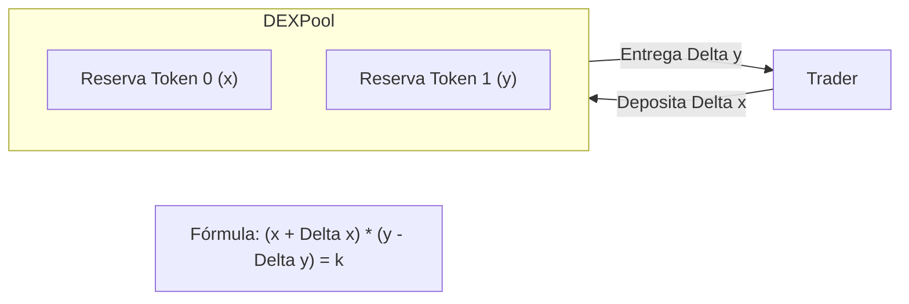
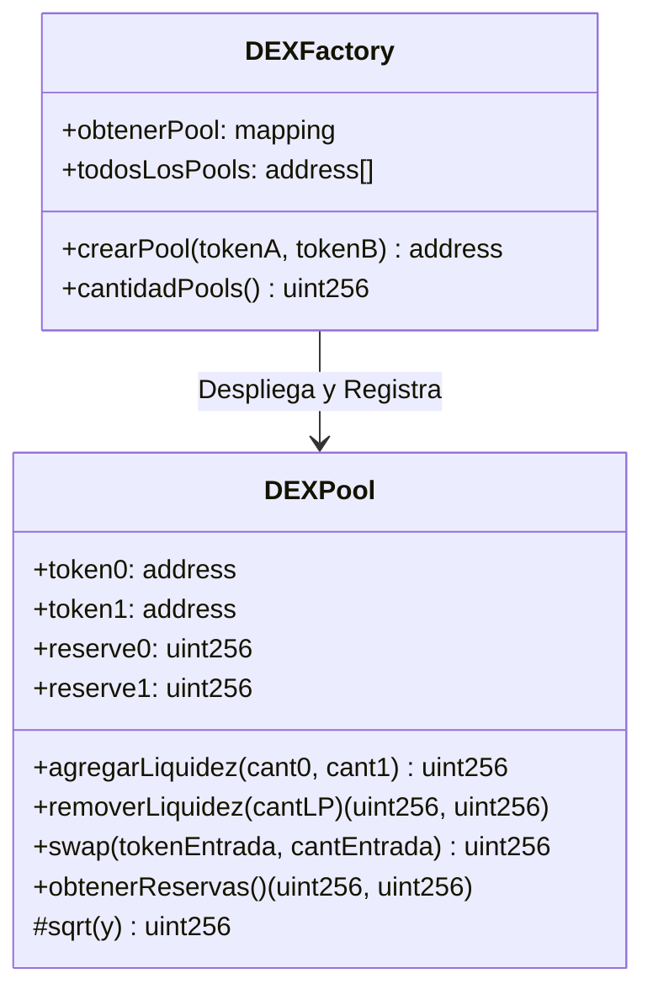

# Fundamentos Académicos de Exchanges Descentralizados (DEX), Pools de Liquidez y Swaps

Este documento proporciona un análisis de nivel académico y técnico sobre los Exchanges Descentralizados (DEX) basados en Creadores de Mercado Automatizados (AMM, por sus siglas en inglés). Se examinan las matemáticas subyacentes, los flujos de trabajo de provisión y retiro de liquidez, el impacto de precios, la pérdida impermanente y las consideraciones críticas de implementación a bajo nivel en Solidity utilizando la biblioteca OpenZeppelin.

---

## 1. Introducción a los Creadores de Mercado Automatizados (AMM)

En los mercados financieros tradicionales y en los Exchanges Centralizados (CEX), el descubrimiento de precios y la ejecución de operaciones se realizan mediante un **Libro de Órdenes (Order Book)**. Este sistema registra las intenciones de compra (bids) y venta (asks) de diferentes participantes, requiriendo que un creador de mercado (market maker) provea liquidez de manera activa ajustando sus ofertas. Sin embargo, en el entorno de la cadena de bloques (blockchain), mantener un libro de órdenes centralizado es extremadamente ineficiente y costoso debido a la latencia de procesamiento de bloques, el rendimiento limitado (throughput) y los altos costos de gas asociados con la actualización frecuente del estado en la máquina virtual de Ethereum (EVM).

Para solventar estas limitaciones, surgieron los **Creadores de Mercado Automatizados (AMM)**. En lugar de emparejar compradores y vendedores de forma directa e individualizada, un AMM descentraliza el proceso permitiendo que los usuarios operen directamente contra un contrato inteligente que contiene reservas de tokens, conocido como **Piscina de Liquidez (Liquidez Pool)**. El precio de los activos dentro de esta piscina se define algorítmicamente mediante funciones matemáticas que vinculan las reservas disponibles. Esto democratiza la provisión de liquidez, ya que cualquier usuario puede convertirse en un **Proveedor de Liquidez (LP)** depositando sus activos a cambio de una participación proporcional en las tarifas de intercambio generadas por el pool.

---

## 2. La Fórmula del Producto Constante ($x \cdot y = k$)

El modelo de AMM más representativo y pedagógico es el de **Producto Constante**, popularizado por protocolos como Uniswap V1 y V2. Este modelo se rige por la ecuación fundamental:

$$x \cdot y = k$$

Donde:
*   $x$ es la reserva disponible del primer token (Token 0).
*   $y$ es la reserva disponible del segundo token (Token 1).
*   $k$ es una constante invariante que debe permanecer inalterada durante los intercambios comerciales (swaps) libres de comisiones.

La relación matemática dicta que la multiplicación de las reservas de ambos tokens siempre debe ser constante antes y después de un swap. Gráficamente, esta ecuación define una hipérbola donde los ejes cartesianos representan las reservas de cada activo. Dado que el producto debe mantenerse constante, si un trader introduce una cantidad $\Delta x$ de Token 0 en la piscina, debe retirar una cantidad equivalente $\Delta y$ de Token 1 de tal manera que la nueva relación satisfaga la condición de invariabilidad.



### 2.1 Deducción Matemática de la Cantidad de Salida ($\Delta y$)

Para determinar exactamente cuántos tokens de salida ($\Delta y$) recibe un usuario al aportar una cantidad de entrada ($\Delta x$), partimos de la igualdad fundamental del producto constante antes y después del intercambio:

$$x \cdot y = (x + \Delta x) \cdot (y - \Delta y)$$

1. Multiplicamos los términos del lado derecho de la ecuación:
   $$x \cdot y = x \cdot y - x \cdot \Delta y + \Delta x \cdot y - \Delta x \cdot \Delta y$$

2. Restamos $x \cdot y$ en ambos lados para simplificar:
   $$0 = - x \cdot \Delta y + \Delta x \cdot y - \Delta x \cdot \Delta y$$

3. Despejamos los términos que contienen $\Delta y$:
   $$x \cdot \Delta y + \Delta x \cdot \Delta y = \Delta x \cdot y$$

4. Factorizamos $\Delta y$ en el lado izquierdo:
   $$\Delta y \cdot (x + \Delta x) = y \cdot \Delta x$$

5. Dividimos entre $(x + \Delta x)$ para aislar $\Delta y$:
   $$\Delta y = \frac{y \cdot \Delta x}{x + \Delta x}$$

Esta fórmula pura nos permite calcular el retorno exacto del swap. Sin embargo, para incentivar a los proveedores de liquidez, los protocolos cobran una comisión sobre el volumen operado (típicamente del 0.3%).

### 2.2 Incorporación de la Comisión del 0.3%

Cuando se cobra una comisión del 0.3%, solo el 99.7% de la cantidad aportada por el trader ($\Delta x$) se añade efectivamente a las reservas útiles para el swap comercial, mientras que el 0.3% restante se retiene directamente en el pool incrementando el valor de la constante $k$ a largo plazo. 

Para integrar esta tasa en la aritmética de punto entero sin necesidad de utilizar decimales (los cuales no son soportados de manera nativa por la EVM), escalamos el cálculo por un factor de 1000:

*   La cantidad efectiva con comisión es $\Delta x_{\text{con comision}} = \Delta x \cdot 997$.
*   La ecuación de reservas se reescribe como:

$$\Delta y = \frac{y \cdot (\Delta x \cdot 997)}{(x \cdot 1000) + (\Delta x \cdot 997)}$$

Esta formulación evita desbordamientos de precisión y garantiza que la comisión sea cobrada de forma exacta a favor del pool, mitigando errores de redondeo que pudieran ser explotados de forma maliciosa.

### 2.3 Deslizamiento (Slippage) e Impacto de Precio

Un concepto fundamental para los estudiantes de DeFi es el **Impacto de Precio**. A diferencia de un libro de órdenes donde el precio es lineal hasta consumir el volumen disponible de una oferta, en un AMM de producto constante el precio de intercambio marginal varía de manera continua a lo largo de la hipérbola. 

El precio spot teórico de Token 0 en términos de Token 1 es simplemente la derivada de la curva, o el ratio instantáneo de reservas:

$$P_{\text{spot}} = \frac{y}{x}$$

Sin embargo, el precio efectivo ($P_{\text{efectivo}}$) que paga el trader al ejecutar un swap de tamaño finito $\Delta x$ es el ratio promedio del intercambio:

$$P_{\text{efectivo}} = \frac{\Delta y}{\Delta x} = \frac{y}{x + \Delta x}$$

A medida que el tamaño de la orden $\Delta x$ aumenta en relación con las reservas totales del pool $x$, el precio efectivo disminuye drásticamente. Esta divergencia entre el precio spot estimado y el precio de ejecución real se denomina **Impacto de Precio**. El **Deslizamiento (Slippage)**, por su parte, es la variación que puede experimentar este impacto de precio entre el momento en que el usuario firma y envía la transacción y el momento en que la transacción es confirmada en la cadena de bloques por un validador.

---

## 3. Dinámica y Ciclo de Vida de los Pools de Liquidez

El funcionamiento de un pool de liquidez requiere un flujo de trabajo claro de tres etapas: inicialización del pool, adición proporcional de activos y extracción o retiro de la liquidez.

### 3.1 Provisión de Liquidez Inicial y Cripto-Acciones (LP Tokens)

Cuando una piscina de liquidez es creada, no cuenta con reservas ($x = 0, y = 0$). El primer proveedor de liquidez que deposita activos define el precio relativo inicial de la piscina. Dado que no existe una relación preestablecida de precios, el primer depósito establece la tasa de cambio base.

Para registrar formalmente la contribución de los proveedores y permitirles reclamar sus activos en el futuro, el contrato de la piscina emite tokens representativos de participación, denominados **LP Tokens (Liquidity Provider Tokens)**. En la arquitectura Uniswap V2 (y en nuestro contrato `DEXPool`), el contrato de la piscina hereda directamente del estándar ERC20 de OpenZeppelin.

Para calcular cuántos LP tokens emitir en el primer depósito, se utiliza la **Media Geométrica** de los depósitos iniciales. Esto asegura que el ratio de LP tokens emitidos sea independiente de las unidades de escala o denominaciones de los tokens individuales:

$$\text{LP}_{\text{inicial}} = \sqrt{x_{\text{aportado}} \cdot y_{\text{aportado}}}$$

En implementaciones industriales avanzadas, para evitar un vector de ataque conocido como el "Ataque de Inflación" (donde un atacante inicial dona una cantidad microscópica de tokens al pool y manipula el precio de la acción de LP mediante redondeo), se quema de forma permanente una cantidad ínfima de tokens LP (1000 wei, conocida como `MINIMUM_LIQUIDITY`) enviándola a la dirección cero (`0x000...000`).

### 3.2 Depósitos Subsecuentes (Mantenimiento de la Proporción)

Una vez que el pool ya cuenta con liquidez acumulada y un precio definido por sus reservas reales, cualquier depósito posterior debe realizarse respetando estrictamente la proporción de precios vigente. Esto previene que se introduzca un arbitraje inmediato a costa de desbalancear el pool.

La regla de proporcionalidad establece que:

$$\frac{x_{\text{nuevo}}}{y_{\text{nuevo}}} = \frac{x_{\text{reserva}}}{y_{\text{reserva}}}$$

Si un usuario desea depositar una cantidad máxima de $x$ y de $y$, el contrato inteligente calcula el valor óptimo del segundo activo necesario en función del primero:

$$y_{\text{optimo}} = \frac{x_{\text{deseado}} \cdot y_{\text{reserva}}}{x_{\text{reserva}}}$$

*   Si $y_{\text{optimo}} \le y_{\text{deseado}}$, el contrato toma exactamente $x_{\text{deseado}}$ e $y_{\text{optimo}}$, devolviendo o no transfiriendo el excedente del usuario.
*   Si $y_{\text{optimo}} > y_{\text{deseado}}$, se calcula en sentido inverso la cantidad óptima de $x$:
    $$x_{\text{optimo}} = \frac{y_{\text{deseado}} \cdot x_{\text{reserva}}}{y_{\text{reserva}}}$$
    Garantizando que $x_{\text{optimo}} \le x_{\text{deseado}}$.

La cantidad de LP tokens a emitir para este depósito subsecuente se calcula tomando la menor proporción aportada respecto al suministro total de LP tokens ($\text{LP}_{\text{total}}$):

$$\text{LP}_{\text{emitidos}} = \min\left( \frac{x_{\text{aportado}} \cdot \text{LP}_{\text{total}}}{x_{\text{reserva}}}, \frac{y_{\text{aportado}} \cdot \text{LP}_{\text{total}}}{y_{\text{reserva}}} \right)$$

### 3.3 Extracción de Liquidez

Cuando un proveedor de liquidez desea retirar sus activos, devuelve sus LP tokens al contrato de la piscina. El contrato realiza una operación de "quema" (`_burn`) de dichos tokens y calcula la parte proporcional de las reservas subyacentes que corresponden a su participación:

$$x_{\text{retirar}} = \frac{\text{LP}_{\text{proveedor}} \cdot x_{\text{reserva}}}{\text{LP}_{\text{total}}}$$

$$y_{\text{retirar}} = \frac{\text{LP}_{\text{proveedor}} \cdot y_{\text{reserva}}}{\text{LP}_{\text{total}}}$$

Los tokens resultantes se transfieren directamente de vuelta a la billetera del proveedor.

---

## 4. Pérdida Impermanente (Impermanent Loss)

Uno de los mayores riesgos para los proveedores de liquidez en un AMM es la **Pérdida Impermanente (Impermanent Loss)**. Esta ocurre cuando la relación de precio externa de los tokens provistos se desvía de la relación que tenían al momento del depósito en la piscina.

### 4.1 Explicación Matemática de la Pérdida Impermanente

Supongamos que un proveedor deposita activos en un pool con proporción inicial 1:1, donde $x \cdot y = k$. El valor total del portafolio en términos del Token 1, si el proveedor simplemente hubiera mantenido (HODL) sus tokens en su billetera privada, sería:

$$V_{\text{HODL}} = x_0 \cdot P + y_0$$

Donde $P$ es el nuevo precio relativo de Token 0 medido en Token 1.
Sin embargo, debido a que el pool equilibra constantemente el precio a través de traders de arbitraje que compran el activo subvalorado y venden el sobrevalorado hasta que el precio interno iguale al externo, las nuevas reservas del pool en el nuevo precio $P$ satisfacen:

$$x_t = \sqrt{\frac{k}{P}} \quad \text{y} \quad y_t = \sqrt{k \cdot P}$$

El valor real de la liquidez del proveedor dentro de la piscina en el nuevo precio es:

$$V_{\text{Pool}} = x_t \cdot P + y_t = \sqrt{\frac{k}{P}} \cdot P + \sqrt{k \cdot P} = 2 \cdot \sqrt{k \cdot P}$$

La relación matemática de la Pérdida Impermanente ($IL$) se calcula comparando el valor dentro del pool frente al valor de haber mantenido los activos fuera:

$$IL(r) = \frac{V_{\text{Pool}}}{V_{\text{HODL}}} - 1 = \frac{2\sqrt{r}}{1 + r} - 1$$

Donde $r = \frac{P_{\text{nuevo}}}{P_{\text{inicial}}}$ es la variación del precio relativo.

Dado que la función $IL(r) \le 0$ para cualquier valor de $r \neq 1$, el proveedor siempre experimentará una pérdida nominal comparado con la estrategia pasiva de mantener los tokens, a menos que el precio relativo regrese exactamente a su ratio inicial (de ahí el término "impermanente", ya que la pérdida desaparece si los precios relativos vuelven a la paridad original). Esta pérdida se compensa en la práctica con la acumulación continua de las comisiones del 0.3% cobradas en cada swap, las cuales aumentan el valor neto de las reservas y contrarrestan el efecto del cambio de precio relativo si el volumen operado es lo suficientemente alto.

---

## 5. Arquitectura e Implementación a Bajo Nivel en Solidity

La implementación práctica de estos conceptos requiere tomar decisiones de diseño arquitectónico y de seguridad en Solidity para garantizar la integridad física de los fondos.



### 5.1 Estructuración y Fábrica de Pools (`DEXFactory`)
Siguiendo las mejores prácticas de modularidad, se divide el sistema en dos contratos:
1.  **`DEXFactory`**: Actúa como un registro único y fábrica. Garantiza que solo exista un contrato `DEXPool` por cada par de tokens ERC20 mediante ordenamiento alfanumérico en su inicialización (`token0 < token1`). Esto centraliza las consultas y permite el enrutamiento limpio en frontends o agregadores DeFi.
2.  **`DEXPool`**: Gestiona de forma aislada las reservas y la lógica de emisión de LP tokens para su par específico. Al separar la lógica de cada piscina en un contrato independiente, se reduce el riesgo sistémico de que una falla en un pool afecte el resto de los pares del protocolo.

### 5.2 Algoritmo de Raíz Cuadrada Entera (Método de Babilonia)

Dado que la Máquina Virtual de Ethereum (EVM) y el lenguaje Solidity no proveen soporte nativo para números decimales de coma flotante ni funciones matemáticas avanzadas como la raíz cuadrada, es necesario implementar algoritmos numéricos eficientes directamente sobre enteros de 256 bits (`uint256`). Para estimar la media geométrica inicial del pool y emitir tokens LP de manera equilibrada, se implementa una versión determinista del **Método de Babilonia**, el cual es una simplificación del método general de **Newton-Raphson**.

#### 5.2.1 Por qué se requiere una raíz cuadrada en el depósito inicial
La cantidad de tokens de liquidez (LP) emitida en el primer depósito define la métrica base de poder del pool. Si utilizáramos una media aritmética simple (como la suma de las cantidades $x + y$), el sistema sería vulnerable a la manipulación del precio inicial. 

Por ejemplo, consideremos dos depósitos que arrojan el mismo producto constante ($k = 100$):
*   **Depósito A**: 10 Token0 y 10 Token1 ($10 \cdot 10 = 100$). Con una media aritmética, se emitirían $10 + 10 = 20$ LP tokens.
*   **Depósito B**: 100 Token0 y 1 Token1 ($100 \cdot 1 = 100$). Con una media aritmética, se emitirían $100 + 1 = 101$ LP tokens.

Aunque ambos depósitos proporcionan exactamente el mismo producto geométrico (y por ende el mismo "tamaño" o profundidad de mercado inicial bajo la curva), el Depósito B obtendría más de 5 veces la cantidad de LP tokens del Depósito A. Esto permitiría a un atacante depositar una cantidad masiva de un token inútil o sumamente devaluado y una cantidad mínima de un token de alto valor para apoderarse de la gran mayoría de las acciones LP del pool. 

Al utilizar la media geométrica $\text{LP} = \sqrt{x \cdot y}$, ambos depósitos reciben exactamente la misma cantidad de LP tokens ($\sqrt{100} = 10$), garantizando una métrica de participación simétrica y neutral respecto a la paridad de precios inicial elegida.

#### 5.2.2 Derivación Matemática del Algoritmo
El método de Babilonia aproxima iterativamente la raíz cuadrada de un número real positivo $y$. Matemáticamente, equivale a encontrar la raíz de la función:

$$f(x) = x^2 - y = 0$$

Aplicando el método de Newton-Raphson, la fórmula de actualización para estimar la raíz en el paso $n+1$ a partir de la estimación en el paso $n$ es:

$$x_{n+1} = x_n - \frac{f(x_n)}{f'(x_n)}$$

Dado que $f'(x) = 2x$, sustituimos en la fórmula:

$$x_{n+1} = x_n - \frac{x_n^2 - y}{2x_n} = x_n - \frac{x_n}{2} + \frac{y}{2x_n} = \frac{x_n + \frac{y}{x_n}}{2}$$

Esta última expresión es el núcleo del algoritmo de Babilonia: la nueva aproximación ($x_{n+1}$) es la media aritmética entre la aproximación anterior ($x_n$) y el valor original dividido por dicha aproximación ($\frac{y}{x_n}$).

#### 5.2.3 Implementación a Bajo Nivel en Solidity

```solidity
function sqrt(uint256 y) internal pure returns (uint256 z) {
    if (y > 3) {
        z = y;
        uint256 x = y / 2 + 1;
        while (x < z) {
            z = x;
            x = (y / x + x) / 2;
        }
    } else if (y != 0) {
        z = 1;
    }
    // Si y es 0, z implícitamente retorna 0
}
```

*   **Punto de partida óptimo (Aceleración de convergencia)**: Se establece la estimación inicial como $x_0 = \frac{y}{2} + 1$. Al dividir por 2 e iniciar un paso adelante, se reduce drásticamente el número de iteraciones necesarias para números muy grandes de 256 bits.
*   **Condición del bucle (`while (x < z)`)**: En cada iteración, `z` guarda el valor de la aproximación anterior ($x_n$) y `x` calcula el valor nuevo ($x_{n+1}$). Debido al truncamiento de enteros en Solidity (donde por ejemplo `3 / 2 = 1`), cuando el algoritmo llega a la convergencia real del entero inferior, el cálculo de `x` comenzará a oscilar o será mayor o igual que `z`. La condición `x < z` asegura que detengamos el bucle tan pronto como el valor calculado deje de disminuir de forma estrictamente decreciente, evitando bucles infinitos y reteniendo en `z` la estimación del entero truncado más cercano.
*   **Casos de guarda (`y <= 3`)**: Para valores sumamente pequeños, la división entera provoca distorsiones severas (por ejemplo, si $y = 3$, el valor de $x_0$ sería $3/2 + 1 = 2$, luego $x_1 = (2 + 3/2)/2 = (2 + 1)/2 = 1$, y dado que $1 < 2$, continuaría. Al siguiente paso, $x_2 = (1 + 3/1)/2 = 2$, rompiendo la condición y saliendo). Para evitar oscilaciones inestables en valores mínimos, si $y \le 3$ y es diferente de cero, el algoritmo retorna directamente `1` (que es la raíz entera truncada de 1, 2 y 3). Si es `0`, el flujo del `if` se salta e implícitamente retorna `0`.
*   **Complejidad y Gas**: Este método tiene una **convergencia cuadrática** (el número de dígitos significativos correctos se duplica aproximadamente en cada iteración). Para números de 256 bits, converge en un máximo de 6 a 8 iteraciones. Esto consume típicamente menos de 600 unidades de gas, lo cual es insignificante y perfectamente viable para ejecuciones en línea.

### 5.3 Control de Precisión Numérica (Multiplicación antes de División)
Un error clásico en la EVM es la pérdida de precisión por división truncada. Dado que Solidity realiza aritmética entera de forma exclusiva:
*   Si calculamos primero `(cantidadEntrada / reservaEntrada) * reservaSalida`, la división inicial podría dar como resultado `0` si la cantidad de entrada es menor que el divisor, perdiendo todo el valor.
*   La regla de oro en Solidity es **efectuar siempre todas las multiplicaciones antes que las divisiones**, manteniendo los factores escalados al máximo ancho de palabra de 256 bits (`uint256`) antes de truncar el resultado.

### 5.4 Mitigación de Reentrada (`ReentrancyGuard`) y Patrón Checks-Effects-Interactions
El mayor vector de ataque en Web3 es la reentrada (reentrancy), popularizada en el hack de The DAO. Ocurre cuando un contrato inteligente realiza una llamada externa a una dirección interactiva antes de actualizar sus estados internos, permitiendo al receptor volver a llamar a la función en un bucle recursivo.

Para mitigar esto en `DEXPool`:
1.  Heredamos de `ReentrancyGuard` de OpenZeppelin y aplicamos el modificador `nonReentrant` a las funciones estatales (`agregarLiquidez`, `removerLiquidez`, `swap`). Esto aplica un candado (mutex) que impide la ejecución concurrente o recursiva de funciones protegidas en la misma transacción.
2.  Seguimos estrictamente el patrón **Checks-Effects-Interactions (Validaciones-Efectos-Interacciones)**:
    *   **Checks**: Validamos las condiciones requeridas en los `require`.
    *   **Effects**: Actualizamos los balances de reservas internas antes de realizar cualquier transferencia de tokens.
    *   **Interactions**: Transferimos los tokens ERC20 mediante llamadas externas utilizando `transfer` o `transferFrom` al final de la ejecución.

---

## 6. Guía de Uso Práctico ("How To")

A continuación se presenta un flujo paso a paso sobre cómo interactuar con estos contratos utilizando una interfaz web o scripts basados en JavaScript/Ethers.js.

### Paso 1: Creación del Pool desde la Fábrica
Para establecer un nuevo pool de intercambio para dos tokens existentes:

```javascript
// Obtener contrato de la Fábrica desplegada
const Factory = await ethers.getContractAt("DEXFactory", DIRECCION_FACTORY);

// Iniciar transacción de creación de Pool para Token A y Token B
const tx = await Factory.crearPool(tokenA.target, tokenB.target);
await tx.wait();

// Consultar la dirección generada para el par
const poolAddress = await Factory.obtenerPool(tokenA.target, tokenB.target);
console.log("Dirección del Pool creado:", poolAddress);
```

### Paso 2: Aprobación previa de Tokens (Approve)
Antes de que un proveedor pueda interactuar con el pool para añadir liquidez, debe autorizar al contrato `DEXPool` a extraer los tokens de su billetera:

```javascript
const Pool = await ethers.getContractAt("DEXPool", poolAddress);

// Proveedor aprueba al Pool para transferir Token A y Token B
const cantidadMaxima = ethers.parseEther("1000"); // 1000 tokens
await tokenA.approve(poolAddress, cantidadMaxima);
await tokenB.approve(poolAddress, cantidadMaxima);
```

### Paso 3: Aportación de Liquidez
El proveedor ejecuta el depósito inicial o proporcional:

```javascript
const cant0Deseada = ethers.parseEther("100"); // 100 del Token 0
const cant1Deseada = ethers.parseEther("100"); // 100 del Token 1

// Llamada para agregar liquidez al pool
const txLiquidez = await Pool.agregarLiquidez(cant0Deseada, cant1Deseada);
await txLiquidez.wait();

console.log("Liquidez agregada con éxito.");
```

### Paso 4: Ejecución del Swap (Intercambio)
Un trader desea comprar Token 1 vendiendo Token 0:

```javascript
const cantidadEntrada = ethers.parseEther("10"); // Vender 10 Token 0

// 1. Trader aprueba al pool para transferir su Token 0 de entrada
await tokenA.approve(poolAddress, cantidadEntrada);

// 2. Ejecutar el swap
const txSwap = await Pool.swap(tokenA.target, cantidadEntrada);
await txSwap.wait();

console.log("Intercambio finalizado.");
```

### Paso 5: Retiro de Liquidez
El proveedor decide reclamar sus fondos originales más las comisiones acumuladas:

```javascript
// Consultar cuántos LP tokens posee el proveedor
const balanceLP = await Pool.balanceOf(proveedorAddress);

// Retirar el 100% de la liquidez
const txRetiro = await Pool.removerLiquidez(balanceLP);
await txRetiro.wait();

console.log("Liquidez retirada e intereses cobrados.");
```
