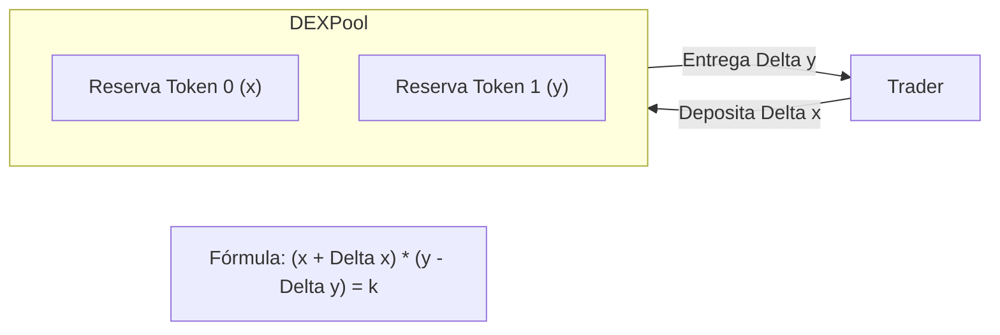
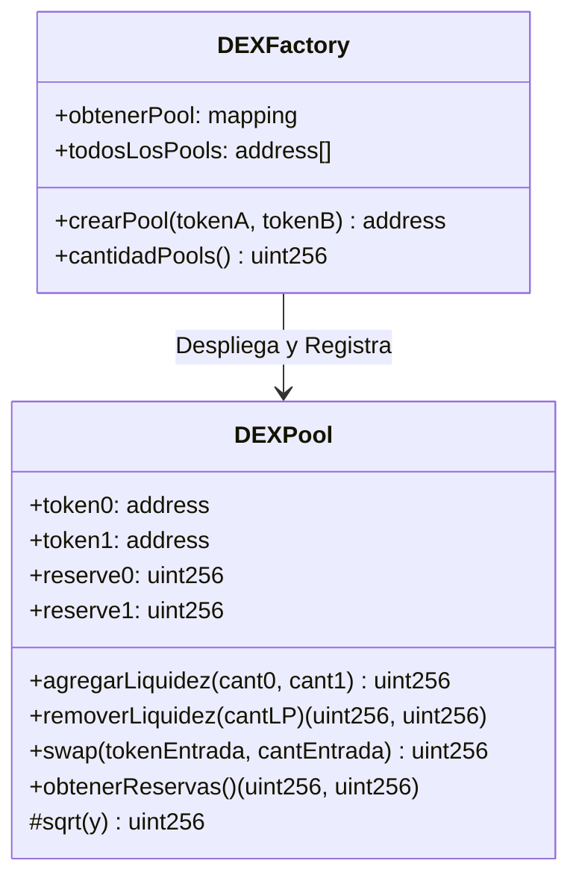

# Fundamentos Académicos de Exchanges Descentralizados (DEX), Pools de Liquidez y Swaps

Este documento proporciona un análisis de nivel académico y técnico sobre los Exchanges Descentralizados (DEX) basados en Creadores de Mercado Automatizados (AMM, por sus siglas en inglés). Se examinan en profundidad las matemáticas subyacentes, los flujos de trabajo de provisión y retiro de liquidez, el impacto de precios, la pérdida impermanente y las consideraciones críticas de implementación a bajo nivel en Solidity utilizando la biblioteca OpenZeppelin.

---

## 1. Introducción a los Creadores de Mercado Automatizados (AMM)

En los mercados financieros tradicionales y en los Exchanges Centralizados (CEX), el descubrimiento de precios y la ejecución de operaciones se realizan mediante un **Libro de Órdenes (Order Book)**. Este sistema registra las intenciones de compra (*bids*) y venta (*asks*) de diferentes participantes, requiriendo que un creador de mercado (*market maker*) provea liquidez de manera activa ajustando sus ofertas en tiempo real. 

En un entorno blockchain, mantener un libro de órdenes en la cadena de bloques (*on-chain*) es sumamente ineficiente y costoso por las siguientes razones:
1.  **Latencia de procesamiento**: Las transacciones no se procesan de forma continua, sino en bloques discretos (cada ~12 segundos en Ethereum).
2.  **Rendimiento limitado (Throughput)**: El espacio de bloques es un recurso escaso y disputado.
3.  **Costos de gas prohibitivos**: Cada inserción, cancelación o modificación de una orden en el almacenamiento global de la EVM requiere modificar el estado de almacenamiento, lo que consume miles de unidades de gas por cada interacción.

Para solventar estas limitaciones, surgieron los **Creadores de Mercado Automatizados (AMM)**. En lugar de emparejar compradores y vendedores de forma directa e individualizada, un AMM descentraliza el proceso permitiendo que los usuarios operen directamente contra un contrato inteligente que contiene reservas de tokens, conocido como **Piscina de Liquidez (Liquidity Pool)**. El precio de los activos dentro de esta piscina se define algorítmicamente mediante funciones matemáticas que vinculan las reservas disponibles. Esto democratiza la provisión de liquidez, ya que cualquier usuario puede convertirse en un **Proveedor de Liquidez (LP)** depositando sus activos a cambio de una participación proporcional en las tarifas de intercambio generadas por el pool.

---

## 2. La Fórmula del Producto Constante ($x \cdot y = k$)

El modelo de AMM más representativo y pedagógico es el de **Producto Constante**, popularizado por protocolos como Uniswap V1 y V2. Este modelo se rige por la ecuación fundamental:

$$x \cdot y = k$$

Donde:
*   $x$ es la reserva disponible del primer token (Token 0).
*   $y$ es la reserva disponible del segundo token (Token 1).
*   $k$ es una constante invariante que representa el producto geométrico de las reservas. Este producto debe permanecer inalterado durante los intercambios comerciales (*swaps*) libres de comisiones.

### 2.1 Significado Geométrico e Implicaciones de Curvatura

Gráficamente, la ecuación $x \cdot y = k$ define una hipérbola en el primer cuadrante de los ejes cartesianos, donde los ejes representan las reservas de cada activo.

```
Reservas de Token 1 (y)
   ^
   |  *  <- Precio Spot Alto (y/x alto)
   |    *
   |      *  <- Paridad Inicial (x = y)
   |        *
   |          *
   |            *  <- Precio Spot Bajo (y/x bajo)
   +-------------------------------------> Reservas de Token 0 (x)
```

Dado que $x$ e $y$ son estrictamente positivos ($x > 0, y > 0$), la curva es asintótica respecto a ambos ejes. Esto tiene una implicación matemática fundamental para los estudiantes: **la piscina de liquidez nunca puede quedarse completamente sin ninguno de los dos tokens**. A medida que un usuario intenta retirar una cantidad masiva de Token 1 inyectando una gran cantidad de Token 0, la reserva de Token 1 ($y$) tiende a cero, lo que provoca que el precio del Token 1 en términos del Token 0 tienda a infinito ($\infty$). Físicamente, el pool siempre conservará una fracción infinitesimal de ambos tokens, encareciendo el intercambio de tal forma que hace imposible la compra total de las reservas.



---

### 2.2 Deducción Matemática de la Cantidad de Salida (`getAmountOut` o $\Delta y$)

Para determinar exactamente cuántos tokens de salida ($\Delta y$) recibe un usuario al aportar una cantidad de entrada ($\Delta x$), partimos de la igualdad del producto constante antes y después del intercambio libre de comisiones:

$$x \cdot y = (x + \Delta x) \cdot (y - \Delta y)$$

1.  **Multiplicamos los términos del lado derecho de la ecuación:**
    $$x \cdot y = x \cdot y - x \cdot \Delta y + \Delta x \cdot y - \Delta x \cdot \Delta y$$

2.  **Restamos $x \cdot y$ en ambos lados para simplificar:**
    $$0 = - x \cdot \Delta y + \Delta x \cdot y - \Delta x \cdot \Delta y$$

3.  **Agrupamos y despejamos los términos que contienen la incógnita $\Delta y$:**
    $$x \cdot \Delta y + \Delta x \cdot \Delta y = \Delta x \cdot y$$

4.  **Factorizamos $\Delta y$ en el lado izquierdo:**
    $$\Delta y \cdot (x + \Delta x) = y \cdot \Delta x$$

5.  **Aislamos la variable de salida $\Delta y$ dividiendo por $(x + \Delta x)$:**
    $$\Delta y = \frac{y \cdot \Delta x}{x + \Delta x}$$

Esta fórmula representa la cantidad exacta de salida en un swap ideal sin comisiones.

---

### 2.3 Deducción Matemática de la Cantidad de Entrada Requerida (`getAmountIn` o $\Delta x$)

En muchas ocasiones, un trader no desea vender una cantidad exacta de entrada, sino que necesita comprar una cantidad exacta de salida ($\Delta y$). Para calcular cuánta cantidad de entrada ($\Delta x$) debe depositar, despejamos $\Delta x$ de la misma ecuación fundamental:

$$x \cdot y = (x + \Delta x) \cdot (y - \Delta y)$$

1.  **Aislamos el término $(x + \Delta x)$ dividiendo ambos lados de la ecuación por $(y - \Delta y)$:**
    $$x + \Delta x = \frac{x \cdot y}{y - \Delta y}$$

2.  **Restamos $x$ en ambos lados para aislar $\Delta x$:**
    $$\Delta x = \frac{x \cdot y}{y - \Delta y} - x$$

3.  **Encontramos un denominador común para consolidar la fracción:**
    $$\Delta x = \frac{x \cdot y - x \cdot (y - \Delta y)}{y - \Delta y}$$
    $$\Delta x = \frac{x \cdot y - x \cdot y + x \cdot \Delta y}{y - \Delta y}$$

4.  **Simplificamos los términos opuestos ($x \cdot y - x \cdot y$):**
    $$\Delta x = \frac{x \cdot \Delta y}{y - \Delta y}$$

Esta fórmula nos da la cantidad exacta de entrada $\Delta x$ requerida para obtener $\Delta y$ unidades de salida del pool.

---

### 2.4 Incorporación de la Comisión de Intercambio (Aritmética Entera)

Para incentivar a los proveedores de liquidez, los protocolos aplican una comisión sobre cada swap (típicamente un $0.3\%$). Esto significa que solo una fracción del activo depositado se utiliza para el intercambio, mientras que el resto se acumula en el pool para los LPs.

Definamos la comisión como un factor $f \in (0, 1)$. En este caso, $f = 0.003$ ($0.3\%$). La cantidad que efectivamente entra al motor de swap es $\Delta x \cdot (1 - f) = \Delta x \cdot 0.997$.

#### 2.4.1 Cantidad de Salida con Comisión (`getAmountOut`)

Sustituyendo $\Delta x$ por su cantidad efectiva $\Delta x \cdot 0.997$ en la ecuación deducida en 2.2:

$$\Delta y = \frac{y \cdot \Delta x \cdot (1 - f)}{x + \Delta x \cdot (1 - f)} = \frac{y \cdot \Delta x \cdot 0.997}{x + \Delta x \cdot 0.997}$$

Dado que Solidity no soporta coma flotante de forma nativa, evitamos decimales escalando la ecuación por un factor de 1000:

$$\Delta y = \frac{y \cdot (\Delta x \cdot 997)}{(x \cdot 1000) + (\Delta x \cdot 997)}$$

Esta es exactamente la fórmula codificada en la función `swap` de nuestro contrato `DEXPool.sol`:

```solidity
uint256 cantidadEntradaConComision = cantidadEntrada * 997;
uint256 numerador = cantidadEntradaConComision * resSalida;
uint256 denominador = (resEntrada * 1000) + cantidadEntradaConComision;
cantidadSalida = numerador / denominador;
```

#### 2.4.2 Cantidad de Entrada Requerida con Comisión (`getAmountIn`)

Sustituyendo la entrada por su cantidad efectiva $\Delta x \cdot (1 - f)$ en la fórmula de 2.3:

$$\Delta x \cdot (1 - f) = \frac{x \cdot \Delta y}{y - \Delta y} \implies \Delta x \cdot 0.997 = \frac{x \cdot \Delta y}{y - \Delta y}$$

Dividimos por 0.997 para despejar $\Delta x$:

$$\Delta x = \frac{x \cdot \Delta y}{(y - \Delta y) \cdot 0.997}$$

Multiplicamos el numerador por 1000 para eliminar los decimales del divisor:

$$\Delta x = \frac{x \cdot \Delta y \cdot 1000}{(y - \Delta y) \cdot 997}$$

**Protección contra redondeo en la EVM (El "+1"):**
Al implementar esta ecuación en Solidity, la división entera de la EVM siempre redondea hacia abajo (truncamiento). Si la división se trunca hacia abajo, el trader terminaría depositando ligeramente menos de lo requerido matemáticamente, lo que resultaría en una ligera devaluación de las reservas del pool a lo largo del tiempo. 

Para evitar esto, los contratos profesionales (como Uniswap V2) le suman `1` al resultado final de la división:

$$\Delta x_{\text{Solidity}} = \left( \frac{x \cdot \Delta y \cdot 1000}{(y - \Delta y) \cdot 997} \right) + 1$$

Esto garantiza que cualquier residuo fraccionario se redondee hacia arriba a favor de la piscina de liquidez, protegiendo las reservas.

---

### 2.5 Deslizamiento (Slippage) vs Impacto de Precio (Price Impact)

Es crucial que los estudiantes entiendan la diferencia operativa entre estos dos conceptos:

1.  **Impacto de Precio (Price Impact):**
    Es el cambio de precio derivado directamente de la matemática del pool al ejecutar una orden de tamaño finito. El precio spot instantáneo (precio marginal) antes de operar es:
    $$P_{\text{spot}} = \frac{y}{x}$$
    El precio efectivo de ejecución ($P_{\text{ejecucion}}$) que experimenta el usuario al mover las reservas es:
    $$P_{\text{ejecucion}} = \frac{\Delta y}{\Delta x} = \frac{y \cdot 0.997}{x + \Delta x \cdot 0.997}$$
    El Impacto de Precio es la diferencia porcentual entre el precio spot inicial y el precio de ejecución final. A mayor tamaño de orden en comparación con las reservas ($x$), mayor es la desviación del precio.
    
2.  **Deslizamiento (Slippage):**
    Es la variación del precio de ejecución que ocurre *después* de que el trader envía su transacción debido al cambio en el estado del pool provocado por otras transacciones que se procesaron antes en la blockchain. Si otro usuario ejecuta un swap antes, las reservas cambian y el nuevo precio de ejecución diferirá del estimado originalmente por el frontend. Los traders definen un límite máximo de deslizamiento admitido (ej. $0.5\%$), y si el precio final se desvía más allá de ese límite, la transacción se revierte (`revert`).

---

## 3. Dinámica y Ciclo de Vida de los Pools de Liquidez

La provisión de liquidez es el mecanismo que da profundidad de mercado al AMM. En este apartado analizaremos matemáticamente los depósitos de fondos.

### 3.1 El Concepto matemático de Liquidez ($L$)

En un AMM de producto constante, definimos la **Liquidez ($L$)** de una curva como la media geométrica de las reservas, que equivale a la raíz cuadrada de la constante $k$:

$$L = \sqrt{x \cdot y} \quad \implies \quad L^2 = k$$

La variable $L$ mide la profundidad del pool. Un incremento en la liquidez $L$ desplaza la curva de la hipérbola hacia afuera, alejándola del origen. Esto reduce el impacto de precio para un volumen de transacciones dado:

```
Reservas de Token 1 (y)
   ^
   |      *  <- L alta (curva desplazada, menos impacto de precio)
   |    *   *
   |   *      * <- L baja (curva cercana al origen, alto impacto)
   |  *
   +-------------------------------------> Reservas de Token 0 (x)
```

---

### 3.2 Provisión de Liquidez Inicial y Emisión de LP Tokens

Cuando un pool se crea por primera vez, las reservas son nulas ($x = 0, y = 0$). El primer proveedor define el precio de mercado inicial del par al establecer el ratio de las reservas que deposita.

A cambio de aportar activos, el pool le acuña al usuario tokens representativos de su participación, llamados **LP Tokens** (que en nuestro contrato `DEXPool` se gestionan mediante herencia directa de ERC20 de OpenZeppelin).

#### 3.2.1 Por qué se utiliza la Media Geométrica para el Depósito Inicial

Para calcular la cantidad de LP tokens emitidos en el primer depósito ($\text{LP}_{\text{inicial}}$) a partir de las cantidades aportadas ($x_{\text{aportado}}, y_{\text{aportado}}$), se utiliza la fórmula:

$$\text{LP}_{\text{inicial}} = \sqrt{x_{\text{aportado}} \cdot y_{\text{aportado}}}$$

La media geométrica es el único enfoque simétrico que garantiza que la cantidad de LP tokens emitidos dependa exclusivamente del valor acumulado y no de la escala nominal de los activos individuales. 

*   *Ejemplo de vulnerabilidad de la media aritmética:*
    Si se emitieran LP tokens sumando cantidades ($x + y$), supongamos un par donde Token 0 vale $\$1$ y Token 1 vale $\$1000$. Si un usuario deposita 1000 unidades de Token 0 y 1 unidad de Token 1, obtendría $1000 + 1 = 1001$ LP tokens. Otro usuario que deposite 1 unidad de Token 0 y 1000 unidades de Token 1 obtendría el mismo número de LP tokens ($1001$), pero habría depositado un valor monetario radicalmente distinto.
    Al utilizar $\sqrt{x \cdot y}$, se calcula el área geométrica del pool ($L$), garantizando que la emisión sea independiente de la escala de precios inicial escogida por el creador del pool.

#### 3.2.2 El Ataque de Inflación de LPs (Explicación Académica)

En implementaciones a nivel industrial, la fórmula del depósito inicial incluye un mecanismo de mitigación de vulnerabilidad:

$$\text{LP}_{\text{inicial}} = \sqrt{x_{\text{aportado}} \cdot y_{\text{aportado}}} - \text{MINIMUM\_LIQUIDITY}$$

Donde $\text{MINIMUM\_LIQUIDITY} = 10^3$ wei (una cantidad infinitesimal de tokens de participación) se acuña y se quema de forma permanente enviándola a la dirección cero (`address(0)`).

**El Vector de Ataque:**
Si no se restara y quemara esta cantidad mínima, un atacante inicial podría manipular el precio de las acciones de LP (LP Tokens) de la siguiente manera:
1.  **Depósito mínimo**: El atacante aporta una cantidad muy pequeña, por ejemplo, $1000$ wei de Token 0 y $1000$ wei de Token 1.
2.  **Acuñación inicial**: Se le emite exactamente $\sqrt{1000 \cdot 1000} = 1000$ LP tokens. El atacante posee el $100\%$ del pool.
3.  **Donación directa**: El atacante transfiere directamente (usando `transfer` directo de ERC20 al contrato del pool, sin pasar por `agregarLiquidez`) una cantidad masiva de tokens al pool, por ejemplo, $10^6$ tokens ($10^{24}$ wei).
4.  **Efecto de reservas**: Las reservas de la piscina ($x$) suben a $10^{24}$ wei, pero el suministro total de LP tokens (`totalSupply`) sigue siendo $1000$ wei. El valor implícito de cada LP token se ha disparado a un valor gigantesco:
    $$\text{Valor de 1 LP} = \frac{\text{Reservas}}{\text{TotalSupply}} = \frac{10^{24}}{1000} = 10^{21} \text{ wei}$$
5.  **Depósito del usuario**: Un usuario legítimo intenta depositar una cantidad menor, por ejemplo, $1.5 \cdot 10^6$ tokens ($1.5 \cdot 10^{24}$ wei).
6.  **Cálculo de LP para el usuario**:
    $$\text{LP}_{\text{usuario}} = \frac{\text{cantidad} \cdot \text{totalSupply}}{\text{reserva}} = \frac{1.5 \cdot 10^{24} \cdot 1000}{10^{24}} = 1500 \text{ LP tokens}$$
    Si el depósito del usuario fuera menor a $10^6$ tokens, por ejemplo $9.9 \cdot 10^5$ tokens, la división entera de Solidity truncaría el resultado a cero:
    $$\text{LP}_{\text{usuario}} = \frac{9.9 \cdot 10^{23} \cdot 1000}{10^{24}} = 990 \text{ LP (se reduce a 0 por truncamiento si no alcanza la proporción óptima del precio unitario)}$$
    El usuario depositaría sus tokens en el contrato pero recibiría **0 LP tokens**, permitiendo al atacante retirar todo el depósito del usuario al ser el único dueño de acciones del pool.

**Solución mediante Quema (`MINIMUM_LIQUIDITY`):**
Al quemar permanentemente $1000$ wei de LP tokens en `address(0)` en el bloque inicial, el atacante no puede elevar indefinidamente el precio de una acción LP individual mediante donaciones directas sin tener que donar sumas exorbitantes que destruirían su rentabilidad (ya que parte del valor se asocia de forma irreversible a las acciones quemadas en la dirección cero).

*(Nota: En nuestro contrato didáctico `DEXPool.sol`, este mecanismo se omite para facilitar la legibilidad del código por parte de los estudiantes).*

---

### 3.3 Depósitos Subsecuentes (Mantenimiento de Proporción)

Una vez que el pool cuenta con reservas reales, cualquier depósito posterior debe respetar el ratio de precios vigente:

$$\frac{x_{\text{nuevo}}}{y_{\text{nuevo}}} = \frac{x_{\text{reserva}}}{y_{\text{reserva}}}$$

Si el proveedor envía cantidades arbitrarias de Token 0 y Token 1, el contrato calcula los valores óptimos. La cantidad de LP tokens a emitir se calcula tomando el mínimo de las proporciones para proteger a los LPs preexistentes contra la inyección de valor desbalanceado:

$$\text{LP}_{\text{emitidos}} = \min\left( \frac{x_{\text{aportado}} \cdot \text{LP}_{\text{total}}}{x_{\text{reserva}}}, \frac{y_{\text{aportado}} \cdot \text{LP}_{\text{total}}}{y_{\text{reserva}}} \right)$$

Si un usuario aporta un exceso de Token 0 pero una cantidad proporcionalmente menor de Token 1, la fórmula castigará ese exceso emitiendo LP tokens únicamente basados en el cuello de botella (el activo más escaso depositado). Esto incentiva a los usuarios a depositar siempre en proporciones exactas de precio.

---

## 4. Pérdida Impermanente (Impermanent Loss)

La **Pérdida Impermanente (IL)** es la diferencia de valor que experimenta un proveedor de liquidez al depositar fondos en un AMM en comparación con simplemente mantener (*HODL*) esos mismos activos en una billetera externa.

### 4.1 Deducción Matemática Rigurosa de la Pérdida Impermanente

Supongamos que un pool contiene inicialmente $x_0$ e $y_0$ unidades de tokens.
Definamos el precio inicial de Token 0 en términos de Token 1 como:
$$P_0 = \frac{y_0}{x_0} \quad \implies \quad y_0 = x_0 \cdot P_0$$

La constante invariante del pool es:
$$k = x_0 \cdot y_0 = x_0^2 \cdot P_0$$

Supongamos que el precio externo se desvía a un nuevo precio $P_t$:
$$P_t = \frac{y_t}{x_t} \quad \implies \quad y_t = x_t \cdot P_t$$

Definamos la variación relativa del precio como $r$:
$$r = \frac{P_t}{P_0} \quad \implies \quad P_t = r \cdot P_0$$

Dado que $x_t \cdot y_t = k$, sustituimos $y_t$ para encontrar las reservas en el tiempo $t$:
$$x_t \cdot (x_t \cdot P_t) = k \quad \implies \quad x_t^2 \cdot P_t = k \quad \implies \quad x_t = \sqrt{\frac{k}{P_t}}$$
$$y_t = \sqrt{k \cdot P_t}$$

Sustituimos $k = x_0^2 \cdot P_0$ y $P_t = r \cdot P_0$ en la ecuación de $x_t$:
$$x_t = \sqrt{\frac{x_0^2 \cdot P_0}{r \cdot P_0}} = x_0 \cdot \sqrt{\frac{1}{r}}$$

De igual forma, calculamos $y_t$:
$$y_t = \sqrt{(x_0^2 \cdot P_0) \cdot (r \cdot P_0)} = x_0 \cdot P_0 \cdot \sqrt{r} = y_0 \cdot \sqrt{r}$$

Ahora, comparemos el valor de las dos estrategias alternativas valuadas en términos del Token 1:

1.  **Valor de mantener los tokens en la billetera (Estrategia HODL):**
    $$V_{\text{HODL}} = x_0 \cdot P_t + y_0 = x_0 \cdot (r \cdot P_0) + y_0$$
    Dado que $y_0 = x_0 \cdot P_0$:
    $$V_{\text{HODL}} = r \cdot y_0 + y_0 = y_0 \cdot (1 + r)$$

2.  **Valor de las reservas dentro de la piscina de liquidez (Estrategia Pool):**
    $$V_{\text{Pool}} = x_t \cdot P_t + y_t = \left( x_0 \cdot \sqrt{\frac{1}{r}} \right) \cdot (r \cdot P_0) + y_0 \cdot \sqrt{r}$$
    $$V_{\text{Pool}} = (x_0 \cdot P_0) \cdot \frac{r}{\sqrt{r}} + y_0 \cdot \sqrt{r}$$
    $$V_{\text{Pool}} = y_0 \cdot \sqrt{r} + y_0 \cdot \sqrt{r} = 2 \cdot y_0 \cdot \sqrt{r}$$

3.  **Relación de Pérdida Impermanente ($IL$):**
    El porcentaje de pérdida se calcula como el ratio entre la estrategia activa (Pool) y la pasiva (HODL) menos 1:
    $$IL(r) = \frac{V_{\text{Pool}}}{V_{\text{HODL}}} - 1$$
    $$IL(r) = \frac{2 \cdot y_0 \cdot \sqrt{r}}{y_0 \cdot (1 + r)} - 1$$
    $$IL(r) = \frac{2\sqrt{r}}{1 + r} - 1$$

---

### 4.2 Tabla de Referencia Práctica de Pérdida Impermanente

A continuación se muestra el impacto porcentual calculado para diferentes variaciones de precio relativo ($r$):

| Variación de Precio ($r$) | Dirección del Cambio | Pérdida Impermanente (%) |
| :--- | :--- | :--- |
| **0.25x** | Caída del 75% | -20.00% |
| **0.50x** | Caída del 50% | -5.72% |
| **0.75x** | Caída del 25% | -1.01% |
| **1.00x** | Sin cambios | 0.00% |
| **1.25x** | Aumento del 25% | -0.62% |
| **1.50x** | Aumento del 50% | -2.02% |
| **2.00x** | Aumento del 100% (2x) | -5.72% |
| **3.00x** | Aumento del 200% (3x) | -13.40% |
| **4.00x** | Aumento del 300% (4x) | -20.00% |
| **5.00x** | Aumento del 400% (5x) | -25.46% |

La pérdida impermanente siempre es negativa para cualquier variación de precio $r \neq 1$. Esto se debe a que la piscina compra constantemente el token que cae de precio y vende el token que sube de precio. Los proveedores de liquidez asumen este riesgo confiando en que el volumen comercial acumulado y las tarifas del $0.3\%$ acumuladas superen la desviación de precio a lo largo del tiempo.

---

## 5. Arquitectura e Implementación a Bajo Nivel en Solidity

La EVM impone limitaciones estrictas. A continuación analizaremos la lógica crítica del código.



---

### 5.1 Algoritmo de Raíz Cuadrada Entera y el Método de Babilonia

El cálculo de la raíz cuadrada entera en Solidity es crucial para determinar la emisión de LP iniciales ($\sqrt{x \cdot y}$). Como Solidity no ofrece soporte numérico para coma flotante, se implementa una aproximación determinista del **Método de Babilonia** (una variante del método iterativo de **Newton-Raphson**).

#### 5.1.1 Derivación del Algoritmo
Queremos encontrar un número entero aproximado $x$ tal que:
$$x^2 - y = 0$$

Aplicando el método iterativo de Newton-Raphson:
$$x_{n+1} = x_n - \frac{f(x_n)}{f'(x_n)} = x_n - \frac{x_n^2 - y}{2x_n} = \frac{x_n + \frac{y}{x_n}}{2}$$

#### 5.1.2 Traza de Ejecución Paso a Paso ($\sqrt{25}$)
Evaluemos el algoritmo para calcular $\sqrt{25}$ de forma manual siguiendo el flujo del bucle:

```solidity
function sqrt(uint256 y) internal pure returns (uint256 z) {
    if (y > 3) {
        z = y;
        uint256 x = y / 2 + 1;
        while (x < z) {
            z = x;
            x = (y / x + x) / 2;
        }
    } ...
}
```

1.  **Inicialización**:
    *   $y = 25$
    *   Dado que $25 > 3$, se inicializa $z = 25$.
    *   $x_0 = (25 / 2) + 1 = 12 + 1 = 13$.

2.  **Iteración 1**:
    *   Evaluación de la condición del bucle: ¿$x < z$? $\implies 13 < 25$ (Verdadero). Entra al bucle.
    *   $z = 13$
    *   $x_1 = ( (25 / 13) + 13 ) / 2 = (1 + 13) / 2 = 7$.

3.  **Iteración 2**:
    *   ¿$x < z$? $\implies 7 < 13$ (Verdadero). Entra al bucle.
    *   $z = 7$
    *   $x_2 = ( (25 / 7) + 7 ) / 2 = (3 + 7) / 2 = 5$.

4.  **Iteración 3**:
    *   ¿$x < z$? $\implies 5 < 7$ (Verdadero). Entra al bucle.
    *   $z = 5$
    *   $x_3 = ( (25 / 5) + 5 ) / 2 = (5 + 5) / 2 = 5$.

5.  **Iteración 4 (Evaluación de fin de bucle)**:
    *   ¿$x < z$? $\implies 5 < 5$ (Falso). Se rompe el bucle.
    *   El programa retorna el valor almacenado en $z$, que es **$5$**.

#### 5.1.3 Explicación de la condición `x < z` en presencia de truncamiento
En la aritmética real, el método convergería al valor exacto de forma continua. Sin embargo, debido al redondeo hacia abajo implícito de Solidity, el cálculo de $x$ puede oscilar infinitamente entre dos números cercanos (por ejemplo, oscilar indefinidamente entre $5$ y $6$). 
La condición `while (x < z)` asegura que las estimaciones sean estrictamente decrecientes. En el momento en que la nueva aproximación $x$ sea mayor o igual que la anterior $z$ (es decir, el algoritmo deja de mejorar su estimación hacia abajo), el bucle finaliza. Esto evita la trampa de bucle infinito y garantiza el retorno del entero más cercano redondeado hacia abajo.

---

### 5.2 Control de Precisión Numérica (Multiplicación antes de División)

Un principio básico de programación en Solidity es evitar pérdidas de precisión por divisiones prematuras. 

*   *Mal:* `(cantidadEntrada / reserveEntrada) * reserveSalida`
    Si la cantidad de entrada es menor que la reserva (caso muy común), la división entera devuelve `0`, invalidando todo el swap.
*   *Bien:* `(cantidadEntrada * reserveSalida) / reserveEntrada`
    Se realiza la multiplicación primero, preservando los datos significativos antes de efectuar el truncamiento de la división.

---

### 5.3 Mitigación de Ataques de Reentrada y Patrón Checks-Effects-Interactions

Los pools de liquidez son el principal objetivo de los exploits en finanzas descentralizadas. El vector de ataque más común es la **Reentrada (Reentrancy)**.

```
Usuario Atacante               DEXPool
       |                          |
       |----- removerLiquidez() ->|
       |                          | [Validaciones - Checks]
       |                          |
       |<- transferir tokens -----| [Interacción antes de Efectos]
       |                          |
       |--- re-llamar remover() ->| (El pool no actualizó su saldo LP!)
       |                          |
```

Para proteger las reservas, `DEXPool` implementa dos capas de seguridad robustas:

1.  **Patrón Checks-Effects-Interactions (Validaciones-Efectos-Interacciones):**
    Todas las funciones que mueven capital siguen este orden estricto de ejecución:
    *   **Checks**: Validaciones (`require`) sobre parámetros de entrada y balances del usuario.
    *   **Effects**: Modificaciones de estado internas (ej. actualizar variables de reserva o realizar el quemado de LP tokens mediante `_burn`).
    *   **Interactions**: Interacciones externas (ej. llamadas a contratos ERC20 como `transfer` o `transferFrom`).
    Al quemar los LP tokens *antes* de transferir los activos subyacentes, cualquier reentrada recursiva que intente retirar fondos de nuevo leerá un balance de LP tokens ya actualizado a cero, revirtiendo la transacción y neutralizando el ataque.

2.  **Modificador `nonReentrant` (`ReentrancyGuard`):**
    Utiliza una variable de estado booleana para bloquear la ejecución recurrente de funciones críticas dentro del mismo hilo de ejecución de la transacción:
    *   Al ingresar a la función protegida, se verifica que el candado esté abierto y luego se cierra.
    *   Al finalizar la función, el candado se abre nuevamente.
    *   Cualquier llamada recursiva intermedia fallará automáticamente debido a que el candado permanece cerrado.

---

## 6. Guía de Uso Práctico ("How To")

A continuación se presenta un flujo paso a paso sobre cómo interactuar con estos contratos utilizando scripts basados en JavaScript y la biblioteca Ethers.js (versión 6).

### Paso 1: Creación del Pool desde la Fábrica
Para establecer un nuevo pool de intercambio para dos tokens existentes:

```javascript
// Obtener contrato de la Fábrica desplegada
const Factory = await ethers.getContractAt("DEXFactory", DIRECCION_FACTORY);

// Iniciar transacción de creación de Pool para Token A y Token B
// La fábrica ordenará internamente las direcciones para garantizar consistencia
const tx = await Factory.crearPool(tokenA.target, tokenB.target);
await tx.wait();

// Consultar la dirección generada para el par
const poolAddress = await Factory.obtenerPool(tokenA.target, tokenB.target);
console.log("Dirección del Pool creado:", poolAddress);
```

---

### Paso 2: Aprobación previa de Tokens (Approve)
Antes de que un proveedor pueda interactuar con el pool para añadir liquidez, debe autorizar al contrato `DEXPool` a extraer los tokens de su billetera:

```javascript
const Pool = await ethers.getContractAt("DEXPool", poolAddress);

// Proveedor aprueba al Pool para transferir Token A y Token B
const cantidadMaxima = ethers.parseEther("1000"); // 1000 tokens en 18 decimales
await tokenA.approve(poolAddress, cantidadMaxima);
await tokenB.approve(poolAddress, cantidadMaxima);
```

---

### Paso 3: Aportación de Liquidez
El proveedor ejecuta el depósito inicial o proporcional para recibir sus LP tokens representativos:

```javascript
const cant0Deseada = ethers.parseEther("100"); // 100 del Token 0
const cant1Deseada = ethers.parseEther("100"); // 100 del Token 1

// Llamada para agregar liquidez al pool
const txLiquidez = await Pool.agregarLiquidez(cant0Deseada, cant1Deseada);
await txLiquidez.wait();

console.log("Liquidez agregada con éxito.");
```

---

### Paso 4: Ejecución del Swap (Intercambio)
Un trader desea comprar Token 1 vendiendo una cantidad exacta de Token 0:

```javascript
const cantidadEntrada = ethers.parseEther("10"); // Vender 10 Token 0

// 1. El trader aprueba al pool para transferir su Token 0 de entrada
await tokenA.approve(poolAddress, cantidadEntrada);

// 2. Ejecutar el swap. El contrato calculará y enviará los tokens de salida correspondientes
const txSwap = await Pool.swap(tokenA.target, cantidadEntrada);
await txSwap.wait();

console.log("Intercambio finalizado.");
```

---

### Paso 5: Retiro de Liquidez
El proveedor decide reclamar sus fondos originales más las comisiones acumuladas:

```javascript
// Consultar cuántos LP tokens posee el proveedor en su billetera
const balanceLP = await Pool.balanceOf(proveedorAddress);

// Retirar el 100% de la liquidez
// El contrato quemará los LP tokens y transferirá las cantidades proporcionales de Token 0 y Token 1
const txRetiro = await Pool.removerLiquidez(balanceLP);
await txRetiro.wait();

console.log("Liquidez retirada e intereses cobrados.");
```
