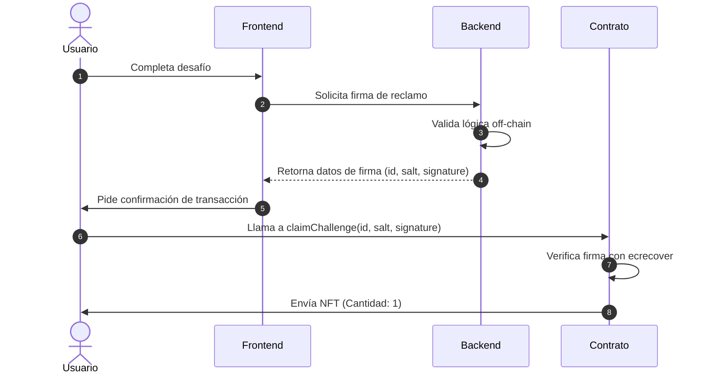

# Criptografía de Firmas ECDSA en Ethereum: Fundamentos Matemáticos, Implementación Práctica y Seguridad en Smart Contracts

---

## Resumen Ejecutivo

Este documento presenta un análisis riguroso y exhaustivo sobre el uso del **Algoritmo de Firma Digital de Curva Elíptica (ECDSA)** en el ecosistema de contratos inteligentes de Ethereum. Diseñado con un enfoque académico, pedagógico y científico, el texto aborda desde la formulación matemática de la criptografía de curva elíptica bajo el estándar `secp256k1` hasta las particularidades de implementación de la Máquina Virtual de Ethereum (EVM). Se examina el mecanismo de verificación de firmas para la delegación de acciones *off-chain* hacia el entorno *on-chain* —una técnica que elimina la necesidad de almacenar costosas "listas de permitidos" (whitelists) en el estado del contrato—. Finalmente, se exponen de forma crítica los principales vectores de ataque criptográficos y de lógica de negocio (como la maleabilidad de firma y el ataque de repetición), proporcionando soluciones robustas basadas en los estándares modernos del consorcio OpenZeppelin.

---

## 1. Introducción a la Criptografía de Clave Asimétrica en Blockchains

La confianza y seguridad en los sistemas distribuidos y descentralizados (blockchains) como Bitcoin y Ethereum descansan fundamentalmente sobre la criptografía asimétrica o de clave pública. A diferencia de la criptografía simétrica, donde una única clave secreta debe compartirse para cifrar y descifrar información, la criptografía asimétrica utiliza pares de claves acopladas matemáticamente: una **clave privada** ($d$), mantenida bajo secreto absoluto por su propietario, y una **clave pública** ($Q$), distribuida libremente.

### Evolución Histórica y Comparativa

El concepto de criptografía de clave pública fue introducido formalmente por Whitfield Diffie y Martin Hellman en 1976. Poco después, en 1977, Ron Rivest, Adi Shamir y Leonard Adleman desarrollaron **RSA**, el primer algoritmo práctico de cifrado y firma digital basado en la dificultad matemática de factorizar el producto de dos números primos grandes.

A pesar del éxito histórico de RSA, su aplicación en sistemas con recursos computacionales restringidos o que requieren un alto rendimiento transaccional (como las redes blockchain) presenta desventajas insalvables:
1. **Tamaño de las claves:** Para mantener un nivel de seguridad equivalente a 128 bits de fuerza bruta en la actualidad, una clave RSA requiere al menos 3072 bits. En contraste, la **Criptografía de Curva Elíptica (ECC)**, propuesta de manera independiente por Neal Koblitz y Victor Miller en 1985, ofrece el mismo nivel de seguridad con claves de apenas 256 bits.
2. **Eficiencia en almacenamiento y gas:** En Ethereum, cada byte almacenado o transmitido en una transacción representa un costo directo de gas (medido en tarifas de red). Utilizar firmas del tamaño de RSA incrementaría los costos transaccionales a niveles insostenibles.
3. **Velocidad de procesamiento:** La generación y verificación de firmas basadas en curvas elípticas es computacionalmente más rápida en los procesadores modernos que las operaciones aritméticas modulares de números extremadamente grandes requeridos por RSA.

La siguiente tabla resume la equivalencia de seguridad entre los diferentes estándares criptográficos:

| Nivel de Seguridad (Bits) | Longitud de Clave RSA (Bits) | Longitud de Clave ECC (Bits) | Relación de Tamaño (RSA / ECC) |
| :--- | :--- | :--- | :--- |
| **80** (Obsoleto) | 1024 | 160 | 6.4 : 1 |
| **112** (Bajo) | 2048 | 224 | 9.1 : 1 |
| **128** (Estándar Actual) | 3072 | 256 | 12.0 : 1 |
| **256** (Seguridad Militar)| 15360 | 512 | 30.0 : 1 |

Debido a esta eficiencia matemática, ECC se ha consolidado como el estándar absoluto para la derivación de cuentas, firmas de transacciones y validaciones criptográficas en las redes distribuidas modernas.

---

## 2. Matemáticas Detrás de ECC y la Curva secp256k1

La seguridad de la criptografía de curva elíptica se fundamenta en la estructura algebraica de los grupos abelianos definidos sobre campos finitos. A diferencia de las curvas elípticas sobre números reales ($\mathbb{R}$), que forman líneas continuas, las curvas elípticas utilizadas en criptografía se definen sobre un **cuerpo finito** (también conocido como campo de Galois, $\mathbb{F}_p$). Esto resulta en un conjunto discreto de puntos que satisfacen la ecuación de la curva.

### La Ecuación de Weierstrass

La forma generalizada de la ecuación de una curva elíptica (conocida como la ecuación corta de Weierstrass) es:

$$y^2 = x^3 + ax + b \pmod p$$

Para que la curva sea criptográficamente útil y no tenga singularidades (puntos cúspides o auto-intersecciones), se debe cumplir que su discriminante sea distinto de cero:

$$4a^3 + 27b^2 \neq 0 \pmod p$$

### Parámetros del Estándar secp256k1

Ethereum utiliza la curva específica denominada **secp256k1**, la cual fue optimizada por el *Standards for Efficient Cryptography Group* (SECG). Sus coeficientes son:

*   $a = 0$
*   $b = 7$

Por lo tanto, la ecuación que define la curva de Ethereum es:

$$y^2 = x^3 + 7 \pmod p$$

Esta estructura particular (donde $a = 0$) se conoce como una **curva de Koblitz**. Las curvas de Koblitz permiten optimizaciones computacionales significativas en la multiplicación escalar de puntos gracias a la existencia de endomorfismos eficientes.

Los parámetros que describen completamente el grupo de la curva `secp256k1` son una tupla $(p, a, b, G, n, h)$, definida por:

1.  **El Primo del Campo ($p$):** Define el tamaño del campo finito $\mathbb{F}_p$. En hexadecimal:
    $$p = 2^{256} - 2^{32} - 2^9 - 2^8 - 2^7 - 2^6 - 2^4 - 1$$
    $$p = \text{FFFFFFFF FFFFFFFF FFFFFFFF FFFFFFFF FFFFFFFF FFFFFFFF FFFFFFFE FFFFFFCF}$$
    Este es un número primo extremadamente cercano a $2^{256}$, diseñado para facilitar la aritmética modular rápida en arquitecturas de 256 bits.
2.  **El Punto Generador ($G$):** Un punto base predeterminado de la curva que actúa como el elemento neutro generador del subgrupo cíclico. Sus coordenadas $(x_G, y_G)$ son:
    $$x_G = \text{79BE667E F9DCBBAC 55A06295 CE870B07 029BFCDB 2DCE28D9 59F2815B 16F81798}$$
    $$y_G = \text{483ADA77 26A3C465 5DA4FBFC 0E1108A8 FD17B448 A6855419 9C47D08F FB10D4B8}$$
3.  **El Orden del Grupo ($n$):** El número total de puntos en el subgrupo cíclico generado por $G$. En hexadecimal:
    $$n = \text{FFFFFFFF FFFFFFFF FFFFFFFF FFFFFFFE BAAEDCE6 AF48A03B BFD25E8C D0364141}$$
4.  **Cofactor ($h$):** Para esta curva, $h = 1$, lo que significa que el subgrupo cíclico generado por $G$ abarca la totalidad de los puntos de la curva elíptica.

### Aritmética de la Curva: Suma y Multiplicación Escalar

La operación básica en ECC no es la multiplicación de números, sino la adición de puntos. Si tomamos dos puntos de la curva, $P = (x_1, y_1)$ y $Q = (x_2, y_2)$, la suma $R = P + Q = (x_3, y_3)$ se calcula geométricamente trazando una línea por $P$ y $Q$, encontrando el tercer punto de intersección con la curva y reflejándolo sobre el eje X.

Algebraicamente, la pendiente $\lambda$ de la línea es:

$$\lambda = \frac{y_2 - y_1}{x_2 - x_1} \pmod p \quad \text{si } P \neq Q$$

$$\lambda = \frac{3x_1^2 + a}{2y_1} \pmod p \quad \text{si } P = Q$$

Las coordenadas del punto resultante $R = (x_3, y_3)$ se definen como:

$$x_3 = \lambda^2 - x_1 - x_2 \pmod p$$
$$y_3 = \lambda(x_1 - x_3) - y_1 \pmod p$$

La **multiplicación escalar** se define como la suma repetida de un punto $P$ consigo mismo un número $k$ de veces:

$$k \cdot P = \underbrace{P + P + \dots + P}_{k \text{ veces}}$$

La derivación del par de claves se realiza mediante esta multiplicación:
1.  Se elige un número entero aleatorio $d$ en el intervalo $[1, n-1]$. Este número es la **clave privada**.
2.  Se calcula el punto $Q$ en la curva multiplicando la clave privada por el punto generador:
    $$Q = d \cdot G$$
    El punto $Q = (x_Q, y_Q)$ representa la **clave pública**.

### El Problema del Logaritmo Discreto de Curva Elíptica (ECDLP)

La seguridad de todo el sistema radica en el hecho de que, mientras realizar la multiplicación escalar $d \cdot G$ es computacionalmente sencillo (utilizando algoritmos de duplicación y adición como *double-and-add* en tiempo logarítmico $\mathcal{O}(\log d)$), la operación inversa es impracticable. 

Dado el punto $Q$ y el punto base $G$, es computacionalmente imposible determinar el entero $d$ tal que:

$$Q = d \cdot G$$

Este reto matemático es el **Problema del Logaritmo Discreto de Curva Elíptica (ECDLP)**. Para la curva `secp256k1`, los algoritmos de resolución más eficientes conocidos (como el algoritmo rho de Pollard) tienen una complejidad temporal de aproximadamente $\mathcal{O}(\sqrt{n})$. Con un orden de grupo $n \approx 2^{256}$, esto requiere aproximadamente $2^{128}$ operaciones, un límite físicamente inalcanzable con la infraestructura computacional de la humanidad actual.

---

## 3. El Algoritmo de Firmas Digitales de Curva Elíptica (ECDSA)

El algoritmo ECDSA permite asegurar la autenticidad e integridad de un mensaje sin revelar la clave privada del emisor. El proceso consta de dos fases principales: la firma del mensaje y su posterior verificación.

### Fase 1: Generación de la Firma

Para firmar un mensaje $m$, el firmante realiza los siguientes pasos utilizando su clave privada $d$:

1.  **Cálculo del Hash:** Se genera el hash criptográfico del mensaje utilizando una función hash como Keccak-256:
    $$e = H(m)$$
    Sea $z$ el número entero correspondiente a los $L_n$ bits más significativos de $e$ (donde $L_n$ es la longitud en bits del orden del grupo $n$. Para secp256k1, $L_n = 256$).
2.  **Selección del Nonce Efímero ($k$):** Se selecciona un número entero aleatorio criptográficamente seguro $k$ en el rango $[1, n-1]$.
    > [!CAUTION]
    > El valor $k$ debe ser estrictamente aleatorio y de un solo uso (*nonce*). La reutilización de $k$ en firmas distintas revela directamente la clave privada $d$ (ver sección 6).
3.  **Cálculo del Punto Temporal ($R$):** Se calcula el punto de la curva:
    $$R = k \cdot G$$
    Sean $(x_R, y_R)$ las coordenadas del punto $R$.
4.  **Cálculo del Parámetro $r$:** Se extrae la coordenada X del punto $R$ y se reduce módulo $n$:
    $$r = x_R \pmod n$$
    Si $r = 0$, se debe volver al paso 2 y seleccionar un nuevo $k$.
5.  **Cálculo del Parámetro $s$:** Se computa el valor de la firma:
    $$s = k^{-1} (z + r \cdot d) \pmod n$$
    Donde $k^{-1}$ es el inverso multiplicativo modular de $k$ módulo $n$. Si $s = 0$, se debe volver al paso 2.

La firma digital final es el par ordenado:

$$\text{Firma} = (r, s)$$

### Fase 2: Verificación de la Firma

Para verificar la validez de la firma $(r, s)$ sobre el mensaje $m$, el verificador utiliza la clave pública del emisor $Q$ y sigue este procedimiento:

1.  Verificar que los valores $r$ y $s$ sean números enteros en el rango $[1, n-1]$. Si no lo son, la firma es inválida.
2.  Calcular el hash del mensaje:
    $$e = H(m)$$
    y derivar el valor entero $z$ de los bits más significativos.
3.  Calcular el inverso modular de $s$:
    $$w = s^{-1} \pmod n$$
4.  Calcular los dos coeficientes auxiliares:
    $$u_1 = z \cdot w \pmod n$$
    $$u_2 = r \cdot w \pmod n$$
5.  Calcular el punto de verificación en la curva elíptica:
    $$P = u_1 \cdot G + u_2 \cdot Q$$

Si la firma es auténtica, el punto $P$ será igual al punto temporal $R$ utilizado durante la fase de generación. Por lo tanto, el verificador comprueba la siguiente igualdad:

$$r \equiv x_p \pmod n$$

Si la igualdad se cumple, la firma es válida.

#### Demostración Matemática de la Verificación

Para demostrar que $P = R$ cuando la firma es auténtica, partimos de la definición del punto de verificación:

$$P = u_1 \cdot G + u_2 \cdot Q$$

Sustituyendo $Q$ por $d \cdot G$:

$$P = u_1 \cdot G + u_2 \cdot (d \cdot G) = (u_1 + u_2 \cdot d) \cdot G$$

Sustituyendo $u_1$ y $u_2$:

$$P = (z \cdot w + r \cdot w \cdot d) \cdot G = (z + r \cdot d) \cdot w \cdot G$$

Dado que $w = s^{-1} \pmod n$, tenemos:

$$P = (z + r \cdot d) \cdot s^{-1} \cdot G$$

Por la definición de $s$ en la fase de generación, sabemos que $s \equiv k^{-1}(z + r \cdot d) \pmod n$. De esto se deriva que $s^{-1} \equiv k(z + r \cdot d)^{-1} \pmod n$. Sustituyendo esto en la ecuación:

$$P = (z + r \cdot d) \cdot [k(z + r \cdot d)^{-1}] \cdot G$$

Los términos $(z + r \cdot d)$ y su inverso se cancelan bajo aritmética modular:

$$P = k \cdot G = R$$

Dado que $P = R$, se cumple que la coordenada X del punto $P$ ($x_p$) es idéntica a la coordenada X de $R$ ($x_R$), por lo que $r \equiv x_p \pmod n$. Q.E.D.

---

## 4. La Adaptación de ECDSA en Ethereum

Ethereum implementa el estándar ECDSA sobre `secp256k1` con una característica clave: el soporte para la **Recuperación de la Clave Pública** (Key Recovery). 

### El Byte de Recuperación ($v$)

En la verificación matemática tradicional de ECDSA, se requiere la clave pública $Q$ del firmante para validar la firma. En Ethereum, sin embargo, transmitir la clave pública de 64 bytes en cada transacción duplicaría el peso de los datos. Para solventar esto, se utiliza un tercer parámetro llamado **byte de recuperación** ($v$).

Cuando calculamos el punto $R = k \cdot G$, la coordenada Y tiene dos soluciones posibles (una par y otra impar) para una coordenada X ($r$) dada, debido a la simetría de la ecuación de curva elíptica $y^2 = f(x)$. Además, es posible (aunque extremadamente improbable) que $x_R$ sea mayor que el orden del grupo $n$ pero menor que el primo $p$, lo que daría lugar a dos posibles valores de coordenadas X.

El byte de recuperación $v$ es un entero que indica cuál de las posibles soluciones de la curva es el punto de origen real. En Ethereum:
*   Originalmente, $v \in \{27, 28\}$. El valor 27 indica una coordenada Y par, y 28 una impar.
*   Con la implementación del estándar **EIP-155** (protección contra replay attacks entre cadenas), $v$ se calcula en función del ID de la blockchain (`chainId`):
    $$v \in \{2 \cdot \text{chainId} + 35, \; 2 \cdot \text{chainId} + 36\}$$

Con la tupla $(r, s, v)$ y el hash del mensaje $z$, la EVM ejecuta el opcode `ecrecover`, el cual realiza las operaciones matemáticas necesarias para reconstruir la clave pública $Q$ directamente. Una vez obtenida la clave pública, se calcula su hash Keccak-256 y se extraen los últimos 20 bytes para obtener la **dirección de la cuenta de Ethereum** (address):

$$\text{Address} = \text{Keccak256}(Q)[12:31]$$

### El Prefijo de Seguridad EIP-191

Una vulnerabilidad conceptual crítica en blockchains es el secuestro de firmas para transacciones. Si un usuario firma un mensaje de texto plano que coincide exactamente con los bytes de una transacción de envío de fondos, un atacante podría enviar dicho mensaje firmado a la red de Ethereum y hacer que se ejecute como una transacción válida.

Para mitigar este riesgo, se definió el estándar **EIP-191** (y su extensión popular **EIP-712**). Este estándar obliga a anteponer un prefijo especial a cualquier mensaje firmado que no sea una transacción de la EVM antes de calcular su hash definitivo:

$$\text{Mensaje a Firmar} = \text{Keccak256}(\text{abi.encodePacked}("\backslash\text{x19Ethereum Signed Message:}\backslash\text{n}", \text{longitud(mensaje)}, \text{mensaje}))$$

*   El byte inicial `0x19` (`\x19`) fue elegido específicamente porque no es válido como primer byte de una transacción RLP en Ethereum. De este modo, **ningún mensaje firmado bajo EIP-191 puede ser interpretado jamás como una transacción válida por un nodo**.
*   El texto `"Ethereum Signed Message:\n"` identifica la naturaleza de la firma.
*   La longitud del mensaje le permite al deserializador saber cuántos bytes leer.

Cualquier validación on-chain mediante `ecrecover` o la librería `ECDSA.sol` de OpenZeppelin requiere que el hash del mensaje reconstruido en el contrato inteligente también aplique este prefijo para que el resultado de la recuperación de dirección sea correcto.

---

## 5. Casos de Uso en el Desarrollo de dApps

Las firmas criptográficas off-chain habilitan dinámicas de interacción complejas y eficientes en términos de gas dentro de las aplicaciones descentralizadas.

### A. Acuñación y Distribución de Recompensas sin Whitelist (Dynamic Claim)

En aplicaciones tradicionales que recompensan a usuarios por completar tareas (como la dApp de entrenamiento del Diplomado USACH), el enfoque ingenuo requiere que un administrador mantenga un mapa de usuarios permitidos en blockchain:

```solidity
// Enfoque costoso (Whitelist tradicional)
mapping(address => bool) public whitelist;

function addToWhitelist(address[] memory users) external onlyOwner {
    for(uint256 i = 0; i < users.length; i++) {
        whitelist[users[i]] = true; // Consume ~20,000 gas por usuario
    }
}
```

Este esquema resulta impracticable a gran escala. Al migrar al esquema de firmas ECDSA:
1. El backend del sistema valida la tarea off-chain.
2. El backend firma con su clave privada un mensaje que contiene `(usuario, tokenId, cantidad, nonce)`.
3. El usuario envía la firma a un contrato inteligente intermediario (`ChallengeMinter.sol`), que verifica la firma y ejecuta el minteo.
4. El gasto de gas se transfiere enteramente al usuario final cuando reclama su NFT, y el administrador gasta **cero gas** en la gestión.



### B. Aprobaciones y Transferencias sin Gas (EIP-2612 / Permit)

El estándar ERC-20 tradicional requiere dos transacciones para interactuar con un smart contract externo (como un DEX): una llamada a `approve(spender, value)` y luego una interacción con el contrato destino que llama a `transferFrom`. 

El estándar **EIP-2612** introduce la función `permit`, permitiendo a los usuarios firmar una aprobación off-chain. El contrato receptor de la firma realiza el `permit` y el intercambio en una sola transacción, pagando el gas de la aprobación el propio contrato o un intermediario (relayer), logrando transacciones completamente *gasless* para el usuario final.

### C. Puentes Multicadena (Bridges)

Los puentes de tokens descentralizados dependen de firmas multifirma o esquemas de firma de umbral (Threshold Signatures). Cuando se depositan fondos en la Cadena A, un grupo de validadores off-chain firma un mensaje que autoriza el retiro en la Cadena B. El usuario presenta estas firmas ECDSA en la Cadena B para liberar sus tokens envueltos.

---

## 6. Vulnerabilidades y Vectores de Ataque en ECDSA y Solidity

El desarrollo con firmas criptográficas requiere un entendimiento profundo de los riesgos criptográficos asociados. Un error de lógica de negocio o de implementación matemática puede resultar en la pérdida total de los fondos o el minteo no autorizado de activos.

### A. Maleabilidad de Firma (Signature Malleability)

La maleabilidad es una propiedad inherente de las firmas ECDSA matemáticas. Para cualquier firma válida $(r, s, v)$ generada para un hash de mensaje determinado, existe una segunda firma $(r, -s \pmod n, v \oplus 1)$ que es igualmente válida para el **mismo** hash de mensaje.

Dado que:

$$-s \equiv n - s \pmod n$$

Si un contrato inteligente no controla este escenario, un atacante podría interceptar una transacción legítima de reclamo de fondos de un usuario, calcular la firma maleada alternativa y enviarla a la red con un gas fee mayor (Front-running). Si la lógica del contrato marca la firma como usada guardando el hash completo de la firma en un mapping, la segunda transacción también pasará, permitiendo un doble retiro de fondos con la misma firma original modificada.

#### Mitigación

Para evitar la maleabilidad de firmas, la especificación de Ethereum y las librerías modernas restringen los valores válidos de $s$ a la mitad inferior del orden del grupo $n$. Es decir:

$$s \le \frac{n}{2}$$

En hexadecimal, esto equivale a comprobar que:

$$s \le \text{0x7FFFFFFF FFFFFFFF FFFFFFFF FFFFFFFF 5D576E73 57A4501D DFE92F46 681B20A0}$$

La librería `ECDSA.sol` de OpenZeppelin implementa esta restricción de forma nativa en su función `recover`, rechazando firmas donde $s$ se encuentre en el rango superior.

### B. Ataque de Repetición (Replay Attack)

Un ataque de repetición ocurre cuando un atacante toma una firma que fue válida para un reclamo y la envía nuevamente al contrato inteligente para repetir la acción.

#### Mitigación por Nonces y Salting

Para que una firma sea de un único uso, el contrato inteligente debe registrar que el mensaje firmado ya fue procesado. Hay dos formas principales de lograr esto:

1.  **Nonces Secuenciales:** El contrato mantiene un contador por usuario: `mapping(address => uint256) public nonces`. La firma debe incluir el nonce actual del usuario. Al procesar la transacción, el nonce se incrementa:
    ```solidity
    bytes32 messageHash = keccak256(abi.encodePacked(msg.sender, nonces[msg.sender]));
    nonces[msg.sender]++;
    ```
2.  **Registro de Hash Único (Salt/UUID):** El backend genera un identificador único para cada recompensa (`salt`). El contrato guarda un registro booleano de los hashes procesados:
    ```solidity
    bytes32 messageHash = keccak256(abi.encodePacked(msg.sender, salt));
    require(!usedSignatures[messageHash], "Firma ya utilizada");
    usedSignatures[messageHash] = true;
    ```

### C. Replay Attack entre Contratos y Cadenas (Cross-Contract / Cross-Chain Replay)

Si despliegas dos contratos independientes de minteo de NFTs (por ejemplo, `DesafioMinter1` y `DesafioMinter2`), y ambos utilizan el mismo servidor firmante, un usuario que reciba una firma válida para el contrato 1 podría reutilizar esa misma firma para reclamar tokens en el contrato 2, a menos que el contrato 2 lo impida.

De forma similar, si una dApp corre en Sepolia y en Arbitrum, una firma válida generada para la red de pruebas Sepolia podría ser repetida en la red principal de Arbitrum si el contrato comparte la misma dirección.

#### Mitigación

Para blindar la firma contra reutilización en otros entornos, es obligatorio incluir en el hash del mensaje:
1.  **La dirección del contrato verificador (`address(this)`):** Garantiza que la firma solo sea válida para el contrato que ejecuta la validación.
2.  **El ID de la cadena (`block.chainid`):** Garantiza que la firma no pueda ser repetida en otra red blockchain.

El estándar **EIP-712** formaliza esta estructura mediante un bloque de datos tipado conocido como el **Domain Separator** (Separador de Dominio), el cual define de forma explícita el nombre de la dApp, la versión del contrato, el `chainId` y la dirección del contrato verificador.

### D. Reutilización del Nonce Efímero ($k$)

Este es un vector de ataque que afecta principalmente al servidor (backend) que genera las firmas. En la ecuación para calcular $s$:

$$s = k^{-1} (z + r \cdot d) \pmod n$$

Si un servidor utiliza el mismo valor $k$ para firmar dos mensajes distintos $m_1$ y $m_2$, se obtendrán dos firmas $(r, s_1)$ y $(r, s_2)$ con la misma coordenada $r$. Un atacante puede resolver el siguiente sistema de ecuaciones algebraicas modulares para calcular la clave privada del servidor $d$ sin necesidad de fuerza bruta:

$$s_1 \equiv k^{-1}(z_1 + r \cdot d) \pmod n$$
$$s_2 \equiv k^{-1}(z_2 + r \cdot d) \pmod n$$

Dividiendo las ecuaciones:

$$\frac{s_1}{s_2} \equiv \frac{z_1 + r \cdot d}{z_2 + r \cdot d} \pmod n$$

De esto se puede despejar la clave privada $d$ con simple aritmética computacional de milisegundos:

$$d \equiv \frac{s_2 \cdot z_1 - s_1 \cdot z_2}{r \cdot (s_1 - s_2)} \pmod n$$

#### Mitigación en el Backend

Para evitar esto de forma absoluta, los servidores modernos no deben utilizar generadores de números puramente aleatorios para $k$, sino implementar firmas deterministas basadas en el estándar **RFC 6979**. Este estándar describe un algoritmo que deriva el valor de $k$ de manera determinista combinando la clave privada $d$ y el hash del mensaje $z$ mediante la función HMAC-SHA256, asegurando que $k$ sea único para cada mensaje pero imposible de predecir sin conocer la clave privada.

---

## 7. Guía de Implementación Paso a Paso

A continuación se detalla la implementación técnica del flujo propuesto para la validación de desafíos en el Diplomado de la Universidad de Santiago de Chile.

### Componente A: Contrato de Solidity

```solidity
// SPDX-License-Identifier: MIT
pragma solidity ^0.8.35;

import {AccessControl} from "@openzeppelin/contracts/access/AccessControl.sol";
import {ECDSA} from "@openzeppelin/contracts/utils/cryptography/ECDSA.sol";
import {MessageHashUtils} from "@openzeppelin/contracts/utils/cryptography/MessageHashUtils.sol";

interface IERC1155Minter {
    function mint(address account, uint256 id, uint256 amount, bytes memory data) external;
}

/**
 * @title ChallengeMinter
 * @notice Contrato inteligente para minteo de insignias mediante validacion de firmas ECDSA.
 */
contract ChallengeMinter is AccessControl {
    using ECDSA for bytes32;

    bytes32 public constant SIGNER_ROLE = keccak256("SIGNER_ROLE");
    IERC1155Minter public immutable nftContract;

    // Registro para mitigar Replay Attacks
    mapping(bytes32 => bool) public usedSignatures;

    event ChallengeClaimed(address indexed user, uint256 indexed id, uint256 amount, bytes32 salt);

    constructor(
        address defaultAdmin,
        address authorizedSigner,
        address nftContractAddress
    ) {
        require(nftContractAddress != address(0), "Direccion de NFT invalida");
        require(authorizedSigner != address(0), "Direccion de firmante invalida");
        
        _grantRole(DEFAULT_ADMIN_ROLE, defaultAdmin);
        _grantRole(SIGNER_ROLE, authorizedSigner);
        
        nftContract = IERC1155Minter(nftContractAddress);
    }

    /**
     * @notice Reclama una insignia validando una firma ECDSA generada por el backend.
     */
    function claimChallenge(
        uint256 id,
        bytes32 salt,
        bytes memory signature
    ) external {
        // Reconstrucción del hash del mensaje que incluye el ID de la cadena y la dirección de este contrato
        bytes32 messageHash = keccak256(
            abi.encodePacked(
                msg.sender, 
                id, 
                salt, 
                address(this),
                block.chainid
            )
        );

        // Convertir al hash EIP-191 prependeando "\x19Ethereum Signed Message:\n32"
        bytes32 ethSignedMessageHash = MessageHashUtils.toEthSignedMessageHash(messageHash);

        // Recuperar el firmante utilizando la librería segura de OpenZeppelin
        address signer = ethSignedMessageHash.recover(signature);

        // Validaciones críticas de seguridad
        require(hasRole(SIGNER_ROLE, signer), "Firma invalida o no autorizada");
        require(!usedSignatures[messageHash], "Esta recompensa ya fue reclamada");

        // Registrar el mensaje como usado
        usedSignatures[messageHash] = true;

        // Ejecutar el minteo en el contrato destino (siempre se acuña la cantidad estática de 1)
        nftContract.mint(msg.sender, id, 1, "");

        emit ChallengeClaimed(msg.sender, id, 1, salt);
    }
}
```

### Componente B: Código del Servidor (Node.js con Ethers.js v6)

```javascript
const { ethers } = require("ethers");
require("dotenv").config();

/**
 * Genera la firma criptográfica necesaria para el reclamo de recompensas.
 * 
 * @param {string} userAddress Dirección de la wallet del estudiante.
 * @param {number} tokenId ID de la insignia a reclamar.
 * @param {string} salt Hash o valor aleatorio de 32 bytes único de la recompensa.
 * @param {string} contractAddress Dirección del contrato ChallengeMinter desplegado.
 * @param {number} chainId ID de la red blockchain (por ejemplo, 1337 para Hardhat, 11155111 para Sepolia).
 * @returns {Promise<string>} La firma criptográfica en bytes lista para ser enviada.
 */
async function generarFirmaDesafio(userAddress, tokenId, salt, contractAddress, chainId) {
  // Clave privada del servidor encargada de firmar
  const privateKey = process.env.SIGNER_PRIVATE_KEY;
  if (!privateKey) {
    throw new Error("Falta la variable de entorno SIGNER_PRIVATE_KEY");
  }

  const wallet = new ethers.Wallet(privateKey);

  // 1. Hashear los datos usando la empaquetación equivalente a abi.encodePacked de Solidity (sin el parámetro amount)
  const messageHash = ethers.solidityPackedKeccak256(
    ["address", "uint256", "bytes32", "address", "uint256"],
    [userAddress, tokenId, salt, contractAddress, chainId]
  );

  // 2. Firmar el mensaje
  // signMessage aplica automáticamente el prefijo de firma estándar de Ethereum EIP-191
  const signature = await wallet.signMessage(ethers.getBytes(messageHash));
  
  return signature;
}
```

---

## 8. Conclusiones y Referencias

El uso del Algoritmo de Firmas Digitales de Curva Elíptica (ECDSA) en combinación con el estándar EIP-191 ofrece un balance óptimo entre eficiencia y descentralización en el ecosistema Ethereum. Permite a los desarrolladores de dApps desacoplar la validación compleja de procesos de negocio off-chain y delegar únicamente el cambio de estado de distribución a la blockchain.

No obstante, la modularización de este flujo hacia contratos específicos no exime al desarrollador de aplicar salvaguardas estrictas: el control minucioso de nonces únicos, la inclusión de metadatos contextuales (`address(this)` y `chainId`) dentro del mensaje firmado, y la delegación de la recuperación criptográfica a librerías validadas como `ECDSA.sol` de OpenZeppelin son condiciones obligatorias para neutralizar vectores de ataque catastróficos.

### Referencias Bibliográficas

1.  **Diffie, W., & Hellman, M. (1976).** *New directions in cryptography.* IEEE Transactions on Information Theory, 22(6), 644-654.
2.  **Koblitz, N. (1987).** *Elliptic curve cryptosystems.* Mathematics of Computation, 48(177), 203-209.
3.  **Standards for Efficient Cryptography Group (SECG). (2010).** *SEC 2: Recommended Elliptic Curve Domain Parameters.* Versión 2.0.
4.  **OpenZeppelin Contracts Documentation.** *Cryptography utilities reference: ECDSA and MessageHashUtils.* Recuperado de [OpenZeppelin Docs](https://docs.openzeppelin.com/).
5.  **Buterin, V. (2014).** *Ethereum Whitepaper: A next-generation smart contract and decentralized application platform.*
6.  **Pornin, T. (2013).** *RFC 6979: Deterministic Usage of the Digital Signature Algorithm (DSA) and Elliptic Curve Digital Signature Algorithm (ECDSA).* Internet Engineering Task Force (IETF).
