# Resultados Laboratorio DeFi Web3 USACH: Análisis de Datos On-chain, Métricas de Interacción y Arquitectura de Contratos Inteligentes

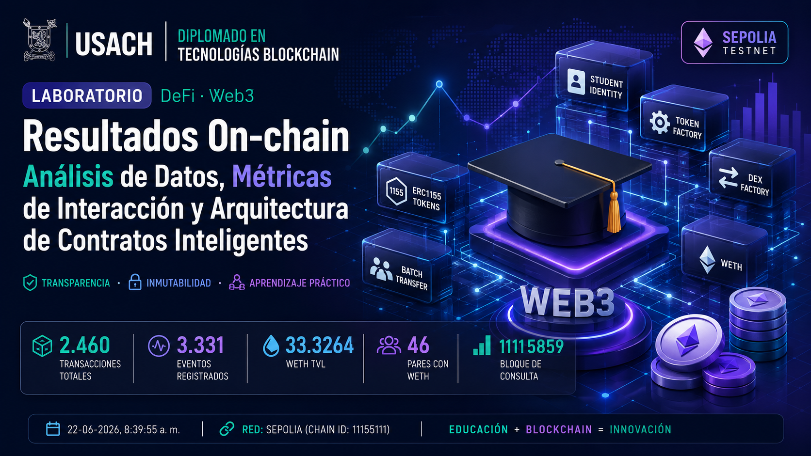

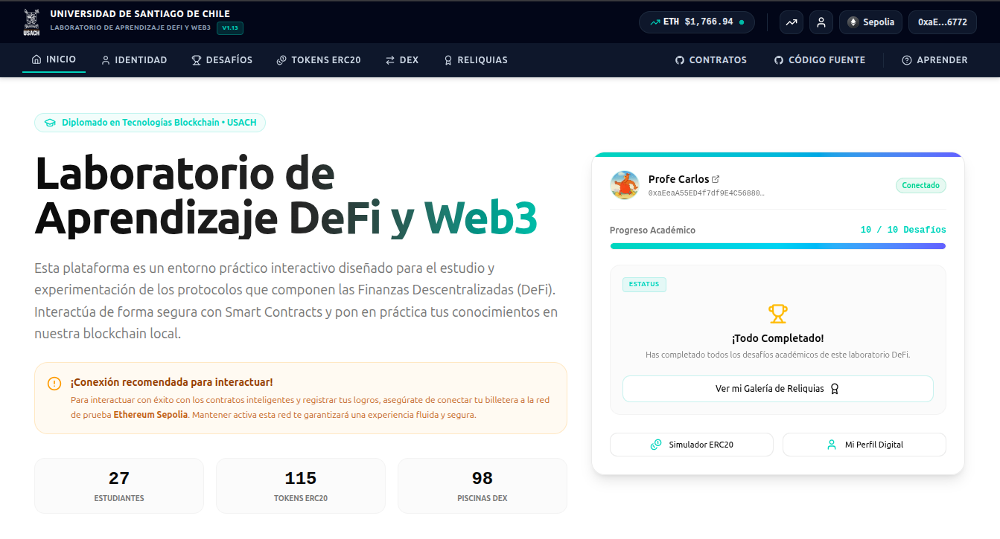

## Resumen On-chain

El nivel de adopción y la actividad operativa dentro de una plataforma educativa Web3 se reflejan con total transparencia en la inmutabilidad de la cadena de bloques, en el ecosistema del Diplomado USACH, los datos agregados revelan un volumen transaccional sobresaliente que constituye el principal indicador clave de rendimiento del laboratorio, un total acumulado de **2,460 transacciones** y **3,331 eventos registrados** en la red de pruebas Sepolia, este flujo dinámico es liderado por la interacción con el contrato de Wrapped Ether (WETH.sol) y la actividad de los tokens personalizados creados por los propios estudiantes, validando la efectividad del aprendizaje práctico y la robustez de la arquitectura descentralizada implementada, a continuación, se presenta el resumen consolidado de las métricas on-chain por componente:

| Contrato / Componente | Dirección | Transacciones Totales (Etherscan / Est. Logs) | Eventos Registrados |
| :--- | :--- | :---: | :---: |
| **[StudentIdentity.sol](https://github.com/cjbaezilla/diplomado-usach-training-dapp-contracts/blob/main/contracts/StudentIdentity.sol)** | [`0x652b7718F130329F3eC865f418FE2a2634fb5E29`](https://sepolia.etherscan.io/address/0x652b7718F130329F3eC865f418FE2a2634fb5E29) | **33** (Etherscan) | **61** |
| **[TokenFactory.sol](https://github.com/cjbaezilla/diplomado-usach-training-dapp-contracts/blob/main/contracts/TokenFactory.sol)** | [`0x30A4CA7ad7947f7Df6fdAf0EC4D9f4540e0149bB`](https://sepolia.etherscan.io/address/0x30A4CA7ad7947f7Df6fdAf0EC4D9f4540e0149bB) | **115** (Etherscan) | **115** |
| **[BaseERC1155.sol](https://github.com/cjbaezilla/diplomado-usach-training-dapp-contracts/blob/main/contracts/BaseERC1155.sol)** | [`0x6b727bC4560A05AEEB9c353396395B35c6Fdb57E`](https://sepolia.etherscan.io/address/0x6b727bC4560A05AEEB9c353396395B35c6Fdb57E) | **2** (Etherscan) | **245** |
| **[DEXFactory.sol](https://github.com/cjbaezilla/diplomado-usach-training-dapp-contracts/blob/main/contracts/DEXFactory.sol)** | [`0x2491e5C6d2aC321f0036fF5D561b7c72086Ba5a4`](https://sepolia.etherscan.io/address/0x2491e5C6d2aC321f0036fF5D561b7c72086Ba5a4) | **99** (Etherscan) | **98** |
| **[WETH.sol](https://github.com/cjbaezilla/diplomado-usach-training-dapp-contracts/blob/main/contracts/WETH.sol)** | [`0x3E7B9d0da44D0c4Edb60a2261f89007f05419317`](https://sepolia.etherscan.io/address/0x3E7B9d0da44D0c4Edb60a2261f89007f05419317) | **615** (Etherscan) | **960** |
| **[BatchTransfer.sol](https://github.com/cjbaezilla/diplomado-usach-training-dapp-contracts/blob/main/contracts/BatchTransfer.sol)** | [`0x3c9323F2BaDdDBB1B152feFA33FEC0b748239860`](https://sepolia.etherscan.io/address/0x3c9323F2BaDdDBB1B152feFA33FEC0b748239860) | **3** (Etherscan) | **2** |
| **DEX Pools (Agregado - 98 pools)** | *(Múltiples direcciones)* | **358** (Est. por logs) | **567** |
| **Tokens Personalizados (Agregado - 115 tokens)** | *(Múltiples direcciones)* | **1235** (Est. por logs) | **1283** |
| 📊 **TOTAL GENERAL ACUMULADO** | | 🚀 **2460** | 🏆 **3331** |

### Detalles Técnicos del Reporte de Consulta

*   **Red Blockchain:** `sepolia` (Chain ID: `11155111`)
*   **Bloque de Consulta de Datos:** `11115859`
*   **Fecha y Hora de Generación del Reporte:** `22-06-2026, 8:39:55 a. m.`
*   **Valor Total Bloqueado de la Plataforma (WETH TVL):** `33.3264 WETH`
*   **Cantidad de Pares de Intercambio con WETH:** `46 pares`

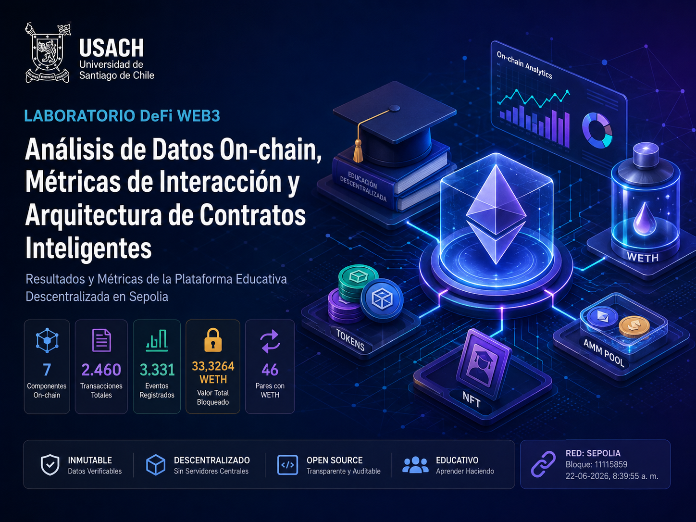

---

## Introducción y Fundamentos Pedagógicos

El aprendizaje del desarrollo de aplicaciones descentralizadas en el ecosistema Web3 requiere de plataformas interactivas que combinen la teoría y la práctica en entornos seguros, es por esta razón que diseñé para el Diplomado en Tecnologías Blockchain de la Universidad de Santiago de Chile, una infraestructura educativa robusta que permite a los estudiantes experimentar de forma directa con la descentralización, la inmutabilidad de los datos y la ejecución de lógica de negocio autoejecutable en redes compatibles con la Máquina Virtual de Ethereum, esta aproximación constructivista sitúa al alumno en el centro del proceso educativo al otorgarle la capacidad de desplegar sus propios activos financieros, interactuar con mercados automatizados y certificar sus competencias académicas mediante la obtención de reliquias no fungibles.

La plataforma educativa se articula sobre un sistema híbrido que conecta componentes distribuidos on-chain con servicios web tradicionales, la interfaz de usuario actúa como el portal de interacción donde los estudiantes conectan sus billeteras criptográficas y ejecutan transacciones, mientras que los contratos inteligentes implementados en la red de pruebas Sepolia aseguran la persistencia inmutable de la información y la ejecución rigurosa de las reglas del sistema, este ecosistema no solo sirve como una herramienta de entrenamiento práctico, sino que también genera un registro histórico completo de transacciones que puede ser analizado para evaluar el desempeño, el entendimiento técnico y la adopción de los conceptos clave de Web3 por parte de la comunidad estudiantil.

Una de las características arquitectónicas más destacadas de la plataforma es su capacidad para operar bajo un paradigma descentralizado y serverless a nivel de frontend, funcionando exclusivamente como código estático que realiza llamadas directas a la blockchain sin necesidad de un servidor backend intermedio o base de datos centralizada, la interfaz de usuario (compuesta por archivos estáticos HTML, CSS y JavaScript) se comunica directamente con los nodos de la red Ethereum (Sepolia) mediante llamadas RPC (JSON-RPC) facilitadas por un proveedor Web3 (como MetaMask), toda la persistencia de datos (perfiles de estudiantes, balances de tokens, transacciones y piscinas de liquidez) y la lógica de ejecución del negocio residen enteramente on-chain en los contratos inteligentes, así, la blockchain actúa como la única fuente de verdad y backend de la dApp, demostrando el potencial de las aplicaciones verdaderamente descentralizadas que eliminan la dependencia de infraestructura de servidores tradicional para sus flujos principales de lectura y escritura.

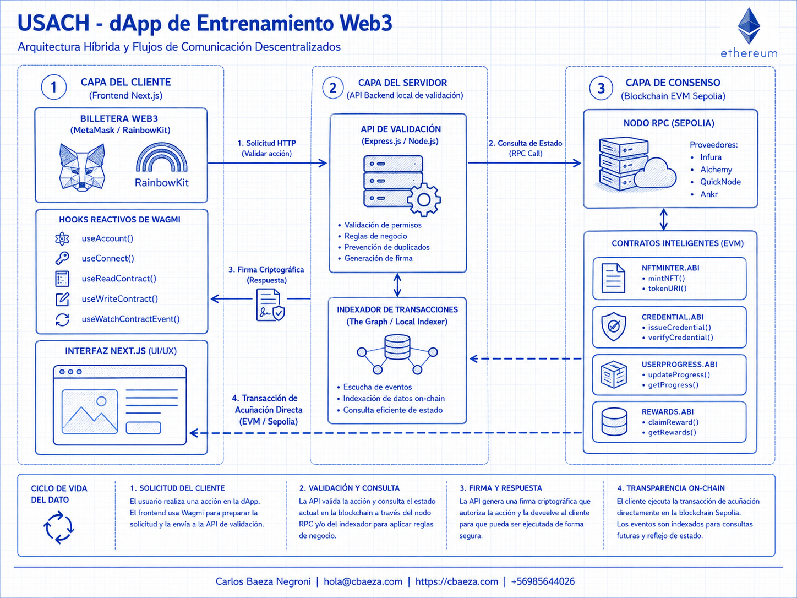

### Recursos y Enlaces del Ecosistema

Para el desarrollo y seguimiento de las actividades de aprendizaje, se han dispuesto los siguientes recursos en línea:
*   **Laboratorio Web3 (dApp):** [web3-usach-lab.cbaeza.com](https://web3-usach-lab.cbaeza.com/)
*   **Repositorio de los Contratos Inteligentes:** [github.com/cjbaezilla/diplomado-usach-training-dapp-contracts](https://github.com/cjbaezilla/diplomado-usach-training-dapp-contracts)
*   **Repositorio de la dApp:** [github.com/cjbaezilla/diplomado-usach-training-dapp](https://github.com/cjbaezilla/diplomado-usach-training-dapp)
*   **Perfil Público de Estudiantes (Ejemplo):** [web3-usach-lab.cbaeza.com/estudiante](https://web3-usach-lab.cbaeza.com/estudiante?address=0xaEeaA55ED4f7df9E4C5688011cEd1E2A1b696772)
*   **Ranking de Proveedores de Liquidez:** [web3-usach-lab.cbaeza.com/ranking](https://web3-usach-lab.cbaeza.com/ranking)

---

## Análisis Técnico y Mecánica de los Contratos Inteligentes

### Registro de Identidad Académica ([StudentIdentity.sol](https://github.com/cjbaezilla/diplomado-usach-training-dapp-contracts/blob/main/contracts/StudentIdentity.sol))

La identidad digital soberana representa uno de los pilares del desarrollo Web3, en este sistema se implementa mediante el contrato inteligente de registro de identidades estudiantiles, este componente permite asociar una dirección de cuenta pública con un perfil estructurado de datos personales y académicos del alumno, la estructura de almacenamiento interna se define mediante una disposición eficiente en la memoria persistente del contrato, utilizando un mapeo que vincula direcciones Ethereum individuales con un registro que contiene el nombre completo, el correo electrónico institucional, el enlace al perfil profesional de LinkedIn, la cuenta de Twitter, el avatar en formato de enlace o hash del sistema de archivos interplanetario, el registro de fecha de actualización y una bandera de confirmación de registro.

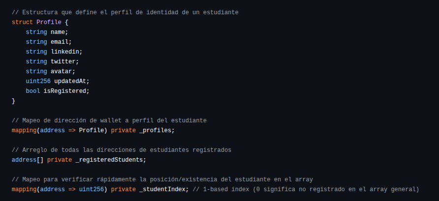

El acceso a este mapeo se realiza mediante una función externa que valida primeramente que el nombre provisto no sea una cadena de texto vacía, en caso de omisión del nombre el contrato revierte la transacción a través de un error personalizado que optimiza el consumo de gas en comparación con las cadenas de texto tradicionales de requerimiento, una vez aprobada la validación se verifica si el estudiante ya poseía un registro previo, si la dirección de la billetera interactúa por primera vez el sistema activa la bandera de registro, introduce la dirección en una lista dinámica global de estudiantes registrados y almacena la posición del elemento en un mapeo de índices, esto permite iterar sobre las identidades y consultar el total de registros mediante llamadas de lectura externa, emitiendo eventos específicos para que los indexadores y el frontend detecten las nuevas identidades o las modificaciones de los perfiles existentes.

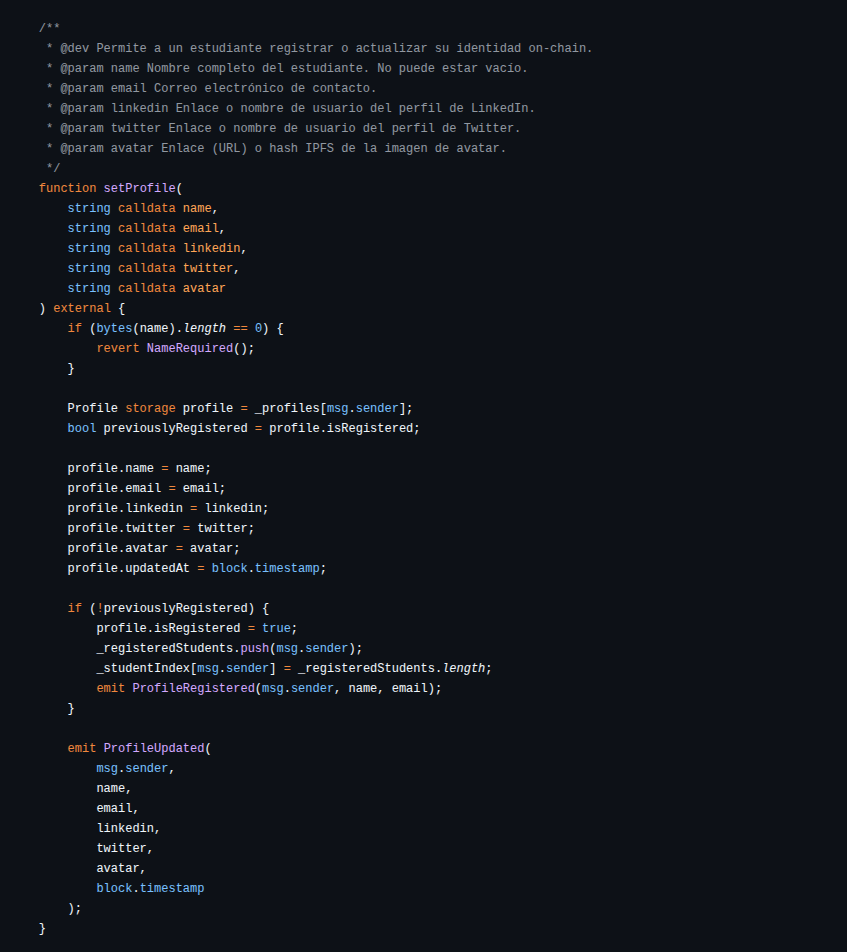

---

### Fábrica de Activos ERC-20 ([TokenFactory.sol](https://github.com/cjbaezilla/diplomado-usach-training-dapp-contracts/blob/main/contracts/TokenFactory.sol) y [BaseERC20.sol](https://github.com/cjbaezilla/diplomado-usach-training-dapp-contracts/blob/main/contracts/BaseERC20.sol))

La simulación financiera y la creación de economías de tokens requiere de una infraestructura ágil para la emisión de activos digitales, el contrato de la fábrica de tokens proporciona este mecanismo al permitir a los estudiantes instanciar de forma automatizada contratos individuales basados en el estándar ERC-20, el proceso se gestiona mediante una función que toma los parámetros del nombre, el símbolo y el suministro inicial que el estudiante desea asignar a su token personalizado, el contrato realiza una llamada de creación utilizando la palabra clave que despliega dinámicamente un nuevo contrato inteligente del tipo especificado y asigna la propiedad de la nueva instancia a la dirección que originó la llamada de creación.

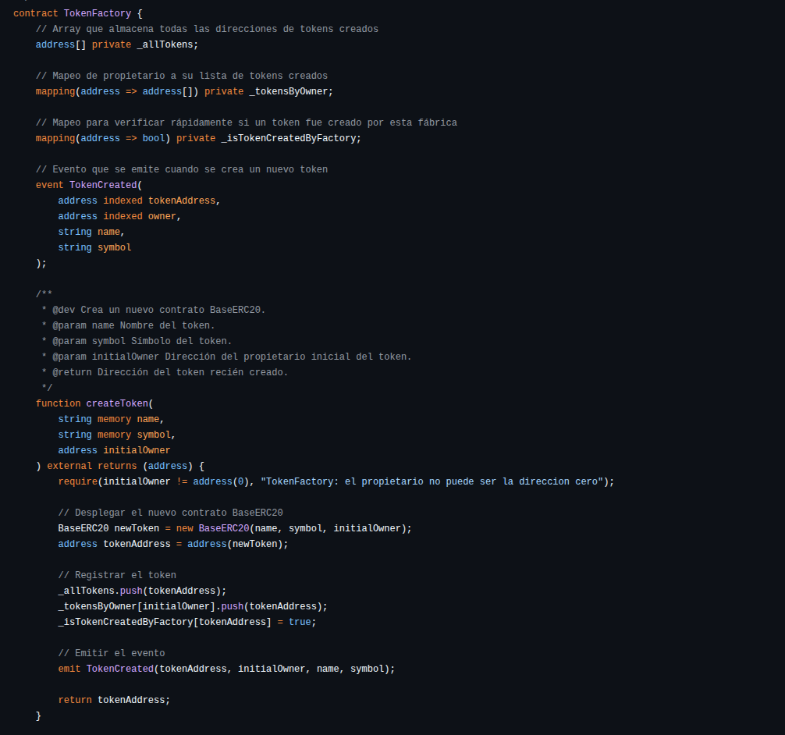
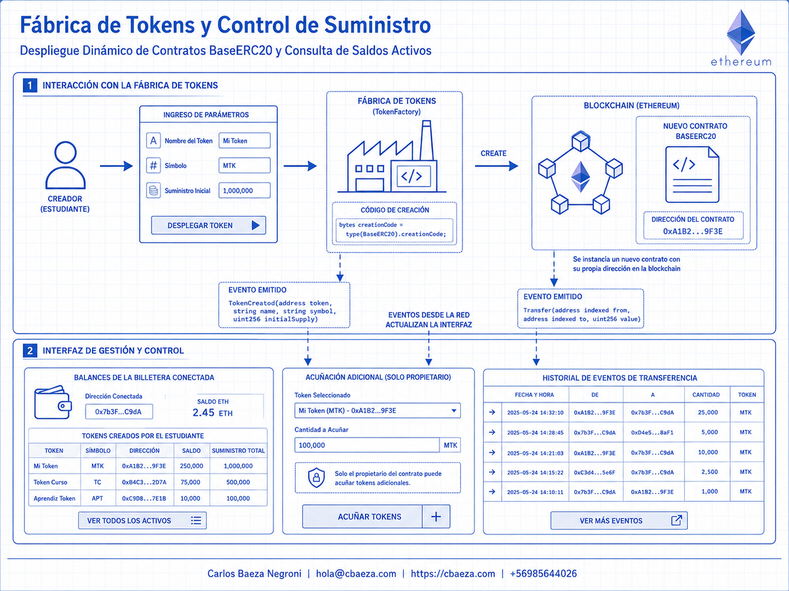

El contrato secundario desplegado hereda de la implementación estándar de OpenZeppelin e introduce extensiones para permitir la acuñación adicional de unidades por parte del propietario del token, esta estructura garantiza que los estudiantes posean control absoluto sobre la política monetaria de sus activos individuales, permitiendo simular procesos de emisión, distribución secundaria hacia otros compañeros del curso y provisión de liquidez en los mercados secundarios, el contrato registra el bloque de creación y emite eventos de transferencia iniciales hacia la dirección del creador si el suministro inicial configurado es mayor a cero, estableciendo la base para los flujos comerciales subsiguientes en la plataforma de entrenamiento.

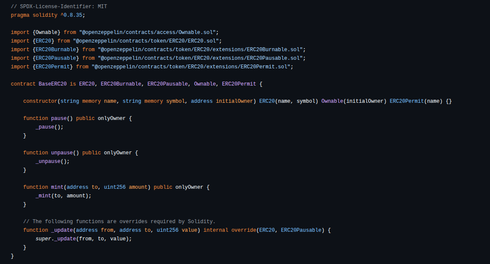

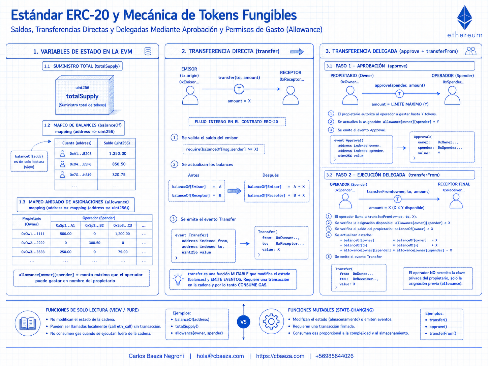

---

### Creador de Mercado Automatizado ([DEXFactory.sol](https://github.com/cjbaezilla/diplomado-usach-training-dapp-contracts/blob/main/contracts/DEXFactory.sol) y [DEXPool.sol](https://github.com/cjbaezilla/diplomado-usach-training-dapp-contracts/blob/main/contracts/DEXPool.sol))

La liquidez descentralizada se estructura mediante una fábrica de mercados y un conjunto de contratos de piscinas individuales que implementan el algoritmo de creador de mercado de producto constante, el contrato de la fábrica del mercado de intercambio gestiona un mapa bidireccional que asocia dos direcciones de tokens con la dirección única del contrato de la piscina de liquidez correspondiente, el algoritmo de creación de piscinas impone un orden estricto de las direcciones de los tokens involucrados mediante una comparación alfanumérica, esto asegura que solo pueda existir una piscina única por cada par de tokens, previniendo la duplicación del mercado y canalizando la liquidez de forma eficiente en la plataforma.

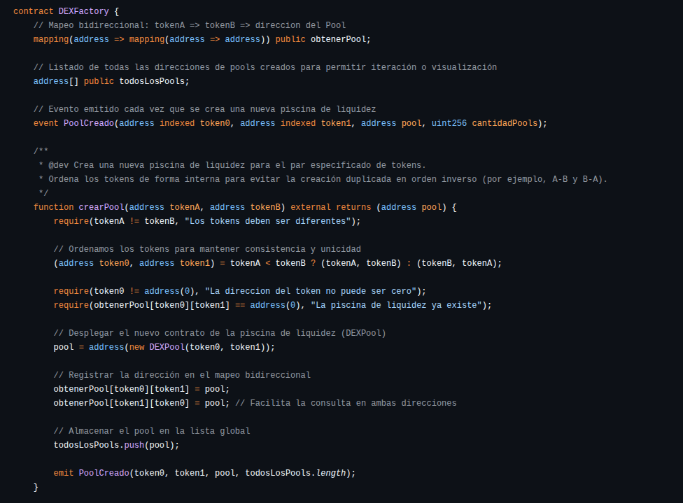

El contrato de la piscina individual hereda de la implementación de tokens estándar para emitir acciones de liquidez que representan la copropiedad del fondo depositado por los proveedores, el núcleo matemático del intercambio se define mediante la conservación de la multiplicación de las reservas de ambos activos, de tal modo que cualquier retiro de un token debe ser compensado por el depósito proporcional del otro token, considerando una comisión fija del tres por mil que se acumula en las reservas para incentivar el aporte de capital, la inyección de liquidez inicial calcula las acciones a emitir mediante la raíz cuadrada geométrica de los montos depositados, mientras que los aportes subsiguientes deben respetar de forma estricta la proporción de precios actual en el pool para evitar desbalances de arbitraje inmediato.

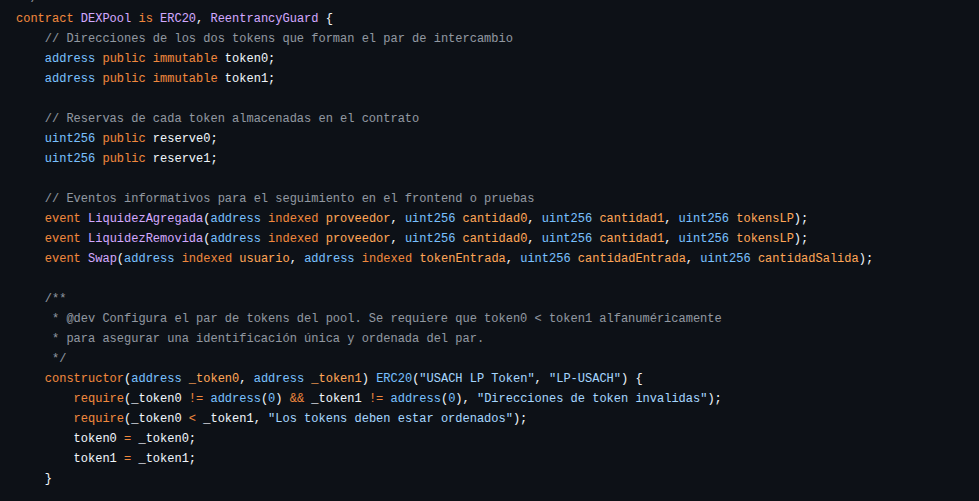

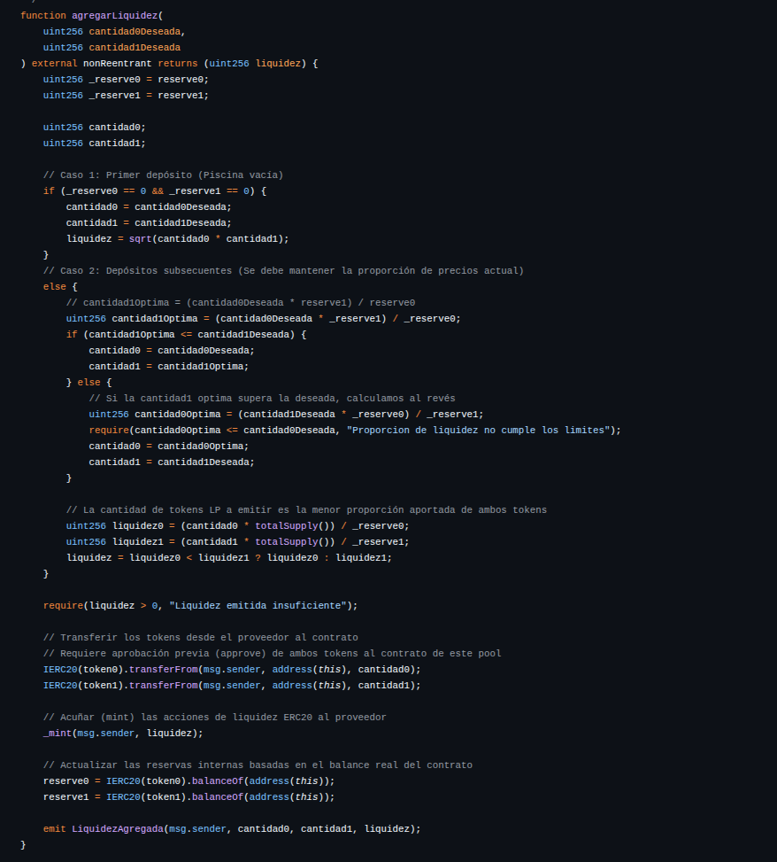

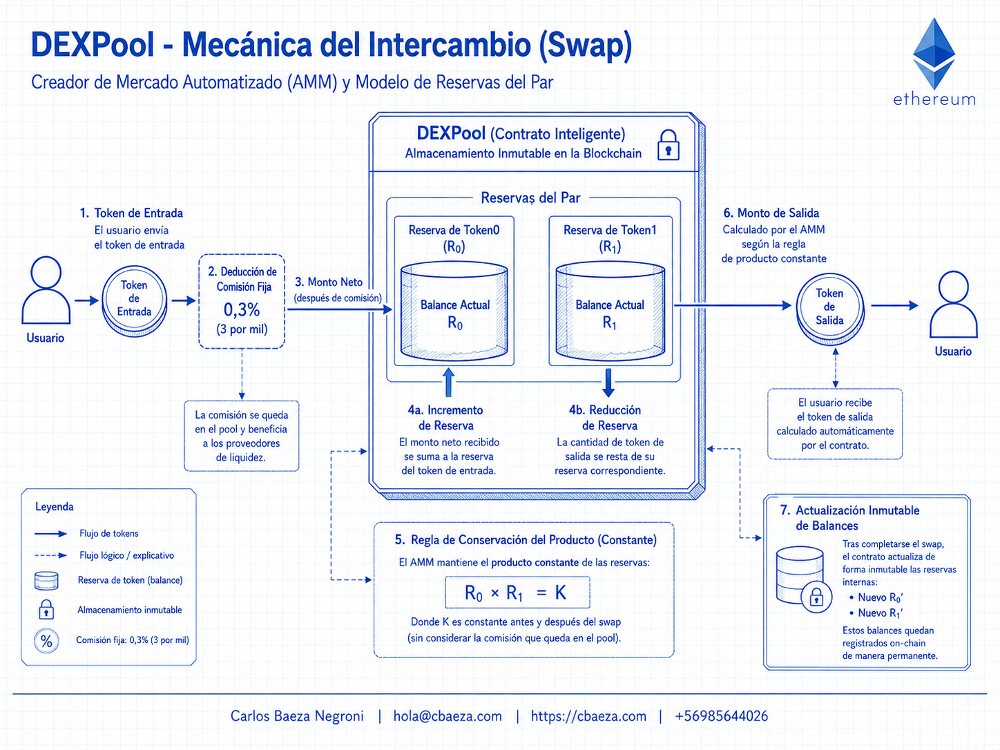

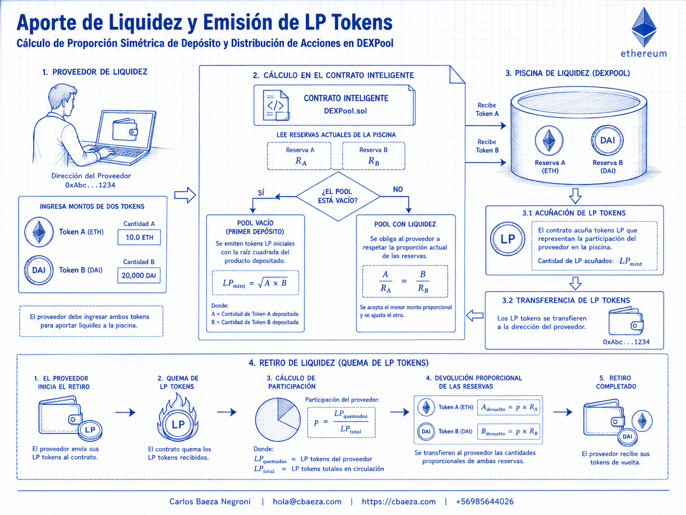

Para ejecutar un intercambio el usuario llama a la función de intercambio especificando la dirección del token de entrada y el monto a entregar, el contrato calcula la cantidad de salida utilizando las reservas internas actualizadas y deduce la comisión, transfiriendo los tokens de entrada desde la dirección del usuario mediante la aprobación previa y enviando los tokens de salida resultantes al destinatario, las reservas se actualizan al consultar los balances reales del contrato para evitar discrepancias por transferencias directas, protegiendo las funciones críticas contra ataques de reentrada a través del uso de modificadores de control de flujo.

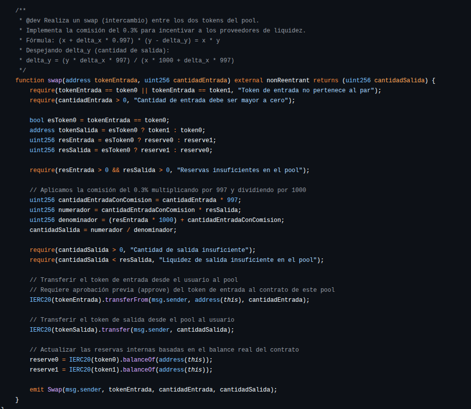

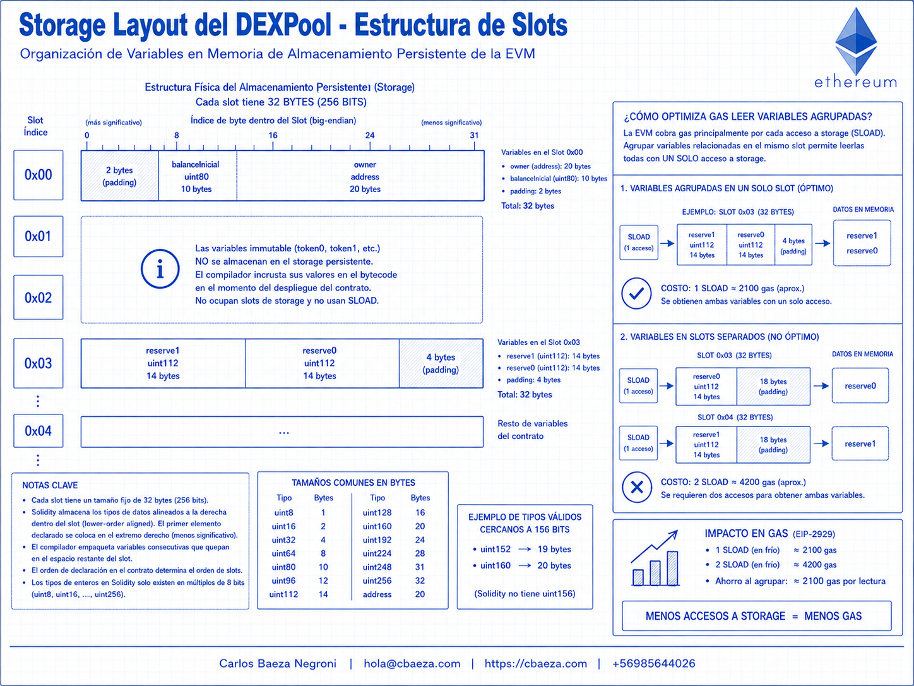

La representación gráfica y analítica de la dinámica de valoración en las piscinas de liquidez descentralizadas expone con rigurosidad el comportamiento del precio bajo el modelo del producto constante, donde el equilibrio de las reservas se ilustra mediante una curva hiperbólica que mapea las existencias del activo horizontal frente al vertical en un plano cartesiano, observándose que en el estado inicial de reposo el contrato cuenta con 10,000 unidades del token de entrada y 20,000 unidades del token de salida para un producto de referencia de 200,000,000 que actúa como el invariante del mercado.

Al iniciarse una interacción por parte de un usuario que ingresa 100 unidades del primer activo se ejecuta de inmediato la deducción de la tasa de comisión establecida en el 3 por 1,000 reduciendo el volumen operativo a 99.7 unidades efectivas, este flujo operacional genera un desplazamiento a lo largo de la trayectoria hiperbólica desde el punto de equilibrio inicial hasta una posición donde la cantidad de salida exacta calculada corresponde a 197.4316 unidades del segundo token, este cambio en la configuración de la piscina altera la tasa de conversión promedio a un valor de 1.974316 unidades del activo de salida por cada unidad del de entrada lo que en comparación con la tasa marginal inicial de 2 unidades de salida por cada unidad de entrada representa un deslizamiento de precio de 1.28%.

El impacto de estas transacciones se incrementa de forma no lineal a medida que el tamaño de la orden crece en relación con la profundidad de las reservas acumuladas lo cual se visualiza en la infografía mediante la comparación entre una transacción de bajo impacto y una de alta magnitud que desplaza drásticamente la relación de precios marginales y reduce la eficiencia de la cotización para el operador externo, este comportamiento dinámico resalta la importancia de la profundidad del mercado para mitigar la desviación de precios durante los intercambios comerciales y el papel que juegan los arbitrajistas para restablecer el equilibrio del sistema a través de operaciones compensatorias en la red descentralizada.

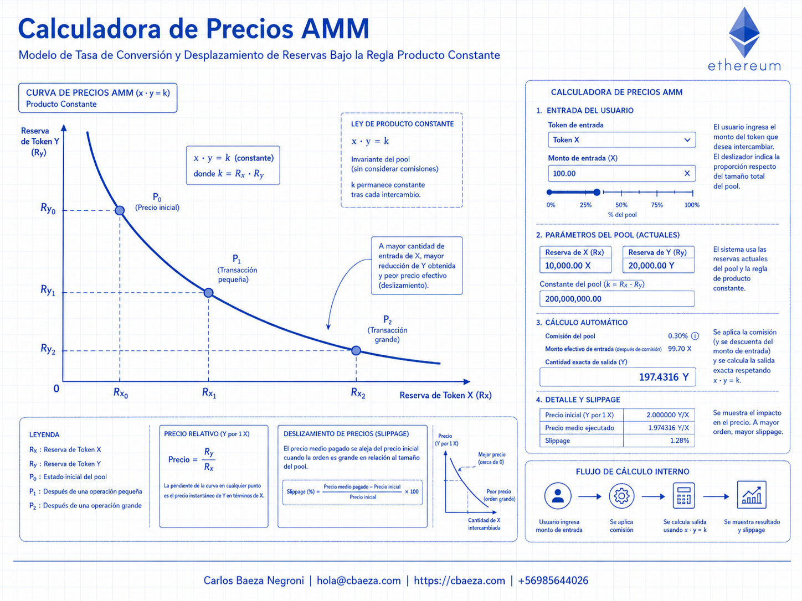

---

### Envoltura de Ether ([WETH.sol](https://github.com/cjbaezilla/diplomado-usach-training-dapp-contracts/blob/main/contracts/WETH.sol))

La paridad entre el Ether nativo y los tokens basados en el estándar ERC-20 se resuelve mediante un contrato de envoltura que permite transformar la criptomoneda nativa de la red en un activo compatible con los contratos de las piscinas de intercambio, la envoltura se ejecuta enviando Ether al contrato que mantiene un balance exacto de uno a uno y acuña tokens de Wrapped Ether en favor del depositante, para recuperar el Ether nativo el proceso se invierte llamando a la función de retiro que quema los tokens de envoltura del usuario y transfiere el monto equivalente de Ether nativo de regreso a la billetera, esto permite que los estudiantes utilicen el activo nativo de la red de pruebas dentro del DEX.

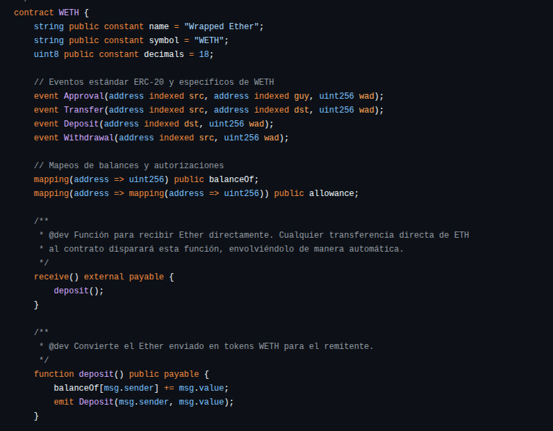

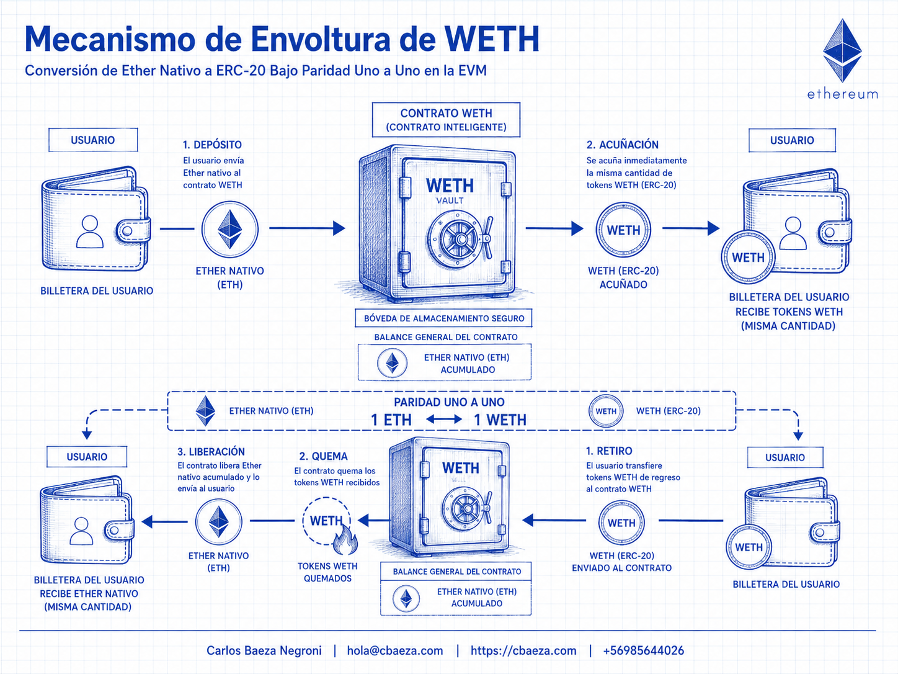

---

### Verificación Criptográfica y Reclamo de Reliquias ([ChallengeMinter.sol](https://github.com/cjbaezilla/diplomado-usach-training-dapp-contracts/blob/main/contracts/ChallengeMinter.sol) y [BaseERC1155.sol](https://github.com/cjbaezilla/diplomado-usach-training-dapp-contracts/blob/main/contracts/BaseERC1155.sol))

La certificación del progreso académico de los estudiantes se gestiona a través de un sistema de insignias en formato ERC-1155 que se acuñan de forma descentralizada mediante una verificación criptográfica de firmas digitales, el contrato validador de desafíos delega la comprobación del cumplimiento de los requisitos a un backend centralizado que posee una llave privada autorizada bajo un rol específico, cuando un estudiante completa un desafío el backend valida la información on-chain utilizando un cliente ligero y genera un hash de mensaje con la dirección de la billetera del estudiante, el identificador numérico del desafío, un valor único de un solo uso para prevenir ataques de repetición y la dirección del propio contrato para evitar la reutilización de firmas en contratos paralelos.

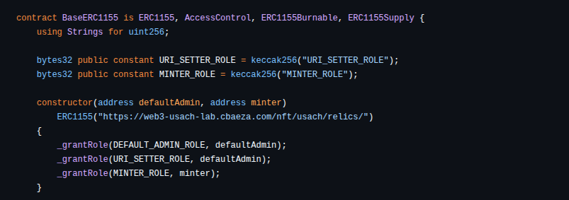

Una vez que el usuario recibe la firma y el valor de sal del servidor interactúa con la función de reclamo en el contrato del validador de desafíos, el contrato reconstruye el hash del mensaje utilizando las variables locales de la transacción y la dirección del remitente, aplica el prefijo estándar de mensajes firmados de Ethereum y recupera la dirección pública del firmante mediante la operación de recuperación de clave de curva elíptica, si la dirección recuperada posee el rol de firmante autorizado y el hash del mensaje no ha sido consumido previamente se marca la firma como utilizada en el mapeo de control de repetición y se ordena al contrato de insignias la acuñación inmutable del NFT correspondiente.

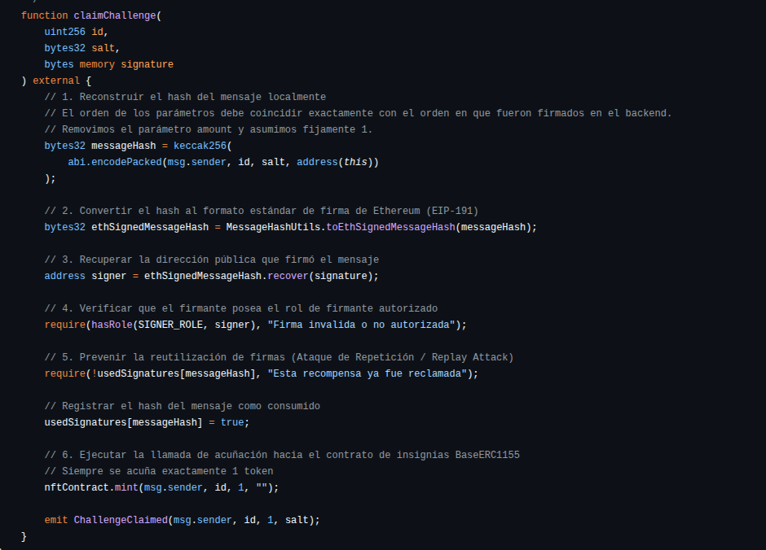

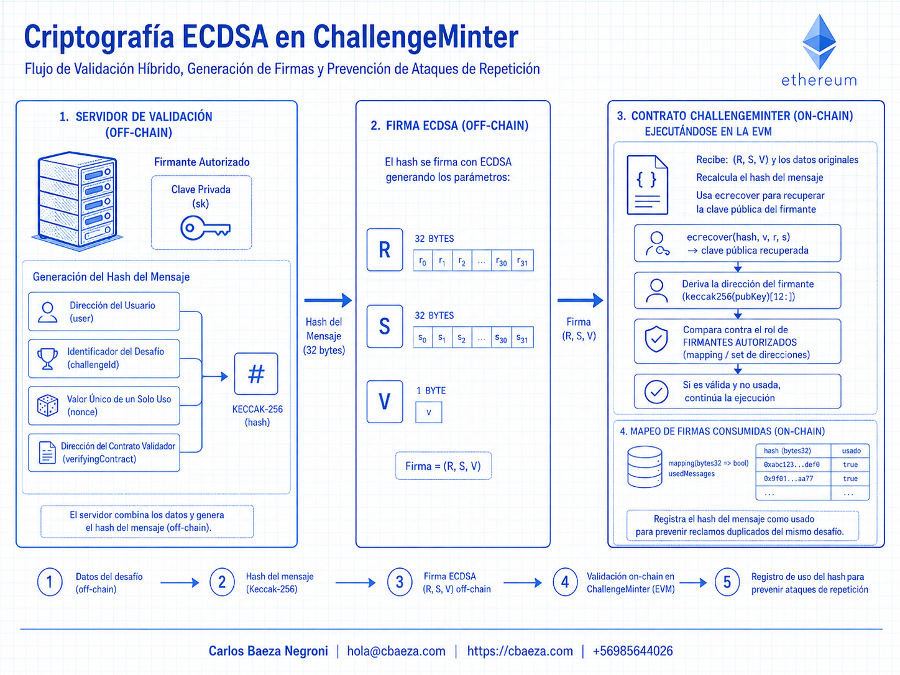

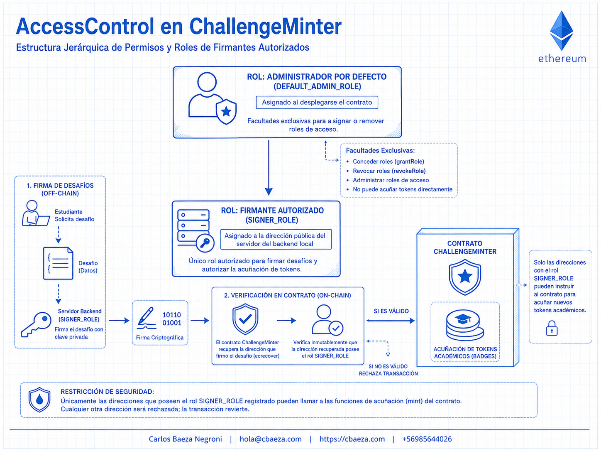

---

## Implementación de la Interfaz de Usuario y Procesos en la dApp

El portal web de entrenamiento se construye sobre un framework de desarrollo moderno enfocado en componentes reactivos y renderizado del lado del servidor, la integración con la blockchain de pruebas se realiza de forma segura mediante ganchos que manejan la conexión de billeteras Web3 y la sincronización del estado, la barra de navegación superior incorpora un botón interactivo que permite al estudiante conectar su billetera y cambiar de red, mostrando información sobre la red actual y el balance de Ether de la cuenta activa.

### Proceso de Registro de Estudiantes

El flujo de registro de la identidad estudiantil comienza cuando el alumno ingresa al panel de identidad en la dApp, la interfaz interactúa con el contrato de identidad de los estudiantes mediante hooks personalizados que leen el estado on-chain de la dirección conectada, si el usuario no posee un registro previo el frontend muestra un formulario detallado donde se solicita ingresar el nombre completo, el correo institucional con el dominio correspondiente y los enlaces de perfiles sociales, al hacer clic en enviar la dApp solicita la aprobación de la transacción mediante la extensión de la billetera, una vez confirmada la transacción los componentes reactivos detectan el evento de registro y actualizan la interfaz mostrando la tarjeta de perfil académico inmutable del estudiante.

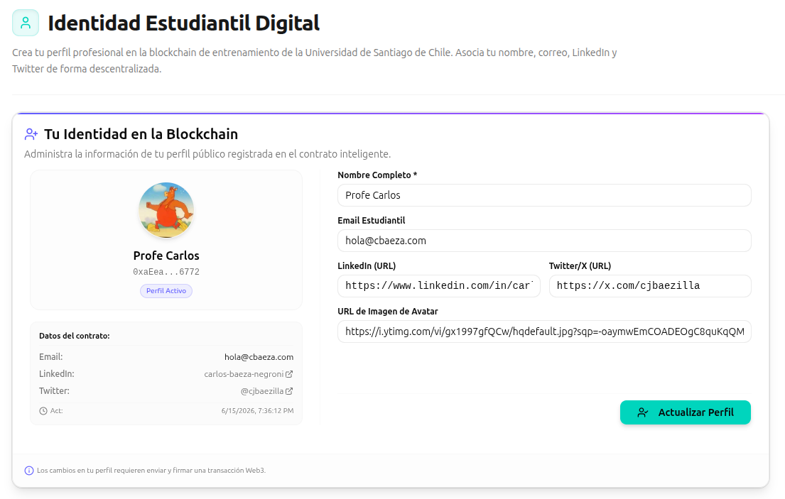

### Visualización de Perfiles Públicos de Estudiantes

Una extensión fundamental de la gestión de identidades en la dApp es el módulo de **perfiles públicos**, diseñado para visibilizar el avance y los logros de cada participante de forma abierta a la comunidad. A través de una ruta parametrizada que recibe la dirección Ethereum del estudiante en la URL (por ejemplo, el [Perfil Público del Estudiante (Ejemplo: Profe Carlos)](https://web3-usach-lab.cbaeza.com/estudiante?address=0xaEeaA55ED4f7df9E4C5688011cEd1E2A1b696772)), cualquier usuario puede consultar el estado académico de un alumno de forma directa.

Esta interfaz pública realiza consultas directas a los contratos de la dApp (principalmente a `StudentIdentity.sol` y `BaseERC1155.sol`) para renderizar de manera dinámica:
*   La tarjeta de identidad digital del estudiante (nombre, correo institucional, avatar y enlaces a redes profesionales).
*   El inventario de reliquias y desafíos completados, mostrando visualmente las insignias acumuladas.
*   Las métricas de interacción con la plataforma, incluyendo el listado de tokens ERC-20 creados por el alumno y su participación en los pools de liquidez.

Esto introduce una dimensión de portafolio académico digital y verificable en tiempo real, permitiendo a los estudiantes compartir su progreso de aprendizaje de forma transparente y soberana.

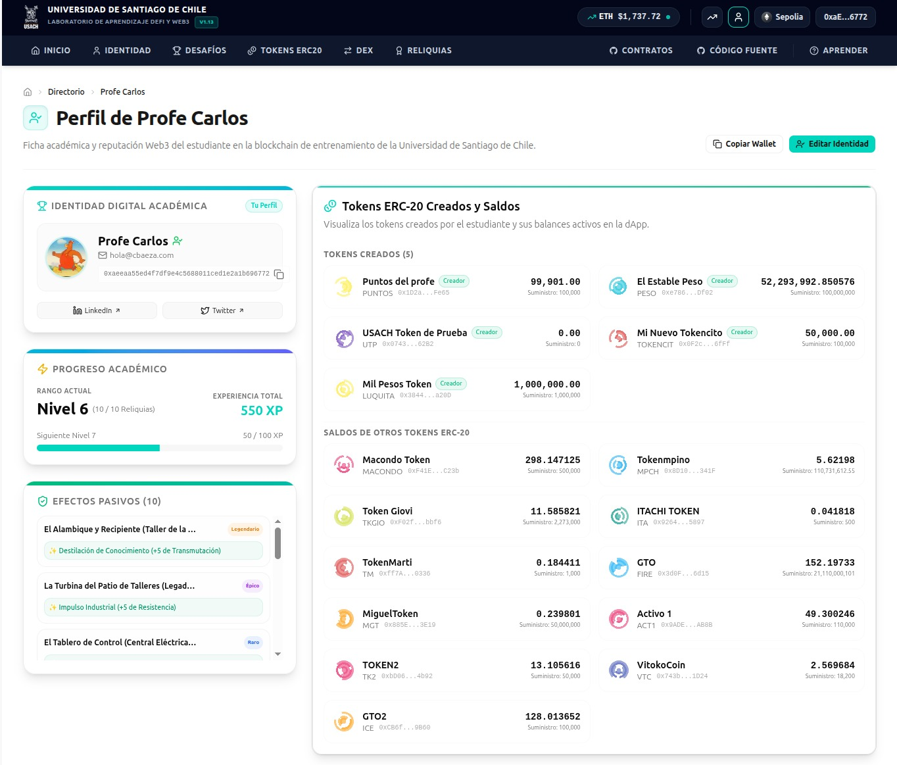

---

### Proceso de Creación e Interacción con Tokens ERC-20

El simulador y portal de tokens personalizados ofrece una interfaz para el despliegue automático de nuevos activos, el estudiante introduce el nombre, el símbolo y el suministro en el panel de creación y confirma la operación firmando la transacción, el contrato de la fábrica despliega el token y emite el evento de creación, el cual es detectado por la interfaz para listar el nuevo activo en la tabla de tokens creados, desde este panel el propietario del token puede acuñar nuevas unidades o realizar transferencias directas a otros compañeros ingresando sus direcciones públicas y el monto, la interfaz oculta automáticamente los activos que no poseen balances positivos para mantener limpia la vista del usuario y muestra un historial de transferencias en tiempo real para auditar las transacciones on-chain.

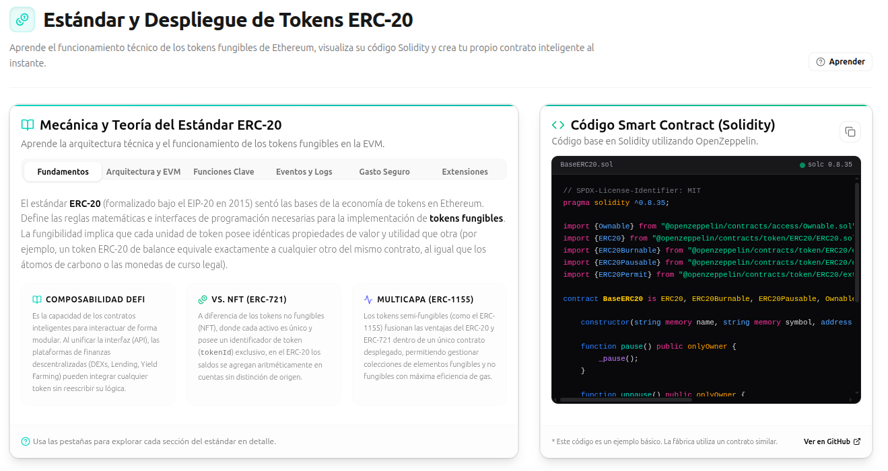

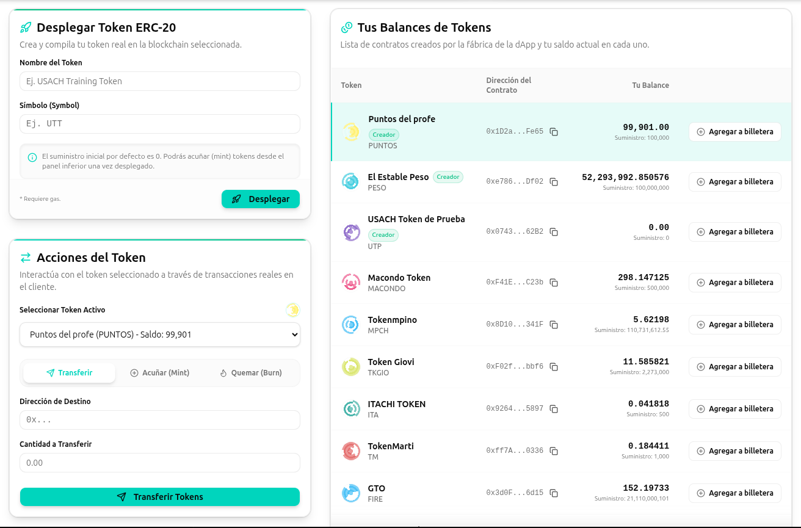

---

### Proceso de Operaciones y Provisión de Liquidez en el DEX

El mercado descentralizado integrado en la dApp permite a los estudiantes comprender de forma práctica el funcionamiento de las finanzas descentralizadas, el flujo comienza con la envoltura de Ether nativo a través de una pestaña dedicada donde el usuario deposita Ether y recibe el token Wrapped Ether necesario para comerciar, en el panel del mercado de intercambio el estudiante selecciona el par de tokens que desea intercambiar y visualiza las reservas de la piscina de liquidez junto con la tasa de conversión dinámica calculada en base al modelo de producto constante sin alterar la proporción geométrica, si la piscina no existe la interfaz permite desplegarla a través de la fábrica del mercado de intercambio.

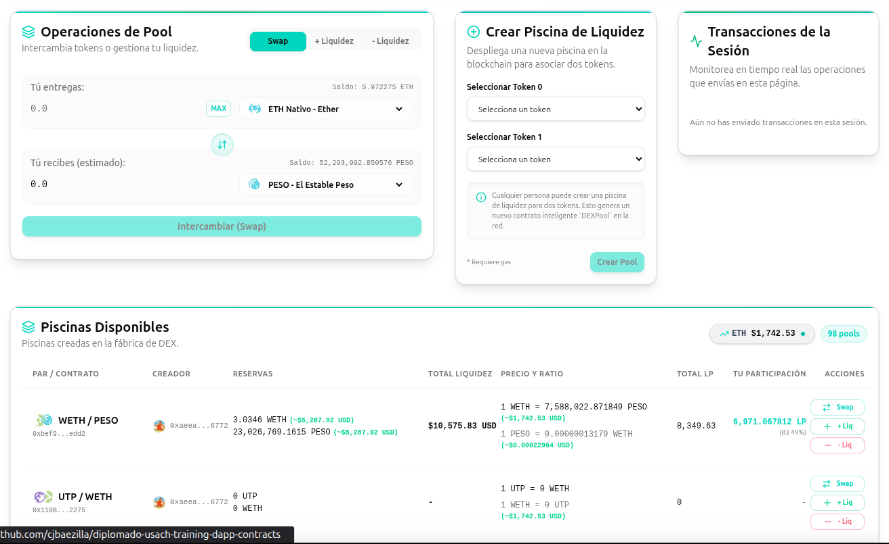

Para proveer liquidez el estudiante accede a la sección de aportes e ingresa la cantidad deseada del token base, la dApp calcula automáticamente la cantidad simétrica requerida del segundo token según la relación de precios de las reservas del pool, requiere que el usuario apruebe el uso de ambos tokens mediante transacciones previas y posteriormente envía la transacción de depósito que acuña los tokens LP de participación en el pool, el panel muestra la participación porcentual del estudiante sobre las reservas totales de la piscina y permite retirar la liquidez en cualquier momento devolviendo los tokens base y quemando los activos de participación.

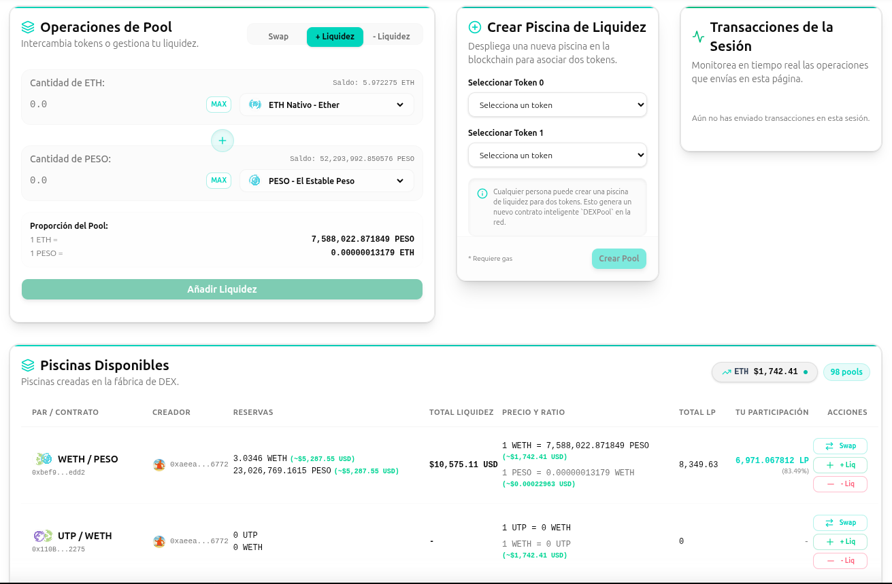

### Gamificación Educativa: Ranking de Proveedores de Liquidez

Con el fin de incentivar la comprensión profunda de los mecanismos de incentivos financieros y la provisión de liquidez en un creador de mercado automatizado (AMM), la dApp incorpora un módulo interactivo de [Ranking de Estudiantes](https://web3-usach-lab.cbaeza.com/ranking). Esta sección actúa como un tablero de competencia académica en tiempo real, ordenando a los participantes bajo una métrica competitiva clave: el volumen de valor total bloqueado (TVL) que logran mantener en sus respectivas piscinas de liquidez.

El algoritmo del ranking analiza de forma agregada los balances de los contratos de piscinas instanciados a través de `DEXFactory.sol` y calcula la cantidad equivalente de Ether (a través de WETH) bloqueado por la dirección de cada estudiante en sus pools activos. Los estudiantes compiten por optimizar la eficiencia de su capital y mantener las piscinas con mayor liquidez activa, protegiéndolas de desbalances extremos de precios. Este elemento de gamificación no solo fomenta la sana competencia en el aula, sino que permite experimentar empíricamente con conceptos de riesgo financiero descentralizado, tales como la pérdida impermanente (*impermanent loss*) y la profundidad de mercado en pools de liquidez educativos.

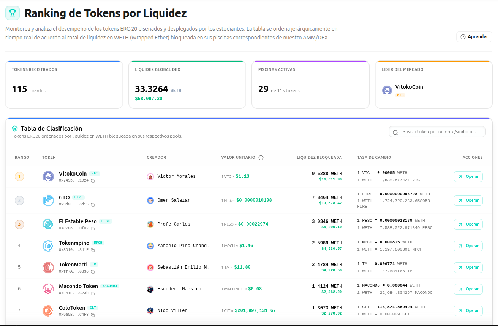

---

### Proceso de Validación y Reclamo de Reliquias Académicas

La senda de desafíos académicos consta de diez etapas que evalúan la interacción real de los estudiantes con los contratos inteligentes, cuando el estudiante completa una tarea en la blockchain presiona el botón de reclamo de la reliquia correspondiente en la interfaz, el frontend envía una solicitud HTTP al backend local que audita las transacciones del estudiante en la red utilizando un indexador de eventos, si el backend valida el cumplimiento de las condiciones firma los datos con la llave privada del servidor y responde con la firma criptográfica resultante.

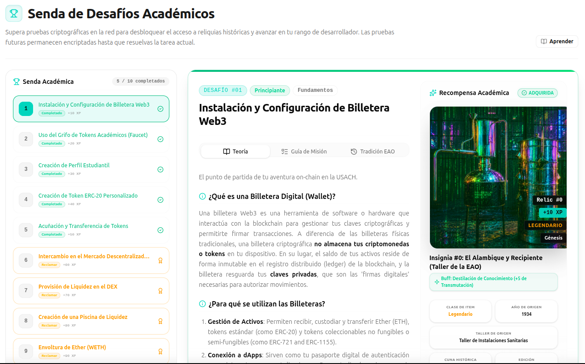

La dApp recibe la firma y abre un modal interactivo donde el usuario confirma la llamada al contrato inteligente del mintero de desafíos, al procesar la transacción en la red el contrato inteligente verifica la firma contra la clave pública del backend y ordena la acuñación de la reliquia no fungible, al confirmarse la transacción la dApp despliega una animación festiva y actualiza la galería de reliquias del estudiante mostrando el logro en formato de tarjeta digital inmutable con sus respectivos metadatos.

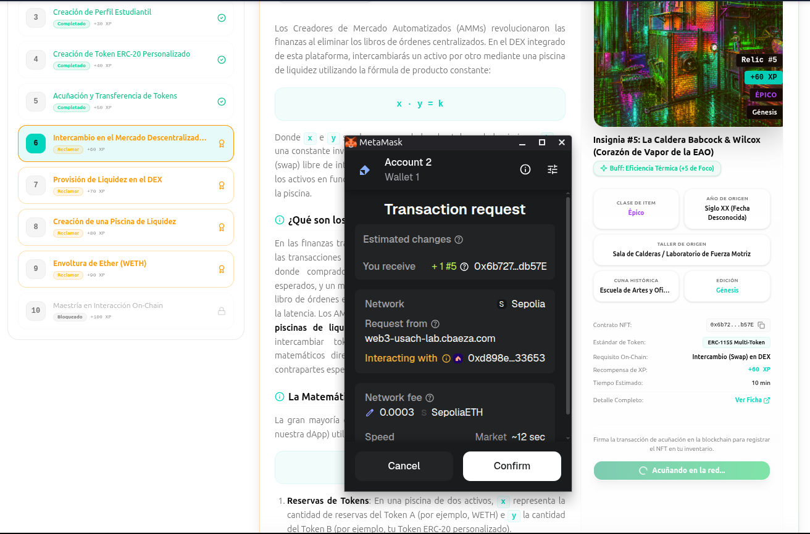

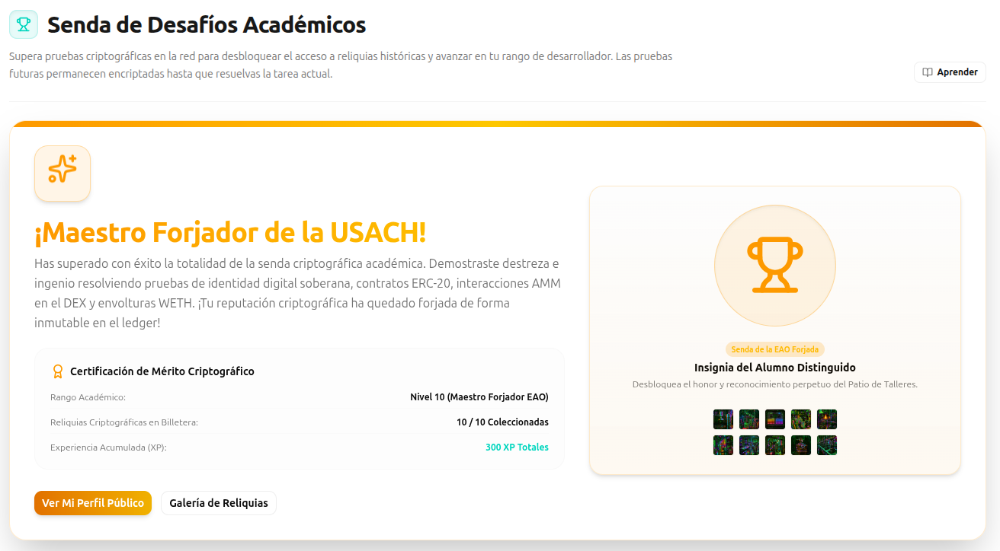

---

## Reporte Completo de Uso de la Plataforma y Métricas On-chain

A continuación, se detalla el reporte completo extraído del historial de la cadena de bloques Sepolia el cual documenta la actividad acumulada por los estudiantes en la plataforma de entrenamiento del Diplomado de la Universidad de Santiago de Chile.

### Resumen General de Actividad

La actividad general de la plataforma se consolida en la siguiente tabla que detalla el número de transacciones totales reportadas por los indexadores y la cantidad de eventos emitidos por los contratos inteligentes principales.

| Contrato / Componente | Dirección | Transacciones Totales (Etherscan / Est. Logs) | Eventos Registrados |
| :--- | :--- | :---: | :---: |
| **[StudentIdentity.sol](https://github.com/cjbaezilla/diplomado-usach-training-dapp-contracts/blob/main/contracts/StudentIdentity.sol)** | [`0x652b7718F130329F3eC865f418FE2a2634fb5E29`](https://sepolia.etherscan.io/address/0x652b7718F130329F3eC865f418FE2a2634fb5E29) | **33** (Etherscan) | **61** |
| **[TokenFactory.sol](https://github.com/cjbaezilla/diplomado-usach-training-dapp-contracts/blob/main/contracts/TokenFactory.sol)** | [`0x30A4CA7ad7947f7Df6fdAf0EC4D9f4540e0149bB`](https://sepolia.etherscan.io/address/0x30A4CA7ad7947f7Df6fdAf0EC4D9f4540e0149bB) | **115** (Etherscan) | **115** |
| **[BaseERC1155.sol](https://github.com/cjbaezilla/diplomado-usach-training-dapp-contracts/blob/main/contracts/BaseERC1155.sol)** | [`0x6b727bC4560A05AEEB9c353396395B35c6Fdb57E`](https://sepolia.etherscan.io/address/0x6b727bC4560A05AEEB9c353396395B35c6Fdb57E) | **2** (Etherscan) | **245** |
| **[DEXFactory.sol](https://github.com/cjbaezilla/diplomado-usach-training-dapp-contracts/blob/main/contracts/DEXFactory.sol)** | [`0x2491e5C6d2aC321f0036fF5D561b7c72086Ba5a4`](https://sepolia.etherscan.io/address/0x2491e5C6d2aC321f0036fF5D561b7c72086Ba5a4) | **99** (Etherscan) | **98** |
| **[WETH.sol](https://github.com/cjbaezilla/diplomado-usach-training-dapp-contracts/blob/main/contracts/WETH.sol)** | [`0x3E7B9d0da44D0c4Edb60a2261f89007f05419317`](https://sepolia.etherscan.io/address/0x3E7B9d0da44D0c4Edb60a2261f89007f05419317) | **615** (Etherscan) | **960** |
| **[BatchTransfer.sol](https://github.com/cjbaezilla/diplomado-usach-training-dapp-contracts/blob/main/contracts/BatchTransfer.sol)** | [`0x3c9323F2BaDdDBB1B152feFA33FEC0b748239860`](https://sepolia.etherscan.io/address/0x3c9323F2BaDdDBB1B152feFA33FEC0b748239860) | **3** (Etherscan) | **2** |
| **DEX Pools (Agregado - 98 pools)** | *(Múltiples direcciones)* | **358** (Est. por logs) | **567** |
| **Tokens Personalizados (Agregado - 115 tokens)** | *(Múltiples direcciones)* | **1235** (Est. por logs) | **1283** |
| 📊 **TOTAL GENERAL ACUMULADO** | | 🚀 **2460** | 🏆 **3331** |

---

### Detalles Técnicos del Reporte de Consulta

*   **Red Blockchain:** `sepolia` (Chain ID: `11155111`)
*   **Bloque de Consulta de Datos:** `11115859`
*   **Fecha y Hora de Generación del Reporte:** `22-06-2026, 8:39:55 a. m.`
*   **Valor Total Bloqueado de la Plataforma (WETH TVL):** `33.3264 WETH`
*   **Cantidad de Pares de Intercambio con WETH:** `46 pares`

---

### Identidad Estudiantil ([StudentIdentity.sol](https://github.com/cjbaezilla/diplomado-usach-training-dapp-contracts/blob/main/contracts/StudentIdentity.sol))

La participación de los estudiantes en el contrato de registro de identidades refleja las siguientes métricas clave de adopción académica:

*   **Estudiantes Únicos Registrados:** `27`
*   **Actualizaciones de Perfil Realizadas:** `34`
*   **Usuarios Únicos Interactuando:** `25`

El detalle exhaustivo de los estudiantes registrados en la red se detalla en la siguiente tabla de registros on-chain.

| Estudiante (Dirección) | Bloque | Tx Hash |
| :--- | :---: | :--- |
| [`0xaEeaA55ED4f7df9E4C5688011cEd1E2A1b696772`](https://web3-usach-lab.cbaeza.com/estudiante?address=0xaEeaA55ED4f7df9E4C5688011cEd1E2A1b696772) | 10970169 | [`ver tx`](https://sepolia.etherscan.io/tx/0x9982d43cde598a7e4ca7f4de3edac78b6aa19ce03e9e9c7f23bd7987b5f980b4) |
| [`0x5953D009299f31fac1d7B08176Cc7a7A571405Cb`](https://web3-usach-lab.cbaeza.com/estudiante?address=0x5953D009299f31fac1d7B08176Cc7a7A571405Cb) | 10976222 | [`ver tx`](https://sepolia.etherscan.io/tx/0x6c1c746ecafa18d4c859225373a38dc3b7c6d4c1aee5cd114ba9c268f187f69e) |
| [`0x5122aECe833b38e26b63756ACC1555C99afA1162`](https://web3-usach-lab.cbaeza.com/estudiante?address=0x5122aECe833b38e26b63756ACC1555C99afA1162) | 10984620 | [`ver tx`](https://sepolia.etherscan.io/tx/0x3b4dc5a084b673138800847f544faf694adeb91cf6ca7f2b8f51680ecba46e80) |
| [`0x760f11004aa59d898913E5aE768C648004f3bf47`](https://web3-usach-lab.cbaeza.com/estudiante?address=0x760f11004aa59d898913E5aE768C648004f3bf47) | 10984627 | [`ver tx`](https://sepolia.etherscan.io/tx/0xbe0f3d43f2f02d6683ee2e5fe24fae74c363d04f1a6aa7991940599c6ad966e5) |
| [`0x209D191B60AAa4Dd8452BF42DaDC5D68aea385F0`](https://web3-usach-lab.cbaeza.com/estudiante?address=0x209D191B60AAa4Dd8452BF42DaDC5D68aea385F0) | 10985595 | [`ver tx`](https://sepolia.etherscan.io/tx/0xd527808f0475484cba68d386aa1314ce4aa240f2fb178b6020642858ac098c6b) |
| [`0x1B3443521CbB39b85bC3e4510f3B3b6eC315D90B`](https://web3-usach-lab.cbaeza.com/estudiante?address=0x1B3443521CbB39b85bC3e4510f3B3b6eC315D90B) | 10996511 | [`ver tx`](https://sepolia.etherscan.io/tx/0xfac639a35117fb5841d51dbedc26eef525bd6f141e024ef1cf96df2aae6a8f36) |
| [`0x5bac18695637fbD41D5d64dCb93dc54D66FEEbf3`](https://web3-usach-lab.cbaeza.com/estudiante?address=0x5bac18695637fbD41D5d64dCb93dc54D66FEEbf3) | 11004053 | [`ver tx`](https://sepolia.etherscan.io/tx/0xaa5d23f711e761a4587448e7ca6ba95eea3beb74ff33e820f491a3c6d3c2d9f0) |
| [`0x42ddE3F6ae39066b79767261AFD4Cb2c3d82eA96`](https://web3-usach-lab.cbaeza.com/estudiante?address=0x42ddE3F6ae39066b79767261AFD4Cb2c3d82eA96) | 11011443 | [`ver tx`](https://sepolia.etherscan.io/tx/0xbc6167d4dabcee356e06aad16befaf121c664db0828397c40dfc021ec089a9d1) |
| [`0xC00B07476a6F2Fc3a3eDE442652FBcc694CCfB68`](https://web3-usach-lab.cbaeza.com/estudiante?address=0xC00B07476a6F2Fc3a3eDE442652FBcc694CCfB68) | 11018724 | [`ver tx`](https://sepolia.etherscan.io/tx/0x712652355824ec31d0e0b38709fe7d1845c77dca0fc3179e60f79a2e5d74b29c) |
| [`0xcDA61b6aC1207262e38585cDffE2ea87a70c4e4f`](https://web3-usach-lab.cbaeza.com/estudiante?address=0xcDA61b6aC1207262e38585cDffE2ea87a70c4e4f) | 11019258 | [`ver tx`](https://sepolia.etherscan.io/tx/0xcb637cf198caa5cee120a27a5f35e633b904d3456b1de6d77646d5500a399522) |
| [`0x1D14B5D0D290669741B9df14b2c4B69b3Ad0423C`](https://web3-usach-lab.cbaeza.com/estudiante?address=0x1D14B5D0D290669741B9df14b2c4B69b3Ad0423C) | 11030068 | [`ver tx`](https://sepolia.etherscan.io/tx/0x0c9f64f015478aeb2b5a79d21a27822f9aab37e5d25678f71ff891264a340d1b) |
| [`0x3a211d4a5638E9dCEa893e7Be4b1E3ce157C0B39`](https://web3-usach-lab.cbaeza.com/estudiante?address=0x3a211d4a5638E9dCEa893e7Be4b1E3ce157C0B39) | 11031359 | [`ver tx`](https://sepolia.etherscan.io/tx/0x464464a512ea69c8882b87dab3ad50969e205bf438c52ea5fe5f3483edb061a4) |
| [`0x9e034CcB8407101B4FEd0D52D13b6D02aFa021dE`](https://web3-usach-lab.cbaeza.com/estudiante?address=0x9e034CcB8407101B4FEd0D52D13b6D02aFa021dE) | 11033682 | [`ver tx`](https://sepolia.etherscan.io/tx/0x099a03ea4688354b85bec6825bc94ae85ecb0ab0f9b966815b701fd1afa99a52) |
| [`0xeC006BA3EA4cA637cea06027b5e68Bf99062A5F5`](https://web3-usach-lab.cbaeza.com/estudiante?address=0xeC006BA3EA4cA637cea06027b5e68Bf99062A5F5) | 11034024 | [`ver tx`](https://sepolia.etherscan.io/tx/0x022d8b90a4445d6b4a3d03f2d69b51317d8f58be24e47105978533e2f43d4c56) |
| [`0x5EB6Cd3cEAE4548a459E0F255aD4d1bda4f05c42`](https://web3-usach-lab.cbaeza.com/estudiante?address=0x5EB6Cd3cEAE4548a459E0F255aD4d1bda4f05c42) | 11034222 | [`ver tx`](https://sepolia.etherscan.io/tx/0x7eb1da726274cfe0736304261a058af8caa20f7c4aef62d9e4d74ec3c758bf62) |
| [`0xA78B57234A481d69393381Ac1642DBCadd9B66F1`](https://web3-usach-lab.cbaeza.com/estudiante?address=0xA78B57234A481d69393381Ac1642DBCadd9B66F1) | 11037907 | [`ver tx`](https://sepolia.etherscan.io/tx/0xe420f9dbeee1acde5e3a14d682e30ca011266dca46372a43ee1bfba5cf8465e3) |
| [`0x87A7ef686037a25DFd53a5d7400657f09b2ce4AF`](https://web3-usach-lab.cbaeza.com/estudiante?address=0x87A7ef686037a25DFd53a5d7400657f09b2ce4AF) | 11041120 | [`ver tx`](https://sepolia.etherscan.io/tx/0xbe5652773a89087d52c1925a032cba9c70bd3d8c71a90e9d2d8f3748f46463c7) |
| [`0x82528840954594A11855a1fDA9b19AEda6BCEa4F`](https://web3-usach-lab.cbaeza.com/estudiante?address=0x82528840954594A11855a1fDA9b19AEda6BCEa4F) | 11047013 | [`ver tx`](https://sepolia.etherscan.io/tx/0x8727134b0749ba0ad3f2b4c6ce56463a6892e520d4ed09e25931a0a27c32f92c) |
| [`0xf133e655555711E25CD9723a8e83A7C53a5D91a4`](https://web3-usach-lab.cbaeza.com/estudiante?address=0xf133e655555711E25CD9723a8e83A7C53a5D91a4) | 11047114 | [`ver tx`](https://sepolia.etherscan.io/tx/0x254005b1449fb19408b401f17c0ac76d3badbaccc9f7c19329a9628ae23a6863) |
| [`0x4479C1b9c40bBDa0473cE1757a7b1cCf1a6bDcD3`](https://web3-usach-lab.cbaeza.com/estudiante?address=0x4479C1b9c40bBDa0473cE1757a7b1cCf1a6bDcD3) | 11047300 | [`ver tx`](https://sepolia.etherscan.io/tx/0x5871d1eaae895ffe01aa818a3b9d5f191d1677c0a8d47a462c12a1403f053506) |
| [`0x0e51080164B5Eb3F028D6A85deF9273457093c70`](https://web3-usach-lab.cbaeza.com/estudiante?address=0x0e51080164B5Eb3F028D6A85deF9273457093c70) | 11050076 | [`ver tx`](https://sepolia.etherscan.io/tx/0xfc49d6007cb9db5a87f372a9b7f2efa571746d8203a7b0b35d882bc6ef5a5532) |
| [`0x8376F6eef5362cCd91c7F2Ecae8B02Ca02043121`](https://web3-usach-lab.cbaeza.com/estudiante?address=0x8376F6eef5362cCd91c7F2Ecae8B02Ca02043121) | 11053801 | [`ver tx`](https://sepolia.etherscan.io/tx/0xe13bd67347828b717f8fb4a0d75f611444c6f40358cb3983160d5473de5ab128) |
| [`0x131B7E72CdD02717F74E1529ae4Ecb7C2dD39a4A`](https://web3-usach-lab.cbaeza.com/estudiante?address=0x131B7E72CdD02717F74E1529ae4Ecb7C2dD39a4A) | 11060901 | [`ver tx`](https://sepolia.etherscan.io/tx/0x181fdaf0afa6d631d99f37c2a8b195a61fb3a20ca1a4afbe7e1ea27164905a5b) |
| [`0xe52A8FC5c172e38B48C15895B1e987f19DB203Ce`](https://web3-usach-lab.cbaeza.com/estudiante?address=0xe52A8FC5c172e38B48C15895B1e987f19DB203Ce) | 11061261 | [`ver tx`](https://sepolia.etherscan.io/tx/0xc916c3e0b840c0cafd26c99365fea541bbab0e219235d57fc80689090d8d5782) |
| [`0x5155c3d1F537b094B42BCc4e3cfB295b10F4A7Df`](https://web3-usach-lab.cbaeza.com/estudiante?address=0x5155c3d1F537b094B42BCc4e3cfB295b10F4A7Df) | 11068318 | [`ver tx`](https://sepolia.etherscan.io/tx/0x6eef30149d1576f19d564ff29e4501eacbeef44483b663672c7dd53613d85c6b) |
| [`0x684858C2072Ef9eE7269B81d348a627956c44382`](https://web3-usach-lab.cbaeza.com/estudiante?address=0x684858C2072Ef9eE7269B81d348a627956c44382) | 11069945 | [`ver tx`](https://sepolia.etherscan.io/tx/0xbbdb1bbbe99d4edc23a94db3f618d7ad221469031bec42fd463443770f2b2c6d) |
| [`0x0BCDd9fB7647f285A16BC6DA358775b816d1DD3B`](https://web3-usach-lab.cbaeza.com/estudiante?address=0x0BCDd9fB7647f285A16BC6DA358775b816d1DD3B) | 11086978 | [`ver tx`](https://sepolia.etherscan.io/tx/0x567906d97a73e63606146f8d6951522b8a80e2bf7fe975aa218abdd5c5a897e4) |

---

### Insignias y Desafíos Académicos ([BaseERC1155.sol](https://github.com/cjbaezilla/diplomado-usach-training-dapp-contracts/blob/main/contracts/BaseERC1155.sol) y [ChallengeMinter.sol](https://github.com/cjbaezilla/diplomado-usach-training-dapp-contracts/blob/main/contracts/ChallengeMinter.sol))

El progreso y los logros académicos acreditados mediante insignias NFT muestran los siguientes resultados en la red:

*   **Total de Acuñaciones de Insignias (vía BaseERC1155):** `241`

La distribución detallada de insignias académicas acumuladas por cada una de las reliquias históricas del campus se especifica a continuación:

| ID Insignia | Nombre de la Reliquia | Cantidad Acuñada |
| :---: | :--- | :---: |
| `0` | Insignia #0: El Alambique y Recipiente (Taller de la EAO) | **27** |
| `1` | Insignia #1: La Turbina del Patio de Talleres (Legado Industrial) | **27** |
| `2` | Insignia #2: El Tablero de Control (Central Eléctrica EAO) | **27** |
| `3` | Insignia #3: La Sala de Exhibición (Maestría Industrial de la EAO) | **25** |
| `4` | Insignia #4: La Fragua y el Yunque (Taller de Forja de la EAO) | **24** |
| `5` | Insignia #5: La Caldera Babcock & Wilcox (Corazón de Vapor de la EAO) | **22** |
| `6` | Insignia #6: La Bodega del Laboratorio de Química (El Templo de la Alquimia) | **23** |
| `7` | Insignia #7: La Máquina de Vapor Cavé à Paris (El Motor Fundacional) | **23** |
| `8` | Insignia #8: La Urna Funeraria del General Las Heras (Maestría en Broncería) | **24** |
| `9` | Insignia #9: Los Taladros Mecánicos en Serie (Taller de Mecánica y Ajuste) | **19** |

---

### Liquidez e Intercambios del DEX ([DEXFactory.sol](https://github.com/cjbaezilla/diplomado-usach-training-dapp-contracts/blob/main/contracts/DEXFactory.sol) y [DEXPool.sol](https://github.com/cjbaezilla/diplomado-usach-training-dapp-contracts/blob/main/contracts/DEXPool.sol))

La tabla consolidada del creador de mercado descentralizado registra un total de noventa y ocho piscinas de liquidez creadas, detallando las reservas de tokens depositadas, las acciones LP emitidas y la cantidad de operaciones ejecutadas por cada par.

| Piscina (Pool Address) | Par de Tokens | Reserva Token0 | Reserva Token1 | LP Emitido | Swaps | Aportes (+) | Retiros (-) |
| :--- | :---: | :---: | :---: | :---: | :---: | :---: | :---: |
| `0xd11b93a61bBCE8d99dC513B19e9Bd30dBCC5B971` | **WETH / VTC** | 9.5288 **WETH** | 14660.7351 **VTC** | `373.471869` | **4** | **24** | **1** |
| `0x0Ad7772681Ec55695bba0F3b8fcE3CEeF6181679` | **FIRE / WETH** | 13532797055.1330 **FIRE** | 7.8464 **WETH** | `325410.278056` | **9** | **21** | **2** |
| `0xbef9a0E94968Db74E4539a319955f2188cbeedd2` | **WETH / PESO** | 3.0346 **WETH** | 23026769.1615 **PESO** | `8349.634376` | **15** | **21** | **2** |
| `0x80865F5e57C0f520B90d577D85959f26591414D4` | **WETH / MPCH** | 2.5989 **WETH** | 3112.4194 **MPCH** | `89.880926` | **9** | **6** | **1** |
| `0x4f8bb066005038D28A8EF09Cda9fB2e942c6D7d4` | **WETH / TM** | 2.4784 **WETH** | 366.0162 **TM** | `30.101727` | **15** | **12** | **1** |
| `0xC5E85eA6C8C4D89695d978563b773a2DC59D45c2` | **WETH / MACONDO** | 1.4124 **WETH** | 32041.0851 **MACONDO** | `212.40145` | **11** | **11** | **1** |
| `0x294aF235ffFf363630574C9d34906649078F386a` | **WETH / CLT** | 1.3073 **WETH** | 0.0000 **CLT** | `0.00384` | **1** | **3** | **1** |
| `0x02aA0cC330591dF11972C08168F75B4876D3D857` | **CHC / WETH** | 9337.5021 **CHC** | 0.6720 **WETH** | `79.191717` | **1** | **2** | **0** |
| `0x1a1b6CE179012eEbA7a0bAB838289CD65BA34B9b` | **MTT / WETH** | 4.1688 **MTT** | 0.6000 **WETH** | `1.581139` | **1** | **1** | **0** |
| `0x92073b07AE5AEFbf11FE0Cb886bF8174776D8F63` | **TOKENCIT / WETH** | 48783.9628 **TOKENCIT** | 0.5390 **WETH** | `162.140059` | **7** | **5** | **1** |
| `0x44069BB23f1F3b8388514837e5B31A7DD141B606` | **WETH / MT** | 0.5000 **WETH** | 1000 **MT** | `22.36068` | **0** | **1** | **0** |
| `0x1aDE7B55eAbBb80AFfFc3D429306eAD443A4e7Ab` | **WETH / ICE** | 0.4878 **WETH** | 99861.5944 **ICE** | `220.678377` | **4** | **6** | **0** |
| `0x0C6c2F4f0Bcaaa14795470FAd4182b83b9447783` | **WETH / JALI** | 0.4496 **WETH** | 0.0351 **JALI** | `0.125374` | **2** | **2** | **0** |
| `0xcBEA3f7946e8A405232Fb60087dc1fF6e1d73261` | **WETH / CBCH** | 0.3994 **WETH** | 1000 **CBCH** | `19.97` | **1** | **2** | **0** |
| `0xC4d6F9bDb47416883D587301556c038448fc1BdA` | **WETH / TKGIO** | 0.2681 **WETH** | 985.2206 **TKGIO** | `16.205216` | **15** | **14** | **0** |
| `0xF475d6612b5849f70f9E5861577e86D7F2BB7836` | **WETH / pltk** | 0.2117 **WETH** | 19.0749 **pltk** | `2.002954` | **4** | **8** | **1** |
| `0x08FeE1d134aa6f526f3469072eC7A85877bAd360` | **WETH / UTT** | 0.2113 **WETH** | 0.0000 **UTT** | `0.001383` | **4** | **1** | **0** |
| `0xfc22BCF856AAE09a9C9241a84AbCc093ebFBF6F9` | **WETH / MGT** | 0.2056 **WETH** | 29.2553 **MGT** | `2.448008` | **9** | **9** | **0** |
| `0x0f3Dd809c75355E8DE0d49961187123874eF74cb` | **WETH / ACT1** | 0.2007 **WETH** | 1098.2974 **ACT1** | `14.778777` | **12** | **12** | **0** |
| `0xADA9866A38B5E8526Ba744045DEe9db8fd054e9C` | **WETH / VTC2** | 0.2000 **WETH** | 0.0000 **VTC2** | `0.0002` | **1** | **2** | **0** |
| `0xF83Aaf70d2A7Fda316756DEFDc02fAc38776203f` | **WETH / TKND** | 0.0534 **WETH** | 4990.6636 **TKND** | `16.317684` | **2** | **2** | **0** |
| `0x6BC1947B3b9F62A18Eb49C1bd3AF09BEA60351F4` | **WETH / ITA** | 0.0507 **WETH** | 0.4009 **ITA** | `0.142116` | **8** | **4** | **0** |
| `0xE2dCC5495694A1414a3bebafCBa67F4ccfeA4164` | **WETH / TPC** | 0.0332 **WETH** | 7.4753 **TPC** | `0.497352` | **5** | **2** | **0** |
| `0xf42004CaEb641C28F21C0ad8c795F4186243734e` | **WETH / TK2** | 0.0274 **WETH** | 483.6525 **TK2** | `3.637868` | **3** | **4** | **0** |
| `0x5b0B4Aaac34d41A7F85d5dc0391855bCD879e820` | **JFER / WETH** | 1.1000 **JFER** | 0.0055 **WETH** | `0.077782` | **0** | **2** | **0** |
| `0xCa57Ec18B3ac528682F4061F76176Dd21Aa28604` | **WETH / TKND1** | 0.0020 **WETH** | 500 **TKND1** | `1` | **0** | **1** | **0** |
| `0x4dF39945BF6CE8b86Db22064C2B60a9a032046E8` | **WETH / JCH** | 0.0012 **WETH** | 3.0085 **JCH** | `0.06008` | **1** | **3** | **0** |
| `0x2200b4688f482f7c96c03de405E5bDC50e1A8EdE` | **SAD / WETH** | 6000.0500 **SAD** | 0.0012 **WETH** | `2.683304` | **0** | **3** | **0** |

---

### Actividad de Tokens Creados ([TokenFactory.sol](https://github.com/cjbaezilla/diplomado-usach-training-dapp-contracts/blob/main/contracts/TokenFactory.sol) y [BaseERC20.sol](https://github.com/cjbaezilla/diplomado-usach-training-dapp-contracts/blob/main/contracts/BaseERC20.sol))

El número total de tokens personalizados creados por los estudiantes a través de la fábrica de tokens asciende a ciento quince activos, detallando a continuación el suministro total y el bloque de despliegue para cada uno de los contratos instanciados.

| Token (Dirección) | Nombre | Símbolo | Creador (Owner) | Suministro Total | Bloque |
| :--- | :--- | :---: | :--- | :---: | :---: |
| `0x3d0FDfC08B1484AE8499aF03cD744B8c7c3c6d15` | **GTO** | **FIRE** | `0xcDA61b6aC1207262e38585cDffE2ea87a70c4e4f` | 21110000101.0 | 11033006 |
| `0x8D1039Ce5d05E71fAaCDC6053F509081B5B1341F` | **Tokenmpino** | **MPCH** | `0x1B3443521CbB39b85bC3e4510f3B3b6eC315D90B` | 110731612.545 | 11008690 |
| `0xe49cCdD0C0b15E8461Cf01ABE488B67A41373D29` | **CuboChain** | **CBCH** | `0x209D191B60AAa4Dd8452BF42DaDC5D68aea385F0` | 100010050.0 | 11033535 |
| `0xe7864240cAC19939D4EA68C5EFb4B636A8BbDf02` | **El Estable Peso** | **PESO** | `0xaEeaA55ED4f7df9E4C5688011cEd1E2A1b696772` | 100000000.0 | 10968907 |
| `0x885E5E5e6E1C492A6bceE71bA563906b293D3E19` | **MiguelToken** | **MGT** | `0xA78B57234A481d69393381Ac1642DBCadd9B66F1` | 50000000.0 | 11037968 |
| `0xF02fb0D52Fc59549eE5fDC19bb70426D0879bbf6` | **Token Giovi** | **TKGIO** | `0x42ddE3F6ae39066b79767261AFD4Cb2c3d82eA96` | 2273000.0 | 11011603 |
| `0x1810b6323D188192e5b51b76FB25112a852dDb65` | **Chococoin** | **CHC** | `0x5155c3d1F537b094B42BCc4e3cfB295b10F4A7Df` | 1010000.0 | 11068440 |
| `0xEBe2A82052958bCb3E5E23f70Fd3214c5B8168c5` | **Monkey Token** | **MT** | `0x5bac18695637fbD41D5d64dCb93dc54D66FEEbf3` | 1000000.0 | 11062608 |
| `0xF41E16256f8d383a9BDDA38a99B899146448C23b` | **Macondo Token** | **MACONDO** | `0x5953D009299f31fac1d7B08176Cc7a7A571405Cb` | 500000.0 | 10976167 |
| `0x9ADEC62F91687f552A6C32B9f8Bde7DD1452AB8B` | **Activo 1** | **ACT1** | `0x87A7ef686037a25DFd53a5d7400657f09b2ce4AF` | 110000.0 | 11047756 |
| `0xB8aAEA24217c8BB49b599d24Dc89671e8bC9EAe2` | **Token NicolasD Usach** | **TKND** | `0x82528840954594A11855a1fDA9b19AEda6BCEa4F` | 100001.0 | 11047046 |
| `0x0F2c4fB4c90F2335AA7384601c22B35706536fFf` | **Mi Nuevo Tokencito** | **TOKENCIT** | `0xaEeaA55ED4f7df9E4C5688011cEd1E2A1b696772` | 100000.0 | 11033581 |
| `0xCB6f07A9bC0ACAC9D8087956FB36B8e036609B60` | **GTO2** | **ICE** | `0xcDA61b6aC1207262e38585cDffE2ea87a70c4e4f` | 100000.0 | 11055438 |
| `0x0592D92BD2f396F35339C561F0e700e32d9a6ddd` | **MiToken** | **MTT** | `0x131B7E72CdD02717F74E1529ae4Ecb7C2dD39a4A` | 100000.0 | 11060908 |
| `0xF21Fe83B3BaEF9805f505C56d8Df6394c93a8e20` | **Tok NicolasD1** | **TKND1** | `0x82528840954594A11855a1fDA9b19AEda6BCEa4F` | 100000.0 | 11069192 |
| `0xbD06f4509D100e4b9C8194Bed26b5AB0d3184b92` | **TOKEN2** | **TK2** | `0x87A7ef686037a25DFd53a5d7400657f09b2ce4AF` | 50000.0 | 11048354 |
| `0x0F2DAF399f29CC57E10760a746B04434c9e0466B` | **SIRALID** | **SAD** | `0x8376F6eef5362cCd91c7F2Ecae8B02Ca02043121` | 50000.0 | 11053809 |
| `0x743b4728b6895C8957d458b023C6F90E458D1D24` | **VitokoCoin** | **VTC** | `0xf133e655555711E25CD9723a8e83A7C53a5D91a4` | 18200.000001 | 11053658 |
| `0x83f1273FF47977b271150B8A3C84097Ca633bBaF` | **polettoken** | **pltk** | `0x4479C1b9c40bBDa0473cE1757a7b1cCf1a6bDcD3` | 10013.5 | 11047429 |
| `0x000369d31eaba0e27f95500c8Ff06398084159C8` | **FerreiraToken** | **JFER** | `0x684858C2072Ef9eE7269B81d348a627956c44382` | 1081.0 | 11069969 |
| `0xff7A19b2d03F13f589Ff94219b32ffaEF2CF0336` | **TokenMarti** | **TM** | `0x3a211d4a5638E9dCEa893e7Be4b1E3ce157C0B39` | 1000.0 | 11031726 |
| `0x872BC57A7bdF3A58567a9A4cD735107e16c6B5C6` | **JanoChain** | **JCH** | `0x209D191B60AAa4Dd8452BF42DaDC5D68aea385F0` | 1000.0 | 11054060 |
| `0x9264698E11bb73484BA821945b81BcaD13095897` | **ITACHI TOKEN** | **ITA** | `0xC00B07476a6F2Fc3a3eDE442652FBcc694CCfB68` | 500.0 | 11018800 |
| `0x61Dec1630F12d67336E29224fc4137d740bA338a` | **TPQ COIN** | **TPC** | `0x3a211d4a5638E9dCEa893e7Be4b1E3ce157C0B39` | 75.1 | 11031761 |
| `0xF703ea88880C1a7b221887BbB321e8dDECD9d822` | **JALI Token** | **JALI** | `0x1D14B5D0D290669741B9df14b2c4B69b3Ad0423C` | 1.0 | 11030329 |

---

### Wrapped Ether ([WETH.sol](https://github.com/cjbaezilla/diplomado-usach-training-dapp-contracts/blob/main/contracts/WETH.sol))

La actividad transaccional de conversión de Ether y distribución de tokens por lotes reporta el siguiente resumen en los respectivos contratos.

#### Wrapped Ether (WETH)
*   **Operaciones de Depósito (Wrap):** `140`
*   **Operaciones de Retiro (Unwrap):** `12`

---

### Protocolo de Prueba de Asistencia (POAP)

El protocolo de prueba de asistencia, conocido técnicamente por su acrónimo POAP, se implementa en este entorno educativo como un mecanismo complementario para la acreditación inmutable de la participación estudiantil en las sesiones de laboratorio, las credenciales se estructuran como fichas no fungibles en redes compatibles con la Máquina Virtual de Ethereum utilizando el identificador único del token "7591359", correspondiente al grupo académico denominado "Primer Grupo Exploradores Blockchain Diplomado USACH", este proceso de distribución criptográfica mitiga la falsificación de registros de asistencia y optimiza el proceso de auditoría académica al almacenar de manera inmutable el enlace directo de colectores en la dirección [https://collectors.poap.xyz/token/7591359](https://collectors.poap.xyz/token/7591359) para su verificación pública en la blockchain.

La infraestructura de POAP opera bajo estándares ERC-721 y esquemas de metadatos descentralizados que garantizan la procedencia del emisor oficial del programa de diplomado, la distribución se efectúa mediante enlaces criptográficos únicos o códigos QR que previenen el reclamo múltiple por una misma dirección Ethereum, la trazabilidad de esta insignia digital permite consolidar un portafolio profesional verificable off-chain y on-chain que demuestra la adquisición de competencias en ingeniería de contratos inteligentes.

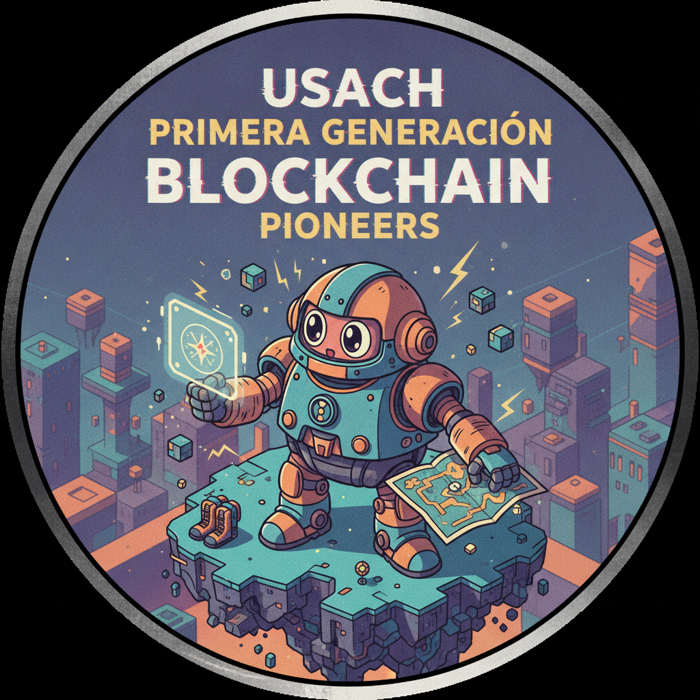

---

## Análisis de Comportamiento del Estudiante y Adopción del Ecosistema

El volumen transaccional consolidado en la blockchain de pruebas evidencia una adopción activa y progresiva del ecosistema descentralizado por parte de la comunidad académica, el registro de 27 estudiantes únicos en el contrato de identidades establece la base de usuarios activos, de los cuales 25 han interactuado de manera recurrente con los demás componentes del sistema, la distribución de 241 insignias de reliquias refleja un avance homogéneo en los primeros desafíos, mostrando una tasa de finalización alta en las tareas introductorias de conexión de billeteras, reclamo del grifo y registro de perfil, lo cual valida la efectividad del diseño de la interfaz y la claridad de las guías integradas.

El despliegue de 115 tokens personalizados a través de la fábrica evidencia la curiosidad técnica y el deseo de los alumnos de explorar la creación de activos propios, no obstante, se observa una disparidad en la configuración del suministro inicial y la posterior inyección de liquidez, donde solo una fracción de los tokens creados posee mercados activos, la creación de 98 piscinas de liquidez en el DEX demuestra un esfuerzo significativo por comprender el funcionamiento de los creadores de mercado automatizados, acumulando un valor total bloqueado de más de 33 unidades de Wrapped Ether que respalda las operaciones de intercambio, los pares con mayor actividad comercial son aquellos vinculados a tokens de uso común y pruebas del profesor, lo cual indica que los estudiantes priorizan la interacción con los mercados de referencia antes de experimentar con sus propios pares comerciales, este comportamiento práctico y estructurado valida la solidez pedagógica del Diplomado USACH en la formación de desarrolladores Web3 competentes.
